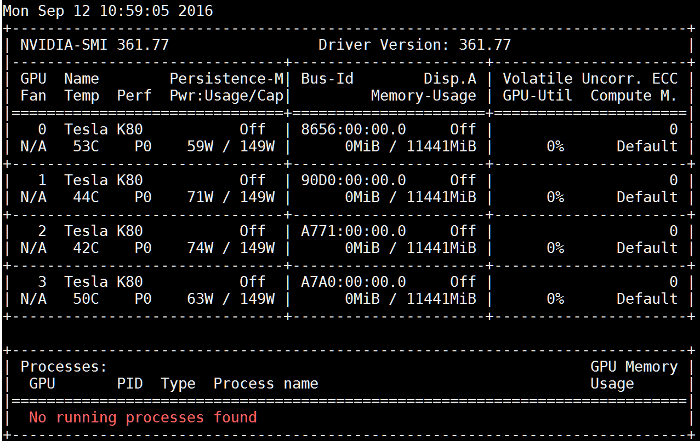
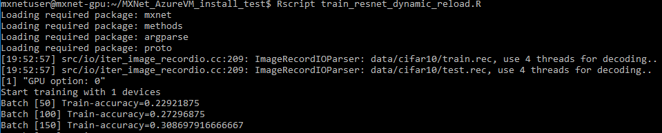
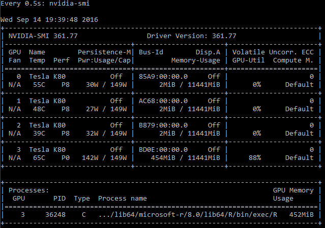
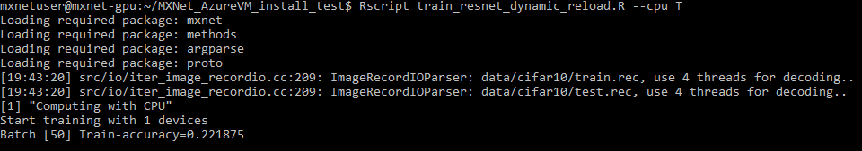
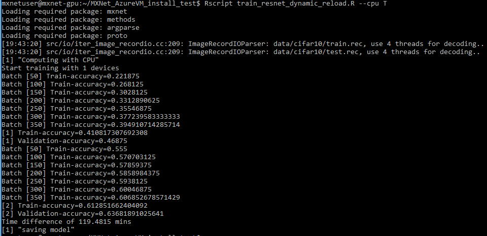
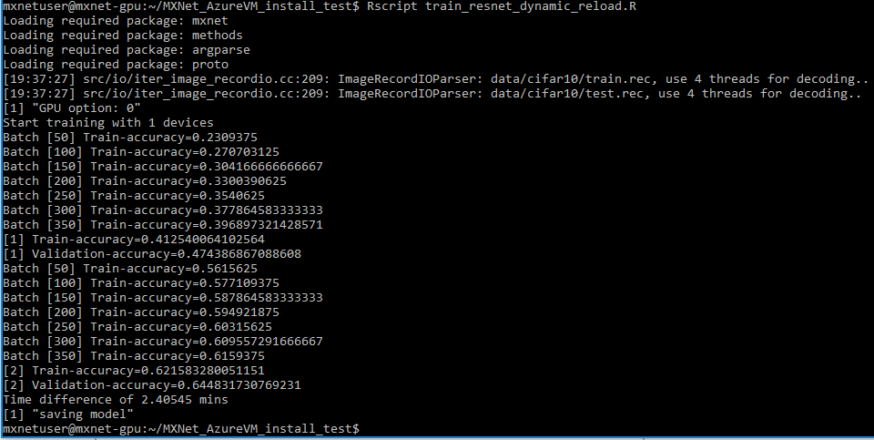

Building Deep Neural Networks in the Cloud with Azure GPU VMs, MXNet and Microsoft R Server
===========================================================================================

Deep learning is a key enabler in the recent breakthroughs in several machine learning applications.  
In computer vision, novel approaches such as [deep residual learning](https://arxiv.org/pdf/1512.03385v1.pdf)
developed at Microsoft Research helped reduce the top-5 classification error at ImageNet competition by
47% in just one year. In speech and machine translation, deep neural networks (DNNs) have already enabled
millions of Skype users to [communicate without language barriers](https://www.microsoft.com/en-us/research/enabling-cross-lingual-conversations-real-time/).

Deep learning is made possible by the availability of large training datasets and compute
acceleration that general purpose graphics processing unit (GPU) offers. Microsoft’s
Azure cloud ecosystem, a scalable and elastic big data platform, recently introduced
advanced GPU support in its N-Series Virtual Machines. These VMs combine powerful
hardware (NVIDIA Tesla K80 or M60 GPUs) with cutting-edge, highly efficient integration
 technologies such as Discrete Device Assignment, bringing a new level of deep learning capability to public clouds.

This tutorial is the first of a series of tutorials that showcases deep learning workflows on Azure.
In this article, we will go over setting up N-Series VMs on Azure with NVIDIA CUDA and cuDNN support.
We use MXNet as an example of deep learning frameworks that can run on Azure.
[MXNet](https://github.com/dmlc/mxnet) is an open-source framework for deep neural networks with support for multiple
languages and platforms that aims to provide both execution efficiency and design flexibility.
In addition, we will also show how [Microsoft R Server](https://www.microsoft.com/en-us/cloud-platform/r-server) can harness the deep learning
capabilities provided by MXNet and GPUs on Azure using simple R scripts.  


1. Preparation
===============

For this tutorial, we will use an [NC24](https://azure.microsoft.com/en-us/blog/azure-n-series-preview-availability/) VM running on Ubuntu 16.04. N-Series
VM sizes are currently under preview and available for select users; you
can register interest at http://gpu.azure.com/. In addition to the
default Ubuntu 16.04 distribution, the following libraries were used:

-   [**CUDA**](https://developer.nvidia.com/cuda-toolkit) - CUDA8.0 RC1 (registration with NVIDIA required). In
    addition to the base package, you also need to download CUDA Patch 1
    from CUDA website. The patch adds support for gcc 5.4 as one of the
    host compilers.

-   [**cuDNN**](https://developer.nvidia.com/cudnn) – cuDNN 5.1 (registration with NVIDIA required).

-   [**Math Kernel Library**](https://software.intel.com/en-us/intel-mkl) (MKL) - MKL 11.3 update 3 (registration with
    Intel required). The serial number and download link will be in
    the email.

-   [**MXNet**](https://github.com/dmlc/mxnet) - We used MXNet commit SHA
    f6fa98d645d2b9871e7ac5f0ad977c1e5af80738 from GitHub (which was the
    latest version of MXNet at the time)

-   [**Microsoft R Server**](https://www.microsoft.com/en/server-cloud/products/r-server/default.aspx) (MRS) - Microsoft R Server 8.0.5
    (registration with Microsoft required). Alternatively, one can
    download Microsoft R Open (MRO) for Ubuntu [here](https://www.microsoft.com/en/server-cloud/products/r-server/default.aspx). Please note that
    while MRS comes with Intel MKL already bundled into the package, MRO
    requires an additional MKL installation from this [link](https://mran.revolutionanalytics.com/download/). Also, while
    MRS and MRO both rely on MKL, a separate MKL installation is
    required to build MXNet. This is because the MKL package for
    Microsoft R only contains shared libraries and not the header files
    which are needed to build external packages like MXNet.

-   [**CIFAR-10 training algorithm**](https://mxnetstorage.blob.core.windows.net/blog1/MXNet_AzureVM_install_test.tar.gz) – test script used to validate MXNet
    installation by training a simple [ResNet](https://arxiv.org/abs/1512.03385) deep neural network on
    [CIFAR-10](https://www.cs.toronto.edu/~kriz/cifar.html) dataset.


2. Installation
===============

In this section, we provide step-by-step instructions to install all
components discussed earlier with their dependencies. The installation
can be completed in an hour or less. It is also important to note that
you can ["copy" a configured VM](https://azure.microsoft.com/en-us/documentation/articles/virtual-machines-linux-copy-vm/) for future usage, making the installation
a one-time process. Furthermore, you can create a generalized image of
the configured VM and use it in an ARM template to create similar VMs,
you can learn more about it [here](https://azure.microsoft.com/en-us/documentation/articles/virtual-machines-linux-capture-image/).

We recommend using Ubuntu version 16.04 or later, because it comes ready
with a recent Linux kernel that contains the pass-through driver needed
to recognize the GPU instances (made available to these VMs).

For installation, we assume all the packages (CUDA, cuDNN, MKL and
MXNet) are in the user’s home directory.


  a. The first step is to install the following dependencies (you can
    replace the Python installation with a local Anaconda one later if
    you want to use a different version of Python):

  ``` bash
    sudo apt-get install -y libatlas-base-dev libopencv-dev libprotoc-dev python-numpy python-scipy make unzip git gcc g++ libcurl4-openssl-dev libssl-dev
  ```
  followed by update to alternatives for cc:
  ```bash
  sudo update-alternatives --install /usr/bin/cc cc /usr/bin/gcc 50
  ```

  b. Install downloaded CUDA driver:
  ```bash
    chmod 755 cuda_8.0.27_linux.run
    sudo ./cuda_8.0.27_linux.run --override
  ```
  During installation, select the following options when prompted:

  ```bash
-   Install NVIDIA Accelerated Graphics Driver for Linux-x86_64 361.77? - Yes

-   Do you want to install the OpenGL libraries? - Yes

-   Do you want to run nvidia-xconfig? – this is not necessary for this article.

-   Install the CUDA 8.0 Toolkit? – Yes

-   Enter Toolkit Location [default is /usr/local/cuda-8.0] - Select Default

-   Do you want to install a symbolic link at /usr/local/cuda? – Yes

-   Install the CUDA 8.0 Samples? - they are not needed for this article.
```
c.  Next, run the cuda patch 1 that you downloaded above, to support gcc 5.4 as host compiler
  ``` bash
      sudo ./cuda_8.0.27.1_linux.run
  ```
   Select the same options as in the previous step – default location for toolkit installation should be the same. Next, update alternatives for nvcc:
 ```bash
    sudo update-alternatives --install /usr/bin/nvcc nvcc /usr/bin/gcc 50
  ```
At this point, running the nvidia-smi command, a GPU management and monitoring tool
 that is part of the CUDA package, should result in something like the following
 screenshot. We recommend enabling the persistence mode for this utility before
 you run the actual command
 ```bash
sudo nvidia-smi -pm 1
nvidia-smi
 ```

 

d.  Install downloaded cuDNN and create a symbolic link for cudnn.h
    header file:
```bash
tar xvzf cudnn-8.0-linux-x64-v5.1.tgz
sudo mv cuda /usr/local/cudnn
sudo ln -s /usr/local/cudnn/include/cudnn.h /usr/local/cuda/include/cudnn.h
```
e.  Install MKL:
```bash
tar xvzf l_mkl_11.3.3.210.tgz
sudo ./l_mkl_11.3.3.210/install.sh
```
Follow the prompt and enter the MKL serial number that you received in the email from intel. The default installation location is /opt/intel - you’ll need this for the next step.

f.  Install and build MXNet:

First, get MXNet code from its GitHub repository (we tested the version with SHA f6fa98d645d2b9871e7ac5f0ad977c1e5af80738). For convenience, we will refer to MXNet directory path on your disk as *MXNET_HOME*.

```bash
git clone --recursive https://github.com/dmlc/mxnet
cd mxnet
git checkout f6fa98d645d2b9871e7ac5f0ad977c1e5af80738
cp make/config.mk .
```

Also, please note that MXNet repo has the following submodules – we list the SHAs for each submodule below:

```bash
dmlc-core:  c33865feec034f1bc6ef9ec246a1ee95ac7ff148
mshadow:    db4c01523e8d95277eae3bb52eb12260b46d6e03
ps-lite:    36b015ffd51c0f7062bba845f01164c0433dc6b3
```
You can revert each submodule by going to its folder and running the same *"git checkout &lt;SHA&gt;"* command.

Please note that we’re using the checkout mechanism, which means that you can either go back to current MXNet state after the build, or branch from the state and do your own work going forward.

Next, modify the $MXNET_HOME/config.mk make file to use CUDA, cuDNN and MKL. You need to enable the flags and provide locations of the installed libraries:

```bash
USE_CUDA = 1
USE_CUDA_PATH = /usr/local/cuda
USE_CUDNN = 1

# If MKL is to be used, USE_BLAS and USE_INTEL_PATH should be set as follows
# (you can remove default “atlas” setting and replace it with MKL):

USE_BLAS = mkl
USE_INTELPATH = /opt/intel/

# To enable distributed computing, set:

USE_DIST_KVSTORE = 1
```

Finally, you need to add links to CUDA and cuDNN libraries. You can persist those on the system
by modifying /etc/environment, but since this is a local build, we recommend adding the following
lines to your ~/.bashrc file instead:

```bash
export LD_LIBRARY_PATH=/usr/local/cuda/lib64/:/usr/local/cudnn/lib64/:/opt/intel/compilers_and_libraries_2016.3.210/linux/compiler/lib/intel64_lin/:$LD_LIBRARY_PATH
export LIBRARY\_PATH=/usr/local/cudnn/lib64/
```

Now it is time to build – you can type “bash” in the current prompt to apply the aforementioned
changes to .bashrc or open a new terminal or simply re-type the above export commands into the
current terminal.

Next, if you want to build in parallel, use the –j option as follows from MXNET_HOME:

```bash
  make –j${nproc}
```
 g.  To install MRS, follow these steps:

 ```bash
tar xvzf en_microsoft_r_server_for_linux_x64_8944657.tar.gz
cd MRS80LINUX
sudo ./install.sh
sudo mv /usr/lib64/microsoft-r/8.0/lib64/R/deps/libstdc++.so.6 /tmp
sudo mv /usr/lib64/microsoft-r/8.0/lib64/R/deps/libgomp.so.1 /tmp
```

To add MXNet library into MRS, first add the following two lines to /etc/ld.so.conf:
```bash
/usr/local/cuda/lib64/
/usr/local/cudnn/lib64/
```

followed by reconfiguring dynamic linker run-time bindings:

```bash
sudo ldconfig
```
Next, make sure you’re again in the *MXNET_HOME* folder and run following commands

```bash
sudo Rscript -e "install.packages('devtools', repo ='https://cran.rstudio.com')"
cd R-package
sudo Rscript -e "install.packages(c('Rcpp', 'DiagrammeR', 'data.table','jsonlite', 'magrittr', 'stringr', 'roxygen2'), repos ='https://cran.rstudio.com')"
cd ..
make rpkg
sudo R CMD INSTALL mxnet_0.7.tar.gz
```

We now have a functional VM installed with MXNet, MRS and GPU. As we
suggested earlier, you can [“copy”]((https://azure.microsoft.com/en-us/documentation/articles/virtual-machines-linux-copy-vm/) this VM for use in the future so the
installation process does not need to be repeated.

Troubleshooting
---------------

Here is some information in case you see some error messages:

1.  **Build error with im2rec:** If that’s the case, the easiest
    thing to do is to disable it in "$MXNET_HOME/Makefile" by commenting
    out the line "BIN += bin/im2rec".

2.  **MKL not linking correctly**: The default root of the MKL
    installation is “/opt/intel”. If you install MKL in a different
    location, you should specify in "$MXNET_HOME/config.mk". Note the
    path should point to the parent directory and not the MKL folder.

3.  **Library linking errors during MXNet compilation:** Make sure that
    LD_LIBRARY_PATH is set correctly as specified earlier (Azure GPU
    VMs come with blank LD_LIBRARY_PATH by default).

3. Test Drive
=============

Now it’s time to build some deep neural networks! Here, we use the
[CIFAR-10 problem and dataset](https://www.cs.toronto.edu/~kriz/cifar.html) as an example. This is a 10-class
classification problem, and the dataset has 60,000 color images (6,000
images per class). We published a simple [CIFAR-10 training algorithm](https://mxnetstorage.blob.core.windows.net/blog1/MXNet_AzureVM_install_test.tar.gz)
which can be executed from either MRS or MRO. You should first install a
few dependencies which don’t come standard with MRS:

```bash
sudo Rscript -e "install.packages('argparse', repo = 'https://cran.rstudio.com')"
```

Now you can run the following command from the extracted folder:

```bash
Rscript train_resnet_dynamic_reload.R
```
You should see output which is similar to the screenshot below:



You can monitor GPU utilization using “watch -n 0.5 nvidia-smi” command,
which should result in something like the following (and refreshed twice
a second):



In the screenshot above, we can see that the training is taking place on GPU  #3.

If you are curious how to train the same model without GPU, simply
change the default training context by adding “--cpu T”, which should
produce a similar output (we also highly recommend Linux “htop” utility
for monitoring CPU usage):



In this case, training for 2 Epochs using CPU completes in 119.5
minutes:



As a comparison, training for the same 2 Epochs with GPU completes in
2.4 minutes as shown below. By using GPU, we have achieved 50x speedup
in this example.



4.  Some More Details about Training on CPU vs GPU
    ==============================================

    Now that we have trained an MXNet model using both GPU and CPU, here
    is some more behind-the-scene information about how computation is
    done at each setup.

CPU
---

When training using CPU, Intel Math Kernel library provides great
speedup in basic linear algebra operations required for Deep Learning;
other libraries which can be used in its place are ATLAS and OpenBLAS.

Another important library which MXNet utilizes under the hood is [OpenMP](http://openmp.org/wp/),
which allows multithreading of C/C++ programs without too much effort
from the developer. By adding #pragma directives to make loops
parallel, developers can avoid managing threads explicitly.

Finally, since deep learning is commonly used in the vision domain,
OpenCV vision library is also required. This library automates most
computer vision tasks, which MXNet relies heavily on for pre-processing.

GPU
---

Convolutional operations found in deep neural networks are traditionally
very slow to execute on CPUs. GPUs are great at accelerating these types
of operations and other linear algebra routines required to train deep
neural networks.

[CUDA](https://developer.nvidia.com/cuda-zone) is the primary platform
which allows programing GPU operations from within C/C++ code on an
NVIDIA GPU. NVIDIA also provides the
[cuDNN](https://developer.nvidia.com/cudnn) library which is more
specialized for accelerating specific deep learning operations on the
GPU. Both libraries accelerate MXNet operations directly on the GPU.
Azure GPU-enabled VMs have minimal GPU virtualization overhead.

Summary
=======

In this tutorial, we demonstrated how to quickly install and configure
MXNet on an Azure N-Series VM equipped with NVIDIA Tesla K80 GPUs. We
showed how to run MXNet training workload from Microsoft R Server using
GPU, achieving significant speedups compared to the CPU-only solution.
In the next tutorial, we will discuss a more comprehensive deep learning
workflow that includes accelerated training on Azure GPU VMs, scalable
scoring on [HDInsight](https://azure.microsoft.com/en-us/services/hdinsight/) that integrates with Microsoft R Server and Apache
Spark, accessing data on [Azure Data Lake Store](https://azure.microsoft.com/en-us/services/data-lake-store/). We presented the
above work at the Microsoft Data Science Summit in Atlanta, GA, you can check it out [here](https://channel9.msdn.com/Events/Machine-Learning-and-Data-Sciences-Conference/Data-Science-Summit-2016/MSDSS21)
