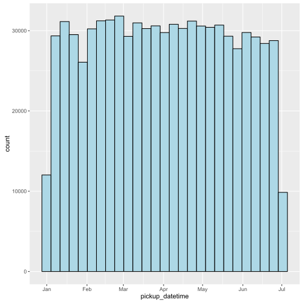
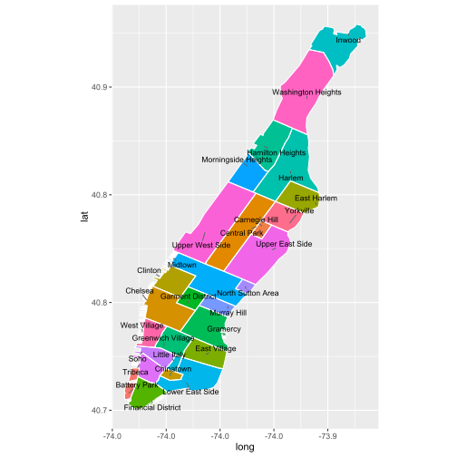
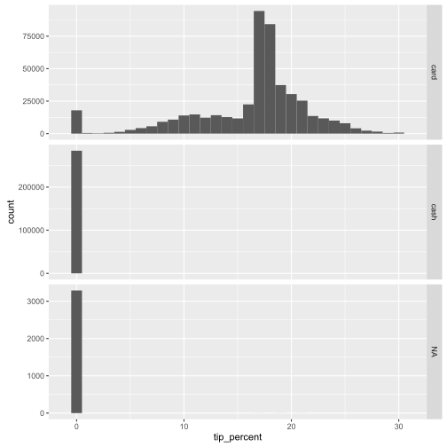
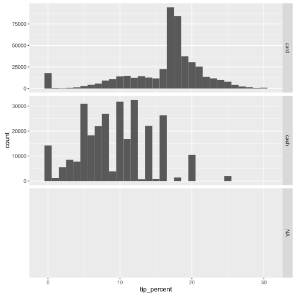

# R for SAS Users

*R for SAS Users* is designed to help experienced SAS users learn to process, query, transform and summarize data with R. This course takes a use-case-based approach to walk through the knowledge discovery and data mining process using R. This course has no prerequisites.  While we do not cover Microsoft R Server (MRS) during this course, a secondary goal of the course is to prepare users for MRS and its set of tools and capabilities for scalable big data-processing and analytics.  This course covers all the requirements to prepare users for MRS training, although we recommend spacing out this course and the *MRS for SAS Users* course to give participants time to absorb the material.

After completing this course, participants will be able to use R in order to:
1.	Read and process flat files (CSV) using R
2.	Clean and prepare data for analysis
3.	Create new features
4.	Visualize, explore, and summarize data

While we occasionally draw certain parallels between SAS and R, this course does not teach a user to do a line-by-line (or chunk-by-chunk) conversion of SAS code to R code.  Instead, by covering a thorough use-case, we attempt to show how to use R and what best practices to follow.  At the end of the course, users should have a solid understanding of how to use R to process and analyze data, and compare and contrast R and SAS in how they deal with data.  But there is no doubt that migration legacy code from SAS to R is a challenging task.

## Section 0: Course overview

Welcome to a practical introduction to R. This course targets users who are either new to R or have been using R for a while but come from a statistician/analyst background (including most SAS users), as opposed to a programmer/CS background (such as an experienced Python/Ruby/Java user).  At a high level this is what we cover:

  - Section 1: importing data
  - Section 2: querying data
  - Section 3: cleaning data
  - Section 4: redo and optimize
  - Section 5: creating new features
  - Section 6: data summary and analysis
    - Subsection 1: statistical summaries
    - Subsection 2: data summary with `base` R
    - Subsection 3: data summary with `dplyr`

At a deeper level, the course is a deep-dive R programming course.  The goal of the course is to learn about programming in R by working on a specific data analysis project.  In other words, we will learn about

  - data types in R
  - control flow
  - important R functions
  - writing R efficient functions
  - debugging/benchmarking/profiling in R
  - using third-party packages
    
and more, but we will do so **in the context of doing data analysis**.  This is what makes the course a *practical* introduction to R, as opposed to a *programmatic* introduction to R where users learn programming concepts 'in a vacuum'.  The latter is better-suited for strong programmers (in a general-purpose language like Python or Java) and just need to see the R syntax and its quirks.

In addition to the above stated goal, this course is also intended to *prepare* users who wish to extend their R skills to the Microsoft R Server (MRS) `RevoScaleR` package.  Through its `RevoScaleR` library, MRS offers a set of tools for big-data analytics in a distributed computing environment (such as a multicore single server, a Hadoop or Spark cluster, or inside a database like SQL Server).  For all intents and purposes, this course can be thought of as a prerequisite for MRS: while MRS is **not** covered in this course, the content we cover is important to users who advance onto the MRS course.  After all, a strong MRS programmer is first and foremost a strong R programmer.

### Course prerequisites

We assume very little knowledge of R for this course.  However, we strongly encourage the user to learn the basics of R before starting the course.  In particular, familiarity with the following is highly recommended:
  1. Basic data-types in R
  2. Installing and loading R packages
  3. Using a good IDE like [RStudio](https://www.rstudio.com/products/RStudio/) or [RTVS](https://www.visualstudio.com/en-us/features/rtvs-vs.aspx) (R Tools for Visual Studio)
  4. Looking up documentation or examples of how to use a specific R function
  5. Familiarity with some basic programming terminology, such as functions, arguments, variables, loops, etc.
  
We cover item (1) throughout the course, but a basic familiarity with data-types can make the content easier to digest.  Learning item (2) is relatively easy, although the GIS packages we use (`rgeos` especially) may have OS-specific dependencies for Linux-based systems. Finally, item (3) is absolutely essetial: knowing our way around an IDE can make it far easier to learn an interpreted language such as R. Finally, item (4) can be as easy as looking at the official help page for a function, or it can involve navigating our way around the many websites and blogs with code examples in R.  There are many helpful tutorials on Youtube or other places to get started with R, so we leave it up to the user to find such resources.

We use [Jupyter notebooks](http://jupyter.org/) to teach this course.  Jupyter notebooks have the advantage of being interactive: we can run the R code from inside the notebook by just selecting the cell with the code and pressing **Shift+Enter**.  This means we can run the code immediately on the R server that hosts the notebook and the data.  Notebooks are a great way to expose R code to users through the browser and collaborate with others, but as of yet they lack many of the functionalities of full-fledged IDEs.  So we can make small changes to the code and rerun a cell, but if we need to develop R code from scratch or debug a code chunk we are better off using an IDE like the two mentioned above.

### Lab exercises

There are many lab exercises included in this course.  We strongly encourage the participants to attempt the exercises before going over the solution.  Most of the exercises are challenging for a good reason: the purpose of the exercises is not always to confirm or strengthen what has been learned, but rather to set the tone for what is about to be learned.  The intent is to get users to **think like an R programmer** and explore R functions by running different examples and then figuring out how to build upon them.  Over time, this approach will pay off.

### The dataset

The dataset we use for this course is a **sample** of the [NYC Taxi](http://www.nyc.gov/html/tlc/html/about/trip_record_data.shtml) dataset.  The dataset includes trip records from trips completed in yellow taxis in New York City for a given time period. Each trip has information about pick-up and drop-off dates/times, pick-up and drop-off locations, trip distances, itemized fares, rate types, payment types, and passenger counts.  The sample covers a very small (less than 5 percent) subset of trips ranging from January 1 to June 30, 2015.

### R packages

Like any serious data analysis project with R, this course does not shy away from using R packages.  Some packages such as the `dplyr` package are more extensively covered, as they are relevant to the topic at hand.  Other packages such as `ggplot2` or `rgeos` are not covered in great depth, since data visualization and GIS functions would take us too far outside the scope of the course.  Instead, we provide well-commented examples of functionalities within those packages and invite the user to delve deeper on their own time.

We are now ready to begin.  Let's start by loading the required libraries we use throughout the course.  We reload these libraries later when we run the functions inside them, but putting them at the top of the project gives us a chance to see all of them in one place, and install any libraries we don't already have.


```R
# install.packages(c('dplyr', 'stringr', 'lubridate', 'ggplot2', 'ggrepel', 
#                    'tidyr', 'seriation', 'profr', 'microbenchmark', 
#                    'rgeos', 'sp', 'maptools'))
```


```R
# let's set some options for how things look on the console
options(max.print = 1000, # limit how much data is shown on the console
        scipen = 999, # don't use scientific notation for numbers
        width = 80, # width of the screen should be 80 characters long
        digits = 3, # round all numbers to 3 decimal places when displaying them
        warn = -1) # suppress warnings (you normally don't do this in development!)

library(dplyr) # for fast data manipulation/processing/summarizing
options(dplyr.print_max = 20) # limit how much data `dplyr` shows by default
options(dplyr.width = Inf) # make `dplyr` show all columns of a dataset
library(stringr) # for working with strings
library(lubridate) # for working with date variables
Sys.setenv(TZ = "US/Eastern") # not important for this dataset

library(ggplot2) # for creating plots
library(ggrepel) # avoid text overlap in plots
library(tidyr) # for reshaping data
library(seriation) # package for reordering a distance matrix

# three GIS libraries
library(rgeos)
library(sp)
library(maptools)

library(profr) # profiling tool
library(microbenchmark) # benchmarking tool
```

In the next chapter, we deal with our first challenge: loading the data into R.

## Section 1: Loading data into R

The process of loading data into R changes based on the kind of data. The standard format for data is tabular.  A CSV file is an example of tabular data.  Assuming that our CSV file is "clean", we should be able to read the file using the `read.csv` function.  Here are examples of what we mean by "clean" data for a CSV file:

  - column headers are at the top
  - rows all have an equal number of cells, with two adjacent commas representing an empty cell
  - file only contains the data, with all other metadata stored in a separate file referred to as the **data dictionary**

We use the `readLines` function in R to print the first few lines of the data.  This can serve as a starting point for examining the data.


```R
setwd('C:/Data/NYC_taxi')

data_path <- 'NYC_sample.csv'
readLines(file(data_path), n = 3) # print the first 3 lines of the file
```


<ol class=list-inline>
	<li>"\"VendorID\",\"tpep_pickup_datetime\",\"tpep_dropoff_datetime\",\"passenger_count\",\"trip_distance\",\"pickup_longitude\",\"pickup_latitude\",\"RateCodeID\",\"store_and_fwd_flag\",\"dropoff_longitude\",\"dropoff_latitude\",\"payment_type\",\"fare_amount\",\"extra\",\"mta_tax\",\"tip_amount\",\"tolls_amount\",\"improvement_surcharge\",\"total_amount\",\"u\""</li>
	<li>"\"1\",\"2015-01-15 09:47:05\",\"2015-01-15 09:48:54\",1,0.5,-73.9620056152344,40.7595901489258,\"1\",\"N\",-73.9568328857422,40.7649002075195,\"1\",3.5,0,0.5,1,0,0,5,0.00725185964256525"</li>
	<li>"\"2\",\"2015-01-08 16:24:00\",\"2015-01-08 16:36:47\",1,1.88,-73.949951171875,40.8017921447754,\"1\",\"N\",-73.9571914672852,40.7804374694824,\"1\",10,1,0.5,2.2,0,0.3,14,0.000565606402233243"</li>
</ol>


Before we run `read.csv` to load the data into R, let's inspect it more closely by looking at the R help documentation:


```R
?read.csv
```


<table width="100%" summary="page for read.table {utils}"><tr><td>read.table {utils}</td><td style="text-align: right;">R Documentation</td></tr></table>

<h2>Data Input</h2>

<h3>Description</h3>

<p>Reads a file in table format and creates a data frame from it, with
cases corresponding to lines and variables to fields in the file.
</p>


<h3>Usage</h3>

<pre>
read.table(file, header = FALSE, sep = "", quote = "\"'",
           dec = ".", numerals = c("allow.loss", "warn.loss", "no.loss"),
           row.names, col.names, as.is = !stringsAsFactors,
           na.strings = "NA", colClasses = NA, nrows = -1,
           skip = 0, check.names = TRUE, fill = !blank.lines.skip,
           strip.white = FALSE, blank.lines.skip = TRUE,
           comment.char = "#",
           allowEscapes = FALSE, flush = FALSE,
           stringsAsFactors = default.stringsAsFactors(),
           fileEncoding = "", encoding = "unknown", text, skipNul = FALSE)

read.csv(file, header = TRUE, sep = ",", quote = "\"",
         dec = ".", fill = TRUE, comment.char = "", ...)

read.csv2(file, header = TRUE, sep = ";", quote = "\"",
          dec = ",", fill = TRUE, comment.char = "", ...)

read.delim(file, header = TRUE, sep = "\t", quote = "\"",
           dec = ".", fill = TRUE, comment.char = "", ...)

read.delim2(file, header = TRUE, sep = "\t", quote = "\"",
            dec = ",", fill = TRUE, comment.char = "", ...)
</pre>


<h3>Arguments</h3>

<table summary="R argblock">
<tr valign="top"><td><code>file</code></td>
<td>
<p>the name of the file which the data are to be read from.
Each row of the table appears as one line of the file.  If it does
not contain an <em>absolute</em> path, the file name is
<em>relative</em> to the current working directory,
<code>getwd()</code>. Tilde-expansion is performed where supported.
This can be a compressed file (see <code>file</code>).
</p>
<p>Alternatively, <code>file</code> can be a readable text-mode
connection (which will be opened for reading if
necessary, and if so <code>close</code>d (and hence destroyed) at
the end of the function call).  (If <code>stdin()</code> is used,
the prompts for lines may be somewhat confusing.  Terminate input
with a blank line or an EOF signal, <code>Ctrl-D</code> on Unix and
<code>Ctrl-Z</code> on Windows.  Any pushback on <code>stdin()</code> will be
cleared before return.)
</p>
<p><code>file</code> can also be a complete URL.  (For the supported URL
schemes, see the &lsquo;URLs&rsquo; section of the help for
<code>url</code>.)
</p>
</td></tr>
<tr valign="top"><td><code>header</code></td>
<td>
<p>a logical value indicating whether the file contains the
names of the variables as its first line.  If missing, the value is
determined from the file format: <code>header</code> is set to <code>TRUE</code>
if and only if the first row contains one fewer field than the
number of columns.</p>
</td></tr>
<tr valign="top"><td><code>sep</code></td>
<td>
<p>the field separator character.  Values on each line of the
file are separated by this character.  If <code>sep = ""</code> (the
default for <code>read.table</code>) the separator is &lsquo;white space&rsquo;,
that is one or more spaces, tabs, newlines or carriage returns.</p>
</td></tr>
<tr valign="top"><td><code>quote</code></td>
<td>
<p>the set of quoting characters. To disable quoting
altogether, use <code>quote = ""</code>.  See <code>scan</code> for the
behaviour on quotes embedded in quotes.  Quoting is only considered
for columns read as character, which is all of them unless
<code>colClasses</code> is specified.</p>
</td></tr>
<tr valign="top"><td><code>dec</code></td>
<td>
<p>the character used in the file for decimal points.</p>
</td></tr>
<tr valign="top"><td><code>numerals</code></td>
<td>
<p>string indicating how to convert numbers whose conversion
to double precision would lose accuracy, see <code>type.convert</code>.
Can be abbreviated.</p>
</td></tr>
<tr valign="top"><td><code>row.names</code></td>
<td>
<p>a vector of row names.  This can be a vector giving
the actual row names, or a single number giving the column of the
table which contains the row names, or character string giving the
name of the table column containing the row names.
</p>
<p>If there is a header and the first row contains one fewer field than
the number of columns, the first column in the input is used for the
row names.  Otherwise if <code>row.names</code> is missing, the rows are
numbered.
</p>
<p>Using <code>row.names = NULL</code> forces row numbering. Missing or
<code>NULL</code> <code>row.names</code> generate row names that are considered
to be &lsquo;automatic&rsquo; (and not preserved by <code>as.matrix</code>).
</p>
</td></tr>
<tr valign="top"><td><code>col.names</code></td>
<td>
<p>a vector of optional names for the variables.
The default is to use <code>"V"</code> followed by the column number.</p>
</td></tr>
<tr valign="top"><td><code>as.is</code></td>
<td>
<p>the default behavior of <code>read.table</code> is to convert
character variables (which are not converted to logical, numeric or
complex) to factors.  The variable <code>as.is</code> controls the
conversion of columns not otherwise specified by <code>colClasses</code>.
Its value is either a vector of logicals (values are recycled if
necessary), or a vector of numeric or character indices which
specify which columns should not be converted to factors.
</p>
<p>Note: to suppress all conversions including those of numeric
columns, set <code>colClasses = "character"</code>.
</p>
<p>Note that <code>as.is</code> is specified per column (not per
variable) and so includes the column of row names (if any) and any
columns to be skipped.
</p>
</td></tr>
<tr valign="top"><td><code>na.strings</code></td>
<td>
<p>a character vector of strings which are to be
interpreted as <code>NA</code> values.  Blank fields are also
considered to be missing values in logical, integer, numeric and
complex fields.</p>
</td></tr>
<tr valign="top"><td><code>colClasses</code></td>
<td>
<p>character.  A vector of classes to be assumed for
the columns.  Recycled as necessary.  If named and shorter than
required, names are matched to the column names with unspecified
values are taken to be <code>NA</code>.
</p>
<p>Possible values are <code>NA</code> (the default, when
<code>type.convert</code> is used), <code>"NULL"</code> (when the column
is skipped), one of the atomic vector classes (logical, integer,
numeric, complex, character, raw), or <code>"factor"</code>, <code>"Date"</code>
or <code>"POSIXct"</code>.  Otherwise there needs to be an <code>as</code>
method (from package <span class="pkg">methods</span>) for conversion from
<code>"character"</code> to the specified formal class.
</p>
<p>Note that <code>colClasses</code> is specified per column (not per
variable) and so includes the column of row names (if any).
</p>
</td></tr>
<tr valign="top"><td><code>nrows</code></td>
<td>
<p>integer: the maximum number of rows to read in.  Negative
and other invalid values are ignored.</p>
</td></tr>
<tr valign="top"><td><code>skip</code></td>
<td>
<p>integer: the number of lines of the data file to skip before
beginning to read data.</p>
</td></tr>
<tr valign="top"><td><code>check.names</code></td>
<td>
<p>logical.  If <code>TRUE</code> then the names of the
variables in the data frame are checked to ensure that they are
syntactically valid variable names.  If necessary they are adjusted
(by <code>make.names</code>) so that they are, and also to ensure
that there are no duplicates.</p>
</td></tr>
<tr valign="top"><td><code>fill</code></td>
<td>
<p>logical. If <code>TRUE</code> then in case the rows have unequal
length, blank fields are implicitly added.  See &lsquo;Details&rsquo;.</p>
</td></tr>
<tr valign="top"><td><code>strip.white</code></td>
<td>
<p>logical. Used only when <code>sep</code> has
been specified, and allows the stripping of leading and trailing
white space from unquoted <code>character</code> fields (<code>numeric</code> fields
are always stripped).  See <code>scan</code> for further details
(including the exact meaning of &lsquo;white space&rsquo;),
remembering that the columns may include the row names.</p>
</td></tr>
<tr valign="top"><td><code>blank.lines.skip</code></td>
<td>
<p>logical: if <code>TRUE</code> blank lines in the
input are ignored.</p>
</td></tr>
<tr valign="top"><td><code>comment.char</code></td>
<td>
<p>character: a character vector of length one
containing a single character or an empty string.  Use <code>""</code> to
turn off the interpretation of comments altogether.</p>
</td></tr>
<tr valign="top"><td><code>allowEscapes</code></td>
<td>
<p>logical.  Should C-style escapes such as
<span class="samp">\n</span> be processed or read verbatim (the default)?   Note that if
not within quotes these could be interpreted as a delimiter (but not
as a comment character).  For more details see <code>scan</code>.</p>
</td></tr>
<tr valign="top"><td><code>flush</code></td>
<td>
<p>logical: if <code>TRUE</code>, <code>scan</code> will flush to the
end of the line after reading the last of the fields requested.
This allows putting comments after the last field.</p>
</td></tr>
<tr valign="top"><td><code>stringsAsFactors</code></td>
<td>
<p>logical: should character vectors be converted
to factors?  Note that this is overridden by <code>as.is</code> and
<code>colClasses</code>, both of which allow finer control.</p>
</td></tr>
<tr valign="top"><td><code>fileEncoding</code></td>
<td>
<p>character string: if non-empty declares the
encoding used on a file (not a connection) so the character data can
be re-encoded.  See the &lsquo;Encoding&rsquo; section of the help for
<code>file</code>, the &lsquo;R Data Import/Export Manual&rsquo; and
&lsquo;Note&rsquo;.
</p>
</td></tr>
<tr valign="top"><td><code>encoding</code></td>
<td>
<p>encoding to be assumed for input strings.  It is
used to mark character strings as known to be in
Latin-1 or UTF-8 (see <code>Encoding</code>): it is not used to
re-encode the input, but allows <span style="font-family: Courier New, Courier; color: #666666;"><b>R</b></span> to handle encoded strings in
their native encoding (if one of those two).  See &lsquo;Value&rsquo;
and &lsquo;Note&rsquo;.
</p>
</td></tr>
<tr valign="top"><td><code>text</code></td>
<td>
<p>character string: if <code>file</code> is not supplied and this is,
then data are read from the value of <code>text</code> via a text connection.
Notice that a literal string can be used to include (small) data sets
within R code.
</p>
</td></tr>
<tr valign="top"><td><code>skipNul</code></td>
<td>
<p>logical: should nuls be skipped?</p>
</td></tr>
<tr valign="top"><td><code>...</code></td>
<td>
<p>Further arguments to be passed to <code>read.table</code>.</p>
</td></tr>
</table>


<h3>Details</h3>

<p>This function is the principal means of reading tabular data into <span style="font-family: Courier New, Courier; color: #666666;"><b>R</b></span>.
</p>
<p>Unless <code>colClasses</code> is specified, all columns are read as
character columns and then converted using <code>type.convert</code>
to logical, integer, numeric, complex or (depending on <code>as.is</code>)
factor as appropriate.  Quotes are (by default) interpreted in all
fields, so a column of values like <code>"42"</code> will result in an
integer column.
</p>
<p>A field or line is &lsquo;blank&rsquo; if it contains nothing (except
whitespace if no separator is specified) before a comment character or
the end of the field or line.
</p>
<p>If <code>row.names</code> is not specified and the header line has one less
entry than the number of columns, the first column is taken to be the
row names.  This allows data frames to be read in from the format in
which they are printed.  If <code>row.names</code> is specified and does
not refer to the first column, that column is discarded from such files.
</p>
<p>The number of data columns is determined by looking at the first five lines
of input (or the whole file if it has less than five lines), or from
the length of <code>col.names</code> if it is specified and
is longer.  This could conceivably be wrong if <code>fill</code> or
<code>blank.lines.skip</code> are true, so specify <code>col.names</code> if
necessary (as in the &lsquo;Examples&rsquo;).
</p>
<p><code>read.csv</code> and <code>read.csv2</code> are identical to
<code>read.table</code> except for the defaults.  They are intended for
reading &lsquo;comma separated value&rsquo; files (&lsquo;<span class="file">.csv</span>&rsquo;) or
(<code>read.csv2</code>) the variant used in countries that use a comma as
decimal point and a semicolon as field separator.  Similarly,
<code>read.delim</code> and <code>read.delim2</code> are for reading delimited
files, defaulting to the TAB character for the delimiter.  Notice that
<code>header = TRUE</code> and <code>fill = TRUE</code> in these variants, and
that the comment character is disabled.
</p>
<p>The rest of the line after a comment character is skipped; quotes
are not processed in comments.  Complete comment lines are allowed
provided <code>blank.lines.skip = TRUE</code>; however, comment lines prior
to the header must have the comment character in the first non-blank
column.
</p>
<p>Quoted fields with embedded newlines are supported except after a
comment character.  Embedded nuls are unsupported: skipping them (with
<code>skipNul = TRUE</code>) may work.
</p>


<h3>Value</h3>

<p>A data frame (<code>data.frame</code>) containing a representation of
the data in the file.
</p>
<p>Empty input is an error unless <code>col.names</code> is specified, when a
0-row data frame is returned: similarly giving just a header line if
<code>header = TRUE</code> results in a 0-row data frame.  Note that in
either case the columns will be logical unless <code>colClasses</code> was
supplied.
</p>
<p>Character strings in the result (including factor levels) will have a
declared encoding if <code>encoding</code> is <code>"latin1"</code> or
<code>"UTF-8"</code>.
</p>


<h3>Memory usage</h3>

<p>These functions can use a surprising amount of memory when reading
large files.  There is extensive discussion in the &lsquo;R Data
Import/Export&rsquo; manual, supplementing the notes here.
</p>
<p>Less memory will be used if <code>colClasses</code> is specified as one of
the six atomic vector classes.  This can be particularly so when
reading a column that takes many distinct numeric values, as storing
each distinct value as a character string can take up to 14 times as
much memory as storing it as an integer.
</p>
<p>Using <code>nrows</code>, even as a mild over-estimate, will help memory
usage.
</p>
<p>Using <code>comment.char = ""</code> will be appreciably faster than the
<code>read.table</code> default.
</p>
<p><code>read.table</code> is not the right tool for reading large matrices,
especially those with many columns: it is designed to read
<em>data frames</em> which may have columns of very different classes.
Use <code>scan</code> instead for matrices.
</p>


<h3>Note</h3>

<p>The columns referred to in <code>as.is</code> and <code>colClasses</code> include
the column of row names (if any).
</p>
<p>There are two approaches for reading input that is not in the local
encoding.  If the input is known to be UTF-8 or Latin1, use the
<code>encoding</code> argument to declare that.  If the input is in some
other encoding, then it may be translated on input.  The <code>fileEncoding</code>
argument achieves this by setting up a connection to do the re-encoding
into the current locale.  Note that on Windows or other systems not running
in a UTF-8 locale, this may not be possible.
</p>


<h3>References</h3>

<p>Chambers, J. M. (1992)
<em>Data for models.</em>
Chapter 3 of <em>Statistical Models in S</em>
eds J. M. Chambers and T. J. Hastie, Wadsworth &amp; Brooks/Cole.
</p>


<h3>See Also</h3>

<p>The &lsquo;R Data Import/Export&rsquo; manual.
</p>
<p><code>scan</code>, <code>type.convert</code>,
<code>read.fwf</code> for reading <em>f</em>ixed <em>w</em>idth
<em>f</em>ormatted input;
<code>write.table</code>;
<code>data.frame</code>.
</p>
<p><code>count.fields</code> can be useful to determine problems with
reading files which result in reports of incorrect record lengths (see
the &lsquo;Examples&rsquo; below).
</p>
<p><a href="http://tools.ietf.org/html/rfc4180">http://tools.ietf.org/html/rfc4180</a> for the IANA definition of
CSV files (which requires comma as separator and CRLF line endings).
</p>


<h3>Examples</h3>

<pre>
## using count.fields to handle unknown maximum number of fields
## when fill = TRUE
test1 &lt;- c(1:5, "6,7", "8,9,10")
tf &lt;- tempfile()
writeLines(test1, tf)

read.csv(tf, fill = TRUE) # 1 column
ncol &lt;- max(count.fields(tf, sep = ","))
read.csv(tf, fill = TRUE, header = FALSE,
         col.names = paste0("V", seq_len(ncol)))
unlink(tf)

## "Inline" data set, using text=
## Notice that leading and trailing empty lines are auto-trimmed

read.table(header = TRUE, text = "
a b
1 2
3 4
")
</pre>

<hr /><div style="text-align: center;">[Package <em>utils</em> version 3.2.2 ]</div>


As we can see from the help page above, `read.csv` is an offshoot of the more general function `read.table` with some of the arguments set to default values appropriate to CSV files (such as `sep = ','` or `header = TRUE`).  There are many arguments in `read.table` worth knowing about, such as (just to name a few)
  - `nrows` for limiting the number of rows we read, 
  - `na.strings` for specifying what defines an NA in a `character` column,  
  - `skip` for skipping a certain number of rows before we start reading the data.

We now run `read.csv`.  Since the dataset we read is relatively large, we time how long it takes to load it into R.  Once all the data is read, we have an object called `nyc_taxi` loaded into the R session.  This object is an R `data.frame`.  We can run a simple query on `nyc_taxi` by passing it to the `head` function.


```R
st <- Sys.time()
nyc_taxi <- read.csv(data_path, stringsAsFactors = FALSE) # we suppress conversion to factors for now
Sys.time() - st
```


    Time difference of 22.1 secs


```R
class(nyc_taxi)
```


"data.frame"


```R
head(nyc_taxi)
```


<table>
<thead><tr><th></th><th scope=col>VendorID</th><th scope=col>tpep_pickup_datetime</th><th scope=col>tpep_dropoff_datetime</th><th scope=col>passenger_count</th><th scope=col>trip_distance</th><th scope=col>pickup_longitude</th><th scope=col>pickup_latitude</th><th scope=col>RateCodeID</th><th scope=col>store_and_fwd_flag</th><th scope=col>dropoff_longitude</th><th scope=col>dropoff_latitude</th><th scope=col>payment_type</th><th scope=col>fare_amount</th><th scope=col>extra</th><th scope=col>mta_tax</th><th scope=col>tip_amount</th><th scope=col>tolls_amount</th><th scope=col>improvement_surcharge</th><th scope=col>total_amount</th><th scope=col>u</th></tr></thead>
<tbody>
	<tr><th scope=row>1</th><td>1</td><td>2015-01-15 09:47:05</td><td>2015-01-15 09:48:54</td><td>1</td><td>0.5</td><td>-74</td><td>40.8</td><td>1</td><td>N</td><td>-74</td><td>40.8</td><td>1</td><td>3.5</td><td>0</td><td>0.5</td><td>1</td><td>0</td><td>0</td><td>5</td><td>0.00725</td></tr>
	<tr><th scope=row>2</th><td>2</td><td>2015-01-08 16:24:00</td><td>2015-01-08 16:36:47</td><td>1</td><td>1.88</td><td>-73.9</td><td>40.8</td><td>1</td><td>N</td><td>-74</td><td>40.8</td><td>1</td><td>10</td><td>1</td><td>0.5</td><td>2.2</td><td>0</td><td>0.3</td><td>14</td><td>0.000566</td></tr>
	<tr><th scope=row>3</th><td>2</td><td>2015-01-28 21:50:16</td><td>2015-01-28 22:09:25</td><td>1</td><td>5.1</td><td>-74</td><td>40.7</td><td>1</td><td>N</td><td>-74</td><td>40.8</td><td>1</td><td>18</td><td>0.5</td><td>0.5</td><td>3.86</td><td>0</td><td>0.3</td><td>23.2</td><td>0.00895</td></tr>
	<tr><th scope=row>4</th><td>2</td><td>2015-01-28 21:50:18</td><td>2015-01-28 22:17:41</td><td>2</td><td>6.76</td><td>-74</td><td>40.8</td><td>1</td><td>N</td><td>-74</td><td>40.7</td><td>1</td><td>24</td><td>0.5</td><td>0.5</td><td>4.9</td><td>0</td><td>0.3</td><td>30.2</td><td>0.00328</td></tr>
	<tr><th scope=row>5</th><td>2</td><td>2015-01-01 05:29:50</td><td>2015-01-01 05:54:13</td><td>1</td><td>17.5</td><td>-74</td><td>40.8</td><td>3</td><td>N</td><td>-74.2</td><td>40.7</td><td>1</td><td>64</td><td>0.5</td><td>0</td><td>1</td><td>16</td><td>0.3</td><td>81.8</td><td>0.00905</td></tr>
	<tr><th scope=row>6</th><td>1</td><td>2015-01-28 10:50:01</td><td>2015-01-28 10:55:55</td><td>1</td><td>0.6</td><td>-74</td><td>40.8</td><td>1</td><td>N</td><td>-74</td><td>40.8</td><td>2</td><td>5.5</td><td>0</td><td>0.5</td><td>0</td><td>0</td><td>0.3</td><td>6.3</td><td>0.00726</td></tr>
</tbody>
</table>


It is important to know that `nyc_taxi` is no longer linked to the original CSV file: The CSV file resides somewhere on disk, but `nyc_taxi` is a **copy** of the CSV file sitting in memory.  Any modifications we make to this file will not be written to the CSV file, or any file on disk, unless we explicitly do so.  Let's begin by comparing the size of the original CSV file with the size of its copy in the R session.


```R
as.numeric(object.size(nyc_taxi)) / 2^20 # size of object in memory (we divide by 2^20 to convert from bytes to megabytes)
```


208.594909667969


```R
file.size(data_path) / 2^20 # size of the original file
```


132.55038356781


As we can see, the object in the memory takes up more space (in memory) than the CSV file does on disk.  Since the amount of available memory on a computer is much smaller than available disk space, for a long time the need to load data in its entirety in the memory imposed a serious limitation on using R with large datasets.  Over the years, machines have been endowed with more CPU power and more memory, but data sizes have grown even more, so fundamentally the problem is still there.  As we become better R programmers, we can learn ways to more efficiently load and process the data, but writing efficient R code is not always easy or even desirable if the resulting code looks hard to read and understand.

Nowadays there are R libraries that provide us with ways to handle large datasets in R quickly and without hogging too much memory.  Microsoft R Server's `RevoScaleR` library is an example of such a package.  `RevoScaleR` is covered in a different course.

With the data loaded into R, we can now set out to examine its content, which is the subject of the next chapter.

## Section 2: Inspecting and querying data

With the data loaded in the R session, we are ready to inspect the data and write some basic queries against it.  The goal of this chapter is to get a feel for the data.  Any exploratory analysis usually consists of the following steps:

  1. load all the data (and combine them if necessary)
  2. **inspect the data in preparation cleaning it**
  3. clean the data in preparation for analysis
  4. add any interesting features or columns as far as they pertain to the analysis
  5. find ways to analyze or summarize the data and report your findings 
  
We are now in step 2, where we intend to introduce some helpful R functions for inspecting the data and write some of our own.  

Most of the time, the above steps are not clearly delineated from each other. For example, one could inspect certain columns of the data, clean them, build new features out of them, and then move on to other columns, thereby iterating on steps 2 through 4 until all the columns are dealt with. This approach is completely valid, but for the sake of teaching the course we prefer to show each step as distinct.

Let's begin the data exploration.  Each of the functions below return some useful information about the data.


```R
head(nyc_taxi) # show me the first few rows
```


<table>
<thead><tr><th></th><th scope=col>VendorID</th><th scope=col>tpep_pickup_datetime</th><th scope=col>tpep_dropoff_datetime</th><th scope=col>passenger_count</th><th scope=col>trip_distance</th><th scope=col>pickup_longitude</th><th scope=col>pickup_latitude</th><th scope=col>RateCodeID</th><th scope=col>store_and_fwd_flag</th><th scope=col>dropoff_longitude</th><th scope=col>dropoff_latitude</th><th scope=col>payment_type</th><th scope=col>fare_amount</th><th scope=col>extra</th><th scope=col>mta_tax</th><th scope=col>tip_amount</th><th scope=col>tolls_amount</th><th scope=col>improvement_surcharge</th><th scope=col>total_amount</th><th scope=col>u</th></tr></thead>
<tbody>
	<tr><th scope=row>1</th><td>1</td><td>2015-01-15 09:47:05</td><td>2015-01-15 09:48:54</td><td>1</td><td>0.5</td><td>-74</td><td>40.8</td><td>1</td><td>N</td><td>-74</td><td>40.8</td><td>1</td><td>3.5</td><td>0</td><td>0.5</td><td>1</td><td>0</td><td>0</td><td>5</td><td>0.00725</td></tr>
	<tr><th scope=row>2</th><td>2</td><td>2015-01-08 16:24:00</td><td>2015-01-08 16:36:47</td><td>1</td><td>1.88</td><td>-73.9</td><td>40.8</td><td>1</td><td>N</td><td>-74</td><td>40.8</td><td>1</td><td>10</td><td>1</td><td>0.5</td><td>2.2</td><td>0</td><td>0.3</td><td>14</td><td>0.000566</td></tr>
	<tr><th scope=row>3</th><td>2</td><td>2015-01-28 21:50:16</td><td>2015-01-28 22:09:25</td><td>1</td><td>5.1</td><td>-74</td><td>40.7</td><td>1</td><td>N</td><td>-74</td><td>40.8</td><td>1</td><td>18</td><td>0.5</td><td>0.5</td><td>3.86</td><td>0</td><td>0.3</td><td>23.2</td><td>0.00895</td></tr>
	<tr><th scope=row>4</th><td>2</td><td>2015-01-28 21:50:18</td><td>2015-01-28 22:17:41</td><td>2</td><td>6.76</td><td>-74</td><td>40.8</td><td>1</td><td>N</td><td>-74</td><td>40.7</td><td>1</td><td>24</td><td>0.5</td><td>0.5</td><td>4.9</td><td>0</td><td>0.3</td><td>30.2</td><td>0.00328</td></tr>
	<tr><th scope=row>5</th><td>2</td><td>2015-01-01 05:29:50</td><td>2015-01-01 05:54:13</td><td>1</td><td>17.5</td><td>-74</td><td>40.8</td><td>3</td><td>N</td><td>-74.2</td><td>40.7</td><td>1</td><td>64</td><td>0.5</td><td>0</td><td>1</td><td>16</td><td>0.3</td><td>81.8</td><td>0.00905</td></tr>
	<tr><th scope=row>6</th><td>1</td><td>2015-01-28 10:50:01</td><td>2015-01-28 10:55:55</td><td>1</td><td>0.6</td><td>-74</td><td>40.8</td><td>1</td><td>N</td><td>-74</td><td>40.8</td><td>2</td><td>5.5</td><td>0</td><td>0.5</td><td>0</td><td>0</td><td>0.3</td><td>6.3</td><td>0.00726</td></tr>
</tbody>
</table>


```R
head(nyc_taxi, n = 20) # show me the first 20 rows
```


<table>
<thead><tr><th></th><th scope=col>VendorID</th><th scope=col>tpep_pickup_datetime</th><th scope=col>tpep_dropoff_datetime</th><th scope=col>passenger_count</th><th scope=col>trip_distance</th><th scope=col>pickup_longitude</th><th scope=col>pickup_latitude</th><th scope=col>RateCodeID</th><th scope=col>store_and_fwd_flag</th><th scope=col>dropoff_longitude</th><th scope=col>dropoff_latitude</th><th scope=col>payment_type</th><th scope=col>fare_amount</th><th scope=col>extra</th><th scope=col>mta_tax</th><th scope=col>tip_amount</th><th scope=col>tolls_amount</th><th scope=col>improvement_surcharge</th><th scope=col>total_amount</th><th scope=col>u</th></tr></thead>
<tbody>
	<tr><th scope=row>1</th><td>1</td><td>2015-01-15 09:47:05</td><td>2015-01-15 09:48:54</td><td>1</td><td>0.5</td><td>-74</td><td>40.8</td><td>1</td><td>N</td><td>-74</td><td>40.8</td><td>1</td><td>3.5</td><td>0</td><td>0.5</td><td>1</td><td>0</td><td>0</td><td>5</td><td>0.00725</td></tr>
	<tr><th scope=row>2</th><td>2</td><td>2015-01-08 16:24:00</td><td>2015-01-08 16:36:47</td><td>1</td><td>1.88</td><td>-73.9</td><td>40.8</td><td>1</td><td>N</td><td>-74</td><td>40.8</td><td>1</td><td>10</td><td>1</td><td>0.5</td><td>2.2</td><td>0</td><td>0.3</td><td>14</td><td>0.000566</td></tr>
	<tr><th scope=row>3</th><td>2</td><td>2015-01-28 21:50:16</td><td>2015-01-28 22:09:25</td><td>1</td><td>5.1</td><td>-74</td><td>40.7</td><td>1</td><td>N</td><td>-74</td><td>40.8</td><td>1</td><td>18</td><td>0.5</td><td>0.5</td><td>3.86</td><td>0</td><td>0.3</td><td>23.2</td><td>0.00895</td></tr>
	<tr><th scope=row>4</th><td>2</td><td>2015-01-28 21:50:18</td><td>2015-01-28 22:17:41</td><td>2</td><td>6.76</td><td>-74</td><td>40.8</td><td>1</td><td>N</td><td>-74</td><td>40.7</td><td>1</td><td>24</td><td>0.5</td><td>0.5</td><td>4.9</td><td>0</td><td>0.3</td><td>30.2</td><td>0.00328</td></tr>
	<tr><th scope=row>5</th><td>2</td><td>2015-01-01 05:29:50</td><td>2015-01-01 05:54:13</td><td>1</td><td>17.5</td><td>-74</td><td>40.8</td><td>3</td><td>N</td><td>-74.2</td><td>40.7</td><td>1</td><td>64</td><td>0.5</td><td>0</td><td>1</td><td>16</td><td>0.3</td><td>81.8</td><td>0.00905</td></tr>
	<tr><th scope=row>6</th><td>1</td><td>2015-01-28 10:50:01</td><td>2015-01-28 10:55:55</td><td>1</td><td>0.6</td><td>-74</td><td>40.8</td><td>1</td><td>N</td><td>-74</td><td>40.8</td><td>2</td><td>5.5</td><td>0</td><td>0.5</td><td>0</td><td>0</td><td>0.3</td><td>6.3</td><td>0.00726</td></tr>
	<tr><th scope=row>7</th><td>1</td><td>2015-01-23 16:51:38</td><td>2015-01-23 16:57:37</td><td>3</td><td>0.4</td><td>-74</td><td>40.8</td><td>1</td><td>Y</td><td>-74</td><td>40.8</td><td>1</td><td>5.5</td><td>1</td><td>0.5</td><td>1.45</td><td>0</td><td>0.3</td><td>8.75</td><td>0.000579</td></tr>
	<tr><th scope=row>8</th><td>2</td><td>2015-01-13 00:09:40</td><td>2015-01-13 00:31:38</td><td>1</td><td>9.3</td><td>-74</td><td>40.7</td><td>1</td><td>N</td><td>-73.9</td><td>40.8</td><td>1</td><td>28.5</td><td>0.5</td><td>0.5</td><td>5.8</td><td>0</td><td>0.3</td><td>35.6</td><td>0.00697</td></tr>
	<tr><th scope=row>9</th><td>2</td><td>2015-01-03 09:19:52</td><td>2015-01-03 09:36:32</td><td>1</td><td>5.49</td><td>-73.9</td><td>40.8</td><td>1</td><td>N</td><td>-74</td><td>40.7</td><td>2</td><td>18</td><td>0</td><td>0.5</td><td>0</td><td>0</td><td>0.3</td><td>18.8</td><td>0.00917</td></tr>
	<tr><th scope=row>10</th><td>2</td><td>2015-01-23 00:31:02</td><td>2015-01-23 00:43:11</td><td>5</td><td>3.57</td><td>-74</td><td>40.8</td><td>1</td><td>N</td><td>-74</td><td>40.7</td><td>1</td><td>13</td><td>0.5</td><td>0.5</td><td>1</td><td>0</td><td>0.3</td><td>15.3</td><td>0.00823</td></tr>
	<tr><th scope=row>11</th><td>1</td><td>2015-01-26 13:33:52</td><td>2015-01-26 13:38:01</td><td>1</td><td>0.2</td><td>-74</td><td>40.8</td><td>1</td><td>N</td><td>-74</td><td>40.8</td><td>2</td><td>4.5</td><td>0</td><td>0.5</td><td>0</td><td>0</td><td>0.3</td><td>5.3</td><td>0.00255</td></tr>
	<tr><th scope=row>12</th><td>1</td><td>2015-01-10 23:05:15</td><td>2015-01-10 23:22:07</td><td>1</td><td>2.3</td><td>-74</td><td>40.7</td><td>1</td><td>N</td><td>-74</td><td>40.8</td><td>1</td><td>12.5</td><td>0.5</td><td>0.5</td><td>0</td><td>0</td><td>0.3</td><td>13.8</td><td>0.00347</td></tr>
	<tr><th scope=row>13</th><td>1</td><td>2015-01-15 10:56:47</td><td>2015-01-15 11:23:18</td><td>1</td><td>5.4</td><td>-74</td><td>40.8</td><td>1</td><td>N</td><td>-74</td><td>40.7</td><td>2</td><td>22</td><td>0</td><td>0.5</td><td>0</td><td>0</td><td>0.3</td><td>22.8</td><td>0.00769</td></tr>
	<tr><th scope=row>14</th><td>1</td><td>2015-01-26 14:07:52</td><td>2015-01-26 14:29:29</td><td>1</td><td>3</td><td>-74</td><td>40.7</td><td>1</td><td>N</td><td>-74</td><td>40.7</td><td>1</td><td>15</td><td>0</td><td>0.5</td><td>3.15</td><td>0</td><td>0.3</td><td>18.9</td><td>0.00292</td></tr>
	<tr><th scope=row>15</th><td>2</td><td>2015-01-07 19:01:08</td><td>2015-01-07 19:04:37</td><td>1</td><td>0.36</td><td>0</td><td>0</td><td>1</td><td>N</td><td>0</td><td>0</td><td>2</td><td>4</td><td>1</td><td>0.5</td><td>0</td><td>0</td><td>0.3</td><td>5.8</td><td>0.000025</td></tr>
	<tr><th scope=row>16</th><td>2</td><td>2015-01-05 22:32:05</td><td>2015-01-05 22:40:23</td><td>5</td><td>3.69</td><td>-73.8</td><td>40.6</td><td>1</td><td>N</td><td>-73.8</td><td>40.7</td><td>2</td><td>13</td><td>0.5</td><td>0.5</td><td>0</td><td>0</td><td>0.3</td><td>14.3</td><td>0.00873</td></tr>
	<tr><th scope=row>17</th><td>2</td><td>2015-01-30 09:08:20</td><td>2015-01-30 09:47:34</td><td>1</td><td>5.83</td><td>-74</td><td>40.8</td><td>1</td><td>N</td><td>-74</td><td>40.7</td><td>2</td><td>27</td><td>0</td><td>0.5</td><td>0</td><td>0</td><td>0.3</td><td>27.8</td><td>0.0000218</td></tr>
	<tr><th scope=row>18</th><td>2</td><td>2015-01-30 09:08:20</td><td>2015-01-30 09:40:12</td><td>3</td><td>4.79</td><td>-74</td><td>40.8</td><td>1</td><td>N</td><td>-74</td><td>40.7</td><td>1</td><td>22.5</td><td>0</td><td>0.5</td><td>2</td><td>0</td><td>0.3</td><td>25.3</td><td>0.00511</td></tr>
	<tr><th scope=row>19</th><td>2</td><td>2015-01-27 18:36:07</td><td>2015-01-27 18:50:33</td><td>1</td><td>3.88</td><td>-74</td><td>40.8</td><td>1</td><td>N</td><td>-73.9</td><td>40.8</td><td>2</td><td>14</td><td>1</td><td>0.5</td><td>0</td><td>0</td><td>0.3</td><td>15.8</td><td>0.00539</td></tr>
	<tr><th scope=row>20</th><td>1</td><td>2015-01-07 21:41:46</td><td>2015-01-07 21:45:04</td><td>1</td><td>0.7</td><td>-74</td><td>40.7</td><td>1</td><td>Y</td><td>-74</td><td>40.7</td><td>2</td><td>5</td><td>0.5</td><td>0.5</td><td>0</td><td>0</td><td>0.3</td><td>6.3</td><td>0.00971</td></tr>
</tbody>
</table>


```R
tail(nyc_taxi) # show me the last few rows
```


<table>
<thead><tr><th></th><th scope=col>VendorID</th><th scope=col>tpep_pickup_datetime</th><th scope=col>tpep_dropoff_datetime</th><th scope=col>passenger_count</th><th scope=col>trip_distance</th><th scope=col>pickup_longitude</th><th scope=col>pickup_latitude</th><th scope=col>RateCodeID</th><th scope=col>store_and_fwd_flag</th><th scope=col>dropoff_longitude</th><th scope=col>dropoff_latitude</th><th scope=col>payment_type</th><th scope=col>fare_amount</th><th scope=col>extra</th><th scope=col>mta_tax</th><th scope=col>tip_amount</th><th scope=col>tolls_amount</th><th scope=col>improvement_surcharge</th><th scope=col>total_amount</th><th scope=col>u</th></tr></thead>
<tbody>
	<tr><th scope=row>770649</th><td>1</td><td>2015-06-30 23:52:40</td><td>2015-06-30 23:54:10</td><td>1</td><td>0</td><td>-74</td><td>40.8</td><td>1</td><td>N</td><td>-74</td><td>40.8</td><td>1</td><td>3</td><td>0.5</td><td>0.5</td><td>1</td><td>0</td><td>0.3</td><td>5.3</td><td>0.00269</td></tr>
	<tr><th scope=row>770650</th><td>1</td><td>2015-06-30 23:55:43</td><td>2015-07-01 00:05:06</td><td>1</td><td>1.5</td><td>-74</td><td>40.7</td><td>1</td><td>N</td><td>-74</td><td>40.7</td><td>2</td><td>8.5</td><td>0.5</td><td>0.5</td><td>0</td><td>0</td><td>0.3</td><td>9.8</td><td>0.00993</td></tr>
	<tr><th scope=row>770651</th><td>1</td><td>2015-06-30 21:53:31</td><td>2015-06-30 22:00:22</td><td>1</td><td>1.2</td><td>-74</td><td>40.8</td><td>1</td><td>N</td><td>-74</td><td>40.8</td><td>2</td><td>6.5</td><td>0.5</td><td>0.5</td><td>0</td><td>0</td><td>0.3</td><td>7.8</td><td>0.00682</td></tr>
	<tr><th scope=row>770652</th><td>1</td><td>2015-06-30 21:53:41</td><td>2015-06-30 22:07:53</td><td>1</td><td>2.5</td><td>-74</td><td>40.8</td><td>1</td><td>N</td><td>-74</td><td>40.7</td><td>1</td><td>11</td><td>0.5</td><td>0.5</td><td>2.46</td><td>0</td><td>0.3</td><td>14.8</td><td>0.000238</td></tr>
	<tr><th scope=row>770653</th><td>2</td><td>2015-06-30 21:54:17</td><td>2015-06-30 22:09:42</td><td>1</td><td>2.79</td><td>-74</td><td>40.7</td><td>1</td><td>N</td><td>-74</td><td>40.8</td><td>1</td><td>12.5</td><td>0.5</td><td>0.5</td><td>2.76</td><td>0</td><td>0.3</td><td>16.6</td><td>0.00436</td></tr>
	<tr><th scope=row>770654</th><td>1</td><td>2015-06-30 21:53:58</td><td>2015-06-30 21:58:30</td><td>1</td><td>1</td><td>-74</td><td>40.7</td><td>1</td><td>N</td><td>-74</td><td>40.8</td><td>2</td><td>5.5</td><td>0.5</td><td>0.5</td><td>0</td><td>0</td><td>0.3</td><td>6.8</td><td>0.0083</td></tr>
</tbody>
</table>


```R
class(nyc_taxi) # shows the type of the data: `data.frame`
```


"data.frame"


```R
typeof(nyc_taxi) # shows that a `data.frame` is fundamentally a `list` object
```


"list"


```R
dim(nyc_taxi) # dimensions (works on multidimensional arrays too)
```


<ol class=list-inline>
	<li>770654</li>
	<li>20</li>
</ol>


```R
nrow(nyc_taxi) # number of rows
```


770654


```R
ncol(nyc_taxi) # number of columns
```


20


```R
names(nyc_taxi) # column names
```


<ol class=list-inline>
	<li>"VendorID"</li>
	<li>"tpep_pickup_datetime"</li>
	<li>"tpep_dropoff_datetime"</li>
	<li>"passenger_count"</li>
	<li>"trip_distance"</li>
	<li>"pickup_longitude"</li>
	<li>"pickup_latitude"</li>
	<li>"RateCodeID"</li>
	<li>"store_and_fwd_flag"</li>
	<li>"dropoff_longitude"</li>
	<li>"dropoff_latitude"</li>
	<li>"payment_type"</li>
	<li>"fare_amount"</li>
	<li>"extra"</li>
	<li>"mta_tax"</li>
	<li>"tip_amount"</li>
	<li>"tolls_amount"</li>
	<li>"improvement_surcharge"</li>
	<li>"total_amount"</li>
	<li>"u"</li>
</ol>


```R
names(nyc_taxi)[8] <- 'rate_code_id' # rename column `RateCodeID` to `rate_code_id`
```

We use `str` to look at column types in the data: the most common column types are `integer`, `numeric` (for floats), `character` (for strings), `factor` (for categorical data).  Less common column types exist, such as date, time, and datetime formats.


```R
str(nyc_taxi)
```

    'data.frame':	770654 obs. of  20 variables:
     $ VendorID             : int  1 2 2 2 2 1 1 2 2 2 ...
     $ tpep_pickup_datetime : chr  "2015-01-15 09:47:05" "2015-01-08 16:24:00" "2015-01-28 21:50:16" "2015-01-28 21:50:18" ...
     $ tpep_dropoff_datetime: chr  "2015-01-15 09:48:54" "2015-01-08 16:36:47" "2015-01-28 22:09:25" "2015-01-28 22:17:41" ...
     $ passenger_count      : int  1 1 1 2 1 1 3 1 1 5 ...
     $ trip_distance        : num  0.5 1.88 5.1 6.76 17.46 ...
     $ pickup_longitude     : num  -74 -73.9 -74 -74 -74 ...
     $ pickup_latitude      : num  40.8 40.8 40.7 40.8 40.8 ...
     $ rate_code_id         : int  1 1 1 1 3 1 1 1 1 1 ...
     $ store_and_fwd_flag   : chr  "N" "N" "N" "N" ...
     $ dropoff_longitude    : num  -74 -74 -74 -74 -74.2 ...
     $ dropoff_latitude     : num  40.8 40.8 40.8 40.7 40.7 ...
     $ payment_type         : int  1 1 1 1 1 2 1 1 2 1 ...
     $ fare_amount          : num  3.5 10 18 24 64 5.5 5.5 28.5 18 13 ...
     $ extra                : num  0 1 0.5 0.5 0.5 0 1 0.5 0 0.5 ...
     $ mta_tax              : num  0.5 0.5 0.5 0.5 0 0.5 0.5 0.5 0.5 0.5 ...
     $ tip_amount           : num  1 2.2 3.86 4.9 1 0 1.45 5.8 0 1 ...
     $ tolls_amount         : num  0 0 0 0 16 0 0 0 0 0 ...
     $ improvement_surcharge: num  0 0.3 0.3 0.3 0.3 0.3 0.3 0.3 0.3 0.3 ...
     $ total_amount         : num  5 14 23.2 30.2 81.8 ...
     $ u                    : num  0.007252 0.000566 0.008949 0.003276 0.00905 ...
    

Now let's see how we can subset or slice the data: in other words.  Since a `data.frame` is a 2-dimensional object, we can slice by asking for specific rows or columns of the data.  The notation we use here (which we refer to as the **bracket notation**) is as follows:
```
data[rows_to_slice, columns_to_slice]
```
As we will see, we can be very flexible in what we choose for `rows_to_slice` and `columns_to_slice`. For example, 

  - we can provide numeric indexes corresponding to row numbers or column positions
  - we can (and should) specify the column names instead of column positions
  - we can provide functions that return integers corresponding to the row indexes we want to return
  - we can provide functions that return the column names we want to return
  - we can have conditional statements or functions that return `TRUE` and `FALSE` for each row or column, so that only cases that are `TRUE` are returned

We will encounter examples for each case.


```R
nyc_taxi[1:10, 1:4] # rows 1 through 10, columns 1 through 4
```


<table>
<thead><tr><th></th><th scope=col>VendorID</th><th scope=col>tpep_pickup_datetime</th><th scope=col>tpep_dropoff_datetime</th><th scope=col>passenger_count</th></tr></thead>
<tbody>
	<tr><th scope=row>1</th><td>1</td><td>2015-01-15 09:47:05</td><td>2015-01-15 09:48:54</td><td>1</td></tr>
	<tr><th scope=row>2</th><td>2</td><td>2015-01-08 16:24:00</td><td>2015-01-08 16:36:47</td><td>1</td></tr>
	<tr><th scope=row>3</th><td>2</td><td>2015-01-28 21:50:16</td><td>2015-01-28 22:09:25</td><td>1</td></tr>
	<tr><th scope=row>4</th><td>2</td><td>2015-01-28 21:50:18</td><td>2015-01-28 22:17:41</td><td>2</td></tr>
	<tr><th scope=row>5</th><td>2</td><td>2015-01-01 05:29:50</td><td>2015-01-01 05:54:13</td><td>1</td></tr>
	<tr><th scope=row>6</th><td>1</td><td>2015-01-28 10:50:01</td><td>2015-01-28 10:55:55</td><td>1</td></tr>
	<tr><th scope=row>7</th><td>1</td><td>2015-01-23 16:51:38</td><td>2015-01-23 16:57:37</td><td>3</td></tr>
	<tr><th scope=row>8</th><td>2</td><td>2015-01-13 00:09:40</td><td>2015-01-13 00:31:38</td><td>1</td></tr>
	<tr><th scope=row>9</th><td>2</td><td>2015-01-03 09:19:52</td><td>2015-01-03 09:36:32</td><td>1</td></tr>
	<tr><th scope=row>10</th><td>2</td><td>2015-01-23 00:31:02</td><td>2015-01-23 00:43:11</td><td>5</td></tr>
</tbody>
</table>


```R
nyc_taxi[1:10, -(1:4)] # rows 1 through 10, except columns 1 through 4
```


<table>
<thead><tr><th></th><th scope=col>trip_distance</th><th scope=col>pickup_longitude</th><th scope=col>pickup_latitude</th><th scope=col>rate_code_id</th><th scope=col>store_and_fwd_flag</th><th scope=col>dropoff_longitude</th><th scope=col>dropoff_latitude</th><th scope=col>payment_type</th><th scope=col>fare_amount</th><th scope=col>extra</th><th scope=col>mta_tax</th><th scope=col>tip_amount</th><th scope=col>tolls_amount</th><th scope=col>improvement_surcharge</th><th scope=col>total_amount</th><th scope=col>u</th></tr></thead>
<tbody>
	<tr><th scope=row>1</th><td>0.5</td><td>-74</td><td>40.8</td><td>1</td><td>N</td><td>-74</td><td>40.8</td><td>1</td><td>3.5</td><td>0</td><td>0.5</td><td>1</td><td>0</td><td>0</td><td>5</td><td>0.00725</td></tr>
	<tr><th scope=row>2</th><td>1.88</td><td>-73.9</td><td>40.8</td><td>1</td><td>N</td><td>-74</td><td>40.8</td><td>1</td><td>10</td><td>1</td><td>0.5</td><td>2.2</td><td>0</td><td>0.3</td><td>14</td><td>0.000566</td></tr>
	<tr><th scope=row>3</th><td>5.1</td><td>-74</td><td>40.7</td><td>1</td><td>N</td><td>-74</td><td>40.8</td><td>1</td><td>18</td><td>0.5</td><td>0.5</td><td>3.86</td><td>0</td><td>0.3</td><td>23.2</td><td>0.00895</td></tr>
	<tr><th scope=row>4</th><td>6.76</td><td>-74</td><td>40.8</td><td>1</td><td>N</td><td>-74</td><td>40.7</td><td>1</td><td>24</td><td>0.5</td><td>0.5</td><td>4.9</td><td>0</td><td>0.3</td><td>30.2</td><td>0.00328</td></tr>
	<tr><th scope=row>5</th><td>17.5</td><td>-74</td><td>40.8</td><td>3</td><td>N</td><td>-74.2</td><td>40.7</td><td>1</td><td>64</td><td>0.5</td><td>0</td><td>1</td><td>16</td><td>0.3</td><td>81.8</td><td>0.00905</td></tr>
	<tr><th scope=row>6</th><td>0.6</td><td>-74</td><td>40.8</td><td>1</td><td>N</td><td>-74</td><td>40.8</td><td>2</td><td>5.5</td><td>0</td><td>0.5</td><td>0</td><td>0</td><td>0.3</td><td>6.3</td><td>0.00726</td></tr>
	<tr><th scope=row>7</th><td>0.4</td><td>-74</td><td>40.8</td><td>1</td><td>Y</td><td>-74</td><td>40.8</td><td>1</td><td>5.5</td><td>1</td><td>0.5</td><td>1.45</td><td>0</td><td>0.3</td><td>8.75</td><td>0.000579</td></tr>
	<tr><th scope=row>8</th><td>9.3</td><td>-74</td><td>40.7</td><td>1</td><td>N</td><td>-73.9</td><td>40.8</td><td>1</td><td>28.5</td><td>0.5</td><td>0.5</td><td>5.8</td><td>0</td><td>0.3</td><td>35.6</td><td>0.00697</td></tr>
	<tr><th scope=row>9</th><td>5.49</td><td>-73.9</td><td>40.8</td><td>1</td><td>N</td><td>-74</td><td>40.7</td><td>2</td><td>18</td><td>0</td><td>0.5</td><td>0</td><td>0</td><td>0.3</td><td>18.8</td><td>0.00917</td></tr>
	<tr><th scope=row>10</th><td>3.57</td><td>-74</td><td>40.8</td><td>1</td><td>N</td><td>-74</td><td>40.7</td><td>1</td><td>13</td><td>0.5</td><td>0.5</td><td>1</td><td>0</td><td>0.3</td><td>15.3</td><td>0.00823</td></tr>
</tbody>
</table>


```R
nyc_taxi[1:10, ] # all the columns, first 10 rows
```


<table>
<thead><tr><th></th><th scope=col>VendorID</th><th scope=col>tpep_pickup_datetime</th><th scope=col>tpep_dropoff_datetime</th><th scope=col>passenger_count</th><th scope=col>trip_distance</th><th scope=col>pickup_longitude</th><th scope=col>pickup_latitude</th><th scope=col>rate_code_id</th><th scope=col>store_and_fwd_flag</th><th scope=col>dropoff_longitude</th><th scope=col>dropoff_latitude</th><th scope=col>payment_type</th><th scope=col>fare_amount</th><th scope=col>extra</th><th scope=col>mta_tax</th><th scope=col>tip_amount</th><th scope=col>tolls_amount</th><th scope=col>improvement_surcharge</th><th scope=col>total_amount</th><th scope=col>u</th></tr></thead>
<tbody>
	<tr><th scope=row>1</th><td>1</td><td>2015-01-15 09:47:05</td><td>2015-01-15 09:48:54</td><td>1</td><td>0.5</td><td>-74</td><td>40.8</td><td>1</td><td>N</td><td>-74</td><td>40.8</td><td>1</td><td>3.5</td><td>0</td><td>0.5</td><td>1</td><td>0</td><td>0</td><td>5</td><td>0.00725</td></tr>
	<tr><th scope=row>2</th><td>2</td><td>2015-01-08 16:24:00</td><td>2015-01-08 16:36:47</td><td>1</td><td>1.88</td><td>-73.9</td><td>40.8</td><td>1</td><td>N</td><td>-74</td><td>40.8</td><td>1</td><td>10</td><td>1</td><td>0.5</td><td>2.2</td><td>0</td><td>0.3</td><td>14</td><td>0.000566</td></tr>
	<tr><th scope=row>3</th><td>2</td><td>2015-01-28 21:50:16</td><td>2015-01-28 22:09:25</td><td>1</td><td>5.1</td><td>-74</td><td>40.7</td><td>1</td><td>N</td><td>-74</td><td>40.8</td><td>1</td><td>18</td><td>0.5</td><td>0.5</td><td>3.86</td><td>0</td><td>0.3</td><td>23.2</td><td>0.00895</td></tr>
	<tr><th scope=row>4</th><td>2</td><td>2015-01-28 21:50:18</td><td>2015-01-28 22:17:41</td><td>2</td><td>6.76</td><td>-74</td><td>40.8</td><td>1</td><td>N</td><td>-74</td><td>40.7</td><td>1</td><td>24</td><td>0.5</td><td>0.5</td><td>4.9</td><td>0</td><td>0.3</td><td>30.2</td><td>0.00328</td></tr>
	<tr><th scope=row>5</th><td>2</td><td>2015-01-01 05:29:50</td><td>2015-01-01 05:54:13</td><td>1</td><td>17.5</td><td>-74</td><td>40.8</td><td>3</td><td>N</td><td>-74.2</td><td>40.7</td><td>1</td><td>64</td><td>0.5</td><td>0</td><td>1</td><td>16</td><td>0.3</td><td>81.8</td><td>0.00905</td></tr>
	<tr><th scope=row>6</th><td>1</td><td>2015-01-28 10:50:01</td><td>2015-01-28 10:55:55</td><td>1</td><td>0.6</td><td>-74</td><td>40.8</td><td>1</td><td>N</td><td>-74</td><td>40.8</td><td>2</td><td>5.5</td><td>0</td><td>0.5</td><td>0</td><td>0</td><td>0.3</td><td>6.3</td><td>0.00726</td></tr>
	<tr><th scope=row>7</th><td>1</td><td>2015-01-23 16:51:38</td><td>2015-01-23 16:57:37</td><td>3</td><td>0.4</td><td>-74</td><td>40.8</td><td>1</td><td>Y</td><td>-74</td><td>40.8</td><td>1</td><td>5.5</td><td>1</td><td>0.5</td><td>1.45</td><td>0</td><td>0.3</td><td>8.75</td><td>0.000579</td></tr>
	<tr><th scope=row>8</th><td>2</td><td>2015-01-13 00:09:40</td><td>2015-01-13 00:31:38</td><td>1</td><td>9.3</td><td>-74</td><td>40.7</td><td>1</td><td>N</td><td>-73.9</td><td>40.8</td><td>1</td><td>28.5</td><td>0.5</td><td>0.5</td><td>5.8</td><td>0</td><td>0.3</td><td>35.6</td><td>0.00697</td></tr>
	<tr><th scope=row>9</th><td>2</td><td>2015-01-03 09:19:52</td><td>2015-01-03 09:36:32</td><td>1</td><td>5.49</td><td>-73.9</td><td>40.8</td><td>1</td><td>N</td><td>-74</td><td>40.7</td><td>2</td><td>18</td><td>0</td><td>0.5</td><td>0</td><td>0</td><td>0.3</td><td>18.8</td><td>0.00917</td></tr>
	<tr><th scope=row>10</th><td>2</td><td>2015-01-23 00:31:02</td><td>2015-01-23 00:43:11</td><td>5</td><td>3.57</td><td>-74</td><td>40.8</td><td>1</td><td>N</td><td>-74</td><td>40.7</td><td>1</td><td>13</td><td>0.5</td><td>0.5</td><td>1</td><td>0</td><td>0.3</td><td>15.3</td><td>0.00823</td></tr>
</tbody>
</table>


```R
nyc.first.ten <- nyc_taxi[1:10, ] # store the results in a new `data.frame` called `nyc.first.ten`
```

So far our data slices have been limited to adjacent rows and adjacent columns.  Here's an example of how to slice the data for non-adjacent rows.  It is also far more common to select columns by their names instead of their position (also called numeric index), since this makes the code more readable and won't break the code if column positions change.


```R
nyc_taxi[c(2, 3, 8, 66), c("fare_amount", "mta_tax", "tip_amount", "tolls_amount")]
```


<table>
<thead><tr><th></th><th scope=col>fare_amount</th><th scope=col>mta_tax</th><th scope=col>tip_amount</th><th scope=col>tolls_amount</th></tr></thead>
<tbody>
	<tr><th scope=row>2</th><td>10</td><td>0.5</td><td>2.2</td><td>0</td></tr>
	<tr><th scope=row>3</th><td>18</td><td>0.5</td><td>3.86</td><td>0</td></tr>
	<tr><th scope=row>8</th><td>28.5</td><td>0.5</td><td>5.8</td><td>0</td></tr>
	<tr><th scope=row>66</th><td>8.5</td><td>0.5</td><td>0</td><td>0</td></tr>
</tbody>
</table>


### Exercise 2.1

Here is an example of a useful new function: `seq`


```R
seq(1, 10, by = 2)
```


<ol class=list-inline>
	<li>1</li>
	<li>3</li>
	<li>5</li>
	<li>7</li>
	<li>9</li>
</ol>


(A) Once you figure out what `seq` does, use it to take a sample of the data consisting of every 2500th rows.  Such a sample is called a **systematic sample**.

Here is another example of a useful function: `rep`


```R
rep(1, 4)
```


<ol class=list-inline>
	<li>1</li>
	<li>1</li>
	<li>1</li>
	<li>1</li>
</ol>


What happens if the first argument to `rep` is a vector?


```R
rep(1:2, 4)
```


<ol class=list-inline>
	<li>1</li>
	<li>2</li>
	<li>1</li>
	<li>2</li>
	<li>1</li>
	<li>2</li>
	<li>1</li>
	<li>2</li>
</ol>


What happens if the second argument to `rep` is also a vector (of the same length)?


```R
rep(c(3, 6), c(2, 5))
```


<ol class=list-inline>
	<li>3</li>
	<li>3</li>
	<li>6</li>
	<li>6</li>
	<li>6</li>
	<li>6</li>
	<li>6</li>
</ol>


(B) Create a new data object consisting of 5 copies of the first row of the data.

(C) Create a new data object consisting of 5 copies of each of the first 10 rows of the data.

#### Solution to exercise 2.1


```R
nyc_taxi[seq(1, nrow(nyc_taxi), 2500), ] # solution to (A)
```


<table>
<thead><tr><th></th><th scope=col>VendorID</th><th scope=col>tpep_pickup_datetime</th><th scope=col>tpep_dropoff_datetime</th><th scope=col>passenger_count</th><th scope=col>trip_distance</th><th scope=col>pickup_longitude</th><th scope=col>pickup_latitude</th><th scope=col>rate_code_id</th><th scope=col>store_and_fwd_flag</th><th scope=col>dropoff_longitude</th><th scope=col>dropoff_latitude</th><th scope=col>payment_type</th><th scope=col>fare_amount</th><th scope=col>extra</th><th scope=col>mta_tax</th><th scope=col>tip_amount</th><th scope=col>tolls_amount</th><th scope=col>improvement_surcharge</th><th scope=col>total_amount</th><th scope=col>u</th></tr></thead>
<tbody>
	<tr><th scope=row>1</th><td>1</td><td>2015-01-15 09:47:05</td><td>2015-01-15 09:48:54</td><td>1</td><td>0.5</td><td>-73.9620056152344</td><td>40.7595901489258</td><td>1</td><td>N</td><td>-73.9568328857422</td><td>40.7649002075195</td><td>1</td><td>3.5</td><td>0</td><td>0.5</td><td>1</td><td>0</td><td>0</td><td>5</td><td>0.00725185964256525</td></tr>
	<tr><th scope=row>2501</th><td>2</td><td>2015-01-05 19:44:42</td><td>2015-01-05 20:01:18</td><td>1</td><td>5.65</td><td>-73.9719085693359</td><td>40.7569770812988</td><td>1</td><td>N</td><td>-74.0092086791992</td><td>40.7141609191895</td><td>1</td><td>18.5</td><td>1</td><td>0.5</td><td>3.9</td><td>0</td><td>0.3</td><td>24.2</td><td>0.00646604551002383</td></tr>
	<tr><th scope=row>5001</th><td>2</td><td>2015-01-07 11:52:35</td><td>2015-01-07 12:06:31</td><td>4</td><td>1.87</td><td>-73.9844284057617</td><td>40.7433013916016</td><td>1</td><td>N</td><td>-73.977165222168</td><td>40.7650718688965</td><td>1</td><td>10.5</td><td>0</td><td>0.5</td><td>1.5</td><td>0</td><td>0.3</td><td>12.8</td><td>0.00618517026305199</td></tr>
	<tr><th scope=row>7501</th><td>2</td><td>2015-01-10 14:59:48</td><td>2015-01-10 15:22:25</td><td>2</td><td>3.08</td><td>-73.9682159423828</td><td>40.7680015563965</td><td>1</td><td>N</td><td>-73.9946136474609</td><td>40.7318115234375</td><td>2</td><td>16</td><td>0</td><td>0.5</td><td>0</td><td>0</td><td>0.3</td><td>16.8</td><td>0.0090021004434675</td></tr>
	<tr><th scope=row>10001</th><td>2</td><td>2015-01-05 12:21:14</td><td>2015-01-05 12:27:52</td><td>6</td><td>1.4</td><td>-73.9779586791992</td><td>40.7458724975586</td><td>1</td><td>N</td><td>-73.9631958007812</td><td>40.7574577331543</td><td>2</td><td>7</td><td>0</td><td>0.5</td><td>0</td><td>0</td><td>0.3</td><td>7.8</td><td>0.00458796205930412</td></tr>
	<tr><th scope=row>12501</th><td>2</td><td>2015-01-18 12:46:13</td><td>2015-01-18 12:54:51</td><td>1</td><td>1.09</td><td>-73.9776000976562</td><td>40.7541999816895</td><td>1</td><td>N</td><td>-73.9954681396484</td><td>40.7621803283691</td><td>1</td><td>7</td><td>0</td><td>0.5</td><td>1.4</td><td>0</td><td>0.3</td><td>9.2</td><td>0.00992760970257223</td></tr>
	<tr><th scope=row>15001</th><td>2</td><td>2015-01-30 10:01:03</td><td>2015-01-30 10:19:50</td><td>1</td><td>1.52</td><td>-74.0093460083008</td><td>40.7053375244141</td><td>1</td><td>N</td><td>-73.9994659423828</td><td>40.7246551513672</td><td>1</td><td>12</td><td>0</td><td>0.5</td><td>2</td><td>0</td><td>0.3</td><td>14.8</td><td>0.00722475326620042</td></tr>
	<tr><th scope=row>17501</th><td>1</td><td>2015-01-24 00:11:44</td><td>2015-01-24 00:26:53</td><td>1</td><td>2.9</td><td>-74.0034332275391</td><td>40.7269058227539</td><td>1</td><td>N</td><td>-73.9775009155273</td><td>40.7645301818848</td><td>2</td><td>12.5</td><td>0.5</td><td>0.5</td><td>0</td><td>0</td><td>0.3</td><td>13.8</td><td>0.00321986409835517</td></tr>
	<tr><th scope=row>20001</th><td>1</td><td>2015-01-21 13:43:22</td><td>2015-01-21 13:48:41</td><td>1</td><td>1.5</td><td>-73.9584503173828</td><td>40.7601852416992</td><td>1</td><td>N</td><td>-73.9714508056641</td><td>40.7466926574707</td><td>2</td><td>7</td><td>0</td><td>0.5</td><td>0</td><td>0</td><td>0.3</td><td>7.8</td><td>0.00649089692160487</td></tr>
	<tr><th scope=row>22501</th><td>2</td><td>2015-01-25 12:52:38</td><td>2015-01-25 13:07:33</td><td>2</td><td>1.92</td><td>-73.9524383544922</td><td>40.7769088745117</td><td>1</td><td>N</td><td>-73.9709320068359</td><td>40.7580871582031</td><td>1</td><td>11</td><td>0</td><td>0.5</td><td>1.5</td><td>0</td><td>0.3</td><td>13.3</td><td>0.00993605027906597</td></tr>
	<tr><th scope=row>25001</th><td>1</td><td>2015-01-28 18:09:03</td><td>2015-01-28 18:18:46</td><td>1</td><td>1.7</td><td>-73.9901809692383</td><td>40.7559585571289</td><td>1</td><td>N</td><td>-73.9774780273438</td><td>40.7770080566406</td><td>1</td><td>9</td><td>1</td><td>0.5</td><td>1.75</td><td>0</td><td>0.3</td><td>12.55</td><td>0.00240924814715981</td></tr>
	<tr><th scope=row>27501</th><td>1</td><td>2015-01-01 06:19:59</td><td>2015-01-01 06:31:15</td><td>1</td><td>4.6</td><td>-73.9126434326172</td><td>40.7459678649902</td><td>1</td><td>N</td><td>-73.9729309082031</td><td>40.7502174377441</td><td>2</td><td>15</td><td>0</td><td>0.5</td><td>0</td><td>0</td><td>0</td><td>15.8</td><td>0.00697536580264568</td></tr>
	<tr><th scope=row>30001</th><td>1</td><td>2015-01-22 13:38:16</td><td>2015-01-22 13:50:22</td><td>1</td><td>1.9</td><td>-73.9611206054688</td><td>40.7687835693359</td><td>1</td><td>N</td><td>-73.9794692993164</td><td>40.7835235595703</td><td>1</td><td>9.5</td><td>0</td><td>0.5</td><td>1.7</td><td>0</td><td>0.3</td><td>12</td><td>0.00231797201558948</td></tr>
	<tr><th scope=row>32501</th><td>2</td><td>2015-01-04 21:09:58</td><td>2015-01-04 21:15:51</td><td>3</td><td>1.86</td><td>-73.9687652587891</td><td>40.7546768188477</td><td>1</td><td>N</td><td>-73.9808731079102</td><td>40.7324829101562</td><td>1</td><td>7.5</td><td>0.5</td><td>0.5</td><td>1.6</td><td>0</td><td>0.3</td><td>10.4</td><td>0.00756480870768428</td></tr>
	<tr><th scope=row>35001</th><td>2</td><td>2015-01-01 06:22:57</td><td>2015-01-01 06:26:01</td><td>1</td><td>0.48</td><td>-73.9901809692383</td><td>40.7509689331055</td><td>1</td><td>N</td><td>-73.9817733764648</td><td>40.748950958252</td><td>2</td><td>4.5</td><td>0</td><td>0.5</td><td>0</td><td>0</td><td>0.3</td><td>5.3</td><td>0.00328220007941127</td></tr>
	<tr><th scope=row>37501</th><td>1</td><td>2015-01-17 10:07:47</td><td>2015-01-17 10:17:58</td><td>1</td><td>2.2</td><td>-73.9717254638672</td><td>40.7536659240723</td><td>1</td><td>N</td><td>-73.9835815429688</td><td>40.7753257751465</td><td>2</td><td>9.5</td><td>0</td><td>0.5</td><td>0</td><td>0</td><td>0.3</td><td>10.3</td><td>0.00851786159910262</td></tr>
	<tr><th scope=row>40001</th><td>2</td><td>2015-01-31 18:55:49</td><td>2015-01-31 19:03:56</td><td>1</td><td>1.68</td><td>-73.950553894043</td><td>40.7793045043945</td><td>1</td><td>N</td><td>-73.9670486450195</td><td>40.7634963989258</td><td>1</td><td>8</td><td>0</td><td>0.5</td><td>1.76</td><td>0</td><td>0.3</td><td>10.56</td><td>0.00671301782131195</td></tr>
	<tr><th scope=row>42501</th><td>1</td><td>2015-01-18 19:44:07</td><td>2015-01-18 19:52:09</td><td>1</td><td>1.5</td><td>-73.9616165161133</td><td>40.8113670349121</td><td>1</td><td>N</td><td>-73.9736099243164</td><td>40.7920112609863</td><td>1</td><td>7.5</td><td>0</td><td>0.5</td><td>2.07</td><td>0</td><td>0.3</td><td>10.37</td><td>0.00937570491805673</td></tr>
	<tr><th scope=row>45001</th><td>2</td><td>2015-01-06 16:34:08</td><td>2015-01-06 16:44:53</td><td>1</td><td>1.66</td><td>-73.9543991088867</td><td>40.7841300964355</td><td>1</td><td>N</td><td>-73.9745025634766</td><td>40.7783203125</td><td>1</td><td>9</td><td>1</td><td>0.5</td><td>2.5</td><td>0</td><td>0.3</td><td>13.3</td><td>0.00354622001759708</td></tr>
	<tr><th scope=row>47501</th><td>1</td><td>2015-01-02 19:47:53</td><td>2015-01-02 19:55:20</td><td>1</td><td>2.1</td><td>-74.0105972290039</td><td>40.713321685791</td><td>1</td><td>N</td><td>-74.0058670043945</td><td>40.7400512695312</td><td>2</td><td>8.5</td><td>1</td><td>0.5</td><td>0</td><td>0</td><td>0</td><td>10.3</td><td>0.00228485255502164</td></tr>
	<tr><th scope=row>50001</th><td>1</td><td>2015-01-22 20:16:22</td><td>2015-01-22 20:35:26</td><td>1</td><td>5.2</td><td>-73.9831771850586</td><td>40.7710113525391</td><td>1</td><td>N</td><td>-73.907829284668</td><td>40.766170501709</td><td>1</td><td>18.5</td><td>0.5</td><td>0.5</td><td>4.95</td><td>0</td><td>0.3</td><td>24.75</td><td>0.00452036713249981</td></tr>
	<tr><th scope=row>52501</th><td>1</td><td>2015-01-07 19:24:48</td><td>2015-01-07 19:36:32</td><td>1</td><td>2.1</td><td>-74.0019912719727</td><td>40.7558746337891</td><td>1</td><td>N</td><td>-73.9802780151367</td><td>40.7376480102539</td><td>2</td><td>10.5</td><td>1</td><td>0.5</td><td>0</td><td>0</td><td>0.3</td><td>12.3</td><td>0.00538135203532875</td></tr>
	<tr><th scope=row>55001</th><td>1</td><td>2015-01-09 00:34:08</td><td>2015-01-09 00:40:28</td><td>1</td><td>1.5</td><td>-73.9834899902344</td><td>40.7610664367676</td><td>1</td><td>N</td><td>-74.0017395019531</td><td>40.7516937255859</td><td>1</td><td>7</td><td>0.5</td><td>0.5</td><td>1.65</td><td>0</td><td>0.3</td><td>9.95</td><td>0.000984935089945793</td></tr>
	<tr><th scope=row>57501</th><td>2</td><td>2015-01-26 08:47:57</td><td>2015-01-26 09:03:46</td><td>1</td><td>1.55</td><td>-73.9940567016602</td><td>40.7513008117676</td><td>1</td><td>N</td><td>-73.9745025634766</td><td>40.7560501098633</td><td>1</td><td>11</td><td>0</td><td>0.5</td><td>2.95</td><td>0</td><td>0.3</td><td>14.75</td><td>0.00737111642956734</td></tr>
	<tr><th scope=row>60001</th><td>1</td><td>2015-01-07 14:10:01</td><td>2015-01-07 14:13:16</td><td>1</td><td>0.7</td><td>0</td><td>0</td><td>1</td><td>N</td><td>-73.9710540771484</td><td>40.7980499267578</td><td>2</td><td>5</td><td>0</td><td>0.5</td><td>0</td><td>0</td><td>0.3</td><td>5.8</td><td>0.00406695157289505</td></tr>
	<tr><th scope=row>62501</th><td>1</td><td>2015-01-06 17:44:54</td><td>2015-01-06 17:53:26</td><td>1</td><td>0.9</td><td>-73.9805221557617</td><td>40.7345848083496</td><td>1</td><td>N</td><td>-73.9939880371094</td><td>40.7405204772949</td><td>1</td><td>7</td><td>1</td><td>0.5</td><td>1.75</td><td>0</td><td>0.3</td><td>10.55</td><td>0.00197256333194673</td></tr>
	<tr><th scope=row>65001</th><td>2</td><td>2015-01-09 09:58:21</td><td>2015-01-09 10:18:17</td><td>1</td><td>2.35</td><td>-73.9849395751953</td><td>40.7325325012207</td><td>1</td><td>N</td><td>-73.9896469116211</td><td>40.7565002441406</td><td>2</td><td>13.5</td><td>0</td><td>0.5</td><td>0</td><td>0</td><td>0.3</td><td>14.3</td><td>0.00952535797841847</td></tr>
	<tr><th scope=row>67501</th><td>1</td><td>2015-01-30 00:17:10</td><td>2015-01-30 00:36:15</td><td>1</td><td>3.7</td><td>-74.0052490234375</td><td>40.7190818786621</td><td>1</td><td>N</td><td>-73.9583053588867</td><td>40.6943435668945</td><td>2</td><td>15.5</td><td>0.5</td><td>0.5</td><td>0</td><td>0</td><td>0.3</td><td>16.8</td><td>0.000526590039953589</td></tr>
	<tr><th scope=row>70001</th><td>1</td><td>2015-01-20 12:58:33</td><td>2015-01-20 13:15:20</td><td>1</td><td>1.5</td><td>-73.9889221191406</td><td>40.7534141540527</td><td>1</td><td>N</td><td>-73.9940795898438</td><td>40.766471862793</td><td>2</td><td>11.5</td><td>0</td><td>0.5</td><td>0</td><td>0</td><td>0.3</td><td>12.3</td><td>0.0011778746265918</td></tr>
	<tr><th scope=row>72501</th><td>1</td><td>2015-01-14 20:38:53</td><td>2015-01-14 20:49:01</td><td>1</td><td>2.3</td><td>-74.0072555541992</td><td>40.7054061889648</td><td>1</td><td>N</td><td>-74.0054473876953</td><td>40.7314491271973</td><td>1</td><td>9.5</td><td>0.5</td><td>0.5</td><td>2.15</td><td>0</td><td>0.3</td><td>12.95</td><td>0.00136791402474046</td></tr>
	<tr><th scope=row>31</th><td><e2><8b><ae></td><td><e2><8b><ae></td><td><e2><8b><ae></td><td><e2><8b><ae></td><td><e2><8b><ae></td><td><e2><8b><ae></td><td><e2><8b><ae></td><td><e2><8b><ae></td><td><e2><8b><ae></td><td><e2><8b><ae></td><td><e2><8b><ae></td><td><e2><8b><ae></td><td><e2><8b><ae></td><td><e2><8b><ae></td><td><e2><8b><ae></td><td><e2><8b><ae></td><td><e2><8b><ae></td><td><e2><8b><ae></td><td><e2><8b><ae></td><td><e2><8b><ae></td></tr>
	<tr><th scope=row>697501</th><td>2</td><td>2015-06-18 12:00:17</td><td>2015-06-18 12:04:44</td><td>1</td><td>0.47</td><td>-73.9627838134766</td><td>40.7729187011719</td><td>1</td><td>N</td><td>-73.9589462280273</td><td>40.7783584594727</td><td>1</td><td>5</td><td>0</td><td>0.5</td><td>1</td><td>0</td><td>0.3</td><td>6.8</td><td>0.00128827546723187</td></tr>
	<tr><th scope=row>700001</th><td>2</td><td>2015-06-12 11:12:16</td><td>2015-06-12 11:24:56</td><td>1</td><td>1.84</td><td>-73.9870834350586</td><td>40.7660484313965</td><td>1</td><td>N</td><td>-74.0024566650391</td><td>40.7430610656738</td><td>2</td><td>10</td><td>0</td><td>0.5</td><td>0</td><td>0</td><td>0.3</td><td>10.8</td><td>0.00489672459661961</td></tr>
	<tr><th scope=row>702501</th><td>2</td><td>2015-06-18 22:23:01</td><td>2015-06-18 22:25:58</td><td>1</td><td>0.5</td><td>-73.9627914428711</td><td>40.7748413085938</td><td>1</td><td>N</td><td>-73.9618835449219</td><td>40.7704582214355</td><td>2</td><td>4</td><td>0.5</td><td>0.5</td><td>0</td><td>0</td><td>0.3</td><td>5.3</td><td>0.0012280335649848</td></tr>
	<tr><th scope=row>705001</th><td>2</td><td>2015-06-12 17:51:16</td><td>2015-06-12 17:56:02</td><td>6</td><td>0.92</td><td>-73.974235534668</td><td>40.78369140625</td><td>1</td><td>N</td><td>-73.9784393310547</td><td>40.7731323242188</td><td>1</td><td>5.5</td><td>1</td><td>0.5</td><td>1.1</td><td>0</td><td>0.3</td><td>8.4</td><td>0.00955055095255375</td></tr>
	<tr><th scope=row>707501</th><td>1</td><td>2015-06-19 13:29:58</td><td>2015-06-19 13:35:26</td><td>1</td><td>1</td><td>-73.9603652954102</td><td>40.7757682800293</td><td>1</td><td>N</td><td>-73.9501800537109</td><td>40.7872428894043</td><td>2</td><td>6</td><td>0</td><td>0.5</td><td>0</td><td>0</td><td>0.3</td><td>6.8</td><td>0.00252499454654753</td></tr>
	<tr><th scope=row>710001</th><td>2</td><td>2015-06-12 22:56:09</td><td>2015-06-12 23:02:47</td><td>1</td><td>1.48</td><td>-73.9401626586914</td><td>40.7510719299316</td><td>1</td><td>N</td><td>-73.9338531494141</td><td>40.7664680480957</td><td>1</td><td>7.5</td><td>0.5</td><td>0.5</td><td>0</td><td>0</td><td>0.3</td><td>8.8</td><td>0.00612295162864029</td></tr>
	<tr><th scope=row>712501</th><td>1</td><td>2015-06-20 00:29:08</td><td>2015-06-20 00:34:55</td><td>1</td><td>1.3</td><td>-73.9821701049805</td><td>40.7686424255371</td><td>1</td><td>N</td><td>-73.9717864990234</td><td>40.7570495605469</td><td>2</td><td>6.5</td><td>0.5</td><td>0.5</td><td>0</td><td>0</td><td>0.3</td><td>7.8</td><td>0.0052138539031148</td></tr>
	<tr><th scope=row>715001</th><td>2</td><td>2015-06-20 13:48:47</td><td>2015-06-20 15:01:26</td><td>6</td><td>23.1</td><td>-73.7822723388672</td><td>40.6447486877441</td><td>2</td><td>N</td><td>-73.9822845458984</td><td>40.7393913269043</td><td>1</td><td>52</td><td>0</td><td>0.5</td><td>0</td><td>5.54</td><td>0.3</td><td>58.34</td><td>0.00839537102729082</td></tr>
	<tr><th scope=row>717501</th><td>1</td><td>2015-06-20 22:01:50</td><td>2015-06-20 22:08:57</td><td>2</td><td>1.8</td><td>-74.0081481933594</td><td>40.7486572265625</td><td>1</td><td>N</td><td>-74.0106964111328</td><td>40.7228507995605</td><td>1</td><td>8.5</td><td>0.5</td><td>0.5</td><td>1.2</td><td>0</td><td>0.3</td><td>11</td><td>0.00523557211272418</td></tr>
	<tr><th scope=row>720001</th><td>2</td><td>2015-06-21 11:54:14</td><td>2015-06-21 12:00:07</td><td>2</td><td>1.5</td><td>-73.9881057739258</td><td>40.7490234375</td><td>1</td><td>N</td><td>-73.9951248168945</td><td>40.7366981506348</td><td>1</td><td>7</td><td>0</td><td>0.5</td><td>1.56</td><td>0</td><td>0.3</td><td>9.36</td><td>0.00847479398362339</td></tr>
	<tr><th scope=row>722501</th><td>2</td><td>2015-06-13 18:47:59</td><td>2015-06-13 19:10:50</td><td>5</td><td>4.75</td><td>-73.9474411010742</td><td>40.7756385803223</td><td>1</td><td>N</td><td>-73.996337890625</td><td>40.7380447387695</td><td>2</td><td>17.5</td><td>0</td><td>0.5</td><td>0</td><td>0</td><td>0.3</td><td>18.3</td><td>0.00370602775365114</td></tr>
	<tr><th scope=row>725001</th><td>2</td><td>2015-06-22 11:46:25</td><td>2015-06-22 12:07:50</td><td>1</td><td>2.86</td><td>-73.9858322143555</td><td>40.7238693237305</td><td>1</td><td>N</td><td>-74.0067291259766</td><td>40.7513694763184</td><td>1</td><td>14.5</td><td>0</td><td>0.5</td><td>2</td><td>0</td><td>0.3</td><td>17.3</td><td>0.00494770682416856</td></tr>
	<tr><th scope=row>727501</th><td>1</td><td>2015-06-22 21:42:44</td><td>2015-06-22 21:48:47</td><td>3</td><td>2.2</td><td>-73.9824676513672</td><td>40.7315711975098</td><td>1</td><td>N</td><td>-73.9619293212891</td><td>40.7597236633301</td><td>1</td><td>8.5</td><td>0.5</td><td>0.5</td><td>1.77</td><td>0</td><td>0.3</td><td>11.57</td><td>0.00331062381155789</td></tr>
	<tr><th scope=row>730001</th><td>1</td><td>2015-06-14 04:20:01</td><td>2015-06-14 04:24:08</td><td>1</td><td>0.8</td><td>-73.9855117797852</td><td>40.7552261352539</td><td>1</td><td>N</td><td>-73.9866256713867</td><td>40.7476463317871</td><td>1</td><td>5</td><td>0.5</td><td>0.5</td><td>1.26</td><td>0</td><td>0.3</td><td>7.56</td><td>0.00241678860038519</td></tr>
	<tr><th scope=row>732501</th><td>1</td><td>2015-06-14 11:45:52</td><td>2015-06-14 11:53:49</td><td>2</td><td>0.6</td><td>-73.9895095825195</td><td>40.7588806152344</td><td>1</td><td>N</td><td>-73.9905014038086</td><td>40.7516212463379</td><td>2</td><td>6.5</td><td>0</td><td>0.5</td><td>0</td><td>0</td><td>0.3</td><td>7.3</td><td>0.00266901636496186</td></tr>
	<tr><th scope=row>735001</th><td>1</td><td>2015-06-14 15:04:21</td><td>2015-06-14 15:16:35</td><td>1</td><td>0.9</td><td>-73.9830703735352</td><td>40.7567558288574</td><td>1</td><td>N</td><td>-73.9787673950195</td><td>40.7628784179688</td><td>2</td><td>8.5</td><td>0</td><td>0.5</td><td>0</td><td>0</td><td>0.3</td><td>9.3</td><td>0.00818282598629594</td></tr>
	<tr><th scope=row>737501</th><td>2</td><td>2015-06-24 17:43:41</td><td>2015-06-24 17:47:57</td><td>6</td><td>0.31</td><td>-73.9830169677734</td><td>40.7663497924805</td><td>1</td><td>N</td><td>-73.9790878295898</td><td>40.7639007568359</td><td>1</td><td>4.5</td><td>1</td><td>0.5</td><td>1.89</td><td>0</td><td>0.3</td><td>8.19</td><td>0.00793061079457402</td></tr>
	<tr><th scope=row>740001</th><td>1</td><td>2015-06-14 22:26:45</td><td>2015-06-14 22:33:58</td><td>1</td><td>1.4</td><td>-73.9821243286133</td><td>40.7754669189453</td><td>1</td><td>N</td><td>-73.9755401611328</td><td>40.7904815673828</td><td>1</td><td>7.5</td><td>0.5</td><td>0.5</td><td>1.2</td><td>0</td><td>0.3</td><td>10</td><td>0.000963588943704963</td></tr>
	<tr><th scope=row>742501</th><td>2</td><td>2015-06-25 14:16:39</td><td>2015-06-25 14:21:36</td><td>2</td><td>0.97</td><td>-73.9872970581055</td><td>40.6928253173828</td><td>1</td><td>N</td><td>-73.9777679443359</td><td>40.6963272094727</td><td>2</td><td>5.5</td><td>0</td><td>0.5</td><td>0</td><td>0</td><td>0.3</td><td>6.3</td><td>0.00702172191813588</td></tr>
	<tr><th scope=row>745001</th><td>1</td><td>2015-06-25 22:41:06</td><td>2015-06-25 22:54:30</td><td>1</td><td>3.1</td><td>-73.9489288330078</td><td>40.781608581543</td><td>1</td><td>N</td><td>-73.9776153564453</td><td>40.742301940918</td><td>2</td><td>12</td><td>0.5</td><td>0.5</td><td>0</td><td>0</td><td>0.3</td><td>13.3</td><td>0.00255000474862754</td></tr>
	<tr><th scope=row>747501</th><td>1</td><td>2015-06-26 10:50:21</td><td>2015-06-26 10:56:01</td><td>1</td><td>1</td><td>-73.9591598510742</td><td>40.7773895263672</td><td>1</td><td>N</td><td>-73.9524917602539</td><td>40.7895202636719</td><td>1</td><td>6</td><td>0</td><td>0.5</td><td>1</td><td>0</td><td>0.3</td><td>7.8</td><td>0.00218105153180659</td></tr>
	<tr><th scope=row>750001</th><td>1</td><td>2015-06-15 18:42:40</td><td>2015-06-15 18:48:56</td><td>1</td><td>0.6</td><td>-73.9901123046875</td><td>40.7340354919434</td><td>1</td><td>N</td><td>-73.9916610717773</td><td>40.7267837524414</td><td>2</td><td>6</td><td>1</td><td>0.5</td><td>0</td><td>0</td><td>0.3</td><td>7.8</td><td>0.0045816726051271</td></tr>
	<tr><th scope=row>752501</th><td>1</td><td>2015-06-15 21:37:28</td><td>2015-06-15 22:00:13</td><td>2</td><td>6.2</td><td>-74.0086517333984</td><td>40.7109298706055</td><td>1</td><td>N</td><td>-73.9796981811523</td><td>40.783805847168</td><td>2</td><td>21.5</td><td>0.5</td><td>0.5</td><td>0</td><td>0</td><td>0.3</td><td>22.8</td><td>0.0057669417001307</td></tr>
	<tr><th scope=row>755001</th><td>1</td><td>2015-06-27 15:39:36</td><td>2015-06-27 15:46:23</td><td>2</td><td>0.7</td><td>-73.987907409668</td><td>40.7282295227051</td><td>1</td><td>N</td><td>-73.9950485229492</td><td>40.72314453125</td><td>1</td><td>6</td><td>0</td><td>0.5</td><td>1</td><td>0</td><td>0.3</td><td>7.8</td><td>0.00541148101910949</td></tr>
	<tr><th scope=row>757501</th><td>2</td><td>2015-06-27 23:00:59</td><td>2015-06-27 23:15:07</td><td>1</td><td>2.61</td><td>-73.9827194213867</td><td>40.7499732971191</td><td>1</td><td>N</td><td>-73.9552688598633</td><td>40.7736167907715</td><td>1</td><td>12</td><td>0.5</td><td>0.5</td><td>2.66</td><td>0</td><td>0.3</td><td>15.96</td><td>0.000585631700232625</td></tr>
	<tr><th scope=row>760001</th><td>2</td><td>2015-06-16 13:37:05</td><td>2015-06-16 13:50:52</td><td>1</td><td>1.08</td><td>-73.9767227172852</td><td>40.7506217956543</td><td>1</td><td>N</td><td>-73.9915313720703</td><td>40.749210357666</td><td>1</td><td>9.5</td><td>0</td><td>0.5</td><td>3.09</td><td>0</td><td>0.3</td><td>13.39</td><td>0.00929732900112867</td></tr>
	<tr><th scope=row>762501</th><td>2</td><td>2015-06-28 23:19:07</td><td>2015-06-28 23:31:39</td><td>6</td><td>2.85</td><td>-73.9855804443359</td><td>40.7317733764648</td><td>1</td><td>N</td><td>-73.9951858520508</td><td>40.7600402832031</td><td>2</td><td>11.5</td><td>0.5</td><td>0.5</td><td>0</td><td>0</td><td>0.3</td><td>12.8</td><td>0.00877857441082597</td></tr>
	<tr><th scope=row>765001</th><td>2</td><td>2015-06-29 14:37:56</td><td>2015-06-29 14:53:58</td><td>5</td><td>3.74</td><td>-73.9964294433594</td><td>40.7634963989258</td><td>1</td><td>N</td><td>-74.0139389038086</td><td>40.7137603759766</td><td>1</td><td>15</td><td>0</td><td>0.5</td><td>3.16</td><td>0</td><td>0.3</td><td>18.96</td><td>0.0060403123497963</td></tr>
	<tr><th scope=row>767501</th><td>1</td><td>2015-06-30 04:18:15</td><td>2015-06-30 04:30:12</td><td>2</td><td>3.6</td><td>-73.9574508666992</td><td>40.7181701660156</td><td>1</td><td>N</td><td>-73.937873840332</td><td>40.6824150085449</td><td>1</td><td>13</td><td>0.5</td><td>0.5</td><td>2.85</td><td>0</td><td>0.3</td><td>17.15</td><td>0.00779027491807938</td></tr>
	<tr><th scope=row>770001</th><td>2</td><td>2015-06-30 20:40:06</td><td>2015-06-30 20:55:03</td><td>1</td><td>4.53</td><td>-73.9980926513672</td><td>40.6913261413574</td><td>1</td><td>N</td><td>-73.9983139038086</td><td>40.7371559143066</td><td>2</td><td>15.5</td><td>0.5</td><td>0.5</td><td>0</td><td>0</td><td>0.3</td><td>16.8</td><td>0.00655383593402803</td></tr>
</tbody>
</table>


```R
nyc_taxi[rep(1, 5), ] # solution to (B)
```


<table>
<thead><tr><th></th><th scope=col>VendorID</th><th scope=col>tpep_pickup_datetime</th><th scope=col>tpep_dropoff_datetime</th><th scope=col>passenger_count</th><th scope=col>trip_distance</th><th scope=col>pickup_longitude</th><th scope=col>pickup_latitude</th><th scope=col>rate_code_id</th><th scope=col>store_and_fwd_flag</th><th scope=col>dropoff_longitude</th><th scope=col>dropoff_latitude</th><th scope=col>payment_type</th><th scope=col>fare_amount</th><th scope=col>extra</th><th scope=col>mta_tax</th><th scope=col>tip_amount</th><th scope=col>tolls_amount</th><th scope=col>improvement_surcharge</th><th scope=col>total_amount</th><th scope=col>u</th></tr></thead>
<tbody>
	<tr><th scope=row>1</th><td>1</td><td>2015-01-15 09:47:05</td><td>2015-01-15 09:48:54</td><td>1</td><td>0.5</td><td>-74</td><td>40.8</td><td>1</td><td>N</td><td>-74</td><td>40.8</td><td>1</td><td>3.5</td><td>0</td><td>0.5</td><td>1</td><td>0</td><td>0</td><td>5</td><td>0.00725</td></tr>
	<tr><th scope=row>1.1</th><td>1</td><td>2015-01-15 09:47:05</td><td>2015-01-15 09:48:54</td><td>1</td><td>0.5</td><td>-74</td><td>40.8</td><td>1</td><td>N</td><td>-74</td><td>40.8</td><td>1</td><td>3.5</td><td>0</td><td>0.5</td><td>1</td><td>0</td><td>0</td><td>5</td><td>0.00725</td></tr>
	<tr><th scope=row>1.2</th><td>1</td><td>2015-01-15 09:47:05</td><td>2015-01-15 09:48:54</td><td>1</td><td>0.5</td><td>-74</td><td>40.8</td><td>1</td><td>N</td><td>-74</td><td>40.8</td><td>1</td><td>3.5</td><td>0</td><td>0.5</td><td>1</td><td>0</td><td>0</td><td>5</td><td>0.00725</td></tr>
	<tr><th scope=row>1.3</th><td>1</td><td>2015-01-15 09:47:05</td><td>2015-01-15 09:48:54</td><td>1</td><td>0.5</td><td>-74</td><td>40.8</td><td>1</td><td>N</td><td>-74</td><td>40.8</td><td>1</td><td>3.5</td><td>0</td><td>0.5</td><td>1</td><td>0</td><td>0</td><td>5</td><td>0.00725</td></tr>
	<tr><th scope=row>1.4</th><td>1</td><td>2015-01-15 09:47:05</td><td>2015-01-15 09:48:54</td><td>1</td><td>0.5</td><td>-74</td><td>40.8</td><td>1</td><td>N</td><td>-74</td><td>40.8</td><td>1</td><td>3.5</td><td>0</td><td>0.5</td><td>1</td><td>0</td><td>0</td><td>5</td><td>0.00725</td></tr>
</tbody>
</table>


```R
nyc_taxi[rep(1:10, 5), ] # solution to (C)
```


<table>
<thead><tr><th></th><th scope=col>VendorID</th><th scope=col>tpep_pickup_datetime</th><th scope=col>tpep_dropoff_datetime</th><th scope=col>passenger_count</th><th scope=col>trip_distance</th><th scope=col>pickup_longitude</th><th scope=col>pickup_latitude</th><th scope=col>rate_code_id</th><th scope=col>store_and_fwd_flag</th><th scope=col>dropoff_longitude</th><th scope=col>dropoff_latitude</th><th scope=col>payment_type</th><th scope=col>fare_amount</th><th scope=col>extra</th><th scope=col>mta_tax</th><th scope=col>tip_amount</th><th scope=col>tolls_amount</th><th scope=col>improvement_surcharge</th><th scope=col>total_amount</th><th scope=col>u</th></tr></thead>
<tbody>
	<tr><th scope=row>1</th><td>1</td><td>2015-01-15 09:47:05</td><td>2015-01-15 09:48:54</td><td>1</td><td>0.5</td><td>-74</td><td>40.8</td><td>1</td><td>N</td><td>-74</td><td>40.8</td><td>1</td><td>3.5</td><td>0</td><td>0.5</td><td>1</td><td>0</td><td>0</td><td>5</td><td>0.00725</td></tr>
	<tr><th scope=row>2</th><td>2</td><td>2015-01-08 16:24:00</td><td>2015-01-08 16:36:47</td><td>1</td><td>1.88</td><td>-73.9</td><td>40.8</td><td>1</td><td>N</td><td>-74</td><td>40.8</td><td>1</td><td>10</td><td>1</td><td>0.5</td><td>2.2</td><td>0</td><td>0.3</td><td>14</td><td>0.000566</td></tr>
	<tr><th scope=row>3</th><td>2</td><td>2015-01-28 21:50:16</td><td>2015-01-28 22:09:25</td><td>1</td><td>5.1</td><td>-74</td><td>40.7</td><td>1</td><td>N</td><td>-74</td><td>40.8</td><td>1</td><td>18</td><td>0.5</td><td>0.5</td><td>3.86</td><td>0</td><td>0.3</td><td>23.2</td><td>0.00895</td></tr>
	<tr><th scope=row>4</th><td>2</td><td>2015-01-28 21:50:18</td><td>2015-01-28 22:17:41</td><td>2</td><td>6.76</td><td>-74</td><td>40.8</td><td>1</td><td>N</td><td>-74</td><td>40.7</td><td>1</td><td>24</td><td>0.5</td><td>0.5</td><td>4.9</td><td>0</td><td>0.3</td><td>30.2</td><td>0.00328</td></tr>
	<tr><th scope=row>5</th><td>2</td><td>2015-01-01 05:29:50</td><td>2015-01-01 05:54:13</td><td>1</td><td>17.5</td><td>-74</td><td>40.8</td><td>3</td><td>N</td><td>-74.2</td><td>40.7</td><td>1</td><td>64</td><td>0.5</td><td>0</td><td>1</td><td>16</td><td>0.3</td><td>81.8</td><td>0.00905</td></tr>
	<tr><th scope=row>6</th><td>1</td><td>2015-01-28 10:50:01</td><td>2015-01-28 10:55:55</td><td>1</td><td>0.6</td><td>-74</td><td>40.8</td><td>1</td><td>N</td><td>-74</td><td>40.8</td><td>2</td><td>5.5</td><td>0</td><td>0.5</td><td>0</td><td>0</td><td>0.3</td><td>6.3</td><td>0.00726</td></tr>
	<tr><th scope=row>7</th><td>1</td><td>2015-01-23 16:51:38</td><td>2015-01-23 16:57:37</td><td>3</td><td>0.4</td><td>-74</td><td>40.8</td><td>1</td><td>Y</td><td>-74</td><td>40.8</td><td>1</td><td>5.5</td><td>1</td><td>0.5</td><td>1.45</td><td>0</td><td>0.3</td><td>8.75</td><td>0.000579</td></tr>
	<tr><th scope=row>8</th><td>2</td><td>2015-01-13 00:09:40</td><td>2015-01-13 00:31:38</td><td>1</td><td>9.3</td><td>-74</td><td>40.7</td><td>1</td><td>N</td><td>-73.9</td><td>40.8</td><td>1</td><td>28.5</td><td>0.5</td><td>0.5</td><td>5.8</td><td>0</td><td>0.3</td><td>35.6</td><td>0.00697</td></tr>
	<tr><th scope=row>9</th><td>2</td><td>2015-01-03 09:19:52</td><td>2015-01-03 09:36:32</td><td>1</td><td>5.49</td><td>-73.9</td><td>40.8</td><td>1</td><td>N</td><td>-74</td><td>40.7</td><td>2</td><td>18</td><td>0</td><td>0.5</td><td>0</td><td>0</td><td>0.3</td><td>18.8</td><td>0.00917</td></tr>
	<tr><th scope=row>10</th><td>2</td><td>2015-01-23 00:31:02</td><td>2015-01-23 00:43:11</td><td>5</td><td>3.57</td><td>-74</td><td>40.8</td><td>1</td><td>N</td><td>-74</td><td>40.7</td><td>1</td><td>13</td><td>0.5</td><td>0.5</td><td>1</td><td>0</td><td>0.3</td><td>15.3</td><td>0.00823</td></tr>
	<tr><th scope=row>1.1</th><td>1</td><td>2015-01-15 09:47:05</td><td>2015-01-15 09:48:54</td><td>1</td><td>0.5</td><td>-74</td><td>40.8</td><td>1</td><td>N</td><td>-74</td><td>40.8</td><td>1</td><td>3.5</td><td>0</td><td>0.5</td><td>1</td><td>0</td><td>0</td><td>5</td><td>0.00725</td></tr>
	<tr><th scope=row>2.1</th><td>2</td><td>2015-01-08 16:24:00</td><td>2015-01-08 16:36:47</td><td>1</td><td>1.88</td><td>-73.9</td><td>40.8</td><td>1</td><td>N</td><td>-74</td><td>40.8</td><td>1</td><td>10</td><td>1</td><td>0.5</td><td>2.2</td><td>0</td><td>0.3</td><td>14</td><td>0.000566</td></tr>
	<tr><th scope=row>3.1</th><td>2</td><td>2015-01-28 21:50:16</td><td>2015-01-28 22:09:25</td><td>1</td><td>5.1</td><td>-74</td><td>40.7</td><td>1</td><td>N</td><td>-74</td><td>40.8</td><td>1</td><td>18</td><td>0.5</td><td>0.5</td><td>3.86</td><td>0</td><td>0.3</td><td>23.2</td><td>0.00895</td></tr>
	<tr><th scope=row>4.1</th><td>2</td><td>2015-01-28 21:50:18</td><td>2015-01-28 22:17:41</td><td>2</td><td>6.76</td><td>-74</td><td>40.8</td><td>1</td><td>N</td><td>-74</td><td>40.7</td><td>1</td><td>24</td><td>0.5</td><td>0.5</td><td>4.9</td><td>0</td><td>0.3</td><td>30.2</td><td>0.00328</td></tr>
	<tr><th scope=row>5.1</th><td>2</td><td>2015-01-01 05:29:50</td><td>2015-01-01 05:54:13</td><td>1</td><td>17.5</td><td>-74</td><td>40.8</td><td>3</td><td>N</td><td>-74.2</td><td>40.7</td><td>1</td><td>64</td><td>0.5</td><td>0</td><td>1</td><td>16</td><td>0.3</td><td>81.8</td><td>0.00905</td></tr>
	<tr><th scope=row>6.1</th><td>1</td><td>2015-01-28 10:50:01</td><td>2015-01-28 10:55:55</td><td>1</td><td>0.6</td><td>-74</td><td>40.8</td><td>1</td><td>N</td><td>-74</td><td>40.8</td><td>2</td><td>5.5</td><td>0</td><td>0.5</td><td>0</td><td>0</td><td>0.3</td><td>6.3</td><td>0.00726</td></tr>
	<tr><th scope=row>7.1</th><td>1</td><td>2015-01-23 16:51:38</td><td>2015-01-23 16:57:37</td><td>3</td><td>0.4</td><td>-74</td><td>40.8</td><td>1</td><td>Y</td><td>-74</td><td>40.8</td><td>1</td><td>5.5</td><td>1</td><td>0.5</td><td>1.45</td><td>0</td><td>0.3</td><td>8.75</td><td>0.000579</td></tr>
	<tr><th scope=row>8.1</th><td>2</td><td>2015-01-13 00:09:40</td><td>2015-01-13 00:31:38</td><td>1</td><td>9.3</td><td>-74</td><td>40.7</td><td>1</td><td>N</td><td>-73.9</td><td>40.8</td><td>1</td><td>28.5</td><td>0.5</td><td>0.5</td><td>5.8</td><td>0</td><td>0.3</td><td>35.6</td><td>0.00697</td></tr>
	<tr><th scope=row>9.1</th><td>2</td><td>2015-01-03 09:19:52</td><td>2015-01-03 09:36:32</td><td>1</td><td>5.49</td><td>-73.9</td><td>40.8</td><td>1</td><td>N</td><td>-74</td><td>40.7</td><td>2</td><td>18</td><td>0</td><td>0.5</td><td>0</td><td>0</td><td>0.3</td><td>18.8</td><td>0.00917</td></tr>
	<tr><th scope=row>10.1</th><td>2</td><td>2015-01-23 00:31:02</td><td>2015-01-23 00:43:11</td><td>5</td><td>3.57</td><td>-74</td><td>40.8</td><td>1</td><td>N</td><td>-74</td><td>40.7</td><td>1</td><td>13</td><td>0.5</td><td>0.5</td><td>1</td><td>0</td><td>0.3</td><td>15.3</td><td>0.00823</td></tr>
	<tr><th scope=row>1.2</th><td>1</td><td>2015-01-15 09:47:05</td><td>2015-01-15 09:48:54</td><td>1</td><td>0.5</td><td>-74</td><td>40.8</td><td>1</td><td>N</td><td>-74</td><td>40.8</td><td>1</td><td>3.5</td><td>0</td><td>0.5</td><td>1</td><td>0</td><td>0</td><td>5</td><td>0.00725</td></tr>
	<tr><th scope=row>2.2</th><td>2</td><td>2015-01-08 16:24:00</td><td>2015-01-08 16:36:47</td><td>1</td><td>1.88</td><td>-73.9</td><td>40.8</td><td>1</td><td>N</td><td>-74</td><td>40.8</td><td>1</td><td>10</td><td>1</td><td>0.5</td><td>2.2</td><td>0</td><td>0.3</td><td>14</td><td>0.000566</td></tr>
	<tr><th scope=row>3.2</th><td>2</td><td>2015-01-28 21:50:16</td><td>2015-01-28 22:09:25</td><td>1</td><td>5.1</td><td>-74</td><td>40.7</td><td>1</td><td>N</td><td>-74</td><td>40.8</td><td>1</td><td>18</td><td>0.5</td><td>0.5</td><td>3.86</td><td>0</td><td>0.3</td><td>23.2</td><td>0.00895</td></tr>
	<tr><th scope=row>4.2</th><td>2</td><td>2015-01-28 21:50:18</td><td>2015-01-28 22:17:41</td><td>2</td><td>6.76</td><td>-74</td><td>40.8</td><td>1</td><td>N</td><td>-74</td><td>40.7</td><td>1</td><td>24</td><td>0.5</td><td>0.5</td><td>4.9</td><td>0</td><td>0.3</td><td>30.2</td><td>0.00328</td></tr>
	<tr><th scope=row>5.2</th><td>2</td><td>2015-01-01 05:29:50</td><td>2015-01-01 05:54:13</td><td>1</td><td>17.5</td><td>-74</td><td>40.8</td><td>3</td><td>N</td><td>-74.2</td><td>40.7</td><td>1</td><td>64</td><td>0.5</td><td>0</td><td>1</td><td>16</td><td>0.3</td><td>81.8</td><td>0.00905</td></tr>
	<tr><th scope=row>6.2</th><td>1</td><td>2015-01-28 10:50:01</td><td>2015-01-28 10:55:55</td><td>1</td><td>0.6</td><td>-74</td><td>40.8</td><td>1</td><td>N</td><td>-74</td><td>40.8</td><td>2</td><td>5.5</td><td>0</td><td>0.5</td><td>0</td><td>0</td><td>0.3</td><td>6.3</td><td>0.00726</td></tr>
	<tr><th scope=row>7.2</th><td>1</td><td>2015-01-23 16:51:38</td><td>2015-01-23 16:57:37</td><td>3</td><td>0.4</td><td>-74</td><td>40.8</td><td>1</td><td>Y</td><td>-74</td><td>40.8</td><td>1</td><td>5.5</td><td>1</td><td>0.5</td><td>1.45</td><td>0</td><td>0.3</td><td>8.75</td><td>0.000579</td></tr>
	<tr><th scope=row>8.2</th><td>2</td><td>2015-01-13 00:09:40</td><td>2015-01-13 00:31:38</td><td>1</td><td>9.3</td><td>-74</td><td>40.7</td><td>1</td><td>N</td><td>-73.9</td><td>40.8</td><td>1</td><td>28.5</td><td>0.5</td><td>0.5</td><td>5.8</td><td>0</td><td>0.3</td><td>35.6</td><td>0.00697</td></tr>
	<tr><th scope=row>9.2</th><td>2</td><td>2015-01-03 09:19:52</td><td>2015-01-03 09:36:32</td><td>1</td><td>5.49</td><td>-73.9</td><td>40.8</td><td>1</td><td>N</td><td>-74</td><td>40.7</td><td>2</td><td>18</td><td>0</td><td>0.5</td><td>0</td><td>0</td><td>0.3</td><td>18.8</td><td>0.00917</td></tr>
	<tr><th scope=row>10.2</th><td>2</td><td>2015-01-23 00:31:02</td><td>2015-01-23 00:43:11</td><td>5</td><td>3.57</td><td>-74</td><td>40.8</td><td>1</td><td>N</td><td>-74</td><td>40.7</td><td>1</td><td>13</td><td>0.5</td><td>0.5</td><td>1</td><td>0</td><td>0.3</td><td>15.3</td><td>0.00823</td></tr>
	<tr><th scope=row>1.3</th><td>1</td><td>2015-01-15 09:47:05</td><td>2015-01-15 09:48:54</td><td>1</td><td>0.5</td><td>-74</td><td>40.8</td><td>1</td><td>N</td><td>-74</td><td>40.8</td><td>1</td><td>3.5</td><td>0</td><td>0.5</td><td>1</td><td>0</td><td>0</td><td>5</td><td>0.00725</td></tr>
	<tr><th scope=row>2.3</th><td>2</td><td>2015-01-08 16:24:00</td><td>2015-01-08 16:36:47</td><td>1</td><td>1.88</td><td>-73.9</td><td>40.8</td><td>1</td><td>N</td><td>-74</td><td>40.8</td><td>1</td><td>10</td><td>1</td><td>0.5</td><td>2.2</td><td>0</td><td>0.3</td><td>14</td><td>0.000566</td></tr>
	<tr><th scope=row>3.3</th><td>2</td><td>2015-01-28 21:50:16</td><td>2015-01-28 22:09:25</td><td>1</td><td>5.1</td><td>-74</td><td>40.7</td><td>1</td><td>N</td><td>-74</td><td>40.8</td><td>1</td><td>18</td><td>0.5</td><td>0.5</td><td>3.86</td><td>0</td><td>0.3</td><td>23.2</td><td>0.00895</td></tr>
	<tr><th scope=row>4.3</th><td>2</td><td>2015-01-28 21:50:18</td><td>2015-01-28 22:17:41</td><td>2</td><td>6.76</td><td>-74</td><td>40.8</td><td>1</td><td>N</td><td>-74</td><td>40.7</td><td>1</td><td>24</td><td>0.5</td><td>0.5</td><td>4.9</td><td>0</td><td>0.3</td><td>30.2</td><td>0.00328</td></tr>
	<tr><th scope=row>5.3</th><td>2</td><td>2015-01-01 05:29:50</td><td>2015-01-01 05:54:13</td><td>1</td><td>17.5</td><td>-74</td><td>40.8</td><td>3</td><td>N</td><td>-74.2</td><td>40.7</td><td>1</td><td>64</td><td>0.5</td><td>0</td><td>1</td><td>16</td><td>0.3</td><td>81.8</td><td>0.00905</td></tr>
	<tr><th scope=row>6.3</th><td>1</td><td>2015-01-28 10:50:01</td><td>2015-01-28 10:55:55</td><td>1</td><td>0.6</td><td>-74</td><td>40.8</td><td>1</td><td>N</td><td>-74</td><td>40.8</td><td>2</td><td>5.5</td><td>0</td><td>0.5</td><td>0</td><td>0</td><td>0.3</td><td>6.3</td><td>0.00726</td></tr>
	<tr><th scope=row>7.3</th><td>1</td><td>2015-01-23 16:51:38</td><td>2015-01-23 16:57:37</td><td>3</td><td>0.4</td><td>-74</td><td>40.8</td><td>1</td><td>Y</td><td>-74</td><td>40.8</td><td>1</td><td>5.5</td><td>1</td><td>0.5</td><td>1.45</td><td>0</td><td>0.3</td><td>8.75</td><td>0.000579</td></tr>
	<tr><th scope=row>8.3</th><td>2</td><td>2015-01-13 00:09:40</td><td>2015-01-13 00:31:38</td><td>1</td><td>9.3</td><td>-74</td><td>40.7</td><td>1</td><td>N</td><td>-73.9</td><td>40.8</td><td>1</td><td>28.5</td><td>0.5</td><td>0.5</td><td>5.8</td><td>0</td><td>0.3</td><td>35.6</td><td>0.00697</td></tr>
	<tr><th scope=row>9.3</th><td>2</td><td>2015-01-03 09:19:52</td><td>2015-01-03 09:36:32</td><td>1</td><td>5.49</td><td>-73.9</td><td>40.8</td><td>1</td><td>N</td><td>-74</td><td>40.7</td><td>2</td><td>18</td><td>0</td><td>0.5</td><td>0</td><td>0</td><td>0.3</td><td>18.8</td><td>0.00917</td></tr>
	<tr><th scope=row>10.3</th><td>2</td><td>2015-01-23 00:31:02</td><td>2015-01-23 00:43:11</td><td>5</td><td>3.57</td><td>-74</td><td>40.8</td><td>1</td><td>N</td><td>-74</td><td>40.7</td><td>1</td><td>13</td><td>0.5</td><td>0.5</td><td>1</td><td>0</td><td>0.3</td><td>15.3</td><td>0.00823</td></tr>
	<tr><th scope=row>1.4</th><td>1</td><td>2015-01-15 09:47:05</td><td>2015-01-15 09:48:54</td><td>1</td><td>0.5</td><td>-74</td><td>40.8</td><td>1</td><td>N</td><td>-74</td><td>40.8</td><td>1</td><td>3.5</td><td>0</td><td>0.5</td><td>1</td><td>0</td><td>0</td><td>5</td><td>0.00725</td></tr>
	<tr><th scope=row>2.4</th><td>2</td><td>2015-01-08 16:24:00</td><td>2015-01-08 16:36:47</td><td>1</td><td>1.88</td><td>-73.9</td><td>40.8</td><td>1</td><td>N</td><td>-74</td><td>40.8</td><td>1</td><td>10</td><td>1</td><td>0.5</td><td>2.2</td><td>0</td><td>0.3</td><td>14</td><td>0.000566</td></tr>
	<tr><th scope=row>3.4</th><td>2</td><td>2015-01-28 21:50:16</td><td>2015-01-28 22:09:25</td><td>1</td><td>5.1</td><td>-74</td><td>40.7</td><td>1</td><td>N</td><td>-74</td><td>40.8</td><td>1</td><td>18</td><td>0.5</td><td>0.5</td><td>3.86</td><td>0</td><td>0.3</td><td>23.2</td><td>0.00895</td></tr>
	<tr><th scope=row>4.4</th><td>2</td><td>2015-01-28 21:50:18</td><td>2015-01-28 22:17:41</td><td>2</td><td>6.76</td><td>-74</td><td>40.8</td><td>1</td><td>N</td><td>-74</td><td>40.7</td><td>1</td><td>24</td><td>0.5</td><td>0.5</td><td>4.9</td><td>0</td><td>0.3</td><td>30.2</td><td>0.00328</td></tr>
	<tr><th scope=row>5.4</th><td>2</td><td>2015-01-01 05:29:50</td><td>2015-01-01 05:54:13</td><td>1</td><td>17.5</td><td>-74</td><td>40.8</td><td>3</td><td>N</td><td>-74.2</td><td>40.7</td><td>1</td><td>64</td><td>0.5</td><td>0</td><td>1</td><td>16</td><td>0.3</td><td>81.8</td><td>0.00905</td></tr>
	<tr><th scope=row>6.4</th><td>1</td><td>2015-01-28 10:50:01</td><td>2015-01-28 10:55:55</td><td>1</td><td>0.6</td><td>-74</td><td>40.8</td><td>1</td><td>N</td><td>-74</td><td>40.8</td><td>2</td><td>5.5</td><td>0</td><td>0.5</td><td>0</td><td>0</td><td>0.3</td><td>6.3</td><td>0.00726</td></tr>
	<tr><th scope=row>7.4</th><td>1</td><td>2015-01-23 16:51:38</td><td>2015-01-23 16:57:37</td><td>3</td><td>0.4</td><td>-74</td><td>40.8</td><td>1</td><td>Y</td><td>-74</td><td>40.8</td><td>1</td><td>5.5</td><td>1</td><td>0.5</td><td>1.45</td><td>0</td><td>0.3</td><td>8.75</td><td>0.000579</td></tr>
	<tr><th scope=row>8.4</th><td>2</td><td>2015-01-13 00:09:40</td><td>2015-01-13 00:31:38</td><td>1</td><td>9.3</td><td>-74</td><td>40.7</td><td>1</td><td>N</td><td>-73.9</td><td>40.8</td><td>1</td><td>28.5</td><td>0.5</td><td>0.5</td><td>5.8</td><td>0</td><td>0.3</td><td>35.6</td><td>0.00697</td></tr>
	<tr><th scope=row>9.4</th><td>2</td><td>2015-01-03 09:19:52</td><td>2015-01-03 09:36:32</td><td>1</td><td>5.49</td><td>-73.9</td><td>40.8</td><td>1</td><td>N</td><td>-74</td><td>40.7</td><td>2</td><td>18</td><td>0</td><td>0.5</td><td>0</td><td>0</td><td>0.3</td><td>18.8</td><td>0.00917</td></tr>
	<tr><th scope=row>10.4</th><td>2</td><td>2015-01-23 00:31:02</td><td>2015-01-23 00:43:11</td><td>5</td><td>3.57</td><td>-74</td><td>40.8</td><td>1</td><td>N</td><td>-74</td><td>40.7</td><td>1</td><td>13</td><td>0.5</td><td>0.5</td><td>1</td><td>0</td><td>0.3</td><td>15.3</td><td>0.00823</td></tr>
</tbody>
</table>


---

To query a single column of the data, we have two options:
  
  - we can still use the bracket notation, namely `data[ , col_name]`
  - we can use a list notation, namely `data$col_name`


```R
nyc_taxi[1:10, "fare_amount"]
```


<ol class=list-inline>
	<li>3.5</li>
	<li>10</li>
	<li>18</li>
	<li>24</li>
	<li>64</li>
	<li>5.5</li>
	<li>5.5</li>
	<li>28.5</li>
	<li>18</li>
	<li>13</li>
</ol>


```R
nyc_taxi$fare_amount[1:10]
```


<ol class=list-inline>
	<li>3.5</li>
	<li>10</li>
	<li>18</li>
	<li>24</li>
	<li>64</li>
	<li>5.5</li>
	<li>5.5</li>
	<li>28.5</li>
	<li>18</li>
	<li>13</li>
</ol>


Depending on the situation, one notation may be preferable to the other, as we will see.

So far we sliced the data at particular rows using the index of the row.  A more common situation is one where we query the data for rows that meet a given condition.  Multiple conditions can be combined using the `&` (and) and `|` (or) operators.


```R
nyc_taxi[nyc_taxi$fare_amount > 350, ] # return the rows of the data where `fare_amount` exceeds 350
```


<table>
<thead><tr><th></th><th scope=col>VendorID</th><th scope=col>tpep_pickup_datetime</th><th scope=col>tpep_dropoff_datetime</th><th scope=col>passenger_count</th><th scope=col>trip_distance</th><th scope=col>pickup_longitude</th><th scope=col>pickup_latitude</th><th scope=col>rate_code_id</th><th scope=col>store_and_fwd_flag</th><th scope=col>dropoff_longitude</th><th scope=col>dropoff_latitude</th><th scope=col>payment_type</th><th scope=col>fare_amount</th><th scope=col>extra</th><th scope=col>mta_tax</th><th scope=col>tip_amount</th><th scope=col>tolls_amount</th><th scope=col>improvement_surcharge</th><th scope=col>total_amount</th><th scope=col>u</th></tr></thead>
<tbody>
	<tr><th scope=row>22883</th><td>2</td><td>2015-01-11 13:27:32</td><td>2015-01-11 13:28:18</td><td>1</td><td>0</td><td>-73.9</td><td>40.7</td><td>5</td><td>N</td><td>-73.9</td><td>40.7</td><td>2</td><td>475</td><td>0</td><td>0</td><td>0</td><td>0</td><td>0.3</td><td>475</td><td>0.00311</td></tr>
	<tr><th scope=row>81529</th><td>2</td><td>2015-01-07 08:52:00</td><td>2015-01-07 08:52:00</td><td>1</td><td>0</td><td>0</td><td>0</td><td>5</td><td>N</td><td>0</td><td>0</td><td>1</td><td>588</td><td>0</td><td>0</td><td>0</td><td>0</td><td>0</td><td>588</td><td>0.00107</td></tr>
	<tr><th scope=row>85923</th><td>2</td><td>2015-01-03 22:23:37</td><td>2015-01-04 00:23:11</td><td>1</td><td>104</td><td>-74</td><td>40.7</td><td>5</td><td>N</td><td>-75.2</td><td>40</td><td>2</td><td>400</td><td>0</td><td>0.5</td><td>0</td><td>0</td><td>0.3</td><td>401</td><td>0.00939</td></tr>
	<tr><th scope=row>144102</th><td>2</td><td>2015-02-11 19:23:00</td><td>2015-02-11 19:23:00</td><td>1</td><td>0</td><td>0</td><td>0</td><td>5</td><td>N</td><td>0</td><td>0</td><td>1</td><td>401</td><td>0</td><td>0</td><td>0</td><td>0</td><td>0</td><td>401</td><td>0.00997</td></tr>
	<tr><th scope=row>150917</th><td>2</td><td>2015-02-11 16:32:00</td><td>2015-02-11 16:32:00</td><td>1</td><td>0</td><td>0</td><td>0</td><td>5</td><td>N</td><td>0</td><td>0</td><td>1</td><td>699</td><td>0</td><td>0</td><td>0</td><td>0</td><td>0</td><td>699</td><td>0.00604</td></tr>
	<tr><th scope=row>173934</th><td>2</td><td>2015-02-04 12:10:00</td><td>2015-02-04 12:10:00</td><td>1</td><td>0</td><td>0</td><td>0</td><td>5</td><td>N</td><td>0</td><td>0</td><td>1</td><td>465</td><td>0</td><td>0</td><td>0</td><td>0</td><td>0</td><td>465</td><td>0.0049</td></tr>
	<tr><th scope=row>196580</th><td>2</td><td>2015-02-12 18:54:00</td><td>2015-02-12 18:54:00</td><td>1</td><td>0</td><td>0</td><td>0</td><td>5</td><td>N</td><td>0</td><td>0</td><td>1</td><td>1000</td><td>900</td><td>0</td><td>0</td><td>0</td><td>0</td><td>1900</td><td>0.00399</td></tr>
	<tr><th scope=row>293861</th><td>1</td><td>2015-03-06 22:59:13</td><td>2015-03-06 22:59:33</td><td>4</td><td>0</td><td>-73.9</td><td>40.8</td><td>5</td><td>N</td><td>-73.9</td><td>40.8</td><td>1</td><td>865</td><td>0</td><td>0</td><td>325</td><td>0</td><td>0.3</td><td>1190</td><td>0.00847</td></tr>
	<tr><th scope=row>334574</th><td>2</td><td>2015-03-10 09:25:00</td><td>2015-03-10 09:25:00</td><td>1</td><td>0</td><td>0</td><td>0</td><td>5</td><td>N</td><td>0</td><td>0</td><td>1</td><td>673</td><td>0</td><td>0</td><td>0</td><td>0</td><td>0</td><td>673</td><td>0.001</td></tr>
	<tr><th scope=row>481726</th><td>2</td><td>2015-04-02 12:53:00</td><td>2015-04-02 12:53:00</td><td>1</td><td>0</td><td>0</td><td>0</td><td>5</td><td>N</td><td>0</td><td>0</td><td>1</td><td>465</td><td>0</td><td>0</td><td>0</td><td>0</td><td>0</td><td>465</td><td>0.000204</td></tr>
	<tr><th scope=row>762572</th><td>2</td><td>2015-06-29 00:05:18</td><td>2015-06-29 00:05:22</td><td>1</td><td>0</td><td>0</td><td>0</td><td>5</td><td>N</td><td>0</td><td>0</td><td>1</td><td>460</td><td>0</td><td>0</td><td>0</td><td>0</td><td>0.3</td><td>460</td><td>0.00355</td></tr>
</tbody>
</table>


We can use a function like `grep` to grab only columns that match a certain pattern, such as columns that have the word 'amount' in them.


```R
amount_vars <- grep('amount', names(nyc_taxi), value = TRUE)
nyc_taxi[nyc_taxi$fare_amount > 350 & nyc_taxi$tip_amount < 10, amount_vars]
```


<table>
<thead><tr><th></th><th scope=col>fare_amount</th><th scope=col>tip_amount</th><th scope=col>tolls_amount</th><th scope=col>total_amount</th></tr></thead>
<tbody>
	<tr><th scope=row>22883</th><td>475</td><td>0</td><td>0</td><td>475</td></tr>
	<tr><th scope=row>81529</th><td>588</td><td>0</td><td>0</td><td>588</td></tr>
	<tr><th scope=row>85923</th><td>400</td><td>0</td><td>0</td><td>401</td></tr>
	<tr><th scope=row>144102</th><td>401</td><td>0</td><td>0</td><td>401</td></tr>
	<tr><th scope=row>150917</th><td>699</td><td>0</td><td>0</td><td>699</td></tr>
	<tr><th scope=row>173934</th><td>465</td><td>0</td><td>0</td><td>465</td></tr>
	<tr><th scope=row>196580</th><td>1000</td><td>0</td><td>0</td><td>1900</td></tr>
	<tr><th scope=row>334574</th><td>673</td><td>0</td><td>0</td><td>673</td></tr>
	<tr><th scope=row>481726</th><td>465</td><td>0</td><td>0</td><td>465</td></tr>
	<tr><th scope=row>762572</th><td>460</td><td>0</td><td>0</td><td>460</td></tr>
</tbody>
</table>


As these conditional statements become longer, it becomes increasingly tedious to write `nyc_taxi$` proir to the column name every time we refer to a column in the data. Note how leaving out `nyc_taxi$` by accident can result in an error:


```R
nyc_taxi[nyc_taxi$fare_amount > 350 & tip_amount < 10, amount_vars]
```


    Error in `[.data.frame`(nyc_taxi, nyc_taxi$fare_amount > 350 & tip_amount < : object 'tip_amount' not found
    


As the error suggests, R expected to find a stand-alone object called `tip_amount`, which doesn't exist.  Instead, we meant to point to the column called `tip_amount` in the nyc_taxi dataset, in other words `nyc_taxi$tip_amount`.  This error also suggests one dangerous pitfall: if we did have an object called `tip_amount` in our R session, we may have failed to notice the bug in the code.


```R
tip_amount <- 20 # this is the value that will be used to check the condition below
nyc_taxi[nyc_taxi$fare_amount > 350 & tip_amount < 10, amount_vars] # since `20 < 10` is FALSE, we return an empty data
```


<table>
<thead><tr><th></th><th scope=col>fare_amount</th><th scope=col>tip_amount</th><th scope=col>tolls_amount</th><th scope=col>total_amount</th></tr></thead>
<tbody>
</tbody>
</table>


There are three ways to avoid such errors: (1) avoid having objects with the same name as column names in the data, (2) use the `with` function.  With `with` we are explicitly telling R that the columns we reference are in `nyc_taxi`, this way we don't need to prefix the columns by `nyc_taxi$` anymore. Here's the above query rewritten using `with`.


```R
with(nyc_taxi, nyc_taxi[fare_amount > 350 & tip_amount < 10, amount_vars])
```


<table>
<thead><tr><th></th><th scope=col>fare_amount</th><th scope=col>tip_amount</th><th scope=col>tolls_amount</th><th scope=col>total_amount</th></tr></thead>
<tbody>
	<tr><th scope=row>22883</th><td>475</td><td>0</td><td>0</td><td>475</td></tr>
	<tr><th scope=row>81529</th><td>588</td><td>0</td><td>0</td><td>588</td></tr>
	<tr><th scope=row>85923</th><td>400</td><td>0</td><td>0</td><td>401</td></tr>
	<tr><th scope=row>144102</th><td>401</td><td>0</td><td>0</td><td>401</td></tr>
	<tr><th scope=row>150917</th><td>699</td><td>0</td><td>0</td><td>699</td></tr>
	<tr><th scope=row>173934</th><td>465</td><td>0</td><td>0</td><td>465</td></tr>
	<tr><th scope=row>196580</th><td>1000</td><td>0</td><td>0</td><td>1900</td></tr>
	<tr><th scope=row>334574</th><td>673</td><td>0</td><td>0</td><td>673</td></tr>
	<tr><th scope=row>481726</th><td>465</td><td>0</td><td>0</td><td>465</td></tr>
	<tr><th scope=row>762572</th><td>460</td><td>0</td><td>0</td><td>460</td></tr>
</tbody>
</table>


We can use `with` any time we need to reference multiple columns in the data, not just for slicing the data.  In the specific case where we slice the data, there is another option: using the `subset` function.  Just like `with`, `subset` takes in the data as its first input so we don't have to prefix column names with `nyc_taxi$`.  We can also use the `select` argument to slice by columns.  Let's contrast slicing the data using `subset` with the bracket notation:

  - bracket notation: `data[rows_to_slice, columns_to_slice]`
  - using `subset`: `subset(data, rows_to_slice, select = columns_to_slice)`
  
Here's what the above query would look like using `subset`:


```R
subset(nyc_taxi, fare_amount > 350 & tip_amount < 10, select = amount_vars)
```


<table>
<thead><tr><th></th><th scope=col>fare_amount</th><th scope=col>tip_amount</th><th scope=col>tolls_amount</th><th scope=col>total_amount</th></tr></thead>
<tbody>
	<tr><th scope=row>22883</th><td>475</td><td>0</td><td>0</td><td>475</td></tr>
	<tr><th scope=row>81529</th><td>588</td><td>0</td><td>0</td><td>588</td></tr>
	<tr><th scope=row>85923</th><td>400</td><td>0</td><td>0</td><td>401</td></tr>
	<tr><th scope=row>144102</th><td>401</td><td>0</td><td>0</td><td>401</td></tr>
	<tr><th scope=row>150917</th><td>699</td><td>0</td><td>0</td><td>699</td></tr>
	<tr><th scope=row>173934</th><td>465</td><td>0</td><td>0</td><td>465</td></tr>
	<tr><th scope=row>196580</th><td>1000</td><td>0</td><td>0</td><td>1900</td></tr>
	<tr><th scope=row>334574</th><td>673</td><td>0</td><td>0</td><td>673</td></tr>
	<tr><th scope=row>481726</th><td>465</td><td>0</td><td>0</td><td>465</td></tr>
	<tr><th scope=row>762572</th><td>460</td><td>0</td><td>0</td><td>460</td></tr>
</tbody>
</table>


The `select` argument for `subset` allows us to select columns in a way that is not possible with the bracket notation:


```R
nyc_small <- subset(nyc_taxi, fare_amount > 350 & tip_amount < 10, 
                    select = fare_amount:tip_amount) # return all columns between `fare_amount` and `tip_amount`
dim(nyc_small)
```


<ol class=list-inline>
	<li>10</li>
	<li>4</li>
</ol>


Take a look at `nyc_small`, do you notice anything unusual?


```R
head(nyc_small)
```


<table>
<thead><tr><th></th><th scope=col>fare_amount</th><th scope=col>extra</th><th scope=col>mta_tax</th><th scope=col>tip_amount</th></tr></thead>
<tbody>
	<tr><th scope=row>22883</th><td>475</td><td>0</td><td>0</td><td>0</td></tr>
	<tr><th scope=row>81529</th><td>588</td><td>0</td><td>0</td><td>0</td></tr>
	<tr><th scope=row>85923</th><td>400</td><td>0</td><td>0.5</td><td>0</td></tr>
	<tr><th scope=row>144102</th><td>401</td><td>0</td><td>0</td><td>0</td></tr>
	<tr><th scope=row>150917</th><td>699</td><td>0</td><td>0</td><td>0</td></tr>
	<tr><th scope=row>173934</th><td>465</td><td>0</td><td>0</td><td>0</td></tr>
</tbody>
</table>


```R
rownames(nyc_small) # here's a hint
```


<ol class=list-inline>
	<li>"22883"</li>
	<li>"81529"</li>
	<li>"85923"</li>
	<li>"144102"</li>
	<li>"150917"</li>
	<li>"173934"</li>
	<li>"196580"</li>
	<li>"334574"</li>
	<li>"481726"</li>
	<li>"762572"</li>
</ol>


So subsetting data preseves the row names, which is sometimes useful. We can always reset the rownames by doing this:


```R
rownames(nyc_small) <- NULL
head(nyc_small) # row names are reset
```


<table>
<thead><tr><th></th><th scope=col>fare_amount</th><th scope=col>extra</th><th scope=col>mta_tax</th><th scope=col>tip_amount</th></tr></thead>
<tbody>
	<tr><th scope=row>1</th><td>475</td><td>0</td><td>0</td><td>0</td></tr>
	<tr><th scope=row>2</th><td>588</td><td>0</td><td>0</td><td>0</td></tr>
	<tr><th scope=row>3</th><td>400</td><td>0</td><td>0.5</td><td>0</td></tr>
	<tr><th scope=row>4</th><td>401</td><td>0</td><td>0</td><td>0</td></tr>
	<tr><th scope=row>5</th><td>699</td><td>0</td><td>0</td><td>0</td></tr>
	<tr><th scope=row>6</th><td>465</td><td>0</td><td>0</td><td>0</td></tr>
</tbody>
</table>


### Exercise 2.2

We learned to how to slice data using conditional statements.  Note that in R, not all conditional statements have to involve columns in the data.  Here's an example:


```R
subset(nyc_small, fare_amount > 100 & 1:2 > 1)
```


<table>
<thead><tr><th></th><th scope=col>fare_amount</th><th scope=col>extra</th><th scope=col>mta_tax</th><th scope=col>tip_amount</th></tr></thead>
<tbody>
	<tr><th scope=row>2</th><td>588</td><td>0</td><td>0</td><td>0</td></tr>
	<tr><th scope=row>4</th><td>401</td><td>0</td><td>0</td><td>0</td></tr>
	<tr><th scope=row>6</th><td>465</td><td>0</td><td>0</td><td>0</td></tr>
	<tr><th scope=row>8</th><td>673</td><td>0</td><td>0</td><td>0</td></tr>
	<tr><th scope=row>10</th><td>460</td><td>0</td><td>0</td><td>0</td></tr>
</tbody>
</table>


See if you can describe what the above statement returns. Of course, just because we can do something in R doesn't mean that we should. Sometimes, we have to sacrifice a little bit of efficiency or conciseness for the sake of clarity.  So reproduce the above subset in a way that makes the code more understandable.  There is more than one way to do this, and you can break up the code in two steps instead of one if you want.

#### Solution to exercise 2.2


```R
nyc_small <- nyc_small[seq(2, nrow(nyc_small), by = 2), ] # take even-numbered rows
subset(nyc_small, fare_amount > 100)
```


<table>
<thead><tr><th></th><th scope=col>fare_amount</th><th scope=col>extra</th><th scope=col>mta_tax</th><th scope=col>tip_amount</th></tr></thead>
<tbody>
	<tr><th scope=row>2</th><td>588</td><td>0</td><td>0</td><td>0</td></tr>
	<tr><th scope=row>4</th><td>401</td><td>0</td><td>0</td><td>0</td></tr>
	<tr><th scope=row>6</th><td>465</td><td>0</td><td>0</td><td>0</td></tr>
	<tr><th scope=row>8</th><td>673</td><td>0</td><td>0</td><td>0</td></tr>
	<tr><th scope=row>10</th><td>460</td><td>0</td><td>0</td><td>0</td></tr>
</tbody>
</table>


---

### Exercise 2.3

Here's another useful R function: `sample`.  Run the below example multiple times to see the different samples being generated.


```R
sample(1:10, 5)
```


<ol class=list-inline>
	<li>4</li>
	<li>3</li>
	<li>8</li>
	<li>9</li>
	<li>10</li>
</ol>


(A) Use `sample` to create random sample consisting of about 10 percent of the data. Store the result in a new data object called `nyc_sample`.

There is another way to do what we just did (that does not involve the `sample` function). We start by creating a column `u` containing random uniform numbers between 0 and 1, which we can generate with the `runif` function.


```R
nyc_taxi$u <- runif(nrow(nyc_taxi))
```

(B) Recreate the same sample we had in part (A) but use the column `u` instead.

(C) You would probably argue that the second solution is easier. There is however an advantage to using the `sample` function: we can also do sampling **with replacement** with the `sample` function. First find the argument that allows sampling with replacement. Then use it to take a sample of size 1000 *with replacement* from the `nyc_taxi` data.

#### Solution to exercise 2.3


```R
nyc_sample <- nyc_taxi[sample(1:nrow(nyc_taxi), nrow(nyc_taxi)/10) , ] # solution to (A)
```


```R
nyc_sample <- subset(nyc_taxi, u < .1) # solution to (B)
nyc_sample$u <- NULL # we can drop `u` now, since it is no longer needed
```


```R
nyc_sample <- nyc_taxi[sample(1:nrow(nyc_taxi), 1000, replace = TRUE) , ] # solution to (C)
```

---

After `str`, `summary` is probably the most ubiquitous R function. It provides us with summary statistics of each of the columns in the data. The kind of summary statistics we see for a given column depends on the column type. Just like `str`, `summary` gives clues for how we need to clean the data. For example

  - `tpep_pickup_datetime` and `tpep_dropoff_datetime` should be `datetime` columns, not `character`
  - `rate_code_id` and `payment_type` should be a `factor`, not `character`
  - the geographical coordinates for pick-up and drop-off occasionally fall outside a reasonable bound (probably due to error)
  - `fare_amount` is sometimes negative (could be refunds, could be errors, could be something else)

Once we clean the data (next chapter), we will rerun summary and notice how we see the appropriate summary statistics once the column have been converted to the right classes.

What if there are summaries we don't see? We can just write our own summary function, and here's an example. The `num.distinct` function will return the number of unique elements in a vector. Most of the work is done for us: the `unique` function returns the unique elements of a vector, and the `length` function counts how many there are. Notice how the function is commented with information about input types and output.


```R
num.distinct <- function(x) {
  # returns the number of distinct values of a vector `x`
  # `x` can be numeric (floats are not recommended) , character, logical, factor
  # to see why floats are a bad idea try this: 
  # unique(c(.3, .4 - .1, .5 - .2, .6 - .3, .7 - .4))
  length(unique(x))
}
```

It's usually a good idea to test the function with some random inputs before we test it on the larger data. We should also test the function on 'unusual' inputs to see if it does what we expect from it.


```R
num.distinct(c(5, 6, 6, 9))
```


3


```R
num.distinct(1) # test the function on a singleton (a vector of length 1)
```


1


```R
num.distinct(c()) # test the function on an empty vector
```


0


```R
num.distinct(c(23, 45, 45, NA, 11, 11)) # test the function on a vector with NAs
```


4


Now we can test the function on the data, for example on `pickup_longitude`:


```R
num.distinct(nyc_taxi$pickup_longitude) # check it on a single variable in our data
```


20001


But what if we wanted to run the function on all the columns in the data at once? We could write a loop, but instead we show you the `sapply` function, which accomplishes the same thing in a more succint and R-like manner. With `sapply`, we pass the data as the first argument, and some function (usually a summary function) as the second argument: `sapply` will run the function on each column of the data (or those columns of the data for which the summary function is relevant).


```R
sapply(nyc_taxi, num.distinct) # apply it to each variable in the data
```


<dl class=dl-horizontal>
	<dt>VendorID</dt>
		<dd>2</dd>
	<dt>tpep_pickup_datetime</dt>
		<dd>748329</dd>
	<dt>tpep_dropoff_datetime</dt>
		<dd>748205</dd>
	<dt>passenger_count</dt>
		<dd>9</dd>
	<dt>trip_distance</dt>
		<dd>2827</dd>
	<dt>pickup_longitude</dt>
		<dd>20001</dd>
	<dt>pickup_latitude</dt>
		<dd>40197</dd>
	<dt>rate_code_id</dt>
		<dd>7</dd>
	<dt>store_and_fwd_flag</dt>
		<dd>2</dd>
	<dt>dropoff_longitude</dt>
		<dd>27913</dd>
	<dt>dropoff_latitude</dt>
		<dd>53989</dd>
	<dt>payment_type</dt>
		<dd>4</dd>
	<dt>fare_amount</dt>
		<dd>635</dd>
	<dt>extra</dt>
		<dd>15</dd>
	<dt>mta_tax</dt>
		<dd>5</dd>
	<dt>tip_amount</dt>
		<dd>1972</dd>
	<dt>tolls_amount</dt>
		<dd>275</dd>
	<dt>improvement_surcharge</dt>
		<dd>3</dd>
	<dt>total_amount</dt>
		<dd>5384</dd>
	<dt>u</dt>
		<dd>770574</dd>
</dl>


Any secondary argument to the summary function can be passed along to `sapply`. This feature makes `sapply` (and other similar functions) very powerful. For example, the `mean` function has an argument called `na.rm` for removing missing values. By default, `na.rm` is set to `FALSE` and unless `na.rm = TRUE` the function will return `NA` if there is any missing value in the data.


```R
sapply(nyc_taxi, mean) # returns the average of all columns in the data
```


<dl class=dl-horizontal>
	<dt>VendorID</dt>
		<dd>1.52152846802845</dd>
	<dt>tpep_pickup_datetime</dt>
		<dd>NA</dd>
	<dt>tpep_dropoff_datetime</dt>
		<dd>NA</dd>
	<dt>passenger_count</dt>
		<dd>1.67891557041162</dd>
	<dt>trip_distance</dt>
		<dd>26.7961442878386</dd>
	<dt>pickup_longitude</dt>
		<dd>-72.6986234509585</dd>
	<dt>pickup_latitude</dt>
		<dd>40.0487990628947</dd>
	<dt>rate_code_id</dt>
		<dd>1.04071347193423</dd>
	<dt>store_and_fwd_flag</dt>
		<dd>NA</dd>
	<dt>dropoff_longitude</dt>
		<dd>-72.7300566057634</dd>
	<dt>dropoff_latitude</dt>
		<dd>40.0667147985266</dd>
	<dt>payment_type</dt>
		<dd>1.37871080926071</dd>
	<dt>fare_amount</dt>
		<dd>12.7025544667257</dd>
	<dt>extra</dt>
		<dd>0.315273884259343</dd>
	<dt>mta_tax</dt>
		<dd>0.497626846808036</dd>
	<dt>tip_amount</dt>
		<dd>1.67942944563968</dd>
	<dt>tolls_amount</dt>
		<dd>0.289010619551705</dd>
	<dt>improvement_surcharge</dt>
		<dd>0.2971088192626</dd>
	<dt>total_amount</dt>
		<dd>15.7845061597033</dd>
	<dt>u</dt>
		<dd>0.500346081342994</dd>
</dl>


```R
sapply(nyc_taxi, mean, na.rm = TRUE) # returns the average of all columns in the data after removing NAs
```


<dl class=dl-horizontal>
	<dt>VendorID</dt>
		<dd>1.52152846802845</dd>
	<dt>tpep_pickup_datetime</dt>
		<dd>NA</dd>
	<dt>tpep_dropoff_datetime</dt>
		<dd>NA</dd>
	<dt>passenger_count</dt>
		<dd>1.67891557041162</dd>
	<dt>trip_distance</dt>
		<dd>26.7961442878386</dd>
	<dt>pickup_longitude</dt>
		<dd>-72.6986234509585</dd>
	<dt>pickup_latitude</dt>
		<dd>40.0487990628947</dd>
	<dt>rate_code_id</dt>
		<dd>1.04071347193423</dd>
	<dt>store_and_fwd_flag</dt>
		<dd>NA</dd>
	<dt>dropoff_longitude</dt>
		<dd>-72.7300566057634</dd>
	<dt>dropoff_latitude</dt>
		<dd>40.0667147985266</dd>
	<dt>payment_type</dt>
		<dd>1.37871080926071</dd>
	<dt>fare_amount</dt>
		<dd>12.7025544667257</dd>
	<dt>extra</dt>
		<dd>0.315273884259343</dd>
	<dt>mta_tax</dt>
		<dd>0.497626846808036</dd>
	<dt>tip_amount</dt>
		<dd>1.67942944563968</dd>
	<dt>tolls_amount</dt>
		<dd>0.289010619551705</dd>
	<dt>improvement_surcharge</dt>
		<dd>0.2971088192626</dd>
	<dt>total_amount</dt>
		<dd>15.7845061597033</dd>
	<dt>u</dt>
		<dd>0.500346081342994</dd>
</dl>


### Exercise 2.4

Let's return to the `num.distinct` function we created earlier. The comment inside the function indicated that we should be careful about using it with a non-integer `numeric` input (a float). The problem lies with how `unique` handles such inputs. Here's an example:


```R
unique(c(.3, .4 - .1, .5 - .2, .6 - .3, .7 - .4)) # what happened?
```


<ol class=list-inline>
	<li>0.3</li>
	<li>0.3</li>
	<li>0.3</li>
</ol>


Generally, to check for equality between two numeric value (or two numeric columns), we need to be more careful.


```R
.3 == .4 - .1 # returns unexpected result
```


FALSE


The right way to check if two real numbers are equal is to see if their difference is below a certain threshold.


```R
abs(.3 - (.4 - .1)) < .0000001 # the right way of doing it
```


TRUE


Another more convenient way to check equality between two real numbers is by using the `all.equal` function.


```R
all.equal(.3, .4 - .1) # another way of doing it
```


TRUE


(A) Use `all.equal` to determine if `total_amount` is equal to the sum of `fare_amount`, `extra`, `mta_tax`, `tip_amount`, `tolls_amount`, and `improvement_surcharge`.

(B) What are some other ways we could check (not necessarily exact) equality between two numeric variables?

#### Solution to exercise 2.4


```R
with(nyc_taxi,
     all.equal(total_amount, 
               fare_amount + extra + mta_tax + tip_amount + tolls_amount + improvement_surcharge)
) # solution to (A)
```


"Mean relative difference: 0.00119"


```R
with(nyc_taxi,
     cor(total_amount, # we could use correlation instead of `all.equal`
         fare_amount + extra + mta_tax + tip_amount + tolls_amount + improvement_surcharge)
) # solution to (B)
```


0.998425910462277


---

## Section 3: Cleaning the data

In the last section, we proposed ways that we could clean the data. In this section, we actually clean the data. Let's review where we are in the EDA (exploratory data analysis) process:

  1. load all the data (and combine them if necessary)
  2. inspect the data in preparation cleaning it
  3. **clean the data in preparation for analysis**
  4. add any interesting features or columns as far as they pertain to the analysis
  5. find ways to analyze or summarize the data and report your findings 


### Exercise 3.1

Run `summary` on the data.


```R
summary(nyc_taxi)
```


        VendorID    tpep_pickup_datetime tpep_dropoff_datetime passenger_count
     Min.   :1.00   Length:770654        Length:770654         Min.   :0.00   
     1st Qu.:1.00   Class :character     Class :character      1st Qu.:1.00   
     Median :2.00   Mode  :character     Mode  :character      Median :1.00   
     Mean   :1.52                                              Mean   :1.68   
     3rd Qu.:2.00                                              3rd Qu.:2.00   
     Max.   :2.00                                              Max.   :9.00   
     trip_distance     pickup_longitude pickup_latitude  rate_code_id
     Min.   :      0   Min.   :-122.2   Min.   :  0     Min.   : 1   
     1st Qu.:      1   1st Qu.: -74.0   1st Qu.: 41     1st Qu.: 1   
     Median :      2   Median : -74.0   Median : 41     Median : 1   
     Mean   :     27   Mean   : -72.7   Mean   : 40     Mean   : 1   
     3rd Qu.:      3   3rd Qu.: -74.0   3rd Qu.: 41     3rd Qu.: 1   
     Max.   :8000030   Max.   :   9.9   Max.   :405     Max.   :99   
     store_and_fwd_flag dropoff_longitude dropoff_latitude  payment_type 
     Length:770654      Min.   :-121.9    Min.   : 0.0     Min.   :1.00  
     Class :character   1st Qu.: -74.0    1st Qu.:40.7     1st Qu.:1.00  
     Mode  :character   Median : -74.0    Median :40.8     Median :1.00  
                        Mean   : -72.7    Mean   :40.1     Mean   :1.38  
                        3rd Qu.: -74.0    3rd Qu.:40.8     3rd Qu.:2.00  
                        Max.   : 151.2    Max.   :60.4     Max.   :4.00  
      fare_amount       extra        mta_tax         tip_amount   tolls_amount  
     Min.   :-142   Min.   :-17   Min.   :-1.700   Min.   :-10   Min.   :-11.8  
     1st Qu.:   6   1st Qu.:  0   1st Qu.: 0.500   1st Qu.:  0   1st Qu.:  0.0  
     Median :  10   Median :  0   Median : 0.500   Median :  1   Median :  0.0  
     Mean   :  13   Mean   :  0   Mean   : 0.498   Mean   :  2   Mean   :  0.3  
     3rd Qu.:  14   3rd Qu.:  0   3rd Qu.: 0.500   3rd Qu.:  2   3rd Qu.:  0.0  
     Max.   :1000   Max.   :900   Max.   : 0.500   Max.   :433   Max.   :120.0  
     improvement_surcharge  total_amount        u        
     Min.   :-0.300        Min.   :-142   Min.   :0.000  
     1st Qu.: 0.300        1st Qu.:   8   1st Qu.:0.250  
     Median : 0.300        Median :  12   Median :0.501  
     Mean   : 0.297        Mean   :  16   Mean   :0.500  
     3rd Qu.: 0.300        3rd Qu.:  18   3rd Qu.:0.751  
     Max.   : 0.300        Max.   :1900   Max.   :1.000  


What are some important things we can tell about the data by looking at the above summary?

Discuss possible ways that some columns may need to be 'cleaned'. By 'cleaned' here we mean
  - reformatted into the appropriate type,
  - replaced with another value or an NA, 
  - removed from the data for the purpose of the analysis.

#### Solution to exercise 3.1

Here are some of the ways we can clean the data:

  - `tpep_pickup_datetime` and `tpep_dropoff_datetime` should be `datetime` columns, not `character`
  - `rate_code_id` and `payment_type` should be a `factor`, not `character`
  - the geographical coordinates for pick-up and drop-off occasionally fall outside a reasonable bound (probably due to error)
  - `fare_amount` is sometimes negative (could be refunds, could be errors, could be something else)

Some data-cleaning jobs depend on the analysis. For example, turning `payment_type` into a `factor` is unnecessary if we don't intend to use it as a categorical variable in the model. Even so, we might still benefit from turning it into a factor so that we can see counts for it when we run `summary` on the data, or have it show the proper labels when we use it in a plot. Other data-cleaning jobs on the other hand relate to data quality issues. For example, unreasonable bounds for pick-up or drop-off coordinates can be due to error. In such cases, we must decide whether we should clean the data by

 - removing rows that have incorrect information for some columns, even though other columns might still be correct
 - replace the incorrect information with NAs and decide whether we should impute missing values somehow
 - leave the data as is, but think about how doing so could skew some results from our analysis

---

Let's begin by dropping the columns we don't need (because they serve no purpose for our analysis).


```R
nyc_taxi$u <- NULL # drop the variable `u`
nyc_taxi$store_and_fwd_flag <- NULL
```

Next we format `tpep_pickup_datetime` and `tpep_dropoff_datetime` as datetime columns. There are different functions for dealing with datetime column types, including functions in the `base` package, but we will be using the `lubridate` package for its rich set of functions and simplicity.


```R
library(lubridate)
Sys.setenv(TZ = "US/Pacific") # not important for this dataset, but this is how we set the time zone
```

    
    Attaching package: 'lubridate'
    
    The following object is masked from 'package:base':
    
        date
    
    

The function we need is called `ymd_hms`, but before we run it on the data let's test it on a string. Doing so gives us a chance to test the function on a simple input and catch any errors or wrong argument specifications.


```R
ymd_hms("2015-01-25 00:13:08", tz = "US/Eastern") # we can ignore warning message about timezones
```

    Warning message:
    In as.POSIXlt.POSIXct(x, tz): unable to identify current timezone 'C':
    please set environment variable 'TZ'Warning message:
    In as.POSIXlt.POSIXct(x, tz): unknown timezone 'localtime'


    [1] "2015-01-25 00:13:08 EST"


We seem to have the right function and the right set of arguments, so let's now apply it to the data. If we are still unsure about whether things will work, it might be prudent to not immediately overwrite the existing column. We could either write the transformation to a new column or run the transformation on the first few rows of the data and just display the results in the console.


```R
ymd_hms(nyc_taxi$tpep_pickup_datetime[1:20], tz = "US/Eastern")
```


     [1] "2015-01-15 09:47:05 EST" "2015-01-08 16:24:00 EST"
     [3] "2015-01-28 21:50:16 EST" "2015-01-28 21:50:18 EST"
     [5] "2015-01-01 05:29:50 EST" "2015-01-28 10:50:01 EST"
     [7] "2015-01-23 16:51:38 EST" "2015-01-13 00:09:40 EST"
     [9] "2015-01-03 09:19:52 EST" "2015-01-23 00:31:02 EST"
    [11] "2015-01-26 13:33:52 EST" "2015-01-10 23:05:15 EST"
    [13] "2015-01-15 10:56:47 EST" "2015-01-26 14:07:52 EST"
    [15] "2015-01-07 19:01:08 EST" "2015-01-05 22:32:05 EST"
    [17] "2015-01-30 09:08:20 EST" "2015-01-30 09:08:20 EST"
    [19] "2015-01-27 18:36:07 EST" "2015-01-07 21:41:46 EST"


We now apply the transformation to the whole data and overwrite the original column with it.


```R
nyc_taxi$tpep_pickup_datetime <- ymd_hms(nyc_taxi$tpep_pickup_datetime, tz = "US/Eastern")
```

There's another way to do the above transformation: by using the `transform` function. Just as was the case with `subset`, `transform` allows us to pass the data as the first argument so that we don't have to prefix the column names with `nyc_taxi$`. The result is a cleaner and more readable notation.


```R
nyc_taxi <- transform(nyc_taxi, tpep_dropoff_datetime = ymd_hms(tpep_dropoff_datetime, tz = "US/Eastern"))
```

Let's also change the column names from `tpep_pickup_datetime` to `pickup_datetime` and `tpep_dropoff_datetime` to `dropoff_datetime`.


```R
names(nyc_taxi)[2:3] <- c('pickup_datetime', 'dropoff_datetime')
```

Let's now see some of the benefits of formatting the above columns as `datetime`. The first benefit is that we can now perform date calculations on the data. Say for example that we wanted to know how many data points are in each week. We can use `table` to get the counts and the `week` function in `lubridate` to extract the week (from 1 to 52 for a non-leap year) from `pickup_datetime`.


```R
table(week(nyc_taxi$pickup_datetime)) # `week`
```


    
        1     2     3     4     5     6     7     8     9    10    11    12    13 
    26132 31248 30005 25345 30052 31277 31680 31416 30679 29684 30876 30285 30776 
       14    15    16    17    18    19    20    21    22    23    24    25    26 
    29372 30609 31054 30687 31147 30335 30847 26929 29438 29739 28701 28516 23821 


```R
table(week(nyc_taxi$pickup_datetime), month(nyc_taxi$pickup_datetime)) # `week` and `month` are datetime functions
```


        
             1     2     3     4     5     6
      1  26132     0     0     0     0     0
      2  31248     0     0     0     0     0
      3  30005     0     0     0     0     0
      4  25345     0     0     0     0     0
      5  14345 15707     0     0     0     0
      6      0 31277     0     0     0     0
      7      0 31680     0     0     0     0
      8      0 31416     0     0     0     0
      9      0 14430 16249     0     0     0
      10     0     0 29684     0     0     0
      11     0     0 30876     0     0     0
      12     0     0 30285     0     0     0
      13     0     0 26399  4377     0     0
      14     0     0     0 29372     0     0
      15     0     0     0 30609     0     0
      16     0     0     0 31054     0     0
      17     0     0     0 30687     0     0
      18     0     0     0  4478 26669     0
      19     0     0     0     0 30335     0
      20     0     0     0     0 30847     0
      21     0     0     0     0 26929     0
      22     0     0     0     0 16811 12627
      23     0     0     0     0     0 29739
      24     0     0     0     0     0 28701
      25     0     0     0     0     0 28516
      26     0     0     0     0     0 23821


Another benefit of the `datetime` format is that plotting functions can do a better job of displaying the data in the expected format.# (2) many data summaries and data visualizations automatically 'look right' when the data has the proper format. We do not cover data visualization in-depth in this course, but we provide many examples to get you started. Here's a histogram of `pickup_datetime`.


```R
library(ggplot2)
ggplot(data = nyc_taxi) +
  geom_histogram(aes(x = pickup_datetime), col = "black", fill = "lightblue", 
                 binwidth = 60*60*24*7) # the bin has a width of one week
```





Notice how the x-axis is properly formatted as a date without any manual input from us. Both the summary and the plot above would not have been possible if `pickup_datetime` was still a character column.

### Exercise 3.2

Next let's look at the longitude and latitude of the pick-up and drop-off locations.


```R
summary(nyc_taxi[ , grep('long|lat', names(nyc_taxi), value = TRUE)])
```


     pickup_longitude pickup_latitude dropoff_longitude dropoff_latitude
     Min.   :-122.2   Min.   :  0     Min.   :-121.9    Min.   : 0.0    
     1st Qu.: -74.0   1st Qu.: 41     1st Qu.: -74.0    1st Qu.:40.7    
     Median : -74.0   Median : 41     Median : -74.0    Median :40.8    
     Mean   : -72.7   Mean   : 40     Mean   : -72.7    Mean   :40.1    
     3rd Qu.: -74.0   3rd Qu.: 41     3rd Qu.: -74.0    3rd Qu.:40.8    
     Max.   :   9.9   Max.   :405     Max.   : 151.2    Max.   :60.4    


Take a look at the histogram for `pickup_longitude`:


```R
ggplot(data = nyc_taxi) +
  geom_histogram(aes(x = pickup_longitude), fill = "blue", bins = 20)
```


We can see that most longitude values fall in the expected range, but there's a second peak around 0. There are also some other values outside of the expected range, but we can't see them in the histogram. We just know there are there because of the wide range (in the x-axis) of the histogram. 

(A) Plot a similar histogram for `dropoff_longitude` to see if it follows suit.

Let's learn about two useful R functions: 
  - `cut` is used to turn a numeric value into a categorical value by finding the interval that it falls into.  This is sometimes referred to as **binning** or **bucketing**.
  - `table` simply returns a count of each unique value in a vector.

For example, here we ask which bucket does 5.6 fall into?

  - 0 to 4 (including 4)
  - 4 to 10 (including 10)
  - higher than 10


```R
cut(5.6, c(0, 4, 10, Inf)) # 5.6 is in the range (4-10]
```


(4,10]


```R
table(c(1, 1, 2, 2, 2, 3)) # provides counts of each distinct value
```


    
    1 2 3 
    2 3 1 


Take a moment to familiarize yourself with both functions by modifying the above examples. We will be using both functions a few times throughout the course.

(B) Use `cut` to 'bucket' `pickup_longitude` into the following buckets: -75 or less, between -75 and -73, between -73 and -1, between -1 and 1, more than 1. Then `table` to get counts for each bucket.

#### Solution to exercise 3.2


```R
ggplot(data = nyc_taxi) +
  geom_histogram(aes(x = pickup_latitude), fill = "blue", bins = 20) # solution to (A)
```


```R
bucket_boundaries <- c(-Inf, -75, -73, -1, 1, Inf)
table(cut(nyc_taxi$pickup_longitude, bucket_boundaries)) # solution to (B)
```


    
    (-Inf,-75]  (-75,-73]   (-73,-1]     (-1,1]   (1, Inf] 
             8     757355          2      13288          1 


---

It's time to clean the the longitude and latitude columns. We will do so by simply replacing the values that are outside of the acceptable range with NAs. NAs are the appropriate way to handle missing values in R. We are assuming that those values were mistakenly recorded and are as good as NAs. In some cases, this may not be a safe assumption.

To perform this transformation we use the `ifelse` function:
```
ifelse(condition, what_to_do_if_TRUE, what_to_do_if_FALSE)
```


```R
nyc_taxi$pickup_longitude <- ifelse(nyc_taxi$pickup_longitude < -75 | nyc_taxi$pickup_longitude > -73, 
                                    NA, # return NA when the condition is met
                                    nyc_taxi$pickup_longitude) # keep it as-is otherwise
```

We will do the other three transformations using the `transform` function instead, because it has a cleaner syntax and we can do multiple transformations at once.


```R
nyc_taxi <- transform(nyc_taxi, 
                      dropoff_longitude = ifelse(dropoff_longitude < -75 | dropoff_longitude > -73, NA, dropoff_longitude),
                      pickup_latitude = ifelse(pickup_latitude < 38 | pickup_latitude > 41, NA, pickup_latitude),
                      dropoff_latitude = ifelse(dropoff_latitude < 38 | dropoff_latitude > 41, NA, dropoff_latitude)
)
```

If we rerun `summary` we can see the counts for NAs as part of the summary now:


```R
summary(nyc_taxi[ , grep('long|lat', names(nyc_taxi), value = TRUE)])
```


     pickup_longitude pickup_latitude dropoff_longitude dropoff_latitude
     Min.   :-75      Min.   :38      Min.   :-75       Min.   :39      
     1st Qu.:-74      1st Qu.:41      1st Qu.:-74       1st Qu.:41      
     Median :-74      Median :41      Median :-74       Median :41      
     Mean   :-74      Mean   :41      Mean   :-74       Mean   :41      
     3rd Qu.:-74      3rd Qu.:41      3rd Qu.:-74       3rd Qu.:41      
     Max.   :-73      Max.   :41      Max.   :-73       Max.   :41      
     NA's   :13299    NA's   :13337   NA's   :12965     NA's   :13092   


### Exercise 3.3

A useful question we might want to ask is the following: Are longitude and latitude mostly missing as pairs? In other words, is it generally the case that when longitude is missing, so is latitude and vice versa?

Once missing values are formatted as NAs, we use the `is.na` function to determine what's an NA.


```R
is.na(c(2, 4, NA, -1, 5, NA))
```


<ol class=list-inline>
	<li>FALSE</li>
	<li>FALSE</li>
	<li>TRUE</li>
	<li>FALSE</li>
	<li>FALSE</li>
	<li>TRUE</li>
</ol>


Combine `is.na` and `table` to answer the following question:

(A) How many of the `pickup_longitude` values are NAs? (This was also answered when we ran `summary`.)

(B) How many times are `pickup_longitude` and `pickup_latitude` missing together vs separately?

(C) Of the times when the pair `pickup_longitude` and `pickup_latitude` are missing, how many times is the pair `dropoff_longitude` and `dropoff_latitude` also missing?

#### Solution to exercise 3.3


```R
table(is.na(nyc_taxi$pickup_longitude)) # solution to (A)
```


    
     FALSE   TRUE 
    757355  13299 


```R
table(is.na(nyc_taxi$pickup_longitude) & is.na(nyc_taxi$pickup_latitude)) # solution to (B)
```


    
     FALSE   TRUE 
    757357  13297 


```R
table(is.na(nyc_taxi$pickup_longitude), is.na(nyc_taxi$pickup_latitude)) # better solution to (B)
```


           
             FALSE   TRUE
      FALSE 757315     40
      TRUE       2  13297


```R
with(nyc_taxi,
     table(is.na(pickup_longitude) & is.na(pickup_latitude),
           is.na(dropoff_longitude) & is.na(dropoff_latitude))
) # solution to (C)
```


           
             FALSE   TRUE
      FALSE 755975   1382
      TRUE    1719  11578


---

It's time to turn our attention to the categorical columns in the dataset. Ideally, categorical columns should be turned into `factor` (usually from `character` or `integer`), but let's first get a feel for what a `factor` is by working on the following exercise:

### Exercise 3.4

Let's create a sample with replacement of size 2000 from the colors red, blue and green. This is like reaching into a jar with three balls of each color, grabbing one and recording the color, placing it back into the jar and repeating this 2000 times.


```R
rbg_chr <- sample(c("red", "blue", "green"), 2000, replace = TRUE)
```

We add one last entry to the sample: the entry is 'pink':


```R
rbg_chr <- c(rbg_chr, "pink") # add a pink entry to the sample
```

We now turn `rbg_chr` (which is a character vector) into a `factor` and call it `rbg_fac`.  We then drop the 'pink' entry from both vectors.


```R
rbg_fac <- factor(rbg_chr) # turn `rbg_chr` into a `factor` `rbg_fac`
rbg_chr <- rbg_chr[1:(length(rbg_chr)-1)] # dropping the last entry from `rbg_chr`
rbg_fac <- rbg_fac[1:(length(rbg_fac)-1)] # dropping the last entry from `rbg_fac`
```

Note that `rbg_chr` and `rbg_fac` contain the same information, but are of different types. Discuss what differences you notice between `rbg_chr` and `rbg_fac` in each of the below cases:

(A) When we query the first few entries of each:


```R
head(rbg_chr)
```


<ol class=list-inline>
	<li>"red"</li>
	<li>"blue"</li>
	<li>"red"</li>
	<li>"green"</li>
	<li>"blue"</li>
	<li>"green"</li>
</ol>


```R
head(rbg_fac)
```


<ol class=list-inline>
	<li>red</li>
	<li>blue</li>
	<li>red</li>
	<li>green</li>
	<li>blue</li>
	<li>green</li>
</ol>


(B) When we compare the size of each in the memory:


```R
sprintf("Size as characters: %s. Size as factor: %s", 
        object.size(rbg_chr), object.size(rbg_fac))
```


"Size as characters: 16184. Size as factor: 8624"


(C) When we ask for counts within each category:


```R
table(rbg_chr); table(rbg_fac)
```


    rbg_chr
     blue green   red 
      635   697   668 


    rbg_fac
     blue green  pink   red 
      635   697     0   668 


(D) when we try to replace an entry with something other than 'red', 'blue' and 'green':


```R
rbg_chr[3] <- "yellow" # replaces the 3rd entry in `rbg_chr` with 'yellow'
rbg_fac[3] <- "yellow" # throws a warning, replaces the 3rd entry with NA
```

Each category in a categorical column (formatted as `factor`) is called a factor level. We can look at factor levels using the `levels` function:


```R
levels(rbg_fac)
```


<ol class=list-inline>
	<li>"blue"</li>
	<li>"green"</li>
	<li>"pink"</li>
	<li>"red"</li>
</ol>


We can relabel the factor levels directly with `levels`:


```R
levels(rbg_fac) <- c('Blue', 'Green', 'Pink', 'Red') # we capitalize the first letters
head(rbg_fac)
```


<ol class=list-inline>
	<li>Red</li>
	<li>Blue</li>
	<li>NA</li>
	<li>Green</li>
	<li>Blue</li>
	<li>Green</li>
</ol>


We can add new factor levels to the existing ones:


```R
levels(rbg_fac) <- c(levels(rbg_fac), "Yellow") # we add 'Yellow' as a forth factor level
table(rbg_fac) # even though the data has no 'Yellow' entries, it's an acceptable value
```


    rbg_fac
      Blue  Green   Pink    Red Yellow 
       635    697      0    667      0 


Once new factor levels have been created, we can have entries which match the new level:


```R
rbg_fac[3] <- "Yellow" # does not throw a warning anymore
table(rbg_fac) # now the data has one 'Yellow' entry
```


    rbg_fac
      Blue  Green   Pink    Red Yellow 
       635    697      0    667      1 


Finally, we need to recreate the `factor` column if we want to drop a particular level or change the order of the levels.


```R
table(rbg_chr) # what we see in the orignal `character` column
```


    rbg_chr
      blue  green    red yellow 
       635    697    667      1 


If we don't provide the `factor` with levels (through the `levels` argument), we create a `factor` by scanning the data to find all the levels and sort the levels alphabetically.


```R
rbg_fac <- factor(rbg_chr)
table(rbg_fac)
```


    rbg_fac
      blue  green    red yellow 
       635    697    667      1 


We can overwrite that by explicitly passing factor levels to the `factor` function, in the order that we wish them to be. There are three important advantages to providing factor levels: 
  1. We can reorder the levels to any order we want (instead of having them alphabetically ordered). This way related levels can appear next to each other in summaries and plots.
  2. The factor levels don't have to be limited to what's in the data: we can provide additional levels that are not part of the data if we expect them to be part of future data. This way levels that are not in the data can still be represented in summaries and plots.
  3. Factor levels that are in the data, but not relevant to the analysis can be ignored (replaced with NAs) by not including them in `levels`. **Note that doing so results in information loss if we overwrite the original column.**


```R
rbg_fac <- factor(rbg_chr, levels = c('red', 'green', 'blue')) # create a `factor`, with only the levels provided, in the order provided
table(rbg_fac) # notice how 'yellow' has disappeared
```


    rbg_fac
      red green  blue 
      667   697   635 


```R
table(rbg_fac, useNA = "ifany") # 'yellow' was turned into an NA
```


    rbg_fac
      red green  blue  <NA> 
      667   697   635     1 


#### Solution to exercise 3.4


```R
# solution to (A)
head(rbg_chr) # we see quotes
head(rbg_fac) # we don't see quotes and we see the factor levels at the bottom
```


<ol class=list-inline>
	<li>"red"</li>
	<li>"blue"</li>
	<li>"yellow"</li>
	<li>"green"</li>
	<li>"blue"</li>
	<li>"green"</li>
</ol>


<ol class=list-inline>
	<li>red</li>
	<li>blue</li>
	<li>NA</li>
	<li>green</li>
	<li>blue</li>
	<li>green</li>
</ol>


```R
# solution to (B)
object.size(rbg_chr)
object.size(rbg_fac) # takes up less space in memory because factors are stored as integers under the hood
```


    16232 bytes


    8576 bytes


```R
# solution to (C)
table(rbg_chr)
table(rbg_fac) # we can see a count of 0 for 'pink', becuase it's one of the factor levels
```


    rbg_chr
      blue  green    red yellow 
       635    697    667      1 


    rbg_fac
      red green  blue 
      667   697   635 


```R
# solution to (D)
head(rbg_chr) # the 3rd entry changed to 'yellow'
head(rbg_fac) # we could not change the 3rd entry to 'yellow' because it's not one of the factor levels
```


<ol class=list-inline>
	<li>"red"</li>
	<li>"blue"</li>
	<li>"yellow"</li>
	<li>"green"</li>
	<li>"blue"</li>
	<li>"green"</li>
</ol>


<ol class=list-inline>
	<li>red</li>
	<li>blue</li>
	<li>NA</li>
	<li>green</li>
	<li>blue</li>
	<li>green</li>
</ol>


---

The goal in the above exercise was to set the context for what factors are. Let's now turn our attention back to the data. A `factor` is the appropriate data type for a categorical column. When we loaded the data in R using `read.csv`, we set `stringsAsFactors = FALSE` to prevent any `character` columns from being turned into a factor. This is generally a good idea, becasue some character columns (such as columns with raw text in them or alpha-numeric ID columns) are not appropriate for factors. Accidentially turning such columns into factors can result in overhead, especially when data sizes are large. The overhead is the result of R having to keep a tally of all the factor levels. We do not have any `character` columns in this dataset that need to be coverted to factors, but we have `integer` columns that represent categorical data. These are the columns with low cardinality, as can be seen here:


```R
sapply(nyc_taxi, num.distinct)
```


<dl class=dl-horizontal>
	<dt>VendorID</dt>
		<dd>2</dd>
	<dt>pickup_datetime</dt>
		<dd>748326</dd>
	<dt>dropoff_datetime</dt>
		<dd>748203</dd>
	<dt>passenger_count</dt>
		<dd>9</dd>
	<dt>trip_distance</dt>
		<dd>2827</dd>
	<dt>pickup_longitude</dt>
		<dd>19990</dd>
	<dt>pickup_latitude</dt>
		<dd>40148</dd>
	<dt>rate_code_id</dt>
		<dd>7</dd>
	<dt>dropoff_longitude</dt>
		<dd>27898</dd>
	<dt>dropoff_latitude</dt>
		<dd>53847</dd>
	<dt>payment_type</dt>
		<dd>4</dd>
	<dt>fare_amount</dt>
		<dd>635</dd>
	<dt>extra</dt>
		<dd>15</dd>
	<dt>mta_tax</dt>
		<dd>5</dd>
	<dt>tip_amount</dt>
		<dd>1972</dd>
	<dt>tolls_amount</dt>
		<dd>275</dd>
	<dt>improvement_surcharge</dt>
		<dd>3</dd>
	<dt>total_amount</dt>
		<dd>5384</dd>
</dl>


Fortunately, the site that hosted the dataset also provides us with a [data dictionary](http://www.nyc.gov/html/tlc/downloads/pdf/data_dictionary_trip_records_yellow.pdf). Going over the document helps answer what the categorical columns are and what each category represents.

For example, for `rate_code_id`, the mapping is as follows:
 - 1 = Standard rate
 - 2 = JFK
 - 3 = Newark
 - 4 = Nassau or Westchester
 - 5 = Negotiated fare
 - 6 = Group ride

The above information helps us properly label the factor levels.

Notice how `summary` shows us numeric summaries for the categorical columns right now.


```R
summary(nyc_taxi[ , c('rate_code_id', 'payment_type')]) # shows numeric summaries for both columns
```


      rate_code_id  payment_type 
     Min.   : 1    Min.   :1.00  
     1st Qu.: 1    1st Qu.:1.00  
     Median : 1    Median :1.00  
     Mean   : 1    Mean   :1.38  
     3rd Qu.: 1    3rd Qu.:2.00  
     Max.   :99    Max.   :4.00  


A quick glance at `payment_type` shows two payments as by far the most common. The data dictionary confirms for us that they correspond to card and cash payments.


```R
table(nyc_taxi$payment_type)
```


    
         1      2      3      4 
    483012 284288   2495    859 


We now turn both `rate_code_id` and `payment_type` into `factor` columns. For `rate_code_id` we keep all the labels, but for `payment_type` we only keep the two most common and label them as 'card' and 'cash'.  We do so by specifying `levels = 1:2` instead of `levels = 1:6` and provide labels for only the first two categories. This means the other values of `payment_type` get lumped together and replaced with NAs, resulting in information loss (which we are comfortable with, for the sake of this analysis).


```R
nyc_taxi <- transform(nyc_taxi, 
                      rate_code_id = factor(rate_code_id, 
                                            levels = 1:6, labels = c('standard', 'JFK', 'Newark', 'Nassau or Westchester', 'negotiated', 'group ride')),
                      payment_type = factor(payment_type,
                                            levels = 1:2, labels = c('card', 'cash')
                      ))
```


```R
head(nyc_taxi[ , c('rate_code_id', 'payment_type')]) # now proper labels are showing in the data
```


<table>
<thead><tr><th></th><th scope=col>rate_code_id</th><th scope=col>payment_type</th></tr></thead>
<tbody>
	<tr><th scope=row>1</th><td>standard</td><td>card</td></tr>
	<tr><th scope=row>2</th><td>standard</td><td>card</td></tr>
	<tr><th scope=row>3</th><td>standard</td><td>card</td></tr>
	<tr><th scope=row>4</th><td>standard</td><td>card</td></tr>
	<tr><th scope=row>5</th><td>Newark</td><td>card</td></tr>
	<tr><th scope=row>6</th><td>standard</td><td>cash</td></tr>
</tbody>
</table>


```R
summary(nyc_taxi[ , c('rate_code_id', 'payment_type')]) # now counts are showing in the summary
```


                    rate_code_id    payment_type 
     standard             :751356   card:483012  
     JFK                  : 15291   cash:284288  
     Newark               :  1244   NA's:  3354  
     Nassau or Westchester:   284                
     negotiated           :  2440                
     group ride           :     9                
     NA's                 :    30                


It is very important that the `labels` be in the same order as the `levels` they map into.

What about `passenger_count`? should it be treated as a `factor` or left as integer? The answer is it depends on how it will be used, especially in the context of modeling. Most of the time, such a column is best left as `integer` in the data and converted into factor 'on-the-fly' when need be (such as when we want to see counts, or when we want a model to treat the column as a `factor`).

Our data-cleaning is for now done. We are ready to now add new features to the data, but before we do so, let's briefly revisit what we have so far done from the beginning, and see if we could have taken any shortcuts. That is the subject of the next chapter.

## Section 4: Re-read and optimize

Before we move to the next exciting section about feature creation, we need to take a quick step back and revisit what we've so far done with an eye toward doing it more efficiently and in fewer steps. Often when doing exploratory data analysis we don't know much about the data ahead of time and need to learn as we go. But once we have the basics down, we can find shortcuts for some of the data-processing jobs. This is especially helpful if we indend to use the data to generate regular reports or somehow in a production environment. Therefore, in this section, we go back to the original CSV file and load it into R and redo all the data-cleaning to bring the data to where we left it off in the last section. But as you will see, we take a slightly different approach to do it.

Our approach in the last few sections was to load the data, and process it by 'cleaning' each column.  But some of the steps we took could have been taken at the time we loaded the data. We sometime refer to this as **pre-processing**. Pre-processing can speed up reading the data and allow us to skip certain steps. It is useful to read data as we did in section 1 for the sake of exploring it, but in a production environment where efficiency matters these small steps can go a long way in optimizing the workflow.

We are now going to read the CSV file again, but add a few additional steps so we can tell it which type each column needs to have (we can use `NULL` when we wish the column dropped) and the name we wish to give to each column. We store the column types and names in a `data.frame` called `vt` for ease of access.


```R
setwd('C:/Data/NYC_taxi')
data_path <- 'NYC_sample.csv'

options(max.print = 1000, # limit how much data is shown on the console
        scipen = 999, # don't use scientific notation for numbers
        width = 80, # width of the screen should be 80 characters long
        digits = 3, # round all numbers to 3 decimal places when displaying them
        warn = -1) # suppress warnings (you normally don't do this in development!)

vartypes <- "varname vartype
vendor_id NULL
pickup_datetime character
dropoff_datetime character
passenger_count integer
trip_distance numeric
pickup_longitude numeric
pickup_latitude numeric
rate_code_id factor
store_and_fwd_flag NULL
dropoff_longitude numeric
dropoff_latitude numeric
payment_type factor
fare_amount numeric
extra numeric
mta_tax numeric
tip_amount numeric
tolls_amount numeric
improvement_surcharge numeric
total_amount numeric
u NULL"

vt <- read.table(textConnection(vartypes), header = TRUE, sep = " ", stringsAsFactors = FALSE)

st <- Sys.time()
nyc_taxi <- read.table(data_path, skip = 1, header = FALSE, sep = ",", 
                       colClasses = vt$vartype, col.names = vt$varname)
Sys.time() - st

head(nyc_taxi)
```


    Time difference of 19.8 secs


<table>
<thead><tr><th></th><th scope=col>pickup_datetime</th><th scope=col>dropoff_datetime</th><th scope=col>passenger_count</th><th scope=col>trip_distance</th><th scope=col>pickup_longitude</th><th scope=col>pickup_latitude</th><th scope=col>rate_code_id</th><th scope=col>dropoff_longitude</th><th scope=col>dropoff_latitude</th><th scope=col>payment_type</th><th scope=col>fare_amount</th><th scope=col>extra</th><th scope=col>mta_tax</th><th scope=col>tip_amount</th><th scope=col>tolls_amount</th><th scope=col>improvement_surcharge</th><th scope=col>total_amount</th></tr></thead>
<tbody>
	<tr><th scope=row>1</th><td>2015-01-15 09:47:05</td><td>2015-01-15 09:48:54</td><td>1</td><td>0.5</td><td>-74</td><td>40.8</td><td>1</td><td>-74</td><td>40.8</td><td>1</td><td>3.5</td><td>0</td><td>0.5</td><td>1</td><td>0</td><td>0</td><td>5</td></tr>
	<tr><th scope=row>2</th><td>2015-01-08 16:24:00</td><td>2015-01-08 16:36:47</td><td>1</td><td>1.88</td><td>-73.9</td><td>40.8</td><td>1</td><td>-74</td><td>40.8</td><td>1</td><td>10</td><td>1</td><td>0.5</td><td>2.2</td><td>0</td><td>0.3</td><td>14</td></tr>
	<tr><th scope=row>3</th><td>2015-01-28 21:50:16</td><td>2015-01-28 22:09:25</td><td>1</td><td>5.1</td><td>-74</td><td>40.7</td><td>1</td><td>-74</td><td>40.8</td><td>1</td><td>18</td><td>0.5</td><td>0.5</td><td>3.86</td><td>0</td><td>0.3</td><td>23.2</td></tr>
	<tr><th scope=row>4</th><td>2015-01-28 21:50:18</td><td>2015-01-28 22:17:41</td><td>2</td><td>6.76</td><td>-74</td><td>40.8</td><td>1</td><td>-74</td><td>40.7</td><td>1</td><td>24</td><td>0.5</td><td>0.5</td><td>4.9</td><td>0</td><td>0.3</td><td>30.2</td></tr>
	<tr><th scope=row>5</th><td>2015-01-01 05:29:50</td><td>2015-01-01 05:54:13</td><td>1</td><td>17.5</td><td>-74</td><td>40.8</td><td>3</td><td>-74.2</td><td>40.7</td><td>1</td><td>64</td><td>0.5</td><td>0</td><td>1</td><td>16</td><td>0.3</td><td>81.8</td></tr>
	<tr><th scope=row>6</th><td>2015-01-28 10:50:01</td><td>2015-01-28 10:55:55</td><td>1</td><td>0.6</td><td>-74</td><td>40.8</td><td>1</td><td>-74</td><td>40.8</td><td>2</td><td>5.5</td><td>0</td><td>0.5</td><td>0</td><td>0</td><td>0.3</td><td>6.3</td></tr>
</tbody>
</table>


Reading the data the way we did above means we can now skip some steps, such as factor conversions, but we have still have some work left before we get the data to where it was when we left it in the last section.

Before we do so, let's quickly review the two ways we leared to both query and transform data: We can query and transform data using a direct approach, or we can do so using functions such as `subset` and `transform`. The notation for the latter is cleaner and easier to follow. The two different approaches are shown in the table below. Additionally, we now introduce a third way performing the above two tasks: by using the popular `dplyr` package. `dplyr` has a host of functions for querying, processing, and summarizing data. We learn more about its querying and processing capabilities in this section and the next, and about how to summarize data with `dplyr` in the section about data summaries.

| task           | direct approach                  | using `base` functions                       | using `dplyr` functions              |
|----------------|----------------------------------|----------------------------------------------|--------------------------------------|
| query data     | `data[data$x > 10, c('x', 'y')]` | `subset(data, x > 10, select = c('x', 'y'))` | `select(filter(data, x > 10), x, y)` |
| transform data | `data$z <- data$x + data$y`      | `transform(data, z = x + y)`                 | `mutate(data, z = x + y)`            |

As we can see in the above table, `dplyr` has two functions called `mutate` and `filter`, and in notation they  mirror `transform` and `subset` respectively. The one differnce is that `subset` has an argument called `select` for selecting specific columns, whereas `dplyr` has a function called `select` for doing so (and the column names we pass are unquoted). 

We cover more of `dplyr` in the next two sections to give you a chance to get comfortable with the `dplyr` functions and their notation, and it's in section 6 that we really gain an appreciation for `dplyr` and its simple notation for creating complicated data pipelines.

In this section, we use `dplyr` to redo all the transformations to clean the data. This will essentially consist of using `mutate` instead of `transform`. Beyond simply changing function names, `dplyr` functions are generally more efficient too.

Here's what remains for us to do:

  1. Convert the datetime variable to the proper format
  2. Replace the unusual geographical coordinates for pick-up and drop-off with NAs
  3. Assign the proper labels to the factor levels and drop any unnecessary factor levels (in the case of `payment_type`)

We can handle items (1) and (2) in here:


```R
library(lubridate)
library(dplyr)
nyc_taxi <- mutate(nyc_taxi, 
                   dropoff_longitude = ifelse(pickup_longitude < -75 | pickup_longitude > -73, NA, dropoff_longitude),
                   dropoff_longitude = ifelse(dropoff_longitude < -75 | dropoff_longitude > -73, NA, dropoff_longitude),
                   pickup_latitude = ifelse(pickup_latitude < 38 | pickup_latitude > 41, NA, pickup_latitude),
                   dropoff_latitude = ifelse(dropoff_latitude < 38 | dropoff_latitude > 41, NA, dropoff_latitude),
                   pickup_datetime = ymd_hms(pickup_datetime, tz = "US/Eastern"),
                   dropoff_datetime = ymd_hms(dropoff_datetime, tz = "US/Eastern"))
```

    
    Attaching package: 'lubridate'
    
    The following object is masked from 'package:base':
    
        date
    
    
    Attaching package: 'dplyr'
    
    The following objects are masked from 'package:lubridate':
    
        intersect, setdiff, union
    
    The following objects are masked from 'package:stats':
    
        filter, lag
    
    The following objects are masked from 'package:base':
    
        intersect, setdiff, setequal, union
    
    Warning message:
    In as.POSIXlt.POSIXct(x, tz): unable to identify current timezone 'C':
    please set environment variable 'TZ'Warning message:
    In as.POSIXlt.POSIXct(x, tz): unknown timezone 'localtime'

For item (3) we have two things to do: firstly, `rate_code_id` is a factor now, but we still need to assign the propor labels it.


```R
levels(nyc_taxi$rate_code_id) <- c('standard', 'JFK', 'Newark', 'Nassau or Westchester', 'negotiated', 'group ride', 'n/a')
```

Secondly, `payment_type` is also a factor, but with all six levels, so we need to 'refactor' it so we can only keep the top two.


```R
table(nyc_taxi$payment_type, useNA = "ifany") # we can see all different payment types
```


    
         1      2      3      4 
    483012 284288   2495    859 


```R
nyc_taxi <- mutate(nyc_taxi, payment_type = factor(payment_type, levels = 1:2, labels = c('card', 'cash')))
table(nyc_taxi$payment_type, useNA = "ifany") # other levels turned into NAs
```


    
      card   cash   <NA> 
    483012 284288   3354 


We now have the data to where it was when we left it at the end of the previous section. In the next section, we work on adding new features (columns) to the data.

## Section 5: Creating new features

Features extraction is the process of creating new (and interesting) columns in our data out of the existing columns. Sometimes new features can be directly extracted from one of several columns in the data. For example, we can extract the day of the week from `pickup_datetime` and `dropoff_datetime`. Sometimes new features rely on third-party data. For example, we could have a `holiday_flag` column to know which dates were holidays.

### Exercise 5.1

Let's take a look at the data as it now stands.


```R
head(nyc_taxi)
```


<table>
<thead><tr><th></th><th scope=col>pickup_datetime</th><th scope=col>dropoff_datetime</th><th scope=col>passenger_count</th><th scope=col>trip_distance</th><th scope=col>pickup_longitude</th><th scope=col>pickup_latitude</th><th scope=col>rate_code_id</th><th scope=col>dropoff_longitude</th><th scope=col>dropoff_latitude</th><th scope=col>payment_type</th><th scope=col>fare_amount</th><th scope=col>extra</th><th scope=col>mta_tax</th><th scope=col>tip_amount</th><th scope=col>tolls_amount</th><th scope=col>improvement_surcharge</th><th scope=col>total_amount</th></tr></thead>
<tbody>
	<tr><th scope=row>1</th><td>2015-01-15 09:47:05</td><td>2015-01-15 09:48:54</td><td>1</td><td>0.5</td><td>-74</td><td>40.8</td><td>standard</td><td>-74</td><td>40.8</td><td>card</td><td>3.5</td><td>0</td><td>0.5</td><td>1</td><td>0</td><td>0</td><td>5</td></tr>
	<tr><th scope=row>2</th><td>2015-01-08 16:24:00</td><td>2015-01-08 16:36:47</td><td>1</td><td>1.88</td><td>-73.9</td><td>40.8</td><td>standard</td><td>-74</td><td>40.8</td><td>card</td><td>10</td><td>1</td><td>0.5</td><td>2.2</td><td>0</td><td>0.3</td><td>14</td></tr>
	<tr><th scope=row>3</th><td>2015-01-28 21:50:16</td><td>2015-01-28 22:09:25</td><td>1</td><td>5.1</td><td>-74</td><td>40.7</td><td>standard</td><td>-74</td><td>40.8</td><td>card</td><td>18</td><td>0.5</td><td>0.5</td><td>3.86</td><td>0</td><td>0.3</td><td>23.2</td></tr>
	<tr><th scope=row>4</th><td>2015-01-28 21:50:18</td><td>2015-01-28 22:17:41</td><td>2</td><td>6.76</td><td>-74</td><td>40.8</td><td>standard</td><td>-74</td><td>40.7</td><td>card</td><td>24</td><td>0.5</td><td>0.5</td><td>4.9</td><td>0</td><td>0.3</td><td>30.2</td></tr>
	<tr><th scope=row>5</th><td>2015-01-01 05:29:50</td><td>2015-01-01 05:54:13</td><td>1</td><td>17.5</td><td>-74</td><td>40.8</td><td>Newark</td><td>-74.2</td><td>40.7</td><td>card</td><td>64</td><td>0.5</td><td>0</td><td>1</td><td>16</td><td>0.3</td><td>81.8</td></tr>
	<tr><th scope=row>6</th><td>2015-01-28 10:50:01</td><td>2015-01-28 10:55:55</td><td>1</td><td>0.6</td><td>-74</td><td>40.8</td><td>standard</td><td>-74</td><td>40.8</td><td>cash</td><td>5.5</td><td>0</td><td>0.5</td><td>0</td><td>0</td><td>0.3</td><td>6.3</td></tr>
</tbody>
</table>


Discuss possible 'features' (columns) that we can extract from already existing columns. Recall that our goal is to tell interesting (unexpected, or not immediately obvious) stories based on the data, so think of features that would make this dataset more interesting to analyze and the story more compelling.

---

The first set of features we extract are date and time related features. Specifically, we would like to know the day of the week and the time of the day (based on our own cutoffs).


```R
library(dplyr)
library(lubridate)
weekday_labels <- c('Sun', 'Mon', 'Tue', 'Wed', 'Thu', 'Fri', 'Sat')
cut_levels <- c(1, 5, 9, 12, 16, 18, 22) # used to bucket hour of day into
hour_labels <- c('1AM-5AM', '5AM-9AM', '9AM-12PM', '12PM-4PM', '4PM-6PM', '6PM-10PM', '10PM-1AM')
nyc_taxi <- mutate(nyc_taxi, 
                   pickup_hour = addNA(cut(hour(pickup_datetime), cut_levels)),
                   pickup_dow = factor(wday(pickup_datetime), levels = 1:7, labels = weekday_labels),
                   dropoff_hour = addNA(cut(hour(dropoff_datetime), cut_levels)),
                   dropoff_dow = factor(wday(dropoff_datetime), levels = 1:7, labels = weekday_labels),
                   trip_duration = as.integer(as.duration(dropoff_datetime - pickup_datetime))
)
levels(nyc_taxi$pickup_hour) <- hour_labels
levels(nyc_taxi$dropoff_hour) <- hour_labels
head(nyc_taxi)
```

    
    Attaching package: 'dplyr'
    
    The following objects are masked from 'package:stats':
    
        filter, lag
    
    The following objects are masked from 'package:base':
    
        intersect, setdiff, setequal, union
    
    
    Attaching package: 'lubridate'
    
    The following object is masked from 'package:base':
    
        date
    
    


<table>
<thead><tr><th></th><th scope=col>pickup_datetime</th><th scope=col>dropoff_datetime</th><th scope=col>passenger_count</th><th scope=col>trip_distance</th><th scope=col>pickup_longitude</th><th scope=col>pickup_latitude</th><th scope=col>rate_code_id</th><th scope=col>dropoff_longitude</th><th scope=col>dropoff_latitude</th><th scope=col>payment_type</th><th scope=col>ellip.h</th><th scope=col>mta_tax</th><th scope=col>tip_amount</th><th scope=col>tolls_amount</th><th scope=col>improvement_surcharge</th><th scope=col>total_amount</th><th scope=col>pickup_hour</th><th scope=col>pickup_dow</th><th scope=col>dropoff_hour</th><th scope=col>dropoff_dow</th><th scope=col>trip_duration</th></tr></thead>
<tbody>
	<tr><th scope=row>1</th><td>2015-01-15 09:47:05</td><td>2015-01-15 09:48:54</td><td>1</td><td>0.5</td><td>-74</td><td>40.8</td><td>standard</td><td>-74</td><td>40.8</td><td>card</td><td><e2><8b><af></td><td>0.5</td><td>1</td><td>0</td><td>0</td><td>5</td><td>5AM-9AM</td><td>Thu</td><td>5AM-9AM</td><td>Thu</td><td>109</td></tr>
	<tr><th scope=row>2</th><td>2015-01-08 16:24:00</td><td>2015-01-08 16:36:47</td><td>1</td><td>1.88</td><td>-73.9</td><td>40.8</td><td>standard</td><td>-74</td><td>40.8</td><td>card</td><td><e2><8b><af></td><td>0.5</td><td>2.2</td><td>0</td><td>0.3</td><td>14</td><td>12PM-4PM</td><td>Thu</td><td>12PM-4PM</td><td>Thu</td><td>767</td></tr>
	<tr><th scope=row>3</th><td>2015-01-28 21:50:16</td><td>2015-01-28 22:09:25</td><td>1</td><td>5.1</td><td>-74</td><td>40.7</td><td>standard</td><td>-74</td><td>40.8</td><td>card</td><td><e2><8b><af></td><td>0.5</td><td>3.86</td><td>0</td><td>0.3</td><td>23.2</td><td>6PM-10PM</td><td>Wed</td><td>6PM-10PM</td><td>Wed</td><td>1149</td></tr>
	<tr><th scope=row>4</th><td>2015-01-28 21:50:18</td><td>2015-01-28 22:17:41</td><td>2</td><td>6.76</td><td>-74</td><td>40.8</td><td>standard</td><td>-74</td><td>40.7</td><td>card</td><td><e2><8b><af></td><td>0.5</td><td>4.9</td><td>0</td><td>0.3</td><td>30.2</td><td>6PM-10PM</td><td>Wed</td><td>6PM-10PM</td><td>Wed</td><td>1643</td></tr>
	<tr><th scope=row>5</th><td>2015-01-01 05:29:50</td><td>2015-01-01 05:54:13</td><td>1</td><td>17.5</td><td>-74</td><td>40.8</td><td>Newark</td><td>-74.2</td><td>40.7</td><td>card</td><td><e2><8b><af></td><td>0</td><td>1</td><td>16</td><td>0.3</td><td>81.8</td><td>1AM-5AM</td><td>Thu</td><td>1AM-5AM</td><td>Thu</td><td>1463</td></tr>
	<tr><th scope=row>6</th><td>2015-01-28 10:50:01</td><td>2015-01-28 10:55:55</td><td>1</td><td>0.6</td><td>-74</td><td>40.8</td><td>standard</td><td>-74</td><td>40.8</td><td>cash</td><td><e2><8b><af></td><td>0.5</td><td>0</td><td>0</td><td>0.3</td><td>6.3</td><td>9AM-12PM</td><td>Wed</td><td>9AM-12PM</td><td>Wed</td><td>354</td></tr>
</tbody>
</table>


The next set of features we extract from the data are geospatial features, for which we load the following geospatial packages:


```R
library(rgeos)
library(sp)
library(maptools)
```

    rgeos version: 0.3-19, (SVN revision 524)
     GEOS runtime version: 3.5.0-CAPI-1.9.0 r4084 
     Linking to sp version: 1.2-2 
     Polygon checking: TRUE 
    
    Checking rgeos availability: TRUE
    

It is common to store GIS data in R into **shapefiles**. A shapefile is essentially a data object that stores geospatial informaiton such as region names and boundaries where a region can be anything from a continent to city neighborhoods. The shapefile we use here was provided by Zillow.com and can be found [here](http://www.zillow.com/howto/api/neighborhood-boundaries.htm). It is a shapefile for the state of New York, and it contains neighborhood-level information for New York City.


```R
nyc_shapefile <- readShapePoly('ZillowNeighborhoods-NY/ZillowNeighborhoods-NY.shp')
```

We can see what sort of information is available by peeking at `nyc_shapefile@data`:


```R
head(nyc_shapefile@data, 20)
```


<table>
<thead><tr><th></th><th scope=col>STATE</th><th scope=col>COUNTY</th><th scope=col>CITY</th><th scope=col>NAME</th><th scope=col>REGIONID</th></tr></thead>
<tbody>
	<tr><th scope=row>0</th><td>NY</td><td>Monroe</td><td>Rochester</td><td>Ellwanger-Barry</td><td>343894</td></tr>
	<tr><th scope=row>1</th><td>NY</td><td>New York</td><td>New York City-Manhattan</td><td>West Village</td><td>270964</td></tr>
	<tr><th scope=row>2</th><td>NY</td><td>Kings</td><td>New York City-Brooklyn</td><td>Bensonhurst</td><td>193285</td></tr>
	<tr><th scope=row>3</th><td>NY</td><td>Erie</td><td>Buffalo</td><td>South Park</td><td>270935</td></tr>
	<tr><th scope=row>4</th><td>NY</td><td>New York</td><td>New York City-Manhattan</td><td>East Village</td><td>270829</td></tr>
	<tr><th scope=row>5</th><td>NY</td><td>Albany</td><td>Albany</td><td>Park South</td><td>342684</td></tr>
	<tr><th scope=row>6</th><td>NY</td><td>Onondaga</td><td>Syracuse</td><td>Meadowbrook</td><td>274481</td></tr>
	<tr><th scope=row>7</th><td>NY</td><td>Queens</td><td>New York City-Queens</td><td>Auburndale</td><td>270797</td></tr>
	<tr><th scope=row>8</th><td>NY</td><td>Richmond</td><td>New York City-Staten Island</td><td>Rosebank</td><td>197599</td></tr>
	<tr><th scope=row>9</th><td>NY</td><td>Onondaga</td><td>Syracuse</td><td>Downtown</td><td>273487</td></tr>
	<tr><th scope=row>10</th><td>NY</td><td>Onondaga</td><td>Syracuse</td><td>Salt Springs</td><td>275276</td></tr>
	<tr><th scope=row>11</th><td>NY</td><td>Erie</td><td>Buffalo</td><td>Starin Central</td><td>270940</td></tr>
	<tr><th scope=row>12</th><td>NY</td><td>Erie</td><td>Buffalo</td><td>Cold Spring</td><td>273299</td></tr>
	<tr><th scope=row>13</th><td>NY</td><td>New York</td><td>New York City-Manhattan</td><td>Battery Park</td><td>272869</td></tr>
	<tr><th scope=row>14</th><td>NY</td><td>Monroe</td><td>Rochester</td><td>Charlotte</td><td>193771</td></tr>
	<tr><th scope=row>15</th><td>NY</td><td>Bronx</td><td>New York City-Bronx</td><td>Throggs Neck</td><td>343210</td></tr>
	<tr><th scope=row>16</th><td>NY</td><td>New York</td><td>New York City-Manhattan</td><td>Carnegie Hill</td><td>270810</td></tr>
	<tr><th scope=row>17</th><td>NY</td><td>Queens</td><td>New York City-Queens</td><td>College Point</td><td>193942</td></tr>
	<tr><th scope=row>18</th><td>NY</td><td>Erie</td><td>Buffalo</td><td>Leroy</td><td>270869</td></tr>
	<tr><th scope=row>19</th><td>NY</td><td>Richmond</td><td>New York City-Staten Island</td><td>Mariners Harbor</td><td>196213</td></tr>
</tbody>
</table>


The data stores information about neighborhoods under the column `NAME`. Since we have longitude and latitude for pick-up and drop-off location, we can use the above data set to find the pick-up and drop-off neighborhoods for each cab ride. To keep the analysis simple, we limit the data to Manhattan only, where the great majority of cab rides take place.


```R
nyc_shapefile <- subset(nyc_shapefile, COUNTY == 'New York') # limit the data to Manhattan only
```

Notice that even though `nyc_shapefile` is not a `data.frame`, `subset` still worked. This is because subset is a function that works on more than just one kind of input. Quite a few R functions are the same way, such as `plot` and `predict`.

With a bit of work, we can plot a map of the whole area, showing the boundaries separating each neighborhood. We won't go into great detail on how the plots are generated, as it would derail us from the main topic.


```R
library(ggplot2)
nyc_shapefile@data$id <- as.character(nyc_shapefile@data$NAME)
nyc_points <- fortify(gBuffer(nyc_shapefile, byid = TRUE, width = 0), region = "NAME") # fortify neighborhood boundaries
```

As part of the code to create the plot, we use `dplyr` to summarize the data and get median coordinates for each neighborhood, but since we revisit `dplyr` in greater depth in the next section, we skip the explanation for now.


```R
library(dplyr)
nyc_df <- inner_join(nyc_points, nyc_shapefile@data, by = "id")
nyc_centroids <- summarize(group_by(nyc_df, id), long = median(long), lat = median(lat))

library(ggrepel)
library(ggplot2)
ggplot(nyc_df) + 
  aes(long, lat, fill = id) + 
  geom_polygon() +
  geom_path(color = "white") +
  coord_equal() +
  theme(legend.position = "none") +
  geom_text_repel(aes(label = id), data = nyc_centroids, size = 3)
```





We now go back to the data to find the neighborhood information based on the pickup and dropoff coordinates. We store pickup longitude and latitude in a separate `data.frame`, replacing NAs with zeroes (the function we're about to use doesn't work with NAs). We then use the `coordinates` function to point to the columns that correspond to the geographical coordinates. Finally, we use the `over` function to find the region (in this case the neighborhood) that the coordinates in the data fall into, and we append the neighborhood name as a new column to the `nyc_taxi` dataset.


```R
data_coords <- data.frame(
  long = ifelse(is.na(nyc_taxi$pickup_longitude), 0, nyc_taxi$pickup_longitude), 
  lat = ifelse(is.na(nyc_taxi$pickup_latitude), 0, nyc_taxi$pickup_latitude)
)
coordinates(data_coords) <- c('long', 'lat') # we specify the columns that correspond to the coordinates
# we replace NAs with zeroes, becuase NAs won't work with the `over` function
nhoods <- over(data_coords, nyc_shapefile) # returns the neighborhoods based on coordinates
nyc_taxi$pickup_nhood <- nhoods$NAME # we attach the neighborhoods to the original data and call it `pickup_nhood`
```

We can use `table` to get a count of pick-up neighborhoods:


```R
table(nyc_taxi$pickup_nhood, useNA = "ifany")
```


    
                          19th Ward                 Abbott McKinley 
                                  0                               0 
                           Albright                           Allen 
                                  0                               0 
                          Annandale                      Arbor Hill 
                                  0                               0 
                      Ardon Heights        Astoria-Long Island City 
                                  0                               0 
                Atlantic-University                      Auburndale 
                                  0                               0 
                            Babcock                    Battery Park 
                                  0                            6715 
                          Bay Ridge                      Baychester 
                                  0                               0 
                            Bayside              Bedford-Stuyvesant 
                                  0                               0 
                       Bedford Park                       Beechwood 
                                  0                               0 
                        Bensonhurst                            Best 
                                  0                               0 
                      Bishop's Gate                      Black Rock 
                                  0                               0 
          Bloomfield-Chelsea-Travis                     Boerum Hill 
                                  0                               0 
                       Borough Park                        Brighton 
                                  0                               0 
                  Broadway-Fillmore                    Brown Square 
                                  0                               0 
                         Browncroft                     Brownsville 
                                  0                               0 
                             Bryant       Buckingham Lake-Crestwood 
                                  0                               0 
                           Bushwick Campus Area-University District 
                                  0                               0 
                           Canarsie                   Carnegie Hill 
                                  0                            8754 
                    Carroll Gardens                  Cazenovia Park 
                                  0                               0 
                      Center Square                  Central Avenue 
                                  0                               0 
          Central Business District                    Central Park 
                                  0                           10283 
                      Charles House     Charlestown-Richmond Valley 
                                  0                               0 
                          Charlotte                         Chelsea 
                                  0                           51487 
                          Chinatown                     City Island 
                               2373                               0 
                          Clearview                         Clifton 
                                  0                               0 
                            Clinton                     Cobble Hill 
                              23749                               0 
                         Cobbs Hill                     Cold Spring 
                                  0                               0 
                      College Point                        Columbus 
                                  0                               0 
                       Coney Island                       Corn Hill 
                                  0                               0 
                             Corona                    Country Club 
                                  0                               0 
                      Culver-Winton             Delaware-West Ferry 
                                  0                               0 
                    Delaware Avenue                   Delaware Park 
                                  0                               0 
            Douglastown-Little Neck                        Downtown 
                                  0                               0 
                              Dunes              Duran Eastman Park 
                                  0                               0 
                          Dutchtown                   Dyker Heights 
                                  0                               0 
                        East Avenue                   East Brooklyn 
                                  0                               0 
                        East Harlem                    East Village 
                               2512                           27341 
                        Eastchester                        Eastwood 
                                  0                               0 
                           Edgerton                 Ellwanger-Barry 
                                  0                               0 
                            Elmwood                         Emerson 
                                  0                               0 
                             Emslie                     Ettingville 
                                  0                               0 
                      Far West-Side              Financial District 
                                  0                           15756 
                         First Ward                        Flatbush 
                                  0                               0 
                           Flushing                         Fordham 
                                  0                               0 
                             Forest                    Forest Hills 
                                  0                               0 
                         Fort Green                     Fresh Kills 
                                  0                               0 
                         Front Park                Garment District 
                                  0                           42275 
                  Genesee-Jefferson                 Genesee Moselle 
                                  0                               0 
                Genesee Valley Park                        Glendale 
                                  0                               0 
                           Gramercy                     Grant Ferry 
                              60907                               0 
           Gravesend-Sheepshead Bay                     Great Kills 
                                  0                               0 
                  Greenwich Village                       Greenwood 
                              35158                               0 
                             Grider                Hamilton Heights 
                                  0                            1516 
                        Hamlin Park                          Harlem 
                                  0                            3805 
                         Helderberg                     High Bridge 
                                  0                               0 
                           Highland               Homestead Heights 
                                  0                               0 
                       Howard Beach                    Howland Hook 
                                  0                               0 
                           Huguenot                     Hunts Point 
                                  0                               0 
                             Inwood                 Jackson Heights 
                                 91                               0 
                            Jamaica                      Kaisertown 
                                  0                               0 
                           Kenfield                      Kensington 
                                  0                               0 
                       Kings Bridge                        Kingsley 
                                  0                               0 
             Krank Park-Cherry Hill                       Lakefront 
                                  0                               0 
                           Lakeview                       Lancaster 
                                  0                               0 
                            Lasalle                       Laurelton 
                                  0                               0 
                              Leroy                    Lincoln Park 
                                  0                               0 
                       Little Italy                         Lovejoy 
                               6675                               0 
                    Lower East Side                      Lyell-Otis 
                              17508                               0 
                       Mansion Area              Mapleton-Flatlands 
                                  0                               0 
                          Maplewood                 Mariners Harbor 
                                  0                               0 
                            Maspeth                     Masten Park 
                                  0                               0 
                    Mayor's Heights                     Meadowbrook 
                                  0                               0 
                       Medical Park                         Melrose 
                                  0                               0 
                     Middle Village                   Midland Beach 
                                  0                               0 
                            Midtown                        Military 
                             123597                               0 
                           Mlk Park             Morningside Heights 
                                  0                            3957 
                     Morris Heights                     Morris Park 
                                  0                               0 
                         Mott Haven                     Murray Hill 
                                  0                           25237 
                      Near Eastside                  Near Northeast 
                                  0                               0 
                      Near Westside                    New Brighton 
                                  0                               0 
                       New Scotland                    Nkew Gardens 
                                  0                               0 
                        Normanskill        North Albany-Shaker Park 
                                  0                               0 
                     North Delaware        North Marketview Heights 
                                  0                               0 
                         North Park               North Sutton Area 
                                  0                            8080 
                       North Valley                Northland-Lyceum 
                                  0                               0 
                          Northside                         Oakwood 
                                  0                               0 
                     Outer Comstock                     Park Avenue 
                                  0                               0 
                        Park Meadow                      Park Slope 
                                  0                               0 
                         Park South                     Parkchester 
                                  0                               0 
                           Parkside              Pearl-Meigs-Monroe 
                                  0                               0 
                         Pine Hills               Plymouth-Exchange 
                                  0                               0 
                      Port Richmond                    Prince's Bay 
                                  0                               0 
                     Queens Village                 Queensboro Hill 
                                  0                               0 
                           Red Hook                    Richmondtown 
                                  0                               0 
                          Ridgewood                       Riverdale 
                                  0                               0 
                     Riverside Park                        Rosebank 
                                  0                               0 
                           Rosedale                       Rossville 
                                  0                               0 
                        Saintalbans                    Salt Springs 
                                  0                               0 
                      Schiller Park                   Second Avenue 
                                  0                               0 
                          Sedgewick                          Seneca 
                                  0                               0 
                    Sheridan Hollow                      Skunk City 
                                  0                               0 
                Skytop-South Campus                            Soho 
                                  0                           15615 
                          Soundview                    South Abbott 
                                  0                               0 
                        South Beach                     South Bronx 
                                  0                               0 
                     South Ellicott                       South End 
                                  0                               0 
           South Marketview Heights                      South Park 
                                  0                               0 
                       South Valley                     South Wedge 
                                  0                               0 
                          Southwest             Springfield Gardens 
                                  0                               0 
                     Spuyten Duyvil                    Squaw Island 
                                  0                               0 
                     Starin Central                        Steinway 
                                  0                               0 
                         Strathmore                          Strong 
                                  0                               0 
                         Sunny Side                     Sunset Park 
                                  0                               0 
                    Susan B Anthony                       Swillburg 
                                  0                               0 
                      The Rockaways                    Throggs Neck 
                                  0                               0 
                              Tifft                       Todt Hill 
                                  0                               0 
                       Tottensville                         Tremont 
                                  0                               0 
                           Triangle                         Tribeca 
                                  0                           12538 
                         Union Port                      University 
                                  0                               0 
                 University Heights                 University Hill 
                                  0                               0 
                    Upper East Side                     Upper Falls 
                             103574                               0 
            Upper Washington Avenue                 Upper West Side 
                                  0                           63412 
                             Utopia                          Valley 
                                  0                               0 
           Wakefield-Williamsbridge              Washington Heights 
                                  0                             975 
                  Washington Square                      Waterfront 
                                  0                               0 
                            Wescott                       West Hill 
                                  0                               0 
                       West Village           Westerleigh-Castleton 
                              18838                               0 
                           Westside                       Whitehall 
                                  0                               0 
                         Whitestone                    Willert Park 
                                  0                               0 
                    Williams Bridge                    Williamsburg 
                                  0                               0 
            Woodhaven-Richmond Hill               Woodlawn-Nordwood 
                                  0                               0 
                            Woodrow                        Woodside 
                                  0                               0 
                          Yorkville                            <NA> 
                               5080                           72846 


We now repeat the above process, this using dropo-ff coordinates this time to get the drop-off neighborhood.


```R
data_coords <- data.frame(
  long = ifelse(is.na(nyc_taxi$dropoff_longitude), 0, nyc_taxi$dropoff_longitude), 
  lat = ifelse(is.na(nyc_taxi$dropoff_latitude), 0, nyc_taxi$dropoff_latitude)
)
coordinates(data_coords) <- c('long', 'lat')
nhoods <- over(data_coords, nyc_shapefile)
nyc_taxi$dropoff_nhood <- nhoods$NAME
table(nyc_taxi$dropoff_nhood, useNA = "ifany")
```


    
                          19th Ward                 Abbott McKinley 
                                  0                               0 
                           Albright                           Allen 
                                  0                               0 
                          Annandale                      Arbor Hill 
                                  0                               0 
                      Ardon Heights        Astoria-Long Island City 
                                  0                               0 
                Atlantic-University                      Auburndale 
                                  0                               0 
                            Babcock                    Battery Park 
                                  0                            7002 
                          Bay Ridge                      Baychester 
                                  0                               0 
                            Bayside              Bedford-Stuyvesant 
                                  0                               0 
                       Bedford Park                       Beechwood 
                                  0                               0 
                        Bensonhurst                            Best 
                                  0                               0 
                      Bishop's Gate                      Black Rock 
                                  0                               0 
          Bloomfield-Chelsea-Travis                     Boerum Hill 
                                  0                               0 
                       Borough Park                        Brighton 
                                  0                               0 
                  Broadway-Fillmore                    Brown Square 
                                  0                               0 
                         Browncroft                     Brownsville 
                                  0                               0 
                             Bryant       Buckingham Lake-Crestwood 
                                  0                               0 
                           Bushwick Campus Area-University District 
                                  0                               0 
                           Canarsie                   Carnegie Hill 
                                  0                            9358 
                    Carroll Gardens                  Cazenovia Park 
                                  0                               0 
                      Center Square                  Central Avenue 
                                  0                               0 
          Central Business District                    Central Park 
                                  0                            9370 
                      Charles House     Charlestown-Richmond Valley 
                                  0                               0 
                          Charlotte                         Chelsea 
                                  0                           46279 
                          Chinatown                     City Island 
                               2273                               0 
                          Clearview                         Clifton 
                                  0                               0 
                            Clinton                     Cobble Hill 
                              24481                               0 
                         Cobbs Hill                     Cold Spring 
                                  0                               0 
                      College Point                        Columbus 
                                  0                               0 
                       Coney Island                       Corn Hill 
                                  0                               0 
                             Corona                    Country Club 
                                  0                               0 
                      Culver-Winton             Delaware-West Ferry 
                                  0                               0 
                    Delaware Avenue                   Delaware Park 
                                  0                               0 
            Douglastown-Little Neck                        Downtown 
                                  0                               0 
                              Dunes              Duran Eastman Park 
                                  0                               0 
                          Dutchtown                   Dyker Heights 
                                  0                               0 
                        East Avenue                   East Brooklyn 
                                  0                               0 
                        East Harlem                    East Village 
                               4663                           23565 
                        Eastchester                        Eastwood 
                                  0                               0 
                           Edgerton                 Ellwanger-Barry 
                                  0                               0 
                            Elmwood                         Emerson 
                                  0                               0 
                             Emslie                     Ettingville 
                                  0                               0 
                      Far West-Side              Financial District 
                                  0                           16644 
                         First Ward                        Flatbush 
                                  0                               0 
                           Flushing                         Fordham 
                                  0                               0 
                             Forest                    Forest Hills 
                                  0                               0 
                         Fort Green                     Fresh Kills 
                                  0                               0 
                         Front Park                Garment District 
                                  0                           37476 
                  Genesee-Jefferson                 Genesee Moselle 
                                  0                               0 
                Genesee Valley Park                        Glendale 
                                  0                               0 
                           Gramercy                     Grant Ferry 
                              54651                               0 
           Gravesend-Sheepshead Bay                     Great Kills 
                                  0                               0 
                  Greenwich Village                       Greenwood 
                              28449                               0 
                             Grider                Hamilton Heights 
                                  0                            2996 
                        Hamlin Park                          Harlem 
                                  0                            8663 
                         Helderberg                     High Bridge 
                                  0                               0 
                           Highland               Homestead Heights 
                                  0                               0 
                       Howard Beach                    Howland Hook 
                                  0                               0 
                           Huguenot                     Hunts Point 
                                  0                               0 
                             Inwood                 Jackson Heights 
                                627                               0 
                            Jamaica                      Kaisertown 
                                  0                               0 
                           Kenfield                      Kensington 
                                  0                               0 
                       Kings Bridge                        Kingsley 
                                  0                               0 
             Krank Park-Cherry Hill                       Lakefront 
                                  0                               0 
                           Lakeview                       Lancaster 
                                  0                               0 
                            Lasalle                       Laurelton 
                                  0                               0 
                              Leroy                    Lincoln Park 
                                  0                               0 
                       Little Italy                         Lovejoy 
                               4711                               0 
                    Lower East Side                      Lyell-Otis 
                              15319                               0 
                       Mansion Area              Mapleton-Flatlands 
                                  0                               0 
                          Maplewood                 Mariners Harbor 
                                  0                               0 
                            Maspeth                     Masten Park 
                                  0                               0 
                    Mayor's Heights                     Meadowbrook 
                                  0                               0 
                       Medical Park                         Melrose 
                                  0                               0 
                     Middle Village                   Midland Beach 
                                  0                               0 
                            Midtown                        Military 
                             118407                               0 
                           Mlk Park             Morningside Heights 
                                  0                            5884 
                     Morris Heights                     Morris Park 
                                  0                               0 
                         Mott Haven                     Murray Hill 
                                  0                           25339 
                      Near Eastside                  Near Northeast 
                                  0                               0 
                      Near Westside                    New Brighton 
                                  0                               0 
                       New Scotland                    Nkew Gardens 
                                  0                               0 
                        Normanskill        North Albany-Shaker Park 
                                  0                               0 
                     North Delaware        North Marketview Heights 
                                  0                               0 
                         North Park               North Sutton Area 
                                  0                            6074 
                       North Valley                Northland-Lyceum 
                                  0                               0 
                          Northside                         Oakwood 
                                  0                               0 
                     Outer Comstock                     Park Avenue 
                                  0                               0 
                        Park Meadow                      Park Slope 
                                  0                               0 
                         Park South                     Parkchester 
                                  0                               0 
                           Parkside              Pearl-Meigs-Monroe 
                                  0                               0 
                         Pine Hills               Plymouth-Exchange 
                                  0                               0 
                      Port Richmond                    Prince's Bay 
                                  0                               0 
                     Queens Village                 Queensboro Hill 
                                  0                               0 
                           Red Hook                    Richmondtown 
                                  0                               0 
                          Ridgewood                       Riverdale 
                                  0                               0 
                     Riverside Park                        Rosebank 
                                  0                               0 
                           Rosedale                       Rossville 
                                  0                               0 
                        Saintalbans                    Salt Springs 
                                  0                               0 
                      Schiller Park                   Second Avenue 
                                  0                               0 
                          Sedgewick                          Seneca 
                                  0                               0 
                    Sheridan Hollow                      Skunk City 
                                  0                               0 
                Skytop-South Campus                            Soho 
                                  0                           15000 
                          Soundview                    South Abbott 
                                  0                               0 
                        South Beach                     South Bronx 
                                  0                               0 
                     South Ellicott                       South End 
                                  0                               0 
           South Marketview Heights                      South Park 
                                  0                               0 
                       South Valley                     South Wedge 
                                  0                               0 
                          Southwest             Springfield Gardens 
                                  0                               0 
                     Spuyten Duyvil                    Squaw Island 
                                  0                               0 
                     Starin Central                        Steinway 
                                  0                               0 
                         Strathmore                          Strong 
                                  0                               0 
                         Sunny Side                     Sunset Park 
                                  0                               0 
                    Susan B Anthony                       Swillburg 
                                  0                               0 
                      The Rockaways                    Throggs Neck 
                                  0                               0 
                              Tifft                       Todt Hill 
                                  0                               0 
                       Tottensville                         Tremont 
                                  0                               0 
                           Triangle                         Tribeca 
                                  0                           11502 
                         Union Port                      University 
                                  0                               0 
                 University Heights                 University Hill 
                                  0                               0 
                    Upper East Side                     Upper Falls 
                              96332                               0 
            Upper Washington Avenue                 Upper West Side 
                                  0                           61716 
                             Utopia                          Valley 
                                  0                               0 
           Wakefield-Williamsbridge              Washington Heights 
                                  0                            4251 
                  Washington Square                      Waterfront 
                                  0                               0 
                            Wescott                       West Hill 
                                  0                               0 
                       West Village           Westerleigh-Castleton 
                              16847                               0 
                           Westside                       Whitehall 
                                  0                               0 
                         Whitestone                    Willert Park 
                                  0                               0 
                    Williams Bridge                    Williamsburg 
                                  0                               0 
            Woodhaven-Richmond Hill               Woodlawn-Nordwood 
                                  0                               0 
                            Woodrow                        Woodside 
                                  0                               0 
                          Yorkville                            <NA> 
                               8229                          104546 


And since data_coords and nhoods are potentially large objects, we remove them from our session when they're no longer needed.


```R
rm(data_coords, nhoods) # delete these objects, as they are no longer needed
```

Note how we had to repeat the same process in two different steps, once to get pick-up and once to get drop-off neighborhoods. Now if we need to change something about the above code, we have to change it in two different places. For example, if we want to reset the factor levels so that only Manhattan neighborhoods are showing, we need to remember to do it twice.

Another downside is we ended up with leftover objects `data_coords` and `nhood`. Since both objects have the same number of rows as the `nyc_taxi` dataset, they are relatively large objects, so we manually deleted them from the R session using `rm` after we finished using them. Carrying around too many by-product objects in the R session that are no longer needed can result in us clogging the memory, especially if the objects take up a lot of space. So we need to be careful and do some housecleaning every now and then so our session remains clean. Doing so is easier said than done.

There is however something we can do to avoid both of the above headaches: wrap the process into an R function.

### Exercise 5.2

(A) Conceptually describe the function we described in the above section, in other words
  - what would be the input(s) to the function?
  - what would the function return as output?
  - what are the intermediate results that are created by the function?

(B) Here's a basic user-defined R function:


```R
p <- 5
do.something <- function(n, d) {
  m <- n + p
  return(m/d)
}
```

  - What is the name of the function?
  - What are the function's arguments?
  - What are the local and global variables?
  - What is the 'body' of the function?
  - What does the function return?
  - What happens to `m` and `d` (local variables) once the function finishes running?

Try to preduct what the function returns in the two cases here:


```R
do.something(10, 3)
p <- 8
do.something(10, 3)
```


5


6


(C) Change the above function so that `p` is always 5 for the function. There is more than one way to do this.

#### Solution to exercise 5.2

Here's the solution to part (C). As we mentioned, there's more than one way of doing this. One way is to turn `p` into an argument for the function `do.something`, with the default value set to 5.


```R
do.something <- function(n, d, p = 5) {
  m <- n + p
  return(m/d)
}
```

Another approach is to make `p` a local variable, instead of a global variable. When the function runs, regardless of what `p` is assigned to globally, `p` will always be assinged the value 5 in the function's environment.


```R
do.something <- function(n, d) {
  p <- 5
  m <- n + p
  return(m/d)
}

p <- 8
do.something(10, 3)
```


5


---

With the last exercise as introduction, believe it or not, we know everything we need to know to accomplish the automation task we set out to do. We already have the bulk of the code that the function relies on, so it's often a matter of pasting it into the body of the function and making some minor changes. To write good functions, we often begin by writing code that works, then we identify the need for automation (to reuse code, to automatically clean intermediate results), and finally we wrap the code around a function and modify and test it to make sure it still works.

Of course writing good functions can be more involved than what we described here. This is especially so when we write functions that we intend to use across multiple projects or share with others. In such cases, we often spend more time anticipating all the ways that the function could break given different inputs and try to account for such cases.

With the last exercise as a backdrop, let's now delete `pickup_nhood` and `dropoff_nhood` from the data and recreate those columns, this time by writing a function.


```R
nyc_taxi$pickup_nhood <- NULL # we drop this column so we can re-create it here
nyc_taxi$dropoff_nhood <- NULL # we drop this column so we can re-create it here
```

We call the function `add.neighborhoods`. Its inputs are the dataset, the names of the longitude and latitude coordinates (as strings), and the shapefile. The output we return is a single column containing the neighborhoods names.


```R
add.neighborhoods <- function(data, long_var, lat_var, shapefile) {
  data_coords <- data[ , c(long_var, lat_var)] # create `data.frame` with only those two columns
  names(data_coords) <- c('long', 'lat') # rename the columns to `long` and `lat`
  data_coords <- mutate(data_coords, long = ifelse(is.na(long), 0, long), lat = ifelse(is.na(lat), 0, lat)) # replace NAs with 0
  coordinates(data_coords) <- c('long', 'lat') # designate the columns as geographical coordinates
  nhoods <- over(data_coords, nyc_shapefile) # find the neighborhoods the coordinates fall into
  nhoods$NAME <- factor(nhoods$NAME, levels = as.character(nyc_shapefile@data$NAME)) # reset factor levels to Manhattan only
  return(nhoods$NAME) # return only the column with the neighborhoods
}
```

We can now use our function twice. Once to find the pick-up neighborhood:


```R
nyc_taxi$pickup_nhood <- add.neighborhoods(nyc_taxi, 'pickup_longitude', 'pickup_latitude', nyc_shapefile)
table(nyc_taxi$pickup_nhood, useNA = "ifany")
```


    
           West Village        East Village        Battery Park       Carnegie Hill 
                  18838               27341                6715                8754 
               Gramercy                Soho         Murray Hill        Little Italy 
                  60907               15615               25237                6675 
           Central Park   Greenwich Village             Midtown Morningside Heights 
                  10283               35158              123597                3957 
                 Harlem    Hamilton Heights             Tribeca   North Sutton Area 
                   3805                1516               12538                8080 
        Upper East Side  Financial District              Inwood             Chelsea 
                 103574               15756                  91               51487 
        Lower East Side           Chinatown  Washington Heights     Upper West Side 
                  17508                2373                 975               63412 
                Clinton           Yorkville    Garment District         East Harlem 
                  23749                5080               42275                2512 
                   <NA> 
                  72846 


And a second time to find the drop-off neighborhood:


```R
nyc_taxi$dropoff_nhood <- add.neighborhoods(nyc_taxi, 'dropoff_longitude', 'dropoff_latitude', nyc_shapefile)
table(nyc_taxi$dropoff_nhood, useNA = "ifany")
```


    
           West Village        East Village        Battery Park       Carnegie Hill 
                  16847               23565                7002                9358 
               Gramercy                Soho         Murray Hill        Little Italy 
                  54651               15000               25339                4711 
           Central Park   Greenwich Village             Midtown Morningside Heights 
                   9370               28449              118407                5884 
                 Harlem    Hamilton Heights             Tribeca   North Sutton Area 
                   8663                2996               11502                6074 
        Upper East Side  Financial District              Inwood             Chelsea 
                  96332               16644                 627               46279 
        Lower East Side           Chinatown  Washington Heights     Upper West Side 
                  15319                2273                4251               61716 
                Clinton           Yorkville    Garment District         East Harlem 
                  24481                8229               37476                4663 
                   <NA> 
                 104546 


### Exercise 5.3

Let's revisit the function we defined in the last exercise:


```R
p <- 5
do.something <- function(n, d) {
  m <- n + p
  m/d
}
```

(A) Is the function 'vectorized'? i.e. if the input(s) is a vector are the outputs also vectors? Show by example. This question is not trivial, because vectorized functions can be used directly for column transformations (after all, columns in a `data.frame` are just vectors).

(B) Based on what we leared about vectorized functions, is the `ifelse` function vectorized? what about `if` and `else`? Once again answer the question using examples for each.

#### Solution to exercise 5.3

For part (A) instead of feeding single numbers as inputs to the function, we try an `integer` vector instead. Since the function has two inputs, we can try an `integer` vector as the first input (and singleton as the second), vice versa, or `integer` vectors for both inputs.


```R
do.something(10, 3) # singleton inputs
```


5


```R
do.something(1:10, 3) # first input is a vector, output is also a vector
```


<ol class=list-inline>
	<li>2</li>
	<li>2.33333333333333</li>
	<li>2.66666666666667</li>
	<li>3</li>
	<li>3.33333333333333</li>
	<li>3.66666666666667</li>
	<li>4</li>
	<li>4.33333333333333</li>
	<li>4.66666666666667</li>
	<li>5</li>
</ol>


```R
do.something(1:10, seq(1, 20, by = 2)) # both inputs are vectors, as is the output
```


<ol class=list-inline>
	<li>6</li>
	<li>2.33333333333333</li>
	<li>1.6</li>
	<li>1.28571428571429</li>
	<li>1.11111111111111</li>
	<li>1</li>
	<li>0.923076923076923</li>
	<li>0.866666666666667</li>
	<li>0.823529411764706</li>
	<li>0.789473684210526</li>
</ol>


For part (B), here's how we can show that `ifelse` is vectorized:


```R
ifelse(2 > 1, 55, 0) # singleton condition and output
```


55


```R
ifelse(0:5 > 1, 55, 0) # condition is vector, so is the output
```


<ol class=list-inline>
	<li>0</li>
	<li>0</li>
	<li>55</li>
	<li>55</li>
	<li>55</li>
	<li>55</li>
</ol>


```R
ifelse(0:5 > 1, letters[1:6], LETTERS[1:6]) # all inputs are vectors, so is the output
```


<ol class=list-inline>
	<li>"A"</li>
	<li>"B"</li>
	<li>"c"</li>
	<li>"d"</li>
	<li>"e"</li>
	<li>"f"</li>
</ol>


However, `if` and `else` are not vectorized functions, as can be seen by the following example:


```R
if(2 > 1) 55 else 0 # singleton condition works fine
```


55


```R
if(0:5 > 1) 55 else 0 # vector of conditions does not work (only the first element) is considered
```


0


This means that we generally use `ifelse` when we need to transform the data (e.g. create a new column) based on conditional statements, whereas we use `if` and `else` when we need to check a single condition, such as this:


```R
if(file.exists("NYC_Sample.csv")) sprintf("%s/%s exists.", getwd(), "NYC_Sample.csv")
```


"C:/Data/NYC_taxi/NYC_Sample.csv exists."


---

When processing a `data.frame` with R, vectorized functions show up in many places. Without them, our R code would be more verbose, and often (though not always) less efficient. Let's look at another example of this by looking at the relationship between tipping and method of payment.

First we calculate the tipping percentage for every trip.


```R
nyc_taxi <- mutate(nyc_taxi, tip_percent = as.integer(tip_amount / (tip_amount + fare_amount) * 100))
table(nyc_taxi$tip_percent, useNA = "ifany")
```


    
         0      1      2      3      4      5      6      7      8      9     10 
    305395    486    309    634   1377   2851   4236   5654   9097  10774  13976 
        11     12     13     14     15     16     17     18     19     20     21 
     14757  12285  14177  12708  11687  22484  94404  84264  37400  30426  25382 
        22     23     24     25     26     27     28     29     30     31     32 
     13555  11721  10035   7981   4079   2269   1550    484    801    329    173 
        33     34     35     36     37     38     39     40     41     42     43 
       554    131    238    206    135    104     22    200     62    109     51 
        44     45     46     47     48     49     50     51     52     53     54 
        54     43     44     63     25     12     60     24     45     24     33 
        55     56     57     58     59     60     61     62     63     64     65 
        42     13     22     31      8     15     13     20     14      9      8 
        66     67     68     69     70     71     72     73     74     75     76 
        24      5      8      4     14      8      9     16      5      3     16 
        77     78     79     80     81     82     83     84     85     86     87 
         4      8      1     17     12      9      4      8      7     10      3 
        88     89     90     91     92     93     94     95     96     97     98 
        14      7      9      4      9      2      7     10      8      3      1 
        99    100    118   <NA> 
         9     22      1    179 


The table of counts are useful, but it might be easier for us to see the distribution if we plot the histogram. And since there's a good chance that method of payment affects tipping, we break up the histogram by `payment_type`.


```R
library(ggplot2)
ggplot(data = nyc_taxi) +
  geom_histogram(aes(x = tip_percent), binwidth = 1) + # show a separate bar for each percentage
  facet_grid(payment_type ~ ., scales = "free") + # break up by payment type and allow different scales for 'y-axis'
  xlim(c(-1, 31)) # only show tipping percentages between 0 and 30
```





The histogram confirms what we suspected: tipping is affected by the method of payment. However, it is unlikely to believe that people who pay cash simply don't tip. A more believable scenario is that cash customers tip too, but their tip does not get recorded into the system as tip. In the next exercise, we try our hand at simulating tipping behavior for cash customers.

### Exercise 5.4

Let's assume that most cash customers tip (but the amount they tip does not show in the data). We further assume that tipping behavior for cash vs card customers is very different in the following way:
  - card customers might tip based on a certain percentage (automatically calculated when they swipe)
  - cash customers might tip by rounding up (and thereby avoid getting small change)

For example, a card customer could tip 10 percent regardless of the fare amount, but a cash cusmer whose fare is \$4.65 would round up to \$6, and if the fare is \$26.32 they would round up to \$30. So the cash customer's tip is also proportional to the fare amount, but partly driven by the need to avoid getting change or doing the math. We want to find a way to simulate this behavior.

In other words, we want to write a function that calculates tip by *rounding up* the fare amount. Writing such a function from scratch is a little tedious. Fortunately, there is already a function in `base` R to help us:


```R
findInterval(3.66, c(1, 3, 4.5, 6, 10))
```


2


Take a moment to inspect and familiarize yourself with the above function: 
  - What does the above function return?
  - What are some ways the function could 'misbehave'? In other words, check what the function returns when odd inputs are provided, including NAs.


```R
findInterval(NA, c(1, 3, 4.5, 6, 10))
```


    [1] NA


Let's break up the above code into two parts:


```R
upper_limits <- c(1, 3, 4.5, 6, 10)
findInterval(3.66, upper_limits)
```


2


(A) Modify the last line so that we return the first number higher than the number we provide. In this case: the number we provide is 3.66, the first number higher than 3.66 is 4.5, so modify the code to return 4.5 only. (HINT: think of the line as the index to another vector.)

(B) Is the function `findInterval` vectorized? show by example.

(C) Wrap the above solution into a function called `round.up.fare` and test it with the following input:
sample_of_fares <- c(.55, 2.33, 4, 6.99, 15.20, 18, 23, 44)

#### Solution to exercise 5.4


```R
upper_limits[findInterval(0, upper_limits) + 1] # solution to (A)
```


1


The problem reduces to finding out if `findInterval` is vectorized.


```R
upper_limits[findInterval(1:5, upper_limits) + 1] # solution to (B)
```


<ol class=list-inline>
	<li>3</li>
	<li>3</li>
	<li>4.5</li>
	<li>4.5</li>
	<li>6</li>
</ol>


Making a function out of the code we developed is almost trivial:


```R
round.up.fare <- function(x, ul = upper_limits) {
  upper_limits[findInterval(x, upper_limits) + 1]
}

sample_of_fares <- c(.55, 2.33, 4, 6.99, 15.20, 18, 23, 44)
round.up.fare(sample_of_fares)
```


<ol class=list-inline>
	<li>1</li>
	<li>3</li>
	<li>4.5</li>
	<li>10</li>
	<li>NA</li>
	<li>NA</li>
	<li>NA</li>
	<li>NA</li>
</ol>


---

Instead of ignoring tip amount for customers who pay cash, or pretending that it's really zero, in the last exercise we wrote a function that uses a simple rule-based approach to find how much to tipping. In the next exercise, we apply the function to the dataset. But before we do that, let's use an alternative approach to the rule-based method: Let's use a statistical technique to estimate tipping behavior, here's one naive way of doing it:

Since even among card-paying customers, a small proportion don't tip, we can toss a coin and do as follows:
  - With 5 percent probability the customer does not tip
  - With 95 percent probability the customer tips, and the tip is a certain percentage of the fare amount and a random component. More specifically, the tip is determined by drawing from a normal distribution centered around 20 percent of the fare amount with a standard deviation of 25 cents.
  
Here's how we can apply the above logic to the dataste:


```R
nyc_taxi <- mutate(nyc_taxi, 
                   toss_coin = rbinom(nrow(nyc_taxi), 1, p = .95), # toss a coin
                   tip_if_heads = rnorm(nrow(nyc_taxi), mean = fare_amount * 0.20, sd = .25),
                   tip_if_tails = 0, # if tails don't tip
                   tip_amount = 
                     ifelse(payment_type == 'cash', 
                            ifelse(toss_coin, tip_if_heads, tip_if_tails), # when payment method is cash apply the above rule
                            ifelse(payment_type == 'card', tip_amount, NA)), # otherwise just use the data we have
                   tip_percent = as.integer(tip_amount / (tip_amount + fare_amount) * 100), # recalculate tip percentage
                   toss_coin = NULL, # drop variables we no longer need
                   tip_if_heads = NULL,
                   tip_if_tails = NULL)
```

Let's visualize the percentage tipped to for card and cash customers now.


```R
library(ggplot2)
ggplot(data = nyc_taxi) +
  geom_histogram(aes(x = tip_percent), binwidth = 1) + # show a separate bar for each percentage
  facet_grid(payment_type ~ ., scales = "free") + # break up by payment type and allow different scales for 'y-axis'
  xlim(c(-1, 31)) # only show tipping percentages between 0 and 30
```


### Exercise 5.5

Here's the function we created in the last exercise:


```R
round.up.fare <- function(x, ul) {
  # `x` is a vector of numeric values
  # `ul` is a vector of upper limits we want to round up to, must be sorted
  # returns the smallest number in `ul` larger than `x` (and NA if `x > max(ul)`)
  ul[findInterval(x, ul) + 1]
}
fare_intervals <- c(0:10, seq(12, 20, by = 2), seq(25, 50, by = 5), seq(55, 100, by = 10))
round.up.fare(23, fare_intervals)
```


25


In this exercise, we replace the statistical approach to simulating `tip_amount` for the cash customers with the rule-based approach implemented in the above function. In the data transformation above (under `nyc_taxi <- mutate(...)`), replace the line `tip_if_heads = rnorm(...)` with the transformation corresponding to the rule-based approach, as implemented by `round.up.fare`. Run the new transformaiton and recreate the plot, comment on the new distribution.

#### Solution to exercise 5.5

Just replace `tip_if_heads = rnorm(nrow(nyc_taxi), mean = fare_amount * 0.20, sd = .25)` with `tip_if_heads = round.up.fare(fare_amount, fare_intervals) - fare_amount` and rerun the whole code chunk and the one after it for recreating the plot.


```R
nyc_taxi <- mutate(nyc_taxi, 
                   toss_coin = rbinom(nrow(nyc_taxi), 1, p = .95), # toss a coin
                   tip_if_heads = round.up.fare(fare_amount, fare_intervals) - fare_amount,
                   tip_if_tails = 0, # if tails don't tip
                   tip_amount = 
                     ifelse(payment_type == 'cash', 
                            ifelse(toss_coin, tip_if_heads, tip_if_tails), # when payment method is cash apply the above rule
                            ifelse(payment_type == 'card', tip_amount, NA)), # otherwise just use the data we have
                   tip_percent = as.integer(tip_amount / (tip_amount + fare_amount) * 100), # recalculate tip percentage
                   toss_coin = NULL, # drop variables we no longer need
                   tip_if_heads = NULL,
                   tip_if_tails = NULL)

library(ggplot2)
ggplot(data = nyc_taxi) +
  geom_histogram(aes(x = tip_percent), binwidth = 1) + # show a separate bar for each percentage
  facet_grid(payment_type ~ ., scales = "free") + # break up by payment type and allow different scales for 'y-axis'
  xlim(c(-1, 31)) # only show tipping percentages between 0 and 30
```





---

We now have a data set that's more or less ready for analysis. In the next section we go over ways we can summarize the data and produce plots and tables. Let's run `str(nyc_taxi)` and `head(nyc_taxi)` again to review all the work we did so far.


```R
str(nyc_taxi)
```

    'data.frame':	770654 obs. of  25 variables:
     $ pickup_datetime      : POSIXct, format: "2015-01-15 09:47:05" "2015-01-08 16:24:00" ...
     $ dropoff_datetime     : POSIXct, format: "2015-01-15 09:48:54" "2015-01-08 16:36:47" ...
     $ passenger_count      : int  1 1 1 2 1 1 3 1 1 5 ...
     $ trip_distance        : num  0.5 1.88 5.1 6.76 17.46 ...
     $ pickup_longitude     : num  -74 -73.9 -74 -74 -74 ...
     $ pickup_latitude      : num  40.8 40.8 40.7 40.8 40.8 ...
     $ rate_code_id         : Factor w/ 7 levels "standard","JFK",..: 1 1 1 1 3 1 1 1 1 1 ...
     $ dropoff_longitude    : num  -74 -74 -74 -74 -74.2 ...
     $ dropoff_latitude     : num  40.8 40.8 40.8 40.7 40.7 ...
     $ payment_type         : Factor w/ 2 levels "card","cash": 1 1 1 1 1 2 1 1 2 1 ...
     $ fare_amount          : num  3.5 10 18 24 64 5.5 5.5 28.5 18 13 ...
     $ extra                : num  0 1 0.5 0.5 0.5 0 1 0.5 0 0.5 ...
     $ mta_tax              : num  0.5 0.5 0.5 0.5 0 0.5 0.5 0.5 0.5 0.5 ...
     $ tip_amount           : num  1 2.2 3.86 4.9 1 0.5 1.45 5.8 2 1 ...
     $ tolls_amount         : num  0 0 0 0 16 0 0 0 0 0 ...
     $ improvement_surcharge: num  0 0.3 0.3 0.3 0.3 0.3 0.3 0.3 0.3 0.3 ...
     $ total_amount         : num  5 14 23.2 30.2 81.8 ...
     $ pickup_hour          : Factor w/ 7 levels "1AM-5AM","5AM-9AM",..: 2 4 6 6 1 3 4 7 2 7 ...
     $ pickup_dow           : Factor w/ 7 levels "Sun","Mon","Tue",..: 5 5 4 4 5 4 6 3 7 6 ...
     $ dropoff_hour         : Factor w/ 7 levels "1AM-5AM","5AM-9AM",..: 2 4 6 6 1 3 4 7 2 7 ...
     $ dropoff_dow          : Factor w/ 7 levels "Sun","Mon","Tue",..: 5 5 4 4 5 4 6 3 7 6 ...
     $ trip_duration        : int  109 767 1149 1643 1463 354 359 1318 1000 729 ...
     $ pickup_nhood         : Factor w/ 28 levels "West Village",..: 16 13 15 25 11 11 17 18 13 11 ...
     $ dropoff_nhood        : Factor w/ 28 levels "West Village",..: 17 4 17 NA NA 11 17 17 20 10 ...
     $ tip_percent          : int  22 18 17 16 1 8 20 16 10 7 ...
    


```R
head(nyc_taxi)
```


<table>
<thead><tr><th></th><th scope=col>pickup_datetime</th><th scope=col>dropoff_datetime</th><th scope=col>passenger_count</th><th scope=col>trip_distance</th><th scope=col>pickup_longitude</th><th scope=col>pickup_latitude</th><th scope=col>rate_code_id</th><th scope=col>dropoff_longitude</th><th scope=col>dropoff_latitude</th><th scope=col>payment_type</th><th scope=col>ellip.h</th><th scope=col>improvement_surcharge</th><th scope=col>total_amount</th><th scope=col>pickup_hour</th><th scope=col>pickup_dow</th><th scope=col>dropoff_hour</th><th scope=col>dropoff_dow</th><th scope=col>trip_duration</th><th scope=col>pickup_nhood</th><th scope=col>dropoff_nhood</th><th scope=col>tip_percent</th></tr></thead>
<tbody>
	<tr><th scope=row>1</th><td>2015-01-15 09:47:05</td><td>2015-01-15 09:48:54</td><td>1</td><td>0.5</td><td>-74</td><td>40.8</td><td>standard</td><td>-74</td><td>40.8</td><td>card</td><td><e2><8b><af></td><td>0</td><td>5</td><td>5AM-9AM</td><td>Thu</td><td>5AM-9AM</td><td>Thu</td><td>109</td><td>North Sutton Area</td><td>Upper East Side</td><td>22</td></tr>
	<tr><th scope=row>2</th><td>2015-01-08 16:24:00</td><td>2015-01-08 16:36:47</td><td>1</td><td>1.88</td><td>-73.9</td><td>40.8</td><td>standard</td><td>-74</td><td>40.8</td><td>card</td><td><e2><8b><af></td><td>0.3</td><td>14</td><td>12PM-4PM</td><td>Thu</td><td>12PM-4PM</td><td>Thu</td><td>767</td><td>Harlem</td><td>Carnegie Hill</td><td>18</td></tr>
	<tr><th scope=row>3</th><td>2015-01-28 21:50:16</td><td>2015-01-28 22:09:25</td><td>1</td><td>5.1</td><td>-74</td><td>40.7</td><td>standard</td><td>-74</td><td>40.8</td><td>card</td><td><e2><8b><af></td><td>0.3</td><td>23.2</td><td>6PM-10PM</td><td>Wed</td><td>6PM-10PM</td><td>Wed</td><td>1149</td><td>Tribeca</td><td>Upper East Side</td><td>17</td></tr>
	<tr><th scope=row>4</th><td>2015-01-28 21:50:18</td><td>2015-01-28 22:17:41</td><td>2</td><td>6.76</td><td>-74</td><td>40.8</td><td>standard</td><td>-74</td><td>40.7</td><td>card</td><td><e2><8b><af></td><td>0.3</td><td>30.2</td><td>6PM-10PM</td><td>Wed</td><td>6PM-10PM</td><td>Wed</td><td>1643</td><td>Clinton</td><td>NA</td><td>16</td></tr>
	<tr><th scope=row>5</th><td>2015-01-01 05:29:50</td><td>2015-01-01 05:54:13</td><td>1</td><td>17.5</td><td>-74</td><td>40.8</td><td>Newark</td><td>-74.2</td><td>40.7</td><td>card</td><td><e2><8b><af></td><td>0.3</td><td>81.8</td><td>1AM-5AM</td><td>Thu</td><td>1AM-5AM</td><td>Thu</td><td>1463</td><td>Midtown</td><td>NA</td><td>1</td></tr>
	<tr><th scope=row>6</th><td>2015-01-28 10:50:01</td><td>2015-01-28 10:55:55</td><td>1</td><td>0.6</td><td>-74</td><td>40.8</td><td>standard</td><td>-74</td><td>40.8</td><td>cash</td><td><e2><8b><af></td><td>0.3</td><td>6.3</td><td>9AM-12PM</td><td>Wed</td><td>9AM-12PM</td><td>Wed</td><td>354</td><td>Midtown</td><td>Midtown</td><td>8</td></tr>
</tbody>
</table>


## Section 6: Data summary and analysis

Let's recap where we are in the process:

  1. load all the data (and combine them if necessary)
  2. inspect the data in preparation cleaning it
  3. clean the data in preparation for analysis
  4. add any interesting features or columns as far as they pertain to the analysis
  5. **find ways to analyze or summarize the data and report your findings**

We divide this section into three subsections:
  1. **Overview of some important statistical summary functions:** This is by no means a comprehensive glossary of statistical functions, but rather a sampling of the important ones and how to use them, how to modify them, and some common patterns among them.
  2. **Data summary with `base` R tools:** The `base` R tools for summarizing data are a bit more tedious and some have a different notation or way of passing arguments, but they are also widely used and they can be very efficient if used right.
  3. **Data summary with `dplyr`:** `dplyr` offers a consistent and popular notation for processing and summarizing data, and one worth learning on top of `base` R.

To reiterate, statistical summary functions which we cover in subsection (1) can be used in either of the above cases, but what's different is the way we query the data using those functions. For the latter, we will review two (mostly alternative) ways: one using `base` functions in sebsection (2) and one using the `dplyr` library in sebsection (3).

## Subsection 1: Statistical summary functions

We already learned of one all-encompassing summary function, namely `summary`:


```R
summary(nyc_taxi) # summary of the whole data
```


     pickup_datetime               dropoff_datetime              passenger_count
     Min.   :2015-01-01 00:00:23   Min.   :2015-01-01 00:01:25   Min.   :0.000  
     1st Qu.:2015-02-15 21:39:27   1st Qu.:2015-02-15 21:53:20   1st Qu.:1.000  
     Median :2015-04-01 02:46:26   Median :2015-04-01 03:03:59   Median :1.000  
     Mean   :2015-04-01 07:37:56   Mean   :2015-04-01 07:53:17   Mean   :1.679  
     3rd Qu.:2015-05-15 08:01:10   3rd Qu.:2015-05-15 08:16:36   3rd Qu.:2.000  
     Max.   :2015-06-30 23:59:55   Max.   :2016-02-02 11:57:38   Max.   :9.000  
     NA's   :4                     NA's   :3                                    
     trip_distance     pickup_longitude   pickup_latitude
     Min.   :      0   Min.   :-122.201   Min.   :38.28  
     1st Qu.:      1   1st Qu.: -73.992   1st Qu.:40.74  
     Median :      2   Median : -73.982   Median :40.75  
     Mean   :     27   Mean   : -72.699   Mean   :40.75  
     3rd Qu.:      3   3rd Qu.: -73.966   3rd Qu.:40.77  
     Max.   :8000030   Max.   :   9.936   Max.   :41.00  
                                          NA's   :13337  
                    rate_code_id    dropoff_longitude dropoff_latitude
     standard             :751356   Min.   :-74.70    Min.   :38.59   
     JFK                  : 15291   1st Qu.:-73.99    1st Qu.:40.74   
     Newark               :  1244   Median :-73.98    Median :40.75   
     Nassau or Westchester:   284   Mean   :-73.97    Mean   :40.75   
     negotiated           :  2440   3rd Qu.:-73.96    3rd Qu.:40.77   
     group ride           :     9   Max.   :-73.08    Max.   :41.00   
     n/a                  :    30   NA's   :14686     NA's   :13092   
     payment_type   fare_amount         extra             mta_tax       
     card:483012   Min.   :-142.5   Min.   :-16.6000   Min.   :-1.7000  
     cash:284288   1st Qu.:   6.5   1st Qu.:  0.0000   1st Qu.: 0.5000  
     NA's:  3354   Median :   9.5   Median :  0.0000   Median : 0.5000  
                   Mean   :  12.7   Mean   :  0.3153   Mean   : 0.4976  
                   3rd Qu.:  14.5   3rd Qu.:  0.5000   3rd Qu.: 0.5000  
                   Max.   :1000.0   Max.   :900.0000   Max.   : 0.5000  
                                                                        
       tip_amount       tolls_amount     improvement_surcharge  total_amount    
     Min.   : -3.120   Min.   :-11.750   Min.   :-0.3000       Min.   :-142.50  
     1st Qu.:  1.000   1st Qu.:  0.000   1st Qu.: 0.3000       1st Qu.:   8.30  
     Median :  1.500   Median :  0.000   Median : 0.3000       Median :  11.80  
     Mean   :  2.103   Mean   :  0.289   Mean   : 0.2971       Mean   :  15.78  
     3rd Qu.:  2.490   3rd Qu.:  0.000   3rd Qu.: 0.3000       3rd Qu.:  17.75  
     Max.   :433.370   Max.   :120.000   Max.   : 0.3000       Max.   :1899.99  
     NA's   :3445                                                               
       pickup_hour       pickup_dow       dropoff_hour     dropoff_dow    
     1AM-5AM : 44134   Sat    :121889   1AM-5AM : 45991   Sat    :121861  
     5AM-9AM :117175   Fri    :118448   5AM-9AM :110738   Fri    :118119  
     9AM-12PM:109345   Thu    :115165   9AM-12PM:108771   Thu    :114847  
     12PM-4PM:146204   Wed    :107571   12PM-4PM:146988   Wed    :107456  
     4PM-6PM : 84123   Tue    :104883   4PM-6PM : 81072   Sun    :105456  
     6PM-10PM:181190   (Other):202694   6PM-10PM:183356   (Other):202912  
     10PM-1AM: 88483   NA's   :     4   10PM-1AM: 93738   NA's   :     3  
     trip_duration               pickup_nhood            dropoff_nhood   
     Min.   :    -321   Midtown        :123597   Midtown        :118407  
     1st Qu.:     393   Upper East Side:103574   Upper East Side: 96332  
     Median :     654   Upper West Side: 63412   Upper West Side: 61716  
     Mean   :     924   Gramercy       : 60907   Gramercy       : 54651  
     3rd Qu.:    1056   Chelsea        : 51487   Chelsea        : 46279  
     Max.   :32906498   (Other)        :294831   (Other)        :288723  
     NA's   :4          NA's           : 72846   NA's           :104546  
      tip_percent    
     Min.   :  0.00  
     1st Qu.:  9.00  
     Median : 16.00  
     Mean   : 13.88  
     3rd Qu.: 18.00  
     Max.   :118.00  
     NA's   :3523    


We can use `summary` to run a sanity check on the data and find ways that the data might need to be cleaned in preparation for analysis, but we are now interested in individual summaries. For example, here's how we can find the average fare amount for the whole data.


```R
mean(nyc_taxi$fare_amount) # the average of `fare_amount`
```


12.7025544667257


By specifying `trim = .10` we can get a 10 precent trimmed average, i.e. the average after throwing out the top and bottom 10 percent of the data:


```R
mean(nyc_taxi$fare_amount, trim = .10) # trimmed mean
```


10.5726252668185


By default, the `mean` function will return NA if there is any NA in the data, but we can overwrite that with `na.rm = TRUE`. This same argument shows up in almost all the statistical functions we encounter in this section.


```R
mean(nyc_taxi$trip_duration) # NAs are not ignored by default
```


    [1] NA


```R
mean(nyc_taxi$trip_duration, na.rm = TRUE) # removes NAs before computing the average
```


923.695477843379


### Exercise 6.1.1

The `trim` argument for the `mean` function is two-sided. Let's build a one-sided trimmed mean function, and one that uses counts instead of percentiles. Call it `mean.minus.top.n`. For example `mean.minus.top.n(x, 5)` will throw out the highest 5 values of `x` before computing the average. HINT: you can sort `x` using the `sort` function.

#### Solution to exercise 6.1.1


```R
mean.minus.top.n <- function(x, n) {
  mean(-sort(-x)[-(1:n)], na.rm = TRUE)
}
mean.minus.top.n(c(1, 5, 3, 99), 1)
```


3


---

We can use `weighted.mean` to find a weighted average. The weights are specified as the second argument, and if we fail to specify anything for weights, we just get a simple average.


```R
weighted.mean(nyc_taxi$tip_percent, na.rm = TRUE) # simple average
```


13.8823017190024


```R
weighted.mean(nyc_taxi$tip_percent, nyc_taxi$trip_distance, na.rm = TRUE) # weighted average
```


13.0161760578569


The `sd` function returns the standard deviation of the data, which is the same as returning the square root of its variance.


```R
sd(nyc_taxi$trip_duration, na.rm = TRUE) # standard deviation
```


37608.5591894544


```R
sqrt(var(nyc_taxi$trip_duration, na.rm = TRUE)) # standard deviation == square root of variance
```


37608.5591894544


We can use `range` to get the minimum and maximum of the data at once, or use `min` and `max` individually.


```R
range(nyc_taxi$trip_duration, na.rm = TRUE) # minimum and maximum
```


<ol class=list-inline>
	<li>-321</li>
	<li>32906498</li>
</ol>


```R
c(min(nyc_taxi$trip_duration, na.rm = TRUE), max(nyc_taxi$trip_duration, na.rm = TRUE))
```


<ol class=list-inline>
	<li>-321</li>
	<li>32906498</li>
</ol>


We can use `median` to return the median of the data.


```R
median(nyc_taxi$trip_duration, na.rm = TRUE) # median
```


654


The `quantile` function is used to get any percentile of the data, where the percentile is specified by the `probs` argument. For example, letting `probs = .5` returns the median.


```R
quantile(nyc_taxi$trip_duration, probs = .5, na.rm = TRUE) # median == 50th percentile
```


<strong>50%:</strong> 654


We can specify a vector for `probs` to get multiple percentiles all at once. For example setting `probs = c(.25, .75)` returns the 25th and 75th percentiles.


```R
quantile(nyc_taxi$trip_duration, probs = c(.25, .75), na.rm = TRUE) # IQR == difference b/w 75th and 25th percentiles
```


<dl class=dl-horizontal>
	<dt>25%</dt>
		<dd>393</dd>
	<dt>75%</dt>
		<dd>1056</dd>
</dl>


The difference between the 25th and 75th percentiles is called the inter-quartile range, which we can also get using `IQR`.


```R
IQR(nyc_taxi$trip_duration, na.rm = TRUE) # interquartile range
```


663


### Exercise 6.1.2

We just leared that the `probs` argument of `quantile` can be a vector. So instead of getting multiple quantiles separately, such as


```R
c(quantile(nyc_taxi$trip_distance, probs = .9),
  quantile(nyc_taxi$trip_distance, probs = .6),
  quantile(nyc_taxi$trip_distance, probs = .3))
```


<dl class=dl-horizontal>
	<dt>90%</dt>
		<dd>6.5</dd>
	<dt>60%</dt>
		<dd>2.1</dd>
	<dt>30%</dt>
		<dd>1.12</dd>
</dl>


we can get them all at once by passing the percentiles we want as a single vector to `probs`:


```R
quantile(nyc_taxi$trip_distance, probs = c(.3, .6, .9))
```


<dl class=dl-horizontal>
	<dt>30%</dt>
		<dd>1.12</dd>
	<dt>60%</dt>
		<dd>2.1</dd>
	<dt>90%</dt>
		<dd>6.5</dd>
</dl>


As it turns out, there's a considerable difference in efficiency between the first and second approach. We explore this in this exercise:

There are two important tools we can use when considering efficiency:
  - **profiling** is a helpful tool if we need to understand what a function does under the hood (good for finding bottlenecks)
  - **benchmarking** is the process of comparing multiple functions to see which is faster
Both of these tools can be slow when working with large datasets (especially the benchmarking tool), so instead we create a vector of random numbers and use that for testing (alternatively, we could use a sample of the data). We want the vector to be big enough that test result are stable (not due to chance), but small enough that they will run within a reasonable time frame.


```R
random.vec <- rnorm(10^6) # a million random numbers generated from a standard normal distribution
```

Let's begin by profiling, for which we rely on the `profr` library:


```R
library(profr)
my_test_function <- function(){
  quantile(random.vec, p = seq(0, 1, by = .01))
}
p <- profr(my_test_function())
plot(p)
```

    Warning message:
    : package 'profr' was built under R version 3.2.4


Describe what the plot is telling us: what is the bottleneck in getting quantiles?

Now onto benchmarking, we compare two functions: `first` and `scond`. `first` finds the 30th, 60th, and 90th percentiles of tha data in one function call, but `scond` uses three separate function calls, one for each percentile. From the profiling tool, we now know that every time we compute percentiles, we need to sort the data, and that sorting the data is the most time-consuming part of the calculation. The benchmarking tool should show that `first` is three times more efficient than `scond`, because `first` sorts the data once and finds all three percentiles, whereas `scond` sorts the data three different times and finds one of the percentiles every time.


```R
first <- function(x) quantile(x, probs = c(.3, .6, .9)) # get all percentiles at the same time
scond <- function(x) {
  c(
    quantile(x, probs = .9),
    quantile(x, probs = .6),
    quantile(x, probs = .3))
}

library(microbenchmark) # makes benchmarking easy
print(microbenchmark(
  first(random.vec), # vectorized version
  scond(random.vec), # non-vectorized
  times = 10))
```

    Unit: milliseconds
                  expr      min       lq      mean   median       uq      max neval
     first(random.vec)  81.8781  82.1396  84.07475  82.8956  84.9190  89.8968    10
     scond(random.vec) 136.7669 142.4632 149.10847 144.8668 146.6474 198.9509    10
    

Describe what the results say?  Do the runtimes bear out our intuition?

---

Let's look at a common bivariate summary statistic for numeric data: correlation.


```R
cor(nyc_taxi$trip_distance, nyc_taxi$trip_duration, use = "complete.obs")
```


2.17419514259636e-05


We can use `mothod` to swith from Pearson's correlation to Spearman rank correlation.


```R
cor(nyc_taxi$trip_distance, nyc_taxi$trip_duration, use = "complete.obs", method = "spearman")
```


0.83618103522883


Why, in your opinion, does the 'spearman' correlation coefficient takes so much longer to compute?

So far we've examined functions for summarizing numeric data. Let's now shift our attention to categorical data. We already saw that we can use `table` to get counts for each level of a `factor` column.


```R
table(nyc_taxi$pickup_nhood) # one-way table
```


    
           West Village        East Village        Battery Park       Carnegie Hill 
                  18838               27341                6715                8754 
               Gramercy                Soho         Murray Hill        Little Italy 
                  60907               15615               25237                6675 
           Central Park   Greenwich Village             Midtown Morningside Heights 
                  10283               35158              123597                3957 
                 Harlem    Hamilton Heights             Tribeca   North Sutton Area 
                   3805                1516               12538                8080 
        Upper East Side  Financial District              Inwood             Chelsea 
                 103574               15756                  91               51487 
        Lower East Side           Chinatown  Washington Heights     Upper West Side 
                  17508                2373                 975               63412 
                Clinton           Yorkville    Garment District         East Harlem 
                  23749                5080               42275                2512 


When we pass more than one column to `table`, we get counts for each *combination* of the factor levels. For example, with two columns we get counts for each combination of the levels of the first factor and the second factor. In other words, we get a two-way table.


```R
with(nyc_taxi, table(pickup_nhood, dropoff_nhood)) # two-way table: an R `matrix`
```


                         dropoff_nhood
    pickup_nhood          West Village East Village Battery Park Carnegie Hill
      West Village                1002          880          405            50
      East Village                 910         2319          183            60
      Battery Park                 300          155          233            17
      Carnegie Hill                 47           40           37           299
      Gramercy                    1620         3585          461           260
      Soho                        1044          812          352            38
      Murray Hill                  413          873          196           135
      Little Italy                 349          519           92            15
      Central Park                  59           71           23           376
      Greenwich Village           1829         2739          471           108
      Midtown                     1827         2314          995          1392
      Morningside Heights           18           16           13            84
      Harlem                        17           22            7            47
      Hamilton Heights              12            8            3             6
      Tribeca                      775          447          491            35
      North Sutton Area             43          258           28            92
      Upper East Side              617         1246          337          3930
      Financial District           473          671          504            36
      Inwood                         1            0            0             0
      Chelsea                     2377         1876          645           182
      Lower East Side              551         1647          172            31
      Chinatown                     69          159           37             0
      Washington Heights             8            4            2             3
      Upper West Side              485          388          249          1460
      Clinton                      697          439          275            95
      Yorkville                     18           45           11           170
      Garment District             784         1032          368           207
      East Harlem                    3           20            2            30
                         dropoff_nhood
    pickup_nhood          Gramercy  Soho Murray Hill Little Italy Central Park
      West Village            1359   966         505          283           82
      East Village            3418   845        1032          415           94
      Battery Park             342   377         198           73           29
      Carnegie Hill            180    32         136           15          332
      Gramercy                7414  1666        3947          507          286
      Soho                    1125   691         412          230           59
      Murray Hill             3255   433        1003          126          184
      Little Italy             605   258         193           80           24
      Central Park             297    45         185           20          685
      Greenwich Village       3611  1653        1232          527          160
      Midtown                 9866  1676        4710          466         1838
      Morningside Heights       47    14          30            6           83
      Harlem                    52    12          22            5           79
      Hamilton Heights          19     6           2            2           13
      Tribeca                  729   800         292          208           41
      North Sutton Area        837    72         508           21           73
      Upper East Side         4615   669        2628          203         2194
      Financial District      1059   639         465          221           63
      Inwood                     0     0           1            0            1
      Chelsea                 4968  1542        1906          400          265
      Lower East Side         1593   634         504          262           47
      Chinatown                166    73          65           33           11
      Washington Heights        12     3           5            0            3
      Upper West Side         1475   286         810           62         1583
      Clinton                 1327   338         758          119          220
      Yorkville                130    17          74            9          139
      Garment District        4030   640        2284          188          442
      East Harlem               55     4          16            3           15
                         dropoff_nhood
    pickup_nhood          Greenwich Village Midtown Morningside Heights Harlem
      West Village                     1589    2027                  38     97
      East Village                     2219    2206                  69    159
      Battery Park                      303     907                   9     14
      Carnegie Hill                      89    1433                 105    125
      Gramercy                         3746    9446                  95    221
      Soho                             1330    1434                  27     44
      Murray Hill                       909    4898                  50     96
      Little Italy                      598     609                  12     28
      Central Park                      119    1878                 160    255
      Greenwich Village                2874    3356                  82    142
      Midtown                          3125   24929                 569    895
      Morningside Heights                25     297                 358    270
      Harlem                             15     185                 240    956
      Hamilton Heights                   11      81                 190    265
      Tribeca                           901    1259                  20     42
      North Sutton Area                 159    1779                  14     41
      Upper East Side                  1400   17963                 603   1226
      Financial District                695    1894                  18     49
      Inwood                              0       2                   3      2
      Chelsea                          3415    6965                 151    298
      Lower East Side                  1076    1136                  34    108
      Chinatown                         135     233                   9     17
      Washington Heights                  4      43                  42     78
      Upper West Side                   703    9888                2297   1495
      Clinton                           738    5001                 136    229
      Yorkville                          44     424                  66    273
      Garment District                 1308   10924                 165    282
      East Harlem                        10     120                  64    393
                         dropoff_nhood
    pickup_nhood          Hamilton Heights Tribeca North Sutton Area
      West Village                      46     648                63
      East Village                      56     482               184
      Battery Park                       3     621                21
      Carnegie Hill                     18      41                81
      Gramercy                          72     908               543
      Soho                              17     731                43
      Murray Hill                       17     290               297
      Little Italy                      14     233                21
      Central Park                      35      42                70
      Greenwich Village                 63    1101               120
      Midtown                          302    1149              1310
      Morningside Heights              165       4                12
      Harlem                           202      12                 3
      Hamilton Heights                 190       2                 0
      Tribeca                           23     660                36
      North Sutton Area                  7      42               128
      Upper East Side                  190     458              1791
      Financial District                15     829                76
      Inwood                             3       0                 0
      Chelsea                          163    1081               202
      Lower East Side                   37     413               122
      Chinatown                          7      77                 3
      Washington Heights               122       1                 3
      Upper West Side                  744     287               344
      Clinton                           96     303                68
      Yorkville                         49      20                27
      Garment District                 112     507               219
      East Harlem                       47       6                13
                         dropoff_nhood
    pickup_nhood          Upper East Side Financial District Inwood Chelsea
      West Village                    750                569     17    2718
      East Village                   1549                869     10    1703
      Battery Park                    236                631      1     604
      Carnegie Hill                  3184                 52      4     129
      Gramercy                       5055               1384     30    4755
      Soho                            566                758      4    1663
      Murray Hill                    2951                583     11    1506
      Little Italy                    293                245      1     566
      Central Park                   2275                 45      5     235
      Greenwich Village              1649                953     16    3740
      Midtown                       17712               2157     90    6393
      Morningside Heights             359                 10     12      80
      Harlem                          266                 20      7      48
      Hamilton Heights                 48                  6      7      40
      Tribeca                         433                971     11    1067
      North Sutton Area              1971                161      2     214
      Upper East Side               34711                993     56    2051
      Financial District              748               1250      9     951
      Inwood                            3                  0     14       0
      Chelsea                        2334               1054     39    7278
      Lower East Side                 814                907      8     922
      Chinatown                        91                187      1     113
      Washington Heights               34                  4     28      27
      Upper West Side                9062                292    106    1848
      Clinton                        1189                425     24    2812
      Yorkville                      1365                 37     11      93
      Garment District               3381                789     34    3130
      East Harlem                     393                 11      7      27
                         dropoff_nhood
    pickup_nhood          Lower East Side Chinatown Washington Heights
      West Village                    538        79                 59
      East Village                   1757       197                 89
      Battery Park                    170        48                 17
      Carnegie Hill                    24         4                 39
      Gramercy                       1747       193                129
      Soho                            726       120                 35
      Murray Hill                     484        45                 61
      Little Italy                    372        39                 11
      Central Park                     43         6                 55
      Greenwich Village              1389       167                115
      Midtown                        1301       218                574
      Morningside Heights              18         4                114
      Harlem                           20         1                117
      Hamilton Heights                  6         0                 88
      Tribeca                         480       122                 26
      North Sutton Area               103        11                 20
      Upper East Side                 782        79                424
      Financial District              929       239                 39
      Inwood                            0         0                 25
      Chelsea                         984       135                196
      Lower East Side                1197       168                 49
      Chinatown                       157        36                 12
      Washington Heights                3         1                231
      Upper West Side                 249        21                953
      Clinton                         277        59                184
      Yorkville                        46         5                 45
      Garment District                556       109                178
      East Harlem                      19         1                 49
                         dropoff_nhood
    pickup_nhood          Upper West Side Clinton Yorkville Garment District
      West Village                    644     741        43              956
      East Village                    622     519       150             1155
      Battery Park                    203     218        18              361
      Carnegie Hill                  1344      81       292              171
      Gramercy                       1684    1418       309             4227
      Soho                            399     369        27              801
      Murray Hill                     827     848       147             2117
      Little Italy                    142     143        16              258
      Central Park                   1983     224       203              284
      Greenwich Village               947     733       110             1711
      Midtown                       10044    5724       888             9006
      Morningside Heights            1359      70        82               74
      Harlem                          509      56       184               43
      Hamilton Heights                251      32        20               17
      Tribeca                         347     271        26              535
      North Sutton Area               333      92        69              363
      Upper East Side                9720    1408      2998             3449
      Financial District              300     396        54              687
      Inwood                            7       0         0                0
      Chelsea                        2270    2928       188             3640
      Lower East Side                 388     281        75              559
      Chinatown                        42      75        10              117
      Washington Heights              112      22        11               15
      Upper West Side               20404    2245       915             1372
      Clinton                        2040    1940       118             1837
      Yorkville                       693      67       366              122
      Garment District               1947    2539       253             2137
      East Harlem                     152      22       405               35
                         dropoff_nhood
    pickup_nhood          East Harlem
      West Village                 24
      East Village                 97
      Battery Park                  5
      Carnegie Hill               141
      Gramercy                    145
      Soho                         12
      Murray Hill                  68
      Little Italy                  9
      Central Park                121
      Greenwich Village            47
      Midtown                     413
      Morningside Heights         120
      Harlem                      326
      Hamilton Heights             65
      Tribeca                      11
      North Sutton Area            40
      Upper East Side            1243
      Financial District           21
      Inwood                        1
      Chelsea                      97
      Lower East Side              42
      Chinatown                     6
      Washington Heights           17
      Upper West Side             570
      Clinton                      73
      Yorkville                   354
      Garment District            109
      East Harlem                 287


What about a three-way table? A three-way table (or n-way table where n is an integer) is represented in R by an object we call an `array`. A vector is a one-dimensional array, a matrix a two-dimensional array, and a three-way table is a kind of three-dimensional array.

What about a three-way table? A three-way table (or n-way table where n is an integer) is represented in R by an object we call an `array`. A vector is a one-dimensional array, a matrix a two-dimensional array, and a three-way table is a kind of three-dimensional array.


```R
arr_3d <- with(nyc_taxi, table(pickup_dow, pickup_hour, payment_type)) # a three-way table, an R 3D `array`
arr_3d
```


    , , payment_type = card
    
              pickup_hour
    pickup_dow 1AM-5AM 5AM-9AM 9AM-12PM 12PM-4PM 4PM-6PM 6PM-10PM 10PM-1AM
           Sun    7717    4624     9254    12922    6592    11856    10501
           Mon    1930   11877     8402    11245    7340    15314     4794
           Tue    1708   13347     9154    11793    7459    18133     5546
           Wed    1967   13881     9322    11594    7554    18751     6486
           Thu    2620   14076     9871    12237    7565    19695     7821
           Fri    3348   13443     9774    12108    7640    18618     9637
           Sat    7091    6177     9950    13301    7451    16833    12691
    
    , , payment_type = cash
    
              pickup_hour
    pickup_dow 1AM-5AM 5AM-9AM 9AM-12PM 12PM-4PM 4PM-6PM 6PM-10PM 10PM-1AM
           Sun    4413    3579     6388     8940    4378     7232     5640
           Mon    1565    6121     5944     8275    4388     7491     3054
           Tue    1417    6231     5796     8235    4486     8248     2905
           Wed    1482    6312     5808     8111    4150     8401     3339
           Thu    2076    6385     6118     8457    4459     9184     4102
           Fri    2343    6359     6320     8508    4736    10221     4865
           Sat    4081    4345     6868     9781    5555    10544     6650
    


Let's see how we query a 3-dimensional `array`: Because we have a 3-dimensional array, we need to index it across three different dimensions:


```R
arr_3d[3, 2, 2] # give me the 3rd row, 2nd column, 2nd 'page'
```


6231


Just as with a `data.frame`, leaving out the index for one of the dimensions returns all the values for that dimension.


```R
arr_3d[ , , 2]
```


<table>
<thead><tr><th></th><th scope=col>1AM-5AM</th><th scope=col>5AM-9AM</th><th scope=col>9AM-12PM</th><th scope=col>12PM-4PM</th><th scope=col>4PM-6PM</th><th scope=col>6PM-10PM</th><th scope=col>10PM-1AM</th></tr></thead>
<tbody>
	<tr><th scope=row>Sun</th><td>4413</td><td>3579</td><td>6388</td><td>8940</td><td>4378</td><td>7232</td><td>5640</td></tr>
	<tr><th scope=row>Mon</th><td>1565</td><td>6121</td><td>5944</td><td>8275</td><td>4388</td><td>7491</td><td>3054</td></tr>
	<tr><th scope=row>Tue</th><td>1417</td><td>6231</td><td>5796</td><td>8235</td><td>4486</td><td>8248</td><td>2905</td></tr>
	<tr><th scope=row>Wed</th><td>1482</td><td>6312</td><td>5808</td><td>8111</td><td>4150</td><td>8401</td><td>3339</td></tr>
	<tr><th scope=row>Thu</th><td>2076</td><td>6385</td><td>6118</td><td>8457</td><td>4459</td><td>9184</td><td>4102</td></tr>
	<tr><th scope=row>Fri</th><td> 2343</td><td> 6359</td><td> 6320</td><td> 8508</td><td> 4736</td><td>10221</td><td> 4865</td></tr>
	<tr><th scope=row>Sat</th><td> 4081</td><td> 4345</td><td> 6868</td><td> 9781</td><td> 5555</td><td>10544</td><td> 6650</td></tr>
</tbody>
</table>


We can use the names of the dimensions instead of their numeric index:


```R
arr_3d['Tue', '5AM-9AM', 'cash']
```


6231


We can turn the `array` representation into a `data.frame` representation:


```R
df_arr_3d <- as.data.frame(arr_3d) # same information, formatted as data frame
df_arr_3d
```

    Warning message:
    In `[<-.factor`(`*tmp*`, ri, value = "<e2><8b><ae>"): invalid factor level, NA generatedWarning message:
    In `[<-.factor`(`*tmp*`, ri, value = "<e2><8b><ae>"): invalid factor level, NA generatedWarning message:
    In `[<-.factor`(`*tmp*`, ri, value = "<e2><8b><ae>"): invalid factor level, NA generatedWarning message:
    In `[<-.factor`(`*tmp*`, ri, value = "<e2><8b><ae>"): invalid factor level, NA generatedWarning message:
    In `[<-.factor`(`*tmp*`, ri, value = "<e2><8b><ae>"): invalid factor level, NA generatedWarning message:
    In `[<-.factor`(`*tmp*`, ri, value = "<e2><8b><ae>"): invalid factor level, NA generated


<table>
<thead><tr><th></th><th scope=col>pickup_dow</th><th scope=col>pickup_hour</th><th scope=col>payment_type</th><th scope=col>Freq</th></tr></thead>
<tbody>
	<tr><th scope=row>1</th><td>Sun</td><td>1AM-5AM</td><td>card</td><td>7717</td></tr>
	<tr><th scope=row>2</th><td>Mon</td><td>1AM-5AM</td><td>card</td><td>1930</td></tr>
	<tr><th scope=row>3</th><td>Tue</td><td>1AM-5AM</td><td>card</td><td>1708</td></tr>
	<tr><th scope=row>4</th><td>Wed</td><td>1AM-5AM</td><td>card</td><td>1967</td></tr>
	<tr><th scope=row>5</th><td>Thu</td><td>1AM-5AM</td><td>card</td><td>2620</td></tr>
	<tr><th scope=row>6</th><td>Fri</td><td>1AM-5AM</td><td>card</td><td>3348</td></tr>
	<tr><th scope=row>7</th><td>Sat</td><td>1AM-5AM</td><td>card</td><td>7091</td></tr>
	<tr><th scope=row>8</th><td>Sun</td><td>5AM-9AM</td><td>card</td><td>4624</td></tr>
	<tr><th scope=row>9</th><td>Mon</td><td>5AM-9AM</td><td>card</td><td>11877</td></tr>
	<tr><th scope=row>10</th><td>Tue</td><td>5AM-9AM</td><td>card</td><td>13347</td></tr>
	<tr><th scope=row>11</th><td>Wed</td><td>5AM-9AM</td><td>card</td><td>13881</td></tr>
	<tr><th scope=row>12</th><td>Thu</td><td>5AM-9AM</td><td>card</td><td>14076</td></tr>
	<tr><th scope=row>13</th><td>Fri</td><td>5AM-9AM</td><td>card</td><td>13443</td></tr>
	<tr><th scope=row>14</th><td>Sat</td><td>5AM-9AM</td><td>card</td><td>6177</td></tr>
	<tr><th scope=row>15</th><td>Sun</td><td>9AM-12PM</td><td>card</td><td>9254</td></tr>
	<tr><th scope=row>16</th><td>Mon</td><td>9AM-12PM</td><td>card</td><td>8402</td></tr>
	<tr><th scope=row>17</th><td>Tue</td><td>9AM-12PM</td><td>card</td><td>9154</td></tr>
	<tr><th scope=row>18</th><td>Wed</td><td>9AM-12PM</td><td>card</td><td>9322</td></tr>
	<tr><th scope=row>19</th><td>Thu</td><td>9AM-12PM</td><td>card</td><td>9871</td></tr>
	<tr><th scope=row>20</th><td>Fri</td><td>9AM-12PM</td><td>card</td><td>9774</td></tr>
	<tr><th scope=row>21</th><td>Sat</td><td>9AM-12PM</td><td>card</td><td>9950</td></tr>
	<tr><th scope=row>22</th><td>Sun</td><td>12PM-4PM</td><td>card</td><td>12922</td></tr>
	<tr><th scope=row>23</th><td>Mon</td><td>12PM-4PM</td><td>card</td><td>11245</td></tr>
	<tr><th scope=row>24</th><td>Tue</td><td>12PM-4PM</td><td>card</td><td>11793</td></tr>
	<tr><th scope=row>25</th><td>Wed</td><td>12PM-4PM</td><td>card</td><td>11594</td></tr>
	<tr><th scope=row>26</th><td>Thu</td><td>12PM-4PM</td><td>card</td><td>12237</td></tr>
	<tr><th scope=row>27</th><td>Fri</td><td>12PM-4PM</td><td>card</td><td>12108</td></tr>
	<tr><th scope=row>28</th><td>Sat</td><td>12PM-4PM</td><td>card</td><td>13301</td></tr>
	<tr><th scope=row>29</th><td>Sun</td><td>4PM-6PM</td><td>card</td><td>6592</td></tr>
	<tr><th scope=row>30</th><td>Mon</td><td>4PM-6PM</td><td>card</td><td>7340</td></tr>
	<tr><th scope=row>31</th><td>NA</td><td>NA</td><td>NA</td><td><e2><8b><ae></td></tr>
	<tr><th scope=row>69</th><td>Fri</td><td>9AM-12PM</td><td>cash</td><td>6320</td></tr>
	<tr><th scope=row>70</th><td>Sat</td><td>9AM-12PM</td><td>cash</td><td>6868</td></tr>
	<tr><th scope=row>71</th><td>Sun</td><td>12PM-4PM</td><td>cash</td><td>8940</td></tr>
	<tr><th scope=row>72</th><td>Mon</td><td>12PM-4PM</td><td>cash</td><td>8275</td></tr>
	<tr><th scope=row>73</th><td>Tue</td><td>12PM-4PM</td><td>cash</td><td>8235</td></tr>
	<tr><th scope=row>74</th><td>Wed</td><td>12PM-4PM</td><td>cash</td><td>8111</td></tr>
	<tr><th scope=row>75</th><td>Thu</td><td>12PM-4PM</td><td>cash</td><td>8457</td></tr>
	<tr><th scope=row>76</th><td>Fri</td><td>12PM-4PM</td><td>cash</td><td>8508</td></tr>
	<tr><th scope=row>77</th><td>Sat</td><td>12PM-4PM</td><td>cash</td><td>9781</td></tr>
	<tr><th scope=row>78</th><td>Sun</td><td>4PM-6PM</td><td>cash</td><td>4378</td></tr>
	<tr><th scope=row>79</th><td>Mon</td><td>4PM-6PM</td><td>cash</td><td>4388</td></tr>
	<tr><th scope=row>80</th><td>Tue</td><td>4PM-6PM</td><td>cash</td><td>4486</td></tr>
	<tr><th scope=row>81</th><td>Wed</td><td>4PM-6PM</td><td>cash</td><td>4150</td></tr>
	<tr><th scope=row>82</th><td>Thu</td><td>4PM-6PM</td><td>cash</td><td>4459</td></tr>
	<tr><th scope=row>83</th><td>Fri</td><td>4PM-6PM</td><td>cash</td><td>4736</td></tr>
	<tr><th scope=row>84</th><td>Sat</td><td>4PM-6PM</td><td>cash</td><td>5555</td></tr>
	<tr><th scope=row>85</th><td>Sun</td><td>6PM-10PM</td><td>cash</td><td>7232</td></tr>
	<tr><th scope=row>86</th><td>Mon</td><td>6PM-10PM</td><td>cash</td><td>7491</td></tr>
	<tr><th scope=row>87</th><td>Tue</td><td>6PM-10PM</td><td>cash</td><td>8248</td></tr>
	<tr><th scope=row>88</th><td>Wed</td><td>6PM-10PM</td><td>cash</td><td>8401</td></tr>
	<tr><th scope=row>89</th><td>Thu</td><td>6PM-10PM</td><td>cash</td><td>9184</td></tr>
	<tr><th scope=row>90</th><td>Fri</td><td>6PM-10PM</td><td>cash</td><td>10221</td></tr>
	<tr><th scope=row>91</th><td>Sat</td><td>6PM-10PM</td><td>cash</td><td>10544</td></tr>
	<tr><th scope=row>92</th><td>Sun</td><td>10PM-1AM</td><td>cash</td><td>5640</td></tr>
	<tr><th scope=row>93</th><td>Mon</td><td>10PM-1AM</td><td>cash</td><td>3054</td></tr>
	<tr><th scope=row>94</th><td>Tue</td><td>10PM-1AM</td><td>cash</td><td>2905</td></tr>
	<tr><th scope=row>95</th><td>Wed</td><td>10PM-1AM</td><td>cash</td><td>3339</td></tr>
	<tr><th scope=row>96</th><td>Thu</td><td>10PM-1AM</td><td>cash</td><td>4102</td></tr>
	<tr><th scope=row>97</th><td>Fri</td><td>10PM-1AM</td><td>cash</td><td>4865</td></tr>
	<tr><th scope=row>98</th><td>Sat</td><td>10PM-1AM</td><td>cash</td><td>6650</td></tr>
</tbody>
</table>


We can subset the 'data.frame' using the `subset` function:


```R
subset(df_arr_3d, pickup_dow == 'Tue' & pickup_hour == '5AM-9AM' & payment_type == 'cash')
```


<table>
<thead><tr><th></th><th scope=col>pickup_dow</th><th scope=col>pickup_hour</th><th scope=col>payment_type</th><th scope=col>Freq</th></tr></thead>
<tbody>
	<tr><th scope=row>59</th><td>Tue</td><td>5AM-9AM</td><td>cash</td><td>6231</td></tr>
</tbody>
</table>


Notice how the `array` notation is more terse, but not as readable (because we need to remember the order of the dimensions).

We can use `apply` to get aggregates of a multi-dimensional array across some dimension(s).


```R
dim(arr_3d)
```


<ol class=list-inline>
	<li>7</li>
	<li>7</li>
	<li>2</li>
</ol>


The second argiment to `apply` is used to specify which dimension(s) we are aggregating over.


```R
apply(arr_3d, 2, sum) # because `pickup_hour` is the second dimension, we sum over `pickup_hour`
```


<dl class=dl-horizontal>
	<dt>1AM-5AM</dt>
		<dd>43758</dd>
	<dt>5AM-9AM</dt>
		<dd>116757</dd>
	<dt>9AM-12PM</dt>
		<dd>108969</dd>
	<dt>12PM-4PM</dt>
		<dd>145507</dd>
	<dt>4PM-6PM</dt>
		<dd>83753</dd>
	<dt>6PM-10PM</dt>
		<dd>180521</dd>
	<dt>10PM-1AM</dt>
		<dd>88031</dd>
</dl>


Once again, when the dimensions have names it is better to use the names instead of the numeric index.


```R
apply(arr_3d, "pickup_hour", sum) # same as above, but more readable notation
```


<dl class=dl-horizontal>
	<dt>1AM-5AM</dt>
		<dd>43758</dd>
	<dt>5AM-9AM</dt>
		<dd>116757</dd>
	<dt>9AM-12PM</dt>
		<dd>108969</dd>
	<dt>12PM-4PM</dt>
		<dd>145507</dd>
	<dt>4PM-6PM</dt>
		<dd>83753</dd>
	<dt>6PM-10PM</dt>
		<dd>180521</dd>
	<dt>10PM-1AM</dt>
		<dd>88031</dd>
</dl>


So in the above example, we used apply to collapse a 3D `array` into a 2D `array` by summing across the values in the second dimension (the dimension representing pick-up hour).

We can use `prop.table` to turn the counts returned by `table` into proportions. The `prop.table` function has a second argument. When we leave it out, we get proportions for the grand total of the table.


```R
prop.table(arr_3d) # as a proportion of the grand total
```


    , , payment_type = card
    
              pickup_hour
    pickup_dow     1AM-5AM     5AM-9AM    9AM-12PM    12PM-4PM     4PM-6PM
           Sun 0.010057396 0.006026357 0.012060535 0.016840958 0.008591209
           Mon 0.002515327 0.015479033 0.010950142 0.014655361 0.009566061
           Tue 0.002225999 0.017394852 0.011930207 0.015369558 0.009721151
           Wed 0.002563548 0.018090802 0.012149158 0.015110205 0.009844962
           Thu 0.003414588 0.018344941 0.012864657 0.015948213 0.009859298
           Fri 0.004363375 0.017519966 0.012738239 0.015780090 0.009957044
           Sat 0.009241544 0.008050348 0.012967616 0.017334901 0.009710724
              pickup_hour
    pickup_dow    6PM-10PM    10PM-1AM
           Sun 0.015451664 0.013685722
           Mon 0.019958399 0.006247915
           Tue 0.023632340 0.007227980
           Wed 0.024437766 0.008453061
           Thu 0.025668060 0.010192937
           Fri 0.024264430 0.012559690
           Sat 0.021938079 0.016539901
    
    , , payment_type = cash
    
              pickup_hour
    pickup_dow     1AM-5AM     5AM-9AM    9AM-12PM    12PM-4PM     4PM-6PM
           Sun 0.005751366 0.004664432 0.008325340 0.011651305 0.005705751
           Mon 0.002039630 0.007977365 0.007746684 0.010784625 0.005718784
           Tue 0.001846745 0.008120725 0.007553799 0.010732494 0.005846505
           Wed 0.001931458 0.008226291 0.007569439 0.010570888 0.005408604
           Thu 0.002705605 0.008321430 0.007973455 0.011021822 0.005811317
           Fri 0.003053580 0.008287545 0.008236717 0.011088289 0.006172325
           Sat 0.005318678 0.005662743 0.008950913 0.012747362 0.007239709
              pickup_hour
    pickup_dow    6PM-10PM    10PM-1AM
           Sun 0.009425307 0.007350488
           Mon 0.009762856 0.003980211
           Tue 0.010749437 0.003786023
           Wed 0.010948839 0.004351645
           Thu 0.011969305 0.005346046
           Fri 0.013320804 0.006340447
           Sat 0.013741763 0.008666799
    


For proportions out of marginal totals, we provide the second argument to `prop.table`. For example, specifying 1 as the second argument gives us proportions out of 'row' totals. Recall that in a 3d object, a 'row' is a 2D object, for example `arr_3d[1, , ]` is the first 'row', `arr3d[2, , ]` is the second 'row' and so on.


```R
prop.table(arr_3d, 1) # as a proportion of 'row' totals, or marginal totals for the first dimension
```


    , , payment_type = card
    
              pickup_hour
    pickup_dow    1AM-5AM    5AM-9AM   9AM-12PM   12PM-4PM    4PM-6PM   6PM-10PM
           Sun 0.07417625 0.04444615 0.08894998 0.12420701 0.06336268 0.11396055
           Mon 0.01974627 0.12151627 0.08596276 0.11505013 0.07509720 0.15668099
           Tue 0.01635107 0.12777384 0.08763331 0.11289705 0.07140669 0.17359130
           Wed 0.01835607 0.12953769 0.08699304 0.10819538 0.07049404 0.17498460
           Thu 0.02284897 0.12275653 0.08608480 0.10671864 0.06597422 0.17175972
           Fri 0.02839213 0.11400102 0.08288670 0.10267978 0.06478969 0.15788670
           Sat 0.05844969 0.05091578 0.08201586 0.10963748 0.06141710 0.13875105
              pickup_hour
    pickup_dow   10PM-1AM
           Sun 0.10093621
           Mon 0.04904850
           Tue 0.05309311
           Wed 0.06052745
           Thu 0.06820679
           Fri 0.08172490
           Sat 0.10460937
    
    , , payment_type = cash
    
              pickup_hour
    pickup_dow    1AM-5AM    5AM-9AM   9AM-12PM   12PM-4PM    4PM-6PM   6PM-10PM
           Sun 0.04241801 0.03440155 0.06140182 0.08593179 0.04208159 0.06951440
           Mon 0.01601187 0.06262533 0.06081441 0.08466339 0.04489462 0.07664211
           Tue 0.01356526 0.05965077 0.05548642 0.07883551 0.04294549 0.07895996
           Wed 0.01383005 0.05890367 0.05420034 0.07569197 0.03872786 0.07839825
           Thu 0.01810476 0.05568346 0.05335496 0.07375334 0.03888685 0.08009349
           Fri 0.01986940 0.05392639 0.05359566 0.07215061 0.04016282 0.08667741
           Sat 0.03363887 0.03581497 0.05661155 0.08062283 0.04578875 0.08691208
              pickup_hour
    pickup_dow   10PM-1AM
           Sun 0.05421200
           Mon 0.03124616
           Tue 0.02781022
           Wed 0.03115960
           Thu 0.03577346
           Fri 0.04125678
           Sat 0.05481462
    


We can confirm this by using `apply` to run the `sum` function across the first dimension to make sure that they all add up to 1.


```R
apply(prop.table(arr_3d, 1), 1, sum) # check that across rows, proportions add to 1
```


<dl class=dl-horizontal>
	<dt>Sun</dt>
		<dd>1</dd>
	<dt>Mon</dt>
		<dd>1</dd>
	<dt>Tue</dt>
		<dd>1</dd>
	<dt>Wed</dt>
		<dd>1</dd>
	<dt>Thu</dt>
		<dd>1</dd>
	<dt>Fri</dt>
		<dd>1</dd>
	<dt>Sat</dt>
		<dd>1</dd>
</dl>


Similarly, if the second argument to `prop.table` is 2, we get proportions that add up to 1 accross the values of the 2nd dimension. Since the second dimension corresponds to pick-up hour, for each pickup-hour, we get the proportion of observations that fall into each pick-up day of week and payment type combination.


```R
prop.table(arr_3d, 2) # as a proportion of column totals
```


    , , payment_type = card
    
              pickup_hour
    pickup_dow    1AM-5AM    5AM-9AM   9AM-12PM   12PM-4PM    4PM-6PM   6PM-10PM
           Sun 0.17635632 0.03960362 0.08492324 0.08880672 0.07870763 0.06567657
           Mon 0.04410622 0.10172409 0.07710450 0.07728151 0.08763865 0.08483224
           Tue 0.03903286 0.11431435 0.08400554 0.08104765 0.08905950 0.10044815
           Wed 0.04495178 0.11888795 0.08554727 0.07968002 0.09019378 0.10387157
           Thu 0.05987477 0.12055808 0.09058540 0.08409905 0.09032512 0.10910088
           Fri 0.07651172 0.11513657 0.08969523 0.08321249 0.09122061 0.10313482
           Sat 0.16205037 0.05290475 0.09131037 0.09141141 0.08896398 0.09324677
              pickup_hour
    pickup_dow   10PM-1AM
           Sun 0.11928752
           Mon 0.05445809
           Tue 0.06300053
           Wed 0.07367859
           Thu 0.08884370
           Fri 0.10947280
           Sat 0.14416512
    
    , , payment_type = cash
    
              pickup_hour
    pickup_dow    1AM-5AM    5AM-9AM   9AM-12PM   12PM-4PM    4PM-6PM   6PM-10PM
           Sun 0.10085013 0.03065341 0.05862218 0.06144034 0.05227275 0.04006182
           Mon 0.03576489 0.05242512 0.05454762 0.05687012 0.05239215 0.04149656
           Tue 0.03238265 0.05336725 0.05318944 0.05659522 0.05356226 0.04568998
           Wed 0.03386809 0.05406100 0.05329956 0.05574302 0.04955046 0.04653752
           Thu 0.04744275 0.05468623 0.05614441 0.05812092 0.05323988 0.05087497
           Fri 0.05354449 0.05446354 0.05799815 0.05847141 0.05654723 0.05661945
           Sat 0.09326295 0.03721404 0.06302710 0.06722013 0.06632598 0.05840872
              pickup_hour
    pickup_dow   10PM-1AM
           Sun 0.06406834
           Mon 0.03469232
           Tue 0.03299974
           Wed 0.03792982
           Thu 0.04659722
           Fri 0.05526462
           Sat 0.07554157
    


Which once again we can double-check with `apply`:


```R
apply(prop.table(arr_3d, 2), 2, sum) # check that across columns, proportions add to 1
```


<dl class=dl-horizontal>
	<dt>1AM-5AM</dt>
		<dd>1</dd>
	<dt>5AM-9AM</dt>
		<dd>1</dd>
	<dt>9AM-12PM</dt>
		<dd>1</dd>
	<dt>12PM-4PM</dt>
		<dd>1</dd>
	<dt>4PM-6PM</dt>
		<dd>1</dd>
	<dt>6PM-10PM</dt>
		<dd>1</dd>
	<dt>10PM-1AM</dt>
		<dd>1</dd>
</dl>


Finally, if the second argument to `prop.table` is 3, we get proportions that add up to 1 accross the values of the 3nd dimension. So for each payment type, the proportions now add up to 1.


```R
prop.table(arr_3d, 3) # as a proportion of totals across third dimension
```


    , , payment_type = card
    
              pickup_hour
    pickup_dow     1AM-5AM     5AM-9AM    9AM-12PM    12PM-4PM     4PM-6PM
           Sun 0.015976895 0.009573301 0.019159024 0.026753069 0.013647751
           Mon 0.003995776 0.024589553 0.017395085 0.023281091 0.015196373
           Tue 0.003536159 0.027632968 0.018951989 0.024415644 0.015442744
           Wed 0.004072379 0.028738535 0.019299807 0.024003644 0.015639428
           Thu 0.005424318 0.029142254 0.020436430 0.025334879 0.015662202
           Fri 0.006931534 0.027831722 0.020235606 0.025067804 0.015817478
           Sat 0.014680855 0.012788555 0.020599988 0.027537732 0.015426182
              pickup_hour
    pickup_dow    6PM-10PM    10PM-1AM
           Sun 0.024546076 0.021740751
           Mon 0.031705348 0.009925260
           Tue 0.037541666 0.011482164
           Wed 0.038821142 0.013428293
           Thu 0.040775553 0.016192211
           Fri 0.038545786 0.019951968
           Sat 0.034850210 0.026274818
    
    , , payment_type = cash
    
              pickup_hour
    pickup_dow     1AM-5AM     5AM-9AM    9AM-12PM    12PM-4PM     4PM-6PM
           Sun 0.015523100 0.012589435 0.022470329 0.031447205 0.015399985
           Mon 0.005505020 0.021531134 0.020908522 0.029108011 0.015435160
           Tue 0.004984417 0.021918068 0.020387919 0.028967308 0.015779884
           Wed 0.005213060 0.022202993 0.020430130 0.028531127 0.014597975
           Thu 0.007302505 0.022459776 0.021520581 0.029748211 0.015684909
           Fri 0.008241700 0.022368319 0.022231133 0.029927608 0.016659280
           Sat 0.014355262 0.015283904 0.024158770 0.034405493 0.019540181
              pickup_hour
    pickup_dow    6PM-10PM    10PM-1AM
           Sun 0.025439170 0.019839176
           Mon 0.026350225 0.010742703
           Tue 0.029013036 0.010218583
           Wed 0.029551227 0.011745214
           Thu 0.032305495 0.014429131
           Fri 0.035953230 0.017113048
           Sat 0.037089410 0.023391936
    


Both `prop.table` and `apply` also accepts combinations of dimensions as the second argument. This makes them powerful tools for aggregation, as long as we're careful. For example, letting the second argument be `c(1, 2)` gives us proportions that add up to 1 for each combination of 'row' and 'column'. So in other words, we get the percentage of card vs cash payments for each pick-up day of week and hour combination.


```R
prop.table(arr_3d, c(1, 2)) # as a proportion of totals for each combination of 1st and 2nd dimensions
```


    , , payment_type = card
    
              pickup_hour
    pickup_dow   1AM-5AM   5AM-9AM  9AM-12PM  12PM-4PM   4PM-6PM  6PM-10PM
           Sun 0.6361913 0.5636962 0.5916123 0.5910713 0.6009116 0.6211232
           Mon 0.5522175 0.6599067 0.5856685 0.5760758 0.6258527 0.6715194
           Tue 0.5465600 0.6817346 0.6123077 0.5888256 0.6244454 0.6873507
           Wed 0.5703102 0.6874164 0.6161269 0.5883786 0.6454204 0.6905937
           Thu 0.5579216 0.6879429 0.6173619 0.5913308 0.6291583 0.6819834
           Fri 0.5882973 0.6788708 0.6073071 0.5873108 0.6173239 0.6455841
           Sat 0.6347118 0.5870557 0.5916280 0.5762499 0.5728894 0.6148592
              pickup_hour
    pickup_dow  10PM-1AM
           Sun 0.6505793
           Mon 0.6108563
           Tue 0.6562537
           Wed 0.6601527
           Thu 0.6559591
           Fri 0.6645290
           Sat 0.6561708
    
    , , payment_type = cash
    
              pickup_hour
    pickup_dow   1AM-5AM   5AM-9AM  9AM-12PM  12PM-4PM   4PM-6PM  6PM-10PM
           Sun 0.3638087 0.4363038 0.4083877 0.4089287 0.3990884 0.3788768
           Mon 0.4477825 0.3400933 0.4143315 0.4239242 0.3741473 0.3284806
           Tue 0.4534400 0.3182654 0.3876923 0.4111744 0.3755546 0.3126493
           Wed 0.4296898 0.3125836 0.3838731 0.4116214 0.3545796 0.3094063
           Thu 0.4420784 0.3120571 0.3826381 0.4086692 0.3708417 0.3180166
           Fri 0.4117027 0.3211292 0.3926929 0.4126892 0.3826761 0.3544159
           Sat 0.3652882 0.4129443 0.4083720 0.4237501 0.4271106 0.3851408
              pickup_hour
    pickup_dow  10PM-1AM
           Sun 0.3494207
           Mon 0.3891437
           Tue 0.3437463
           Wed 0.3398473
           Thu 0.3440409
           Fri 0.3354710
           Sat 0.3438292
    


## Subsection 2: data summary with `base` R

One of the most important sets of functions in `base` R are the `apply`-family of functions: we leared about `apply` earlier, and learn about `sapply`, `lapply`, and `tapply` in this section (there are more of them, but we won't cover them all).
  - We already learned how `apply` runs a summary function across any dimension of an `array`
  - `sapply` and `lapply` allow us to apply a summary function to multiple column of the data at once
using them means we can type less and avoid writing loops.
  - `tapply` is used to run a summary function on a column of the data, but group the result by other columns of the data

Say we were interested in obtained summary statistics for all the columns listed in the vector `trip_metrics`:


```R
trip_metrics <- c('passenger_count', 'trip_distance', 'fare_amount', 'tip_amount', 'trip_duration', 'tip_percent')
```

We can use either `sapply` or `lapply` for this task. In fact, `sapply` and `lapply` have an identical syntax, but the difference is in the type output return. Let's first look at `sapply`: `sapply` generally organizes the results in a tidy format (unsually a vector or a matrix):


```R
s_res <- sapply(nyc_taxi[ , trip_metrics], mean)
s_res
```


<dl class=dl-horizontal>
	<dt>passenger_count</dt>
		<dd>1.67891557041162</dd>
	<dt>trip_distance</dt>
		<dd>26.7961442878386</dd>
	<dt>fare_amount</dt>
		<dd>12.7025544667257</dd>
	<dt>tip_amount</dt>
		<dd>NA</dd>
	<dt>trip_duration</dt>
		<dd>NA</dd>
	<dt>tip_percent</dt>
		<dd>NA</dd>
</dl>


One of the great advantages of the `apply`-family of functions is that in addition to the statistical summary, we can pass any secondary argument the function takes to the function. Notice how we pass `na.rm = TRUE` to `sapply` hear so that we can remove missing values from the data before we compute the means.


```R
s_res <- sapply(nyc_taxi[ , trip_metrics], mean, na.rm = TRUE)
s_res
```


<dl class=dl-horizontal>
	<dt>passenger_count</dt>
		<dd>1.67891557041162</dd>
	<dt>trip_distance</dt>
		<dd>26.7961442878386</dd>
	<dt>fare_amount</dt>
		<dd>12.7025544667257</dd>
	<dt>tip_amount</dt>
		<dd>2.10389951616771</dd>
	<dt>trip_duration</dt>
		<dd>923.695477843379</dd>
	<dt>tip_percent</dt>
		<dd>13.8839488695616</dd>
</dl>


The object `sapply` returns in this case is a vector: `mean` is a summary function that returns a single number, and `sapply` applies `mean` to multiple columns, returning a **named vector** with the means as its elements and the original column names preserved. Because `s_res` is a named vector, we can query it by name:


```R
s_res["passenger_count"] # we can query the result object by name
```


<strong>passenger_count:</strong> 1.67891557041162


Now let's see what `lapply` does: unlike `sapply`, `lapply` makes no attempt to organize the results. Instead, it always returns a `list` as its output. A `list` is a very 'flexible' data type, in that anything can be 'dumped' into it.


```R
l_res <- lapply(nyc_taxi[ , trip_metrics], mean)
l_res
```


<dl>
	<dt>$passenger_count</dt>
		<dd>1.67891557041162</dd>
	<dt>$trip_distance</dt>
		<dd>26.7961442878386</dd>
	<dt>$fare_amount</dt>
		<dd>12.7025544667257</dd>
	<dt>$tip_amount</dt>
		<dd>NA</dd>
	<dt>$trip_duration</dt>
		<dd>NA</dd>
	<dt>$tip_percent</dt>
		<dd>NA</dd>
</dl>


In this case, we can 'flatten' the `list` with the `unlist` function to get the same result as `sapply`.


```R
unlist(l_res) # this 'flattens' the `list` and returns what `sapply` returns
```


<dl class=dl-horizontal>
	<dt>passenger_count</dt>
		<dd>1.67891557041162</dd>
	<dt>trip_distance</dt>
		<dd>26.7961442878386</dd>
	<dt>fare_amount</dt>
		<dd>12.7025544667257</dd>
	<dt>tip_amount</dt>
		<dd>NA</dd>
	<dt>trip_duration</dt>
		<dd>NA</dd>
	<dt>tip_percent</dt>
		<dd>NA</dd>
</dl>


Querying a `list` is a bit more complicated. We use one bracket to query a `list`, but the return object is still a `list`, in other words, with a single bracket, we get a sublist.


```R
l_res["passenger_count"] # this is still a `list`
```


<strong>$passenger_count</strong> = 1.67891557041162


If we want to return the object itself, we use two brackets.


```R
l_res[["passenger_count"]] # this is the average count itself
```


1.67891557041162


The above distinction is not very important when all we want to do is look at the result. But when we need to perform more computations on the results we obtained, the distinction is crutial. For example, recall that both `s_res` and `l_res` store column averages for the data. Say now that we wanted to take the average for passenger count and add 1 to it, so that the count includes the driver too. With `s_res` we do the following:


```R
s_res["passenger_count"] <- s_res["passenger_count"] + 1
s_res
```


<dl class=dl-horizontal>
	<dt>passenger_count</dt>
		<dd>2.67891557041162</dd>
	<dt>trip_distance</dt>
		<dd>26.7961442878386</dd>
	<dt>fare_amount</dt>
		<dd>12.7025544667257</dd>
	<dt>tip_amount</dt>
		<dd>2.10389951616771</dd>
	<dt>trip_duration</dt>
		<dd>923.695477843379</dd>
	<dt>tip_percent</dt>
		<dd>13.8839488695616</dd>
</dl>


With `l_res` using a single bracket fails, because `l_res["passenger_count"]` is still a `list` and we can't add 1 to a `list`.


```R
l_res["passenger_count"] <- l_res["passenger_count"] + 1
```


    Error in l_res["passenger_count"] + 1: non-numeric argument to binary operator
    


So we need to use two brackets to perform the same operation on `l_res`.


```R
l_res[["passenger_count"]] <- l_res[["passenger_count"]] + 1
l_res
```


<dl>
	<dt>$passenger_count</dt>
		<dd>2.67891557041162</dd>
	<dt>$trip_distance</dt>
		<dd>26.7961442878386</dd>
	<dt>$fare_amount</dt>
		<dd>12.7025544667257</dd>
	<dt>$tip_amount</dt>
		<dd>NA</dd>
	<dt>$trip_duration</dt>
		<dd>NA</dd>
	<dt>$tip_percent</dt>
		<dd>NA</dd>
</dl>


So far it seems like `lapply` is the same as `sapply` but with more hassle involved. Why even bother with `lapply` when we can use `sapply`? This is because we have so far only dealt with summary functions that return a single summary, such as `mean`. Let's use the next exercise to see what happens when we pass summary functions that potentially return multiple numbers to `sapply` and `lapply`.

### Exercise 6.2.1

Let's look at two other cases of using `sapply` vs `lapply`, one involving `quantile` and one involving `unique`.


```R
qsap1 <- sapply(nyc_taxi[ , trip_metrics], quantile, probs = c(.01, .05, .95, .99), na.rm = TRUE)
qlap1 <- lapply(nyc_taxi[ , trip_metrics], quantile, probs = c(.01, .05, .95, .99), na.rm = TRUE)
```

(A) Query `qsap1` and `qlap1` for the 5th and 95th percentiles of `trip_distance` and `trip_duration`.

Let's now try the same, but this time pass the `unique` function to both, which returns the unique values in the data for each of the columns.


```R
qsap2 <- sapply(nyc_taxi[ , trip_metrics], unique)
qlap2 <- lapply(nyc_taxi[ , trip_metrics], unique)
```

(B) Query `qsap2` and `qlap2` to show the distinct values of `passenger_count` and `tip_percent`. Can you tell why did `sapply` and `lapply` both return lists in the second case?

(C) Use `qlap2` to find the number of unique values for each column.

#### Solution to exercise 6.2.1

(A) Becuase `qsap1` is a matirx, we can query it the same way we query any n-dimensional `array`:


```R
qsap1[c('5%', '95%'), c('trip_distance', 'trip_duration')]
```


<table>
<thead><tr><th></th><th scope=col>trip_distance</th><th scope=col>trip_duration</th></tr></thead>
<tbody>
	<tr><th scope=row>5%</th><td>  0.5</td><td>178.0</td></tr>
	<tr><th scope=row>95%</th><td>  10.23</td><td>2040.00</td></tr>
</tbody>
</table>


Since `qlap1` is a list with one element per each column of the data, we use two brackets to extract the percentiles for column separately. Moreover, because the percentiles themselves are stored in a named vector, we can pass the names of the percentiles we want in a single bracket to get the desired result.


```R
qlap1[['trip_distance']][c('5%', '95%')]
```


<dl class=dl-horizontal>
	<dt>5%</dt>
		<dd>0.5</dd>
	<dt>95%</dt>
		<dd>10.23</dd>
</dl>


```R
qlap1[['trip_duration']][c('5%', '95%')]
```


<dl class=dl-horizontal>
	<dt>5%</dt>
		<dd>178</dd>
	<dt>95%</dt>
		<dd>2040</dd>
</dl>


(B) In this case, `sapply` and `lapply` both return a `list`, simply because there is no other way for `sapply` to organize the results. We can just return the results for `passenger_count` and `tip_percent` as a sublist.


```R
qsap2[c('passenger_count', 'tip_percent')]
```


<dl>
	<dt>$passenger_count</dt>
		<dd><ol class=list-inline>
	<li>1</li>
	<li>2</li>
	<li>3</li>
	<li>5</li>
	<li>4</li>
	<li>6</li>
	<li>0</li>
	<li>7</li>
	<li>9</li>
</ol>
</dd>
	<dt>$tip_percent</dt>
		<dd><ol class=list-inline>
	<li>22</li>
	<li>18</li>
	<li>17</li>
	<li>16</li>
	<li>1</li>
	<li>8</li>
	<li>20</li>
	<li>10</li>
	<li>7</li>
	<li>0</li>
	<li>12</li>
	<li>9</li>
	<li>19</li>
	<li>6</li>
	<li>24</li>
	<li>5</li>
	<li>4</li>
	<li>11</li>
	<li>23</li>
	<li>14</li>
	<li>3</li>
	<li>13</li>
	<li>26</li>
	<li>21</li>
	<li>25</li>
	<li>15</li>
	<li>27</li>
	<li>NA</li>
	<li>33</li>
	<li>30</li>
	<li>2</li>
	<li>37</li>
	<li>31</li>
	<li>40</li>
	<li>34</li>
	<li>28</li>
	<li>29</li>
	<li>41</li>
	<li>51</li>
	<li>32</li>
	<li>50</li>
	<li>100</li>
	<li>42</li>
	<li>35</li>
	<li>99</li>
	<li>45</li>
	<li>36</li>
	<li>46</li>
	<li>64</li>
	<li>55</li>
	<li>44</li>
	<li>86</li>
	<li>38</li>
	<li>63</li>
	<li>48</li>
	<li>60</li>
	<li>47</li>
	<li>39</li>
	<li>53</li>
	<li>74</li>
	<li>52</li>
	<li>76</li>
	<li>61</li>
	<li>92</li>
	<li>58</li>
	<li>81</li>
	<li>43</li>
	<li>56</li>
	<li>54</li>
	<li>80</li>
	<li>84</li>
	<li>66</li>
	<li>57</li>
	<li>68</li>
	<li>59</li>
	<li>118</li>
	<li>62</li>
	<li>49</li>
	<li>70</li>
	<li>73</li>
	<li>88</li>
	<li>95</li>
	<li>89</li>
	<li>97</li>
	<li>77</li>
	<li>65</li>
	<li>85</li>
	<li>72</li>
	<li>82</li>
	<li>90</li>
	<li>91</li>
	<li>78</li>
	<li>79</li>
	<li>71</li>
	<li>94</li>
	<li>96</li>
	<li>67</li>
	<li>98</li>
	<li>93</li>
	<li>75</li>
	<li>69</li>
	<li>83</li>
	<li>87</li>
</ol>
</dd>
</dl>


(C) Since we have the unique values for each column stored in `qlap2`, we can just run the `length` function to count how many unique values each column has. For example, for `passenger_count` we have


```R
length(qlap2[['passenger_count']]) # don't forget the double bracket here!
```


9


But we want to do this automatically for all the columns at once. The solution is to use `sapply`. So far we've been using `sapply` and `lapply` with the dataset as input. But we can just as well feed them any random list like `qsap` and apply a function to each elemnt of that list (as long as doing so doesn't result in an error for any of the list's elements).


```R
sapply(qlap2, length)
```


<dl class=dl-horizontal>
	<dt>passenger_count</dt>
		<dd>9</dd>
	<dt>trip_distance</dt>
		<dd>2827</dd>
	<dt>fare_amount</dt>
		<dd>635</dd>
	<dt>tip_amount</dt>
		<dd>1990</dd>
	<dt>trip_duration</dt>
		<dd>5977</dd>
	<dt>tip_percent</dt>
		<dd>103</dd>
</dl>


---

The above exercise offers a glimpse of how powerful R can be and quickly and succintly processing the basic data types, as long as we write good functions and use the `apply`-family of functions to iterate through the data types. A good goal to set for yourself as an R programmer is to increase your reliance on the `apply`-family of function to run your code.

Let's look at our last function in the `apply`-family now, namely `tapply`: We use `tapply` to apply a function to the a column, **but group the results by the values other columns.**


```R
tapply(nyc_taxi$tip_amount, nyc_taxi$pickup_nhood, mean, trim = 0.1, na.rm = TRUE) # trimmed average tip, by pickup neighborhood
```


<dl class=dl-horizontal>
	<dt>West Village</dt>
		<dd>1.68704224413646</dd>
	<dt>East Village</dt>
		<dd>1.720314378815</dd>
	<dt>Battery Park</dt>
		<dd>2.29082322195259</dd>
	<dt>Carnegie Hill</dt>
		<dd>1.50485395189003</dd>
	<dt>Gramercy</dt>
		<dd>1.57899810613858</dd>
	<dt>Soho</dt>
		<dd>1.7363611513105</dd>
	<dt>Murray Hill</dt>
		<dd>1.61846432829889</dd>
	<dt>Little Italy</dt>
		<dd>1.74103896103896</dd>
	<dt>Central Park</dt>
		<dd>1.48936776708491</dd>
	<dt>Greenwich Village</dt>
		<dd>1.61024144079886</dd>
	<dt>Midtown</dt>
		<dd>1.61994181796028</dd>
	<dt>Morningside Heights</dt>
		<dd>1.72728770595691</dd>
	<dt>Harlem</dt>
		<dd>1.35306878306878</dd>
	<dt>Hamilton Heights</dt>
		<dd>1.53009958506224</dd>
	<dt>Tribeca</dt>
		<dd>1.87345807484491</dd>
	<dt>North Sutton Area</dt>
		<dd>1.49000775674837</dd>
	<dt>Upper East Side</dt>
		<dd>1.47963269309952</dd>
	<dt>Financial District</dt>
		<dd>2.34151824119802</dd>
	<dt>Inwood</dt>
		<dd>1.41547945205479</dd>
	<dt>Chelsea</dt>
		<dd>1.62165935244783</dd>
	<dt>Lower East Side</dt>
		<dd>1.83075062791532</dd>
	<dt>Chinatown</dt>
		<dd>1.7367125463208</dd>
	<dt>Washington Heights</dt>
		<dd>1.96291450777202</dd>
	<dt>Upper West Side</dt>
		<dd>1.49672212550447</dd>
	<dt>Clinton</dt>
		<dd>1.55731546108291</dd>
	<dt>Yorkville</dt>
		<dd>1.45077607513594</dd>
	<dt>Garment District</dt>
		<dd>1.55364440486791</dd>
	<dt>East Harlem</dt>
		<dd>1.20318818818819</dd>
</dl>


We can group the results by pickup and dropoff neighborhood pairs, by combining those two columns into one. For example, the `paste` function concatenates the pick-up and drop-off neighborhoods into a single string. The result is a flat vector with one element for each pick-up and drop-off neighborhood combination.


```R
tapply(nyc_taxi$tip_amount, 
       paste(nyc_taxi$pickup_nhood, nyc_taxi$dropoff_nhood, sep = " to "), 
       mean, trim = 0.1, na.rm = TRUE)
```


<dl class=dl-horizontal>
	<dt>Battery Park to Battery Park</dt>
		<dd>1.05820652173913</dd>
	<dt>Battery Park to Carnegie Hill</dt>
		<dd>4.298</dd>
	<dt>Battery Park to Central Park</dt>
		<dd>3.3152</dd>
	<dt>Battery Park to Chelsea</dt>
		<dd>2.09790456431535</dd>
	<dt>Battery Park to Chinatown</dt>
		<dd>1.69333333333333</dd>
	<dt>Battery Park to Clinton</dt>
		<dd>2.44011494252874</dd>
	<dt>Battery Park to East Harlem</dt>
		<dd>3.6</dd>
	<dt>Battery Park to East Village</dt>
		<dd>2.4496</dd>
	<dt>Battery Park to Financial District</dt>
		<dd>1.25168316831683</dd>
	<dt>Battery Park to Garment District</dt>
		<dd>2.64055555555556</dd>
	<dt>Battery Park to Gramercy</dt>
		<dd>2.69543795620438</dd>
	<dt>Battery Park to Greenwich Village</dt>
		<dd>1.87189300411523</dd>
	<dt>Battery Park to Hamilton Heights</dt>
		<dd>4.35</dd>
	<dt>Battery Park to Harlem</dt>
		<dd>6.49333333333333</dd>
	<dt>Battery Park to Inwood</dt>
		<dd>6</dd>
	<dt>Battery Park to Little Italy</dt>
		<dd>1.96847457627119</dd>
	<dt>Battery Park to Lower East Side</dt>
		<dd>1.99058823529412</dd>
	<dt>Battery Park to Midtown</dt>
		<dd>3.23645116918845</dd>
	<dt>Battery Park to Morningside Heights</dt>
		<dd>3.46222222222222</dd>
	<dt>Battery Park to Murray Hill</dt>
		<dd>3.4765625</dd>
	<dt>Battery Park to NA</dt>
		<dd>5.51577083333333</dd>
	<dt>Battery Park to North Sutton Area</dt>
		<dd>3.39058823529412</dd>
	<dt>Battery Park to Soho</dt>
		<dd>1.52709570957096</dd>
	<dt>Battery Park to Tribeca</dt>
		<dd>1.09452525252525</dd>
	<dt>Battery Park to Upper East Side</dt>
		<dd>3.84226315789474</dd>
	<dt>Battery Park to Upper West Side</dt>
		<dd>3.45865030674847</dd>
	<dt>Battery Park to Washington Heights</dt>
		<dd>5.734</dd>
	<dt>Battery Park to West Village</dt>
		<dd>1.61520833333333</dd>
	<dt>Battery Park to Yorkville</dt>
		<dd>4.455</dd>
	<dt>Carnegie Hill to Battery Park</dt>
		<dd>4.45548387096774</dd>
	<dt>Carnegie Hill to Carnegie Hill</dt>
		<dd>0.897268907563025</dd>
	<dt>Carnegie Hill to Central Park</dt>
		<dd>1.26630188679245</dd>
	<dt>Carnegie Hill to Chelsea</dt>
		<dd>3.27542857142857</dd>
	<dt>Carnegie Hill to Chinatown</dt>
		<dd>5.93</dd>
	<dt>Carnegie Hill to Clinton</dt>
		<dd>2.32292307692308</dd>
	<dt>Carnegie Hill to East Harlem</dt>
		<dd>1.1858407079646</dd>
	<dt>Carnegie Hill to East Village</dt>
		<dd>3.08393939393939</dd>
	<dt>Carnegie Hill to Financial District</dt>
		<dd>3.7897619047619</dd>
	<dt>Carnegie Hill to Garment District</dt>
		<dd>2.47992700729927</dd>
	<dt>Carnegie Hill to Gramercy</dt>
		<dd>2.79583333333333</dd>
	<dt>Carnegie Hill to Greenwich Village</dt>
		<dd>3.18150684931507</dd>
	<dt>Carnegie Hill to Hamilton Heights</dt>
		<dd>1.9725</dd>
	<dt>Carnegie Hill to Harlem</dt>
		<dd>1.41831683168317</dd>
	<dt>Carnegie Hill to Inwood</dt>
		<dd>6.625</dd>
	<dt>Carnegie Hill to Little Italy</dt>
		<dd>3.18307692307692</dd>
	<dt>Carnegie Hill to Lower East Side</dt>
		<dd>3.7845</dd>
	<dt>Carnegie Hill to Midtown</dt>
		<dd>1.86967657342657</dd>
	<dt>Carnegie Hill to Morningside Heights</dt>
		<dd>1.78809523809524</dd>
	<dt>Carnegie Hill to Murray Hill</dt>
		<dd>2.00425925925926</dd>
	<dt>Carnegie Hill to NA</dt>
		<dd>4.76361607142857</dd>
	<dt>Carnegie Hill to North Sutton Area</dt>
		<dd>2.12184615384615</dd>
	<dt>Carnegie Hill to Soho</dt>
		<dd>3.8</dd>
	<dt>Carnegie Hill to Tribeca</dt>
		<dd>3.34060606060606</dd>
	<dt>Carnegie Hill to Upper East Side</dt>
		<dd>1.14444925255704</dd>
	<dt>Carnegie Hill to Upper West Side</dt>
		<dd>1.44189189189189</dd>
	<dt>Carnegie Hill to Washington Heights</dt>
		<dd>3.45151515151515</dd>
	<dt>Carnegie Hill to West Village</dt>
		<dd>3.76410256410256</dd>
	<dt>Carnegie Hill to Yorkville</dt>
		<dd>0.961495726495726</dd>
	<dt>Central Park to Battery Park</dt>
		<dd>3.61315789473684</dd>
	<dt>Central Park to Carnegie Hill</dt>
		<dd>1.36235099337748</dd>
	<dt>Central Park to Central Park</dt>
		<dd>1.082</dd>
	<dt>Central Park to Chelsea</dt>
		<dd>2.17661375661376</dd>
	<dt>Central Park to Chinatown</dt>
		<dd>3.875</dd>
	<dt>Central Park to Clinton</dt>
		<dd>1.67083333333333</dd>
	<dt>Central Park to East Harlem</dt>
		<dd>1.52979381443299</dd>
	<dt>Central Park to East Village</dt>
		<dd>3.0440350877193</dd>
	<dt>Central Park to Financial District</dt>
		<dd>3.73027027027027</dd>
	<dt>Central Park to Garment District</dt>
		<dd>1.67128318584071</dd>
	<dt>Central Park to Gramercy</dt>
		<dd>2.2507949790795</dd>
	<dt>Central Park to Greenwich Village</dt>
		<dd>2.78822916666667</dd>
	<dt>Central Park to Hamilton Heights</dt>
		<dd>1.78172413793103</dd>
	<dt>Central Park to Harlem</dt>
		<dd>1.51009756097561</dd>
	<dt>Central Park to Inwood</dt>
		<dd>2.73</dd>
	<dt>Central Park to Little Italy</dt>
		<dd>3.270625</dd>
	<dt>Central Park to Lower East Side</dt>
		<dd>3.37176470588235</dd>
	<dt>Central Park to Midtown</dt>
		<dd>1.40202666666667</dd>
	<dt>Central Park to Morningside Heights</dt>
		<dd>1.505625</dd>
	<dt>Central Park to Murray Hill</dt>
		<dd>2.00695945945946</dd>
	<dt>Central Park to NA</dt>
		<dd>5.42717616580311</dd>
	<dt>Central Park to North Sutton Area</dt>
		<dd>1.67910714285714</dd>
	<dt>Central Park to Soho</dt>
		<dd>2.87783783783784</dd>
	<dt>Central Park to Tribeca</dt>
		<dd>3.26058823529412</dd>
	<dt>Central Park to Upper East Side</dt>
		<dd>1.37414513468939</dd>
	<dt>Central Park to Upper West Side</dt>
		<dd>1.14855429292929</dd>
	<dt>Central Park to Washington Heights</dt>
		<dd>3.12333333333333</dd>
	<dt>Central Park to West Village</dt>
		<dd>2.69224489795918</dd>
	<dt>Central Park to Yorkville</dt>
		<dd>1.28844720496894</dd>
	<dt>Chelsea to Battery Park</dt>
		<dd>2.09290135396518</dd>
	<dt>Chelsea to Carnegie Hill</dt>
		<dd>3.01413793103448</dd>
	<dt>Chelsea to Central Park</dt>
		<dd>2.13924882629108</dd>
	<dt>Chelsea to Chelsea</dt>
		<dd>1.11039137241259</dd>
	<dt>Chelsea to Chinatown</dt>
		<dd>1.91916666666667</dd>
	<dt>Chelsea to Clinton</dt>
		<dd>1.31525256849315</dd>
	<dt>Chelsea to East Harlem</dt>
		<dd>2.9020253164557</dd>
	<dt>Chelsea to East Village</dt>
		<dd>1.70045424181697</dd>
	<dt>Chelsea to Financial District</dt>
		<dd>2.30190249702735</dd>
	<dt>Chelsea to Garment District</dt>
		<dd>1.17248019290389</dd>
	<dt>Chelsea to Gramercy</dt>
		<dd>1.30911868686869</dd>
	<dt>Chelsea to Greenwich Village</dt>
		<dd>1.30213997801392</dd>
	<dt>Chelsea to Hamilton Heights</dt>
		<dd>4.03697674418605</dd>
	<dt>Chelsea to Harlem</dt>
		<dd>3.4013025210084</dd>
	<dt>Chelsea to Inwood</dt>
		<dd>4.81242424242424</dd>
	<dt>Chelsea to Little Italy</dt>
		<dd>1.888753894081</dd>
	<dt>Chelsea to Lower East Side</dt>
		<dd>2.05464467005076</dd>
	<dt>Chelsea to Midtown</dt>
		<dd>1.64567373338124</dd>
	<dt>Chelsea to Morningside Heights</dt>
		<dd>3.47223140495868</dd>
	<dt>Chelsea to Murray Hill</dt>
		<dd>1.56912557527942</dd>
	<dt>Chelsea to NA</dt>
		<dd>4.5150193174501</dd>
	<dt>Chelsea to North Sutton Area</dt>
		<dd>2.0504375</dd>
	<dt>Chelsea to Soho</dt>
		<dd>1.61563665855637</dd>
	<dt>Chelsea to Tribeca</dt>
		<dd>1.80169942196532</dd>
	<dt>Chelsea to Upper East Side</dt>
		<dd>2.57004291845494</dd>
	<dt>Chelsea to Upper West Side</dt>
		<dd>2.23570876999448</dd>
	<dt>Chelsea to Washington Heights</dt>
		<dd>4.42301282051282</dd>
	<dt>Chelsea to West Village</dt>
		<dd>1.19135477069056</dd>
	<dt>Chelsea to Yorkville</dt>
		<dd>2.68447368421053</dd>
	<dt>Chinatown to Battery Park</dt>
		<dd>1.47161290322581</dd>
	<dt>Chinatown to Central Park</dt>
		<dd>3.95666666666667</dd>
	<dt>Chinatown to Chelsea</dt>
		<dd>1.91098901098901</dd>
	<dt>Chinatown to Chinatown</dt>
		<dd>0.839259259259259</dd>
	<dt>Chinatown to Clinton</dt>
		<dd>2.22533333333333</dd>
	<dt>Chinatown to East Harlem</dt>
		<dd>2.99666666666667</dd>
	<dt>Chinatown to East Village</dt>
		<dd>1.35503875968992</dd>
	<dt>Chinatown to Financial District</dt>
		<dd>1.09606666666667</dd>
	<dt>Chinatown to Garment District</dt>
		<dd>1.84736842105263</dd>
	<dt>Chinatown to Gramercy</dt>
		<dd>1.66082706766917</dd>
	<dt>Chinatown to Greenwich Village</dt>
		<dd>1.2181308411215</dd>
	<dt>Chinatown to Hamilton Heights</dt>
		<dd>3.49285714285714</dd>
	<dt>Chinatown to Harlem</dt>
		<dd>3.724</dd>
	<dt>Chinatown to Inwood</dt>
		<dd>8.06</dd>
	<dt>Chinatown to Little Italy</dt>
		<dd>0.95037037037037</dd>
	<dt>Chinatown to Lower East Side</dt>
		<dd>1.08488</dd>
	<dt>Chinatown to Midtown</dt>
		<dd>2.22882352941176</dd>
	<dt>Chinatown to Morningside Heights</dt>
		<dd>3.96333333333333</dd>
	<dt>Chinatown to Murray Hill</dt>
		<dd>1.59192307692308</dd>
	<dt>Chinatown to NA</dt>
		<dd>2.55452173913043</dd>
	<dt>Chinatown to North Sutton Area</dt>
		<dd>1.98666666666667</dd>
	<dt>Chinatown to Soho</dt>
		<dd>1.12050847457627</dd>
	<dt>Chinatown to Tribeca</dt>
		<dd>1.00888888888889</dd>
	<dt>Chinatown to Upper East Side</dt>
		<dd>2.71945205479452</dd>
	<dt>Chinatown to Upper West Side</dt>
		<dd>3.62852941176471</dd>
	<dt>Chinatown to Washington Heights</dt>
		<dd>4.233</dd>
	<dt>Chinatown to West Village</dt>
		<dd>1.40035087719298</dd>
	<dt>Chinatown to Yorkville</dt>
		<dd>3.135</dd>
	<dt>Clinton to Battery Park</dt>
		<dd>2.26772727272727</dd>
	<dt>Clinton to Carnegie Hill</dt>
		<dd>2.16233766233766</dd>
	<dt>Clinton to Central Park</dt>
		<dd>1.54418079096045</dd>
	<dt>Clinton to Chelsea</dt>
		<dd>1.21647661469933</dd>
	<dt>Clinton to Chinatown</dt>
		<dd>2.24081632653061</dd>
	<dt>Clinton to Clinton</dt>
		<dd>1.00067105263158</dd>
	<dt>Clinton to East Harlem</dt>
		<dd>2.07931034482759</dd>
	<dt>Clinton to East Village</dt>
		<dd>2.34164305949008</dd>
	<dt>Clinton to Financial District</dt>
		<dd>2.64317647058824</dd>
	<dt>Clinton to Garment District</dt>
		<dd>1.14111945392491</dd>
	<dt>Clinton to Gramercy</dt>
		<dd>1.69301886792453</dd>
	<dt>Clinton to Greenwich Village</dt>
		<dd>1.90391891891892</dd>
	<dt>Clinton to Hamilton Heights</dt>
		<dd>2.75102564102564</dd>
	<dt>Clinton to Harlem</dt>
		<dd>2.57619565217391</dd>
	<dt>Clinton to Inwood</dt>
		<dd>3.3355</dd>
	<dt>Clinton to Little Italy</dt>
		<dd>2.37432989690722</dd>
	<dt>Clinton to Lower East Side</dt>
		<dd>2.64816143497758</dd>
	<dt>Clinton to Midtown</dt>
		<dd>1.20728413654618</dd>
	<dt>Clinton to Morningside Heights</dt>
		<dd>2.29554545454545</dd>
	<dt>Clinton to Murray Hill</dt>
		<dd>1.43780528052805</dd>
	<dt>Clinton to NA</dt>
		<dd>4.58440545808967</dd>
	<dt>Clinton to North Sutton Area</dt>
		<dd>1.84535714285714</dd>
	<dt>Clinton to Soho</dt>
		<dd>2.07188191881919</dd>
	<dt>Clinton to Tribeca</dt>
		<dd>2.12942386831276</dd>
	<dt>Clinton to Upper East Side</dt>
		<dd>2.02330178759201</dd>
	<dt>Clinton to Upper West Side</dt>
		<dd>1.44860307692308</dd>
	<dt>Clinton to Washington Heights</dt>
		<dd>3.64448979591837</dd>
	<dt>Clinton to West Village</dt>
		<dd>1.52109318996416</dd>
	<dt>Clinton to Yorkville</dt>
		<dd>2.41458333333333</dd>
	<dt>East Harlem to Battery Park</dt>
		<dd>6.205</dd>
	<dt>East Harlem to Carnegie Hill</dt>
		<dd>1.38583333333333</dd>
	<dt>East Harlem to Central Park</dt>
		<dd>1.51692307692308</dd>
	<dt>East Harlem to Chelsea</dt>
		<dd>2.91130434782609</dd>
	<dt>East Harlem to Chinatown</dt>
		<dd>0</dd>
	<dt>East Harlem to Clinton</dt>
		<dd>2.18666666666667</dd>
	<dt>East Harlem to East Harlem</dt>
		<dd>0.77136563876652</dd>
	<dt>East Harlem to East Village</dt>
		<dd>2.1225</dd>
	<dt>East Harlem to Financial District</dt>
		<dd>3.72222222222222</dd>
	<dt>East Harlem to Garment District</dt>
		<dd>3.40103448275862</dd>
	<dt>East Harlem to Gramercy</dt>
		<dd>2.34488888888889</dd>
	<dt>East Harlem to Greenwich Village</dt>
		<dd>3.09222222222222</dd>
	<dt>East Harlem to Hamilton Heights</dt>
		<dd>1.28051282051282</dd>
	<dt>East Harlem to Harlem</dt>
		<dd>0.917898089171975</dd>
	<dt>East Harlem to Inwood</dt>
		<dd>1.07142857142857</dd>
	<dt>East Harlem to Little Italy</dt>
		<dd>4.55</dd>
	<dt>East Harlem to Lower East Side</dt>
		<dd>2.81647058823529</dd>
	<dt>East Harlem to Midtown</dt>
		<dd>1.85916666666667</dd>
	<dt>East Harlem to Morningside Heights</dt>
		<dd>1.05173076923077</dd>
	<dt>East Harlem to Murray Hill</dt>
		<dd>2.14285714285714</dd>
	<dt>East Harlem to NA</dt>
		<dd>1.85020746887967</dd>
	<dt>East Harlem to North Sutton Area</dt>
		<dd>2.24090909090909</dd>
	<dt>East Harlem to Soho</dt>
		<dd>2</dd>
	<dt>East Harlem to Tribeca</dt>
		<dd>3.67333333333333</dd>
	<dt>East Harlem to Upper East Side</dt>
		<dd>1.27330128205128</dd>
	<dt>East Harlem to Upper West Side</dt>
		<dd>1.54330578512397</dd>
	<dt>East Harlem to Washington Heights</dt>
		<dd>1.72414634146341</dd>
	<dt>East Harlem to West Village</dt>
		<dd>2.68666666666667</dd>
	<dt>East Harlem to Yorkville</dt>
		<dd>0.761588785046729</dd>
	<dt>East Village to Battery Park</dt>
		<dd>2.14367346938776</dd>
	<dt>East Village to Carnegie Hill</dt>
		<dd>3.10291666666667</dd>
	<dt>East Village to Central Park</dt>
		<dd>2.68605263157895</dd>
	<dt>East Village to Chelsea</dt>
		<dd>1.68031594415871</dd>
	<dt>East Village to Chinatown</dt>
		<dd>1.34610062893082</dd>
	<dt>East Village to Clinton</dt>
		<dd>2.28221153846154</dd>
	<dt>East Village to East Harlem</dt>
		<dd>3.27820512820513</dd>
	<dt>East Village to East Village</dt>
		<dd>1.00197144426139</dd>
	<dt>East Village to Financial District</dt>
		<dd>2.03406926406926</dd>
	<dt>East Village to Garment District</dt>
		<dd>1.83648590021692</dd>
	<dt>East Village to Gramercy</dt>
		<dd>1.23106998900696</dd>
	<dt>East Village to Greenwich Village</dt>
		<dd>1.17177702320317</dd>
	<dt>East Village to Hamilton Heights</dt>
		<dd>4.02630434782609</dd>
	<dt>East Village to Harlem</dt>
		<dd>3.8575</dd>
	<dt>East Village to Inwood</dt>
		<dd>4.64625</dd>
	<dt>East Village to Little Italy</dt>
		<dd>1.21780120481928</dd>
	<dt>East Village to Lower East Side</dt>
		<dd>1.23676659528908</dd>
	<dt>East Village to Midtown</dt>
		<dd>2.00039705048213</dd>
	<dt>East Village to Morningside Heights</dt>
		<dd>3.91859649122807</dd>
	<dt>East Village to Murray Hill</dt>
		<dd>1.65733656174334</dd>
	<dt>East Village to NA</dt>
		<dd>3.20175244711083</dd>
	<dt>East Village to North Sutton Area</dt>
		<dd>1.75462585034014</dd>
	<dt>East Village to Soho</dt>
		<dd>1.32060561299852</dd>
	<dt>East Village to Tribeca</dt>
		<dd>1.6459067357513</dd>
	<dt>East Village to Upper East Side</dt>
		<dd>2.29314516129032</dd>
	<dt>East Village to Upper West Side</dt>
		<dd>3.31965794768612</dd>
	<dt>East Village to Washington Heights</dt>
		<dd>4.82985915492958</dd>
	<dt>East Village to West Village</dt>
		<dd>1.53872252747253</dd>
	<dt>East Village to Yorkville</dt>
		<dd>2.58583333333333</dd>
	<dt>Financial District to Battery Park</dt>
		<dd>1.31481296758105</dd>
	<dt>Financial District to Carnegie Hill</dt>
		<dd>4.13</dd>
	<dt>Financial District to Central Park</dt>
		<dd>3.9862</dd>
	<dt>Financial District to Chelsea</dt>
		<dd>2.24960526315789</dd>
	<dt>Financial District to Chinatown</dt>
		<dd>1.22461139896373</dd>
	<dt>Financial District to Clinton</dt>
		<dd>2.7812893081761</dd>
	<dt>Financial District to East Harlem</dt>
		<dd>4.11588235294118</dd>
	<dt>Financial District to East Village</dt>
		<dd>2.09675373134328</dd>
	<dt>Financial District to Financial District</dt>
		<dd>1.02325534079349</dd>
	<dt>Financial District to Garment District</dt>
		<dd>2.70711397058824</dd>
	<dt>Financial District to Gramercy</dt>
		<dd>2.54926972909305</dd>
	<dt>Financial District to Greenwich Village</dt>
		<dd>1.87506306306306</dd>
	<dt>Financial District to Hamilton Heights</dt>
		<dd>4.56461538461538</dd>
	<dt>Financial District to Harlem</dt>
		<dd>4.23731707317073</dd>
	<dt>Financial District to Inwood</dt>
		<dd>5.95777777777778</dd>
	<dt>Financial District to Little Italy</dt>
		<dd>1.45293785310734</dd>
	<dt>Financial District to Lower East Side</dt>
		<dd>1.43825203252033</dd>
	<dt>Financial District to Midtown</dt>
		<dd>3.16642904290429</dd>
	<dt>Financial District to Morningside Heights</dt>
		<dd>4.2375</dd>
	<dt>Financial District to Murray Hill</dt>
		<dd>2.80491935483871</dd>
	<dt>Financial District to NA</dt>
		<dd>4.21607660455486</dd>
	<dt>Financial District to North Sutton Area</dt>
		<dd>2.49983870967742</dd>
	<dt>Financial District to Soho</dt>
		<dd>1.45062622309198</dd>
	<dt>Financial District to Tribeca</dt>
		<dd>1.24357466063348</dd>
	<dt>Financial District to Upper East Side</dt>
		<dd>3.81081803005008</dd>
	<dt>Financial District to Upper West Side</dt>
		<dd>3.78908333333333</dd>
	<dt>Financial District to Washington Heights</dt>
		<dd>4.59030303030303</dd>
	<dt>Financial District to West Village</dt>
		<dd>1.83480211081794</dd>
	<dt>Financial District to Yorkville</dt>
		<dd>3.76659090909091</dd>
	<dt>Garment District to Battery Park</dt>
		<dd>2.44246621621622</dd>
	<dt>Garment District to Carnegie Hill</dt>
		<dd>2.23784431137725</dd>
	<dt>Garment District to Central Park</dt>
		<dd>1.44344632768362</dd>
	<dt>Garment District to Chelsea</dt>
		<dd>1.11656913827655</dd>
	<dt>Garment District to Chinatown</dt>
		<dd>1.65863636363636</dd>
	<dt>Garment District to Clinton</dt>
		<dd>1.12056818181818</dd>
	<dt>Garment District to East Harlem</dt>
		<dd>2.22696629213483</dd>
	<dt>Garment District to East Village</dt>
		<dd>1.87337788578372</dd>
	<dt>Garment District to Financial District</dt>
		<dd>2.68708399366086</dd>
	<dt>Garment District to Garment District</dt>
		<dd>0.96244630071599</dd>
	<dt>Garment District to Gramercy</dt>
		<dd>1.29258315200497</dd>
	<dt>Garment District to Greenwich Village</dt>
		<dd>1.47276981852913</dd>
	<dt>Garment District to Hamilton Heights</dt>
		<dd>3.43662921348315</dd>
	<dt>Garment District to Harlem</dt>
		<dd>2.76397321428571</dd>
	<dt>Garment District to Inwood</dt>
		<dd>4.28214285714286</dd>
	<dt>Garment District to Little Italy</dt>
		<dd>2.10328947368421</dd>
	<dt>Garment District to Lower East Side</dt>
		<dd>2.24006741573034</dd>
	<dt>Garment District to Midtown</dt>
		<dd>1.2668709825528</dd>
	<dt>Garment District to Morningside Heights</dt>
		<dd>3.00871212121212</dd>
	<dt>Garment District to Murray Hill</dt>
		<dd>1.23781678551838</dd>
	<dt>Garment District to NA</dt>
		<dd>4.45081597222222</dd>
	<dt>Garment District to North Sutton Area</dt>
		<dd>1.76090395480226</dd>
	<dt>Garment District to Soho</dt>
		<dd>1.7619921875</dd>
	<dt>Garment District to Tribeca</dt>
		<dd>2.05953086419753</dd>
	<dt>Garment District to Upper East Side</dt>
		<dd>2.09245003700962</dd>
	<dt>Garment District to Upper West Side</dt>
		<dd>1.83761721258831</dd>
	<dt>Garment District to Washington Heights</dt>
		<dd>3.88244755244755</dd>
	<dt>Garment District to West Village</dt>
		<dd>1.492416</dd>
	<dt>Garment District to Yorkville</dt>
		<dd>2.28039408866995</dd>
	<dt>Gramercy to Battery Park</dt>
		<dd>2.51008130081301</dd>
	<dt>Gramercy to Carnegie Hill</dt>
		<dd>2.23336538461538</dd>
	<dt>Gramercy to Central Park</dt>
		<dd>2.14454148471616</dd>
	<dt>Gramercy to Chelsea</dt>
		<dd>1.3260084254871</dd>
	<dt>Gramercy to Chinatown</dt>
		<dd>1.72590909090909</dd>
	<dt>Gramercy to Clinton</dt>
		<dd>1.71601410934744</dd>
	<dt>Gramercy to East Harlem</dt>
		<dd>2.28</dd>
	<dt>Gramercy to East Village</dt>
		<dd>1.26296050332052</dd>
	<dt>Gramercy to Financial District</dt>
		<dd>2.2796835443038</dd>
	<dt>Gramercy to Garment District</dt>
		<dd>1.35013321492007</dd>
	<dt>Gramercy to Gramercy</dt>
		<dd>1.05918582864929</dd>
	<dt>Gramercy to Greenwich Village</dt>
		<dd>1.27578736208626</dd>
	<dt>Gramercy to Hamilton Heights</dt>
		<dd>4.11724137931034</dd>
	<dt>Gramercy to Harlem</dt>
		<dd>3.21790960451977</dd>
	<dt>Gramercy to Inwood</dt>
		<dd>4.35791666666667</dd>
	<dt>Gramercy to Little Italy</dt>
		<dd>1.57874692874693</dd>
	<dt>Gramercy to Lower East Side</dt>
		<dd>1.69924123120974</dd>
	<dt>Gramercy to Midtown</dt>
		<dd>1.52833730789613</dd>
	<dt>Gramercy to Morningside Heights</dt>
		<dd>3.46381578947368</dd>
	<dt>Gramercy to Murray Hill</dt>
		<dd>1.18713106950175</dd>
	<dt>Gramercy to NA</dt>
		<dd>3.9926304023845</dd>
	<dt>Gramercy to North Sutton Area</dt>
		<dd>1.48903448275862</dd>
	<dt>Gramercy to Soho</dt>
		<dd>1.59672686230248</dd>
	<dt>Gramercy to Tribeca</dt>
		<dd>1.96596973865199</dd>
	<dt>Gramercy to Upper East Side</dt>
		<dd>2.01689185845088</dd>
	<dt>Gramercy to Upper West Side</dt>
		<dd>2.62987360594796</dd>
	<dt>Gramercy to Washington Heights</dt>
		<dd>4.45409523809524</dd>
	<dt>Gramercy to West Village</dt>
		<dd>1.53394126738794</dd>
	<dt>Gramercy to Yorkville</dt>
		<dd>2.39245967741935</dd>
	<dt>Greenwich Village to Battery Park</dt>
		<dd>1.84575596816976</dd>
	<dt>Greenwich Village to Carnegie Hill</dt>
		<dd>3.37770114942529</dd>
	<dt>Greenwich Village to Central Park</dt>
		<dd>2.6122480620155</dd>
	<dt>Greenwich Village to Chelsea</dt>
		<dd>1.29251004016064</dd>
	<dt>Greenwich Village to Chinatown</dt>
		<dd>1.3602962962963</dd>
	<dt>Greenwich Village to Clinton</dt>
		<dd>1.87013628620102</dd>
	<dt>Greenwich Village to East Harlem</dt>
		<dd>3.36842105263158</dd>
	<dt>Greenwich Village to East Village</dt>
		<dd>1.20838812785388</dd>
	<dt>Greenwich Village to Financial District</dt>
		<dd>1.80027631578947</dd>
	<dt>Greenwich Village to Garment District</dt>
		<dd>1.45183748169839</dd>
	<dt>Greenwich Village to Gramercy</dt>
		<dd>1.3470883882149</dd>
	<dt>Greenwich Village to Greenwich Village</dt>
		<dd>1.03786625604927</dd>
	<dt>Greenwich Village to Hamilton Heights</dt>
		<dd>4.1808</dd>
	<dt>Greenwich Village to Harlem</dt>
		<dd>3.79159292035398</dd>
	<dt>Greenwich Village to Inwood</dt>
		<dd>4.205</dd>
	<dt>Greenwich Village to Little Italy</dt>
		<dd>1.25220379146919</dd>
	<dt>Greenwich Village to Lower East Side</dt>
		<dd>1.45483783783784</dd>
	<dt>Greenwich Village to Midtown</dt>
		<dd>1.93021260723611</dd>
	<dt>Greenwich Village to Morningside Heights</dt>
		<dd>4.02692307692308</dd>
	<dt>Greenwich Village to Murray Hill</dt>
		<dd>1.69562563580875</dd>
	<dt>Greenwich Village to NA</dt>
		<dd>3.64282298358315</dd>
	<dt>Greenwich Village to North Sutton Area</dt>
		<dd>2.25604166666667</dd>
	<dt>Greenwich Village to Soho</dt>
		<dd>1.15540151515152</dd>
	<dt>Greenwich Village to Tribeca</dt>
		<dd>1.42729852440409</dd>
	<dt>Greenwich Village to Upper East Side</dt>
		<dd>2.63833712984055</dd>
	<dt>Greenwich Village to Upper West Side</dt>
		<dd>2.92945767195767</dd>
	<dt>Greenwich Village to Washington Heights</dt>
		<dd>4.69408602150538</dd>
	<dt>Greenwich Village to West Village</dt>
		<dd>1.12804109589041</dd>
	<dt>Greenwich Village to Yorkville</dt>
		<dd>2.84806818181818</dd>
	<dt>Hamilton Heights to Battery Park</dt>
		<dd>3.5</dd>
	<dt>Hamilton Heights to Carnegie Hill</dt>
		<dd>2.25833333333333</dd>
	<dt>Hamilton Heights to Central Park</dt>
		<dd>1.50545454545455</dd>
	<dt>Hamilton Heights to Chelsea</dt>
		<dd>3.3515625</dd>
	<dt>Hamilton Heights to Clinton</dt>
		<dd>2.44576923076923</dd>
	<dt>Hamilton Heights to East Harlem</dt>
		<dd>1.09301886792453</dd>
	<dt>Hamilton Heights to East Village</dt>
		<dd>3.2075</dd>
	<dt>Hamilton Heights to Financial District</dt>
		<dd>4.77166666666667</dd>
	<dt>Hamilton Heights to Garment District</dt>
		<dd>2.26466666666667</dd>
	<dt>Hamilton Heights to Gramercy</dt>
		<dd>3.38647058823529</dd>
	<dt>Hamilton Heights to Greenwich Village</dt>
		<dd>2.67777777777778</dd>
	<dt>Hamilton Heights to Hamilton Heights</dt>
		<dd>0.766621621621622</dd>
	<dt>Hamilton Heights to Harlem</dt>
		<dd>1.07593301435407</dd>
	<dt>Hamilton Heights to Inwood</dt>
		<dd>1.85</dd>
	<dt>Hamilton Heights to Little Italy</dt>
		<dd>6.66</dd>
	<dt>Hamilton Heights to Lower East Side</dt>
		<dd>4.01833333333333</dd>
	<dt>Hamilton Heights to Midtown</dt>
		<dd>2.73753846153846</dd>
	<dt>Hamilton Heights to Morningside Heights</dt>
		<dd>0.965460526315789</dd>
	<dt>Hamilton Heights to Murray Hill</dt>
		<dd>3.8</dd>
	<dt>Hamilton Heights to NA</dt>
		<dd>3.52623762376238</dd>
	<dt>Hamilton Heights to Soho</dt>
		<dd>3.74166666666667</dd>
	<dt>Hamilton Heights to Tribeca</dt>
		<dd>4</dd>
	<dt>Hamilton Heights to Upper East Side</dt>
		<dd>2.4125</dd>
	<dt>Hamilton Heights to Upper West Side</dt>
		<dd>1.65298507462687</dd>
	<dt>Hamilton Heights to Washington Heights</dt>
		<dd>1.28027777777778</dd>
	<dt>Hamilton Heights to West Village</dt>
		<dd>3.954</dd>
	<dt>Hamilton Heights to Yorkville</dt>
		<dd>2.21875</dd>
	<dt>Harlem to Battery Park</dt>
		<dd>3.90714285714286</dd>
	<dt>Harlem to Carnegie Hill</dt>
		<dd>1.51641025641026</dd>
	<dt>Harlem to Central Park</dt>
		<dd>1.25890625</dd>
	<dt>Harlem to Chelsea</dt>
		<dd>2.73425</dd>
	<dt>Harlem to Chinatown</dt>
		<dd>2</dd>
	<dt>Harlem to Clinton</dt>
		<dd>2.3145652173913</dd>
	<dt>Harlem to East Harlem</dt>
		<dd>0.947432950191571</dd>
	<dt>Harlem to East Village</dt>
		<dd>2.60166666666667</dd>
	<dt>Harlem to Financial District</dt>
		<dd>3.854375</dd>
	<dt>Harlem to Garment District</dt>
		<dd>2.63457142857143</dd>
	<dt>Harlem to Gramercy</dt>
		<dd>2.75666666666667</dd>
	<dt>Harlem to Greenwich Village</dt>
		<dd>3.97923076923077</dd>
	<dt>Harlem to Hamilton Heights</dt>
		<dd>1.02456790123457</dd>
	<dt>Harlem to Harlem</dt>
		<dd>0.843598937583001</dd>
	<dt>Harlem to Inwood</dt>
		<dd>3.46428571428571</dd>
	<dt>Harlem to Little Italy</dt>
		<dd>5.122</dd>
	<dt>Harlem to Lower East Side</dt>
		<dd>3.52</dd>
	<dt>Harlem to Midtown</dt>
		<dd>2.65344594594595</dd>
	<dt>Harlem to Morningside Heights</dt>
		<dd>1.055</dd>
	<dt>Harlem to Murray Hill</dt>
		<dd>3.075</dd>
	<dt>Harlem to NA</dt>
		<dd>2.59962264150943</dd>
	<dt>Harlem to North Sutton Area</dt>
		<dd>4.21666666666667</dd>
	<dt>Harlem to Soho</dt>
		<dd>3.432</dd>
	<dt>Harlem to Tribeca</dt>
		<dd>3.188</dd>
	<dt>Harlem to Upper East Side</dt>
		<dd>1.86060747663551</dd>
	<dt>Harlem to Upper West Side</dt>
		<dd>1.40601466992665</dd>
	<dt>Harlem to Washington Heights</dt>
		<dd>1.75117021276596</dd>
	<dt>Harlem to West Village</dt>
		<dd>3.44466666666667</dd>
	<dt>Harlem to Yorkville</dt>
		<dd>0.994068965517241</dd>
	<dt>Inwood to Central Park</dt>
		<dd>1.5</dd>
	<dt>Inwood to East Harlem</dt>
		<dd>0</dd>
	<dt>Inwood to Hamilton Heights</dt>
		<dd>3.90666666666667</dd>
	<dt>Inwood to Harlem</dt>
		<dd>2.41</dd>
	<dt>Inwood to Inwood</dt>
		<dd>0.670833333333333</dd>
	<dt>Inwood to Midtown</dt>
		<dd>3.75</dd>
	<dt>Inwood to Morningside Heights</dt>
		<dd>1.66666666666667</dd>
	<dt>Inwood to Murray Hill</dt>
		<dd>3</dd>
	<dt>Inwood to NA</dt>
		<dd>1.43958333333333</dd>
	<dt>Inwood to Upper East Side</dt>
		<dd>3.9</dd>
	<dt>Inwood to Upper West Side</dt>
		<dd>2.16666666666667</dd>
	<dt>Inwood to Washington Heights</dt>
		<dd>1.1465</dd>
	<dt>Inwood to West Village</dt>
		<dd>6.6</dd>
	<dt>Little Italy to Battery Park</dt>
		<dd>1.56824324324324</dd>
	<dt>Little Italy to Carnegie Hill</dt>
		<dd>3.55769230769231</dd>
	<dt>Little Italy to Central Park</dt>
		<dd>2.842</dd>
	<dt>Little Italy to Chelsea</dt>
		<dd>1.75024390243902</dd>
	<dt>Little Italy to Chinatown</dt>
		<dd>1.005625</dd>
	<dt>Little Italy to Clinton</dt>
		<dd>2.16477876106195</dd>
	<dt>Little Italy to East Harlem</dt>
		<dd>2.92333333333333</dd>
	<dt>Little Italy to East Village</dt>
		<dd>1.20631325301205</dd>
	<dt>Little Italy to Financial District</dt>
		<dd>1.46213197969543</dd>
	<dt>Little Italy to Garment District</dt>
		<dd>1.96639423076923</dd>
	<dt>Little Italy to Gramercy</dt>
		<dd>1.49521739130435</dd>
	<dt>Little Italy to Greenwich Village</dt>
		<dd>1.1177358490566</dd>
	<dt>Little Italy to Hamilton Heights</dt>
		<dd>3.49833333333333</dd>
	<dt>Little Italy to Harlem</dt>
		<dd>4.77708333333333</dd>
	<dt>Little Italy to Inwood</dt>
		<dd>9.5</dd>
	<dt>Little Italy to Little Italy</dt>
		<dd>1.05186440677966</dd>
	<dt>Little Italy to Lower East Side</dt>
		<dd>1.19474747474747</dd>
	<dt>Little Italy to Midtown</dt>
		<dd>2.18341563786008</dd>
	<dt>Little Italy to Morningside Heights</dt>
		<dd>4.06</dd>
	<dt>Little Italy to Murray Hill</dt>
		<dd>1.89458064516129</dd>
	<dt>Little Italy to NA</dt>
		<dd>3.05640540540541</dd>
	<dt>Little Italy to North Sutton Area</dt>
		<dd>2.13058823529412</dd>
	<dt>Little Italy to Soho</dt>
		<dd>1.10370731707317</dd>
	<dt>Little Italy to Tribeca</dt>
		<dd>1.22102150537634</dd>
	<dt>Little Italy to Upper East Side</dt>
		<dd>2.76536170212766</dd>
	<dt>Little Italy to Upper West Side</dt>
		<dd>3.46166666666667</dd>
	<dt>Little Italy to Washington Heights</dt>
		<dd>6.68555555555556</dd>
	<dt>Little Italy to West Village</dt>
		<dd>1.48348754448399</dd>
	<dt>Little Italy to Yorkville</dt>
		<dd>3.29428571428571</dd>
	<dt>Lower East Side to Battery Park</dt>
		<dd>2.0136496350365</dd>
	<dt>Lower East Side to Carnegie Hill</dt>
		<dd>3.148</dd>
	<dt>Lower East Side to Central Park</dt>
		<dd>3.07333333333333</dd>
	<dt>Lower East Side to Chelsea</dt>
		<dd>1.94667571234735</dd>
	<dt>Lower East Side to Chinatown</dt>
		<dd>1.0584328358209</dd>
	<dt>Lower East Side to Clinton</dt>
		<dd>2.51524444444444</dd>
	<dt>Lower East Side to East Harlem</dt>
		<dd>3.37941176470588</dd>
	<dt>Lower East Side to East Village</dt>
		<dd>1.11159420289855</dd>
	<dt>Lower East Side to Financial District</dt>
		<dd>1.57803867403315</dd>
	<dt>Lower East Side to Garment District</dt>
		<dd>2.19847874720358</dd>
	<dt>Lower East Side to Gramercy</dt>
		<dd>1.54221960784314</dd>
	<dt>Lower East Side to Greenwich Village</dt>
		<dd>1.30891481913652</dd>
	<dt>Lower East Side to Hamilton Heights</dt>
		<dd>4.164</dd>
	<dt>Lower East Side to Harlem</dt>
		<dd>4.27988505747126</dd>
	<dt>Lower East Side to Inwood</dt>
		<dd>7.1975</dd>
	<dt>Lower East Side to Little Italy</dt>
		<dd>1.15778846153846</dd>
	<dt>Lower East Side to Lower East Side</dt>
		<dd>0.977307692307692</dd>
	<dt>Lower East Side to Midtown</dt>
		<dd>2.26877618522602</dd>
	<dt>Lower East Side to Morningside Heights</dt>
		<dd>4.43107142857143</dd>
	<dt>Lower East Side to Murray Hill</dt>
		<dd>2.00091584158416</dd>
	<dt>Lower East Side to NA</dt>
		<dd>2.61329067025935</dd>
	<dt>Lower East Side to North Sutton Area</dt>
		<dd>2.32081632653061</dd>
	<dt>Lower East Side to Soho</dt>
		<dd>1.29447524752475</dd>
	<dt>Lower East Side to Tribeca</dt>
		<dd>1.44884848484848</dd>
	<dt>Lower East Side to Upper East Side</dt>
		<dd>2.72176923076923</dd>
	<dt>Lower East Side to Upper West Side</dt>
		<dd>3.67122977346278</dd>
	<dt>Lower East Side to Washington Heights</dt>
		<dd>5.15853658536585</dd>
	<dt>Lower East Side to West Village</dt>
		<dd>1.68328798185941</dd>
	<dt>Lower East Side to Yorkville</dt>
		<dd>3.23327868852459</dd>
	<dt>Midtown to Battery Park</dt>
		<dd>3.40831658291457</dd>
	<dt>Midtown to Carnegie Hill</dt>
		<dd>1.71070017953321</dd>
	<dt>Midtown to Central Park</dt>
		<dd>1.35937883959044</dd>
	<dt>Midtown to Chelsea</dt>
		<dd>1.71327058823529</dd>
	<dt>Midtown to Chinatown</dt>
		<dd>2.1028</dd>
	<dt>Midtown to Clinton</dt>
		<dd>1.29139473684211</dd>
	<dt>Midtown to East Harlem</dt>
		<dd>1.88154545454545</dd>
	<dt>Midtown to East Village</dt>
		<dd>2.1211681990265</dd>
	<dt>Midtown to Financial District</dt>
		<dd>3.33142857142857</dd>
	<dt>Midtown to Garment District</dt>
		<dd>1.27519688326144</dd>
	<dt>Midtown to Gramercy</dt>
		<dd>1.5182487953335</dd>
	<dt>Midtown to Greenwich Village</dt>
		<dd>2.01960384153661</dd>
	<dt>Midtown to Hamilton Heights</dt>
		<dd>2.92776859504132</dd>
	<dt>Midtown to Harlem</dt>
		<dd>2.60388499298738</dd>
	<dt>Midtown to Inwood</dt>
		<dd>4.67222222222222</dd>
	<dt>Midtown to Little Italy</dt>
		<dd>2.245625</dd>
	<dt>Midtown to Lower East Side</dt>
		<dd>2.50442084942085</dd>
	<dt>Midtown to Midtown</dt>
		<dd>1.11137524657326</dd>
	<dt>Midtown to Morningside Heights</dt>
		<dd>2.39337004405286</dd>
	<dt>Midtown to Murray Hill</dt>
		<dd>1.22966755319149</dd>
	<dt>Midtown to NA</dt>
		<dd>4.73749570815451</dd>
	<dt>Midtown to North Sutton Area</dt>
		<dd>1.14324376199616</dd>
	<dt>Midtown to Soho</dt>
		<dd>2.33257270693512</dd>
	<dt>Midtown to Tribeca</dt>
		<dd>2.73866158868335</dd>
	<dt>Midtown to Upper East Side</dt>
		<dd>1.45277325787053</dd>
	<dt>Midtown to Upper West Side</dt>
		<dd>1.54018576237377</dd>
	<dt>Midtown to Washington Heights</dt>
		<dd>3.63635371179039</dd>
	<dt>Midtown to West Village</dt>
		<dd>2.08443758573388</dd>
	<dt>Midtown to Yorkville</dt>
		<dd>1.92099859353024</dd>
	<dt>Morningside Heights to Battery Park</dt>
		<dd>4.80272727272727</dd>
	<dt>Morningside Heights to Carnegie Hill</dt>
		<dd>1.75044117647059</dd>
	<dt>Morningside Heights to Central Park</dt>
		<dd>1.43358208955224</dd>
	<dt>Morningside Heights to Chelsea</dt>
		<dd>3.3896875</dd>
	<dt>Morningside Heights to Chinatown</dt>
		<dd>4.4275</dd>
	<dt>Morningside Heights to Clinton</dt>
		<dd>2.37285714285714</dd>
	<dt>Morningside Heights to East Harlem</dt>
		<dd>1.43447916666667</dd>
	<dt>Morningside Heights to East Village</dt>
		<dd>5.45642857142857</dd>
	<dt>Morningside Heights to Financial District</dt>
		<dd>4.59375</dd>
	<dt>Morningside Heights to Garment District</dt>
		<dd>2.99666666666667</dd>
	<dt>Morningside Heights to Gramercy</dt>
		<dd>3.95076923076923</dd>
	<dt>Morningside Heights to Greenwich Village</dt>
		<dd>3.83714285714286</dd>
	<dt>Morningside Heights to Hamilton Heights</dt>
		<dd>0.994621212121212</dd>
	<dt>Morningside Heights to Harlem</dt>
		<dd>1.09165898617512</dd>
	<dt>Morningside Heights to Inwood</dt>
		<dd>2.99</dd>
	<dt>Morningside Heights to Little Italy</dt>
		<dd>3.51333333333333</dd>
	<dt>Morningside Heights to Lower East Side</dt>
		<dd>4.8225</dd>
	<dt>Morningside Heights to Midtown</dt>
		<dd>2.78322175732218</dd>
	<dt>Morningside Heights to Morningside Heights</dt>
		<dd>0.912099644128114</dd>
	<dt>Morningside Heights to Murray Hill</dt>
		<dd>4.09</dd>
	<dt>Morningside Heights to NA</dt>
		<dd>5.50263157894737</dd>
	<dt>Morningside Heights to North Sutton Area</dt>
		<dd>3.564</dd>
	<dt>Morningside Heights to Soho</dt>
		<dd>4.02583333333333</dd>
	<dt>Morningside Heights to Tribeca</dt>
		<dd>4.595</dd>
	<dt>Morningside Heights to Upper East Side</dt>
		<dd>2.19439446366782</dd>
	<dt>Morningside Heights to Upper West Side</dt>
		<dd>1.36933640552995</dd>
	<dt>Morningside Heights to Washington Heights</dt>
		<dd>1.90391304347826</dd>
	<dt>Morningside Heights to West Village</dt>
		<dd>4.211875</dd>
	<dt>Morningside Heights to Yorkville</dt>
		<dd>1.61878787878788</dd>
	<dt>Murray Hill to Battery Park</dt>
		<dd>3.12082278481013</dd>
	<dt>Murray Hill to Carnegie Hill</dt>
		<dd>1.80256880733945</dd>
	<dt>Murray Hill to Central Park</dt>
		<dd>1.86608108108108</dd>
	<dt>Murray Hill to Chelsea</dt>
		<dd>1.50068106312292</dd>
	<dt>Murray Hill to Chinatown</dt>
		<dd>2.11459459459459</dd>
	<dt>Murray Hill to Clinton</dt>
		<dd>1.48363770250368</dd>
	<dt>Murray Hill to East Harlem</dt>
		<dd>2.15589285714286</dd>
	<dt>Murray Hill to East Village</dt>
		<dd>1.60466954022988</dd>
	<dt>Murray Hill to Financial District</dt>
		<dd>2.90284796573876</dd>
	<dt>Murray Hill to Garment District</dt>
		<dd>1.25487573964497</dd>
	<dt>Murray Hill to Gramercy</dt>
		<dd>1.18730488273741</dd>
	<dt>Murray Hill to Greenwich Village</dt>
		<dd>1.59251028806584</dd>
	<dt>Murray Hill to Hamilton Heights</dt>
		<dd>4.53285714285714</dd>
	<dt>Murray Hill to Harlem</dt>
		<dd>2.93076923076923</dd>
	<dt>Murray Hill to Inwood</dt>
		<dd>4.66222222222222</dd>
	<dt>Murray Hill to Little Italy</dt>
		<dd>1.82666666666667</dd>
	<dt>Murray Hill to Lower East Side</dt>
		<dd>2.06871134020619</dd>
	<dt>Murray Hill to Midtown</dt>
		<dd>1.26314928425358</dd>
	<dt>Murray Hill to Morningside Heights</dt>
		<dd>3.25225</dd>
	<dt>Murray Hill to Murray Hill</dt>
		<dd>1.01190781049936</dd>
	<dt>Murray Hill to NA</dt>
		<dd>4.75377928162415</dd>
	<dt>Murray Hill to North Sutton Area</dt>
		<dd>1.16619246861925</dd>
	<dt>Murray Hill to Soho</dt>
		<dd>2.0703488372093</dd>
	<dt>Murray Hill to Tribeca</dt>
		<dd>2.42573275862069</dd>
	<dt>Murray Hill to Upper East Side</dt>
		<dd>1.70406276505513</dd>
	<dt>Murray Hill to Upper West Side</dt>
		<dd>2.1190332326284</dd>
	<dt>Murray Hill to Washington Heights</dt>
		<dd>4.42408163265306</dd>
	<dt>Murray Hill to West Village</dt>
		<dd>1.99296072507553</dd>
	<dt>Murray Hill to Yorkville</dt>
		<dd>1.93720338983051</dd>
	<dt>NA to Battery Park</dt>
		<dd>7.19878048780488</dd>
	<dt>NA to Carnegie Hill</dt>
		<dd>5.94583850931677</dd>
	<dt>NA to Central Park</dt>
		<dd>5.80467432950192</dd>
	<dt>NA to Chelsea</dt>
		<dd>6.169072</dd>
	<dt>NA to Chinatown</dt>
		<dd>2.6219696969697</dd>
	<dt>NA to Clinton</dt>
		<dd>5.95299386503067</dd>
	<dt>NA to East Harlem</dt>
		<dd>3.6913125</dd>
	<dt>NA to East Village</dt>
		<dd>4.66667943805875</dd>
	<dt>NA to Financial District</dt>
		<dd>6.29179863147605</dd>
	<dt>NA to Garment District</dt>
		<dd>5.54147007042253</dd>
	<dt>NA to Gramercy</dt>
		<dd>5.72867111650485</dd>
	<dt>NA to Greenwich Village</dt>
		<dd>5.37246217331499</dd>
	<dt>NA to Hamilton Heights</dt>
		<dd>4.42489655172414</dd>
	<dt>NA to Harlem</dt>
		<dd>4.67316258351893</dd>
	<dt>NA to Inwood</dt>
		<dd>5.15918367346939</dd>
	<dt>NA to Little Italy</dt>
		<dd>4.52475409836066</dd>
	<dt>NA to Lower East Side</dt>
		<dd>3.56782376502003</dd>
	<dt>NA to Midtown</dt>
		<dd>5.97268456375839</dd>
	<dt>NA to Morningside Heights</dt>
		<dd>6.14432038834951</dd>
	<dt>NA to Murray Hill</dt>
		<dd>5.83445229681979</dd>
	<dt>NA to NA</dt>
		<dd>2.13764199556669</dd>
	<dt>NA to North Sutton Area</dt>
		<dd>4.77215596330275</dd>
	<dt>NA to Soho</dt>
		<dd>5.42420081967213</dd>
	<dt>NA to Tribeca</dt>
		<dd>4.99235294117647</dd>
	<dt>NA to Upper East Side</dt>
		<dd>5.15992681876883</dd>
	<dt>NA to Upper West Side</dt>
		<dd>6.39348532167395</dd>
	<dt>NA to Washington Heights</dt>
		<dd>5.2301581027668</dd>
	<dt>NA to West Village</dt>
		<dd>5.83414572864322</dd>
	<dt>NA to Yorkville</dt>
		<dd>5.41089552238806</dd>
	<dt>North Sutton Area to Battery Park</dt>
		<dd>3.64958333333333</dd>
	<dt>North Sutton Area to Carnegie Hill</dt>
		<dd>1.58351351351351</dd>
	<dt>North Sutton Area to Central Park</dt>
		<dd>1.79172413793103</dd>
	<dt>North Sutton Area to Chelsea</dt>
		<dd>2.17058139534884</dd>
	<dt>North Sutton Area to Chinatown</dt>
		<dd>4.00444444444444</dd>
	<dt>North Sutton Area to Clinton</dt>
		<dd>2.04567567567568</dd>
	<dt>North Sutton Area to East Harlem</dt>
		<dd>1.908125</dd>
	<dt>North Sutton Area to East Village</dt>
		<dd>1.87269230769231</dd>
	<dt>North Sutton Area to Financial District</dt>
		<dd>2.96232558139535</dd>
	<dt>North Sutton Area to Garment District</dt>
		<dd>1.83975945017182</dd>
	<dt>North Sutton Area to Gramercy</dt>
		<dd>1.45519402985075</dd>
	<dt>North Sutton Area to Greenwich Village</dt>
		<dd>2.19604651162791</dd>
	<dt>North Sutton Area to Hamilton Heights</dt>
		<dd>1.27142857142857</dd>
	<dt>North Sutton Area to Harlem</dt>
		<dd>2.36060606060606</dd>
	<dt>North Sutton Area to Inwood</dt>
		<dd>5.83</dd>
	<dt>North Sutton Area to Little Italy</dt>
		<dd>1.83411764705882</dd>
	<dt>North Sutton Area to Lower East Side</dt>
		<dd>2.11780487804878</dd>
	<dt>North Sutton Area to Midtown</dt>
		<dd>1.11449683321604</dd>
	<dt>North Sutton Area to Morningside Heights</dt>
		<dd>2.7625</dd>
	<dt>North Sutton Area to Murray Hill</dt>
		<dd>1.22402948402948</dd>
	<dt>North Sutton Area to NA</dt>
		<dd>3.4296875</dd>
	<dt>North Sutton Area to North Sutton Area</dt>
		<dd>1.11515151515152</dd>
	<dt>North Sutton Area to Soho</dt>
		<dd>2.58438596491228</dd>
	<dt>North Sutton Area to Tribeca</dt>
		<dd>3.14764705882353</dd>
	<dt>North Sutton Area to Upper East Side</dt>
		<dd>1.17790445859873</dd>
	<dt>North Sutton Area to Upper West Side</dt>
		<dd>1.95194756554307</dd>
	<dt>North Sutton Area to Washington Heights</dt>
		<dd>3.1625</dd>
	<dt>North Sutton Area to West Village</dt>
		<dd>2.672</dd>
	<dt>North Sutton Area to Yorkville</dt>
		<dd>1.92368421052632</dd>
	<dt>Soho to Battery Park</dt>
		<dd>1.52815602836879</dd>
	<dt>Soho to Carnegie Hill</dt>
		<dd>4.13</dd>
	<dt>Soho to Central Park</dt>
		<dd>2.34897959183673</dd>
	<dt>Soho to Chelsea</dt>
		<dd>1.58013574660633</dd>
	<dt>Soho to Chinatown</dt>
		<dd>1.11989583333333</dd>
	<dt>Soho to Clinton</dt>
		<dd>2.24918644067797</dd>
	<dt>Soho to East Harlem</dt>
		<dd>2.685</dd>
	<dt>Soho to East Village</dt>
		<dd>1.38906009244992</dd>
	<dt>Soho to Financial District</dt>
		<dd>1.49173267326733</dd>
	<dt>Soho to Garment District</dt>
		<dd>1.71564742589704</dd>
	<dt>Soho to Gramercy</dt>
		<dd>1.70391546162403</dd>
	<dt>Soho to Greenwich Village</dt>
		<dd>1.12852443609023</dd>
	<dt>Soho to Hamilton Heights</dt>
		<dd>2.95733333333333</dd>
	<dt>Soho to Harlem</dt>
		<dd>4.45222222222222</dd>
	<dt>Soho to Inwood</dt>
		<dd>6.505</dd>
	<dt>Soho to Little Italy</dt>
		<dd>1.07724324324324</dd>
	<dt>Soho to Lower East Side</dt>
		<dd>1.2698615916955</dd>
	<dt>Soho to Midtown</dt>
		<dd>2.25812227074236</dd>
	<dt>Soho to Morningside Heights</dt>
		<dd>3.6304347826087</dd>
	<dt>Soho to Murray Hill</dt>
		<dd>2.29710365853659</dd>
	<dt>Soho to NA</dt>
		<dd>3.54745323741007</dd>
	<dt>Soho to North Sutton Area</dt>
		<dd>2.65457142857143</dd>
	<dt>Soho to Soho</dt>
		<dd>0.99844277673546</dd>
	<dt>Soho to Tribeca</dt>
		<dd>1.17704273504274</dd>
	<dt>Soho to Upper East Side</dt>
		<dd>3.16114790286976</dd>
	<dt>Soho to Upper West Side</dt>
		<dd>3.28296875</dd>
	<dt>Soho to Washington Heights</dt>
		<dd>4.38586206896552</dd>
	<dt>Soho to West Village</dt>
		<dd>1.17461077844311</dd>
	<dt>Soho to Yorkville</dt>
		<dd>3.65565217391304</dd>
	<dt>Tribeca to Battery Park</dt>
		<dd>1.17160714285714</dd>
	<dt>Tribeca to Carnegie Hill</dt>
		<dd>4.00827586206897</dd>
	<dt>Tribeca to Central Park</dt>
		<dd>3.76121212121212</dd>
	<dt>Tribeca to Chelsea</dt>
		<dd>1.78132473622509</dd>
	<dt>Tribeca to Chinatown</dt>
		<dd>1.15755102040816</dd>
	<dt>Tribeca to Clinton</dt>
		<dd>2.24322580645161</dd>
	<dt>Tribeca to East Harlem</dt>
		<dd>4.65666666666667</dd>
	<dt>Tribeca to East Village</dt>
		<dd>1.82712290502793</dd>
	<dt>Tribeca to Financial District</dt>
		<dd>1.24947164948454</dd>
	<dt>Tribeca to Garment District</dt>
		<dd>2.02114754098361</dd>
	<dt>Tribeca to Gramercy</dt>
		<dd>2.06688468158348</dd>
	<dt>Tribeca to Greenwich Village</dt>
		<dd>1.39022222222222</dd>
	<dt>Tribeca to Hamilton Heights</dt>
		<dd>4.69578947368421</dd>
	<dt>Tribeca to Harlem</dt>
		<dd>5.03470588235294</dd>
	<dt>Tribeca to Inwood</dt>
		<dd>7.97555555555556</dd>
	<dt>Tribeca to Little Italy</dt>
		<dd>1.2047619047619</dd>
	<dt>Tribeca to Lower East Side</dt>
		<dd>1.3875</dd>
	<dt>Tribeca to Midtown</dt>
		<dd>2.56914597815293</dd>
	<dt>Tribeca to Morningside Heights</dt>
		<dd>4.12375</dd>
	<dt>Tribeca to Murray Hill</dt>
		<dd>2.71871794871795</dd>
	<dt>Tribeca to NA</dt>
		<dd>3.4693893129771</dd>
	<dt>Tribeca to North Sutton Area</dt>
		<dd>3.07</dd>
	<dt>Tribeca to Soho</dt>
		<dd>1.115859375</dd>
	<dt>Tribeca to Tribeca</dt>
		<dd>0.980682261208577</dd>
	<dt>Tribeca to Upper East Side</dt>
		<dd>3.79394202898551</dd>
	<dt>Tribeca to Upper West Side</dt>
		<dd>3.30483870967742</dd>
	<dt>Tribeca to Washington Heights</dt>
		<dd>5.83363636363636</dd>
	<dt>Tribeca to West Village</dt>
		<dd>1.35591935483871</dd>
	<dt>Tribeca to Yorkville</dt>
		<dd>4.12636363636364</dd>
	<dt>Upper East Side to Battery Park</dt>
		<dd>3.80277777777778</dd>
	<dt>Upper East Side to Carnegie Hill</dt>
		<dd>1.06749362244898</dd>
	<dt>Upper East Side to Central Park</dt>
		<dd>1.34572</dd>
	<dt>Upper East Side to Chelsea</dt>
		<dd>2.61239316239316</dd>
	<dt>Upper East Side to Chinatown</dt>
		<dd>2.89815384615385</dd>
	<dt>Upper East Side to Clinton</dt>
		<dd>2.12493321460374</dd>
	<dt>Upper East Side to East Harlem</dt>
		<dd>1.28491935483871</dd>
	<dt>Upper East Side to East Village</dt>
		<dd>2.462407221665</dd>
	<dt>Upper East Side to Financial District</dt>
		<dd>3.39398486759143</dd>
	<dt>Upper East Side to Garment District</dt>
		<dd>2.19406329574391</dd>
	<dt>Upper East Side to Gramercy</dt>
		<dd>2.03436092265943</dd>
	<dt>Upper East Side to Greenwich Village</dt>
		<dd>2.6682126899017</dd>
	<dt>Upper East Side to Hamilton Heights</dt>
		<dd>2.33176470588235</dd>
	<dt>Upper East Side to Harlem</dt>
		<dd>1.72239508700102</dd>
	<dt>Upper East Side to Inwood</dt>
		<dd>4.15913043478261</dd>
	<dt>Upper East Side to Little Italy</dt>
		<dd>3.00327160493827</dd>
	<dt>Upper East Side to Lower East Side</dt>
		<dd>2.82816</dd>
	<dt>Upper East Side to Midtown</dt>
		<dd>1.49684430803571</dd>
	<dt>Upper East Side to Morningside Heights</dt>
		<dd>2.18700623700624</dd>
	<dt>Upper East Side to Murray Hill</dt>
		<dd>1.71916587225929</dd>
	<dt>Upper East Side to NA</dt>
		<dd>3.86795367663593</dd>
	<dt>Upper East Side to North Sutton Area</dt>
		<dd>1.21758403361345</dd>
	<dt>Upper East Side to Soho</dt>
		<dd>3.28069288389513</dd>
	<dt>Upper East Side to Tribeca</dt>
		<dd>3.80548913043478</dd>
	<dt>Upper East Side to Upper East Side</dt>
		<dd>1.02680076697659</dd>
	<dt>Upper East Side to Upper West Side</dt>
		<dd>1.5630030919866</dd>
	<dt>Upper East Side to Washington Heights</dt>
		<dd>3.67244047619048</dd>
	<dt>Upper East Side to West Village</dt>
		<dd>3.0394523326572</dd>
	<dt>Upper East Side to Yorkville</dt>
		<dd>1.12267946577629</dd>
	<dt>Upper West Side to Battery Park</dt>
		<dd>3.3771</dd>
	<dt>Upper West Side to Carnegie Hill</dt>
		<dd>1.45733960650128</dd>
	<dt>Upper West Side to Central Park</dt>
		<dd>1.12594615993666</dd>
	<dt>Upper West Side to Chelsea</dt>
		<dd>2.15633039945836</dd>
	<dt>Upper West Side to Chinatown</dt>
		<dd>3.05</dd>
	<dt>Upper West Side to Clinton</dt>
		<dd>1.491328125</dd>
	<dt>Upper West Side to East Harlem</dt>
		<dd>1.64887665198238</dd>
	<dt>Upper West Side to East Village</dt>
		<dd>3.22340836012862</dd>
	<dt>Upper West Side to Financial District</dt>
		<dd>3.63261802575107</dd>
	<dt>Upper West Side to Garment District</dt>
		<dd>1.81761643835616</dd>
	<dt>Upper West Side to Gramercy</dt>
		<dd>2.57572881355932</dd>
	<dt>Upper West Side to Greenwich Village</dt>
		<dd>2.78644760213144</dd>
	<dt>Upper West Side to Hamilton Heights</dt>
		<dd>1.69279932546374</dd>
	<dt>Upper West Side to Harlem</dt>
		<dd>1.54455536912752</dd>
	<dt>Upper West Side to Inwood</dt>
		<dd>3.60837209302326</dd>
	<dt>Upper West Side to Little Italy</dt>
		<dd>3.4076</dd>
	<dt>Upper West Side to Lower East Side</dt>
		<dd>3.63358208955224</dd>
	<dt>Upper West Side to Midtown</dt>
		<dd>1.49931720293894</dd>
	<dt>Upper West Side to Morningside Heights</dt>
		<dd>1.27230349344978</dd>
	<dt>Upper West Side to Murray Hill</dt>
		<dd>2.21528593508501</dd>
	<dt>Upper West Side to NA</dt>
		<dd>4.96465002229157</dd>
	<dt>Upper West Side to North Sutton Area</dt>
		<dd>1.87231884057971</dd>
	<dt>Upper West Side to Soho</dt>
		<dd>3.18087719298246</dd>
	<dt>Upper West Side to Tribeca</dt>
		<dd>3.21187772925764</dd>
	<dt>Upper West Side to Upper East Side</dt>
		<dd>1.58703427307905</dd>
	<dt>Upper West Side to Upper West Side</dt>
		<dd>1.06279332018733</dd>
	<dt>Upper West Side to Washington Heights</dt>
		<dd>2.64416557161629</dd>
	<dt>Upper West Side to West Village</dt>
		<dd>2.56735218508997</dd>
	<dt>Upper West Side to Yorkville</dt>
		<dd>1.41143246930423</dd>
	<dt>Washington Heights to Battery Park</dt>
		<dd>2</dd>
	<dt>Washington Heights to Carnegie Hill</dt>
		<dd>2.98666666666667</dd>
	<dt>Washington Heights to Central Park</dt>
		<dd>2.60666666666667</dd>
	<dt>Washington Heights to Chelsea</dt>
		<dd>4.14434782608696</dd>
	<dt>Washington Heights to Chinatown</dt>
		<dd>7.76</dd>
	<dt>Washington Heights to Clinton</dt>
		<dd>3.30888888888889</dd>
	<dt>Washington Heights to East Harlem</dt>
		<dd>1.938</dd>
	<dt>Washington Heights to East Village</dt>
		<dd>4.79</dd>
	<dt>Washington Heights to Financial District</dt>
		<dd>3.75</dd>
	<dt>Washington Heights to Garment District</dt>
		<dd>4.05538461538462</dd>
	<dt>Washington Heights to Gramercy</dt>
		<dd>3.797</dd>
	<dt>Washington Heights to Greenwich Village</dt>
		<dd>6.5275</dd>
	<dt>Washington Heights to Hamilton Heights</dt>
		<dd>0.996734693877551</dd>
	<dt>Washington Heights to Harlem</dt>
		<dd>1.47078125</dd>
	<dt>Washington Heights to Inwood</dt>
		<dd>1.51913043478261</dd>
	<dt>Washington Heights to Lower East Side</dt>
		<dd>2.33333333333333</dd>
	<dt>Washington Heights to Midtown</dt>
		<dd>3.58514285714286</dd>
	<dt>Washington Heights to Morningside Heights</dt>
		<dd>2.06529411764706</dd>
	<dt>Washington Heights to Murray Hill</dt>
		<dd>4.304</dd>
	<dt>Washington Heights to NA</dt>
		<dd>3.008</dd>
	<dt>Washington Heights to North Sutton Area</dt>
		<dd>2.5</dd>
	<dt>Washington Heights to Soho</dt>
		<dd>5.81666666666667</dd>
	<dt>Washington Heights to Tribeca</dt>
		<dd>3.5</dd>
	<dt>Washington Heights to Upper East Side</dt>
		<dd>3.71</dd>
	<dt>Washington Heights to Upper West Side</dt>
		<dd>2.77144444444444</dd>
	<dt>Washington Heights to Washington Heights</dt>
		<dd>0.922415730337079</dd>
	<dt>Washington Heights to West Village</dt>
		<dd>4.0375</dd>
	<dt>Washington Heights to Yorkville</dt>
		<dd>1.72222222222222</dd>
	<dt>West Village to Battery Park</dt>
		<dd>1.63649230769231</dd>
	<dt>West Village to Carnegie Hill</dt>
		<dd>3.31560975609756</dd>
	<dt>West Village to Central Park</dt>
		<dd>2.12106060606061</dd>
	<dt>West Village to Chelsea</dt>
		<dd>1.21461254612546</dd>
	<dt>West Village to Chinatown</dt>
		<dd>1.53569230769231</dd>
	<dt>West Village to Clinton</dt>
		<dd>1.5966722972973</dd>
	<dt>West Village to East Harlem</dt>
		<dd>4.04052631578947</dd>
	<dt>West Village to East Village</dt>
		<dd>1.60286931818182</dd>
	<dt>West Village to Financial District</dt>
		<dd>1.90496688741722</dd>
	<dt>West Village to Garment District</dt>
		<dd>1.37708115183246</dd>
	<dt>West Village to Gramercy</dt>
		<dd>1.61627885503232</dd>
	<dt>West Village to Greenwich Village</dt>
		<dd>1.18958201892744</dd>
	<dt>West Village to Hamilton Heights</dt>
		<dd>3.11631578947368</dd>
	<dt>West Village to Harlem</dt>
		<dd>3.92924050632911</dd>
	<dt>West Village to Inwood</dt>
		<dd>4.38733333333333</dd>
	<dt>West Village to Little Italy</dt>
		<dd>1.58413333333333</dd>
	<dt>West Village to Lower East Side</dt>
		<dd>1.86197215777262</dd>
	<dt>West Village to Midtown</dt>
		<dd>2.00989493201483</dd>
	<dt>West Village to Morningside Heights</dt>
		<dd>3.6440625</dd>
	<dt>West Village to Murray Hill</dt>
		<dd>2.0094801980198</dd>
	<dt>West Village to NA</dt>
		<dd>4.04883421650265</dd>
	<dt>West Village to North Sutton Area</dt>
		<dd>2.66941176470588</dd>
	<dt>West Village to Soho</dt>
		<dd>1.29464332036316</dd>
	<dt>West Village to Tribeca</dt>
		<dd>1.40630769230769</dd>
	<dt>West Village to Upper East Side</dt>
		<dd>3.00671666666667</dd>
	<dt>West Village to Upper West Side</dt>
		<dd>2.54817475728155</dd>
	<dt>West Village to Washington Heights</dt>
		<dd>4.45632653061224</dd>
	<dt>West Village to West Village</dt>
		<dd>0.970971867007673</dd>
	<dt>West Village to Yorkville</dt>
		<dd>3.29914285714286</dd>
	<dt>Yorkville to Battery Park</dt>
		<dd>5.11888888888889</dd>
	<dt>Yorkville to Carnegie Hill</dt>
		<dd>0.998832116788321</dd>
	<dt>Yorkville to Central Park</dt>
		<dd>1.18178571428571</dd>
	<dt>Yorkville to Chelsea</dt>
		<dd>2.73866666666667</dd>
	<dt>Yorkville to Chinatown</dt>
		<dd>3.872</dd>
	<dt>Yorkville to Clinton</dt>
		<dd>2.34672727272727</dd>
	<dt>Yorkville to East Harlem</dt>
		<dd>0.863607142857143</dd>
	<dt>Yorkville to East Village</dt>
		<dd>3.10972972972973</dd>
	<dt>Yorkville to Financial District</dt>
		<dd>3.97</dd>
	<dt>Yorkville to Garment District</dt>
		<dd>2.88918367346939</dd>
	<dt>Yorkville to Gramercy</dt>
		<dd>2.38548076923077</dd>
	<dt>Yorkville to Greenwich Village</dt>
		<dd>3.98027777777778</dd>
	<dt>Yorkville to Hamilton Heights</dt>
		<dd>1.46634146341463</dd>
	<dt>Yorkville to Harlem</dt>
		<dd>1.00543378995434</dd>
	<dt>Yorkville to Inwood</dt>
		<dd>2.90777777777778</dd>
	<dt>Yorkville to Little Italy</dt>
		<dd>4.06666666666667</dd>
	<dt>Yorkville to Lower East Side</dt>
		<dd>3.04184210526316</dd>
	<dt>Yorkville to Midtown</dt>
		<dd>2.05212389380531</dd>
	<dt>Yorkville to Morningside Heights</dt>
		<dd>1.43611111111111</dd>
	<dt>Yorkville to Murray Hill</dt>
		<dd>2.21271186440678</dd>
	<dt>Yorkville to NA</dt>
		<dd>3.06263888888889</dd>
	<dt>Yorkville to North Sutton Area</dt>
		<dd>1.90347826086957</dd>
	<dt>Yorkville to Soho</dt>
		<dd>2.46733333333333</dd>
	<dt>Yorkville to Tribeca</dt>
		<dd>4.0825</dd>
	<dt>Yorkville to Upper East Side</dt>
		<dd>1.18472043996334</dd>
	<dt>Yorkville to Upper West Side</dt>
		<dd>1.32830324909747</dd>
	<dt>Yorkville to Washington Heights</dt>
		<dd>2.02513513513514</dd>
	<dt>Yorkville to West Village</dt>
		<dd>3.73</dd>
	<dt>Yorkville to Yorkville</dt>
		<dd>0.844877192982456</dd>
</dl>


By putting both grouping columns in a `list` we can get an `array` (a 2D `array` or `matrix` in this case) instead of the flat vector we got earlier.


```R
tapply(nyc_taxi$tip_amount, 
       list(nyc_taxi$pickup_nhood, nyc_taxi$dropoff_nhood), 
       mean, trim = 0.1, na.rm = TRUE)
```


<table>
<thead><tr><th></th><th scope=col>West Village</th><th scope=col>East Village</th><th scope=col>Battery Park</th><th scope=col>Carnegie Hill</th><th scope=col>Gramercy</th><th scope=col>Soho</th><th scope=col>Murray Hill</th><th scope=col>Little Italy</th><th scope=col>Central Park</th><th scope=col>Greenwich Village</th><th scope=col></th><th scope=col>Inwood</th><th scope=col>Chelsea</th><th scope=col>Lower East Side</th><th scope=col>Chinatown</th><th scope=col>Washington Heights</th><th scope=col>Upper West Side</th><th scope=col>Clinton</th><th scope=col>Yorkville</th><th scope=col>Garment District</th><th scope=col>East Harlem</th></tr></thead>
<tbody>
	<tr><th scope=row>West Village</th><td>0.970971867007673</td><td>1.60286931818182 </td><td>1.63649230769231 </td><td>3.31560975609756 </td><td>1.61627885503232 </td><td>1.29464332036316 </td><td>2.0094801980198  </td><td>1.58413333333333 </td><td>2.12106060606061 </td><td>1.18958201892744 </td><td><e2><8b><af>     </td><td>4.38733333333333 </td><td>1.21461254612546 </td><td>1.86197215777262 </td><td>1.53569230769231 </td><td>4.45632653061224 </td><td>2.54817475728155 </td><td>1.5966722972973  </td><td>3.29914285714286 </td><td>1.37708115183246 </td><td>4.04052631578947 </td></tr>
	<tr><th scope=row>East Village</th><td>1.53872252747253</td><td>1.00197144426139</td><td>2.14367346938776</td><td>3.10291666666667</td><td>1.23106998900696</td><td>1.32060561299852</td><td>1.65733656174334</td><td>1.21780120481928</td><td>2.68605263157895</td><td>1.17177702320317</td><td><e2><8b><af>    </td><td>4.64625         </td><td>1.68031594415871</td><td>1.23676659528908</td><td>1.34610062893082</td><td>4.82985915492958</td><td>3.31965794768612</td><td>2.28221153846154</td><td>2.58583333333333</td><td>1.83648590021692</td><td>3.27820512820513</td></tr>
	<tr><th scope=row>Battery Park</th><td>1.61520833333333</td><td>2.4496          </td><td>1.05820652173913</td><td>4.298           </td><td>2.69543795620438</td><td>1.52709570957096</td><td>3.4765625       </td><td>1.96847457627119</td><td>3.3152          </td><td>1.87189300411523</td><td><e2><8b><af>    </td><td>6               </td><td>2.09790456431535</td><td>1.99058823529412</td><td>1.69333333333333</td><td>5.734           </td><td>3.45865030674847</td><td>2.44011494252874</td><td>4.455           </td><td>2.64055555555556</td><td>3.6             </td></tr>
	<tr><th scope=row>Carnegie Hill</th><td>3.76410256410256 </td><td>3.08393939393939 </td><td>4.45548387096774 </td><td>0.897268907563025</td><td>2.79583333333333 </td><td>3.8              </td><td>2.00425925925926 </td><td>3.18307692307692 </td><td>1.26630188679245 </td><td>3.18150684931507 </td><td><e2><8b><af>     </td><td>6.625            </td><td>3.27542857142857 </td><td>3.7845           </td><td>5.93             </td><td>3.45151515151515 </td><td>1.44189189189189 </td><td>2.32292307692308 </td><td>0.961495726495726</td><td>2.47992700729927 </td><td>1.1858407079646  </td></tr>
	<tr><th scope=row>Gramercy</th><td>1.53394126738794</td><td>1.26296050332052</td><td>2.51008130081301</td><td>2.23336538461538</td><td>1.05918582864929</td><td>1.59672686230248</td><td>1.18713106950175</td><td>1.57874692874693</td><td>2.14454148471616</td><td>1.27578736208626</td><td><e2><8b><af>    </td><td>4.35791666666667</td><td>1.3260084254871 </td><td>1.69924123120974</td><td>1.72590909090909</td><td>4.45409523809524</td><td>2.62987360594796</td><td>1.71601410934744</td><td>2.39245967741935</td><td>1.35013321492007</td><td>2.28            </td></tr>
	<tr><th scope=row>Soho</th><td>1.17461077844311</td><td>1.38906009244992</td><td>1.52815602836879</td><td>4.13            </td><td>1.70391546162403</td><td>0.99844277673546</td><td>2.29710365853659</td><td>1.07724324324324</td><td>2.34897959183673</td><td>1.12852443609023</td><td><e2><8b><af>    </td><td>6.505           </td><td>1.58013574660633</td><td>1.2698615916955 </td><td>1.11989583333333</td><td>4.38586206896552</td><td>3.28296875      </td><td>2.24918644067797</td><td>3.65565217391304</td><td>1.71564742589704</td><td>2.685           </td></tr>
	<tr><th scope=row>Murray Hill</th><td>1.99296072507553</td><td>1.60466954022988</td><td>3.12082278481013</td><td>1.80256880733945</td><td>1.18730488273741</td><td>2.0703488372093 </td><td>1.01190781049936</td><td>1.82666666666667</td><td>1.86608108108108</td><td>1.59251028806584</td><td><e2><8b><af>    </td><td>4.66222222222222</td><td>1.50068106312292</td><td>2.06871134020619</td><td>2.11459459459459</td><td>4.42408163265306</td><td>2.1190332326284 </td><td>1.48363770250368</td><td>1.93720338983051</td><td>1.25487573964497</td><td>2.15589285714286</td></tr>
	<tr><th scope=row>Little Italy</th><td>1.48348754448399</td><td>1.20631325301205</td><td>1.56824324324324</td><td>3.55769230769231</td><td>1.49521739130435</td><td>1.10370731707317</td><td>1.89458064516129</td><td>1.05186440677966</td><td>2.842           </td><td>1.1177358490566 </td><td><e2><8b><af>    </td><td>9.5             </td><td>1.75024390243902</td><td>1.19474747474747</td><td>1.005625        </td><td>6.68555555555556</td><td>3.46166666666667</td><td>2.16477876106195</td><td>3.29428571428571</td><td>1.96639423076923</td><td>2.92333333333333</td></tr>
	<tr><th scope=row>Central Park</th><td>2.69224489795918</td><td>3.0440350877193 </td><td>3.61315789473684</td><td>1.36235099337748</td><td>2.2507949790795 </td><td>2.87783783783784</td><td>2.00695945945946</td><td>3.270625        </td><td>1.082           </td><td>2.78822916666667</td><td><e2><8b><af>    </td><td>2.73            </td><td>2.17661375661376</td><td>3.37176470588235</td><td>3.875           </td><td>3.12333333333333</td><td>1.14855429292929</td><td>1.67083333333333</td><td>1.28844720496894</td><td>1.67128318584071</td><td>1.52979381443299</td></tr>
	<tr><th scope=row>Greenwich Village</th><td>1.12804109589041</td><td>1.20838812785388</td><td>1.84575596816976</td><td>3.37770114942529</td><td>1.3470883882149 </td><td>1.15540151515152</td><td>1.69562563580875</td><td>1.25220379146919</td><td>2.6122480620155 </td><td>1.03786625604927</td><td><e2><8b><af>    </td><td>4.205           </td><td>1.29251004016064</td><td>1.45483783783784</td><td>1.3602962962963 </td><td>4.69408602150538</td><td>2.92945767195767</td><td>1.87013628620102</td><td>2.84806818181818</td><td>1.45183748169839</td><td>3.36842105263158</td></tr>
	<tr><th scope=row>Midtown</th><td>2.08443758573388</td><td>2.1211681990265 </td><td>3.40831658291457</td><td>1.71070017953321</td><td>1.5182487953335 </td><td>2.33257270693512</td><td>1.22966755319149</td><td>2.245625        </td><td>1.35937883959044</td><td>2.01960384153661</td><td><e2><8b><af>    </td><td>4.67222222222222</td><td>1.71327058823529</td><td>2.50442084942085</td><td>2.1028          </td><td>3.63635371179039</td><td>1.54018576237377</td><td>1.29139473684211</td><td>1.92099859353024</td><td>1.27519688326144</td><td>1.88154545454545</td></tr>
	<tr><th scope=row>Morningside Heights</th><td>4.211875        </td><td>5.45642857142857</td><td>4.80272727272727</td><td>1.75044117647059</td><td>3.95076923076923</td><td>4.02583333333333</td><td>4.09            </td><td>3.51333333333333</td><td>1.43358208955224</td><td>3.83714285714286</td><td><e2><8b><af>    </td><td>2.99            </td><td>3.3896875       </td><td>4.8225          </td><td>4.4275          </td><td>1.90391304347826</td><td>1.36933640552995</td><td>2.37285714285714</td><td>1.61878787878788</td><td>2.99666666666667</td><td>1.43447916666667</td></tr>
	<tr><th scope=row>Harlem</th><td>3.44466666666667 </td><td>2.60166666666667 </td><td>3.90714285714286 </td><td>1.51641025641026 </td><td>2.75666666666667 </td><td>3.432            </td><td>3.075            </td><td>5.122            </td><td>1.25890625       </td><td>3.97923076923077 </td><td><e2><8b><af>     </td><td>3.46428571428571 </td><td>2.73425          </td><td>3.52             </td><td>2                </td><td>1.75117021276596 </td><td>1.40601466992665 </td><td>2.3145652173913  </td><td>0.994068965517241</td><td>2.63457142857143 </td><td>0.947432950191571</td></tr>
	<tr><th scope=row>Hamilton Heights</th><td>3.954           </td><td>3.2075          </td><td>3.5             </td><td>2.25833333333333</td><td>3.38647058823529</td><td>3.74166666666667</td><td>3.8             </td><td>6.66            </td><td>1.50545454545455</td><td>2.67777777777778</td><td><e2><8b><af>    </td><td>1.85            </td><td>3.3515625       </td><td>4.01833333333333</td><td>NA              </td><td>1.28027777777778</td><td>1.65298507462687</td><td>2.44576923076923</td><td>2.21875         </td><td>2.26466666666667</td><td>1.09301886792453</td></tr>
	<tr><th scope=row>Tribeca</th><td>1.35591935483871</td><td>1.82712290502793</td><td>1.17160714285714</td><td>4.00827586206897</td><td>2.06688468158348</td><td>1.115859375     </td><td>2.71871794871795</td><td>1.2047619047619 </td><td>3.76121212121212</td><td>1.39022222222222</td><td><e2><8b><af>    </td><td>7.97555555555556</td><td>1.78132473622509</td><td>1.3875          </td><td>1.15755102040816</td><td>5.83363636363636</td><td>3.30483870967742</td><td>2.24322580645161</td><td>4.12636363636364</td><td>2.02114754098361</td><td>4.65666666666667</td></tr>
	<tr><th scope=row>North Sutton Area</th><td>2.672           </td><td>1.87269230769231</td><td>3.64958333333333</td><td>1.58351351351351</td><td>1.45519402985075</td><td>2.58438596491228</td><td>1.22402948402948</td><td>1.83411764705882</td><td>1.79172413793103</td><td>2.19604651162791</td><td><e2><8b><af>    </td><td>5.83            </td><td>2.17058139534884</td><td>2.11780487804878</td><td>4.00444444444444</td><td>3.1625          </td><td>1.95194756554307</td><td>2.04567567567568</td><td>1.92368421052632</td><td>1.83975945017182</td><td>1.908125        </td></tr>
	<tr><th scope=row>Upper East Side</th><td>3.0394523326572 </td><td>2.462407221665  </td><td>3.80277777777778</td><td>1.06749362244898</td><td>2.03436092265943</td><td>3.28069288389513</td><td>1.71916587225929</td><td>3.00327160493827</td><td>1.34572         </td><td>2.6682126899017 </td><td><e2><8b><af>    </td><td>4.15913043478261</td><td>2.61239316239316</td><td>2.82816         </td><td>2.89815384615385</td><td>3.67244047619048</td><td>1.5630030919866 </td><td>2.12493321460374</td><td>1.12267946577629</td><td>2.19406329574391</td><td>1.28491935483871</td></tr>
	<tr><th scope=row>Financial District</th><td>1.83480211081794</td><td>2.09675373134328</td><td>1.31481296758105</td><td>4.13            </td><td>2.54926972909305</td><td>1.45062622309198</td><td>2.80491935483871</td><td>1.45293785310734</td><td>3.9862          </td><td>1.87506306306306</td><td><e2><8b><af>    </td><td>5.95777777777778</td><td>2.24960526315789</td><td>1.43825203252033</td><td>1.22461139896373</td><td>4.59030303030303</td><td>3.78908333333333</td><td>2.7812893081761 </td><td>3.76659090909091</td><td>2.70711397058824</td><td>4.11588235294118</td></tr>
	<tr><th scope=row>Inwood</th><td>6.6              </td><td>NA               </td><td>NA               </td><td>NA               </td><td>NA               </td><td>NA               </td><td>3                </td><td>NA               </td><td>1.5              </td><td>NA               </td><td><e2><8b><af>     </td><td>0.670833333333333</td><td>NA               </td><td>NA               </td><td>NA               </td><td>1.1465           </td><td>2.16666666666667 </td><td>NA               </td><td>NA               </td><td>NA               </td><td>0                </td></tr>
	<tr><th scope=row>Chelsea</th><td>1.19135477069056</td><td>1.70045424181697</td><td>2.09290135396518</td><td>3.01413793103448</td><td>1.30911868686869</td><td>1.61563665855637</td><td>1.56912557527942</td><td>1.888753894081  </td><td>2.13924882629108</td><td>1.30213997801392</td><td><e2><8b><af>    </td><td>4.81242424242424</td><td>1.11039137241259</td><td>2.05464467005076</td><td>1.91916666666667</td><td>4.42301282051282</td><td>2.23570876999448</td><td>1.31525256849315</td><td>2.68447368421053</td><td>1.17248019290389</td><td>2.9020253164557 </td></tr>
	<tr><th scope=row>Lower East Side</th><td>1.68328798185941 </td><td>1.11159420289855 </td><td>2.0136496350365  </td><td>3.148            </td><td>1.54221960784314 </td><td>1.29447524752475 </td><td>2.00091584158416 </td><td>1.15778846153846 </td><td>3.07333333333333 </td><td>1.30891481913652 </td><td><e2><8b><af>     </td><td>7.1975           </td><td>1.94667571234735 </td><td>0.977307692307692</td><td>1.0584328358209  </td><td>5.15853658536585 </td><td>3.67122977346278 </td><td>2.51524444444444 </td><td>3.23327868852459 </td><td>2.19847874720358 </td><td>3.37941176470588 </td></tr>
	<tr><th scope=row>Chinatown</th><td>1.40035087719298 </td><td>1.35503875968992 </td><td>1.47161290322581 </td><td>NA               </td><td>1.66082706766917 </td><td>1.12050847457627 </td><td>1.59192307692308 </td><td>0.95037037037037 </td><td>3.95666666666667 </td><td>1.2181308411215  </td><td><e2><8b><af>     </td><td>8.06             </td><td>1.91098901098901 </td><td>1.08488          </td><td>0.839259259259259</td><td>4.233            </td><td>3.62852941176471 </td><td>2.22533333333333 </td><td>3.135            </td><td>1.84736842105263 </td><td>2.99666666666667 </td></tr>
	<tr><th scope=row>Washington Heights</th><td>4.0375           </td><td>4.79             </td><td>2                </td><td>2.98666666666667 </td><td>3.797            </td><td>5.81666666666667 </td><td>4.304            </td><td>NA               </td><td>2.60666666666667 </td><td>6.5275           </td><td><e2><8b><af>     </td><td>1.51913043478261 </td><td>4.14434782608696 </td><td>2.33333333333333 </td><td>7.76             </td><td>0.922415730337079</td><td>2.77144444444444 </td><td>3.30888888888889 </td><td>1.72222222222222 </td><td>4.05538461538462 </td><td>1.938            </td></tr>
	<tr><th scope=row>Upper West Side</th><td>2.56735218508997</td><td>3.22340836012862</td><td>3.3771          </td><td>1.45733960650128</td><td>2.57572881355932</td><td>3.18087719298246</td><td>2.21528593508501</td><td>3.4076          </td><td>1.12594615993666</td><td>2.78644760213144</td><td><e2><8b><af>    </td><td>3.60837209302326</td><td>2.15633039945836</td><td>3.63358208955224</td><td>3.05            </td><td>2.64416557161629</td><td>1.06279332018733</td><td>1.491328125     </td><td>1.41143246930423</td><td>1.81761643835616</td><td>1.64887665198238</td></tr>
	<tr><th scope=row>Clinton</th><td>1.52109318996416</td><td>2.34164305949008</td><td>2.26772727272727</td><td>2.16233766233766</td><td>1.69301886792453</td><td>2.07188191881919</td><td>1.43780528052805</td><td>2.37432989690722</td><td>1.54418079096045</td><td>1.90391891891892</td><td><e2><8b><af>    </td><td>3.3355          </td><td>1.21647661469933</td><td>2.64816143497758</td><td>2.24081632653061</td><td>3.64448979591837</td><td>1.44860307692308</td><td>1.00067105263158</td><td>2.41458333333333</td><td>1.14111945392491</td><td>2.07931034482759</td></tr>
	<tr><th scope=row>Yorkville</th><td>3.73             </td><td>3.10972972972973 </td><td>5.11888888888889 </td><td>0.998832116788321</td><td>2.38548076923077 </td><td>2.46733333333333 </td><td>2.21271186440678 </td><td>4.06666666666667 </td><td>1.18178571428571 </td><td>3.98027777777778 </td><td><e2><8b><af>     </td><td>2.90777777777778 </td><td>2.73866666666667 </td><td>3.04184210526316 </td><td>3.872            </td><td>2.02513513513514 </td><td>1.32830324909747 </td><td>2.34672727272727 </td><td>0.844877192982456</td><td>2.88918367346939 </td><td>0.863607142857143</td></tr>
	<tr><th scope=row>Garment District</th><td>1.492416        </td><td>1.87337788578372</td><td>2.44246621621622</td><td>2.23784431137725</td><td>1.29258315200497</td><td>1.7619921875    </td><td>1.23781678551838</td><td>2.10328947368421</td><td>1.44344632768362</td><td>1.47276981852913</td><td><e2><8b><af>    </td><td>4.28214285714286</td><td>1.11656913827655</td><td>2.24006741573034</td><td>1.65863636363636</td><td>3.88244755244755</td><td>1.83761721258831</td><td>1.12056818181818</td><td>2.28039408866995</td><td>0.96244630071599</td><td>2.22696629213483</td></tr>
	<tr><th scope=row>East Harlem</th><td>2.68666666666667 </td><td>2.1225           </td><td>6.205            </td><td>1.38583333333333 </td><td>2.34488888888889 </td><td>2                </td><td>2.14285714285714 </td><td>4.55             </td><td>1.51692307692308 </td><td>3.09222222222222 </td><td><e2><8b><af>     </td><td>1.07142857142857 </td><td>2.91130434782609 </td><td>2.81647058823529 </td><td>0                </td><td>1.72414634146341 </td><td>1.54330578512397 </td><td>2.18666666666667 </td><td>0.761588785046729</td><td>3.40103448275862 </td><td>0.77136563876652 </td></tr>
</tbody>
</table>


As we use R more and more, we will see that a lot of R functions return a `list` as output (or something that is fundamentally a `list` but looks cosmetically different). In fact, as it happens a `data.frame` is also just a kind a `list`, with each element of the list corresponding to a column of the `data.frame`, and **all elements having the same length**. Why would a `data.frame` be a `list` and not a `matrix`? Because like a `vector`, a `matirx` or any `array` is **atomic**, meaning that its elements must be of the same type (usually `numeric`). Notice what happens if we try to force a vector to have one `character` elemnt and one `numeric` one:


```R
c("one", 1)
```


<ol class=list-inline>
	<li>"one"</li>
	<li>"1"</li>
</ol>


The second element was **coerced** into the string "1". A `list` will not complain about this:


```R
list("one", 1)
```


<ol>
	<li>"one"</li>
	<li>1</li>
</ol>


Since columns of a `data.frame` can be of different types, it makes sense that under the hood a `data.frame` is really just a `list.` We can check that a `data.frame` is a kind of list **under the hood** by using the `typeof` function instead of `class`:


```R
class(nyc_taxi)
```


"data.frame"


```R
typeof(nyc_taxi)
```


"list"


This **flexibility** is the reason functions that return lots of loosely-related results return them as a single list.  This includs most functions that perform various statistical tests, such as the `lm` function.

We can also write our own summary functions and demonstrate this. In section 6.1, we focused on single summaries (such as `mean`), or multiple related ones (such as `quantile`), but now we want to write a function that combines different summaries and returns all of them at once. The trick is basically to wrap everything into a `list` and return the `list`. The function `my.summary` shown here is an example of such a function.  It consists of mostly of separate but related summaries that are calculated piece-wise and then put together into a list and returned by the function.


```R
my.summary <- function(grp_1, grp_2, resp) {
  # `grp_1` and `grp_2` are `character` or `factor` columns
  # `resp` is a numeric column
  
  mean <- mean(resp, na.rm = TRUE) # mean
  sorted_resp <- sort(resp)
  n <- length(resp)
  mean_minus_top = mean(sorted_resp[1:(n-19)], na.rm = TRUE) # average after throwing out highest 20 values
  
  tt_1 <- table(grp_1, grp_2) # the total count
  ptt_1 <- prop.table(tt_1, 1) # proportions for each level of the response
  ptt_2 <- prop.table(tt_1, 2) # proportions for each level of the response
  
  tt_2 <- tapply(resp, list(grp_1, grp_2), mean, na.rm = TRUE)
  
  # return everything as a list:
  list(mean = mean, 
       trimmed_mean = mean_minus_top,
       row_proportions = ptt_1,
       col_proportions = ptt_2,
       average_by_group = tt_2
  )
}

print(my.summary(nyc_taxi$pickup_dow, nyc_taxi$pickup_hour, nyc_taxi$tip_amount)) # test the function
```

    $mean
    [1] 2.1039
    
    $trimmed_mean
    [1] 2.1039
    
    $row_proportions
         grp_2
    grp_1    1AM-5AM    5AM-9AM   9AM-12PM   12PM-4PM    4PM-6PM   6PM-10PM
      Sun 0.11690797 0.07890834 0.15023780 0.21016067 0.10539612 0.18335710
      Mon 0.03593943 0.18391331 0.14674162 0.19984113 0.12002892 0.23310216
      Tue 0.03013834 0.18723721 0.14294023 0.19188048 0.11436553 0.25248134
      Wed 0.03240650 0.18827565 0.14109751 0.18400870 0.10925807 0.25327458
      Thu 0.04113229 0.17841358 0.13931316 0.18043676 0.10490166 0.25160422
      Fri 0.04852762 0.16765163 0.13632987 0.17503039 0.10496589 0.24441949
      Sat 0.09234632 0.08675106 0.13843743 0.19023866 0.10715487 0.22550845
         grp_2
    grp_1   10PM-1AM
      Sun 0.15503201
      Mon 0.08043343
      Tue 0.08095688
      Wed 0.09167898
      Thu 0.10419832
      Fri 0.12307510
      Sat 0.15956321
    
    $col_proportions
         grp_2
    grp_1    1AM-5AM    5AM-9AM   9AM-12PM   12PM-4PM    4PM-6PM   6PM-10PM
      Sun 0.27681606 0.07037337 0.14358224 0.15021477 0.13092733 0.10575087
      Mon 0.07996103 0.15411991 0.13177557 0.13421657 0.14010437 0.12632596
      Tue 0.07162279 0.16759548 0.13710732 0.13765013 0.14258883 0.14615045
      Wed 0.07898672 0.17284404 0.13880836 0.13538617 0.13971209 0.15036702
      Thu 0.10733222 0.17535310 0.14672825 0.14213017 0.14361114 0.15992053
      Fri 0.13023972 0.16947301 0.14767936 0.14180187 0.14779549 0.15978255
      Sat 0.25504146 0.09024109 0.15431890 0.15860031 0.15526075 0.15170263
         grp_2
    grp_1   10PM-1AM
      Sun 0.18310560
      Mon 0.08926412
      Tue 0.09596627
      Wed 0.11146148
      Thu 0.13562540
      Fri 0.16476226
      Sat 0.21981487
    
    $average_by_group
         1AM-5AM  5AM-9AM 9AM-12PM 12PM-4PM  4PM-6PM 6PM-10PM 10PM-1AM
    Sun 2.071229 2.067490 1.845224 2.141330 2.074619 2.143115 2.074722
    Mon 2.432366 2.056735 2.048642 2.129371 2.086778 2.132813 2.400683
    Tue 2.344467 2.043112 2.111949 2.159013 2.081186 2.130639 2.376244
    Wed 2.322827 2.034392 2.121911 2.251024 2.197740 2.164486 2.245625
    Thu 2.248389 2.017268 2.122058 2.303317 2.186207 2.188272 2.268156
    Fri 2.333697 2.050938 2.092949 2.239221 2.141660 2.049958 2.187424
    Sat 2.137616 1.981762 1.789233 1.875339 1.852239 1.918781 2.057808
    
    

### Exercise 6.2.2

Looking at the above result, we can see that something went wrong with the trimmed mean: the trimmed mean and the mean appear to be the same, which is very unlikely. It's not obvious what the bug is. Take a moment and try find out what the problem is and propose a fix.

One thing that makes it hard to debug the function is that we do not have direct access to its 'environment'. We need a way to 'step inside' the function and run it line by line so we can see where the problem is. This is what `debug` is for.


```R
debug(my.summary) # puts the function in debug mode
```

Now, anytime we run the function we leave our current 'global' environment and step into the function's environment, where we have access to all the local variables in the function as we run the code line-by-line.


```R
print(my.summary(nyc_taxi$pickup_dow, nyc_taxi$pickup_hour, nyc_taxi$tip_amount))
```

    debugging in: my.summary(nyc_taxi$pickup_dow, nyc_taxi$pickup_hour, nyc_taxi$tip_amount)
    debug at <text>#1: {
        mean <- mean(resp, na.rm = TRUE)
        sorted_resp <- sort(resp)
        n <- length(resp)
        mean_minus_top = mean(sorted_resp[1:(n - 19)], na.rm = TRUE)
        tt_1 <- table(grp_1, grp_2)
        ptt_1 <- prop.table(tt_1, 1)
        ptt_2 <- prop.table(tt_1, 2)
        tt_2 <- tapply(resp, list(grp_1, grp_2), mean, na.rm = TRUE)
        list(mean = mean, trimmed_mean = mean_minus_top, row_proportions = ptt_1, 
            col_proportions = ptt_2, average_by_group = tt_2)
    }
    debug at <text>#5: mean <- mean(resp, na.rm = TRUE)
    debug at <text>#6: sorted_resp <- sort(resp)
    debug at <text>#7: n <- length(resp)
    debug at <text>#8: mean_minus_top = mean(sorted_resp[1:(n - 19)], na.rm = TRUE)
    debug at <text>#10: tt_1 <- table(grp_1, grp_2)
    debug at <text>#11: ptt_1 <- prop.table(tt_1, 1)
    debug at <text>#12: ptt_2 <- prop.table(tt_1, 2)
    debug at <text>#14: tt_2 <- tapply(resp, list(grp_1, grp_2), mean, na.rm = TRUE)
    debug at <text>#17: list(mean = mean, trimmed_mean = mean_minus_top, row_proportions = ptt_1, 
        col_proportions = ptt_2, average_by_group = tt_2)
    exiting from: my.summary(nyc_taxi$pickup_dow, nyc_taxi$pickup_hour, nyc_taxi$tip_amount)
    $mean
    [1] 2.1039
    
    $trimmed_mean
    [1] 2.1039
    
    $row_proportions
         grp_2
    grp_1    1AM-5AM    5AM-9AM   9AM-12PM   12PM-4PM    4PM-6PM   6PM-10PM
      Sun 0.11690797 0.07890834 0.15023780 0.21016067 0.10539612 0.18335710
      Mon 0.03593943 0.18391331 0.14674162 0.19984113 0.12002892 0.23310216
      Tue 0.03013834 0.18723721 0.14294023 0.19188048 0.11436553 0.25248134
      Wed 0.03240650 0.18827565 0.14109751 0.18400870 0.10925807 0.25327458
      Thu 0.04113229 0.17841358 0.13931316 0.18043676 0.10490166 0.25160422
      Fri 0.04852762 0.16765163 0.13632987 0.17503039 0.10496589 0.24441949
      Sat 0.09234632 0.08675106 0.13843743 0.19023866 0.10715487 0.22550845
         grp_2
    grp_1   10PM-1AM
      Sun 0.15503201
      Mon 0.08043343
      Tue 0.08095688
      Wed 0.09167898
      Thu 0.10419832
      Fri 0.12307510
      Sat 0.15956321
    
    $col_proportions
         grp_2
    grp_1    1AM-5AM    5AM-9AM   9AM-12PM   12PM-4PM    4PM-6PM   6PM-10PM
      Sun 0.27681606 0.07037337 0.14358224 0.15021477 0.13092733 0.10575087
      Mon 0.07996103 0.15411991 0.13177557 0.13421657 0.14010437 0.12632596
      Tue 0.07162279 0.16759548 0.13710732 0.13765013 0.14258883 0.14615045
      Wed 0.07898672 0.17284404 0.13880836 0.13538617 0.13971209 0.15036702
      Thu 0.10733222 0.17535310 0.14672825 0.14213017 0.14361114 0.15992053
      Fri 0.13023972 0.16947301 0.14767936 0.14180187 0.14779549 0.15978255
      Sat 0.25504146 0.09024109 0.15431890 0.15860031 0.15526075 0.15170263
         grp_2
    grp_1   10PM-1AM
      Sun 0.18310560
      Mon 0.08926412
      Tue 0.09596627
      Wed 0.11146148
      Thu 0.13562540
      Fri 0.16476226
      Sat 0.21981487
    
    $average_by_group
         1AM-5AM  5AM-9AM 9AM-12PM 12PM-4PM  4PM-6PM 6PM-10PM 10PM-1AM
    Sun 2.071229 2.067490 1.845224 2.141330 2.074619 2.143115 2.074722
    Mon 2.432366 2.056735 2.048642 2.129371 2.086778 2.132813 2.400683
    Tue 2.344467 2.043112 2.111949 2.159013 2.081186 2.130639 2.376244
    Wed 2.322827 2.034392 2.121911 2.251024 2.197740 2.164486 2.245625
    Thu 2.248389 2.017268 2.122058 2.303317 2.186207 2.188272 2.268156
    Fri 2.333697 2.050938 2.092949 2.239221 2.141660 2.049958 2.187424
    Sat 2.137616 1.981762 1.789233 1.875339 1.852239 1.918781 2.057808
    
    

We start at the beginnig, where the only things evaluated are the function's arguments. We can press ENTER to run the next line. After running each line, we can query the object to see if it looks like it should. We can always go back to the 'global' environment by pressing Q and ENTER. If you were unsuccessful at fixing the bug earlier, take a second stab at it now. (HINT: it has something to do with NAs.)

Once we resolve the issue, we run `undebug` so the function can now run normally.


```R
undebug(my.summary)
```

---

To run `my.summary` on multiple numeric columns at once, we can use `lapply`:


```R
res <- lapply(nyc_taxi[ , trip_metrics], my.summary, grp_1 = nyc_taxi$pickup_dow, grp_2 = nyc_taxi$pickup_hour)
print(res)
```

    $passenger_count
    $passenger_count$mean
    [1] 1.678916
    
    $passenger_count$trimmed_mean
    [1] 1.678804
    
    $passenger_count$row_proportions
         grp_2
    grp_1    1AM-5AM    5AM-9AM   9AM-12PM   12PM-4PM    4PM-6PM   6PM-10PM
      Sun 0.11690797 0.07890834 0.15023780 0.21016067 0.10539612 0.18335710
      Mon 0.03593943 0.18391331 0.14674162 0.19984113 0.12002892 0.23310216
      Tue 0.03013834 0.18723721 0.14294023 0.19188048 0.11436553 0.25248134
      Wed 0.03240650 0.18827565 0.14109751 0.18400870 0.10925807 0.25327458
      Thu 0.04113229 0.17841358 0.13931316 0.18043676 0.10490166 0.25160422
      Fri 0.04852762 0.16765163 0.13632987 0.17503039 0.10496589 0.24441949
      Sat 0.09234632 0.08675106 0.13843743 0.19023866 0.10715487 0.22550845
         grp_2
    grp_1   10PM-1AM
      Sun 0.15503201
      Mon 0.08043343
      Tue 0.08095688
      Wed 0.09167898
      Thu 0.10419832
      Fri 0.12307510
      Sat 0.15956321
    
    $passenger_count$col_proportions
         grp_2
    grp_1    1AM-5AM    5AM-9AM   9AM-12PM   12PM-4PM    4PM-6PM   6PM-10PM
      Sun 0.27681606 0.07037337 0.14358224 0.15021477 0.13092733 0.10575087
      Mon 0.07996103 0.15411991 0.13177557 0.13421657 0.14010437 0.12632596
      Tue 0.07162279 0.16759548 0.13710732 0.13765013 0.14258883 0.14615045
      Wed 0.07898672 0.17284404 0.13880836 0.13538617 0.13971209 0.15036702
      Thu 0.10733222 0.17535310 0.14672825 0.14213017 0.14361114 0.15992053
      Fri 0.13023972 0.16947301 0.14767936 0.14180187 0.14779549 0.15978255
      Sat 0.25504146 0.09024109 0.15431890 0.15860031 0.15526075 0.15170263
         grp_2
    grp_1   10PM-1AM
      Sun 0.18310560
      Mon 0.08926412
      Tue 0.09596627
      Wed 0.11146148
      Thu 0.13562540
      Fri 0.16476226
      Sat 0.21981487
    
    $passenger_count$average_by_group
         1AM-5AM  5AM-9AM 9AM-12PM 12PM-4PM  4PM-6PM 6PM-10PM 10PM-1AM
    Sun 1.752967 1.666505 1.736752 1.745561 1.716724 1.700381 1.741621
    Mon 1.647776 1.582701 1.644389 1.683535 1.645766 1.677312 1.662066
    Tue 1.609301 1.581933 1.643477 1.660373 1.652188 1.670141 1.646214
    Wed 1.619908 1.609095 1.648439 1.646004 1.646473 1.672968 1.688907
    Thu 1.638801 1.599796 1.631451 1.661838 1.665591 1.681081 1.703167
    Fri 1.669972 1.608823 1.641442 1.666844 1.668383 1.727989 1.733228
    Sat 1.739783 1.637602 1.714828 1.751509 1.768088 1.772256 1.757211
    
    
    $trip_distance
    $trip_distance$mean
    [1] 26.79614
    
    $trip_distance$trimmed_mean
    [1] 2.918328
    
    $trip_distance$row_proportions
         grp_2
    grp_1    1AM-5AM    5AM-9AM   9AM-12PM   12PM-4PM    4PM-6PM   6PM-10PM
      Sun 0.11690797 0.07890834 0.15023780 0.21016067 0.10539612 0.18335710
      Mon 0.03593943 0.18391331 0.14674162 0.19984113 0.12002892 0.23310216
      Tue 0.03013834 0.18723721 0.14294023 0.19188048 0.11436553 0.25248134
      Wed 0.03240650 0.18827565 0.14109751 0.18400870 0.10925807 0.25327458
      Thu 0.04113229 0.17841358 0.13931316 0.18043676 0.10490166 0.25160422
      Fri 0.04852762 0.16765163 0.13632987 0.17503039 0.10496589 0.24441949
      Sat 0.09234632 0.08675106 0.13843743 0.19023866 0.10715487 0.22550845
         grp_2
    grp_1   10PM-1AM
      Sun 0.15503201
      Mon 0.08043343
      Tue 0.08095688
      Wed 0.09167898
      Thu 0.10419832
      Fri 0.12307510
      Sat 0.15956321
    
    $trip_distance$col_proportions
         grp_2
    grp_1    1AM-5AM    5AM-9AM   9AM-12PM   12PM-4PM    4PM-6PM   6PM-10PM
      Sun 0.27681606 0.07037337 0.14358224 0.15021477 0.13092733 0.10575087
      Mon 0.07996103 0.15411991 0.13177557 0.13421657 0.14010437 0.12632596
      Tue 0.07162279 0.16759548 0.13710732 0.13765013 0.14258883 0.14615045
      Wed 0.07898672 0.17284404 0.13880836 0.13538617 0.13971209 0.15036702
      Thu 0.10733222 0.17535310 0.14672825 0.14213017 0.14361114 0.15992053
      Fri 0.13023972 0.16947301 0.14767936 0.14180187 0.14779549 0.15978255
      Sat 0.25504146 0.09024109 0.15431890 0.15860031 0.15526075 0.15170263
         grp_2
    grp_1   10PM-1AM
      Sun 0.18310560
      Mon 0.08926412
      Tue 0.09596627
      Wed 0.11146148
      Thu 0.13562540
      Fri 0.16476226
      Sat 0.21981487
    
    $trip_distance$average_by_group
           1AM-5AM    5AM-9AM 9AM-12PM 12PM-4PM  4PM-6PM   6PM-10PM 10PM-1AM
    Sun 658.351873 446.234219 2.742920 3.137890 3.089763   3.254175 3.204540
    Mon   4.415999   2.837779 2.733169 2.940481 2.681453 297.815571 3.939563
    Tue   4.271708   2.657138 2.557548 2.780724 2.496128   2.928410 3.740081
    Wed   4.168078   2.628722 2.578066 2.847130 2.540813   2.925901 3.457932
    Thu   3.891448   2.606949 2.576984 2.985675 2.666629   2.940135 3.488707
    Fri   3.979408   2.766496 2.593207 2.932123 2.672727   2.762369 3.256933
    Sat   3.606829   3.157338 2.515810 2.635241 2.560260   2.627270 3.034332
    
    
    $fare_amount
    $fare_amount$mean
    [1] 12.70255
    
    $fare_amount$trimmed_mean
    [1] 12.69146
    
    $fare_amount$row_proportions
         grp_2
    grp_1    1AM-5AM    5AM-9AM   9AM-12PM   12PM-4PM    4PM-6PM   6PM-10PM
      Sun 0.11690797 0.07890834 0.15023780 0.21016067 0.10539612 0.18335710
      Mon 0.03593943 0.18391331 0.14674162 0.19984113 0.12002892 0.23310216
      Tue 0.03013834 0.18723721 0.14294023 0.19188048 0.11436553 0.25248134
      Wed 0.03240650 0.18827565 0.14109751 0.18400870 0.10925807 0.25327458
      Thu 0.04113229 0.17841358 0.13931316 0.18043676 0.10490166 0.25160422
      Fri 0.04852762 0.16765163 0.13632987 0.17503039 0.10496589 0.24441949
      Sat 0.09234632 0.08675106 0.13843743 0.19023866 0.10715487 0.22550845
         grp_2
    grp_1   10PM-1AM
      Sun 0.15503201
      Mon 0.08043343
      Tue 0.08095688
      Wed 0.09167898
      Thu 0.10419832
      Fri 0.12307510
      Sat 0.15956321
    
    $fare_amount$col_proportions
         grp_2
    grp_1    1AM-5AM    5AM-9AM   9AM-12PM   12PM-4PM    4PM-6PM   6PM-10PM
      Sun 0.27681606 0.07037337 0.14358224 0.15021477 0.13092733 0.10575087
      Mon 0.07996103 0.15411991 0.13177557 0.13421657 0.14010437 0.12632596
      Tue 0.07162279 0.16759548 0.13710732 0.13765013 0.14258883 0.14615045
      Wed 0.07898672 0.17284404 0.13880836 0.13538617 0.13971209 0.15036702
      Thu 0.10733222 0.17535310 0.14672825 0.14213017 0.14361114 0.15992053
      Fri 0.13023972 0.16947301 0.14767936 0.14180187 0.14779549 0.15978255
      Sat 0.25504146 0.09024109 0.15431890 0.15860031 0.15526075 0.15170263
         grp_2
    grp_1   10PM-1AM
      Sun 0.18310560
      Mon 0.08926412
      Tue 0.09596627
      Wed 0.11146148
      Thu 0.13562540
      Fri 0.16476226
      Sat 0.21981487
    
    $fare_amount$average_by_group
         1AM-5AM  5AM-9AM 9AM-12PM 12PM-4PM  4PM-6PM 6PM-10PM 10PM-1AM
    Sun 13.20097 13.04211 11.52430 13.29987 13.01959 12.87635 12.74613
    Mon 15.49324 12.35949 12.61790 13.08731 12.06777 12.08825 14.28950
    Tue 14.98125 12.24281 12.82663 13.16159 12.19305 12.04555 13.89208
    Wed 14.64544 12.03296 12.97756 13.72921 12.63111 12.35004 13.33770
    Thu 14.15478 11.97917 12.93122 14.09373 12.96345 12.51497 13.65567
    Fri 14.52310 12.34899 12.80436 13.75892 12.67731 12.09358 13.13739
    Sat 13.64372 12.28838 11.21871 12.00312 11.87978 11.87298 12.60302
    
    
    $tip_amount
    $tip_amount$mean
    [1] 2.1039
    
    $tip_amount$trimmed_mean
    [1] 2.1039
    
    $tip_amount$row_proportions
         grp_2
    grp_1    1AM-5AM    5AM-9AM   9AM-12PM   12PM-4PM    4PM-6PM   6PM-10PM
      Sun 0.11690797 0.07890834 0.15023780 0.21016067 0.10539612 0.18335710
      Mon 0.03593943 0.18391331 0.14674162 0.19984113 0.12002892 0.23310216
      Tue 0.03013834 0.18723721 0.14294023 0.19188048 0.11436553 0.25248134
      Wed 0.03240650 0.18827565 0.14109751 0.18400870 0.10925807 0.25327458
      Thu 0.04113229 0.17841358 0.13931316 0.18043676 0.10490166 0.25160422
      Fri 0.04852762 0.16765163 0.13632987 0.17503039 0.10496589 0.24441949
      Sat 0.09234632 0.08675106 0.13843743 0.19023866 0.10715487 0.22550845
         grp_2
    grp_1   10PM-1AM
      Sun 0.15503201
      Mon 0.08043343
      Tue 0.08095688
      Wed 0.09167898
      Thu 0.10419832
      Fri 0.12307510
      Sat 0.15956321
    
    $tip_amount$col_proportions
         grp_2
    grp_1    1AM-5AM    5AM-9AM   9AM-12PM   12PM-4PM    4PM-6PM   6PM-10PM
      Sun 0.27681606 0.07037337 0.14358224 0.15021477 0.13092733 0.10575087
      Mon 0.07996103 0.15411991 0.13177557 0.13421657 0.14010437 0.12632596
      Tue 0.07162279 0.16759548 0.13710732 0.13765013 0.14258883 0.14615045
      Wed 0.07898672 0.17284404 0.13880836 0.13538617 0.13971209 0.15036702
      Thu 0.10733222 0.17535310 0.14672825 0.14213017 0.14361114 0.15992053
      Fri 0.13023972 0.16947301 0.14767936 0.14180187 0.14779549 0.15978255
      Sat 0.25504146 0.09024109 0.15431890 0.15860031 0.15526075 0.15170263
         grp_2
    grp_1   10PM-1AM
      Sun 0.18310560
      Mon 0.08926412
      Tue 0.09596627
      Wed 0.11146148
      Thu 0.13562540
      Fri 0.16476226
      Sat 0.21981487
    
    $tip_amount$average_by_group
         1AM-5AM  5AM-9AM 9AM-12PM 12PM-4PM  4PM-6PM 6PM-10PM 10PM-1AM
    Sun 2.071229 2.067490 1.845224 2.141330 2.074619 2.143115 2.074722
    Mon 2.432366 2.056735 2.048642 2.129371 2.086778 2.132813 2.400683
    Tue 2.344467 2.043112 2.111949 2.159013 2.081186 2.130639 2.376244
    Wed 2.322827 2.034392 2.121911 2.251024 2.197740 2.164486 2.245625
    Thu 2.248389 2.017268 2.122058 2.303317 2.186207 2.188272 2.268156
    Fri 2.333697 2.050938 2.092949 2.239221 2.141660 2.049958 2.187424
    Sat 2.137616 1.981762 1.789233 1.875339 1.852239 1.918781 2.057808
    
    
    $trip_duration
    $trip_duration$mean
    [1] 923.6955
    
    $trip_duration$trimmed_mean
    [1] 876.4041
    
    $trip_duration$row_proportions
         grp_2
    grp_1    1AM-5AM    5AM-9AM   9AM-12PM   12PM-4PM    4PM-6PM   6PM-10PM
      Sun 0.11690797 0.07890834 0.15023780 0.21016067 0.10539612 0.18335710
      Mon 0.03593943 0.18391331 0.14674162 0.19984113 0.12002892 0.23310216
      Tue 0.03013834 0.18723721 0.14294023 0.19188048 0.11436553 0.25248134
      Wed 0.03240650 0.18827565 0.14109751 0.18400870 0.10925807 0.25327458
      Thu 0.04113229 0.17841358 0.13931316 0.18043676 0.10490166 0.25160422
      Fri 0.04852762 0.16765163 0.13632987 0.17503039 0.10496589 0.24441949
      Sat 0.09234632 0.08675106 0.13843743 0.19023866 0.10715487 0.22550845
         grp_2
    grp_1   10PM-1AM
      Sun 0.15503201
      Mon 0.08043343
      Tue 0.08095688
      Wed 0.09167898
      Thu 0.10419832
      Fri 0.12307510
      Sat 0.15956321
    
    $trip_duration$col_proportions
         grp_2
    grp_1    1AM-5AM    5AM-9AM   9AM-12PM   12PM-4PM    4PM-6PM   6PM-10PM
      Sun 0.27681606 0.07037337 0.14358224 0.15021477 0.13092733 0.10575087
      Mon 0.07996103 0.15411991 0.13177557 0.13421657 0.14010437 0.12632596
      Tue 0.07162279 0.16759548 0.13710732 0.13765013 0.14258883 0.14615045
      Wed 0.07898672 0.17284404 0.13880836 0.13538617 0.13971209 0.15036702
      Thu 0.10733222 0.17535310 0.14672825 0.14213017 0.14361114 0.15992053
      Fri 0.13023972 0.16947301 0.14767936 0.14180187 0.14779549 0.15978255
      Sat 0.25504146 0.09024109 0.15431890 0.15860031 0.15526075 0.15170263
         grp_2
    grp_1   10PM-1AM
      Sun 0.18310560
      Mon 0.08926412
      Tue 0.09596627
      Wed 0.11146148
      Thu 0.13562540
      Fri 0.16476226
      Sat 0.21981487
    
    $trip_duration$average_by_group
         1AM-5AM  5AM-9AM 9AM-12PM  12PM-4PM   4PM-6PM 6PM-10PM 10PM-1AM
    Sun 763.1893 735.0604 757.2058  936.7840  909.0437 798.0181 847.1364
    Mon 812.1131 877.5005 926.0085 1023.6901  844.3267 725.2717 779.5405
    Tue 824.2202 867.5461 967.7150  989.3029  941.7403 775.8032 803.2746
    Wed 785.0714 852.7445 995.9934 1052.2289  960.1639 819.6813 822.4165
    Thu 806.5318 833.2501 981.8739 1113.8304 1009.4282 848.7522 827.6793
    Fri 747.0440 865.7089 968.2589 1062.1227  922.9688 836.2707 880.7399
    Sat 828.1963 699.7607 763.5796 2295.9985  906.0629 866.5597 873.7126
    
    
    $tip_percent
    $tip_percent$mean
    [1] 13.88395
    
    $tip_percent$trimmed_mean
    [1] 13.88395
    
    $tip_percent$row_proportions
         grp_2
    grp_1    1AM-5AM    5AM-9AM   9AM-12PM   12PM-4PM    4PM-6PM   6PM-10PM
      Sun 0.11690797 0.07890834 0.15023780 0.21016067 0.10539612 0.18335710
      Mon 0.03593943 0.18391331 0.14674162 0.19984113 0.12002892 0.23310216
      Tue 0.03013834 0.18723721 0.14294023 0.19188048 0.11436553 0.25248134
      Wed 0.03240650 0.18827565 0.14109751 0.18400870 0.10925807 0.25327458
      Thu 0.04113229 0.17841358 0.13931316 0.18043676 0.10490166 0.25160422
      Fri 0.04852762 0.16765163 0.13632987 0.17503039 0.10496589 0.24441949
      Sat 0.09234632 0.08675106 0.13843743 0.19023866 0.10715487 0.22550845
         grp_2
    grp_1   10PM-1AM
      Sun 0.15503201
      Mon 0.08043343
      Tue 0.08095688
      Wed 0.09167898
      Thu 0.10419832
      Fri 0.12307510
      Sat 0.15956321
    
    $tip_percent$col_proportions
         grp_2
    grp_1    1AM-5AM    5AM-9AM   9AM-12PM   12PM-4PM    4PM-6PM   6PM-10PM
      Sun 0.27681606 0.07037337 0.14358224 0.15021477 0.13092733 0.10575087
      Mon 0.07996103 0.15411991 0.13177557 0.13421657 0.14010437 0.12632596
      Tue 0.07162279 0.16759548 0.13710732 0.13765013 0.14258883 0.14615045
      Wed 0.07898672 0.17284404 0.13880836 0.13538617 0.13971209 0.15036702
      Thu 0.10733222 0.17535310 0.14672825 0.14213017 0.14361114 0.15992053
      Fri 0.13023972 0.16947301 0.14767936 0.14180187 0.14779549 0.15978255
      Sat 0.25504146 0.09024109 0.15431890 0.15860031 0.15526075 0.15170263
         grp_2
    grp_1   10PM-1AM
      Sun 0.18310560
      Mon 0.08926412
      Tue 0.09596627
      Wed 0.11146148
      Thu 0.13562540
      Fri 0.16476226
      Sat 0.21981487
    
    $tip_percent$average_by_group
         1AM-5AM  5AM-9AM 9AM-12PM 12PM-4PM  4PM-6PM 6PM-10PM 10PM-1AM
    Sun 13.59025 13.39837 13.60970 13.35354 13.38120 13.82003 13.78360
    Mon 13.30959 13.91329 13.54249 13.67857 14.44482 14.65487 13.87447
    Tue 13.23111 14.03163 13.63043 13.61838 14.41286 14.71103 14.32951
    Wed 13.50652 14.01803 13.62935 13.60217 14.49697 14.60819 14.21537
    Thu 13.40358 14.00538 13.64494 13.53794 14.29873 14.53985 14.11377
    Fri 13.59933 13.85156 13.55502 13.50342 14.23416 14.14618 14.03718
    Sat 13.48639 13.65374 13.48793 13.23265 13.26667 13.70447 13.84252
    
    
    

`res` is just a nested `list` and we can 'drill into' any individual piece we want with the right query. At the first level are the column names.


```R
print(res$tip_amount)
```

    $mean
    [1] 2.1039
    
    $trimmed_mean
    [1] 2.1039
    
    $row_proportions
         grp_2
    grp_1    1AM-5AM    5AM-9AM   9AM-12PM   12PM-4PM    4PM-6PM   6PM-10PM
      Sun 0.11690797 0.07890834 0.15023780 0.21016067 0.10539612 0.18335710
      Mon 0.03593943 0.18391331 0.14674162 0.19984113 0.12002892 0.23310216
      Tue 0.03013834 0.18723721 0.14294023 0.19188048 0.11436553 0.25248134
      Wed 0.03240650 0.18827565 0.14109751 0.18400870 0.10925807 0.25327458
      Thu 0.04113229 0.17841358 0.13931316 0.18043676 0.10490166 0.25160422
      Fri 0.04852762 0.16765163 0.13632987 0.17503039 0.10496589 0.24441949
      Sat 0.09234632 0.08675106 0.13843743 0.19023866 0.10715487 0.22550845
         grp_2
    grp_1   10PM-1AM
      Sun 0.15503201
      Mon 0.08043343
      Tue 0.08095688
      Wed 0.09167898
      Thu 0.10419832
      Fri 0.12307510
      Sat 0.15956321
    
    $col_proportions
         grp_2
    grp_1    1AM-5AM    5AM-9AM   9AM-12PM   12PM-4PM    4PM-6PM   6PM-10PM
      Sun 0.27681606 0.07037337 0.14358224 0.15021477 0.13092733 0.10575087
      Mon 0.07996103 0.15411991 0.13177557 0.13421657 0.14010437 0.12632596
      Tue 0.07162279 0.16759548 0.13710732 0.13765013 0.14258883 0.14615045
      Wed 0.07898672 0.17284404 0.13880836 0.13538617 0.13971209 0.15036702
      Thu 0.10733222 0.17535310 0.14672825 0.14213017 0.14361114 0.15992053
      Fri 0.13023972 0.16947301 0.14767936 0.14180187 0.14779549 0.15978255
      Sat 0.25504146 0.09024109 0.15431890 0.15860031 0.15526075 0.15170263
         grp_2
    grp_1   10PM-1AM
      Sun 0.18310560
      Mon 0.08926412
      Tue 0.09596627
      Wed 0.11146148
      Thu 0.13562540
      Fri 0.16476226
      Sat 0.21981487
    
    $average_by_group
         1AM-5AM  5AM-9AM 9AM-12PM 12PM-4PM  4PM-6PM 6PM-10PM 10PM-1AM
    Sun 2.071229 2.067490 1.845224 2.141330 2.074619 2.143115 2.074722
    Mon 2.432366 2.056735 2.048642 2.129371 2.086778 2.132813 2.400683
    Tue 2.344467 2.043112 2.111949 2.159013 2.081186 2.130639 2.376244
    Wed 2.322827 2.034392 2.121911 2.251024 2.197740 2.164486 2.245625
    Thu 2.248389 2.017268 2.122058 2.303317 2.186207 2.188272 2.268156
    Fri 2.333697 2.050938 2.092949 2.239221 2.141660 2.049958 2.187424
    Sat 2.137616 1.981762 1.789233 1.875339 1.852239 1.918781 2.057808
    
    


```R
res$tip_amount$col_proportions # the next level has the statistics that the function outputs.
```


         grp_2
    grp_1    1AM-5AM    5AM-9AM   9AM-12PM   12PM-4PM    4PM-6PM   6PM-10PM
      Sun 0.27681606 0.07037337 0.14358224 0.15021477 0.13092733 0.10575087
      Mon 0.07996103 0.15411991 0.13177557 0.13421657 0.14010437 0.12632596
      Tue 0.07162279 0.16759548 0.13710732 0.13765013 0.14258883 0.14615045
      Wed 0.07898672 0.17284404 0.13880836 0.13538617 0.13971209 0.15036702
      Thu 0.10733222 0.17535310 0.14672825 0.14213017 0.14361114 0.15992053
      Fri 0.13023972 0.16947301 0.14767936 0.14180187 0.14779549 0.15978255
      Sat 0.25504146 0.09024109 0.15431890 0.15860031 0.15526075 0.15170263
         grp_2
    grp_1   10PM-1AM
      Sun 0.18310560
      Mon 0.08926412
      Tue 0.09596627
      Wed 0.11146148
      Thu 0.13562540
      Fri 0.16476226
      Sat 0.21981487


```R
res$tip_amount$col_proportions["Mon", "9AM-12PM"]
```


0.13177557272852


Since `res` contains a lot of summaries, it might be a good idea to save it.


```R
save(res, file = "res.RData") # save this result
rm(res) # it is now safe to delete `res` from the current session
load(file = "res.RData") # we can use `load` to reopen it anytime we need it again
```

## Subsection 3: data summary with `dplyr`

When it comes to summarizing data, we have a lot of options. We covered just a few in the last section, but there are many more functions both in `base` R and packages. We will cover `dplyr` in this section, as an example of a third-party package. What makes `dplyr` very popular is the simple and streightfarward notation for creating increasing complex data pipelines.

First let's review important functions in `dplyr`:
`filter`, `mutate`, `transmute`, `group_by`, `select`, `slice`, `summarize`, `distinct`, `arrange`, `rename`, `inner_join`, `outer_join`, `left_join`.
With each of the above function, we can either pass the data directly to the function or infer it from the the pipeline. Here's an example of `filter` being used in both ways. In the first case we pass the data as the first argument to `filter`.


```R
library(dplyr)
filter(nyc_taxi, fare_amount > quantile(fare_amount, probs = .9999)) # pass data directly to the function
```

    Warning message:
    In as.POSIXlt.POSIXct(x, tz): unknown timezone 'localtime'Warning message:
    In as.POSIXlt.POSIXct(x, tz): unknown timezone 'localtime'Warning message:
    In as.POSIXlt.POSIXct(x, tz): unknown timezone 'localtime'Warning message:
    In as.POSIXlt.POSIXct(x, tz): unknown timezone 'localtime'


    Error in as.POSIXlt.character(x, tz, ...): character string is not in a standard unambiguous format
    


           pickup_datetime    dropoff_datetime passenger_count trip_distance
    1  2015-01-10 22:08:15 2015-01-10 23:12:22               1         43.46
    2  2015-01-21 20:14:02 2015-01-21 22:51:29               1         42.72
    3  2015-01-12 12:13:35 2015-01-12 13:57:01               1         42.37
    4  2015-01-11 13:27:32 2015-01-11 13:28:18               1          0.00
    5  2015-01-12 13:32:40 2015-01-12 13:34:20               1          0.00
    6  2015-01-04 20:36:27 2015-01-04 20:36:42               1          0.00
    7  2015-01-07 08:52:00 2015-01-07 08:52:00               1          0.00
    8  2015-01-03 22:23:37 2015-01-04 00:23:11               1        103.56
    9  2015-01-31 19:02:36 2015-01-31 19:02:41               4          0.00
    10 2015-02-26 09:55:18 2015-02-26 09:55:48               1          0.00
    11 2015-02-01 08:52:26 2015-02-01 08:54:28               3          0.00
    12 2015-02-11 19:23:00 2015-02-11 19:23:00               1          0.00
    13 2015-02-11 16:32:00 2015-02-11 16:32:00               1          0.00
    14 2015-02-26 00:47:31 2015-02-26 00:48:32               2          0.00
    15 2015-02-04 12:10:00 2015-02-04 12:10:00               1          0.00
    16 2015-02-06 12:06:14 2015-02-06 12:07:31               1          0.00
    17 2015-02-03 01:16:54 2015-02-03 02:23:53               1         45.10
    18 2015-02-28 12:49:16 2015-02-28 13:45:56               1         39.31
    19 2015-02-12 16:19:29 2015-02-12 16:23:07               1          0.27
    20 2015-02-12 18:54:00 2015-02-12 18:54:00               1          0.00
    21 2015-02-18 20:47:02 2015-02-18 22:16:22               1         50.24
    22 2015-02-24 16:19:34 2015-02-24 16:20:52               1          0.30
    23 2015-02-09 08:16:26 2015-02-09 10:20:03               1         64.30
    24 2015-03-19 02:37:47 2015-03-19 03:13:02               2         33.90
    25 2015-03-28 23:08:34 2015-03-29 03:02:03               1         51.40
    26 2015-03-16 17:43:54 2015-03-16 18:34:03               1         32.90
    27 2015-03-16 11:25:24 2015-03-16 11:25:24               1          0.00
    28 2015-03-06 22:59:13 2015-03-06 22:59:33               4          0.00
    29 2015-03-21 04:46:05 2015-03-21 05:38:51               1         45.35
    30 2015-03-02 12:22:10 2015-03-02 12:23:26               1          0.00
    31 2015-03-23 17:48:57 2015-03-23 19:09:24               1         50.10
    32 2015-03-01 21:03:48 2015-03-01 21:58:46               1          3.97
    33 2015-03-10 09:25:00 2015-03-10 09:25:00               1          0.00
    34 2015-03-22 22:14:12 2015-03-22 23:03:25               1         37.80
    35 2015-03-31 07:43:16 2015-03-31 09:39:03               3         61.30
    36 2015-03-02 01:45:55 2015-03-02 02:54:56               1         51.60
    37 2015-03-12 23:25:23 2015-03-13 00:56:25               1         61.70
    38 2015-03-28 07:32:16 2015-03-28 08:34:23               1         51.66
    39 2015-03-29 20:39:09 2015-03-29 21:24:51               2         41.50
    40 2015-03-18 10:21:04 2015-03-18 10:21:04               4          0.00
    41 2015-03-08 21:48:38 2015-03-08 22:46:02               1         42.39
    42 2015-03-31 02:56:26 2015-03-31 02:57:07               1          0.00
    43 2015-03-01 19:33:58 2015-03-01 20:52:30               1         42.50
    44 2015-04-13 10:49:57 2015-04-13 10:53:25               1          0.20
    45 2015-04-15 20:01:50 2015-04-15 20:35:55               1         31.90
    46 2015-04-06 17:17:11 2015-04-06 17:17:20               1          0.00
    47 2015-04-21 01:08:28 2015-04-21 01:08:32               1          0.00
    48 2015-04-23 16:07:00 2015-04-23 17:32:50               1         38.00
    49 2015-04-02 12:53:00 2015-04-02 12:53:00               1          0.00
    50 2015-04-17 04:32:41 2015-04-17 04:32:44               2          0.00
    51 2015-04-25 21:51:10 2015-04-25 21:51:25               1          0.00
    52 2015-04-24 18:47:46 2015-04-24 19:58:41               1         47.69
    53 2015-04-12 19:43:32 2015-04-12 20:23:18               1         34.10
    54 2015-04-12 19:43:53 2015-04-12 20:28:51               1         39.60
    55 2015-05-08 03:11:55 2015-05-08 04:13:32               1         40.10
    56 2015-05-16 10:14:08 2015-05-16 11:46:42               1         60.36
    57 2015-05-25 22:45:51 2015-05-25 22:45:55               1          0.00
    58 2015-05-07 20:47:10 2015-05-07 20:47:49               1          2.10
    59 2015-05-31 19:48:18 2015-05-31 19:48:22               1          0.00
    60 2015-05-19 17:50:35 2015-05-19 17:53:04               1          0.00
    61 2015-05-10 00:12:40 2015-05-10 01:30:04               1         52.18
    62 2015-05-09 16:49:00 2015-05-09 18:26:41               1         81.70
    63 2015-05-09 02:09:47 2015-05-09 02:10:00               2          0.08
    64 2015-05-01 03:15:34 2015-05-02 01:49:33               1          0.00
    65 2015-05-05 06:53:11 2015-05-05 08:01:08               1         39.90
    66 2015-05-17 17:56:09 2015-05-17 18:47:28               1         32.32
    67 2015-05-18 23:22:50 2015-05-19 00:45:46               5         47.76
    68 2015-06-01 14:13:50 2015-06-01 14:14:39               1          0.11
    69 2015-06-05 03:28:03 2015-06-05 05:13:46               2         62.00
    70 2015-06-01 22:04:43 2015-06-01 23:26:51               4         49.20
    71 2015-06-07 14:16:30 2015-06-07 14:17:03               1          0.00
    72 2015-06-02 00:46:48 2015-06-02 02:10:52               1         60.71
    73 2015-06-02 10:58:53 2015-06-02 10:59:16               2          0.00
    74 2015-06-14 09:52:52 2015-06-14 09:53:37               1          0.00
    75 2015-06-25 23:21:07 2015-06-26 00:03:56               1         37.58
    76 2015-06-26 00:51:24 2015-06-26 00:52:04               1          5.50
    77 2015-06-29 00:05:18 2015-06-29 00:05:22               1          0.00
    78 2015-06-29 15:55:43 2015-06-29 17:12:33               2         48.61
       pickup_longitude pickup_latitude          rate_code_id dropoff_longitude
    1         -73.96117        40.76461            negotiated         -73.34500
    2         -73.99284        40.75851 Nassau or Westchester         -73.78115
    3         -73.83134        40.72800 Nassau or Westchester         -73.81411
    4         -73.90328        40.73755            negotiated         -73.90323
    5         -73.99519        40.74979            negotiated         -73.99516
    6         -73.53769              NA            negotiated         -73.53769
    7           0.00000              NA            negotiated                NA
    8         -73.97337        40.74635            negotiated                NA
    9           0.00000              NA            negotiated                NA
    10        -74.34945        40.50323            negotiated         -74.34945
    11          0.00000              NA            negotiated                NA
    12          0.00000              NA            negotiated                NA
    13          0.00000              NA            negotiated                NA
    14        -74.17786        40.69407            negotiated         -74.17789
    15          0.00000              NA            negotiated                NA
    16          0.00000              NA            negotiated                NA
    17        -74.00859        40.70575            negotiated         -73.32366
    18        -73.78104        40.64772            negotiated         -73.54353
    19        -73.97176        40.76866            negotiated         -73.96844
    20          0.00000              NA            negotiated                NA
    21        -73.80732        40.65637            negotiated         -74.44385
    22        -73.71590              NA            negotiated         -73.72047
    23        -73.78174        40.64460            negotiated         -74.56157
    24        -73.90447        40.87669            negotiated         -73.54113
    25        -73.97930        40.72790              standard         -73.95690
    26        -73.87361        40.77398            negotiated         -73.53236
    27        -74.05759        40.79320            negotiated         -74.05757
    28        -73.89887        40.75807            negotiated         -73.89887
    29        -73.78120        40.64492            negotiated         -74.29937
    30        -74.63971        40.63518            negotiated         -74.63973
    31        -73.86432        40.77042 Nassau or Westchester         -73.07767
    32        -73.92784        40.74605            negotiated         -73.87714
    33          0.00000              NA            negotiated                NA
    34        -73.78500        40.64850            negotiated         -73.56799
    35        -73.78087        40.64653            negotiated         -73.43092
    36        -73.78651        40.64522            negotiated         -73.50905
    37        -73.80500        40.68288            negotiated         -74.55607
    38        -74.01327        40.71608            negotiated         -74.50419
    39        -73.87003        40.77259            negotiated         -73.17088
    40        -73.78752              NA            negotiated                NA
    41        -73.79105        40.64494            negotiated         -74.26813
    42          0.00000              NA            negotiated                NA
    43        -73.99152        40.71452            negotiated         -74.54559
    44        -73.97422        40.75083            negotiated         -73.97175
    45        -73.87611        40.77327            negotiated         -73.55035
    46        -73.76079              NA            negotiated         -73.76078
    47          0.00000              NA            negotiated                NA
    48        -73.86377        40.76961            negotiated         -73.51010
    49          0.00000              NA            negotiated                NA
    50          0.00000              NA            negotiated                NA
    51        -73.98500        40.74842            negotiated         -73.98505
    52        -74.00494        40.70688            negotiated         -74.11642
    53        -73.86409        40.77021            negotiated         -73.54053
    54        -73.86037        40.76237            negotiated         -73.17079
    55        -73.99895        40.75784            negotiated         -74.50232
    56        -73.97414        40.78276 Nassau or Westchester         -74.12713
    57          0.00000              NA            negotiated                NA
    58        -74.28052        40.29995            negotiated         -74.28050
    59        -74.07933              NA            negotiated         -74.07935
    60        -74.56084        40.41890            negotiated         -74.56083
    61        -73.87309        40.77370            negotiated         -73.96503
    62        -73.78983        40.65518            negotiated         -73.89090
    63        -73.97262        40.74332            negotiated         -73.97186
    64        -73.97610              NA            negotiated         -73.97610
    65        -73.78567        40.64654            negotiated         -73.69821
    66        -73.86718        40.77164            negotiated         -73.54602
    67        -73.78111        40.64505 Nassau or Westchester         -73.72479
    68        -73.54324              NA            negotiated         -73.54301
    69        -74.00523        40.72874            negotiated         -73.95015
    70        -73.78191        40.64465            negotiated         -74.38998
    71        -73.94158        40.72520            negotiated         -73.94158
    72        -73.77670        40.64525 Nassau or Westchester         -73.93140
    73        -73.94244        40.79513            negotiated         -73.94242
    74        -73.97354        40.74998            negotiated         -73.97350
    75        -73.94325        40.77884            negotiated         -73.49041
    76        -73.24138              NA            negotiated         -73.24138
    77          0.00000              NA            negotiated                NA
    78        -73.78868        40.64198            negotiated         -74.42178
       dropoff_latitude payment_type fare_amount extra mta_tax tip_amount
    1          40.68395         cash      200.00   0.0     0.0         NA
    2          40.66819         card      193.00   0.5     0.5      48.58
    3          40.69691         card      231.00   0.0     0.5      57.75
    4          40.73755         cash      475.00   0.0     0.0         NA
    5          40.74981         card      260.00   0.0     0.0       0.00
    6                NA         card      209.00   0.0     0.0       0.00
    7                NA         card      587.93   0.0     0.0       0.00
    8          40.00100         cash      400.00   0.0     0.5         NA
    9                NA         card      228.00   0.0     0.0       0.00
    10         40.50325         card      268.00   0.0     0.0      20.00
    11               NA         card      210.00   0.0     0.5      25.00
    12               NA         card      400.66   0.0     0.0       0.00
    13               NA         card      698.99   0.0     0.0       0.00
    14         40.69405         card      200.00   0.0     0.0       0.00
    15               NA         card      465.10   0.0     0.0       0.00
    16               NA         card      209.00   0.0     0.5      12.00
    17         40.70034         card      209.00   0.0     0.0      41.85
    18               NA         card      200.00   0.0     0.0      15.08
    19         40.76651         card      250.00   0.0     0.0       0.00
    20               NA         card      999.99 900.0     0.0       0.00
    21         40.49308         card      241.00   0.0     0.0      24.00
    22               NA         card      200.00   0.0     0.0      30.00
    23         40.33332         cash      300.00   0.0     0.0         NA
    24               NA         card      200.00   0.0     0.0      50.07
    25         40.68780         card      193.50   0.5     0.5      58.44
    26               NA         card      210.00   0.0     0.0      20.00
    27         40.79319         card      250.00   0.0     0.0       0.00
    28         40.75807         card      865.00   0.0     0.0     325.00
    29         40.45970         card      206.00   0.0     0.0      45.74
    30         40.63531         card      249.50   0.0     0.0      49.95
    31         40.75544         card      192.50   1.0     0.5      25.00
    32         40.73180         card      286.75   0.0     0.0       5.00
    33               NA         card      672.85   0.0     0.0       0.00
    34               NA         card      300.00   0.0     0.0       0.00
    35               NA         cash      218.00   0.0     0.0         NA
    36               NA         card      250.00   0.0     0.0      76.68
    37         40.56634         card      228.00   0.0     0.0      15.00
    38         40.36353         card      199.00   0.0     0.5      45.21
    39         40.81510         card      225.00   0.0     0.0      45.05
    40               NA         cash      220.00   0.0     0.0         NA
    41         40.89053         card      270.00   0.0     0.0      35.00
    42               NA         card      250.00   0.0     0.0       0.00
    43         40.55168         card      200.00   0.0     0.0       0.00
    44         40.75135         card      233.00   0.0     0.0       0.00
    45               NA         card      207.00   0.0     0.0      42.90
    46               NA         card      195.00   0.0     0.5      39.16
    47               NA         card      225.00   0.0     0.0      45.06
    48               NA         card      203.00   0.0     0.0      22.00
    49               NA         card      465.10   0.0     0.0       0.00
    50         40.76724         cash      218.00   0.0     0.5         NA
    51         40.74840         card      218.00   0.0     0.5      20.00
    52         40.33034         card      250.00   0.0     0.5      10.00
    53               NA         card      212.75   0.0     0.0      43.70
    54         40.81502         card      212.00   0.0     0.0       5.00
    55         40.60906         card      250.00   0.0     0.0      65.00
    56               NA         card      218.00   0.0     0.5      43.76
    57               NA         card      207.00   0.0     0.0       0.00
    58         40.29993         card      221.00   0.0     0.0      55.30
    59               NA         card      219.00   0.0     0.5      43.96
    60         40.41890         cash      189.00   0.0     0.0         NA
    61               NA         cash      200.00   0.0     0.5         NA
    62               NA         card      350.00   0.0     0.0      35.00
    63         40.74337         card      240.00   0.0     0.5       0.00
    64               NA         card      200.00   0.0     0.5       0.00
    65               NA         cash      217.83   0.0     0.0         NA
    66               NA         card      209.00   0.0     0.5      43.07
    67               NA         card      195.00   0.5     0.5      51.84
    68               NA         card      192.00   0.0     0.5      38.56
    69         40.77502         card      200.00   0.0     0.0      40.05
    70         40.56171         cash      200.00   0.0     0.0         NA
    71         40.72520         card      230.00   0.0     0.0       0.00
    72               NA         cash      252.00   0.5     0.5         NA
    73         40.79514         card      250.00   0.0     0.0       0.00
    74         40.74999         <NA>      250.00   0.0     0.0         NA
    75         40.67491         cash      230.00   0.0     0.5         NA
    76               NA         card      263.00   0.0     0.0      15.00
    77               NA         card      460.00   0.0     0.0       0.00
    78         40.53482         card      221.00   0.0     0.0      40.00
       tolls_amount improvement_surcharge total_amount pickup_hour pickup_dow
    1          0.00                   0.3       200.30    6PM-10PM        Sat
    2          0.00                   0.3       242.88    6PM-10PM        Wed
    3          0.00                   0.3       289.55    9AM-12PM        Mon
    4          0.00                   0.3       475.30    12PM-4PM        Sun
    5          0.00                   0.3       260.30    12PM-4PM        Mon
    6          6.33                   0.3       215.63    6PM-10PM        Sun
    7          0.00                   0.0       587.93     5AM-9AM        Wed
    8          0.00                   0.3       400.80    6PM-10PM        Sat
    9          0.00                   0.3       228.30    6PM-10PM        Sat
    10         0.00                   0.3       288.30     5AM-9AM        Thu
    11         0.00                   0.3       235.80     5AM-9AM        Sun
    12         0.00                   0.0       400.66    6PM-10PM        Wed
    13         0.00                   0.0       698.99    12PM-4PM        Wed
    14         0.00                   0.3       200.30    10PM-1AM        Thu
    15         0.00                   0.0       465.10    9AM-12PM        Wed
    16         0.00                   0.3       221.80    9AM-12PM        Fri
    17         0.00                   0.3       251.15    10PM-1AM        Tue
    18         5.33                   0.3       220.71    9AM-12PM        Sat
    19         0.00                   0.3       250.30    12PM-4PM        Thu
    20         0.00                   0.0      1899.99     4PM-6PM        Thu
    21         0.00                   0.3       265.30    6PM-10PM        Wed
    22         5.64                   0.3       235.94    12PM-4PM        Tue
    23        22.41                   0.3       322.71     5AM-9AM        Mon
    24         0.00                   0.3       250.37     1AM-5AM        Thu
    25         0.00                   0.3       253.24    10PM-1AM        Sat
    26         0.00                   0.3       230.30     4PM-6PM        Mon
    27         0.00                   0.0       250.00    9AM-12PM        Mon
    28         0.00                   0.3      1190.30    6PM-10PM        Fri
    29        22.41                   0.3       274.45     1AM-5AM        Sat
    30         0.00                   0.3       299.75    9AM-12PM        Mon
    31         0.00                   0.3       219.30     4PM-6PM        Mon
    32         0.00                   0.3       292.05    6PM-10PM        Sun
    33         0.00                   0.0       672.85     5AM-9AM        Tue
    34         0.00                   0.3       300.30    6PM-10PM        Sun
    35         5.33                   0.3       223.63     5AM-9AM        Tue
    36         5.33                   0.3       332.31    10PM-1AM        Mon
    37        11.75                   0.3       255.05    10PM-1AM        Thu
    38        26.25                   0.3       271.26     5AM-9AM        Sat
    39         0.00                   0.3       270.35    6PM-10PM        Sun
    40         0.00                   0.3       220.30    9AM-12PM        Wed
    41        17.08                   0.3       322.38    6PM-10PM        Sun
    42         0.00                   0.3       250.30     1AM-5AM        Tue
    43         0.00                   0.3       200.30    6PM-10PM        Sun
    44         0.00                   0.3       233.30    9AM-12PM        Mon
    45         7.29                   0.3       257.49    6PM-10PM        Wed
    46         0.00                   0.3       234.96     4PM-6PM        Mon
    47         0.00                   0.3       270.36    10PM-1AM        Tue
    48         5.54                   0.3       230.84    12PM-4PM        Thu
    49         0.00                   0.0       465.10    9AM-12PM        Thu
    50         0.00                   0.3       218.80     1AM-5AM        Fri
    51        11.75                   0.3       250.55    6PM-10PM        Sat
    52        30.37                   0.3       291.17     4PM-6PM        Fri
    53         5.54                   0.3       262.29    6PM-10PM        Sun
    54         0.00                   0.3       217.30    6PM-10PM        Sun
    55         9.75                   0.3       325.05     1AM-5AM        Fri
    56         0.00                   0.3       262.56    9AM-12PM        Sat
    57         0.00                   0.3       207.30    6PM-10PM        Mon
    58         0.00                   0.3       276.60    6PM-10PM        Thu
    59         0.00                   0.3       263.76    6PM-10PM        Sun
    60         0.00                   0.3       189.30     4PM-6PM        Tue
    61        17.29                   0.3       218.09    10PM-1AM        Sun
    62         5.54                   0.3       390.84    12PM-4PM        Sat
    63         0.00                   0.3       240.80     1AM-5AM        Sat
    64         0.00                   0.3       200.80     1AM-5AM        Fri
    65         0.00                   0.3       218.13     5AM-9AM        Tue
    66         5.54                   0.3       258.41     4PM-6PM        Sun
    67        11.08                   0.3       259.22    10PM-1AM        Mon
    68         0.00                   0.3       231.36    12PM-4PM        Mon
    69         0.00                   0.3       240.35     1AM-5AM        Fri
    70         0.00                   0.3       200.30    6PM-10PM        Mon
    71         0.00                   0.3       230.30    12PM-4PM        Sun
    72         5.54                   0.3       258.84    10PM-1AM        Tue
    73         0.00                   0.3       250.30    9AM-12PM        Tue
    74         0.00                   0.3       250.30     5AM-9AM        Sun
    75         0.00                   0.3       230.80    10PM-1AM        Thu
    76         0.00                   0.3       278.30    10PM-1AM        Fri
    77         0.00                   0.3       460.30    10PM-1AM        Mon
    78        22.83                   0.3       284.13    12PM-4PM        Mon
       dropoff_hour dropoff_dow trip_duration       pickup_nhood    dropoff_nhood
    1      10PM-1AM         Sat          3847    Upper East Side             <NA>
    2      6PM-10PM         Wed          9447            Clinton             <NA>
    3      12PM-4PM         Mon          6206               <NA>             <NA>
    4      12PM-4PM         Sun            46               <NA>             <NA>
    5      12PM-4PM         Mon           100            Chelsea          Chelsea
    6      6PM-10PM         Sun            15               <NA>             <NA>
    7       5AM-9AM         Wed             0               <NA>             <NA>
    8      10PM-1AM         Sun          7174        Murray Hill             <NA>
    9      6PM-10PM         Sat             5               <NA>             <NA>
    10      5AM-9AM         Thu            30               <NA>             <NA>
    11      5AM-9AM         Sun           122               <NA>             <NA>
    12     6PM-10PM         Wed             0               <NA>             <NA>
    13     12PM-4PM         Wed             0               <NA>             <NA>
    14     10PM-1AM         Thu            61               <NA>             <NA>
    15     9AM-12PM         Wed             0               <NA>             <NA>
    16     9AM-12PM         Fri            77               <NA>             <NA>
    17      1AM-5AM         Tue          4019 Financial District             <NA>
    18     12PM-4PM         Sat          3400               <NA>             <NA>
    19     12PM-4PM         Thu           218       Central Park  Upper East Side
    20      4PM-6PM         Thu             0               <NA>             <NA>
    21     6PM-10PM         Wed          5360               <NA>             <NA>
    22     12PM-4PM         Tue            78               <NA>             <NA>
    23     9AM-12PM         Mon          7417               <NA>             <NA>
    24      1AM-5AM         Thu          2115               <NA>             <NA>
    25      1AM-5AM         Sun         14009       East Village             <NA>
    26      4PM-6PM         Mon          3009               <NA>             <NA>
    27     9AM-12PM         Mon             0               <NA>             <NA>
    28     6PM-10PM         Fri            20               <NA>             <NA>
    29      1AM-5AM         Sat          3166               <NA>             <NA>
    30     9AM-12PM         Mon            76               <NA>             <NA>
    31     6PM-10PM         Mon          4827               <NA>             <NA>
    32     6PM-10PM         Sun          3298               <NA>             <NA>
    33      5AM-9AM         Tue             0               <NA>             <NA>
    34     10PM-1AM         Sun          2953               <NA>             <NA>
    35      5AM-9AM         Tue          6947               <NA>             <NA>
    36      1AM-5AM         Mon          4141               <NA>             <NA>
    37     10PM-1AM         Fri          5462               <NA>             <NA>
    38      5AM-9AM         Sat          3727       Battery Park             <NA>
    39     6PM-10PM         Sun          2742               <NA>             <NA>
    40     9AM-12PM         Wed             0               <NA>             <NA>
    41     6PM-10PM         Sun          3444               <NA>             <NA>
    42      1AM-5AM         Tue            41               <NA>             <NA>
    43     6PM-10PM         Sun          4712    Lower East Side             <NA>
    44     9AM-12PM         Mon           208        Murray Hill          Midtown
    45     6PM-10PM         Wed          2045               <NA>             <NA>
    46      4PM-6PM         Mon             9               <NA>             <NA>
    47     10PM-1AM         Tue             4               <NA>             <NA>
    48      4PM-6PM         Thu          5150               <NA>             <NA>
    49     9AM-12PM         Thu             0               <NA>             <NA>
    50      1AM-5AM         Fri             3               <NA>             <NA>
    51     6PM-10PM         Sat            15   Garment District Garment District
    52     6PM-10PM         Fri          4255 Financial District             <NA>
    53     6PM-10PM         Sun          2386               <NA>             <NA>
    54     6PM-10PM         Sun          2698               <NA>             <NA>
    55      1AM-5AM         Fri          3697            Clinton             <NA>
    56     9AM-12PM         Sat          5554    Upper West Side             <NA>
    57     6PM-10PM         Mon             4               <NA>             <NA>
    58     6PM-10PM         Thu            39               <NA>             <NA>
    59     6PM-10PM         Sun             4               <NA>             <NA>
    60      4PM-6PM         Tue           149               <NA>             <NA>
    61     10PM-1AM         Sun          4644               <NA>             <NA>
    62      4PM-6PM         Sat          5861               <NA>             <NA>
    63      1AM-5AM         Sat            13           Gramercy         Gramercy
    64     10PM-1AM         Sat         81239               <NA>             <NA>
    65      5AM-9AM         Tue          4077               <NA>             <NA>
    66      4PM-6PM         Sun          3079               <NA>             <NA>
    67     10PM-1AM         Tue          4976               <NA>             <NA>
    68     12PM-4PM         Mon            49               <NA>             <NA>
    69      1AM-5AM         Fri          6343               Soho  Upper East Side
    70     10PM-1AM         Mon          4928               <NA>             <NA>
    71     12PM-4PM         Sun            33               <NA>             <NA>
    72      1AM-5AM         Tue          5044               <NA>             <NA>
    73     9AM-12PM         Tue            23        East Harlem      East Harlem
    74      5AM-9AM         Sun            45        Murray Hill      Murray Hill
    75     10PM-1AM         Fri          2569    Upper East Side             <NA>
    76     10PM-1AM         Fri            40               <NA>             <NA>
    77     10PM-1AM         Mon             4               <NA>             <NA>
    78      4PM-6PM         Mon          4610               <NA>             <NA>
       tip_percent
    1           NA
    2           20
    3           20
    4           NA
    5            0
    6            0
    7            0
    8           NA
    9            0
    10           6
    11          10
    12           0
    13           0
    14           0
    15           0
    16           5
    17          16
    18           7
    19           0
    20           0
    21           9
    22          13
    23          NA
    24          20
    25          23
    26           8
    27           0
    28          27
    29          18
    30          16
    31          11
    32           1
    33           0
    34           0
    35          NA
    36          23
    37           6
    38          18
    39          16
    40          NA
    41          11
    42           0
    43           0
    44           0
    45          17
    46          16
    47          16
    48           9
    49           0
    50          NA
    51           8
    52           3
    53          17
    54           2
    55          20
    56          16
    57           0
    58          20
    59          16
    60          NA
    61          NA
    62           9
    63           0
    64           0
    65          NA
    66          17
    67          21
    68          16
    69          16
    70          NA
    71           0
    72          NA
    73           0
    74          NA
    75          NA
    76           5
    77           0
    78          15


In the second case, we start a pipeline with the data, followed by the piping function `%>%`, followed by `filter` which now inherits the data from the previous step and only needs the filtering condition.


```R
nyc_taxi %>% filter(fare_amount > quantile(fare_amount, probs = .9999)) # infer the data from the pipeline
```

    Warning message:
    In as.POSIXlt.POSIXct(x, tz): unknown timezone 'localtime'Warning message:
    In as.POSIXlt.POSIXct(x, tz): unknown timezone 'localtime'Warning message:
    In as.POSIXlt.POSIXct(x, tz): unknown timezone 'localtime'Warning message:
    In as.POSIXlt.POSIXct(x, tz): unknown timezone 'localtime'


    Error in as.POSIXlt.character(x, tz, ...): character string is not in a standard unambiguous format
    


           pickup_datetime    dropoff_datetime passenger_count trip_distance
    1  2015-01-10 22:08:15 2015-01-10 23:12:22               1         43.46
    2  2015-01-21 20:14:02 2015-01-21 22:51:29               1         42.72
    3  2015-01-12 12:13:35 2015-01-12 13:57:01               1         42.37
    4  2015-01-11 13:27:32 2015-01-11 13:28:18               1          0.00
    5  2015-01-12 13:32:40 2015-01-12 13:34:20               1          0.00
    6  2015-01-04 20:36:27 2015-01-04 20:36:42               1          0.00
    7  2015-01-07 08:52:00 2015-01-07 08:52:00               1          0.00
    8  2015-01-03 22:23:37 2015-01-04 00:23:11               1        103.56
    9  2015-01-31 19:02:36 2015-01-31 19:02:41               4          0.00
    10 2015-02-26 09:55:18 2015-02-26 09:55:48               1          0.00
    11 2015-02-01 08:52:26 2015-02-01 08:54:28               3          0.00
    12 2015-02-11 19:23:00 2015-02-11 19:23:00               1          0.00
    13 2015-02-11 16:32:00 2015-02-11 16:32:00               1          0.00
    14 2015-02-26 00:47:31 2015-02-26 00:48:32               2          0.00
    15 2015-02-04 12:10:00 2015-02-04 12:10:00               1          0.00
    16 2015-02-06 12:06:14 2015-02-06 12:07:31               1          0.00
    17 2015-02-03 01:16:54 2015-02-03 02:23:53               1         45.10
    18 2015-02-28 12:49:16 2015-02-28 13:45:56               1         39.31
    19 2015-02-12 16:19:29 2015-02-12 16:23:07               1          0.27
    20 2015-02-12 18:54:00 2015-02-12 18:54:00               1          0.00
    21 2015-02-18 20:47:02 2015-02-18 22:16:22               1         50.24
    22 2015-02-24 16:19:34 2015-02-24 16:20:52               1          0.30
    23 2015-02-09 08:16:26 2015-02-09 10:20:03               1         64.30
    24 2015-03-19 02:37:47 2015-03-19 03:13:02               2         33.90
    25 2015-03-28 23:08:34 2015-03-29 03:02:03               1         51.40
    26 2015-03-16 17:43:54 2015-03-16 18:34:03               1         32.90
    27 2015-03-16 11:25:24 2015-03-16 11:25:24               1          0.00
    28 2015-03-06 22:59:13 2015-03-06 22:59:33               4          0.00
    29 2015-03-21 04:46:05 2015-03-21 05:38:51               1         45.35
    30 2015-03-02 12:22:10 2015-03-02 12:23:26               1          0.00
    31 2015-03-23 17:48:57 2015-03-23 19:09:24               1         50.10
    32 2015-03-01 21:03:48 2015-03-01 21:58:46               1          3.97
    33 2015-03-10 09:25:00 2015-03-10 09:25:00               1          0.00
    34 2015-03-22 22:14:12 2015-03-22 23:03:25               1         37.80
    35 2015-03-31 07:43:16 2015-03-31 09:39:03               3         61.30
    36 2015-03-02 01:45:55 2015-03-02 02:54:56               1         51.60
    37 2015-03-12 23:25:23 2015-03-13 00:56:25               1         61.70
    38 2015-03-28 07:32:16 2015-03-28 08:34:23               1         51.66
    39 2015-03-29 20:39:09 2015-03-29 21:24:51               2         41.50
    40 2015-03-18 10:21:04 2015-03-18 10:21:04               4          0.00
    41 2015-03-08 21:48:38 2015-03-08 22:46:02               1         42.39
    42 2015-03-31 02:56:26 2015-03-31 02:57:07               1          0.00
    43 2015-03-01 19:33:58 2015-03-01 20:52:30               1         42.50
    44 2015-04-13 10:49:57 2015-04-13 10:53:25               1          0.20
    45 2015-04-15 20:01:50 2015-04-15 20:35:55               1         31.90
    46 2015-04-06 17:17:11 2015-04-06 17:17:20               1          0.00
    47 2015-04-21 01:08:28 2015-04-21 01:08:32               1          0.00
    48 2015-04-23 16:07:00 2015-04-23 17:32:50               1         38.00
    49 2015-04-02 12:53:00 2015-04-02 12:53:00               1          0.00
    50 2015-04-17 04:32:41 2015-04-17 04:32:44               2          0.00
    51 2015-04-25 21:51:10 2015-04-25 21:51:25               1          0.00
    52 2015-04-24 18:47:46 2015-04-24 19:58:41               1         47.69
    53 2015-04-12 19:43:32 2015-04-12 20:23:18               1         34.10
    54 2015-04-12 19:43:53 2015-04-12 20:28:51               1         39.60
    55 2015-05-08 03:11:55 2015-05-08 04:13:32               1         40.10
    56 2015-05-16 10:14:08 2015-05-16 11:46:42               1         60.36
    57 2015-05-25 22:45:51 2015-05-25 22:45:55               1          0.00
    58 2015-05-07 20:47:10 2015-05-07 20:47:49               1          2.10
    59 2015-05-31 19:48:18 2015-05-31 19:48:22               1          0.00
    60 2015-05-19 17:50:35 2015-05-19 17:53:04               1          0.00
    61 2015-05-10 00:12:40 2015-05-10 01:30:04               1         52.18
    62 2015-05-09 16:49:00 2015-05-09 18:26:41               1         81.70
    63 2015-05-09 02:09:47 2015-05-09 02:10:00               2          0.08
    64 2015-05-01 03:15:34 2015-05-02 01:49:33               1          0.00
    65 2015-05-05 06:53:11 2015-05-05 08:01:08               1         39.90
    66 2015-05-17 17:56:09 2015-05-17 18:47:28               1         32.32
    67 2015-05-18 23:22:50 2015-05-19 00:45:46               5         47.76
    68 2015-06-01 14:13:50 2015-06-01 14:14:39               1          0.11
    69 2015-06-05 03:28:03 2015-06-05 05:13:46               2         62.00
    70 2015-06-01 22:04:43 2015-06-01 23:26:51               4         49.20
    71 2015-06-07 14:16:30 2015-06-07 14:17:03               1          0.00
    72 2015-06-02 00:46:48 2015-06-02 02:10:52               1         60.71
    73 2015-06-02 10:58:53 2015-06-02 10:59:16               2          0.00
    74 2015-06-14 09:52:52 2015-06-14 09:53:37               1          0.00
    75 2015-06-25 23:21:07 2015-06-26 00:03:56               1         37.58
    76 2015-06-26 00:51:24 2015-06-26 00:52:04               1          5.50
    77 2015-06-29 00:05:18 2015-06-29 00:05:22               1          0.00
    78 2015-06-29 15:55:43 2015-06-29 17:12:33               2         48.61
       pickup_longitude pickup_latitude          rate_code_id dropoff_longitude
    1         -73.96117        40.76461            negotiated         -73.34500
    2         -73.99284        40.75851 Nassau or Westchester         -73.78115
    3         -73.83134        40.72800 Nassau or Westchester         -73.81411
    4         -73.90328        40.73755            negotiated         -73.90323
    5         -73.99519        40.74979            negotiated         -73.99516
    6         -73.53769              NA            negotiated         -73.53769
    7           0.00000              NA            negotiated                NA
    8         -73.97337        40.74635            negotiated                NA
    9           0.00000              NA            negotiated                NA
    10        -74.34945        40.50323            negotiated         -74.34945
    11          0.00000              NA            negotiated                NA
    12          0.00000              NA            negotiated                NA
    13          0.00000              NA            negotiated                NA
    14        -74.17786        40.69407            negotiated         -74.17789
    15          0.00000              NA            negotiated                NA
    16          0.00000              NA            negotiated                NA
    17        -74.00859        40.70575            negotiated         -73.32366
    18        -73.78104        40.64772            negotiated         -73.54353
    19        -73.97176        40.76866            negotiated         -73.96844
    20          0.00000              NA            negotiated                NA
    21        -73.80732        40.65637            negotiated         -74.44385
    22        -73.71590              NA            negotiated         -73.72047
    23        -73.78174        40.64460            negotiated         -74.56157
    24        -73.90447        40.87669            negotiated         -73.54113
    25        -73.97930        40.72790              standard         -73.95690
    26        -73.87361        40.77398            negotiated         -73.53236
    27        -74.05759        40.79320            negotiated         -74.05757
    28        -73.89887        40.75807            negotiated         -73.89887
    29        -73.78120        40.64492            negotiated         -74.29937
    30        -74.63971        40.63518            negotiated         -74.63973
    31        -73.86432        40.77042 Nassau or Westchester         -73.07767
    32        -73.92784        40.74605            negotiated         -73.87714
    33          0.00000              NA            negotiated                NA
    34        -73.78500        40.64850            negotiated         -73.56799
    35        -73.78087        40.64653            negotiated         -73.43092
    36        -73.78651        40.64522            negotiated         -73.50905
    37        -73.80500        40.68288            negotiated         -74.55607
    38        -74.01327        40.71608            negotiated         -74.50419
    39        -73.87003        40.77259            negotiated         -73.17088
    40        -73.78752              NA            negotiated                NA
    41        -73.79105        40.64494            negotiated         -74.26813
    42          0.00000              NA            negotiated                NA
    43        -73.99152        40.71452            negotiated         -74.54559
    44        -73.97422        40.75083            negotiated         -73.97175
    45        -73.87611        40.77327            negotiated         -73.55035
    46        -73.76079              NA            negotiated         -73.76078
    47          0.00000              NA            negotiated                NA
    48        -73.86377        40.76961            negotiated         -73.51010
    49          0.00000              NA            negotiated                NA
    50          0.00000              NA            negotiated                NA
    51        -73.98500        40.74842            negotiated         -73.98505
    52        -74.00494        40.70688            negotiated         -74.11642
    53        -73.86409        40.77021            negotiated         -73.54053
    54        -73.86037        40.76237            negotiated         -73.17079
    55        -73.99895        40.75784            negotiated         -74.50232
    56        -73.97414        40.78276 Nassau or Westchester         -74.12713
    57          0.00000              NA            negotiated                NA
    58        -74.28052        40.29995            negotiated         -74.28050
    59        -74.07933              NA            negotiated         -74.07935
    60        -74.56084        40.41890            negotiated         -74.56083
    61        -73.87309        40.77370            negotiated         -73.96503
    62        -73.78983        40.65518            negotiated         -73.89090
    63        -73.97262        40.74332            negotiated         -73.97186
    64        -73.97610              NA            negotiated         -73.97610
    65        -73.78567        40.64654            negotiated         -73.69821
    66        -73.86718        40.77164            negotiated         -73.54602
    67        -73.78111        40.64505 Nassau or Westchester         -73.72479
    68        -73.54324              NA            negotiated         -73.54301
    69        -74.00523        40.72874            negotiated         -73.95015
    70        -73.78191        40.64465            negotiated         -74.38998
    71        -73.94158        40.72520            negotiated         -73.94158
    72        -73.77670        40.64525 Nassau or Westchester         -73.93140
    73        -73.94244        40.79513            negotiated         -73.94242
    74        -73.97354        40.74998            negotiated         -73.97350
    75        -73.94325        40.77884            negotiated         -73.49041
    76        -73.24138              NA            negotiated         -73.24138
    77          0.00000              NA            negotiated                NA
    78        -73.78868        40.64198            negotiated         -74.42178
       dropoff_latitude payment_type fare_amount extra mta_tax tip_amount
    1          40.68395         cash      200.00   0.0     0.0         NA
    2          40.66819         card      193.00   0.5     0.5      48.58
    3          40.69691         card      231.00   0.0     0.5      57.75
    4          40.73755         cash      475.00   0.0     0.0         NA
    5          40.74981         card      260.00   0.0     0.0       0.00
    6                NA         card      209.00   0.0     0.0       0.00
    7                NA         card      587.93   0.0     0.0       0.00
    8          40.00100         cash      400.00   0.0     0.5         NA
    9                NA         card      228.00   0.0     0.0       0.00
    10         40.50325         card      268.00   0.0     0.0      20.00
    11               NA         card      210.00   0.0     0.5      25.00
    12               NA         card      400.66   0.0     0.0       0.00
    13               NA         card      698.99   0.0     0.0       0.00
    14         40.69405         card      200.00   0.0     0.0       0.00
    15               NA         card      465.10   0.0     0.0       0.00
    16               NA         card      209.00   0.0     0.5      12.00
    17         40.70034         card      209.00   0.0     0.0      41.85
    18               NA         card      200.00   0.0     0.0      15.08
    19         40.76651         card      250.00   0.0     0.0       0.00
    20               NA         card      999.99 900.0     0.0       0.00
    21         40.49308         card      241.00   0.0     0.0      24.00
    22               NA         card      200.00   0.0     0.0      30.00
    23         40.33332         cash      300.00   0.0     0.0         NA
    24               NA         card      200.00   0.0     0.0      50.07
    25         40.68780         card      193.50   0.5     0.5      58.44
    26               NA         card      210.00   0.0     0.0      20.00
    27         40.79319         card      250.00   0.0     0.0       0.00
    28         40.75807         card      865.00   0.0     0.0     325.00
    29         40.45970         card      206.00   0.0     0.0      45.74
    30         40.63531         card      249.50   0.0     0.0      49.95
    31         40.75544         card      192.50   1.0     0.5      25.00
    32         40.73180         card      286.75   0.0     0.0       5.00
    33               NA         card      672.85   0.0     0.0       0.00
    34               NA         card      300.00   0.0     0.0       0.00
    35               NA         cash      218.00   0.0     0.0         NA
    36               NA         card      250.00   0.0     0.0      76.68
    37         40.56634         card      228.00   0.0     0.0      15.00
    38         40.36353         card      199.00   0.0     0.5      45.21
    39         40.81510         card      225.00   0.0     0.0      45.05
    40               NA         cash      220.00   0.0     0.0         NA
    41         40.89053         card      270.00   0.0     0.0      35.00
    42               NA         card      250.00   0.0     0.0       0.00
    43         40.55168         card      200.00   0.0     0.0       0.00
    44         40.75135         card      233.00   0.0     0.0       0.00
    45               NA         card      207.00   0.0     0.0      42.90
    46               NA         card      195.00   0.0     0.5      39.16
    47               NA         card      225.00   0.0     0.0      45.06
    48               NA         card      203.00   0.0     0.0      22.00
    49               NA         card      465.10   0.0     0.0       0.00
    50         40.76724         cash      218.00   0.0     0.5         NA
    51         40.74840         card      218.00   0.0     0.5      20.00
    52         40.33034         card      250.00   0.0     0.5      10.00
    53               NA         card      212.75   0.0     0.0      43.70
    54         40.81502         card      212.00   0.0     0.0       5.00
    55         40.60906         card      250.00   0.0     0.0      65.00
    56               NA         card      218.00   0.0     0.5      43.76
    57               NA         card      207.00   0.0     0.0       0.00
    58         40.29993         card      221.00   0.0     0.0      55.30
    59               NA         card      219.00   0.0     0.5      43.96
    60         40.41890         cash      189.00   0.0     0.0         NA
    61               NA         cash      200.00   0.0     0.5         NA
    62               NA         card      350.00   0.0     0.0      35.00
    63         40.74337         card      240.00   0.0     0.5       0.00
    64               NA         card      200.00   0.0     0.5       0.00
    65               NA         cash      217.83   0.0     0.0         NA
    66               NA         card      209.00   0.0     0.5      43.07
    67               NA         card      195.00   0.5     0.5      51.84
    68               NA         card      192.00   0.0     0.5      38.56
    69         40.77502         card      200.00   0.0     0.0      40.05
    70         40.56171         cash      200.00   0.0     0.0         NA
    71         40.72520         card      230.00   0.0     0.0       0.00
    72               NA         cash      252.00   0.5     0.5         NA
    73         40.79514         card      250.00   0.0     0.0       0.00
    74         40.74999         <NA>      250.00   0.0     0.0         NA
    75         40.67491         cash      230.00   0.0     0.5         NA
    76               NA         card      263.00   0.0     0.0      15.00
    77               NA         card      460.00   0.0     0.0       0.00
    78         40.53482         card      221.00   0.0     0.0      40.00
       tolls_amount improvement_surcharge total_amount pickup_hour pickup_dow
    1          0.00                   0.3       200.30    6PM-10PM        Sat
    2          0.00                   0.3       242.88    6PM-10PM        Wed
    3          0.00                   0.3       289.55    9AM-12PM        Mon
    4          0.00                   0.3       475.30    12PM-4PM        Sun
    5          0.00                   0.3       260.30    12PM-4PM        Mon
    6          6.33                   0.3       215.63    6PM-10PM        Sun
    7          0.00                   0.0       587.93     5AM-9AM        Wed
    8          0.00                   0.3       400.80    6PM-10PM        Sat
    9          0.00                   0.3       228.30    6PM-10PM        Sat
    10         0.00                   0.3       288.30     5AM-9AM        Thu
    11         0.00                   0.3       235.80     5AM-9AM        Sun
    12         0.00                   0.0       400.66    6PM-10PM        Wed
    13         0.00                   0.0       698.99    12PM-4PM        Wed
    14         0.00                   0.3       200.30    10PM-1AM        Thu
    15         0.00                   0.0       465.10    9AM-12PM        Wed
    16         0.00                   0.3       221.80    9AM-12PM        Fri
    17         0.00                   0.3       251.15    10PM-1AM        Tue
    18         5.33                   0.3       220.71    9AM-12PM        Sat
    19         0.00                   0.3       250.30    12PM-4PM        Thu
    20         0.00                   0.0      1899.99     4PM-6PM        Thu
    21         0.00                   0.3       265.30    6PM-10PM        Wed
    22         5.64                   0.3       235.94    12PM-4PM        Tue
    23        22.41                   0.3       322.71     5AM-9AM        Mon
    24         0.00                   0.3       250.37     1AM-5AM        Thu
    25         0.00                   0.3       253.24    10PM-1AM        Sat
    26         0.00                   0.3       230.30     4PM-6PM        Mon
    27         0.00                   0.0       250.00    9AM-12PM        Mon
    28         0.00                   0.3      1190.30    6PM-10PM        Fri
    29        22.41                   0.3       274.45     1AM-5AM        Sat
    30         0.00                   0.3       299.75    9AM-12PM        Mon
    31         0.00                   0.3       219.30     4PM-6PM        Mon
    32         0.00                   0.3       292.05    6PM-10PM        Sun
    33         0.00                   0.0       672.85     5AM-9AM        Tue
    34         0.00                   0.3       300.30    6PM-10PM        Sun
    35         5.33                   0.3       223.63     5AM-9AM        Tue
    36         5.33                   0.3       332.31    10PM-1AM        Mon
    37        11.75                   0.3       255.05    10PM-1AM        Thu
    38        26.25                   0.3       271.26     5AM-9AM        Sat
    39         0.00                   0.3       270.35    6PM-10PM        Sun
    40         0.00                   0.3       220.30    9AM-12PM        Wed
    41        17.08                   0.3       322.38    6PM-10PM        Sun
    42         0.00                   0.3       250.30     1AM-5AM        Tue
    43         0.00                   0.3       200.30    6PM-10PM        Sun
    44         0.00                   0.3       233.30    9AM-12PM        Mon
    45         7.29                   0.3       257.49    6PM-10PM        Wed
    46         0.00                   0.3       234.96     4PM-6PM        Mon
    47         0.00                   0.3       270.36    10PM-1AM        Tue
    48         5.54                   0.3       230.84    12PM-4PM        Thu
    49         0.00                   0.0       465.10    9AM-12PM        Thu
    50         0.00                   0.3       218.80     1AM-5AM        Fri
    51        11.75                   0.3       250.55    6PM-10PM        Sat
    52        30.37                   0.3       291.17     4PM-6PM        Fri
    53         5.54                   0.3       262.29    6PM-10PM        Sun
    54         0.00                   0.3       217.30    6PM-10PM        Sun
    55         9.75                   0.3       325.05     1AM-5AM        Fri
    56         0.00                   0.3       262.56    9AM-12PM        Sat
    57         0.00                   0.3       207.30    6PM-10PM        Mon
    58         0.00                   0.3       276.60    6PM-10PM        Thu
    59         0.00                   0.3       263.76    6PM-10PM        Sun
    60         0.00                   0.3       189.30     4PM-6PM        Tue
    61        17.29                   0.3       218.09    10PM-1AM        Sun
    62         5.54                   0.3       390.84    12PM-4PM        Sat
    63         0.00                   0.3       240.80     1AM-5AM        Sat
    64         0.00                   0.3       200.80     1AM-5AM        Fri
    65         0.00                   0.3       218.13     5AM-9AM        Tue
    66         5.54                   0.3       258.41     4PM-6PM        Sun
    67        11.08                   0.3       259.22    10PM-1AM        Mon
    68         0.00                   0.3       231.36    12PM-4PM        Mon
    69         0.00                   0.3       240.35     1AM-5AM        Fri
    70         0.00                   0.3       200.30    6PM-10PM        Mon
    71         0.00                   0.3       230.30    12PM-4PM        Sun
    72         5.54                   0.3       258.84    10PM-1AM        Tue
    73         0.00                   0.3       250.30    9AM-12PM        Tue
    74         0.00                   0.3       250.30     5AM-9AM        Sun
    75         0.00                   0.3       230.80    10PM-1AM        Thu
    76         0.00                   0.3       278.30    10PM-1AM        Fri
    77         0.00                   0.3       460.30    10PM-1AM        Mon
    78        22.83                   0.3       284.13    12PM-4PM        Mon
       dropoff_hour dropoff_dow trip_duration       pickup_nhood    dropoff_nhood
    1      10PM-1AM         Sat          3847    Upper East Side             <NA>
    2      6PM-10PM         Wed          9447            Clinton             <NA>
    3      12PM-4PM         Mon          6206               <NA>             <NA>
    4      12PM-4PM         Sun            46               <NA>             <NA>
    5      12PM-4PM         Mon           100            Chelsea          Chelsea
    6      6PM-10PM         Sun            15               <NA>             <NA>
    7       5AM-9AM         Wed             0               <NA>             <NA>
    8      10PM-1AM         Sun          7174        Murray Hill             <NA>
    9      6PM-10PM         Sat             5               <NA>             <NA>
    10      5AM-9AM         Thu            30               <NA>             <NA>
    11      5AM-9AM         Sun           122               <NA>             <NA>
    12     6PM-10PM         Wed             0               <NA>             <NA>
    13     12PM-4PM         Wed             0               <NA>             <NA>
    14     10PM-1AM         Thu            61               <NA>             <NA>
    15     9AM-12PM         Wed             0               <NA>             <NA>
    16     9AM-12PM         Fri            77               <NA>             <NA>
    17      1AM-5AM         Tue          4019 Financial District             <NA>
    18     12PM-4PM         Sat          3400               <NA>             <NA>
    19     12PM-4PM         Thu           218       Central Park  Upper East Side
    20      4PM-6PM         Thu             0               <NA>             <NA>
    21     6PM-10PM         Wed          5360               <NA>             <NA>
    22     12PM-4PM         Tue            78               <NA>             <NA>
    23     9AM-12PM         Mon          7417               <NA>             <NA>
    24      1AM-5AM         Thu          2115               <NA>             <NA>
    25      1AM-5AM         Sun         14009       East Village             <NA>
    26      4PM-6PM         Mon          3009               <NA>             <NA>
    27     9AM-12PM         Mon             0               <NA>             <NA>
    28     6PM-10PM         Fri            20               <NA>             <NA>
    29      1AM-5AM         Sat          3166               <NA>             <NA>
    30     9AM-12PM         Mon            76               <NA>             <NA>
    31     6PM-10PM         Mon          4827               <NA>             <NA>
    32     6PM-10PM         Sun          3298               <NA>             <NA>
    33      5AM-9AM         Tue             0               <NA>             <NA>
    34     10PM-1AM         Sun          2953               <NA>             <NA>
    35      5AM-9AM         Tue          6947               <NA>             <NA>
    36      1AM-5AM         Mon          4141               <NA>             <NA>
    37     10PM-1AM         Fri          5462               <NA>             <NA>
    38      5AM-9AM         Sat          3727       Battery Park             <NA>
    39     6PM-10PM         Sun          2742               <NA>             <NA>
    40     9AM-12PM         Wed             0               <NA>             <NA>
    41     6PM-10PM         Sun          3444               <NA>             <NA>
    42      1AM-5AM         Tue            41               <NA>             <NA>
    43     6PM-10PM         Sun          4712    Lower East Side             <NA>
    44     9AM-12PM         Mon           208        Murray Hill          Midtown
    45     6PM-10PM         Wed          2045               <NA>             <NA>
    46      4PM-6PM         Mon             9               <NA>             <NA>
    47     10PM-1AM         Tue             4               <NA>             <NA>
    48      4PM-6PM         Thu          5150               <NA>             <NA>
    49     9AM-12PM         Thu             0               <NA>             <NA>
    50      1AM-5AM         Fri             3               <NA>             <NA>
    51     6PM-10PM         Sat            15   Garment District Garment District
    52     6PM-10PM         Fri          4255 Financial District             <NA>
    53     6PM-10PM         Sun          2386               <NA>             <NA>
    54     6PM-10PM         Sun          2698               <NA>             <NA>
    55      1AM-5AM         Fri          3697            Clinton             <NA>
    56     9AM-12PM         Sat          5554    Upper West Side             <NA>
    57     6PM-10PM         Mon             4               <NA>             <NA>
    58     6PM-10PM         Thu            39               <NA>             <NA>
    59     6PM-10PM         Sun             4               <NA>             <NA>
    60      4PM-6PM         Tue           149               <NA>             <NA>
    61     10PM-1AM         Sun          4644               <NA>             <NA>
    62      4PM-6PM         Sat          5861               <NA>             <NA>
    63      1AM-5AM         Sat            13           Gramercy         Gramercy
    64     10PM-1AM         Sat         81239               <NA>             <NA>
    65      5AM-9AM         Tue          4077               <NA>             <NA>
    66      4PM-6PM         Sun          3079               <NA>             <NA>
    67     10PM-1AM         Tue          4976               <NA>             <NA>
    68     12PM-4PM         Mon            49               <NA>             <NA>
    69      1AM-5AM         Fri          6343               Soho  Upper East Side
    70     10PM-1AM         Mon          4928               <NA>             <NA>
    71     12PM-4PM         Sun            33               <NA>             <NA>
    72      1AM-5AM         Tue          5044               <NA>             <NA>
    73     9AM-12PM         Tue            23        East Harlem      East Harlem
    74      5AM-9AM         Sun            45        Murray Hill      Murray Hill
    75     10PM-1AM         Fri          2569    Upper East Side             <NA>
    76     10PM-1AM         Fri            40               <NA>             <NA>
    77     10PM-1AM         Mon             4               <NA>             <NA>
    78      4PM-6PM         Mon          4610               <NA>             <NA>
       tip_percent
    1           NA
    2           20
    3           20
    4           NA
    5            0
    6            0
    7            0
    8           NA
    9            0
    10           6
    11          10
    12           0
    13           0
    14           0
    15           0
    16           5
    17          16
    18           7
    19           0
    20           0
    21           9
    22          13
    23          NA
    24          20
    25          23
    26           8
    27           0
    28          27
    29          18
    30          16
    31          11
    32           1
    33           0
    34           0
    35          NA
    36          23
    37           6
    38          18
    39          16
    40          NA
    41          11
    42           0
    43           0
    44           0
    45          17
    46          16
    47          16
    48           9
    49           0
    50          NA
    51           8
    52           3
    53          17
    54           2
    55          20
    56          16
    57           0
    58          20
    59          16
    60          NA
    61          NA
    62           9
    63           0
    64           0
    65          NA
    66          17
    67          21
    68          16
    69          16
    70          NA
    71           0
    72          NA
    73           0
    74          NA
    75          NA
    76           5
    77           0
    78          15


Piping is especially useful for longer pipelines. Here's an example of a query without piping.


```R
summarize( # (3)
  group_by( # (2)
    filter(nyc_taxi, fare_amount > quantile(fare_amount, probs = .999)), # (1)
    payment_type), 
  ave_duration = mean(trip_duration), ave_distance = mean(trip_distance))
```


<table>
<thead><tr><th></th><th scope=col>payment_type</th><th scope=col>ave_duration</th><th scope=col>ave_distance</th></tr></thead>
<tbody>
	<tr><th scope=row>1</th><td>card</td><td>2474.752</td><td>16.53306</td></tr>
	<tr><th scope=row>2</th><td>cash</td><td>3461.473</td><td>24.39329</td></tr>
	<tr><th scope=row>3</th><td>NA</td><td>1188.353</td><td>11.21176</td></tr>
</tbody>
</table>


To understand the query, we need to work from the inside out:
  1. First filter the data to show only the top 1 out of 1000 fare amounts
  2. Group the resulting data by payment type
  3. For each group find average trip duration and trip distance

The same query, using piping, looks like this:


```R
nyc_taxi %>%
  filter(fare_amount > quantile(fare_amount, probs = .999)) %>% # (1)
  group_by(payment_type) %>% # (2)
  summarize(ave_duration = mean(trip_duration), ave_distance = mean(trip_distance)) # (3)
```


<table>
<thead><tr><th></th><th scope=col>payment_type</th><th scope=col>ave_duration</th><th scope=col>ave_distance</th></tr></thead>
<tbody>
	<tr><th scope=row>1</th><td>card</td><td>2474.752</td><td>16.53306</td></tr>
	<tr><th scope=row>2</th><td>cash</td><td>3461.473</td><td>24.39329</td></tr>
	<tr><th scope=row>3</th><td>NA</td><td>1188.353</td><td>11.21176</td></tr>
</tbody>
</table>


Instead of working from the inside out, piping allows us to read the code from top to bottom. This makes it easier (1) to understand what the query does and (2) to build upon the query.

### Exercise 6.3.1

In the above query, we want to add a forth step: Sort the results by descending average trip duration. The `dplyr` function to sort is `arrange`. For example `arrange(data, x1, desc(x2))` will sort `data` by increasing values of x1 and decreasing values of `x2` within each value of `x1`.

Implement this forth step to both the code with and without the pipeline.

#### Solution to exercise 6.3.1

Without the pipeline function, we would have `arrange` as the outermost function:


```R
arrange( # (4)
  summarize( # (3)
  group_by( # (2)
    filter(nyc_taxi, fare_amount > quantile(fare_amount, probs = .999)), # (1)
    payment_type), 
  ave_duration = mean(trip_duration), ave_distance = mean(trip_distance)),
desc(ave_duration))
```


<table>
<thead><tr><th></th><th scope=col>payment_type</th><th scope=col>ave_duration</th><th scope=col>ave_distance</th></tr></thead>
<tbody>
	<tr><th scope=row>1</th><td>cash</td><td>3461.473</td><td>24.39329</td></tr>
	<tr><th scope=row>2</th><td>card</td><td>2474.752</td><td>16.53306</td></tr>
	<tr><th scope=row>3</th><td>NA</td><td>1188.353</td><td>11.21176</td></tr>
</tbody>
</table>


With the pipeline function, we simpling add the pipe to the end of `summarize` and add `arrange` as a new line to the end of the code:


```R
nyc_taxi %>%
  filter(fare_amount > quantile(fare_amount, probs = .999)) %>% # (1)
  group_by(payment_type) %>% # (2)
  summarize(ave_duration = mean(trip_duration), ave_distance = mean(trip_distance)) %>% # (3)
  arrange(desc(ave_duration)) # (4)
```


<table>
<thead><tr><th></th><th scope=col>payment_type</th><th scope=col>ave_duration</th><th scope=col>ave_distance</th></tr></thead>
<tbody>
	<tr><th scope=row>1</th><td>cash</td><td>3461.473</td><td>24.39329</td></tr>
	<tr><th scope=row>2</th><td>card</td><td>2474.752</td><td>16.53306</td></tr>
	<tr><th scope=row>3</th><td>NA</td><td>1188.353</td><td>11.21176</td></tr>
</tbody>
</table>


---

The easiest way to learn `dplyr` is by example. So instead of covering functions one by one, we state some interesting queries and use `dplyr` to implement them. There are obvious parallels between `dplyr` and the SQL language, but important differences exist too. We point out some of those differences in the examples we provide.

##### Query 1
What are the times of the day and the days of the week with the highest fare per mile of ride?


```R
nyc_taxi %>%
  filter(trip_distance > 0) %>%
  group_by(pickup_dow, pickup_hour) %>%
  summarize(ave_fare_per_mile = mean(fare_amount / trip_distance, na.rm = TRUE), count = n()) %>%
  group_by() %>% # we 'reset', or remove, the group by, otherwise sorting won't work
  arrange(desc(ave_fare_per_mile))
```


<table>
<thead><tr><th></th><th scope=col>pickup_dow</th><th scope=col>pickup_hour</th><th scope=col>ave_fare_per_mile</th><th scope=col>count</th></tr></thead>
<tbody>
	<tr><th scope=row>1</th><td>Tue</td><td>9AM-12PM</td><td>8.188962</td><td>14921</td></tr>
	<tr><th scope=row>2</th><td>Tue</td><td>4PM-6PM</td><td>8.164335</td><td>11931</td></tr>
	<tr><th scope=row>3</th><td>Fri</td><td>12PM-4PM</td><td>7.91742</td><td>20576</td></tr>
	<tr><th scope=row>4</th><td>Wed</td><td>9AM-12PM</td><td>7.796942</td><td>15089</td></tr>
	<tr><th scope=row>5</th><td>Wed</td><td>12PM-4PM</td><td>7.570672</td><td>19645</td></tr>
	<tr><th scope=row>6</th><td>Thu</td><td>12PM-4PM</td><td>7.567913</td><td>20620</td></tr>
	<tr><th scope=row>7</th><td>Fri</td><td>4PM-6PM</td><td>7.559812</td><td>12340</td></tr>
	<tr><th scope=row>8</th><td>Wed</td><td>4PM-6PM</td><td>7.454969</td><td>11682</td></tr>
	<tr><th scope=row>9</th><td>Thu</td><td>9AM-12PM</td><td>7.216754</td><td>15957</td></tr>
	<tr><th scope=row>10</th><td>Tue</td><td>12PM-4PM</td><td>7.19635</td><td>19964</td></tr>
	<tr><th scope=row>11</th><td>Mon</td><td>4PM-6PM</td><td>7.114498</td><td>11713</td></tr>
	<tr><th scope=row>12</th><td>Mon</td><td>12PM-4PM</td><td>6.973951</td><td>19488</td></tr>
	<tr><th scope=row>13</th><td>Fri</td><td>9AM-12PM</td><td>6.966281</td><td>16056</td></tr>
	<tr><th scope=row>14</th><td>Wed</td><td>5AM-9AM</td><td>6.879746</td><td>20161</td></tr>
	<tr><th scope=row>15</th><td>Sat</td><td>12PM-4PM</td><td>6.869401</td><td>23073</td></tr>
	<tr><th scope=row>16</th><td>Sun</td><td>12PM-4PM</td><td>6.868029</td><td>21813</td></tr>
	<tr><th scope=row>17</th><td>Thu</td><td>4PM-6PM</td><td>6.835312</td><td>11997</td></tr>
	<tr><th scope=row>18</th><td>Wed</td><td>1AM-5AM</td><td>6.797655</td><td>3444</td></tr>
	<tr><th scope=row>19</th><td>Fri</td><td>1AM-5AM</td><td>6.796643</td><td>5655</td></tr>
	<tr><th scope=row>20</th><td>Tue</td><td>5AM-9AM</td><td>6.718413</td><td>19531</td></tr>
	<tr><th scope=row>21</th><td>Mon</td><td>1AM-5AM</td><td>6.70436</td><td>3482</td></tr>
	<tr><th scope=row>22</th><td>Thu</td><td>5AM-9AM</td><td>6.5643</td><td>20436</td></tr>
	<tr><th scope=row>23</th><td>Mon</td><td>9AM-12PM</td><td>6.436742</td><td>14312</td></tr>
	<tr><th scope=row>24</th><td>Fri</td><td>5AM-9AM</td><td>6.403921</td><td>19750</td></tr>
	<tr><th scope=row>25</th><td>Mon</td><td>5AM-9AM</td><td>6.378069</td><td>17945</td></tr>
	<tr><th scope=row>26</th><td>Sun</td><td>1AM-5AM</td><td>6.369928</td><td>12111</td></tr>
	<tr><th scope=row>27</th><td>Sat</td><td>10PM-1AM</td><td>6.369375</td><td>19342</td></tr>
	<tr><th scope=row>28</th><td>Sat</td><td>6PM-10PM</td><td>6.283975</td><td>27364</td></tr>
	<tr><th scope=row>29</th><td>Sat</td><td>4PM-6PM</td><td>6.241623</td><td>12983</td></tr>
	<tr><th scope=row>30</th><td>Sat</td><td>9AM-12PM</td><td>6.238724</td><td>16793</td></tr>
	<tr><th scope=row>31</th><td>Sun</td><td>4PM-6PM</td><td>6.184215</td><td>10956</td></tr>
	<tr><th scope=row>32</th><td>Fri</td><td>6PM-10PM</td><td>6.164344</td><td>28809</td></tr>
	<tr><th scope=row>33</th><td>Sat</td><td>1AM-5AM</td><td>6.090804</td><td>11133</td></tr>
	<tr><th scope=row>34</th><td>Sat</td><td>5AM-9AM</td><td>6.012872</td><td>10488</td></tr>
	<tr><th scope=row>35</th><td>Sun</td><td>10PM-1AM</td><td>5.999692</td><td>16100</td></tr>
	<tr><th scope=row>36</th><td>Sun</td><td>9AM-12PM</td><td>5.85674</td><td>15632</td></tr>
	<tr><th scope=row>37</th><td>Fri</td><td>10PM-1AM</td><td>5.83937</td><td>14479</td></tr>
	<tr><th scope=row>38</th><td>Sun</td><td>6PM-10PM</td><td>5.8246</td><td>19063</td></tr>
	<tr><th scope=row>39</th><td>Tue</td><td>6PM-10PM</td><td>5.739905</td><td>26322</td></tr>
	<tr><th scope=row>40</th><td>Mon</td><td>10PM-1AM</td><td>5.688523</td><td>7827</td></tr>
	<tr><th scope=row>41</th><td>Wed</td><td>6PM-10PM</td><td>5.652793</td><td>27113</td></tr>
	<tr><th scope=row>42</th><td>Wed</td><td>10PM-1AM</td><td>5.530338</td><td>9784</td></tr>
	<tr><th scope=row>43</th><td>Sun</td><td>5AM-9AM</td><td>5.501153</td><td>8186</td></tr>
	<tr><th scope=row>44</th><td>Thu</td><td>10PM-1AM</td><td>5.497764</td><td>11910</td></tr>
	<tr><th scope=row>45</th><td>Thu</td><td>6PM-10PM</td><td>5.423505</td><td>28817</td></tr>
	<tr><th scope=row>46</th><td>Mon</td><td>6PM-10PM</td><td>5.183065</td><td>22786</td></tr>
	<tr><th scope=row>47</th><td>Thu</td><td>1AM-5AM</td><td>5.035715</td><td>4689</td></tr>
	<tr><th scope=row>48</th><td>NA</td><td>10PM-1AM</td><td>5.008826</td><td>4</td></tr>
	<tr><th scope=row>49</th><td>Tue</td><td>10PM-1AM</td><td>4.975413</td><td>8428</td></tr>
	<tr><th scope=row>50</th><td>Tue</td><td>1AM-5AM</td><td>4.941279</td><td>3124</td></tr>
</tbody>
</table>


##### Query 2
For each pick-up neighborhood, find the number and percentage of trips that "fan out" into other neighborhoods. Sort results by pickup neighborhood and descending percentage. Limit results to top 10 per neighborhood or up to 50 percent cumulative coverage (whichever is reached first).


```R
nyc_taxi %>%
  filter(!is.na(pickup_nhood) & !is.na(dropoff_nhood)) %>%
  group_by(pickup_nhood, dropoff_nhood) %>%
  summarize(count = n()) %>%
  group_by(pickup_nhood) %>%
  mutate(proportion = prop.table(count),
         cum.prop = order_by(desc(proportion), cumsum(proportion))) %>%
  group_by() %>%
  arrange(pickup_nhood, desc(proportion)) %>%
  group_by(pickup_nhood) %>%
  filter(row_number() < 11 | cum.prop < .50)
```

    Warning message:
    In `[<-.factor`(`*tmp*`, ri, value = "<e2><8b><ae>"): invalid factor level, NA generatedWarning message:
    In `[<-.factor`(`*tmp*`, ri, value = "<e2><8b><ae>"): invalid factor level, NA generatedWarning message:
    In `[<-.factor`(`*tmp*`, ri, value = "<e2><8b><ae>"): invalid factor level, NA generatedWarning message:
    In `[<-.factor`(`*tmp*`, ri, value = "<e2><8b><ae>"): invalid factor level, NA generated


<table>
<thead><tr><th></th><th scope=col>pickup_nhood</th><th scope=col>dropoff_nhood</th><th scope=col>count</th><th scope=col>proportion</th><th scope=col>cum.prop</th></tr></thead>
<tbody>
	<tr><th scope=row>1</th><td>West Village</td><td>Chelsea</td><td>2718</td><td>0.158225637443241</td><td>0.158225637443241</td></tr>
	<tr><th scope=row>2</th><td>West Village</td><td>Midtown</td><td>2027</td><td>0.117999767144021</td><td>0.276225404587263</td></tr>
	<tr><th scope=row>3</th><td>West Village</td><td>Greenwich Village</td><td>1589</td><td>0.0925020374898125</td><td>0.368727442077075</td></tr>
	<tr><th scope=row>4</th><td>West Village</td><td>Gramercy</td><td>1359</td><td>0.0791128187216207</td><td>0.447840260798696</td></tr>
	<tr><th scope=row>5</th><td>West Village</td><td>West Village</td><td>1002</td><td>0.0583304226336011</td><td>0.506170683432297</td></tr>
	<tr><th scope=row>6</th><td>West Village</td><td>Soho</td><td>966</td><td>0.0562347188264059</td><td>0.562405402258703</td></tr>
	<tr><th scope=row>7</th><td>West Village</td><td>Garment District</td><td>956</td><td>0.0556525788799627</td><td>0.618057981138666</td></tr>
	<tr><th scope=row>8</th><td>West Village</td><td>East Village</td><td>880</td><td>0.051228315286995</td><td>0.669286296425661</td></tr>
	<tr><th scope=row>9</th><td>West Village</td><td>Upper East Side</td><td>750</td><td>0.0436604959832344</td><td>0.712946792408895</td></tr>
	<tr><th scope=row>10</th><td>West Village</td><td>Clinton</td><td>741</td><td>0.0431365700314356</td><td>0.756083362440331</td></tr>
	<tr><th scope=row>11</th><td>East Village</td><td>Gramercy</td><td>3418</td><td>0.146268401232455</td><td>0.146268401232455</td></tr>
	<tr><th scope=row>12</th><td>East Village</td><td>East Village</td><td>2319</td><td>0.0992382745635056</td><td>0.24550667579596</td></tr>
	<tr><th scope=row>13</th><td>East Village</td><td>Greenwich Village</td><td>2219</td><td>0.0949589181787059</td><td>0.340465593974666</td></tr>
	<tr><th scope=row>14</th><td>East Village</td><td>Midtown</td><td>2206</td><td>0.094402601848682</td><td>0.434868195823348</td></tr>
	<tr><th scope=row>15</th><td>East Village</td><td>Lower East Side</td><td>1757</td><td>0.0751882916809312</td><td>0.510056487504279</td></tr>
	<tr><th scope=row>16</th><td>East Village</td><td>Chelsea</td><td>1703</td><td>0.0728774392331393</td><td>0.582933926737419</td></tr>
	<tr><th scope=row>17</th><td>East Village</td><td>Upper East Side</td><td>1549</td><td>0.0662872304005478</td><td>0.649221157137966</td></tr>
	<tr><th scope=row>18</th><td>East Village</td><td>Garment District</td><td>1155</td><td>0.0494265662444368</td><td>0.698647723382403</td></tr>
	<tr><th scope=row>19</th><td>East Village</td><td>Murray Hill</td><td>1032</td><td>0.0441629578911332</td><td>0.742810681273536</td></tr>
	<tr><th scope=row>20</th><td>East Village</td><td>West Village</td><td>910</td><td>0.0389421431016775</td><td>0.781752824375214</td></tr>
	<tr><th scope=row>21</th><td>Battery Park</td><td>Midtown</td><td>907</td><td>0.148348053647367</td><td>0.148348053647367</td></tr>
	<tr><th scope=row>22</th><td>Battery Park</td><td>Financial District</td><td>631</td><td>0.103205757278377</td><td>0.251553810925744</td></tr>
	<tr><th scope=row>23</th><td>Battery Park</td><td>Tribeca</td><td>621</td><td>0.101570166830226</td><td>0.35312397775597</td></tr>
	<tr><th scope=row>24</th><td>Battery Park</td><td>Chelsea</td><td>604</td><td>0.0987896630683677</td><td>0.451913640824338</td></tr>
	<tr><th scope=row>25</th><td>Battery Park</td><td>Soho</td><td>377</td><td>0.0616617598953222</td><td>0.51357540071966</td></tr>
	<tr><th scope=row>26</th><td>Battery Park</td><td>Garment District</td><td>361</td><td>0.0590448151782794</td><td>0.572620215897939</td></tr>
	<tr><th scope=row>27</th><td>Battery Park</td><td>Gramercy</td><td>342</td><td>0.055937193326791</td><td>0.62855740922473</td></tr>
	<tr><th scope=row>28</th><td>Battery Park</td><td>Greenwich Village</td><td>303</td><td>0.049558390578999</td><td>0.678115799803729</td></tr>
	<tr><th scope=row>29</th><td>Battery Park</td><td>West Village</td><td>300</td><td>0.0490677134445535</td><td>0.727183513248283</td></tr>
	<tr><th scope=row>30</th><td>Battery Park</td><td>Upper East Side</td><td>236</td><td>0.0385999345763821</td><td>0.765783447824665</td></tr>
	<tr><th scope=row>31</th><td>NA</td><td>NA</td><td><e2><8b><ae></td><td><e2><8b><ae></td><td><e2><8b><ae></td></tr>
	<tr><th scope=row>32</th><td>Yorkville</td><td>Upper East Side</td><td>1365</td><td>0.289194915254237</td><td>0.289194915254237</td></tr>
	<tr><th scope=row>33</th><td>Yorkville</td><td>Upper West Side</td><td>693</td><td>0.146822033898305</td><td>0.436016949152542</td></tr>
	<tr><th scope=row>34</th><td>Yorkville</td><td>Midtown</td><td>424</td><td>0.0898305084745763</td><td>0.525847457627119</td></tr>
	<tr><th scope=row>35</th><td>Yorkville</td><td>Yorkville</td><td>366</td><td>0.0775423728813559</td><td>0.603389830508475</td></tr>
	<tr><th scope=row>36</th><td>Yorkville</td><td>East Harlem</td><td>354</td><td>0.075</td><td>0.678389830508475</td></tr>
	<tr><th scope=row>37</th><td>Yorkville</td><td>Harlem</td><td>273</td><td>0.0578389830508475</td><td>0.736228813559322</td></tr>
	<tr><th scope=row>38</th><td>Yorkville</td><td>Carnegie Hill</td><td>170</td><td>0.0360169491525424</td><td>0.772245762711864</td></tr>
	<tr><th scope=row>39</th><td>Yorkville</td><td>Central Park</td><td>139</td><td>0.0294491525423729</td><td>0.801694915254237</td></tr>
	<tr><th scope=row>40</th><td>Yorkville</td><td>Gramercy</td><td>130</td><td>0.0275423728813559</td><td>0.829237288135593</td></tr>
	<tr><th scope=row>41</th><td>Yorkville</td><td>Garment District</td><td>122</td><td>0.0258474576271186</td><td>0.855084745762712</td></tr>
	<tr><th scope=row>42</th><td>Garment District</td><td>Midtown</td><td>10924</td><td>0.282609820458426</td><td>0.282609820458426</td></tr>
	<tr><th scope=row>43</th><td>Garment District</td><td>Gramercy</td><td>4030</td><td>0.104258291509288</td><td>0.386868111967714</td></tr>
	<tr><th scope=row>44</th><td>Garment District</td><td>Upper East Side</td><td>3381</td><td>0.0874683085838464</td><td>0.47433642055156</td></tr>
	<tr><th scope=row>45</th><td>Garment District</td><td>Chelsea</td><td>3130</td><td>0.0809748020903399</td><td>0.5553112226419</td></tr>
	<tr><th scope=row>46</th><td>Garment District</td><td>Clinton</td><td>2539</td><td>0.065685310705231</td><td>0.620996533347131</td></tr>
	<tr><th scope=row>47</th><td>Garment District</td><td>Murray Hill</td><td>2284</td><td>0.0590883220365292</td><td>0.68008485538366</td></tr>
	<tr><th scope=row>48</th><td>Garment District</td><td>Garment District</td><td>2137</td><td>0.0552853520981011</td><td>0.735370207481761</td></tr>
	<tr><th scope=row>49</th><td>Garment District</td><td>Upper West Side</td><td>1947</td><td>0.0503699487763233</td><td>0.785740156258085</td></tr>
	<tr><th scope=row>50</th><td>Garment District</td><td>Greenwich Village</td><td>1308</td><td>0.0338386712888705</td><td>0.819578827546955</td></tr>
	<tr><th scope=row>51</th><td>Garment District</td><td>East Village</td><td>1032</td><td>0.0266984012003932</td><td>0.846277228747348</td></tr>
	<tr><th scope=row>52</th><td>East Harlem</td><td>Yorkville</td><td>405</td><td>0.183340878225441</td><td>0.183340878225441</td></tr>
	<tr><th scope=row>53</th><td>East Harlem</td><td>Harlem</td><td>393</td><td>0.177908555907651</td><td>0.361249434133092</td></tr>
	<tr><th scope=row>54</th><td>East Harlem</td><td>Upper East Side</td><td>393</td><td>0.177908555907651</td><td>0.539157990040742</td></tr>
	<tr><th scope=row>55</th><td>East Harlem</td><td>East Harlem</td><td>287</td><td>0.129923042100498</td><td>0.66908103214124</td></tr>
	<tr><th scope=row>56</th><td>East Harlem</td><td>Upper West Side</td><td>152</td><td>0.0688094160253508</td><td>0.737890448166591</td></tr>
	<tr><th scope=row>57</th><td>East Harlem</td><td>Midtown</td><td>120</td><td>0.0543232231779086</td><td>0.7922136713445</td></tr>
	<tr><th scope=row>58</th><td>East Harlem</td><td>Morningside Heights</td><td>64</td><td>0.0289723856948846</td><td>0.821186057039384</td></tr>
	<tr><th scope=row>59</th><td>East Harlem</td><td>Gramercy</td><td>55</td><td>0.0248981439565414</td><td>0.846084200995926</td></tr>
	<tr><th scope=row>60</th><td>East Harlem</td><td>Washington Heights</td><td>49</td><td>0.022181982797646</td><td>0.868266183793572</td></tr>
	<tr><th scope=row>61</th><td>East Harlem</td><td>Hamilton Heights</td><td>47</td><td>0.0212765957446809</td><td>0.889542779538253</td></tr>
</tbody>
</table>


##### Query 3 
Find the 3 consecutive days with the most total number of trips?

### Exercise 6.3.2

This is a hard exercise. In query 3, we need to compute rolling statistics (rolling sums in this case). There are functions in R that we can use for that purpose, but one of the advantages of R is that writing our own functions is not always that hard. Write a function called `rolling_sum` that takes in two arguments: `x` and `nlag`: `x` is a numeric vector `nlags` is a positive integer for the number of days we're rolling by. The function returns a vector of the same length as `x`, of the rolling sum of `x` over `nlag` elements.

For example, given `x <- 1:6` and `n <- 2` as inputs, the function returns `c(NA, NA, 6, 9, 12, 15)`


```R
rolling_sum <- function(x, nlag) {
  stopifnot(nlag > 0, nlag < length(x))
  ## SOLUTION GOES HERE ##
}
# Here's an easy test to see if things seem to be working:
rolling_sum(rep(1, 100), 10) # Should return 10 NAs followed by 90 entries that are all 11
```

Now rename the function now to `rolling` and add a third argument to it called `FUN`, the modify the body of the function so that instead of returning a rolling sum only, we can return any rolling summary by passing the summary function to FUN.

#### Solution to exercise 6.3.2


```R
rolling_sum <- function(x, nlag) {
  stopifnot(nlag > 0, nlag < length(x))
  c(rep(NA, nlag), sapply((nlag + 1):length(x), function(ii) sum(x[(ii - nlag):ii])))
}
```


```R
rolling <- function(x, nlag, FUN) {
  stopifnot(nlag > 0, nlag < length(x))
  c(rep(NA, nlag), sapply((nlag + 1):length(x), function(ii) FUN(x[(ii - nlag):ii])))
}
```

---

We can now use `rolling_sum` to answer Query 3 (find the 3 consecutive days with the most total number of trips).


```R
nlag <- 2
nyc_taxi %>%
  filter(!is.na(pickup_datetime)) %>%
  transmute(end_date = as.Date(pickup_datetime)) %>%
  group_by(end_date) %>%
  summarize(n = n()) %>%
  group_by() %>%
  mutate(start_date = end_date - nlag, cn = rolling_sum(n, nlag)) %>%
  arrange(desc(cn)) %>%
  select(start_date, end_date, n, cn) %>%
  top_n(10, cn)
```


<table>
<thead><tr><th></th><th scope=col>start_date</th><th scope=col>end_date</th><th scope=col>n</th><th scope=col>cn</th></tr></thead>
<tbody>
	<tr><th scope=row>1</th><td>2015-02-13</td><td>2015-02-15</td><td>4873</td><td>14831</td></tr>
	<tr><th scope=row>2</th><td>2015-02-06</td><td>2015-02-08</td><td>4732</td><td>14600</td></tr>
	<tr><th scope=row>3</th><td>2015-01-30</td><td>2015-02-01</td><td>4730</td><td>14564</td></tr>
	<tr><th scope=row>4</th><td>2015-02-12</td><td>2015-02-14</td><td>5058</td><td>14519</td></tr>
	<tr><th scope=row>5</th><td>2015-01-16</td><td>2015-01-18</td><td>4783</td><td>14498</td></tr>
	<tr><th scope=row>6</th><td>2015-02-19</td><td>2015-02-21</td><td>4895</td><td>14445</td></tr>
	<tr><th scope=row>7</th><td>2015-02-27</td><td>2015-03-01</td><td>4717</td><td>14434</td></tr>
	<tr><th scope=row>8</th><td>2015-04-17</td><td>2015-04-19</td><td>4845</td><td>14383</td></tr>
	<tr><th scope=row>9</th><td>2015-05-01</td><td>2015-05-03</td><td>4883</td><td>14381</td></tr>
	<tr><th scope=row>10</th><td>2015-03-13</td><td>2015-03-15</td><td>4716</td><td>14380</td></tr>
</tbody>
</table>


We could have run the above query without `rolling_sum` by just using the `lag` function, but the code is more complicated and harder to automatie it for different values of `nlag`. Here's how we do it with `lag`:


```R
nyc_taxi %>%
  filter(!is.na(pickup_datetime)) %>%
  transmute(end_date = as.Date(pickup_datetime)) %>%
  group_by(end_date) %>%
  summarize(n = n()) %>%
  group_by() %>%
  mutate(start_date = end_date - 3, 
         n_lag_1 = lag(n), n_lag_2 = lag(n, 2), 
         cn = n + n_lag_1 + n_lag_2) %>%
  arrange(desc(cn)) %>%
  select(start_date, end_date, n, cn) %>%
  top_n(10, cn)
```


<table>
<thead><tr><th></th><th scope=col>start_date</th><th scope=col>end_date</th><th scope=col>n</th><th scope=col>cn</th></tr></thead>
<tbody>
	<tr><th scope=row>1</th><td>2015-02-12</td><td>2015-02-15</td><td>4873</td><td>14831</td></tr>
	<tr><th scope=row>2</th><td>2015-02-05</td><td>2015-02-08</td><td>4732</td><td>14600</td></tr>
	<tr><th scope=row>3</th><td>2015-01-29</td><td>2015-02-01</td><td>4730</td><td>14564</td></tr>
	<tr><th scope=row>4</th><td>2015-02-11</td><td>2015-02-14</td><td>5058</td><td>14519</td></tr>
	<tr><th scope=row>5</th><td>2015-01-15</td><td>2015-01-18</td><td>4783</td><td>14498</td></tr>
	<tr><th scope=row>6</th><td>2015-02-18</td><td>2015-02-21</td><td>4895</td><td>14445</td></tr>
	<tr><th scope=row>7</th><td>2015-02-26</td><td>2015-03-01</td><td>4717</td><td>14434</td></tr>
	<tr><th scope=row>8</th><td>2015-04-16</td><td>2015-04-19</td><td>4845</td><td>14383</td></tr>
	<tr><th scope=row>9</th><td>2015-04-30</td><td>2015-05-03</td><td>4883</td><td>14381</td></tr>
	<tr><th scope=row>10</th><td>2015-03-12</td><td>2015-03-15</td><td>4716</td><td>14380</td></tr>
</tbody>
</table>


Notice how the first 6 lines of the above two pipelines are identical. We can refactor the code by dumping the content in a new object and reusing it for the second query. Reusing query results can give us significant performance improvement, as time-consuming computations are done only once and reused whenever needed.

Here's how we refactor the first six lines of the above query:


```R
nyc_taxi %>%
  filter(!is.na(pickup_datetime)) %>%
  transmute(end_date = as.Date(pickup_datetime)) %>%
  group_by(end_date) %>%
  summarize(n = n()) %>%
  group_by() -> counts_bydate # dump results up to this point into `counts_bydate`
```

We can now reproduce the two queries by just starting the pipeline with `counts_bydate`. Here's the first query reproduced:


```R
counts_bydate %>% # start where we left off in the last line
  mutate(start_date = end_date - nlag, cn = rolling_sum(n, nlag)) %>%
  arrange(desc(cn)) %>%
  select(start_date, end_date, n, cn) %>%
  top_n(10, cn)
```


<table>
<thead><tr><th></th><th scope=col>start_date</th><th scope=col>end_date</th><th scope=col>n</th><th scope=col>cn</th></tr></thead>
<tbody>
	<tr><th scope=row>1</th><td>2015-02-13</td><td>2015-02-15</td><td>4873</td><td>14831</td></tr>
	<tr><th scope=row>2</th><td>2015-02-06</td><td>2015-02-08</td><td>4732</td><td>14600</td></tr>
	<tr><th scope=row>3</th><td>2015-01-30</td><td>2015-02-01</td><td>4730</td><td>14564</td></tr>
	<tr><th scope=row>4</th><td>2015-02-12</td><td>2015-02-14</td><td>5058</td><td>14519</td></tr>
	<tr><th scope=row>5</th><td>2015-01-16</td><td>2015-01-18</td><td>4783</td><td>14498</td></tr>
	<tr><th scope=row>6</th><td>2015-02-19</td><td>2015-02-21</td><td>4895</td><td>14445</td></tr>
	<tr><th scope=row>7</th><td>2015-02-27</td><td>2015-03-01</td><td>4717</td><td>14434</td></tr>
	<tr><th scope=row>8</th><td>2015-04-17</td><td>2015-04-19</td><td>4845</td><td>14383</td></tr>
	<tr><th scope=row>9</th><td>2015-05-01</td><td>2015-05-03</td><td>4883</td><td>14381</td></tr>
	<tr><th scope=row>10</th><td>2015-03-13</td><td>2015-03-15</td><td>4716</td><td>14380</td></tr>
</tbody>
</table>


And here's the second query reproduced:


```R
counts_bydate %>% # start where we left off in the last line
  mutate(start_date = end_date - 3, 
         n_lag_1 = lag(n), n_lag_2 = lag(n, 2), 
         cn = n + n_lag_1 + n_lag_2) %>%
  arrange(desc(cn)) %>%
  select(start_date, end_date, n, cn) %>%
  top_n(10, cn)
```


<table>
<thead><tr><th></th><th scope=col>start_date</th><th scope=col>end_date</th><th scope=col>n</th><th scope=col>cn</th></tr></thead>
<tbody>
	<tr><th scope=row>1</th><td>2015-02-12</td><td>2015-02-15</td><td>4873</td><td>14831</td></tr>
	<tr><th scope=row>2</th><td>2015-02-05</td><td>2015-02-08</td><td>4732</td><td>14600</td></tr>
	<tr><th scope=row>3</th><td>2015-01-29</td><td>2015-02-01</td><td>4730</td><td>14564</td></tr>
	<tr><th scope=row>4</th><td>2015-02-11</td><td>2015-02-14</td><td>5058</td><td>14519</td></tr>
	<tr><th scope=row>5</th><td>2015-01-15</td><td>2015-01-18</td><td>4783</td><td>14498</td></tr>
	<tr><th scope=row>6</th><td>2015-02-18</td><td>2015-02-21</td><td>4895</td><td>14445</td></tr>
	<tr><th scope=row>7</th><td>2015-02-26</td><td>2015-03-01</td><td>4717</td><td>14434</td></tr>
	<tr><th scope=row>8</th><td>2015-04-16</td><td>2015-04-19</td><td>4845</td><td>14383</td></tr>
	<tr><th scope=row>9</th><td>2015-04-30</td><td>2015-05-03</td><td>4883</td><td>14381</td></tr>
	<tr><th scope=row>10</th><td>2015-03-12</td><td>2015-03-15</td><td>4716</td><td>14380</td></tr>
</tbody>
</table>


##### Query 4 
Are any dates missing from the data? 

There are two ways to answer this query and we cover both because each way highlights an important point. The first way consists sorting the data by date and using the `lag` function to find the difference between each date and the date proceeding it. If this difference is greater than 1, then we skipped one or more days.


```R
nyc_taxi %>%
  select(pickup_datetime) %>%
  distinct(date = as.Date(pickup_datetime)) %>%
  arrange(date) %>% # this is an important step!
  mutate(diff = date - lag(date)) %>%
  filter(diff > 1)
```


<table>
<thead><tr><th></th><th scope=col>pickup_datetime</th><th scope=col>date</th><th scope=col>diff</th></tr></thead>
<tbody>
</tbody>
</table>


The second solution is more involved. First we create a `data.frame` of all dates available in `nyc_taxi`.


```R
nyc_taxi %>%
  select(pickup_datetime) %>%
  distinct(date = as.Date(pickup_datetime)) -> data_dates
```

Then we create a new `data.frame` of all dates that span the time range in the data. We can use `seq` to do that.


```R
start_date <- min(data_dates$date, na.rm = TRUE)
end_date <- max(data_dates$date, na.rm = TRUE)
all_dates <- data.frame(date = seq(start_date, end_date, by = '1 day'))
```

Finally, we ask for the 'anti-join' of the two datasets. An anti-join is the opposite of an inner join: any keys present in one dataset but not the other are returned.


```R
anti_join(data_dates, all_dates, by = 'date') # an anti-join is the reverse of an inner join
```

    Warning message:
    In as.POSIXlt.POSIXct(x, tz): unknown timezone 'localtime'Warning message:
    In as.POSIXlt.POSIXct(x, tz): unknown timezone 'localtime'Warning message:
    In as.POSIXlt.POSIXct(x, tz): unknown timezone 'localtime'Warning message:
    In as.POSIXlt.POSIXct(x, tz): unknown timezone 'localtime'


<table>
<thead><tr><th></th><th scope=col>pickup_datetime</th><th scope=col>date</th></tr></thead>
<tbody>
	<tr><th scope=row>1</th><td>NA</td><td>NA</td></tr>
</tbody>
</table>


### Exercise 6.3.3

Get the average, standard deviation, and mean absolute deviation of `trip_distance` and `trip_duration`, as well as the ratio of `trip_duration` over `trip_distance`. Results shoud be broken up by `pickup_nhood` and `dropoff_nhood`.

Here's how we compute the mean absolute deviation:


```R
mad <- function(x) mean(abs(x - median(x))) # one-liner functions don't need curly braces
```

#### Solution to exercise 6.3.3

This query can easily be written with the tools we leared so far.


```R
nyc_taxi %>%
  group_by(pickup_nhood, dropoff_nhood) %>%
  summarize(mean_trip_distance = mean(trip_distance, na.rm = TRUE),
            mean_trip_duration = mean(trip_duration, na.rm = TRUE),
            sd_trip_duration = sd(trip_duration, na.rm = TRUE),
            sd_trip_duration = sd(trip_duration, na.rm = TRUE),
            mad_trip_duration = mad(trip_duration),
            mad_trip_duration = mad(trip_duration))
```

    Warning message:
    In `[<-.factor`(`*tmp*`, ri, value = "<e2><8b><ae>"): invalid factor level, NA generatedWarning message:
    In `[<-.factor`(`*tmp*`, ri, value = "<e2><8b><ae>"): invalid factor level, NA generatedWarning message:
    In `[<-.factor`(`*tmp*`, ri, value = "<e2><8b><ae>"): invalid factor level, NA generatedWarning message:
    In `[<-.factor`(`*tmp*`, ri, value = "<e2><8b><ae>"): invalid factor level, NA generated


<table>
<thead><tr><th></th><th scope=col>pickup_nhood</th><th scope=col>dropoff_nhood</th><th scope=col>mean_trip_distance</th><th scope=col>mean_trip_duration</th><th scope=col>sd_trip_duration</th><th scope=col>mad_trip_duration</th></tr></thead>
<tbody>
	<tr><th scope=row>1</th><td>West Village</td><td>West Village</td><td>0.692075848303393</td><td>289.256487025948</td><td>279.608690964304</td><td>153.084830339321</td></tr>
	<tr><th scope=row>2</th><td>West Village</td><td>East Village</td><td>1.61729545454545</td><td>757.484090909091</td><td>259.095599913445</td><td>191.411363636364</td></tr>
	<tr><th scope=row>3</th><td>West Village</td><td>Battery Park</td><td>1.95375308641975</td><td>563.276543209877</td><td>223.266806531809</td><td>142.37037037037</td></tr>
	<tr><th scope=row>4</th><td>West Village</td><td>Carnegie Hill</td><td>5.3192</td><td>1544.56</td><td>571.552420864367</td><td>348.84</td></tr>
	<tr><th scope=row>5</th><td>West Village</td><td>Gramercy</td><td>1.70810154525386</td><td>734.440029433407</td><td>282.31553710471</td><td>215.67255334805</td></tr>
	<tr><th scope=row>6</th><td>West Village</td><td>Soho</td><td>1.17189440993789</td><td>612.560041407868</td><td>2661.50854687637</td><td>261.938923395445</td></tr>
	<tr><th scope=row>7</th><td>West Village</td><td>Murray Hill</td><td>2.44324752475248</td><td>985.522772277228</td><td>377.120586131761</td><td>279.437623762376</td></tr>
	<tr><th scope=row>8</th><td>West Village</td><td>Little Italy</td><td>1.696925795053</td><td>759.802120141343</td><td>280.619760648482</td><td>196.837455830389</td></tr>
	<tr><th scope=row>9</th><td>West Village</td><td>Central Park</td><td>3.63939024390244</td><td>1187.96341463415</td><td>524.97389576776</td><td>384.231707317073</td></tr>
	<tr><th scope=row>10</th><td>West Village</td><td>Greenwich Village</td><td>0.913203272498427</td><td>467.453744493392</td><td>224.797249609795</td><td>162.409062303335</td></tr>
	<tr><th scope=row>11</th><td>West Village</td><td>Midtown</td><td>2.72811050814011</td><td>1084.21756290084</td><td>2374.61728230901</td><td>406.805130735076</td></tr>
	<tr><th scope=row>12</th><td>West Village</td><td>Morningside Heights</td><td>6.315</td><td>1292.42105263158</td><td>328.255720320585</td><td>234.894736842105</td></tr>
	<tr><th scope=row>13</th><td>West Village</td><td>Harlem</td><td>7.27072164948454</td><td>1500.9175257732</td><td>334.701473645518</td><td>251.226804123711</td></tr>
	<tr><th scope=row>14</th><td>West Village</td><td>Hamilton Heights</td><td>7.50978260869565</td><td>1354.76086956522</td><td>344.476619737674</td><td>240.195652173913</td></tr>
	<tr><th scope=row>15</th><td>West Village</td><td>Tribeca</td><td>1.53445987654321</td><td>557.345679012346</td><td>247.531668053166</td><td>167.725308641975</td></tr>
	<tr><th scope=row>16</th><td>West Village</td><td>North Sutton Area</td><td>3.70666666666667</td><td>2589.96825396825</td><td>10607.5569151739</td><td>1622.93650793651</td></tr>
	<tr><th scope=row>17</th><td>West Village</td><td>Upper East Side</td><td>4.62428</td><td>1565.6</td><td>3120.45009034838</td><td>472.933333333333</td></tr>
	<tr><th scope=row>18</th><td>West Village</td><td>Financial District</td><td>2.72878734622144</td><td>1005.77855887522</td><td>3595.66307869986</td><td>364.968365553603</td></tr>
	<tr><th scope=row>19</th><td>West Village</td><td>Inwood</td><td>11.1552941176471</td><td>1776</td><td>645.68790835821</td><td>445.352941176471</td></tr>
	<tr><th scope=row>20</th><td>West Village</td><td>Chelsea</td><td>1.05197203826343</td><td>424.24429727741</td><td>236.391237145372</td><td>159.805739514349</td></tr>
	<tr><th scope=row>21</th><td>West Village</td><td>Lower East Side</td><td>2.16905204460967</td><td>960.641263940521</td><td>313.793298521945</td><td>244.013011152416</td></tr>
	<tr><th scope=row>22</th><td>West Village</td><td>Chinatown</td><td>1.9673417721519</td><td>756.886075949367</td><td>238.461091130445</td><td>173.746835443038</td></tr>
	<tr><th scope=row>23</th><td>West Village</td><td>Washington Heights</td><td>9.57813559322034</td><td>1570.89830508475</td><td>467.11560611891</td><td>324.627118644068</td></tr>
	<tr><th scope=row>24</th><td>West Village</td><td>Upper West Side</td><td>4.06527950310559</td><td>1079.0652173913</td><td>424.95601686392</td><td>275.05900621118</td></tr>
	<tr><th scope=row>25</th><td>West Village</td><td>Clinton</td><td>1.96836707152497</td><td>668.330634278003</td><td>303.179636329021</td><td>223.263157894737</td></tr>
	<tr><th scope=row>26</th><td>West Village</td><td>Yorkville</td><td>5.98093023255814</td><td>1362.3023255814</td><td>380.970410979753</td><td>293.139534883721</td></tr>
	<tr><th scope=row>27</th><td>West Village</td><td>Garment District</td><td>1.5722280334728</td><td>656.529288702929</td><td>355.85112214352</td><td>261.428870292887</td></tr>
	<tr><th scope=row>28</th><td>West Village</td><td>East Harlem</td><td>6.95916666666667</td><td>1527.29166666667</td><td>333.166296010118</td><td>246.625</td></tr>
	<tr><th scope=row>29</th><td>West Village</td><td>NA</td><td>7.57967469879518</td><td>1698.0843373494</td><td>1863.15111239715</td><td>576.133734939759</td></tr>
	<tr><th scope=row>30</th><td>East Village</td><td>West Village</td><td>1.55108791208791</td><td>690.856043956044</td><td>210.58283659653</td><td>159.385714285714</td></tr>
	<tr><th scope=row>31</th><td>NA</td><td>NA</td><td><e2><8b><ae></td><td><e2><8b><ae></td><td><e2><8b><ae></td><td><e2><8b><ae></td></tr>
	<tr><th scope=row>32</th><td>East Harlem</td><td>NA</td><td>5.46795379537954</td><td>967.072607260726</td><td>662.645791537119</td><td>461.722772277228</td></tr>
	<tr><th scope=row>33</th><td>NA</td><td>West Village</td><td>11.1892585170341</td><td>2345.07414829659</td><td>3998.19239183428</td><td>1015.5631262525</td></tr>
	<tr><th scope=row>34</th><td>NA</td><td>East Village</td><td>9.37705102040816</td><td>1779.35408163265</td><td>2785.60073093939</td><td>776.768367346939</td></tr>
	<tr><th scope=row>35</th><td>NA</td><td>Battery Park</td><td>14.1799512195122</td><td>2439.19268292683</td><td>4208.99842077172</td><td>1073.69512195122</td></tr>
	<tr><th scope=row>36</th><td>NA</td><td>Carnegie Hill</td><td>11.5282</td><td>1718.81</td><td>854.481160805114</td><td>573.27</td></tr>
	<tr><th scope=row>37</th><td>NA</td><td>Gramercy</td><td>10.4910266343826</td><td>1830.29588377724</td><td>863.918936803528</td><td>659.052784503632</td></tr>
	<tr><th scope=row>38</th><td>NA</td><td>Soho</td><td>10.5904433497537</td><td>2205.48440065681</td><td>3113.90667380925</td><td>1015.63218390805</td></tr>
	<tr><th scope=row>39</th><td>NA</td><td>Murray Hill</td><td>10.7479237288136</td><td>1947.99929378531</td><td>1272.35982115404</td><td>739.257768361582</td></tr>
	<tr><th scope=row>40</th><td>NA</td><td>Little Italy</td><td>9.34022026431718</td><td>2251.5550660793</td><td>5801.8625145242</td><td>1281.51982378855</td></tr>
	<tr><th scope=row>41</th><td>NA</td><td>Central Park</td><td>12.6766153846154</td><td>2754.94153846154</td><td>6448.52051074011</td><td>1253.27384615385</td></tr>
	<tr><th scope=row>42</th><td>NA</td><td>Greenwich Village</td><td>10.6583938393839</td><td>1960.82948294829</td><td>947.619110508629</td><td>724.456545654566</td></tr>
	<tr><th scope=row>43</th><td>NA</td><td>Midtown</td><td>11.9533751763047</td><td>2415.87348377997</td><td>2856.66427232506</td><td>884.35952045134</td></tr>
	<tr><th scope=row>44</th><td>NA</td><td>Morningside Heights</td><td>12.1085658914729</td><td>2280.06589147287</td><td>3892.63524808448</td><td>906.717054263566</td></tr>
	<tr><th scope=row>45</th><td>NA</td><td>Harlem</td><td>9.5648134991119</td><td>2013.32682060391</td><td>6662.69816165749</td><td>1138.04262877442</td></tr>
	<tr><th scope=row>46</th><td>NA</td><td>Hamilton Heights</td><td>11.0557458563536</td><td>1792.8729281768</td><td>856.961765247656</td><td>602.60773480663</td></tr>
	<tr><th scope=row>47</th><td>NA</td><td>Tribeca</td><td>10.433357400722</td><td>1898.75270758123</td><td>1172.34133140711</td><td>936.23285198556</td></tr>
	<tr><th scope=row>48</th><td>NA</td><td>North Sutton Area</td><td>9.69189781021898</td><td>1716.34671532847</td><td>945.003238675078</td><td>681.93795620438</td></tr>
	<tr><th scope=row>49</th><td>NA</td><td>Upper East Side</td><td>10.4223951890034</td><td>1784.91030927835</td><td>2877.33080478928</td><td>721.194845360825</td></tr>
	<tr><th scope=row>50</th><td>NA</td><td>Financial District</td><td>12.8261280249805</td><td>2118.59406713505</td><td>2581.11932915543</td><td>928.989851678376</td></tr>
	<tr><th scope=row>51</th><td>NA</td><td>Inwood</td><td>13.2862903225806</td><td>2957.83870967742</td><td>9815.48318911779</td><td>1920.48387096774</td></tr>
	<tr><th scope=row>52</th><td>NA</td><td>Chelsea</td><td>11.0871008939974</td><td>2339.39974457216</td><td>3746.54281530843</td><td>930.758620689655</td></tr>
	<tr><th scope=row>53</th><td>NA</td><td>Lower East Side</td><td>7.80491507430998</td><td>1621.64437367304</td><td>3950.93616825118</td><td>929.693205944798</td></tr>
	<tr><th scope=row>54</th><td>NA</td><td>Chinatown</td><td>7.45277108433735</td><td>1459.40963855422</td><td>1083.75823689038</td><td>840.012048192771</td></tr>
	<tr><th scope=row>55</th><td>NA</td><td>Washington Heights</td><td>13.6301261829653</td><td>1878.29022082019</td><td>793.349706798637</td><td>610.302839116719</td></tr>
	<tr><th scope=row>56</th><td>NA</td><td>Upper West Side</td><td>13.1004243634548</td><td>2291.95356964553</td><td>2773.98768160266</td><td>756.442336495257</td></tr>
	<tr><th scope=row>57</th><td>NA</td><td>Clinton</td><td>12.6316584887144</td><td>2575.86064769382</td><td>1336.40629013425</td><td>867.471050049068</td></tr>
	<tr><th scope=row>58</th><td>NA</td><td>Yorkville</td><td>10.8831746031746</td><td>1828.61904761905</td><td>3468.69576016806</td><td>809.039682539683</td></tr>
	<tr><th scope=row>59</th><td>NA</td><td>Garment District</td><td>11.6259705676244</td><td>2493.4414856342</td><td>3673.51609638825</td><td>968.629992992291</td></tr>
	<tr><th scope=row>60</th><td>NA</td><td>East Harlem</td><td>9.11306532663317</td><td>1339.72361809045</td><td>755.926723370748</td><td>570.497487437186</td></tr>
	<tr><th scope=row>61</th><td>NA</td><td>NA</td><td>4.86787073535408</td><td>1808.08189479407</td><td>156880.737094438</td><td>1448.42845815776</td></tr>
</tbody>
</table>


---

You may have noticed that the query we wrote in the last exercise was a little tedious and repetitive. Let's now see a way of rewriting the query using some 'shortcut' functions available in `dplyr`:
  - When we apply the same summary function(s) to the same column(s) of the data, we can save a lot of time typing by using `summarize_each` instead of `summarize`. There is also a `mutate_each` function.
  - We can select `trip_distance` and `trip_duration` automatically using `starts_with('trip_')`, since they are the only columns that begin with that prefix, this can be a time-saver if we are selecting lots of columns at once (and we named them in a smart way). There are other helper functions called `ends_with` and `contains`.
  - Instead of defining the `mad` function separately, we can define it in-line. In fact, there's a shortcut whereby we just name the function and provide the body of the function, replacing `x` with a period.


```R
nyc_taxi %>%
  filter(!is.na(pickup_nhood) & !is.na(dropoff_nhood)) %>%
  group_by(pickup_nhood, dropoff_nhood) %>%
  summarize_each(
    funs(mean, sd, mad = mean((abs(. - median(.))))), # all the functions that we apply to the data are listed here
    starts_with('trip_'), # `trip_distance` and `trip_duration` are the only columns that start with `trip_`
    wait_per_mile = trip_duration / trip_distance) # `duration_over_dist` is created on the fly
```

    Warning message:
    In `[<-.factor`(`*tmp*`, ri, value = "<e2><8b><ae>"): invalid factor level, NA generatedWarning message:
    In `[<-.factor`(`*tmp*`, ri, value = "<e2><8b><ae>"): invalid factor level, NA generatedWarning message:
    In `[<-.factor`(`*tmp*`, ri, value = "<e2><8b><ae>"): invalid factor level, NA generatedWarning message:
    In `[<-.factor`(`*tmp*`, ri, value = "<e2><8b><ae>"): invalid factor level, NA generated


<table>
<thead><tr><th></th><th scope=col>pickup_nhood</th><th scope=col>dropoff_nhood</th><th scope=col>trip_distance_mean</th><th scope=col>trip_duration_mean</th><th scope=col>wait_per_mile_mean</th><th scope=col>trip_distance_sd</th><th scope=col>trip_duration_sd</th><th scope=col>wait_per_mile_sd</th><th scope=col>trip_distance_mad</th><th scope=col>trip_duration_mad</th><th scope=col>wait_per_mile_mad</th></tr></thead>
<tbody>
	<tr><th scope=row>1</th><td>West Village</td><td>West Village</td><td>0.692075848303393</td><td>289.256487025948</td><td>-74.0061206474989</td><td>0.805442700811944</td><td>279.608690964304</td><td>0.00203963796244057</td><td>0.373393213572854</td><td>153.084830339321</td><td>0.00151390943698593</td></tr>
	<tr><th scope=row>2</th><td>West Village</td><td>East Village</td><td>1.61729545454545</td><td>757.484090909091</td><td>-74.0054395328869</td><td>0.487800388106529</td><td>259.095599913445</td><td>0.00215087807631109</td><td>0.320159090909091</td><td>191.411363636364</td><td>0.00172396573153286</td></tr>
	<tr><th scope=row>3</th><td>West Village</td><td>Battery Park</td><td>1.95375308641975</td><td>563.276543209877</td><td>-74.0066375167281</td><td>0.456020494449564</td><td>223.266806531809</td><td>0.00183698034393941</td><td>0.35962962962963</td><td>142.37037037037</td><td>0.00144739975164047</td></tr>
	<tr><th scope=row>4</th><td>West Village</td><td>Carnegie Hill</td><td>5.3192</td><td>1544.56</td><td>-74.0062747192383</td><td>0.598555540191449</td><td>571.552420864367</td><td>0.0018911705772443</td><td>0.482</td><td>348.84</td><td>0.00134826660156278</td></tr>
	<tr><th scope=row>5</th><td>West Village</td><td>Gramercy</td><td>1.70810154525386</td><td>734.440029433407</td><td>-74.0056194897694</td><td>0.474996397154583</td><td>282.31553710471</td><td>0.00206581455644757</td><td>0.365401030169242</td><td>215.67255334805</td><td>0.00160642263203453</td></tr>
	<tr><th scope=row>6</th><td>West Village</td><td>Soho</td><td>1.17189440993789</td><td>612.560041407868</td><td>-74.0061357628485</td><td>0.372369020307519</td><td>2661.50854687637</td><td>0.00178101967616084</td><td>0.293612836438923</td><td>261.938923395445</td><td>0.00135473879227668</td></tr>
	<tr><th scope=row>7</th><td>West Village</td><td>Murray Hill</td><td>2.44324752475248</td><td>985.522772277228</td><td>-74.0058859343576</td><td>0.490343000413361</td><td>377.120586131761</td><td>0.00200396434928728</td><td>0.289861386138614</td><td>279.437623762376</td><td>0.00154565490118244</td></tr>
	<tr><th scope=row>8</th><td>West Village</td><td>Little Italy</td><td>1.696925795053</td><td>759.802120141343</td><td>-74.0058373764631</td><td>1.00146847045275</td><td>280.619760648482</td><td>0.00190420647582995</td><td>0.323074204946996</td><td>196.837455830389</td><td>0.00146732397719478</td></tr>
	<tr><th scope=row>9</th><td>West Village</td><td>Central Park</td><td>3.63939024390244</td><td>1187.96341463415</td><td>-74.0059359480695</td><td>1.0053736453763</td><td>524.97389576776</td><td>0.00196318458444487</td><td>0.803292682926829</td><td>384.231707317073</td><td>0.00148894147174976</td></tr>
	<tr><th scope=row>10</th><td>West Village</td><td>Greenwich Village</td><td>0.913203272498427</td><td>467.453744493392</td><td>-74.0057816598459</td><td>0.336766364070305</td><td>224.797249609795</td><td>0.00203802481122235</td><td>0.252271869100063</td><td>162.409062303335</td><td>0.00160664773872615</td></tr>
	<tr><th scope=row>11</th><td>West Village</td><td>Midtown</td><td>2.72811050814011</td><td>1084.21756290084</td><td>-74.0060220237548</td><td>0.569576514046614</td><td>2374.61728230901</td><td>0.00180971473805104</td><td>0.414859398125308</td><td>406.805130735076</td><td>0.00136244726345689</td></tr>
	<tr><th scope=row>12</th><td>West Village</td><td>Morningside Heights</td><td>6.315</td><td>1292.42105263158</td><td>-74.0059788352565</td><td>0.627322711037775</td><td>328.255720320585</td><td>0.0021180318702277</td><td>0.532894736842105</td><td>234.894736842105</td><td>0.00172605012592816</td></tr>
	<tr><th scope=row>13</th><td>West Village</td><td>Harlem</td><td>7.27072164948454</td><td>1500.9175257732</td><td>-74.0055858966002</td><td>1.36707964854427</td><td>334.701473645518</td><td>0.00235086253726918</td><td>0.954432989690722</td><td>251.226804123711</td><td>0.00188107834648708</td></tr>
	<tr><th scope=row>14</th><td>West Village</td><td>Hamilton Heights</td><td>7.50978260869565</td><td>1354.76086956522</td><td>-74.0050939477008</td><td>0.682669560965332</td><td>344.476619737674</td><td>0.00242881764149676</td><td>0.527608695652174</td><td>240.195652173913</td><td>0.00190187537151464</td></tr>
	<tr><th scope=row>15</th><td>West Village</td><td>Tribeca</td><td>1.53445987654321</td><td>557.345679012346</td><td>-74.0064202532356</td><td>0.463726607215116</td><td>247.531668053166</td><td>0.00175037454528715</td><td>0.319799382716049</td><td>167.725308641975</td><td>0.00133999483084912</td></tr>
	<tr><th scope=row>16</th><td>West Village</td><td>North Sutton Area</td><td>3.70666666666667</td><td>2589.96825396825</td><td>-74.0058144463433</td><td>0.384296592448778</td><td>10607.5569151739</td><td>0.00211022813201968</td><td>0.264761904761905</td><td>1622.93650793651</td><td>0.00162421332465661</td></tr>
	<tr><th scope=row>17</th><td>West Village</td><td>Upper East Side</td><td>4.62428</td><td>1565.6</td><td>-74.0057672220866</td><td>0.858421379404948</td><td>3120.45009034838</td><td>0.00199890456217571</td><td>0.63884</td><td>472.933333333333</td><td>0.00151925659179756</td></tr>
	<tr><th scope=row>18</th><td>West Village</td><td>Financial District</td><td>2.72878734622144</td><td>1005.77855887522</td><td>-74.0060202761149</td><td>0.815707442969387</td><td>3595.66307869986</td><td>0.00196761182759661</td><td>0.515536028119508</td><td>364.968365553603</td><td>0.00151692207752192</td></tr>
	<tr><th scope=row>19</th><td>West Village</td><td>Inwood</td><td>11.1552941176471</td><td>1776</td><td>-74.0050277709961</td><td>0.700902254660545</td><td>645.68790835821</td><td>0.00257664940340149</td><td>0.497058823529412</td><td>445.352941176471</td><td>0.0019728716682002</td></tr>
	<tr><th scope=row>20</th><td>West Village</td><td>Chelsea</td><td>1.05197203826343</td><td>424.24429727741</td><td>-74.0056841038359</td><td>0.442363840457675</td><td>236.391237145372</td><td>0.00197379584697107</td><td>0.311243561442237</td><td>159.805739514349</td><td>0.00153504933742484</td></tr>
	<tr><th scope=row>21</th><td>West Village</td><td>Lower East Side</td><td>2.16905204460967</td><td>960.641263940521</td><td>-74.005883823097</td><td>0.657061650215483</td><td>313.793298521945</td><td>0.00202475700943822</td><td>0.418420074349442</td><td>244.013011152416</td><td>0.0015484834692277</td></tr>
	<tr><th scope=row>22</th><td>West Village</td><td>Chinatown</td><td>1.9673417721519</td><td>756.886075949367</td><td>-74.006214190133</td><td>0.370532218955381</td><td>238.461091130445</td><td>0.00190268856860424</td><td>0.291392405063291</td><td>173.746835443038</td><td>0.00140516063835353</td></tr>
	<tr><th scope=row>23</th><td>West Village</td><td>Washington Heights</td><td>9.57813559322034</td><td>1570.89830508475</td><td>-74.0048414327331</td><td>0.899071311229981</td><td>467.11560611891</td><td>0.00242550878256369</td><td>0.695084745762712</td><td>324.627118644068</td><td>0.00204687603449586</td></tr>
	<tr><th scope=row>24</th><td>West Village</td><td>Upper West Side</td><td>4.06527950310559</td><td>1079.0652173913</td><td>-74.0059366996244</td><td>0.915760950091765</td><td>424.95601686392</td><td>0.00199761753698055</td><td>0.756428571428571</td><td>275.05900621118</td><td>0.00152055965447333</td></tr>
	<tr><th scope=row>25</th><td>West Village</td><td>Clinton</td><td>1.96836707152497</td><td>668.330634278003</td><td>-74.0058820057816</td><td>0.42447252506596</td><td>303.179636329021</td><td>0.00200395643702304</td><td>0.334858299595142</td><td>223.263157894737</td><td>0.00155757023737868</td></tr>
	<tr><th scope=row>26</th><td>West Village</td><td>Yorkville</td><td>5.98093023255814</td><td>1362.3023255814</td><td>-74.0050501268964</td><td>0.692469060520769</td><td>380.970410979753</td><td>0.00210521025634721</td><td>0.575813953488372</td><td>293.139534883721</td><td>0.00166374029115652</td></tr>
	<tr><th scope=row>27</th><td>West Village</td><td>Garment District</td><td>1.5722280334728</td><td>656.529288702929</td><td>-74.0058431106631</td><td>0.433935544576392</td><td>355.85112214352</td><td>0.00184230512762762</td><td>0.331642259414226</td><td>261.428870292887</td><td>0.00138412858651738</td></tr>
	<tr><th scope=row>28</th><td>West Village</td><td>East Harlem</td><td>6.95916666666667</td><td>1527.29166666667</td><td>-74.0048653284709</td><td>0.901746694726005</td><td>333.166296010118</td><td>0.00224093279545604</td><td>0.703333333333333</td><td>246.625</td><td>0.00188350677490116</td></tr>
	<tr><th scope=row>29</th><td>East Village</td><td>West Village</td><td>1.55108791208791</td><td>690.856043956044</td><td>-73.9858558990143</td><td>0.365510663412496</td><td>210.58283659653</td><td>0.00405304360962759</td><td>0.274692307692308</td><td>159.385714285714</td><td>0.00332015320494872</td></tr>
	<tr><th scope=row>30</th><td>East Village</td><td>East Village</td><td>0.792897800776197</td><td>388.410090556274</td><td>-73.9854155915109</td><td>1.24187657669446</td><td>2775.80841018028</td><td>0.00399597188941934</td><td>0.380672703751617</td><td>239.316084519189</td><td>0.00331989533431426</td></tr>
	<tr><th scope=row>31</th><td>NA</td><td>NA</td><td><e2><8b><ae></td><td><e2><8b><ae></td><td><e2><8b><ae></td><td><e2><8b><ae></td><td><e2><8b><ae></td><td><e2><8b><ae></td><td><e2><8b><ae></td><td><e2><8b><ae></td><td><e2><8b><ae></td></tr>
	<tr><th scope=row>32</th><td>Garment District</td><td>Garment District</td><td>0.731497426298549</td><td>480.688816097333</td><td>-73.9892104045777</td><td>0.875231164819158</td><td>2648.68643527813</td><td>0.00305744819886119</td><td>0.359181094992981</td><td>300.971455311184</td><td>0.00252816428299225</td></tr>
	<tr><th scope=row>33</th><td>Garment District</td><td>East Harlem</td><td>4.95477064220183</td><td>1187.19266055046</td><td>-73.9896731595381</td><td>0.591237867043744</td><td>341.989697621094</td><td>0.00301214423552958</td><td>0.442660550458716</td><td>263.807339449541</td><td>0.00251315055637289</td></tr>
	<tr><th scope=row>34</th><td>East Harlem</td><td>West Village</td><td>6.99333333333333</td><td>1798</td><td>-73.9389114379883</td><td>0.59281812837778</td><td>514.821328229513</td><td>0.00245677165869565</td><td>0.353333333333333</td><td>323</td><td>0.00146993001299715</td></tr>
	<tr><th scope=row>35</th><td>East Harlem</td><td>East Village</td><td>6.9285</td><td>1351.05</td><td>-73.9385997772217</td><td>1.10298291727002</td><td>560.461508608378</td><td>0.00321680222011012</td><td>0.6895</td><td>385.75</td><td>0.00264930725098154</td></tr>
	<tr><th scope=row>36</th><td>East Harlem</td><td>Battery Park</td><td>10.33</td><td>1280.5</td><td>-73.9417991638184</td><td>0.0424264068711919</td><td>72.8319984622144</td><td>0.000383030559256956</td><td>0.0299999999999994</td><td>51.5</td><td>0.00027084350585227</td></tr>
	<tr><th scope=row>37</th><td>East Harlem</td><td>Carnegie Hill</td><td>1.626</td><td>500.766666666667</td><td>-73.9409866333008</td><td>0.317420639009132</td><td>258.647101256723</td><td>0.00335749738017843</td><td>0.249333333333333</td><td>175.166666666667</td><td>0.00265553792317614</td></tr>
	<tr><th scope=row>38</th><td>East Harlem</td><td>Gramercy</td><td>5.31127272727273</td><td>1157.89090909091</td><td>-73.9399626298384</td><td>0.772327062136949</td><td>503.136741325239</td><td>0.00436618000546168</td><td>0.633636363636364</td><td>361.036363636364</td><td>0.00346887761896539</td></tr>
	<tr><th scope=row>39</th><td>East Harlem</td><td>Soho</td><td>6.835</td><td>1308</td><td>-73.9359970092773</td><td>0.722057246114646</td><td>148.582188255075</td><td>0.00456907106723815</td><td>0.42</td><td>108.5</td><td>0.00365829467775214</td></tr>
	<tr><th scope=row>40</th><td>East Harlem</td><td>Murray Hill</td><td>4.298125</td><td>978.5</td><td>-73.9397892951965</td><td>0.526791783661565</td><td>466.000858368308</td><td>0.00439805972537737</td><td>0.426875</td><td>327.125</td><td>0.00328111648560103</td></tr>
	<tr><th scope=row>41</th><td>East Harlem</td><td>Little Italy</td><td>7.25666666666667</td><td>872.666666666667</td><td>-73.9359741210938</td><td>0.222785397486759</td><td>182.516665905701</td><td>0.00387117162571567</td><td>0.133333333333333</td><td>117.666666666667</td><td>0.00254058837889678</td></tr>
	<tr><th scope=row>42</th><td>East Harlem</td><td>Central Park</td><td>2.25866666666667</td><td>679.6</td><td>-73.9403249104818</td><td>0.955419628575144</td><td>248.487079284675</td><td>0.00419167262240058</td><td>0.758</td><td>181</td><td>0.00338185628255966</td></tr>
	<tr><th scope=row>43</th><td>East Harlem</td><td>Greenwich Village</td><td>6.356</td><td>1417.6</td><td>-73.9412719726563</td><td>0.880620993011939</td><td>376.656696033227</td><td>0.00462274466126355</td><td>0.732</td><td>332.6</td><td>0.00367736816406961</td></tr>
	<tr><th scope=row>44</th><td>East Harlem</td><td>Midtown</td><td>4.00958333333333</td><td>1119.95</td><td>-73.9412501653035</td><td>0.799192234879267</td><td>550.797646962258</td><td>0.00427512854908342</td><td>0.588583333333333</td><td>366.583333333333</td><td>0.00354557037353563</td></tr>
	<tr><th scope=row>45</th><td>East Harlem</td><td>Morningside Heights</td><td>1.6896875</td><td>653.765625</td><td>-73.9403454065323</td><td>0.460586130200784</td><td>207.355361116442</td><td>0.00357988723069185</td><td>0.304375</td><td>142.609375</td><td>0.00262629985809126</td></tr>
	<tr><th scope=row>46</th><td>East Harlem</td><td>Harlem</td><td>1.16241730279898</td><td>451.666666666667</td><td>-73.9395809416249</td><td>0.528162978195731</td><td>970.849850374806</td><td>0.00399586808316052</td><td>0.376208651399491</td><td>185.697201017812</td><td>0.00320485044678432</td></tr>
	<tr><th scope=row>47</th><td>East Harlem</td><td>Hamilton Heights</td><td>2.29574468085106</td><td>774.212765957447</td><td>-73.9392046015313</td><td>0.650567460261829</td><td>204.486306139812</td><td>0.00399359674088592</td><td>0.50936170212766</td><td>168.914893617021</td><td>0.00316149123171452</td></tr>
	<tr><th scope=row>48</th><td>East Harlem</td><td>Tribeca</td><td>8.07166666666667</td><td>1340</td><td>-73.9422086079915</td><td>3.25305036337691</td><td>294.237319183002</td><td>0.00322729851647446</td><td>2.13833333333333</td><td>217</td><td>0.00242487589516808</td></tr>
	<tr><th scope=row>49</th><td>East Harlem</td><td>North Sutton Area</td><td>3.22</td><td>899.538461538462</td><td>-73.940066410945</td><td>0.471433982652927</td><td>257.658564572257</td><td>0.00396723813059776</td><td>0.377692307692308</td><td>187.538461538462</td><td>0.0030728853665767</td></tr>
	<tr><th scope=row>50</th><td>East Harlem</td><td>Upper East Side</td><td>1.99104325699746</td><td>566.600508905852</td><td>-73.9390663166386</td><td>0.681416726957242</td><td>330.316044856341</td><td>0.00357752441860958</td><td>0.520432569974555</td><td>226.330788804071</td><td>0.00265017599246588</td></tr>
	<tr><th scope=row>51</th><td>East Harlem</td><td>Financial District</td><td>8.72545454545454</td><td>1314.72727272727</td><td>-73.9403110850941</td><td>0.885712861331071</td><td>525.017921772027</td><td>0.00437924503177841</td><td>0.703636363636364</td><td>364.090909090909</td><td>0.00311140580610925</td></tr>
	<tr><th scope=row>52</th><td>East Harlem</td><td>Inwood</td><td>5.52428571428571</td><td>946.714285714286</td><td>-73.9408002580915</td><td>0.576305970321817</td><td>363.191278477202</td><td>0.00412978841063332</td><td>0.388571428571429</td><td>249.285714285714</td><td>0.00280870710099837</td></tr>
	<tr><th scope=row>53</th><td>East Harlem</td><td>Chelsea</td><td>6.44851851851852</td><td>1674</td><td>-73.9403149640119</td><td>0.699415710562993</td><td>435.878511655572</td><td>0.00373838983499821</td><td>0.556666666666667</td><td>341.851851851852</td><td>0.00300626401548243</td></tr>
	<tr><th scope=row>54</th><td>East Harlem</td><td>Lower East Side</td><td>7.14578947368421</td><td>1077.63157894737</td><td>-73.9391230532998</td><td>0.76620504790728</td><td>444.306977278637</td><td>0.00333613671959446</td><td>0.554210526315789</td><td>278.736842105263</td><td>0.00260724519428379</td></tr>
	<tr><th scope=row>55</th><td>East Harlem</td><td>Chinatown</td><td>9</td><td>1128</td><td>-73.9347381591797</td><td>NaN</td><td>NaN</td><td>NaN</td><td>0</td><td>0</td><td>0</td></tr>
	<tr><th scope=row>56</th><td>East Harlem</td><td>Washington Heights</td><td>4.04857142857143</td><td>938.081632653061</td><td>-73.93998095454</td><td>0.786076756218289</td><td>346.563476432931</td><td>0.00423624798520763</td><td>0.636734693877551</td><td>239.959183673469</td><td>0.0036410896145556</td></tr>
	<tr><th scope=row>57</th><td>East Harlem</td><td>Upper West Side</td><td>2.60210526315789</td><td>866.644736842105</td><td>-73.9408657676295</td><td>1.08531292620455</td><td>370.019355282091</td><td>0.00433859665114077</td><td>0.843157894736842</td><td>292.697368421053</td><td>0.00345822384483076</td></tr>
	<tr><th scope=row>58</th><td>East Harlem</td><td>Clinton</td><td>5.04409090909091</td><td>1382</td><td>-73.9395477988503</td><td>1.32693581533119</td><td>442.465817888795</td><td>0.00360201750085106</td><td>0.753181818181818</td><td>342.272727272727</td><td>0.00279547951438533</td></tr>
	<tr><th scope=row>59</th><td>East Harlem</td><td>Yorkville</td><td>0.969679012345679</td><td>511.318518518519</td><td>-73.939156727732</td><td>0.322988283634807</td><td>4262.07698458771</td><td>0.00385549304490996</td><td>0.254765432098765</td><td>341.237037037037</td><td>0.00297391915027006</td></tr>
	<tr><th scope=row>60</th><td>East Harlem</td><td>Garment District</td><td>4.92857142857143</td><td>1402</td><td>-73.9417905535017</td><td>0.599260047927456</td><td>583.65758495079</td><td>0.00430012214881408</td><td>0.42</td><td>467.057142857143</td><td>0.00350254603795699</td></tr>
	<tr><th scope=row>61</th><td>East Harlem</td><td>East Harlem</td><td>0.82979094076655</td><td>255.689895470383</td><td>-73.9392910734702</td><td>1.49397974571844</td><td>269.73669757084</td><td>0.00419406409929172</td><td>0.422996515679443</td><td>133.547038327526</td><td>0.00341305084760166</td></tr>
</tbody>
</table>


We can do far more with `dplyr` but we leave it at this for an introduction. The goal was to give the user enough `dplyr` to develop an appreciation and be inspired to learn more.

## Review

There are many important themes that are worth highlighting as this course comes to an end:
  - **Learn your basic data types:** We saw many examples of how different functions can sometimes return more or less the same results but in different formats. Knowing which data types we are dealing with helps us understand how to query and drill into different objects, and over time we develop a better intuition of the pros and cons of each data type, for example the flexibility of a `list` versus the structured layout of an `array`.
  - **Build upon existing tools:** R is a flexible language and one that is easy to build upon. This is the reason so many R packages exist and continue to grow. We covered many examples of how we can modify or tweak an existing function, or put together many functions to create our own summary functions. What is true about almost every programming language is true about R as well: we start small, make changes incrementally and test the code along the way.
  -**Learn about different packages:** As R users, in addition to specialized packages, we should be familiar with the most popular packages. Learning to use them can often save us a lot of time and the trouble of having to "reinvent the wheel".

In the next series of lectures, we will revisit the NYC Taxi dataset, and use the Microsoft R Server's `RevoScaleR` package to process and analyze a much larger dataset size. When dataset sizes get very large, we run into two problems:
  1. Since a `data.frame` is memory-bound, we may not have enough memory to process the dataset. `RevoScaleR` provides a framework to store data on disk and only load it into memory a small chunk at a time (so that we never use too much memory).
  2. Even with enough memory, it may take too long to process the dataset or run an analytics function on it, such as a statistical model. `RevoScaleR` offers a set of distributed algorithms that scale linearly with data size, so we can run analytical models on large datasets in a reasonable time.
 
We hope to see you there.
