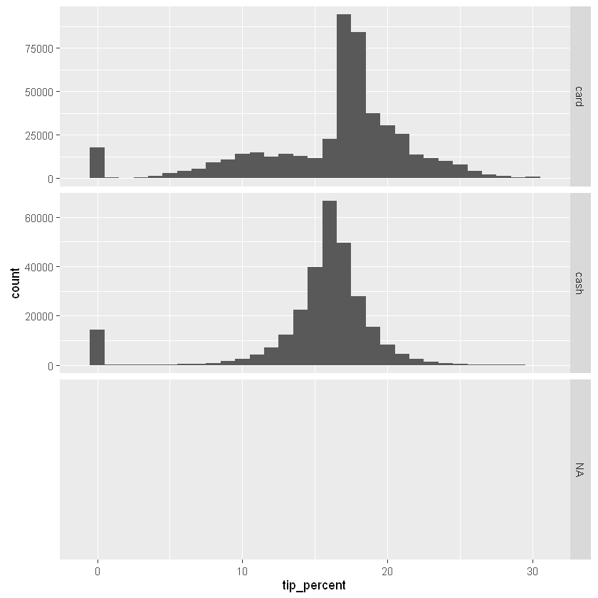

# R for SAS Users

*R for SAS Users* is designed to help experienced SAS users learn to process, query, transform and summarize data with R. This course takes a use-case-based approach to walk through the knowledge discovery and data mining process using R. This course has no prerequisites.  While we do not cover Microsoft R Server (MRS) during this course, a secondary goal of the course is to prepare users for MRS and its set of tools and capabilities for scalable big data-processing and analytics.  This course covers all the requirements to prepare users for MRS training, although we recommend spacing out this course and the *MRS for SAS Users* course to give participants time to absorb the material.

After completing this course, participants will be able to use R in order to:
1.  Read and process flat files (CSV) using R
2.  Clean and prepare data for analysis
3.  Create new features
4.  Visualize, explore, and summarize data

While we occasionally draw certain parallels between SAS and R, this course does not teach a user to do a line-by-line (or chunk-by-chunk) conversion of SAS code to R code.  Instead, by covering a thorough use-case, we attempt to show how to use R and what best practices to follow.  At the end of the course, users should have a solid understanding of how to use R to process and analyze data, and compare and contrast R and SAS in how they deal with data.  But there is no doubt that migration legacy code from SAS to R is a challenging task.

## Section 0: Course overview

Welcome to a practical introduction to R. This course targets users who are either new to R or have been using R for a while but come from a statistician/analyst background (including most SAS users), as opposed to a programmer/CS background (such as an experienced Python/Ruby/Java user).  At a high level this is what we cover:

  - Section 1: importing data
  - Section 2: querying data
  - Section 3: cleaning data
  - Section 4: redo and optimize
  - Section 5: creating new features
  - Section 6: data summary and analysis
    - Subsection 1: statistical summaries
    - Subsection 2: data summary with `base` R
    - Subsection 3: data summary with `dplyr`

At a deeper level, the course is a deep-dive R programming course.  The goal of the course is to learn about programming in R by working on a specific data analysis project.  In other words, we will learn about

  - data types in R
  - control flow
  - important R functions
  - writing R efficient functions
  - debugging/benchmarking/profiling in R
  - using third-party packages
    
and more, but we will do so **in the context of doing data analysis**.  This is what makes the course a *practical* introduction to R, as opposed to a *programmatic* introduction to R where users learn programming concepts 'in a vacuum'.  The latter is better-suited for strong programmers (in a general-purpose language like Python or Java) and just need to see the R syntax and its quirks.

In addition to the above stated goal, this course is also intended to *prepare* users who wish to extend their R skills to the Microsoft R Server (MRS) `RevoScaleR` package.  Through its `RevoScaleR` library, MRS offers a set of tools for big-data analytics in a distributed computing environment (such as a multicore single server, a Hadoop or Spark cluster, or inside a database like SQL Server).  For all intents and purposes, this course can be thought of as a prerequisite for MRS: while MRS is **not** covered in this course, the content we cover is important to users who advance onto the MRS course.  After all, a strong MRS programmer is first and foremost a strong R programmer.

### Course prerequisites

We assume very little knowledge of R for this course.  However, we strongly encourage the user to learn the basics of R before starting the course.  In particular, familiarity with the following is highly recommended:
  1. Basic data-types in R
  2. Installing and loading R packages
  3. Using a good IDE like [RStudio](https://www.rstudio.com/products/RStudio/) or [RTVS](https://www.visualstudio.com/en-us/features/rtvs-vs.aspx) (R Tools for Visual Studio)
  4. Looking up documentation or examples of how to use a specific R function
  5. Familiarity with some basic programming terminology, such as functions, arguments, variables, loops, etc.
  
We cover item (1) throughout the course, but a basic familiarity with data-types can make the content easier to digest.  Learning item (2) is relatively easy, although the GIS packages we use (`rgeos` especially) may have OS-specific dependencies for Linux-based systems. Finally, item (3) is absolutely essetial: knowing our way around an IDE can make it far easier to learn an interpreted language such as R. Finally, item (4) can be as easy as looking at the official help page for a function, or it can involve navigating our way around the many websites and blogs with code examples in R.  There are many helpful tutorials on Youtube or other places to get started with R, so we leave it up to the user to find such resources.

We use [Jupyter notebooks](http://jupyter.org/) to teach this course.  Jupyter notebooks have the advantage of being interactive: we can run the R code from inside the notebook by just selecting the cell with the code and pressing **Shift+Enter**.  This means we can run the code immediately on the R server that hosts the notebook and the data.  Notebooks are a great way to expose R code to users through the browser and collaborate with others, but as of yet they lack many of the functionalities of full-fledged IDEs.  So we can make small changes to the code and rerun a cell, but if we need to develop R code from scratch or debug a code chunk we are better off using an IDE like the two mentioned above.

### Lab exercises

There are many lab exercises included in this course.  We strongly encourage the participants to attempt the exercises before going over the solution.  Most of the exercises are challenging for a good reason: the purpose of the exercises is not always to confirm or strengthen what has been learned, but rather to set the tone for what is about to be learned.  The intent is to get users to **think like an R programmer** and explore R functions by running different examples and then figuring out how to build upon them.  Over time, this approach will pay off.

### The dataset

The dataset we use for this course is a **sample** of the [NYC Taxi](http://www.nyc.gov/html/tlc/html/about/trip_record_data.shtml) dataset.  The dataset includes trip records from trips completed in yellow taxis in New York City for a given time period. Each trip has information about pick-up and drop-off dates/times, pick-up and drop-off locations, trip distances, itemized fares, rate types, payment types, and passenger counts.  The sample covers a very small (less than 5 percent) subset of trips ranging from January 1 to June 30, 2015.

### R packages

Like any serious data analysis project with R, this course does not shy away from using R packages.  Some packages such as the `dplyr` package are more extensively covered, as they are relevant to the topic at hand.  Other packages such as `ggplot2` or `rgeos` are not covered in great depth, since data visualization and GIS functions would take us too far outside the scope of the course.  Instead, we provide well-commented examples of functionalities within those packages and invite the user to delve deeper on their own time.

We are now ready to begin.  Let's start by loading the required libraries we use throughout the course.  We reload these libraries later when we run the functions inside them, but putting them at the top of the project gives us a chance to see all of them in one place, and install any libraries we don't already have.


```R
# install.packages(c('dplyr', 'stringr', 'lubridate', 'ggplot2', 'ggrepel', 
#                    'tidyr', 'seriation', 'profr', 'microbenchmark', 
#                    'rgeos', 'sp', 'maptools'))
```


```R
# let's set some options for how things look on the console
options(max.print = 1000, # limit how much data is shown on the console
        scipen = 999, # don't use scientific notation for numbers
        width = 120, # width of the screen should be 80 characters long
        digits = 3, # round all numbers to 3 decimal places when displaying them
        warn = -1) # suppress warnings (you normally don't do this in development!)

library(dplyr) # for fast data manipulation/processing/summarizing
options(dplyr.print_max = 20) # limit how much data `dplyr` shows by default
options(dplyr.width = Inf) # make `dplyr` show all columns of a dataset
library(stringr) # for working with strings
library(lubridate) # for working with date variables
Sys.setenv(TZ = "US/Eastern") # not important for this dataset

library(ggplot2) # for creating plots
library(ggrepel) # avoid text overlap in plots
library(tidyr) # for reshaping data
library(seriation) # package for reordering a distance matrix

# three GIS libraries
library(rgeos)
library(sp)
library(maptools)

library(profr) # profiling tool
library(microbenchmark) # benchmarking tool
```

    
    Attaching package: 'dplyr'
    
    The following objects are masked from 'package:stats':
    
        filter, lag
    
    The following objects are masked from 'package:base':
    
        intersect, setdiff, setequal, union
    
    
    Attaching package: 'lubridate'
    
    The following object is masked from 'package:base':
    
        date
    
    
    Attaching package: 'seriation'
    
    The following object is masked from 'package:lattice':
    
        panel.lines
    
    rgeos version: 0.3-19, (SVN revision 524)
     GEOS runtime version: 3.5.0-CAPI-1.9.0 r4084 
     Linking to sp version: 1.2-2 
     Polygon checking: TRUE 
    
    Checking rgeos availability: TRUE
    

In the next chapter, we deal with our first challenge: loading the data into R.

## Section 1: Loading data into R

The process of loading data into R changes based on the kind of data. The standard format for data is tabular.  A CSV file is an example of tabular data.  Assuming that our CSV file is "clean", we should be able to read the file using the `read.csv` function.  Here are examples of what we mean by "clean" data for a CSV file:

  - column headers are at the top
  - rows all have an equal number of cells, with two adjacent commas representing an empty cell
  - file only contains the data, with all other metadata stored in a separate file referred to as the **data dictionary**

We use the `readLines` function in R to print the first few lines of the data.  This can serve as a starting point for examining the data.


```R
setwd('C:/Data/NYC_taxi')

data_path <- 'NYC_sample.csv'
print(readLines(file(data_path), n = 3)) # print the first 3 lines of the file
```

    [1] "\"VendorID\",\"tpep_pickup_datetime\",\"tpep_dropoff_datetime\",\"passenger_count\",\"trip_distance\",\"pickup_longitude\",\"pickup_latitude\",\"RateCodeID\",\"store_and_fwd_flag\",\"dropoff_longitude\",\"dropoff_latitude\",\"payment_type\",\"fare_amount\",\"extra\",\"mta_tax\",\"tip_amount\",\"tolls_amount\",\"improvement_surcharge\",\"total_amount\",\"u\""
    [2] "\"1\",\"2015-01-15 09:47:05\",\"2015-01-15 09:48:54\",1,0.5,-73.9620056152344,40.7595901489258,\"1\",\"N\",-73.9568328857422,40.7649002075195,\"1\",3.5,0,0.5,1,0,0,5,0.00725185964256525"                                                                                                                                                                              
    [3] "\"2\",\"2015-01-08 16:24:00\",\"2015-01-08 16:36:47\",1,1.88,-73.949951171875,40.8017921447754,\"1\",\"N\",-73.9571914672852,40.7804374694824,\"1\",10,1,0.5,2.2,0,0.3,14,0.000565606402233243"                                                                                                                                                                         
    

Before we run `read.csv` to load the data into R, let's inspect it more closely by looking at the R help documentation. We can do so by typing `?read.csv` from the R console.

As we can see from the help page above, `read.csv` is an offshoot of the more general function `read.table` with some of the arguments set to default values appropriate to CSV files (such as `sep = ','` or `header = TRUE`).  There are many arguments in `read.table` worth knowing about, such as (just to name a few)
  - `nrows` for limiting the number of rows we read, 
  - `na.strings` for specifying what defines an NA in a `character` column,  
  - `skip` for skipping a certain number of rows before we start reading the data.

We now run `read.csv`.  Since the dataset we read is relatively large, we time how long it takes to load it into R.  Once all the data is read, we have an object called `nyc_taxi` loaded into the R session.  This object is an R `data.frame`.  We can run a simple query on `nyc_taxi` by passing it to the `head` function.


```R
st <- Sys.time()
nyc_taxi <- read.csv(data_path, stringsAsFactors = FALSE) # we suppress conversion to factors for now
Sys.time() - st
```


    Time difference of 28.7 secs


```R
print(class(nyc_taxi))
```

    [1] "data.frame"
    

It is important to know that `nyc_taxi` is no longer linked to the original CSV file: The CSV file resides somewhere on disk, but `nyc_taxi` is a **copy** of the CSV file sitting in memory.  Any modifications we make to this file will not be written to the CSV file, or any file on disk, unless we explicitly do so.  Let's begin by comparing the size of the original CSV file with the size of its copy in the R session.


```R
obj_size_mb <- as.integer(object.size(nyc_taxi)) / 2^20 # size of object in memory (we divide by 2^20 to convert from bytes to megabytes)
print(obj_size_mb)
```

    [1] 209
    


```R
file_size_mb <- file.size(data_path) / 2^20 # size of the original file
print(file_testsize_mb)
```


    Error in print(file_testsize_mb): object 'file_testsize_mb' not found
    


As we can see, the object in the memory takes up more space (in memory) than the CSV file does on disk.  Since the amount of available memory on a computer is much smaller than available disk space, for a long time the need to load data in its entirety in the memory imposed a serious limitation on using R with large datasets.  Over the years, machines have been endowed with more CPU power and more memory, but data sizes have grown even more, so fundamentally the problem is still there.  As we become better R programmers, we can learn ways to more efficiently load and process the data, but writing efficient R code is not always easy or even desirable if the resulting code looks hard to read and understand.

Nowadays there are R libraries that provide us with ways to handle large datasets in R quickly and without hogging too much memory.  Microsoft R Server's `RevoScaleR` library is an example of such a package.  `RevoScaleR` is covered in a different course.

With the data loaded into R, we can now set out to examine its content, which is the subject of the next chapter.

## Section 2: Inspecting and querying data

With the data loaded in the R session, we are ready to inspect the data and write some basic queries against it.  The goal of this chapter is to get a feel for the data.  Any exploratory analysis usually consists of the following steps:

  1. load all the data (and combine them if necessary)
  2. **inspect the data in preparation cleaning it**
  3. clean the data in preparation for analysis
  4. add any interesting features or columns as far as they pertain to the analysis
  5. find ways to analyze or summarize the data and report your findings 
  
We are now in step 2, where we intend to introduce some helpful R functions for inspecting the data and write some of our own.  

Most of the time, the above steps are not clearly delineated from each other. For example, one could inspect certain columns of the data, clean them, build new features out of them, and then move on to other columns, thereby iterating on steps 2 through 4 until all the columns are dealt with. This approach is completely valid, but for the sake of teaching the course we prefer to show each step as distinct.

Let's begin the data exploration.  Each of the functions below return some useful information about the data.


```R
head(nyc_taxi) # show me the first few rows
```


<table>
<thead><tr><th></th><th scope=col>VendorID</th><th scope=col>tpep_pickup_datetime</th><th scope=col>tpep_dropoff_datetime</th><th scope=col>passenger_count</th><th scope=col>trip_distance</th><th scope=col>pickup_longitude</th><th scope=col>pickup_latitude</th><th scope=col>RateCodeID</th><th scope=col>store_and_fwd_flag</th><th scope=col>dropoff_longitude</th><th scope=col>dropoff_latitude</th><th scope=col>payment_type</th><th scope=col>fare_amount</th><th scope=col>extra</th><th scope=col>mta_tax</th><th scope=col>tip_amount</th><th scope=col>tolls_amount</th><th scope=col>improvement_surcharge</th><th scope=col>total_amount</th><th scope=col>u</th></tr></thead>
<tbody>
  <tr><th scope=row>1</th><td>1</td><td>2015-01-15 09:47:05</td><td>2015-01-15 09:48:54</td><td>1</td><td>0.5</td><td>-74</td><td>40.8</td><td>1</td><td>N</td><td>-74</td><td>40.8</td><td>1</td><td>3.5</td><td>0</td><td>0.5</td><td>1</td><td>0</td><td>0</td><td>5</td><td>0.00725</td></tr>
  <tr><th scope=row>2</th><td>2</td><td>2015-01-08 16:24:00</td><td>2015-01-08 16:36:47</td><td>1</td><td>1.88</td><td>-73.9</td><td>40.8</td><td>1</td><td>N</td><td>-74</td><td>40.8</td><td>1</td><td>10</td><td>1</td><td>0.5</td><td>2.2</td><td>0</td><td>0.3</td><td>14</td><td>0.000566</td></tr>
  <tr><th scope=row>3</th><td>2</td><td>2015-01-28 21:50:16</td><td>2015-01-28 22:09:25</td><td>1</td><td>5.1</td><td>-74</td><td>40.7</td><td>1</td><td>N</td><td>-74</td><td>40.8</td><td>1</td><td>18</td><td>0.5</td><td>0.5</td><td>3.86</td><td>0</td><td>0.3</td><td>23.2</td><td>0.00895</td></tr>
  <tr><th scope=row>4</th><td>2</td><td>2015-01-28 21:50:18</td><td>2015-01-28 22:17:41</td><td>2</td><td>6.76</td><td>-74</td><td>40.8</td><td>1</td><td>N</td><td>-74</td><td>40.7</td><td>1</td><td>24</td><td>0.5</td><td>0.5</td><td>4.9</td><td>0</td><td>0.3</td><td>30.2</td><td>0.00328</td></tr>
  <tr><th scope=row>5</th><td>2</td><td>2015-01-01 05:29:50</td><td>2015-01-01 05:54:13</td><td>1</td><td>17.5</td><td>-74</td><td>40.8</td><td>3</td><td>N</td><td>-74.2</td><td>40.7</td><td>1</td><td>64</td><td>0.5</td><td>0</td><td>1</td><td>16</td><td>0.3</td><td>81.8</td><td>0.00905</td></tr>
  <tr><th scope=row>6</th><td>1</td><td>2015-01-28 10:50:01</td><td>2015-01-28 10:55:55</td><td>1</td><td>0.6</td><td>-74</td><td>40.8</td><td>1</td><td>N</td><td>-74</td><td>40.8</td><td>2</td><td>5.5</td><td>0</td><td>0.5</td><td>0</td><td>0</td><td>0.3</td><td>6.3</td><td>0.00726</td></tr>
</tbody>
</table>


```R
head(nyc_taxi, n = 10) # show me the first 10 rows
```


<table>
<thead><tr><th></th><th scope=col>VendorID</th><th scope=col>tpep_pickup_datetime</th><th scope=col>tpep_dropoff_datetime</th><th scope=col>passenger_count</th><th scope=col>trip_distance</th><th scope=col>pickup_longitude</th><th scope=col>pickup_latitude</th><th scope=col>RateCodeID</th><th scope=col>store_and_fwd_flag</th><th scope=col>dropoff_longitude</th><th scope=col>dropoff_latitude</th><th scope=col>payment_type</th><th scope=col>fare_amount</th><th scope=col>extra</th><th scope=col>mta_tax</th><th scope=col>tip_amount</th><th scope=col>tolls_amount</th><th scope=col>improvement_surcharge</th><th scope=col>total_amount</th><th scope=col>u</th></tr></thead>
<tbody>
  <tr><th scope=row>1</th><td>1</td><td>2015-01-15 09:47:05</td><td>2015-01-15 09:48:54</td><td>1</td><td>0.5</td><td>-74</td><td>40.8</td><td>1</td><td>N</td><td>-74</td><td>40.8</td><td>1</td><td>3.5</td><td>0</td><td>0.5</td><td>1</td><td>0</td><td>0</td><td>5</td><td>0.00725</td></tr>
  <tr><th scope=row>2</th><td>2</td><td>2015-01-08 16:24:00</td><td>2015-01-08 16:36:47</td><td>1</td><td>1.88</td><td>-73.9</td><td>40.8</td><td>1</td><td>N</td><td>-74</td><td>40.8</td><td>1</td><td>10</td><td>1</td><td>0.5</td><td>2.2</td><td>0</td><td>0.3</td><td>14</td><td>0.000566</td></tr>
  <tr><th scope=row>3</th><td>2</td><td>2015-01-28 21:50:16</td><td>2015-01-28 22:09:25</td><td>1</td><td>5.1</td><td>-74</td><td>40.7</td><td>1</td><td>N</td><td>-74</td><td>40.8</td><td>1</td><td>18</td><td>0.5</td><td>0.5</td><td>3.86</td><td>0</td><td>0.3</td><td>23.2</td><td>0.00895</td></tr>
  <tr><th scope=row>4</th><td>2</td><td>2015-01-28 21:50:18</td><td>2015-01-28 22:17:41</td><td>2</td><td>6.76</td><td>-74</td><td>40.8</td><td>1</td><td>N</td><td>-74</td><td>40.7</td><td>1</td><td>24</td><td>0.5</td><td>0.5</td><td>4.9</td><td>0</td><td>0.3</td><td>30.2</td><td>0.00328</td></tr>
  <tr><th scope=row>5</th><td>2</td><td>2015-01-01 05:29:50</td><td>2015-01-01 05:54:13</td><td>1</td><td>17.5</td><td>-74</td><td>40.8</td><td>3</td><td>N</td><td>-74.2</td><td>40.7</td><td>1</td><td>64</td><td>0.5</td><td>0</td><td>1</td><td>16</td><td>0.3</td><td>81.8</td><td>0.00905</td></tr>
  <tr><th scope=row>6</th><td>1</td><td>2015-01-28 10:50:01</td><td>2015-01-28 10:55:55</td><td>1</td><td>0.6</td><td>-74</td><td>40.8</td><td>1</td><td>N</td><td>-74</td><td>40.8</td><td>2</td><td>5.5</td><td>0</td><td>0.5</td><td>0</td><td>0</td><td>0.3</td><td>6.3</td><td>0.00726</td></tr>
  <tr><th scope=row>7</th><td>1</td><td>2015-01-23 16:51:38</td><td>2015-01-23 16:57:37</td><td>3</td><td>0.4</td><td>-74</td><td>40.8</td><td>1</td><td>Y</td><td>-74</td><td>40.8</td><td>1</td><td>5.5</td><td>1</td><td>0.5</td><td>1.45</td><td>0</td><td>0.3</td><td>8.75</td><td>0.000579</td></tr>
  <tr><th scope=row>8</th><td>2</td><td>2015-01-13 00:09:40</td><td>2015-01-13 00:31:38</td><td>1</td><td>9.3</td><td>-74</td><td>40.7</td><td>1</td><td>N</td><td>-73.9</td><td>40.8</td><td>1</td><td>28.5</td><td>0.5</td><td>0.5</td><td>5.8</td><td>0</td><td>0.3</td><td>35.6</td><td>0.00697</td></tr>
  <tr><th scope=row>9</th><td>2</td><td>2015-01-03 09:19:52</td><td>2015-01-03 09:36:32</td><td>1</td><td>5.49</td><td>-73.9</td><td>40.8</td><td>1</td><td>N</td><td>-74</td><td>40.7</td><td>2</td><td>18</td><td>0</td><td>0.5</td><td>0</td><td>0</td><td>0.3</td><td>18.8</td><td>0.00917</td></tr>
  <tr><th scope=row>10</th><td>2</td><td>2015-01-23 00:31:02</td><td>2015-01-23 00:43:11</td><td>5</td><td>3.57</td><td>-74</td><td>40.8</td><td>1</td><td>N</td><td>-74</td><td>40.7</td><td>1</td><td>13</td><td>0.5</td><td>0.5</td><td>1</td><td>0</td><td>0.3</td><td>15.3</td><td>0.00823</td></tr>
</tbody>
</table>


```R
tail(nyc_taxi) # show me the last few rows
```


<table>
<thead><tr><th></th><th scope=col>VendorID</th><th scope=col>tpep_pickup_datetime</th><th scope=col>tpep_dropoff_datetime</th><th scope=col>passenger_count</th><th scope=col>trip_distance</th><th scope=col>pickup_longitude</th><th scope=col>pickup_latitude</th><th scope=col>RateCodeID</th><th scope=col>store_and_fwd_flag</th><th scope=col>dropoff_longitude</th><th scope=col>dropoff_latitude</th><th scope=col>payment_type</th><th scope=col>fare_amount</th><th scope=col>extra</th><th scope=col>mta_tax</th><th scope=col>tip_amount</th><th scope=col>tolls_amount</th><th scope=col>improvement_surcharge</th><th scope=col>total_amount</th><th scope=col>u</th></tr></thead>
<tbody>
  <tr><th scope=row>770649</th><td>1</td><td>2015-06-30 23:52:40</td><td>2015-06-30 23:54:10</td><td>1</td><td>0</td><td>-74</td><td>40.8</td><td>1</td><td>N</td><td>-74</td><td>40.8</td><td>1</td><td>3</td><td>0.5</td><td>0.5</td><td>1</td><td>0</td><td>0.3</td><td>5.3</td><td>0.00269</td></tr>
  <tr><th scope=row>770650</th><td>1</td><td>2015-06-30 23:55:43</td><td>2015-07-01 00:05:06</td><td>1</td><td>1.5</td><td>-74</td><td>40.7</td><td>1</td><td>N</td><td>-74</td><td>40.7</td><td>2</td><td>8.5</td><td>0.5</td><td>0.5</td><td>0</td><td>0</td><td>0.3</td><td>9.8</td><td>0.00993</td></tr>
  <tr><th scope=row>770651</th><td>1</td><td>2015-06-30 21:53:31</td><td>2015-06-30 22:00:22</td><td>1</td><td>1.2</td><td>-74</td><td>40.8</td><td>1</td><td>N</td><td>-74</td><td>40.8</td><td>2</td><td>6.5</td><td>0.5</td><td>0.5</td><td>0</td><td>0</td><td>0.3</td><td>7.8</td><td>0.00682</td></tr>
  <tr><th scope=row>770652</th><td>1</td><td>2015-06-30 21:53:41</td><td>2015-06-30 22:07:53</td><td>1</td><td>2.5</td><td>-74</td><td>40.8</td><td>1</td><td>N</td><td>-74</td><td>40.7</td><td>1</td><td>11</td><td>0.5</td><td>0.5</td><td>2.46</td><td>0</td><td>0.3</td><td>14.8</td><td>0.000238</td></tr>
  <tr><th scope=row>770653</th><td>2</td><td>2015-06-30 21:54:17</td><td>2015-06-30 22:09:42</td><td>1</td><td>2.79</td><td>-74</td><td>40.7</td><td>1</td><td>N</td><td>-74</td><td>40.8</td><td>1</td><td>12.5</td><td>0.5</td><td>0.5</td><td>2.76</td><td>0</td><td>0.3</td><td>16.6</td><td>0.00436</td></tr>
  <tr><th scope=row>770654</th><td>1</td><td>2015-06-30 21:53:58</td><td>2015-06-30 21:58:30</td><td>1</td><td>1</td><td>-74</td><td>40.7</td><td>1</td><td>N</td><td>-74</td><td>40.8</td><td>2</td><td>5.5</td><td>0.5</td><td>0.5</td><td>0</td><td>0</td><td>0.3</td><td>6.8</td><td>0.0083</td></tr>
</tbody>
</table>


```R
basic_info <- list(
    class = class(nyc_taxi), # shows the type of the data: `data.frame`
    type = typeof(nyc_taxi), # shows that a `data.frame` is fundamentally a `list` object
    nrow = nrow(nyc_taxi), # number of rows
    ncol = ncol(nyc_taxi), # number of columns
    colnames = names(nyc_taxi))

print(basic_info)
```

    $class
    [1] "data.frame"
    
    $type
    [1] "list"
    
    $nrow
    [1] 770654
    
    $ncol
    [1] 20
    
    $colnames
     [1] "VendorID"              "tpep_pickup_datetime"  "tpep_dropoff_datetime" "passenger_count"      
     [5] "trip_distance"         "pickup_longitude"      "pickup_latitude"       "RateCodeID"           
     [9] "store_and_fwd_flag"    "dropoff_longitude"     "dropoff_latitude"      "payment_type"         
    [13] "fare_amount"           "extra"                 "mta_tax"               "tip_amount"           
    [17] "tolls_amount"          "improvement_surcharge" "total_amount"          "u"                    
    
    


```R
names(nyc_taxi)[8] <- 'rate_code_id' # rename column `RateCodeID` to `rate_code_id`
```

We use `str` to look at column types in the data: the most common column types are `integer`, `numeric` (for floats), `character` (for strings), `factor` (for categorical data).  Less common column types exist, such as date, time, and datetime formats.


```R
str(nyc_taxi)
```

    'data.frame': 770654 obs. of  20 variables:
     $ VendorID             : int  1 2 2 2 2 1 1 2 2 2 ...
     $ tpep_pickup_datetime : chr  "2015-01-15 09:47:05" "2015-01-08 16:24:00" "2015-01-28 21:50:16" "2015-01-28 21:50:18" ...
     $ tpep_dropoff_datetime: chr  "2015-01-15 09:48:54" "2015-01-08 16:36:47" "2015-01-28 22:09:25" "2015-01-28 22:17:41" ...
     $ passenger_count      : int  1 1 1 2 1 1 3 1 1 5 ...
     $ trip_distance        : num  0.5 1.88 5.1 6.76 17.46 ...
     $ pickup_longitude     : num  -74 -73.9 -74 -74 -74 ...
     $ pickup_latitude      : num  40.8 40.8 40.7 40.8 40.8 ...
     $ rate_code_id         : int  1 1 1 1 3 1 1 1 1 1 ...
     $ store_and_fwd_flag   : chr  "N" "N" "N" "N" ...
     $ dropoff_longitude    : num  -74 -74 -74 -74 -74.2 ...
     $ dropoff_latitude     : num  40.8 40.8 40.8 40.7 40.7 ...
     $ payment_type         : int  1 1 1 1 1 2 1 1 2 1 ...
     $ fare_amount          : num  3.5 10 18 24 64 5.5 5.5 28.5 18 13 ...
     $ extra                : num  0 1 0.5 0.5 0.5 0 1 0.5 0 0.5 ...
     $ mta_tax              : num  0.5 0.5 0.5 0.5 0 0.5 0.5 0.5 0.5 0.5 ...
     $ tip_amount           : num  1 2.2 3.86 4.9 1 0 1.45 5.8 0 1 ...
     $ tolls_amount         : num  0 0 0 0 16 0 0 0 0 0 ...
     $ improvement_surcharge: num  0 0.3 0.3 0.3 0.3 0.3 0.3 0.3 0.3 0.3 ...
     $ total_amount         : num  5 14 23.2 30.2 81.8 ...
     $ u                    : num  0.007252 0.000566 0.008949 0.003276 0.00905 ...
    

Now let's see how we can subset or slice the data: in other words.  Since a `data.frame` is a 2-dimensional object, we can slice by asking for specific rows or columns of the data.  The notation we use here (which we refer to as the **bracket notation**) is as follows:
```
data[rows_to_slice, columns_to_slice]
```
As we will see, we can be very flexible in what we choose for `rows_to_slice` and `columns_to_slice`. For example, 

  - we can provide numeric indexes corresponding to row numbers or column positions
  - we can (and should) specify the column names instead of column positions
  - we can provide functions that return integers corresponding to the row indexes we want to return
  - we can provide functions that return the column names we want to return
  - we can have conditional statements or functions that return `TRUE` and `FALSE` for each row or column, so that only cases that are `TRUE` are returned

We will encounter examples for each case.


```R
nyc_taxi[1:5, 1:4] # rows 1 through 5, columns 1 through 4
```


<table>
<thead><tr><th></th><th scope=col>VendorID</th><th scope=col>tpep_pickup_datetime</th><th scope=col>tpep_dropoff_datetime</th><th scope=col>passenger_count</th></tr></thead>
<tbody>
  <tr><th scope=row>1</th><td>1</td><td>2015-01-15 09:47:05</td><td>2015-01-15 09:48:54</td><td>1</td></tr>
  <tr><th scope=row>2</th><td>2</td><td>2015-01-08 16:24:00</td><td>2015-01-08 16:36:47</td><td>1</td></tr>
  <tr><th scope=row>3</th><td>2</td><td>2015-01-28 21:50:16</td><td>2015-01-28 22:09:25</td><td>1</td></tr>
  <tr><th scope=row>4</th><td>2</td><td>2015-01-28 21:50:18</td><td>2015-01-28 22:17:41</td><td>2</td></tr>
  <tr><th scope=row>5</th><td>2</td><td>2015-01-01 05:29:50</td><td>2015-01-01 05:54:13</td><td>1</td></tr>
</tbody>
</table>


```R
nyc_taxi[1:5, -(1:4)] # rows 1 through 5, except columns 1 through 4
```


<table>
<thead><tr><th></th><th scope=col>trip_distance</th><th scope=col>pickup_longitude</th><th scope=col>pickup_latitude</th><th scope=col>rate_code_id</th><th scope=col>store_and_fwd_flag</th><th scope=col>dropoff_longitude</th><th scope=col>dropoff_latitude</th><th scope=col>payment_type</th><th scope=col>fare_amount</th><th scope=col>extra</th><th scope=col>mta_tax</th><th scope=col>tip_amount</th><th scope=col>tolls_amount</th><th scope=col>improvement_surcharge</th><th scope=col>total_amount</th><th scope=col>u</th></tr></thead>
<tbody>
  <tr><th scope=row>1</th><td>0.5</td><td>-74</td><td>40.8</td><td>1</td><td>N</td><td>-74</td><td>40.8</td><td>1</td><td>3.5</td><td>0</td><td>0.5</td><td>1</td><td>0</td><td>0</td><td>5</td><td>0.00725</td></tr>
  <tr><th scope=row>2</th><td>1.88</td><td>-73.9</td><td>40.8</td><td>1</td><td>N</td><td>-74</td><td>40.8</td><td>1</td><td>10</td><td>1</td><td>0.5</td><td>2.2</td><td>0</td><td>0.3</td><td>14</td><td>0.000566</td></tr>
  <tr><th scope=row>3</th><td>5.1</td><td>-74</td><td>40.7</td><td>1</td><td>N</td><td>-74</td><td>40.8</td><td>1</td><td>18</td><td>0.5</td><td>0.5</td><td>3.86</td><td>0</td><td>0.3</td><td>23.2</td><td>0.00895</td></tr>
  <tr><th scope=row>4</th><td>6.76</td><td>-74</td><td>40.8</td><td>1</td><td>N</td><td>-74</td><td>40.7</td><td>1</td><td>24</td><td>0.5</td><td>0.5</td><td>4.9</td><td>0</td><td>0.3</td><td>30.2</td><td>0.00328</td></tr>
  <tr><th scope=row>5</th><td>17.5</td><td>-74</td><td>40.8</td><td>3</td><td>N</td><td>-74.2</td><td>40.7</td><td>1</td><td>64</td><td>0.5</td><td>0</td><td>1</td><td>16</td><td>0.3</td><td>81.8</td><td>0.00905</td></tr>
</tbody>
</table>


```R
nyc_taxi[1:5, ] # all the columns, first 10 rows
```


<table>
<thead><tr><th></th><th scope=col>VendorID</th><th scope=col>tpep_pickup_datetime</th><th scope=col>tpep_dropoff_datetime</th><th scope=col>passenger_count</th><th scope=col>trip_distance</th><th scope=col>pickup_longitude</th><th scope=col>pickup_latitude</th><th scope=col>rate_code_id</th><th scope=col>store_and_fwd_flag</th><th scope=col>dropoff_longitude</th><th scope=col>dropoff_latitude</th><th scope=col>payment_type</th><th scope=col>fare_amount</th><th scope=col>extra</th><th scope=col>mta_tax</th><th scope=col>tip_amount</th><th scope=col>tolls_amount</th><th scope=col>improvement_surcharge</th><th scope=col>total_amount</th><th scope=col>u</th></tr></thead>
<tbody>
  <tr><th scope=row>1</th><td>1</td><td>2015-01-15 09:47:05</td><td>2015-01-15 09:48:54</td><td>1</td><td>0.5</td><td>-74</td><td>40.8</td><td>1</td><td>N</td><td>-74</td><td>40.8</td><td>1</td><td>3.5</td><td>0</td><td>0.5</td><td>1</td><td>0</td><td>0</td><td>5</td><td>0.00725</td></tr>
  <tr><th scope=row>2</th><td>2</td><td>2015-01-08 16:24:00</td><td>2015-01-08 16:36:47</td><td>1</td><td>1.88</td><td>-73.9</td><td>40.8</td><td>1</td><td>N</td><td>-74</td><td>40.8</td><td>1</td><td>10</td><td>1</td><td>0.5</td><td>2.2</td><td>0</td><td>0.3</td><td>14</td><td>0.000566</td></tr>
  <tr><th scope=row>3</th><td>2</td><td>2015-01-28 21:50:16</td><td>2015-01-28 22:09:25</td><td>1</td><td>5.1</td><td>-74</td><td>40.7</td><td>1</td><td>N</td><td>-74</td><td>40.8</td><td>1</td><td>18</td><td>0.5</td><td>0.5</td><td>3.86</td><td>0</td><td>0.3</td><td>23.2</td><td>0.00895</td></tr>
  <tr><th scope=row>4</th><td>2</td><td>2015-01-28 21:50:18</td><td>2015-01-28 22:17:41</td><td>2</td><td>6.76</td><td>-74</td><td>40.8</td><td>1</td><td>N</td><td>-74</td><td>40.7</td><td>1</td><td>24</td><td>0.5</td><td>0.5</td><td>4.9</td><td>0</td><td>0.3</td><td>30.2</td><td>0.00328</td></tr>
  <tr><th scope=row>5</th><td>2</td><td>2015-01-01 05:29:50</td><td>2015-01-01 05:54:13</td><td>1</td><td>17.5</td><td>-74</td><td>40.8</td><td>3</td><td>N</td><td>-74.2</td><td>40.7</td><td>1</td><td>64</td><td>0.5</td><td>0</td><td>1</td><td>16</td><td>0.3</td><td>81.8</td><td>0.00905</td></tr>
</tbody>
</table>


```R
nyc.first.ten <- nyc_taxi[1:10, ] # store the results in a new `data.frame` called `nyc.first.ten`
```

So far our data slices have been limited to adjacent rows and adjacent columns.  Here's an example of how to slice the data for non-adjacent rows.  It is also far more common to select columns by their names instead of their position (also called numeric index), since this makes the code more readable and won't break the code if column positions change.


```R
nyc_taxi[c(2, 3, 8, 66), c("fare_amount", "mta_tax", "tip_amount", "tolls_amount")]
```


<table>
<thead><tr><th></th><th scope=col>fare_amount</th><th scope=col>mta_tax</th><th scope=col>tip_amount</th><th scope=col>tolls_amount</th></tr></thead>
<tbody>
  <tr><th scope=row>2</th><td>10</td><td>0.5</td><td>2.2</td><td>0</td></tr>
  <tr><th scope=row>3</th><td>18</td><td>0.5</td><td>3.86</td><td>0</td></tr>
  <tr><th scope=row>8</th><td>28.5</td><td>0.5</td><td>5.8</td><td>0</td></tr>
  <tr><th scope=row>66</th><td>8.5</td><td>0.5</td><td>0</td><td>0</td></tr>
</tbody>
</table>


### Exercise 2.1

Here is an example of a useful new function: `seq`


```R
seq(1, 10, by = 2)
```


<ol class=list-inline>
  <li>1</li>
  <li>3</li>
  <li>5</li>
  <li>7</li>
  <li>9</li>
</ol>


(A) Once you figure out what `seq` does, use it to take a sample of the data consisting of every 2500th rows.  Such a sample is called a **systematic sample**.

Here is another example of a useful function: `rep`


```R
rep(1, 4)
```


<ol class=list-inline>
  <li>1</li>
  <li>1</li>
  <li>1</li>
  <li>1</li>
</ol>


What happens if the first argument to `rep` is a vector?


```R
rep(1:2, 4)
```


<ol class=list-inline>
  <li>1</li>
  <li>2</li>
  <li>1</li>
  <li>2</li>
  <li>1</li>
  <li>2</li>
  <li>1</li>
  <li>2</li>
</ol>


What happens if the second argument to `rep` is also a vector (of the same length)?


```R
rep(c(3, 6), c(2, 5))
```


<ol class=list-inline>
  <li>3</li>
  <li>3</li>
  <li>6</li>
  <li>6</li>
  <li>6</li>
  <li>6</li>
  <li>6</li>
</ol>


(B) Create a new data object consisting of 5 copies of the first row of the data.

(C) Create a new data object consisting of 5 copies of each of the first 10 rows of the data.

#### Solution to exercise 2.1


```R
head(nyc_taxi[seq(1, nrow(nyc_taxi), 2500), ]) # solution to (A)
```


<table>
<thead><tr><th></th><th scope=col>VendorID</th><th scope=col>tpep_pickup_datetime</th><th scope=col>tpep_dropoff_datetime</th><th scope=col>passenger_count</th><th scope=col>trip_distance</th><th scope=col>pickup_longitude</th><th scope=col>pickup_latitude</th><th scope=col>rate_code_id</th><th scope=col>store_and_fwd_flag</th><th scope=col>dropoff_longitude</th><th scope=col>dropoff_latitude</th><th scope=col>payment_type</th><th scope=col>fare_amount</th><th scope=col>extra</th><th scope=col>mta_tax</th><th scope=col>tip_amount</th><th scope=col>tolls_amount</th><th scope=col>improvement_surcharge</th><th scope=col>total_amount</th><th scope=col>u</th></tr></thead>
<tbody>
  <tr><th scope=row>1</th><td>1</td><td>2015-01-15 09:47:05</td><td>2015-01-15 09:48:54</td><td>1</td><td>0.5</td><td>-74</td><td>40.8</td><td>1</td><td>N</td><td>-74</td><td>40.8</td><td>1</td><td>3.5</td><td>0</td><td>0.5</td><td>1</td><td>0</td><td>0</td><td>5</td><td>0.00725</td></tr>
  <tr><th scope=row>2501</th><td>2</td><td>2015-01-05 19:44:42</td><td>2015-01-05 20:01:18</td><td>1</td><td>5.65</td><td>-74</td><td>40.8</td><td>1</td><td>N</td><td>-74</td><td>40.7</td><td>1</td><td>18.5</td><td>1</td><td>0.5</td><td>3.9</td><td>0</td><td>0.3</td><td>24.2</td><td>0.00647</td></tr>
  <tr><th scope=row>5001</th><td>2</td><td>2015-01-07 11:52:35</td><td>2015-01-07 12:06:31</td><td>4</td><td>1.87</td><td>-74</td><td>40.7</td><td>1</td><td>N</td><td>-74</td><td>40.8</td><td>1</td><td>10.5</td><td>0</td><td>0.5</td><td>1.5</td><td>0</td><td>0.3</td><td>12.8</td><td>0.00619</td></tr>
  <tr><th scope=row>7501</th><td>2</td><td>2015-01-10 14:59:48</td><td>2015-01-10 15:22:25</td><td>2</td><td>3.08</td><td>-74</td><td>40.8</td><td>1</td><td>N</td><td>-74</td><td>40.7</td><td>2</td><td>16</td><td>0</td><td>0.5</td><td>0</td><td>0</td><td>0.3</td><td>16.8</td><td>0.009</td></tr>
  <tr><th scope=row>10001</th><td>2</td><td>2015-01-05 12:21:14</td><td>2015-01-05 12:27:52</td><td>6</td><td>1.4</td><td>-74</td><td>40.7</td><td>1</td><td>N</td><td>-74</td><td>40.8</td><td>2</td><td>7</td><td>0</td><td>0.5</td><td>0</td><td>0</td><td>0.3</td><td>7.8</td><td>0.00459</td></tr>
  <tr><th scope=row>12501</th><td>2</td><td>2015-01-18 12:46:13</td><td>2015-01-18 12:54:51</td><td>1</td><td>1.09</td><td>-74</td><td>40.8</td><td>1</td><td>N</td><td>-74</td><td>40.8</td><td>1</td><td>7</td><td>0</td><td>0.5</td><td>1.4</td><td>0</td><td>0.3</td><td>9.2</td><td>0.00993</td></tr>
</tbody>
</table>


```R
nyc_taxi[rep(1, 5), ] # solution to (B)
```


<table>
<thead><tr><th></th><th scope=col>VendorID</th><th scope=col>tpep_pickup_datetime</th><th scope=col>tpep_dropoff_datetime</th><th scope=col>passenger_count</th><th scope=col>trip_distance</th><th scope=col>pickup_longitude</th><th scope=col>pickup_latitude</th><th scope=col>rate_code_id</th><th scope=col>store_and_fwd_flag</th><th scope=col>dropoff_longitude</th><th scope=col>dropoff_latitude</th><th scope=col>payment_type</th><th scope=col>fare_amount</th><th scope=col>extra</th><th scope=col>mta_tax</th><th scope=col>tip_amount</th><th scope=col>tolls_amount</th><th scope=col>improvement_surcharge</th><th scope=col>total_amount</th><th scope=col>u</th></tr></thead>
<tbody>
  <tr><th scope=row>1</th><td>1</td><td>2015-01-15 09:47:05</td><td>2015-01-15 09:48:54</td><td>1</td><td>0.5</td><td>-74</td><td>40.8</td><td>1</td><td>N</td><td>-74</td><td>40.8</td><td>1</td><td>3.5</td><td>0</td><td>0.5</td><td>1</td><td>0</td><td>0</td><td>5</td><td>0.00725</td></tr>
  <tr><th scope=row>1.1</th><td>1</td><td>2015-01-15 09:47:05</td><td>2015-01-15 09:48:54</td><td>1</td><td>0.5</td><td>-74</td><td>40.8</td><td>1</td><td>N</td><td>-74</td><td>40.8</td><td>1</td><td>3.5</td><td>0</td><td>0.5</td><td>1</td><td>0</td><td>0</td><td>5</td><td>0.00725</td></tr>
  <tr><th scope=row>1.2</th><td>1</td><td>2015-01-15 09:47:05</td><td>2015-01-15 09:48:54</td><td>1</td><td>0.5</td><td>-74</td><td>40.8</td><td>1</td><td>N</td><td>-74</td><td>40.8</td><td>1</td><td>3.5</td><td>0</td><td>0.5</td><td>1</td><td>0</td><td>0</td><td>5</td><td>0.00725</td></tr>
  <tr><th scope=row>1.3</th><td>1</td><td>2015-01-15 09:47:05</td><td>2015-01-15 09:48:54</td><td>1</td><td>0.5</td><td>-74</td><td>40.8</td><td>1</td><td>N</td><td>-74</td><td>40.8</td><td>1</td><td>3.5</td><td>0</td><td>0.5</td><td>1</td><td>0</td><td>0</td><td>5</td><td>0.00725</td></tr>
  <tr><th scope=row>1.4</th><td>1</td><td>2015-01-15 09:47:05</td><td>2015-01-15 09:48:54</td><td>1</td><td>0.5</td><td>-74</td><td>40.8</td><td>1</td><td>N</td><td>-74</td><td>40.8</td><td>1</td><td>3.5</td><td>0</td><td>0.5</td><td>1</td><td>0</td><td>0</td><td>5</td><td>0.00725</td></tr>
</tbody>
</table>


```R
head(nyc_taxi[rep(1:10, 5), ]) # solution to (C)
```


<table>
<thead><tr><th></th><th scope=col>VendorID</th><th scope=col>tpep_pickup_datetime</th><th scope=col>tpep_dropoff_datetime</th><th scope=col>passenger_count</th><th scope=col>trip_distance</th><th scope=col>pickup_longitude</th><th scope=col>pickup_latitude</th><th scope=col>rate_code_id</th><th scope=col>store_and_fwd_flag</th><th scope=col>dropoff_longitude</th><th scope=col>dropoff_latitude</th><th scope=col>payment_type</th><th scope=col>fare_amount</th><th scope=col>extra</th><th scope=col>mta_tax</th><th scope=col>tip_amount</th><th scope=col>tolls_amount</th><th scope=col>improvement_surcharge</th><th scope=col>total_amount</th><th scope=col>u</th></tr></thead>
<tbody>
  <tr><th scope=row>1</th><td>1</td><td>2015-01-15 09:47:05</td><td>2015-01-15 09:48:54</td><td>1</td><td>0.5</td><td>-74</td><td>40.8</td><td>1</td><td>N</td><td>-74</td><td>40.8</td><td>1</td><td>3.5</td><td>0</td><td>0.5</td><td>1</td><td>0</td><td>0</td><td>5</td><td>0.00725</td></tr>
  <tr><th scope=row>2</th><td>2</td><td>2015-01-08 16:24:00</td><td>2015-01-08 16:36:47</td><td>1</td><td>1.88</td><td>-73.9</td><td>40.8</td><td>1</td><td>N</td><td>-74</td><td>40.8</td><td>1</td><td>10</td><td>1</td><td>0.5</td><td>2.2</td><td>0</td><td>0.3</td><td>14</td><td>0.000566</td></tr>
  <tr><th scope=row>3</th><td>2</td><td>2015-01-28 21:50:16</td><td>2015-01-28 22:09:25</td><td>1</td><td>5.1</td><td>-74</td><td>40.7</td><td>1</td><td>N</td><td>-74</td><td>40.8</td><td>1</td><td>18</td><td>0.5</td><td>0.5</td><td>3.86</td><td>0</td><td>0.3</td><td>23.2</td><td>0.00895</td></tr>
  <tr><th scope=row>4</th><td>2</td><td>2015-01-28 21:50:18</td><td>2015-01-28 22:17:41</td><td>2</td><td>6.76</td><td>-74</td><td>40.8</td><td>1</td><td>N</td><td>-74</td><td>40.7</td><td>1</td><td>24</td><td>0.5</td><td>0.5</td><td>4.9</td><td>0</td><td>0.3</td><td>30.2</td><td>0.00328</td></tr>
  <tr><th scope=row>5</th><td>2</td><td>2015-01-01 05:29:50</td><td>2015-01-01 05:54:13</td><td>1</td><td>17.5</td><td>-74</td><td>40.8</td><td>3</td><td>N</td><td>-74.2</td><td>40.7</td><td>1</td><td>64</td><td>0.5</td><td>0</td><td>1</td><td>16</td><td>0.3</td><td>81.8</td><td>0.00905</td></tr>
  <tr><th scope=row>6</th><td>1</td><td>2015-01-28 10:50:01</td><td>2015-01-28 10:55:55</td><td>1</td><td>0.6</td><td>-74</td><td>40.8</td><td>1</td><td>N</td><td>-74</td><td>40.8</td><td>2</td><td>5.5</td><td>0</td><td>0.5</td><td>0</td><td>0</td><td>0.3</td><td>6.3</td><td>0.00726</td></tr>
</tbody>
</table>


---

To query a single column of the data, we have two options:
  
  - we can still use the bracket notation, namely `data[ , col_name]`
  - we can use a list notation, namely `data$col_name`


```R
nyc_taxi[1:10, "fare_amount"]
```


<ol class=list-inline>
  <li>3.5</li>
  <li>10</li>
  <li>18</li>
  <li>24</li>
  <li>64</li>
  <li>5.5</li>
  <li>5.5</li>
  <li>28.5</li>
  <li>18</li>
  <li>13</li>
</ol>


```R
nyc_taxi$fare_amount[1:10]
```


<ol class=list-inline>
  <li>3.5</li>
  <li>10</li>
  <li>18</li>
  <li>24</li>
  <li>64</li>
  <li>5.5</li>
  <li>5.5</li>
  <li>28.5</li>
  <li>18</li>
  <li>13</li>
</ol>


Depending on the situation, one notation may be preferable to the other, as we will see.

So far we sliced the data at particular rows using the index of the row.  A more common situation is one where we query the data for rows that meet a given condition.  Multiple conditions can be combined using the `&` (and) and `|` (or) operators.


```R
head(nyc_taxi[nyc_taxi$fare_amount > 350, ]) # return the rows of the data where `fare_amount` exceeds 350
```


<table>
<thead><tr><th></th><th scope=col>VendorID</th><th scope=col>tpep_pickup_datetime</th><th scope=col>tpep_dropoff_datetime</th><th scope=col>passenger_count</th><th scope=col>trip_distance</th><th scope=col>pickup_longitude</th><th scope=col>pickup_latitude</th><th scope=col>rate_code_id</th><th scope=col>store_and_fwd_flag</th><th scope=col>dropoff_longitude</th><th scope=col>dropoff_latitude</th><th scope=col>payment_type</th><th scope=col>fare_amount</th><th scope=col>extra</th><th scope=col>mta_tax</th><th scope=col>tip_amount</th><th scope=col>tolls_amount</th><th scope=col>improvement_surcharge</th><th scope=col>total_amount</th><th scope=col>u</th></tr></thead>
<tbody>
  <tr><th scope=row>22883</th><td>2</td><td>2015-01-11 13:27:32</td><td>2015-01-11 13:28:18</td><td>1</td><td>0</td><td>-73.9</td><td>40.7</td><td>5</td><td>N</td><td>-73.9</td><td>40.7</td><td>2</td><td>475</td><td>0</td><td>0</td><td>0</td><td>0</td><td>0.3</td><td>475</td><td>0.00311</td></tr>
  <tr><th scope=row>81529</th><td>2</td><td>2015-01-07 08:52:00</td><td>2015-01-07 08:52:00</td><td>1</td><td>0</td><td>0</td><td>0</td><td>5</td><td>N</td><td>0</td><td>0</td><td>1</td><td>588</td><td>0</td><td>0</td><td>0</td><td>0</td><td>0</td><td>588</td><td>0.00107</td></tr>
  <tr><th scope=row>85923</th><td>2</td><td>2015-01-03 22:23:37</td><td>2015-01-04 00:23:11</td><td>1</td><td>104</td><td>-74</td><td>40.7</td><td>5</td><td>N</td><td>-75.2</td><td>40</td><td>2</td><td>400</td><td>0</td><td>0.5</td><td>0</td><td>0</td><td>0.3</td><td>401</td><td>0.00939</td></tr>
  <tr><th scope=row>144102</th><td>2</td><td>2015-02-11 19:23:00</td><td>2015-02-11 19:23:00</td><td>1</td><td>0</td><td>0</td><td>0</td><td>5</td><td>N</td><td>0</td><td>0</td><td>1</td><td>401</td><td>0</td><td>0</td><td>0</td><td>0</td><td>0</td><td>401</td><td>0.00997</td></tr>
  <tr><th scope=row>150917</th><td>2</td><td>2015-02-11 16:32:00</td><td>2015-02-11 16:32:00</td><td>1</td><td>0</td><td>0</td><td>0</td><td>5</td><td>N</td><td>0</td><td>0</td><td>1</td><td>699</td><td>0</td><td>0</td><td>0</td><td>0</td><td>0</td><td>699</td><td>0.00604</td></tr>
  <tr><th scope=row>173934</th><td>2</td><td>2015-02-04 12:10:00</td><td>2015-02-04 12:10:00</td><td>1</td><td>0</td><td>0</td><td>0</td><td>5</td><td>N</td><td>0</td><td>0</td><td>1</td><td>465</td><td>0</td><td>0</td><td>0</td><td>0</td><td>0</td><td>465</td><td>0.0049</td></tr>
</tbody>
</table>


We can use a function like `grep` to grab only columns that match a certain pattern, such as columns that have the word 'amount' in them.


```R
amount_vars <- grep('amount', names(nyc_taxi), value = TRUE)
nyc_taxi[nyc_taxi$fare_amount > 350 & nyc_taxi$tip_amount < 10, amount_vars]
```


<table>
<thead><tr><th></th><th scope=col>fare_amount</th><th scope=col>tip_amount</th><th scope=col>tolls_amount</th><th scope=col>total_amount</th></tr></thead>
<tbody>
  <tr><th scope=row>22883</th><td>475</td><td>0</td><td>0</td><td>475</td></tr>
  <tr><th scope=row>81529</th><td>588</td><td>0</td><td>0</td><td>588</td></tr>
  <tr><th scope=row>85923</th><td>400</td><td>0</td><td>0</td><td>401</td></tr>
  <tr><th scope=row>144102</th><td>401</td><td>0</td><td>0</td><td>401</td></tr>
  <tr><th scope=row>150917</th><td>699</td><td>0</td><td>0</td><td>699</td></tr>
  <tr><th scope=row>173934</th><td>465</td><td>0</td><td>0</td><td>465</td></tr>
  <tr><th scope=row>196580</th><td>1000</td><td>0</td><td>0</td><td>1900</td></tr>
  <tr><th scope=row>334574</th><td>673</td><td>0</td><td>0</td><td>673</td></tr>
  <tr><th scope=row>481726</th><td>465</td><td>0</td><td>0</td><td>465</td></tr>
  <tr><th scope=row>762572</th><td>460</td><td>0</td><td>0</td><td>460</td></tr>
</tbody>
</table>


As these conditional statements become longer, it becomes increasingly tedious to write `nyc_taxi$` proir to the column name every time we refer to a column in the data. Note how leaving out `nyc_taxi$` by accident can result in an error:


```R
nyc_taxi[nyc_taxi$fare_amount > 350 & tip_amount < 10, amount_vars]
```


    Error in `[.data.frame`(nyc_taxi, nyc_taxi$fare_amount > 350 & tip_amount < : object 'tip_amount' not found
    


As the error suggests, R expected to find a stand-alone object called `tip_amount`, which doesn't exist.  Instead, we meant to point to the column called `tip_amount` in the nyc_taxi dataset, in other words `nyc_taxi$tip_amount`.  This error also suggests one dangerous pitfall: if we did have an object called `tip_amount` in our R session, we may have failed to notice the bug in the code.


```R
tip_amount <- 20 # this is the value that will be used to check the condition below
nyc_taxi[nyc_taxi$fare_amount > 350 & tip_amount < 10, amount_vars] # since `20 < 10` is FALSE, we return an empty data
```


<table>
<thead><tr><th></th><th scope=col>fare_amount</th><th scope=col>tip_amount</th><th scope=col>tolls_amount</th><th scope=col>total_amount</th></tr></thead>
<tbody>
</tbody>
</table>


There are three ways to avoid such errors: (1) avoid having objects with the same name as column names in the data, (2) use the `with` function.  With `with` we are explicitly telling R that the columns we reference are in `nyc_taxi`, this way we don't need to prefix the columns by `nyc_taxi$` anymore. Here's the above query rewritten using `with`.


```R
with(nyc_taxi, nyc_taxi[fare_amount > 350 & tip_amount < 10, amount_vars])
```


<table>
<thead><tr><th></th><th scope=col>fare_amount</th><th scope=col>tip_amount</th><th scope=col>tolls_amount</th><th scope=col>total_amount</th></tr></thead>
<tbody>
  <tr><th scope=row>22883</th><td>475</td><td>0</td><td>0</td><td>475</td></tr>
  <tr><th scope=row>81529</th><td>588</td><td>0</td><td>0</td><td>588</td></tr>
  <tr><th scope=row>85923</th><td>400</td><td>0</td><td>0</td><td>401</td></tr>
  <tr><th scope=row>144102</th><td>401</td><td>0</td><td>0</td><td>401</td></tr>
  <tr><th scope=row>150917</th><td>699</td><td>0</td><td>0</td><td>699</td></tr>
  <tr><th scope=row>173934</th><td>465</td><td>0</td><td>0</td><td>465</td></tr>
  <tr><th scope=row>196580</th><td>1000</td><td>0</td><td>0</td><td>1900</td></tr>
  <tr><th scope=row>334574</th><td>673</td><td>0</td><td>0</td><td>673</td></tr>
  <tr><th scope=row>481726</th><td>465</td><td>0</td><td>0</td><td>465</td></tr>
  <tr><th scope=row>762572</th><td>460</td><td>0</td><td>0</td><td>460</td></tr>
</tbody>
</table>


We can use `with` any time we need to reference multiple columns in the data, not just for slicing the data.  In the specific case where we slice the data, there is another option: using the `subset` function.  Just like `with`, `subset` takes in the data as its first input so we don't have to prefix column names with `nyc_taxi$`.  We can also use the `select` argument to slice by columns.  Let's contrast slicing the data using `subset` with the bracket notation:

  - bracket notation: `data[rows_to_slice, columns_to_slice]`
  - using `subset`: `subset(data, rows_to_slice, select = columns_to_slice)`
  
Here's what the above query would look like using `subset`:


```R
subset(nyc_taxi, fare_amount > 350 & tip_amount < 10, select = amount_vars)
```


<table>
<thead><tr><th></th><th scope=col>fare_amount</th><th scope=col>tip_amount</th><th scope=col>tolls_amount</th><th scope=col>total_amount</th></tr></thead>
<tbody>
  <tr><th scope=row>22883</th><td>475</td><td>0</td><td>0</td><td>475</td></tr>
  <tr><th scope=row>81529</th><td>588</td><td>0</td><td>0</td><td>588</td></tr>
  <tr><th scope=row>85923</th><td>400</td><td>0</td><td>0</td><td>401</td></tr>
  <tr><th scope=row>144102</th><td>401</td><td>0</td><td>0</td><td>401</td></tr>
  <tr><th scope=row>150917</th><td>699</td><td>0</td><td>0</td><td>699</td></tr>
  <tr><th scope=row>173934</th><td>465</td><td>0</td><td>0</td><td>465</td></tr>
  <tr><th scope=row>196580</th><td>1000</td><td>0</td><td>0</td><td>1900</td></tr>
  <tr><th scope=row>334574</th><td>673</td><td>0</td><td>0</td><td>673</td></tr>
  <tr><th scope=row>481726</th><td>465</td><td>0</td><td>0</td><td>465</td></tr>
  <tr><th scope=row>762572</th><td>460</td><td>0</td><td>0</td><td>460</td></tr>
</tbody>
</table>


The `select` argument for `subset` allows us to select columns in a way that is not possible with the bracket notation:


```R
nyc_small <- subset(nyc_taxi, fare_amount > 350 & tip_amount < 10, 
                    select = fare_amount:tip_amount) # return all columns between `fare_amount` and `tip_amount`
dim(nyc_small)
```


<ol class=list-inline>
  <li>10</li>
  <li>4</li>
</ol>


Take a look at `nyc_small`, do you notice anything unusual?


```R
head(nyc_small)
```


<table>
<thead><tr><th></th><th scope=col>fare_amount</th><th scope=col>extra</th><th scope=col>mta_tax</th><th scope=col>tip_amount</th></tr></thead>
<tbody>
  <tr><th scope=row>22883</th><td>475</td><td>0</td><td>0</td><td>0</td></tr>
  <tr><th scope=row>81529</th><td>588</td><td>0</td><td>0</td><td>0</td></tr>
  <tr><th scope=row>85923</th><td>400</td><td>0</td><td>0.5</td><td>0</td></tr>
  <tr><th scope=row>144102</th><td>401</td><td>0</td><td>0</td><td>0</td></tr>
  <tr><th scope=row>150917</th><td>699</td><td>0</td><td>0</td><td>0</td></tr>
  <tr><th scope=row>173934</th><td>465</td><td>0</td><td>0</td><td>0</td></tr>
</tbody>
</table>


```R
rownames(nyc_small) # here's a hint
```


<ol class=list-inline>
  <li>"22883"</li>
  <li>"81529"</li>
  <li>"85923"</li>
  <li>"144102"</li>
  <li>"150917"</li>
  <li>"173934"</li>
  <li>"196580"</li>
  <li>"334574"</li>
  <li>"481726"</li>
  <li>"762572"</li>
</ol>


So subsetting data preseves the row names, which is sometimes useful. We can always reset the rownames by doing this:


```R
rownames(nyc_small) <- NULL
head(nyc_small) # row names are reset
```


<table>
<thead><tr><th></th><th scope=col>fare_amount</th><th scope=col>extra</th><th scope=col>mta_tax</th><th scope=col>tip_amount</th></tr></thead>
<tbody>
  <tr><th scope=row>1</th><td>475</td><td>0</td><td>0</td><td>0</td></tr>
  <tr><th scope=row>2</th><td>588</td><td>0</td><td>0</td><td>0</td></tr>
  <tr><th scope=row>3</th><td>400</td><td>0</td><td>0.5</td><td>0</td></tr>
  <tr><th scope=row>4</th><td>401</td><td>0</td><td>0</td><td>0</td></tr>
  <tr><th scope=row>5</th><td>699</td><td>0</td><td>0</td><td>0</td></tr>
  <tr><th scope=row>6</th><td>465</td><td>0</td><td>0</td><td>0</td></tr>
</tbody>
</table>


### Exercise 2.2

We learned to how to slice data using conditional statements.  Note that in R, not all conditional statements have to involve columns in the data.  Here's an example:


```R
subset(nyc_small, fare_amount > 100 & 1:2 > 1)
```


<table>
<thead><tr><th></th><th scope=col>fare_amount</th><th scope=col>extra</th><th scope=col>mta_tax</th><th scope=col>tip_amount</th></tr></thead>
<tbody>
  <tr><th scope=row>2</th><td>588</td><td>0</td><td>0</td><td>0</td></tr>
  <tr><th scope=row>4</th><td>401</td><td>0</td><td>0</td><td>0</td></tr>
  <tr><th scope=row>6</th><td>465</td><td>0</td><td>0</td><td>0</td></tr>
  <tr><th scope=row>8</th><td>673</td><td>0</td><td>0</td><td>0</td></tr>
  <tr><th scope=row>10</th><td>460</td><td>0</td><td>0</td><td>0</td></tr>
</tbody>
</table>


See if you can describe what the above statement returns. Of course, just because we can do something in R doesn't mean that we should. Sometimes, we have to sacrifice a little bit of efficiency or conciseness for the sake of clarity.  So reproduce the above subset in a way that makes the code more understandable.  There is more than one way to do this, and you can break up the code in two steps instead of one if you want.

#### Solution to exercise 2.2


```R
nyc_small <- nyc_small[seq(2, nrow(nyc_small), by = 2), ] # take even-numbered rows
subset(nyc_small, fare_amount > 100)
```


<table>
<thead><tr><th></th><th scope=col>fare_amount</th><th scope=col>extra</th><th scope=col>mta_tax</th><th scope=col>tip_amount</th></tr></thead>
<tbody>
  <tr><th scope=row>2</th><td>588</td><td>0</td><td>0</td><td>0</td></tr>
  <tr><th scope=row>4</th><td>401</td><td>0</td><td>0</td><td>0</td></tr>
  <tr><th scope=row>6</th><td>465</td><td>0</td><td>0</td><td>0</td></tr>
  <tr><th scope=row>8</th><td>673</td><td>0</td><td>0</td><td>0</td></tr>
  <tr><th scope=row>10</th><td>460</td><td>0</td><td>0</td><td>0</td></tr>
</tbody>
</table>


---

### Exercise 2.3

Here's another useful R function: `sample`.  Run the below example multiple times to see the different samples being generated.


```R
sample(1:10, 5)
```


<ol class=list-inline>
  <li>8</li>
  <li>3</li>
  <li>9</li>
  <li>10</li>
  <li>4</li>
</ol>


(A) Use `sample` to create random sample consisting of about 10 percent of the data. Store the result in a new data object called `nyc_sample`.

There is another way to do what we just did (that does not involve the `sample` function). We start by creating a column `u` containing random uniform numbers between 0 and 1, which we can generate with the `runif` function.


```R
nyc_taxi$u <- runif(nrow(nyc_taxi))
```

(B) Recreate the same sample we had in part (A) but use the column `u` instead.

(C) You would probably argue that the second solution is easier. There is however an advantage to using the `sample` function: we can also do sampling **with replacement** with the `sample` function. First find the argument that allows sampling with replacement. Then use it to take a sample of size 1000 *with replacement* from the `nyc_taxi` data.

#### Solution to exercise 2.3


```R
nyc_sample <- nyc_taxi[sample(1:nrow(nyc_taxi), nrow(nyc_taxi)/10) , ] # solution to (A)
```


```R
nyc_sample <- subset(nyc_taxi, u < .1) # solution to (B)
nyc_sample$u <- NULL # we can drop `u` now, since it is no longer needed
```


```R
nyc_sample <- nyc_taxi[sample(1:nrow(nyc_taxi), 1000, replace = TRUE) , ] # solution to (C)
```

---

After `str`, `summary` is probably the most ubiquitous R function. It provides us with summary statistics of each of the columns in the data. The kind of summary statistics we see for a given column depends on the column type. Just like `str`, `summary` gives clues for how we need to clean the data. For example

  - `tpep_pickup_datetime` and `tpep_dropoff_datetime` should be `datetime` columns, not `character`
  - `rate_code_id` and `payment_type` should be a `factor`, not `character`
  - the geographical coordinates for pick-up and drop-off occasionally fall outside a reasonable bound (probably due to error)
  - `fare_amount` is sometimes negative (could be refunds, could be errors, could be something else)

Once we clean the data (next chapter), we will rerun summary and notice how we see the appropriate summary statistics once the column have been converted to the right classes.

What if there are summaries we don't see? We can just write our own summary function, and here's an example. The `num.distinct` function will return the number of unique elements in a vector. Most of the work is done for us: the `unique` function returns the unique elements of a vector, and the `length` function counts how many there are. Notice how the function is commented with information about input types and output.


```R
num.distinct <- function(x) {
  # returns the number of distinct values of a vector `x`
  # `x` can be numeric (floats are not recommended) , character, logical, factor
  # to see why floats are a bad idea try this: 
  # unique(c(.3, .4 - .1, .5 - .2, .6 - .3, .7 - .4))
  length(unique(x))
}
```

It's usually a good idea to test the function with some random inputs before we test it on the larger data. We should also test the function on 'unusual' inputs to see if it does what we expect from it.


```R
num.distinct(c(5, 6, 6, 9))
```


3


```R
num.distinct(1) # test the function on a singleton (a vector of length 1)
```


1


```R
num.distinct(c()) # test the function on an empty vector
```


0


```R
num.distinct(c(23, 45, 45, NA, 11, 11)) # test the function on a vector with NAs
```


4


Now we can test the function on the data, for example on `pickup_longitude`:


```R
num.distinct(nyc_taxi$pickup_longitude) # check it on a single variable in our data
```


20001


But what if we wanted to run the function on all the columns in the data at once? We could write a loop, but instead we show you the `sapply` function, which accomplishes the same thing in a more succint and R-like manner. With `sapply`, we pass the data as the first argument, and some function (usually a summary function) as the second argument: `sapply` will run the function on each column of the data (or those columns of the data for which the summary function is relevant).


```R
print(sapply(nyc_taxi, num.distinct)) # apply it to each variable in the data
```

                 VendorID  tpep_pickup_datetime tpep_dropoff_datetime       passenger_count         trip_distance 
                        2                748329                748205                     9                  2827 
         pickup_longitude       pickup_latitude          rate_code_id    store_and_fwd_flag     dropoff_longitude 
                    20001                 40197                     7                     2                 27913 
         dropoff_latitude          payment_type           fare_amount                 extra               mta_tax 
                    53989                     4                   635                    15                     5 
               tip_amount          tolls_amount improvement_surcharge          total_amount                     u 
                     1972                   275                     3                  5384                770600 
    

Any secondary argument to the summary function can be passed along to `sapply`. This feature makes `sapply` (and other similar functions) very powerful. For example, the `mean` function has an argument called `na.rm` for removing missing values. By default, `na.rm` is set to `FALSE` and unless `na.rm = TRUE` the function will return `NA` if there is any missing value in the data.


```R
print(sapply(nyc_taxi, mean)) # returns the average of all columns in the data
```

                 VendorID  tpep_pickup_datetime tpep_dropoff_datetime       passenger_count         trip_distance 
                    1.522                    NA                    NA                 1.679                26.796 
         pickup_longitude       pickup_latitude          rate_code_id    store_and_fwd_flag     dropoff_longitude 
                  -72.699                40.049                 1.041                    NA               -72.730 
         dropoff_latitude          payment_type           fare_amount                 extra               mta_tax 
                   40.067                 1.379                12.703                 0.315                 0.498 
               tip_amount          tolls_amount improvement_surcharge          total_amount                     u 
                    1.679                 0.289                 0.297                15.785                 0.500 
    


```R
print(sapply(nyc_taxi, mean, na.rm = TRUE)) # returns the average of all columns in the data after removing NAs
```

                 VendorID  tpep_pickup_datetime tpep_dropoff_datetime       passenger_count         trip_distance 
                    1.522                    NA                    NA                 1.679                26.796 
         pickup_longitude       pickup_latitude          rate_code_id    store_and_fwd_flag     dropoff_longitude 
                  -72.699                40.049                 1.041                    NA               -72.730 
         dropoff_latitude          payment_type           fare_amount                 extra               mta_tax 
                   40.067                 1.379                12.703                 0.315                 0.498 
               tip_amount          tolls_amount improvement_surcharge          total_amount                     u 
                    1.679                 0.289                 0.297                15.785                 0.500 
    

### Exercise 2.4

Let's return to the `num.distinct` function we created earlier. The comment inside the function indicated that we should be careful about using it with a non-integer `numeric` input (a float). The problem lies with how `unique` handles such inputs. Here's an example:


```R
unique(c(.3, .4 - .1, .5 - .2, .6 - .3, .7 - .4)) # what happened?
```


<ol class=list-inline>
  <li>0.3</li>
  <li>0.3</li>
  <li>0.3</li>
</ol>


Generally, to check for equality between two numeric value (or two numeric columns), we need to be more careful.


```R
.3 == .4 - .1 # returns unexpected result
```


FALSE


The right way to check if two real numbers are equal is to see if their difference is below a certain threshold.


```R
abs(.3 - (.4 - .1)) < .0000001 # the right way of doing it
```


TRUE


Another more convenient way to check equality between two real numbers is by using the `all.equal` function.


```R
all.equal(.3, .4 - .1) # another way of doing it
```


TRUE


(A) Use `all.equal` to determine if `total_amount` is equal to the sum of `fare_amount`, `extra`, `mta_tax`, `tip_amount`, `tolls_amount`, and `improvement_surcharge`.

(B) What are some other ways we could check (not necessarily exact) equality between two numeric variables?

#### Solution to exercise 2.4


```R
with(nyc_taxi,
     all.equal(total_amount, 
               fare_amount + extra + mta_tax + tip_amount + tolls_amount + improvement_surcharge)
) # solution to (A)
```


"Mean relative difference: 0.00119"


```R
with(nyc_taxi,
     cor(total_amount, # we could use correlation instead of `all.equal`
         fare_amount + extra + mta_tax + tip_amount + tolls_amount + improvement_surcharge)
) # solution to (B)
```


0.998425910462277


---

## Section 3: Cleaning the data

In the last section, we proposed ways that we could clean the data. In this section, we actually clean the data. Let's review where we are in the EDA (exploratory data analysis) process:

  1. load all the data (and combine them if necessary)
  2. inspect the data in preparation cleaning it
  3. **clean the data in preparation for analysis**
  4. add any interesting features or columns as far as they pertain to the analysis
  5. find ways to analyze or summarize the data and report your findings 


### Exercise 3.1

Run `summary` on the data.


```R
summary(nyc_taxi)
```


        VendorID    tpep_pickup_datetime tpep_dropoff_datetime passenger_count trip_distance     pickup_longitude
     Min.   :1.00   Length:770654        Length:770654         Min.   :0.00    Min.   :      0   Min.   :-122.2  
     1st Qu.:1.00   Class :character     Class :character      1st Qu.:1.00    1st Qu.:      1   1st Qu.: -74.0  
     Median :2.00   Mode  :character     Mode  :character      Median :1.00    Median :      2   Median : -74.0  
     Mean   :1.52                                              Mean   :1.68    Mean   :     27   Mean   : -72.7  
     3rd Qu.:2.00                                              3rd Qu.:2.00    3rd Qu.:      3   3rd Qu.: -74.0  
     Max.   :2.00                                              Max.   :9.00    Max.   :8000030   Max.   :   9.9  
     pickup_latitude  rate_code_id store_and_fwd_flag dropoff_longitude dropoff_latitude  payment_type   fare_amount  
     Min.   :  0     Min.   : 1    Length:770654      Min.   :-121.9    Min.   : 0.0     Min.   :1.00   Min.   :-142  
     1st Qu.: 41     1st Qu.: 1    Class :character   1st Qu.: -74.0    1st Qu.:40.7     1st Qu.:1.00   1st Qu.:   6  
     Median : 41     Median : 1    Mode  :character   Median : -74.0    Median :40.8     Median :1.00   Median :  10  
     Mean   : 40     Mean   : 1                       Mean   : -72.7    Mean   :40.1     Mean   :1.38   Mean   :  13  
     3rd Qu.: 41     3rd Qu.: 1                       3rd Qu.: -74.0    3rd Qu.:40.8     3rd Qu.:2.00   3rd Qu.:  14  
     Max.   :405     Max.   :99                       Max.   : 151.2    Max.   :60.4     Max.   :4.00   Max.   :1000  
         extra        mta_tax         tip_amount   tolls_amount   improvement_surcharge  total_amount        u        
     Min.   :-17   Min.   :-1.700   Min.   :-10   Min.   :-11.8   Min.   :-0.300        Min.   :-142   Min.   :0.000  
     1st Qu.:  0   1st Qu.: 0.500   1st Qu.:  0   1st Qu.:  0.0   1st Qu.: 0.300        1st Qu.:   8   1st Qu.:0.250  
     Median :  0   Median : 0.500   Median :  1   Median :  0.0   Median : 0.300        Median :  12   Median :0.500  
     Mean   :  0   Mean   : 0.498   Mean   :  2   Mean   :  0.3   Mean   : 0.297        Mean   :  16   Mean   :0.500  
     3rd Qu.:  0   3rd Qu.: 0.500   3rd Qu.:  2   3rd Qu.:  0.0   3rd Qu.: 0.300        3rd Qu.:  18   3rd Qu.:0.749  
     Max.   :900   Max.   : 0.500   Max.   :433   Max.   :120.0   Max.   : 0.300        Max.   :1900   Max.   :1.000  


What are some important things we can tell about the data by looking at the above summary?

Discuss possible ways that some columns may need to be 'cleaned'. By 'cleaned' here we mean
  - reformatted into the appropriate type,
  - replaced with another value or an NA, 
  - removed from the data for the purpose of the analysis.

#### Solution to exercise 3.1

Here are some of the ways we can clean the data:

  - `tpep_pickup_datetime` and `tpep_dropoff_datetime` should be `datetime` columns, not `character`
  - `rate_code_id` and `payment_type` should be a `factor`, not `character`
  - the geographical coordinates for pick-up and drop-off occasionally fall outside a reasonable bound (probably due to error)
  - `fare_amount` is sometimes negative (could be refunds, could be errors, could be something else)

Some data-cleaning jobs depend on the analysis. For example, turning `payment_type` into a `factor` is unnecessary if we don't intend to use it as a categorical variable in the model. Even so, we might still benefit from turning it into a factor so that we can see counts for it when we run `summary` on the data, or have it show the proper labels when we use it in a plot. Other data-cleaning jobs on the other hand relate to data quality issues. For example, unreasonable bounds for pick-up or drop-off coordinates can be due to error. In such cases, we must decide whether we should clean the data by

 - removing rows that have incorrect information for some columns, even though other columns might still be correct
 - replace the incorrect information with NAs and decide whether we should impute missing values somehow
 - leave the data as is, but think about how doing so could skew some results from our analysis

---

Let's begin by dropping the columns we don't need (because they serve no purpose for our analysis).


```R
nyc_taxi$u <- NULL # drop the variable `u`
nyc_taxi$store_and_fwd_flag <- NULL
```

Next we format `tpep_pickup_datetime` and `tpep_dropoff_datetime` as datetime columns. There are different functions for dealing with datetime column types, including functions in the `base` package, but we will be using the `lubridate` package for its rich set of functions and simplicity.


```R
library(lubridate)
Sys.setenv(TZ = "US/Pacific") # not important for this dataset, but this is how we set the time zone
```

The function we need is called `ymd_hms`, but before we run it on the data let's test it on a string. Doing so gives us a chance to test the function on a simple input and catch any errors or wrong argument specifications.


```R
ymd_hms("2015-01-25 00:13:08", tz = "US/Eastern") # we can ignore warning message about timezones
```

    Warning message:
    In as.POSIXlt.POSIXct(x, tz): unable to identify current timezone 'C':
    please set environment variable 'TZ'Warning message:
    In as.POSIXlt.POSIXct(x, tz): unknown timezone 'localtime'


    [1] "2015-01-25 00:13:08 EST"


We seem to have the right function and the right set of arguments, so let's now apply it to the data. If we are still unsure about whether things will work, it might be prudent to not immediately overwrite the existing column. We could either write the transformation to a new column or run the transformation on the first few rows of the data and just display the results in the console.


```R
ymd_hms(nyc_taxi$tpep_pickup_datetime[1:20], tz = "US/Eastern")
```


     [1] "2015-01-15 09:47:05 EST" "2015-01-08 16:24:00 EST" "2015-01-28 21:50:16 EST" "2015-01-28 21:50:18 EST"
     [5] "2015-01-01 05:29:50 EST" "2015-01-28 10:50:01 EST" "2015-01-23 16:51:38 EST" "2015-01-13 00:09:40 EST"
     [9] "2015-01-03 09:19:52 EST" "2015-01-23 00:31:02 EST" "2015-01-26 13:33:52 EST" "2015-01-10 23:05:15 EST"
    [13] "2015-01-15 10:56:47 EST" "2015-01-26 14:07:52 EST" "2015-01-07 19:01:08 EST" "2015-01-05 22:32:05 EST"
    [17] "2015-01-30 09:08:20 EST" "2015-01-30 09:08:20 EST" "2015-01-27 18:36:07 EST" "2015-01-07 21:41:46 EST"


We now apply the transformation to the whole data and overwrite the original column with it.


```R
nyc_taxi$tpep_pickup_datetime <- ymd_hms(nyc_taxi$tpep_pickup_datetime, tz = "US/Eastern")
```

There's another way to do the above transformation: by using the `transform` function. Just as was the case with `subset`, `transform` allows us to pass the data as the first argument so that we don't have to prefix the column names with `nyc_taxi$`. The result is a cleaner and more readable notation.


```R
nyc_taxi <- transform(nyc_taxi, tpep_dropoff_datetime = ymd_hms(tpep_dropoff_datetime, tz = "US/Eastern"))
```

Let's also change the column names from `tpep_pickup_datetime` to `pickup_datetime` and `tpep_dropoff_datetime` to `dropoff_datetime`.


```R
names(nyc_taxi)[2:3] <- c('pickup_datetime', 'dropoff_datetime')
```

Let's now see some of the benefits of formatting the above columns as `datetime`. The first benefit is that we can now perform date calculations on the data. Say for example that we wanted to know how many data points are in each week. We can use `table` to get the counts and the `week` function in `lubridate` to extract the week (from 1 to 52 for a non-leap year) from `pickup_datetime`.


```R
table(week(nyc_taxi$pickup_datetime)) # `week`
```


    
        1     2     3     4     5     6     7     8     9    10    11    12    13    14    15    16    17    18    19    20 
    26132 31248 30005 25345 30052 31277 31680 31416 30679 29684 30876 30285 30776 29372 30609 31054 30687 31147 30335 30847 
       21    22    23    24    25    26 
    26929 29438 29739 28701 28516 23821 


```R
table(week(nyc_taxi$pickup_datetime), month(nyc_taxi$pickup_datetime)) # `week` and `month` are datetime functions
```


        
             1     2     3     4     5     6
      1  26132     0     0     0     0     0
      2  31248     0     0     0     0     0
      3  30005     0     0     0     0     0
      4  25345     0     0     0     0     0
      5  14345 15707     0     0     0     0
      6      0 31277     0     0     0     0
      7      0 31680     0     0     0     0
      8      0 31416     0     0     0     0
      9      0 14430 16249     0     0     0
      10     0     0 29684     0     0     0
      11     0     0 30876     0     0     0
      12     0     0 30285     0     0     0
      13     0     0 26399  4377     0     0
      14     0     0     0 29372     0     0
      15     0     0     0 30609     0     0
      16     0     0     0 31054     0     0
      17     0     0     0 30687     0     0
      18     0     0     0  4478 26669     0
      19     0     0     0     0 30335     0
      20     0     0     0     0 30847     0
      21     0     0     0     0 26929     0
      22     0     0     0     0 16811 12627
      23     0     0     0     0     0 29739
      24     0     0     0     0     0 28701
      25     0     0     0     0     0 28516
      26     0     0     0     0     0 23821


Another benefit of the `datetime` format is that plotting functions can do a better job of displaying the data in the expected format.# (2) many data summaries and data visualizations automatically 'look right' when the data has the proper format. We do not cover data visualization in-depth in this course, but we provide many examples to get you started. Here's a histogram of `pickup_datetime`.


```R
library(ggplot2)
ggplot(data = nyc_taxi) +
  geom_histogram(aes(x = pickup_datetime), col = "black", fill = "lightblue", 
                 binwidth = 60*60*24*7) # the bin has a width of one week
```


Notice how the x-axis is properly formatted as a date without any manual input from us. Both the summary and the plot above would not have been possible if `pickup_datetime` was still a character column.

### Exercise 3.2

Next let's look at the longitude and latitude of the pick-up and drop-off locations.


```R
summary(nyc_taxi[ , grep('long|lat', names(nyc_taxi), value = TRUE)])
```


     pickup_longitude pickup_latitude dropoff_longitude dropoff_latitude
     Min.   :-122.2   Min.   :  0     Min.   :-121.9    Min.   : 0.0    
     1st Qu.: -74.0   1st Qu.: 41     1st Qu.: -74.0    1st Qu.:40.7    
     Median : -74.0   Median : 41     Median : -74.0    Median :40.8    
     Mean   : -72.7   Mean   : 40     Mean   : -72.7    Mean   :40.1    
     3rd Qu.: -74.0   3rd Qu.: 41     3rd Qu.: -74.0    3rd Qu.:40.8    
     Max.   :   9.9   Max.   :405     Max.   : 151.2    Max.   :60.4    


Take a look at the histogram for `pickup_longitude`:


```R
ggplot(data = nyc_taxi) +
  geom_histogram(aes(x = pickup_longitude), fill = "blue", bins = 20)
```


We can see that most longitude values fall in the expected range, but there's a second peak around 0. There are also some other values outside of the expected range, but we can't see them in the histogram. We just know there are there because of the wide range (in the x-axis) of the histogram. 

(A) Plot a similar histogram for `dropoff_longitude` to see if it follows suit.

Let's learn about two useful R functions: 
  - `cut` is used to turn a numeric value into a categorical value by finding the interval that it falls into.  This is sometimes referred to as **binning** or **bucketing**.
  - `table` simply returns a count of each unique value in a vector.

For example, here we ask which bucket does 5.6 fall into?

  - 0 to 4 (including 4)
  - 4 to 10 (including 10)
  - higher than 10


```R
cut(5.6, c(0, 4, 10, Inf)) # 5.6 is in the range (4-10]
```


(4,10]


```R
table(c(1, 1, 2, 2, 2, 3)) # provides counts of each distinct value
```


    
    1 2 3 
    2 3 1 


Take a moment to familiarize yourself with both functions by modifying the above examples. We will be using both functions a few times throughout the course.

(B) Use `cut` to 'bucket' `pickup_longitude` into the following buckets: -75 or less, between -75 and -73, between -73 and -1, between -1 and 1, more than 1. Then `table` to get counts for each bucket.

#### Solution to exercise 3.2


```R
ggplot(data = nyc_taxi) +
  geom_histogram(aes(x = pickup_latitude), fill = "blue", bins = 20) # solution to (A)
```


```R
bucket_boundaries <- c(-Inf, -75, -73, -1, 1, Inf)
table(cut(nyc_taxi$pickup_longitude, bucket_boundaries)) # solution to (B)
```


    
    (-Inf,-75]  (-75,-73]   (-73,-1]     (-1,1]   (1, Inf] 
             8     757355          2      13288          1 


---

It's time to clean the the longitude and latitude columns. We will do so by simply replacing the values that are outside of the acceptable range with NAs. NAs are the appropriate way to handle missing values in R. We are assuming that those values were mistakenly recorded and are as good as NAs. In some cases, this may not be a safe assumption.

To perform this transformation we use the `ifelse` function:
```
ifelse(condition, what_to_do_if_TRUE, what_to_do_if_FALSE)
```


```R
nyc_taxi$pickup_longitude <- ifelse(nyc_taxi$pickup_longitude < -75 | nyc_taxi$pickup_longitude > -73, 
                                    NA, # return NA when the condition is met
                                    nyc_taxi$pickup_longitude) # keep it as-is otherwise
```

We will do the other three transformations using the `transform` function instead, because it has a cleaner syntax and we can do multiple transformations at once.


```R
nyc_taxi <- transform(nyc_taxi, 
                      dropoff_longitude = ifelse(dropoff_longitude < -75 | dropoff_longitude > -73, NA, dropoff_longitude),
                      pickup_latitude = ifelse(pickup_latitude < 38 | pickup_latitude > 41, NA, pickup_latitude),
                      dropoff_latitude = ifelse(dropoff_latitude < 38 | dropoff_latitude > 41, NA, dropoff_latitude)
)
```

If we rerun `summary` we can see the counts for NAs as part of the summary now:


```R
summary(nyc_taxi[ , grep('long|lat', names(nyc_taxi), value = TRUE)])
```


     pickup_longitude pickup_latitude dropoff_longitude dropoff_latitude
     Min.   :-75      Min.   :38      Min.   :-75       Min.   :39      
     1st Qu.:-74      1st Qu.:41      1st Qu.:-74       1st Qu.:41      
     Median :-74      Median :41      Median :-74       Median :41      
     Mean   :-74      Mean   :41      Mean   :-74       Mean   :41      
     3rd Qu.:-74      3rd Qu.:41      3rd Qu.:-74       3rd Qu.:41      
     Max.   :-73      Max.   :41      Max.   :-73       Max.   :41      
     NA's   :13299    NA's   :13337   NA's   :12965     NA's   :13092   


### Exercise 3.3

A useful question we might want to ask is the following: Are longitude and latitude mostly missing as pairs? In other words, is it generally the case that when longitude is missing, so is latitude and vice versa?

Once missing values are formatted as NAs, we use the `is.na` function to determine what's an NA.


```R
is.na(c(2, 4, NA, -1, 5, NA))
```


<ol class=list-inline>
  <li>FALSE</li>
  <li>FALSE</li>
  <li>TRUE</li>
  <li>FALSE</li>
  <li>FALSE</li>
  <li>TRUE</li>
</ol>


Combine `is.na` and `table` to answer the following question:

(A) How many of the `pickup_longitude` values are NAs? (This was also answered when we ran `summary`.)

(B) How many times are `pickup_longitude` and `pickup_latitude` missing together vs separately?

(C) Of the times when the pair `pickup_longitude` and `pickup_latitude` are missing, how many times is the pair `dropoff_longitude` and `dropoff_latitude` also missing?

#### Solution to exercise 3.3


```R
table(is.na(nyc_taxi$pickup_longitude)) # solution to (A)
```


    
     FALSE   TRUE 
    757355  13299 


```R
table(is.na(nyc_taxi$pickup_longitude) & is.na(nyc_taxi$pickup_latitude)) # solution to (B)
```


    
     FALSE   TRUE 
    757357  13297 


```R
table(is.na(nyc_taxi$pickup_longitude), is.na(nyc_taxi$pickup_latitude)) # better solution to (B)
```


           
             FALSE   TRUE
      FALSE 757315     40
      TRUE       2  13297


```R
with(nyc_taxi,
     table(is.na(pickup_longitude) & is.na(pickup_latitude),
           is.na(dropoff_longitude) & is.na(dropoff_latitude))
) # solution to (C)
```


           
             FALSE   TRUE
      FALSE 755975   1382
      TRUE    1719  11578


---

It's time to turn our attention to the categorical columns in the dataset. Ideally, categorical columns should be turned into `factor` (usually from `character` or `integer`), but let's first get a feel for what a `factor` is by working on the following exercise:

### Exercise 3.4

Let's create a sample with replacement of size 2000 from the colors red, blue and green. This is like reaching into a jar with three balls of each color, grabbing one and recording the color, placing it back into the jar and repeating this 2000 times.


```R
rbg_chr <- sample(c("red", "blue", "green"), 2000, replace = TRUE)
```

We add one last entry to the sample: the entry is 'pink':


```R
rbg_chr <- c(rbg_chr, "pink") # add a pink entry to the sample
```

We now turn `rbg_chr` (which is a character vector) into a `factor` and call it `rbg_fac`.  We then drop the 'pink' entry from both vectors.


```R
rbg_fac <- factor(rbg_chr) # turn `rbg_chr` into a `factor` `rbg_fac`
rbg_chr <- rbg_chr[1:(length(rbg_chr)-1)] # dropping the last entry from `rbg_chr`
rbg_fac <- rbg_fac[1:(length(rbg_fac)-1)] # dropping the last entry from `rbg_fac`
```

Note that `rbg_chr` and `rbg_fac` contain the same information, but are of different types. Discuss what differences you notice between `rbg_chr` and `rbg_fac` in each of the below cases:

(A) When we query the first few entries of each:


```R
head(rbg_chr)
```


<ol class=list-inline>
  <li>"green"</li>
  <li>"blue"</li>
  <li>"green"</li>
  <li>"blue"</li>
  <li>"green"</li>
  <li>"blue"</li>
</ol>


```R
head(rbg_fac)
```


<ol class=list-inline>
  <li>green</li>
  <li>blue</li>
  <li>green</li>
  <li>blue</li>
  <li>green</li>
  <li>blue</li>
</ol>


(B) When we compare the size of each in the memory:


```R
sprintf("Size as characters: %s. Size as factor: %s", 
        object.size(rbg_chr), object.size(rbg_fac))
```


"Size as characters: 16184. Size as factor: 8624"


(C) When we ask for counts within each category:


```R
table(rbg_chr); table(rbg_fac)
```


    rbg_chr
     blue green   red 
      670   683   647 


    rbg_fac
     blue green  pink   red 
      670   683     0   647 


(D) when we try to replace an entry with something other than 'red', 'blue' and 'green':


```R
rbg_chr[3] <- "yellow" # replaces the 3rd entry in `rbg_chr` with 'yellow'
rbg_fac[3] <- "yellow" # throws a warning, replaces the 3rd entry with NA
```

Each category in a categorical column (formatted as `factor`) is called a factor level. We can look at factor levels using the `levels` function:


```R
levels(rbg_fac)
```


<ol class=list-inline>
  <li>"blue"</li>
  <li>"green"</li>
  <li>"pink"</li>
  <li>"red"</li>
</ol>


We can relabel the factor levels directly with `levels`:


```R
levels(rbg_fac) <- c('Blue', 'Green', 'Pink', 'Red') # we capitalize the first letters
head(rbg_fac)
```


<ol class=list-inline>
  <li>Green</li>
  <li>Blue</li>
  <li>NA</li>
  <li>Blue</li>
  <li>Green</li>
  <li>Blue</li>
</ol>


We can add new factor levels to the existing ones:


```R
levels(rbg_fac) <- c(levels(rbg_fac), "Yellow") # we add 'Yellow' as a forth factor level
table(rbg_fac) # even though the data has no 'Yellow' entries, it's an acceptable value
```


    rbg_fac
      Blue  Green   Pink    Red Yellow 
       670    682      0    647      0 


Once new factor levels have been created, we can have entries which match the new level:


```R
rbg_fac[3] <- "Yellow" # does not throw a warning anymore
table(rbg_fac) # now the data has one 'Yellow' entry
```


    rbg_fac
      Blue  Green   Pink    Red Yellow 
       670    682      0    647      1 


Finally, we need to recreate the `factor` column if we want to drop a particular level or change the order of the levels.


```R
table(rbg_chr) # what we see in the orignal `character` column
```


    rbg_chr
      blue  green    red yellow 
       670    682    647      1 


If we don't provide the `factor` with levels (through the `levels` argument), we create a `factor` by scanning the data to find all the levels and sort the levels alphabetically.


```R
rbg_fac <- factor(rbg_chr)
table(rbg_fac)
```


    rbg_fac
      blue  green    red yellow 
       670    682    647      1 


We can overwrite that by explicitly passing factor levels to the `factor` function, in the order that we wish them to be. There are three important advantages to providing factor levels: 
  1. We can reorder the levels to any order we want (instead of having them alphabetically ordered). This way related levels can appear next to each other in summaries and plots.
  2. The factor levels don't have to be limited to what's in the data: we can provide additional levels that are not part of the data if we expect them to be part of future data. This way levels that are not in the data can still be represented in summaries and plots.
  3. Factor levels that are in the data, but not relevant to the analysis can be ignored (replaced with NAs) by not including them in `levels`. **Note that doing so results in information loss if we overwrite the original column.**


```R
rbg_fac <- factor(rbg_chr, levels = c('red', 'green', 'blue')) # create a `factor`, with only the levels provided, in the order provided
table(rbg_fac) # notice how 'yellow' has disappeared
```


    rbg_fac
      red green  blue 
      647   682   670 


```R
table(rbg_fac, useNA = "ifany") # 'yellow' was turned into an NA
```


    rbg_fac
      red green  blue  <NA> 
      647   682   670     1 


#### Solution to exercise 3.4


```R
# solution to (A)
head(rbg_chr) # we see quotes
head(rbg_fac) # we don't see quotes and we see the factor levels at the bottom
```


<ol class=list-inline>
  <li>"green"</li>
  <li>"blue"</li>
  <li>"yellow"</li>
  <li>"blue"</li>
  <li>"green"</li>
  <li>"blue"</li>
</ol>


<ol class=list-inline>
  <li>green</li>
  <li>blue</li>
  <li>NA</li>
  <li>blue</li>
  <li>green</li>
  <li>blue</li>
</ol>


```R
# solution to (B)
object.size(rbg_chr)
object.size(rbg_fac) # takes up less space in memory because factors are stored as integers under the hood
```


    16232 bytes


    8576 bytes


```R
# solution to (C)
table(rbg_chr)
table(rbg_fac) # we can see a count of 0 for 'pink', becuase it's one of the factor levels
```


    rbg_chr
      blue  green    red yellow 
       670    682    647      1 


    rbg_fac
      red green  blue 
      647   682   670 


```R
# solution to (D)
head(rbg_chr) # the 3rd entry changed to 'yellow'
head(rbg_fac) # we could not change the 3rd entry to 'yellow' because it's not one of the factor levels
```


<ol class=list-inline>
  <li>"green"</li>
  <li>"blue"</li>
  <li>"yellow"</li>
  <li>"blue"</li>
  <li>"green"</li>
  <li>"blue"</li>
</ol>


<ol class=list-inline>
  <li>green</li>
  <li>blue</li>
  <li>NA</li>
  <li>blue</li>
  <li>green</li>
  <li>blue</li>
</ol>


---

The goal in the above exercise was to set the context for what factors are. Let's now turn our attention back to the data. A `factor` is the appropriate data type for a categorical column. When we loaded the data in R using `read.csv`, we set `stringsAsFactors = FALSE` to prevent any `character` columns from being turned into a factor. This is generally a good idea, becasue some character columns (such as columns with raw text in them or alpha-numeric ID columns) are not appropriate for factors. Accidentially turning such columns into factors can result in overhead, especially when data sizes are large. The overhead is the result of R having to keep a tally of all the factor levels. We do not have any `character` columns in this dataset that need to be coverted to factors, but we have `integer` columns that represent categorical data. These are the columns with low cardinality, as can be seen here:


```R
print(sapply(nyc_taxi, num.distinct))
```

                 VendorID       pickup_datetime      dropoff_datetime       passenger_count         trip_distance 
                        2                748326                748203                     9                  2827 
         pickup_longitude       pickup_latitude          rate_code_id     dropoff_longitude      dropoff_latitude 
                    19990                 40148                     7                 27898                 53847 
             payment_type           fare_amount                 extra               mta_tax            tip_amount 
                        4                   635                    15                     5                  1972 
             tolls_amount improvement_surcharge          total_amount 
                      275                     3                  5384 
    

Fortunately, the site that hosted the dataset also provides us with a [data dictionary](http://www.nyc.gov/html/tlc/downloads/pdf/data_dictionary_trip_records_yellow.pdf). Going over the document helps answer what the categorical columns are and what each category represents.

For example, for `rate_code_id`, the mapping is as follows:
 - 1 = Standard rate
 - 2 = JFK
 - 3 = Newark
 - 4 = Nassau or Westchester
 - 5 = Negotiated fare
 - 6 = Group ride

The above information helps us properly label the factor levels.

Notice how `summary` shows us numeric summaries for the categorical columns right now.


```R
summary(nyc_taxi[ , c('rate_code_id', 'payment_type')]) # shows numeric summaries for both columns
```


      rate_code_id  payment_type 
     Min.   : 1    Min.   :1.00  
     1st Qu.: 1    1st Qu.:1.00  
     Median : 1    Median :1.00  
     Mean   : 1    Mean   :1.38  
     3rd Qu.: 1    3rd Qu.:2.00  
     Max.   :99    Max.   :4.00  


A quick glance at `payment_type` shows two payments as by far the most common. The data dictionary confirms for us that they correspond to card and cash payments.


```R
table(nyc_taxi$payment_type)
```


    
         1      2      3      4 
    483012 284288   2495    859 


We now turn both `rate_code_id` and `payment_type` into `factor` columns. For `rate_code_id` we keep all the labels, but for `payment_type` we only keep the two most common and label them as 'card' and 'cash'.  We do so by specifying `levels = 1:2` instead of `levels = 1:6` and provide labels for only the first two categories. This means the other values of `payment_type` get lumped together and replaced with NAs, resulting in information loss (which we are comfortable with, for the sake of this analysis).


```R
nyc_taxi <- transform(nyc_taxi, 
                      rate_code_id = factor(rate_code_id, 
                                            levels = 1:6, labels = c('standard', 'JFK', 'Newark', 'Nassau or Westchester', 'negotiated', 'group ride')),
                      payment_type = factor(payment_type,
                                            levels = 1:2, labels = c('card', 'cash')
                      ))
```


```R
head(nyc_taxi[ , c('rate_code_id', 'payment_type')]) # now proper labels are showing in the data
```


<table>
<thead><tr><th></th><th scope=col>rate_code_id</th><th scope=col>payment_type</th></tr></thead>
<tbody>
  <tr><th scope=row>1</th><td>standard</td><td>card</td></tr>
  <tr><th scope=row>2</th><td>standard</td><td>card</td></tr>
  <tr><th scope=row>3</th><td>standard</td><td>card</td></tr>
  <tr><th scope=row>4</th><td>standard</td><td>card</td></tr>
  <tr><th scope=row>5</th><td>Newark</td><td>card</td></tr>
  <tr><th scope=row>6</th><td>standard</td><td>cash</td></tr>
</tbody>
</table>


```R
summary(nyc_taxi[ , c('rate_code_id', 'payment_type')]) # now counts are showing in the summary
```


                    rate_code_id    payment_type 
     standard             :751356   card:483012  
     JFK                  : 15291   cash:284288  
     Newark               :  1244   NA's:  3354  
     Nassau or Westchester:   284                
     negotiated           :  2440                
     group ride           :     9                
     NA's                 :    30                


It is very important that the `labels` be in the same order as the `levels` they map into.

What about `passenger_count`? should it be treated as a `factor` or left as integer? The answer is it depends on how it will be used, especially in the context of modeling. Most of the time, such a column is best left as `integer` in the data and converted into factor 'on-the-fly' when need be (such as when we want to see counts, or when we want a model to treat the column as a `factor`).

Our data-cleaning is for now done. We are ready to now add new features to the data, but before we do so, let's briefly revisit what we have so far done from the beginning, and see if we could have taken any shortcuts. That is the subject of the next chapter.

## Section 4: Re-read and optimize

Before we move to the next exciting section about feature creation, we need to take a quick step back and revisit what we've so far done with an eye toward doing it more efficiently and in fewer steps. Often when doing exploratory data analysis we don't know much about the data ahead of time and need to learn as we go. But once we have the basics down, we can find shortcuts for some of the data-processing jobs. This is especially helpful if we indend to use the data to generate regular reports or somehow in a production environment. Therefore, in this section, we go back to the original CSV file and load it into R and redo all the data-cleaning to bring the data to where we left it off in the last section. But as you will see, we take a slightly different approach to do it.

Our approach in the last few sections was to load the data, and process it by 'cleaning' each column.  But some of the steps we took could have been taken at the time we loaded the data. We sometime refer to this as **pre-processing**. Pre-processing can speed up reading the data and allow us to skip certain steps. It is useful to read data as we did in section 1 for the sake of exploring it, but in a production environment where efficiency matters these small steps can go a long way in optimizing the workflow.

We are now going to read the CSV file again, but add a few additional steps so we can tell it which type each column needs to have (we can use `NULL` when we wish the column dropped) and the name we wish to give to each column. We store the column types and names in a `data.frame` called `vt` for ease of access.


```R
setwd('C:/Data/NYC_taxi')
data_path <- 'NYC_sample.csv'

vartypes <- "varname vartype
vendor_id NULL
pickup_datetime character
dropoff_datetime character
passenger_count integer
trip_distance numeric
pickup_longitude numeric
pickup_latitude numeric
rate_code_id factor
store_and_fwd_flag NULL
dropoff_longitude numeric
dropoff_latitude numeric
payment_type factor
fare_amount numeric
extra numeric
mta_tax numeric
tip_amount numeric
tolls_amount numeric
improvement_surcharge numeric
total_amount numeric
u NULL"

vt <- read.table(textConnection(vartypes), header = TRUE, sep = " ", stringsAsFactors = FALSE)

st <- Sys.time()
nyc_taxi <- read.table(data_path, skip = 1, header = FALSE, sep = ",", 
                       colClasses = vt$vartype, col.names = vt$varname)
Sys.time() - st

head(nyc_taxi)
```


    Time difference of 15.9 secs


<table>
<thead><tr><th></th><th scope=col>pickup_datetime</th><th scope=col>dropoff_datetime</th><th scope=col>passenger_count</th><th scope=col>trip_distance</th><th scope=col>pickup_longitude</th><th scope=col>pickup_latitude</th><th scope=col>rate_code_id</th><th scope=col>dropoff_longitude</th><th scope=col>dropoff_latitude</th><th scope=col>payment_type</th><th scope=col>fare_amount</th><th scope=col>extra</th><th scope=col>mta_tax</th><th scope=col>tip_amount</th><th scope=col>tolls_amount</th><th scope=col>improvement_surcharge</th><th scope=col>total_amount</th></tr></thead>
<tbody>
  <tr><th scope=row>1</th><td>2015-01-15 09:47:05</td><td>2015-01-15 09:48:54</td><td>1</td><td>0.5</td><td>-74</td><td>40.8</td><td>1</td><td>-74</td><td>40.8</td><td>1</td><td>3.5</td><td>0</td><td>0.5</td><td>1</td><td>0</td><td>0</td><td>5</td></tr>
  <tr><th scope=row>2</th><td>2015-01-08 16:24:00</td><td>2015-01-08 16:36:47</td><td>1</td><td>1.88</td><td>-73.9</td><td>40.8</td><td>1</td><td>-74</td><td>40.8</td><td>1</td><td>10</td><td>1</td><td>0.5</td><td>2.2</td><td>0</td><td>0.3</td><td>14</td></tr>
  <tr><th scope=row>3</th><td>2015-01-28 21:50:16</td><td>2015-01-28 22:09:25</td><td>1</td><td>5.1</td><td>-74</td><td>40.7</td><td>1</td><td>-74</td><td>40.8</td><td>1</td><td>18</td><td>0.5</td><td>0.5</td><td>3.86</td><td>0</td><td>0.3</td><td>23.2</td></tr>
  <tr><th scope=row>4</th><td>2015-01-28 21:50:18</td><td>2015-01-28 22:17:41</td><td>2</td><td>6.76</td><td>-74</td><td>40.8</td><td>1</td><td>-74</td><td>40.7</td><td>1</td><td>24</td><td>0.5</td><td>0.5</td><td>4.9</td><td>0</td><td>0.3</td><td>30.2</td></tr>
  <tr><th scope=row>5</th><td>2015-01-01 05:29:50</td><td>2015-01-01 05:54:13</td><td>1</td><td>17.5</td><td>-74</td><td>40.8</td><td>3</td><td>-74.2</td><td>40.7</td><td>1</td><td>64</td><td>0.5</td><td>0</td><td>1</td><td>16</td><td>0.3</td><td>81.8</td></tr>
  <tr><th scope=row>6</th><td>2015-01-28 10:50:01</td><td>2015-01-28 10:55:55</td><td>1</td><td>0.6</td><td>-74</td><td>40.8</td><td>1</td><td>-74</td><td>40.8</td><td>2</td><td>5.5</td><td>0</td><td>0.5</td><td>0</td><td>0</td><td>0.3</td><td>6.3</td></tr>
</tbody>
</table>


Reading the data the way we did above means we can now skip some steps, such as factor conversions, but we have still have some work left before we get the data to where it was when we left it in the last section.

Before we do so, let's quickly review the two ways we leared to both query and transform data: We can query and transform data using a direct approach, or we can do so using functions such as `subset` and `transform`. The notation for the latter is cleaner and easier to follow. The two different approaches are shown in the table below. Additionally, we now introduce a third way performing the above two tasks: by using the popular `dplyr` package. `dplyr` has a host of functions for querying, processing, and summarizing data. We learn more about its querying and processing capabilities in this section and the next, and about how to summarize data with `dplyr` in the section about data summaries.

| task           | direct approach                  | using `base` functions                       | using `dplyr` functions              |
|----------------|----------------------------------|----------------------------------------------|--------------------------------------|
| query data     | `data[data$x > 10, c('x', 'y')]` | `subset(data, x > 10, select = c('x', 'y'))` | `select(filter(data, x > 10), x, y)` |
| transform data | `data$z <- data$x + data$y`      | `transform(data, z = x + y)`                 | `mutate(data, z = x + y)`            |

As we can see in the above table, `dplyr` has two functions called `mutate` and `filter`, and in notation they  mirror `transform` and `subset` respectively. The one differnce is that `subset` has an argument called `select` for selecting specific columns, whereas `dplyr` has a function called `select` for doing so (and the column names we pass are unquoted). 

We cover more of `dplyr` in the next two sections to give you a chance to get comfortable with the `dplyr` functions and their notation, and it's in section 6 that we really gain an appreciation for `dplyr` and its simple notation for creating complicated data pipelines.

In this section, we use `dplyr` to redo all the transformations to clean the data. This will essentially consist of using `mutate` instead of `transform`. Beyond simply changing function names, `dplyr` functions are generally more efficient too.

Here's what remains for us to do:

  1. Convert the datetime variable to the proper format
  2. Replace the unusual geographical coordinates for pick-up and drop-off with NAs
  3. Assign the proper labels to the factor levels and drop any unnecessary factor levels (in the case of `payment_type`)

We can handle items (1) and (2) in here:


```R
library(lubridate)
library(dplyr)
nyc_taxi <- mutate(nyc_taxi, 
                   dropoff_longitude = ifelse(pickup_longitude < -75 | pickup_longitude > -73, NA, dropoff_longitude),
                   dropoff_longitude = ifelse(dropoff_longitude < -75 | dropoff_longitude > -73, NA, dropoff_longitude),
                   pickup_latitude = ifelse(pickup_latitude < 38 | pickup_latitude > 41, NA, pickup_latitude),
                   dropoff_latitude = ifelse(dropoff_latitude < 38 | dropoff_latitude > 41, NA, dropoff_latitude),
                   pickup_datetime = ymd_hms(pickup_datetime, tz = "US/Eastern"),
                   dropoff_datetime = ymd_hms(dropoff_datetime, tz = "US/Eastern"))
```

For item (3) we have two things to do: firstly, `rate_code_id` is a factor now, but we still need to assign the propor labels it.


```R
levels(nyc_taxi$rate_code_id) <- c('standard', 'JFK', 'Newark', 'Nassau or Westchester', 'negotiated', 'group ride', 'n/a')
```

Secondly, `payment_type` is also a factor, but with all six levels, so we need to 'refactor' it so we can only keep the top two.


```R
table(nyc_taxi$payment_type, useNA = "ifany") # we can see all different payment types
```


    
         1      2      3      4 
    483012 284288   2495    859 


```R
nyc_taxi <- mutate(nyc_taxi, payment_type = factor(payment_type, levels = 1:2, labels = c('card', 'cash')))
table(nyc_taxi$payment_type, useNA = "ifany") # other levels turned into NAs
```


    
      card   cash   <NA> 
    483012 284288   3354 


We now have the data to where it was when we left it at the end of the previous section. In the next section, we work on adding new features (columns) to the data.

## Section 5: Creating new features

Features extraction is the process of creating new (and interesting) columns in our data out of the existing columns. Sometimes new features can be directly extracted from one of several columns in the data. For example, we can extract the day of the week from `pickup_datetime` and `dropoff_datetime`. Sometimes new features rely on third-party data. For example, we could have a `holiday_flag` column to know which dates were holidays.

### Exercise 5.1

Let's take a look at the data as it now stands.


```R
head(nyc_taxi)
```


<table>
<thead><tr><th></th><th scope=col>pickup_datetime</th><th scope=col>dropoff_datetime</th><th scope=col>passenger_count</th><th scope=col>trip_distance</th><th scope=col>pickup_longitude</th><th scope=col>pickup_latitude</th><th scope=col>rate_code_id</th><th scope=col>dropoff_longitude</th><th scope=col>dropoff_latitude</th><th scope=col>payment_type</th><th scope=col>fare_amount</th><th scope=col>extra</th><th scope=col>mta_tax</th><th scope=col>tip_amount</th><th scope=col>tolls_amount</th><th scope=col>improvement_surcharge</th><th scope=col>total_amount</th></tr></thead>
<tbody>
  <tr><th scope=row>1</th><td>2015-01-15 09:47:05</td><td>2015-01-15 09:48:54</td><td>1</td><td>0.5</td><td>-74</td><td>40.8</td><td>standard</td><td>-74</td><td>40.8</td><td>card</td><td>3.5</td><td>0</td><td>0.5</td><td>1</td><td>0</td><td>0</td><td>5</td></tr>
  <tr><th scope=row>2</th><td>2015-01-08 16:24:00</td><td>2015-01-08 16:36:47</td><td>1</td><td>1.88</td><td>-73.9</td><td>40.8</td><td>standard</td><td>-74</td><td>40.8</td><td>card</td><td>10</td><td>1</td><td>0.5</td><td>2.2</td><td>0</td><td>0.3</td><td>14</td></tr>
  <tr><th scope=row>3</th><td>2015-01-28 21:50:16</td><td>2015-01-28 22:09:25</td><td>1</td><td>5.1</td><td>-74</td><td>40.7</td><td>standard</td><td>-74</td><td>40.8</td><td>card</td><td>18</td><td>0.5</td><td>0.5</td><td>3.86</td><td>0</td><td>0.3</td><td>23.2</td></tr>
  <tr><th scope=row>4</th><td>2015-01-28 21:50:18</td><td>2015-01-28 22:17:41</td><td>2</td><td>6.76</td><td>-74</td><td>40.8</td><td>standard</td><td>-74</td><td>40.7</td><td>card</td><td>24</td><td>0.5</td><td>0.5</td><td>4.9</td><td>0</td><td>0.3</td><td>30.2</td></tr>
  <tr><th scope=row>5</th><td>2015-01-01 05:29:50</td><td>2015-01-01 05:54:13</td><td>1</td><td>17.5</td><td>-74</td><td>40.8</td><td>Newark</td><td>-74.2</td><td>40.7</td><td>card</td><td>64</td><td>0.5</td><td>0</td><td>1</td><td>16</td><td>0.3</td><td>81.8</td></tr>
  <tr><th scope=row>6</th><td>2015-01-28 10:50:01</td><td>2015-01-28 10:55:55</td><td>1</td><td>0.6</td><td>-74</td><td>40.8</td><td>standard</td><td>-74</td><td>40.8</td><td>cash</td><td>5.5</td><td>0</td><td>0.5</td><td>0</td><td>0</td><td>0.3</td><td>6.3</td></tr>
</tbody>
</table>


Discuss possible 'features' (columns) that we can extract from already existing columns. Recall that our goal is to tell interesting (unexpected, or not immediately obvious) stories based on the data, so think of features that would make this dataset more interesting to analyze and the story more compelling.

---

The first set of features we extract are date and time related features. Specifically, we would like to know the day of the week and the time of the day (based on our own cutoffs).


```R
library(dplyr)
library(lubridate)
weekday_labels <- c('Sun', 'Mon', 'Tue', 'Wed', 'Thu', 'Fri', 'Sat')
cut_levels <- c(1, 5, 9, 12, 16, 18, 22) # used to bucket hour of day into
hour_labels <- c('1AM-5AM', '5AM-9AM', '9AM-12PM', '12PM-4PM', '4PM-6PM', '6PM-10PM', '10PM-1AM')
nyc_taxi <- mutate(nyc_taxi, 
                   pickup_hour = addNA(cut(hour(pickup_datetime), cut_levels)),
                   pickup_dow = factor(wday(pickup_datetime), levels = 1:7, labels = weekday_labels),
                   dropoff_hour = addNA(cut(hour(dropoff_datetime), cut_levels)),
                   dropoff_dow = factor(wday(dropoff_datetime), levels = 1:7, labels = weekday_labels),
                   trip_duration = as.integer(as.duration(dropoff_datetime - pickup_datetime))
)
levels(nyc_taxi$pickup_hour) <- hour_labels
levels(nyc_taxi$dropoff_hour) <- hour_labels
head(nyc_taxi)
```


<table>
<thead><tr><th></th><th scope=col>pickup_datetime</th><th scope=col>dropoff_datetime</th><th scope=col>passenger_count</th><th scope=col>trip_distance</th><th scope=col>pickup_longitude</th><th scope=col>pickup_latitude</th><th scope=col>rate_code_id</th><th scope=col>dropoff_longitude</th><th scope=col>dropoff_latitude</th><th scope=col>payment_type</th><th scope=col>ellip.h</th><th scope=col>mta_tax</th><th scope=col>tip_amount</th><th scope=col>tolls_amount</th><th scope=col>improvement_surcharge</th><th scope=col>total_amount</th><th scope=col>pickup_hour</th><th scope=col>pickup_dow</th><th scope=col>dropoff_hour</th><th scope=col>dropoff_dow</th><th scope=col>trip_duration</th></tr></thead>
<tbody>
  <tr><th scope=row>1</th><td>2015-01-15 09:47:05</td><td>2015-01-15 09:48:54</td><td>1</td><td>0.5</td><td>-74</td><td>40.8</td><td>standard</td><td>-74</td><td>40.8</td><td>card</td><td><e2><8b><af></td><td>0.5</td><td>1</td><td>0</td><td>0</td><td>5</td><td>5AM-9AM</td><td>Thu</td><td>5AM-9AM</td><td>Thu</td><td>109</td></tr>
  <tr><th scope=row>2</th><td>2015-01-08 16:24:00</td><td>2015-01-08 16:36:47</td><td>1</td><td>1.88</td><td>-73.9</td><td>40.8</td><td>standard</td><td>-74</td><td>40.8</td><td>card</td><td><e2><8b><af></td><td>0.5</td><td>2.2</td><td>0</td><td>0.3</td><td>14</td><td>12PM-4PM</td><td>Thu</td><td>12PM-4PM</td><td>Thu</td><td>767</td></tr>
  <tr><th scope=row>3</th><td>2015-01-28 21:50:16</td><td>2015-01-28 22:09:25</td><td>1</td><td>5.1</td><td>-74</td><td>40.7</td><td>standard</td><td>-74</td><td>40.8</td><td>card</td><td><e2><8b><af></td><td>0.5</td><td>3.86</td><td>0</td><td>0.3</td><td>23.2</td><td>6PM-10PM</td><td>Wed</td><td>6PM-10PM</td><td>Wed</td><td>1149</td></tr>
  <tr><th scope=row>4</th><td>2015-01-28 21:50:18</td><td>2015-01-28 22:17:41</td><td>2</td><td>6.76</td><td>-74</td><td>40.8</td><td>standard</td><td>-74</td><td>40.7</td><td>card</td><td><e2><8b><af></td><td>0.5</td><td>4.9</td><td>0</td><td>0.3</td><td>30.2</td><td>6PM-10PM</td><td>Wed</td><td>6PM-10PM</td><td>Wed</td><td>1643</td></tr>
  <tr><th scope=row>5</th><td>2015-01-01 05:29:50</td><td>2015-01-01 05:54:13</td><td>1</td><td>17.5</td><td>-74</td><td>40.8</td><td>Newark</td><td>-74.2</td><td>40.7</td><td>card</td><td><e2><8b><af></td><td>0</td><td>1</td><td>16</td><td>0.3</td><td>81.8</td><td>1AM-5AM</td><td>Thu</td><td>1AM-5AM</td><td>Thu</td><td>1463</td></tr>
  <tr><th scope=row>6</th><td>2015-01-28 10:50:01</td><td>2015-01-28 10:55:55</td><td>1</td><td>0.6</td><td>-74</td><td>40.8</td><td>standard</td><td>-74</td><td>40.8</td><td>cash</td><td><e2><8b><af></td><td>0.5</td><td>0</td><td>0</td><td>0.3</td><td>6.3</td><td>9AM-12PM</td><td>Wed</td><td>9AM-12PM</td><td>Wed</td><td>354</td></tr>
</tbody>
</table>


The next set of features we extract from the data are geospatial features, for which we load the following geospatial packages:


```R
library(rgeos)
library(sp)
library(maptools)
```

It is common to store GIS data in R into **shapefiles**. A shapefile is essentially a data object that stores geospatial informaiton such as region names and boundaries where a region can be anything from a continent to city neighborhoods. The shapefile we use here was provided by Zillow.com and can be found [here](http://www.zillow.com/howto/api/neighborhood-boundaries.htm). It is a shapefile for the state of New York, and it contains neighborhood-level information for New York City.


```R
nyc_shapefile <- readShapePoly('ZillowNeighborhoods-NY/ZillowNeighborhoods-NY.shp')
```

We can see what sort of information is available by peeking at `nyc_shapefile@data`:


```R
head(nyc_shapefile@data, 10)
```


<table>
<thead><tr><th></th><th scope=col>STATE</th><th scope=col>COUNTY</th><th scope=col>CITY</th><th scope=col>NAME</th><th scope=col>REGIONID</th></tr></thead>
<tbody>
  <tr><th scope=row>0</th><td>NY</td><td>Monroe</td><td>Rochester</td><td>Ellwanger-Barry</td><td>343894</td></tr>
  <tr><th scope=row>1</th><td>NY</td><td>New York</td><td>New York City-Manhattan</td><td>West Village</td><td>270964</td></tr>
  <tr><th scope=row>2</th><td>NY</td><td>Kings</td><td>New York City-Brooklyn</td><td>Bensonhurst</td><td>193285</td></tr>
  <tr><th scope=row>3</th><td>NY</td><td>Erie</td><td>Buffalo</td><td>South Park</td><td>270935</td></tr>
  <tr><th scope=row>4</th><td>NY</td><td>New York</td><td>New York City-Manhattan</td><td>East Village</td><td>270829</td></tr>
  <tr><th scope=row>5</th><td>NY</td><td>Albany</td><td>Albany</td><td>Park South</td><td>342684</td></tr>
  <tr><th scope=row>6</th><td>NY</td><td>Onondaga</td><td>Syracuse</td><td>Meadowbrook</td><td>274481</td></tr>
  <tr><th scope=row>7</th><td>NY</td><td>Queens</td><td>New York City-Queens</td><td>Auburndale</td><td>270797</td></tr>
  <tr><th scope=row>8</th><td>NY</td><td>Richmond</td><td>New York City-Staten Island</td><td>Rosebank</td><td>197599</td></tr>
  <tr><th scope=row>9</th><td>NY</td><td>Onondaga</td><td>Syracuse</td><td>Downtown</td><td>273487</td></tr>
</tbody>
</table>


The data stores information about neighborhoods under the column `NAME`. Since we have longitude and latitude for pick-up and drop-off location, we can use the above data set to find the pick-up and drop-off neighborhoods for each cab ride. To keep the analysis simple, we limit the data to Manhattan only, where the great majority of cab rides take place.


```R
nyc_shapefile <- subset(nyc_shapefile, COUNTY == 'New York') # limit the data to Manhattan only
```

Notice that even though `nyc_shapefile` is not a `data.frame`, `subset` still worked. This is because subset is a function that works on more than just one kind of input. Quite a few R functions are the same way, such as `plot` and `predict`.

With a bit of work, we can plot a map of the whole area, showing the boundaries separating each neighborhood. We won't go into great detail on how the plots are generated, as it would derail us from the main topic.


```R
library(ggplot2)
nyc_shapefile@data$id <- as.character(nyc_shapefile@data$NAME)
nyc_points <- fortify(gBuffer(nyc_shapefile, byid = TRUE, width = 0), region = "NAME") # fortify neighborhood boundaries
```

As part of the code to create the plot, we use `dplyr` to summarize the data and get median coordinates for each neighborhood, but since we revisit `dplyr` in greater depth in the next section, we skip the explanation for now.


```R
library(dplyr)
nyc_df <- inner_join(nyc_points, nyc_shapefile@data, by = "id")
nyc_centroids <- summarize(group_by(nyc_df, id), long = median(long), lat = median(lat))

library(ggrepel)
library(ggplot2)
ggplot(nyc_df) + 
  aes(long, lat, fill = id) + 
  geom_polygon() +
  geom_path(color = "white") +
  coord_equal() +
  theme(legend.position = "none") +
  geom_text_repel(aes(label = id), data = nyc_centroids, size = 3)
```


We now go back to the data to find the neighborhood information based on the pickup and dropoff coordinates. We store pickup longitude and latitude in a separate `data.frame`, replacing NAs with zeroes (the function we're about to use doesn't work with NAs). We then use the `coordinates` function to point to the columns that correspond to the geographical coordinates. Finally, we use the `over` function to find the region (in this case the neighborhood) that the coordinates in the data fall into, and we append the neighborhood name as a new column to the `nyc_taxi` dataset.


```R
data_coords <- data.frame(
  long = ifelse(is.na(nyc_taxi$pickup_longitude), 0, nyc_taxi$pickup_longitude), 
  lat = ifelse(is.na(nyc_taxi$pickup_latitude), 0, nyc_taxi$pickup_latitude)
)
coordinates(data_coords) <- c('long', 'lat') # we specify the columns that correspond to the coordinates
# we replace NAs with zeroes, becuase NAs won't work with the `over` function
nhoods <- over(data_coords, nyc_shapefile) # returns the neighborhoods based on coordinates
nyc_taxi$pickup_nhood <- nhoods$NAME # we attach the neighborhoods to the original data and call it `pickup_nhood`
```

We can use `table` to get a count of pick-up neighborhoods:


```R
head(table(nyc_taxi$pickup_nhood, useNA = "ifany"))
```


<dl class=dl-horizontal>
  <dt>19th Ward</dt>
    <dd>0</dd>
  <dt>Abbott McKinley</dt>
    <dd>0</dd>
  <dt>Albright</dt>
    <dd>0</dd>
  <dt>Allen</dt>
    <dd>0</dd>
  <dt>Annandale</dt>
    <dd>0</dd>
  <dt>Arbor Hill</dt>
    <dd>0</dd>
</dl>


We now repeat the above process, this using dropo-ff coordinates this time to get the drop-off neighborhood.


```R
data_coords <- data.frame(
  long = ifelse(is.na(nyc_taxi$dropoff_longitude), 0, nyc_taxi$dropoff_longitude), 
  lat = ifelse(is.na(nyc_taxi$dropoff_latitude), 0, nyc_taxi$dropoff_latitude)
)
coordinates(data_coords) <- c('long', 'lat')
nhoods <- over(data_coords, nyc_shapefile)
nyc_taxi$dropoff_nhood <- nhoods$NAME
```

And since data_coords and nhoods are potentially large objects, we remove them from our session when they're no longer needed.


```R
rm(data_coords, nhoods) # delete these objects, as they are no longer needed
```

Note how we had to repeat the same process in two different steps, once to get pick-up and once to get drop-off neighborhoods. Now if we need to change something about the above code, we have to change it in two different places. For example, if we want to reset the factor levels so that only Manhattan neighborhoods are showing, we need to remember to do it twice.

Another downside is we ended up with leftover objects `data_coords` and `nhood`. Since both objects have the same number of rows as the `nyc_taxi` dataset, they are relatively large objects, so we manually deleted them from the R session using `rm` after we finished using them. Carrying around too many by-product objects in the R session that are no longer needed can result in us clogging the memory, especially if the objects take up a lot of space. So we need to be careful and do some housecleaning every now and then so our session remains clean. Doing so is easier said than done.

There is however something we can do to avoid both of the above headaches: wrap the process into an R function.

### Exercise 5.2

(A) Conceptually describe the function we described in the above section, in other words
  - what would be the input(s) to the function?
  - what would the function return as output?
  - what are the intermediate results that are created by the function?

(B) Here's a basic user-defined R function:


```R
p <- 5
do.something <- function(n, d) {
  m <- n + p
  return(m/d)
}
```

  - What is the name of the function?
  - What are the function's arguments?
  - What are the local and global variables?
  - What is the 'body' of the function?
  - What does the function return?
  - What happens to `m` and `d` (local variables) once the function finishes running?

Try to preduct what the function returns in the two cases here:


```R
do.something(10, 3)
p <- 8
do.something(10, 3)
```


5


6


(C) Change the above function so that `p` is always 5 for the function. There is more than one way to do this.

#### Solution to exercise 5.2

Here's the solution to part (C). As we mentioned, there's more than one way of doing this. One way is to turn `p` into an argument for the function `do.something`, with the default value set to 5.


```R
do.something <- function(n, d, p = 5) {
  m <- n + p
  return(m/d)
}
```

Another approach is to make `p` a local variable, instead of a global variable. When the function runs, regardless of what `p` is assigned to globally, `p` will always be assinged the value 5 in the function's environment.


```R
do.something <- function(n, d) {
  p <- 5
  m <- n + p
  return(m/d)
}

p <- 8
do.something(10, 3)
```


5


---

With the last exercise as introduction, believe it or not, we know everything we need to know to accomplish the automation task we set out to do. We already have the bulk of the code that the function relies on, so it's often a matter of pasting it into the body of the function and making some minor changes. To write good functions, we often begin by writing code that works, then we identify the need for automation (to reuse code, to automatically clean intermediate results), and finally we wrap the code around a function and modify and test it to make sure it still works.

Of course writing good functions can be more involved than what we described here. This is especially so when we write functions that we intend to use across multiple projects or share with others. In such cases, we often spend more time anticipating all the ways that the function could break given different inputs and try to account for such cases.

With the last exercise as a backdrop, let's now delete `pickup_nhood` and `dropoff_nhood` from the data and recreate those columns, this time by writing a function.


```R
nyc_taxi$pickup_nhood <- NULL # we drop this column so we can re-create it here
nyc_taxi$dropoff_nhood <- NULL # we drop this column so we can re-create it here
```

We call the function `add.neighborhoods`. Its inputs are the dataset, the names of the longitude and latitude coordinates (as strings), and the shapefile. The output we return is a single column containing the neighborhoods names.


```R
add.neighborhoods <- function(data, long_var, lat_var, shapefile) {
  data_coords <- data[ , c(long_var, lat_var)] # create `data.frame` with only those two columns
  names(data_coords) <- c('long', 'lat') # rename the columns to `long` and `lat`
  data_coords <- mutate(data_coords, long = ifelse(is.na(long), 0, long), lat = ifelse(is.na(lat), 0, lat)) # replace NAs with 0
  coordinates(data_coords) <- c('long', 'lat') # designate the columns as geographical coordinates
  nhoods <- over(data_coords, nyc_shapefile) # find the neighborhoods the coordinates fall into
  nhoods$NAME <- factor(nhoods$NAME, levels = as.character(nyc_shapefile@data$NAME)) # reset factor levels to Manhattan only
  return(nhoods$NAME) # return only the column with the neighborhoods
}
```

We can now use our function twice. Once to find the pick-up neighborhood:


```R
nyc_taxi$pickup_nhood <- add.neighborhoods(nyc_taxi, 'pickup_longitude', 'pickup_latitude', nyc_shapefile)
table(nyc_taxi$pickup_nhood, useNA = "ifany")
```


    
           West Village        East Village        Battery Park       Carnegie Hill            Gramercy                Soho 
                  18838               27341                6715                8754               60907               15615 
            Murray Hill        Little Italy        Central Park   Greenwich Village             Midtown Morningside Heights 
                  25237                6675               10283               35158              123597                3957 
                 Harlem    Hamilton Heights             Tribeca   North Sutton Area     Upper East Side  Financial District 
                   3805                1516               12538                8080              103574               15756 
                 Inwood             Chelsea     Lower East Side           Chinatown  Washington Heights     Upper West Side 
                     91               51487               17508                2373                 975               63412 
                Clinton           Yorkville    Garment District         East Harlem                <NA> 
                  23749                5080               42275                2512               72846 


And a second time to find the drop-off neighborhood:


```R
nyc_taxi$dropoff_nhood <- add.neighborhoods(nyc_taxi, 'dropoff_longitude', 'dropoff_latitude', nyc_shapefile)
table(nyc_taxi$dropoff_nhood, useNA = "ifany")
```


    
           West Village        East Village        Battery Park       Carnegie Hill            Gramercy                Soho 
                  16847               23565                7002                9358               54651               15000 
            Murray Hill        Little Italy        Central Park   Greenwich Village             Midtown Morningside Heights 
                  25339                4711                9370               28449              118407                5884 
                 Harlem    Hamilton Heights             Tribeca   North Sutton Area     Upper East Side  Financial District 
                   8663                2996               11502                6074               96332               16644 
                 Inwood             Chelsea     Lower East Side           Chinatown  Washington Heights     Upper West Side 
                    627               46279               15319                2273                4251               61716 
                Clinton           Yorkville    Garment District         East Harlem                <NA> 
                  24481                8229               37476                4663              104546 


### Exercise 5.3

Let's revisit the function we defined in the last exercise:


```R
p <- 5
do.something <- function(n, d) {
  m <- n + p
  m/d
}
```

(A) Is the function 'vectorized'? i.e. if the input(s) is a vector are the outputs also vectors? Show by example. This question is not trivial, because vectorized functions can be used directly for column transformations (after all, columns in a `data.frame` are just vectors).

(B) Based on what we leared about vectorized functions, is the `ifelse` function vectorized? what about `if` and `else`? Once again answer the question using examples for each.

#### Solution to exercise 5.3

For part (A) instead of feeding single numbers as inputs to the function, we try an `integer` vector instead. Since the function has two inputs, we can try an `integer` vector as the first input (and singleton as the second), vice versa, or `integer` vectors for both inputs.


```R
do.something(10, 3) # singleton inputs
```


5


```R
do.something(1:10, 3) # first input is a vector, output is also a vector
```


<ol class=list-inline>
  <li>2</li>
  <li>2.33333333333333</li>
  <li>2.66666666666667</li>
  <li>3</li>
  <li>3.33333333333333</li>
  <li>3.66666666666667</li>
  <li>4</li>
  <li>4.33333333333333</li>
  <li>4.66666666666667</li>
  <li>5</li>
</ol>


```R
do.something(1:10, seq(1, 20, by = 2)) # both inputs are vectors, as is the output
```


<ol class=list-inline>
  <li>6</li>
  <li>2.33333333333333</li>
  <li>1.6</li>
  <li>1.28571428571429</li>
  <li>1.11111111111111</li>
  <li>1</li>
  <li>0.923076923076923</li>
  <li>0.866666666666667</li>
  <li>0.823529411764706</li>
  <li>0.789473684210526</li>
</ol>


For part (B), here's how we can show that `ifelse` is vectorized:


```R
ifelse(2 > 1, 55, 0) # singleton condition and output
```


55


```R
ifelse(0:5 > 1, 55, 0) # condition is vector, so is the output
```


<ol class=list-inline>
  <li>0</li>
  <li>0</li>
  <li>55</li>
  <li>55</li>
  <li>55</li>
  <li>55</li>
</ol>


```R
ifelse(0:5 > 1, letters[1:6], LETTERS[1:6]) # all inputs are vectors, so is the output
```


<ol class=list-inline>
  <li>"A"</li>
  <li>"B"</li>
  <li>"c"</li>
  <li>"d"</li>
  <li>"e"</li>
  <li>"f"</li>
</ol>


However, `if` and `else` are not vectorized functions, as can be seen by the following example:


```R
if(2 > 1) 55 else 0 # singleton condition works fine
```


55


```R
if(0:5 > 1) 55 else 0 # vector of conditions does not work (only the first element) is considered
```


0


This means that we generally use `ifelse` when we need to transform the data (e.g. create a new column) based on conditional statements, whereas we use `if` and `else` when we need to check a single condition, such as this:


```R
if(file.exists("NYC_Sample.csv")) sprintf("%s/%s exists.", getwd(), "NYC_Sample.csv")
```


"C:/Data/NYC_taxi/NYC_Sample.csv exists."


---

When processing a `data.frame` with R, vectorized functions show up in many places. Without them, our R code would be more verbose, and often (though not always) less efficient. Let's look at another example of this by looking at the relationship between tipping and method of payment.

First we calculate the tipping percentage for every trip.


```R
nyc_taxi <- mutate(nyc_taxi, tip_percent = as.integer(tip_amount / (tip_amount + fare_amount) * 100))
table(nyc_taxi$tip_percent, useNA = "ifany")
```


    
         0      1      2      3      4      5      6      7      8      9     10     11     12     13     14     15     16 
    305395    486    309    634   1377   2851   4236   5654   9097  10774  13976  14757  12285  14177  12708  11687  22484 
        17     18     19     20     21     22     23     24     25     26     27     28     29     30     31     32     33 
     94404  84264  37400  30426  25382  13555  11721  10035   7981   4079   2269   1550    484    801    329    173    554 
        34     35     36     37     38     39     40     41     42     43     44     45     46     47     48     49     50 
       131    238    206    135    104     22    200     62    109     51     54     43     44     63     25     12     60 
        51     52     53     54     55     56     57     58     59     60     61     62     63     64     65     66     67 
        24     45     24     33     42     13     22     31      8     15     13     20     14      9      8     24      5 
        68     69     70     71     72     73     74     75     76     77     78     79     80     81     82     83     84 
         8      4     14      8      9     16      5      3     16      4      8      1     17     12      9      4      8 
        85     86     87     88     89     90     91     92     93     94     95     96     97     98     99    100    118 
         7     10      3     14      7      9      4      9      2      7     10      8      3      1      9     22      1 
      <NA> 
       179 


The table of counts are useful, but it might be easier for us to see the distribution if we plot the histogram. And since there's a good chance that method of payment affects tipping, we break up the histogram by `payment_type`.


```R
library(ggplot2)
ggplot(data = nyc_taxi) +
  geom_histogram(aes(x = tip_percent), binwidth = 1) + # show a separate bar for each percentage
  facet_grid(payment_type ~ ., scales = "free") + # break up by payment type and allow different scales for 'y-axis'
  xlim(c(-1, 31)) # only show tipping percentages between 0 and 30
```


The histogram confirms what we suspected: tipping is affected by the method of payment. However, it is unlikely to believe that people who pay cash simply don't tip. A more believable scenario is that cash customers tip too, but their tip does not get recorded into the system as tip. In the next exercise, we try our hand at simulating tipping behavior for cash customers.

### Exercise 5.4

Let's assume that most cash customers tip (but the amount they tip does not show in the data). We further assume that tipping behavior for cash vs card customers is very different in the following way:
  - card customers might tip based on a certain percentage (automatically calculated when they swipe)
  - cash customers might tip by rounding up (and thereby avoid getting small change)

For example, a card customer could tip 10 percent regardless of the fare amount, but a cash cusmer whose fare is \$4.65 would round up to \$6, and if the fare is \$26.32 they would round up to \$30. So the cash customer's tip is also proportional to the fare amount, but partly driven by the need to avoid getting change or doing the math. We want to find a way to simulate this behavior.

In other words, we want to write a function that calculates tip by *rounding up* the fare amount. Writing such a function from scratch is a little tedious. Fortunately, there is already a function in `base` R to help us:


```R
findInterval(3.66, c(1, 3, 4.5, 6, 10))
```


2


Take a moment to inspect and familiarize yourself with the above function: 
  - What does the above function return?
  - What are some ways the function could 'misbehave'? In other words, check what the function returns when odd inputs are provided, including NAs.


```R
findInterval(NA, c(1, 3, 4.5, 6, 10))
```


    [1] NA


Let's break up the above code into two parts:


```R
upper_limits <- c(1, 3, 4.5, 6, 10)
findInterval(3.66, upper_limits)
```


2


(A) Modify the last line so that we return the first number higher than the number we provide. In this case: the number we provide is 3.66, the first number higher than 3.66 is 4.5, so modify the code to return 4.5 only. (HINT: think of the line as the index to another vector.)

(B) Is the function `findInterval` vectorized? show by example.

(C) Wrap the above solution into a function called `round.up.fare` and test it with the following input:
sample_of_fares <- c(.55, 2.33, 4, 6.99, 15.20, 18, 23, 44)

#### Solution to exercise 5.4


```R
upper_limits[findInterval(0, upper_limits) + 1] # solution to (A)
```


1


The problem reduces to finding out if `findInterval` is vectorized.


```R
upper_limits[findInterval(1:5, upper_limits) + 1] # solution to (B)
```


<ol class=list-inline>
  <li>3</li>
  <li>3</li>
  <li>4.5</li>
  <li>4.5</li>
  <li>6</li>
</ol>


Making a function out of the code we developed is almost trivial:


```R
round.up.fare <- function(x, ul = upper_limits) {
  upper_limits[findInterval(x, upper_limits) + 1]
}

sample_of_fares <- c(.55, 2.33, 4, 6.99, 15.20, 18, 23, 44)
round.up.fare(sample_of_fares)
```


<ol class=list-inline>
  <li>1</li>
  <li>3</li>
  <li>4.5</li>
  <li>10</li>
  <li>NA</li>
  <li>NA</li>
  <li>NA</li>
  <li>NA</li>
</ol>


---

Instead of ignoring tip amount for customers who pay cash, or pretending that it's really zero, in the last exercise we wrote a function that uses a simple rule-based approach to find how much to tipping. In the next exercise, we apply the function to the dataset. But before we do that, let's use an alternative approach to the rule-based method: Let's use a statistical technique to estimate tipping behavior, here's one naive way of doing it:

Since even among card-paying customers, a small proportion don't tip, we can toss a coin and do as follows:
  - With 5 percent probability the customer does not tip
  - With 95 percent probability the customer tips, and the tip is a certain percentage of the fare amount and a random component. More specifically, the tip is determined by drawing from a normal distribution centered around 20 percent of the fare amount with a standard deviation of 25 cents.
  
Here's how we can apply the above logic to the dataste:


```R
nyc_taxi <- mutate(nyc_taxi, 
                   toss_coin = rbinom(nrow(nyc_taxi), 1, p = .95), # toss a coin
                   tip_if_heads = rnorm(nrow(nyc_taxi), mean = fare_amount * 0.20, sd = .25),
                   tip_if_tails = 0, # if tails don't tip
                   tip_amount = 
                     ifelse(payment_type == 'cash', 
                            ifelse(toss_coin, tip_if_heads, tip_if_tails), # when payment method is cash apply the above rule
                            ifelse(payment_type == 'card', tip_amount, NA)), # otherwise just use the data we have
                   tip_percent = as.integer(tip_amount / (tip_amount + fare_amount) * 100), # recalculate tip percentage
                   toss_coin = NULL, # drop variables we no longer need
                   tip_if_heads = NULL,
                   tip_if_tails = NULL)
```

Let's visualize the percentage tipped to for card and cash customers now.


```R
library(ggplot2)
ggplot(data = nyc_taxi) +
  geom_histogram(aes(x = tip_percent), binwidth = 1) + # show a separate bar for each percentage
  facet_grid(payment_type ~ ., scales = "free") + # break up by payment type and allow different scales for 'y-axis'
  xlim(c(-1, 31)) # only show tipping percentages between 0 and 30
```


### Exercise 5.5

Here's the function we created in the last exercise:


```R
round.up.fare <- function(x, ul) {
  # `x` is a vector of numeric values
  # `ul` is a vector of upper limits we want to round up to, must be sorted
  # returns the smallest number in `ul` larger than `x` (and NA if `x > max(ul)`)
  ul[findInterval(x, ul) + 1]
}
fare_intervals <- c(0:10, seq(12, 20, by = 2), seq(25, 50, by = 5), seq(55, 100, by = 10))
round.up.fare(23, fare_intervals)
```


25


In this exercise, we replace the statistical approach to simulating `tip_amount` for the cash customers with the rule-based approach implemented in the above function. In the data transformation above (under `nyc_taxi <- mutate(...)`), replace the line `tip_if_heads = rnorm(...)` with the transformation corresponding to the rule-based approach, as implemented by `round.up.fare`. Run the new transformaiton and recreate the plot, comment on the new distribution.

#### Solution to exercise 5.5

Just replace `tip_if_heads = rnorm(nrow(nyc_taxi), mean = fare_amount * 0.20, sd = .25)` with `tip_if_heads = round.up.fare(fare_amount, fare_intervals) - fare_amount` and rerun the whole code chunk and the one after it for recreating the plot.


```R
nyc_taxi <- mutate(nyc_taxi, 
                   toss_coin = rbinom(nrow(nyc_taxi), 1, p = .95), # toss a coin
                   tip_if_heads = round.up.fare(fare_amount, fare_intervals) - fare_amount,
                   tip_if_tails = 0, # if tails don't tip
                   tip_amount = 
                     ifelse(payment_type == 'cash', 
                            ifelse(toss_coin, tip_if_heads, tip_if_tails), # when payment method is cash apply the above rule
                            ifelse(payment_type == 'card', tip_amount, NA)), # otherwise just use the data we have
                   tip_percent = as.integer(tip_amount / (tip_amount + fare_amount) * 100), # recalculate tip percentage
                   toss_coin = NULL, # drop variables we no longer need
                   tip_if_heads = NULL,
                   tip_if_tails = NULL)

library(ggplot2)
ggplot(data = nyc_taxi) +
  geom_histogram(aes(x = tip_percent), binwidth = 1) + # show a separate bar for each percentage
  facet_grid(payment_type ~ ., scales = "free") + # break up by payment type and allow different scales for 'y-axis'
  xlim(c(-1, 31)) # only show tipping percentages between 0 and 30
```





---

We now have a data set that's more or less ready for analysis. In the next section we go over ways we can summarize the data and produce plots and tables. Let's run `str(nyc_taxi)` and `head(nyc_taxi)` again to review all the work we did so far.


```R
str(nyc_taxi)
```

    'data.frame': 770654 obs. of  25 variables:
     $ pickup_datetime      : POSIXct, format: "2015-01-15 09:47:05" "2015-01-08 16:24:00" "2015-01-28 21:50:16" "2015-01-28 21:50:18" ...
     $ dropoff_datetime     : POSIXct, format: "2015-01-15 09:48:54" "2015-01-08 16:36:47" "2015-01-28 22:09:25" "2015-01-28 22:17:41" ...
     $ passenger_count      : int  1 1 1 2 1 1 3 1 1 5 ...
     $ trip_distance        : num  0.5 1.88 5.1 6.76 17.46 ...
     $ pickup_longitude     : num  -74 -73.9 -74 -74 -74 ...
     $ pickup_latitude      : num  40.8 40.8 40.7 40.8 40.8 ...
     $ rate_code_id         : Factor w/ 7 levels "standard","JFK",..: 1 1 1 1 3 1 1 1 1 1 ...
     $ dropoff_longitude    : num  -74 -74 -74 -74 -74.2 ...
     $ dropoff_latitude     : num  40.8 40.8 40.8 40.7 40.7 ...
     $ payment_type         : Factor w/ 2 levels "card","cash": 1 1 1 1 1 2 1 1 2 1 ...
     $ fare_amount          : num  3.5 10 18 24 64 5.5 5.5 28.5 18 13 ...
     $ extra                : num  0 1 0.5 0.5 0.5 0 1 0.5 0 0.5 ...
     $ mta_tax              : num  0.5 0.5 0.5 0.5 0 0.5 0.5 0.5 0.5 0.5 ...
     $ tip_amount           : num  1 2.2 3.86 4.9 1 0.5 1.45 5.8 2 1 ...
     $ tolls_amount         : num  0 0 0 0 16 0 0 0 0 0 ...
     $ improvement_surcharge: num  0 0.3 0.3 0.3 0.3 0.3 0.3 0.3 0.3 0.3 ...
     $ total_amount         : num  5 14 23.2 30.2 81.8 ...
     $ pickup_hour          : Factor w/ 7 levels "1AM-5AM","5AM-9AM",..: 2 4 6 6 1 3 4 7 2 7 ...
     $ pickup_dow           : Factor w/ 7 levels "Sun","Mon","Tue",..: 5 5 4 4 5 4 6 3 7 6 ...
     $ dropoff_hour         : Factor w/ 7 levels "1AM-5AM","5AM-9AM",..: 2 4 6 6 1 3 4 7 2 7 ...
     $ dropoff_dow          : Factor w/ 7 levels "Sun","Mon","Tue",..: 5 5 4 4 5 4 6 3 7 6 ...
     $ trip_duration        : int  109 767 1149 1643 1463 354 359 1318 1000 729 ...
     $ pickup_nhood         : Factor w/ 28 levels "West Village",..: 16 13 15 25 11 11 17 18 13 11 ...
     $ dropoff_nhood        : Factor w/ 28 levels "West Village",..: 17 4 17 NA NA 11 17 17 20 10 ...
     $ tip_percent          : int  22 18 17 16 1 8 20 16 10 7 ...
    


```R
head(nyc_taxi)
```


<table>
<thead><tr><th></th><th scope=col>pickup_datetime</th><th scope=col>dropoff_datetime</th><th scope=col>passenger_count</th><th scope=col>trip_distance</th><th scope=col>pickup_longitude</th><th scope=col>pickup_latitude</th><th scope=col>rate_code_id</th><th scope=col>dropoff_longitude</th><th scope=col>dropoff_latitude</th><th scope=col>payment_type</th><th scope=col>ellip.h</th><th scope=col>improvement_surcharge</th><th scope=col>total_amount</th><th scope=col>pickup_hour</th><th scope=col>pickup_dow</th><th scope=col>dropoff_hour</th><th scope=col>dropoff_dow</th><th scope=col>trip_duration</th><th scope=col>pickup_nhood</th><th scope=col>dropoff_nhood</th><th scope=col>tip_percent</th></tr></thead>
<tbody>
  <tr><th scope=row>1</th><td>2015-01-15 09:47:05</td><td>2015-01-15 09:48:54</td><td>1</td><td>0.5</td><td>-74</td><td>40.8</td><td>standard</td><td>-74</td><td>40.8</td><td>card</td><td><e2><8b><af></td><td>0</td><td>5</td><td>5AM-9AM</td><td>Thu</td><td>5AM-9AM</td><td>Thu</td><td>109</td><td>North Sutton Area</td><td>Upper East Side</td><td>22</td></tr>
  <tr><th scope=row>2</th><td>2015-01-08 16:24:00</td><td>2015-01-08 16:36:47</td><td>1</td><td>1.88</td><td>-73.9</td><td>40.8</td><td>standard</td><td>-74</td><td>40.8</td><td>card</td><td><e2><8b><af></td><td>0.3</td><td>14</td><td>12PM-4PM</td><td>Thu</td><td>12PM-4PM</td><td>Thu</td><td>767</td><td>Harlem</td><td>Carnegie Hill</td><td>18</td></tr>
  <tr><th scope=row>3</th><td>2015-01-28 21:50:16</td><td>2015-01-28 22:09:25</td><td>1</td><td>5.1</td><td>-74</td><td>40.7</td><td>standard</td><td>-74</td><td>40.8</td><td>card</td><td><e2><8b><af></td><td>0.3</td><td>23.2</td><td>6PM-10PM</td><td>Wed</td><td>6PM-10PM</td><td>Wed</td><td>1149</td><td>Tribeca</td><td>Upper East Side</td><td>17</td></tr>
  <tr><th scope=row>4</th><td>2015-01-28 21:50:18</td><td>2015-01-28 22:17:41</td><td>2</td><td>6.76</td><td>-74</td><td>40.8</td><td>standard</td><td>-74</td><td>40.7</td><td>card</td><td><e2><8b><af></td><td>0.3</td><td>30.2</td><td>6PM-10PM</td><td>Wed</td><td>6PM-10PM</td><td>Wed</td><td>1643</td><td>Clinton</td><td>NA</td><td>16</td></tr>
  <tr><th scope=row>5</th><td>2015-01-01 05:29:50</td><td>2015-01-01 05:54:13</td><td>1</td><td>17.5</td><td>-74</td><td>40.8</td><td>Newark</td><td>-74.2</td><td>40.7</td><td>card</td><td><e2><8b><af></td><td>0.3</td><td>81.8</td><td>1AM-5AM</td><td>Thu</td><td>1AM-5AM</td><td>Thu</td><td>1463</td><td>Midtown</td><td>NA</td><td>1</td></tr>
  <tr><th scope=row>6</th><td>2015-01-28 10:50:01</td><td>2015-01-28 10:55:55</td><td>1</td><td>0.6</td><td>-74</td><td>40.8</td><td>standard</td><td>-74</td><td>40.8</td><td>cash</td><td><e2><8b><af></td><td>0.3</td><td>6.3</td><td>9AM-12PM</td><td>Wed</td><td>9AM-12PM</td><td>Wed</td><td>354</td><td>Midtown</td><td>Midtown</td><td>8</td></tr>
</tbody>
</table>


## Section 6: Data summary and analysis

Let's recap where we are in the process:

  1. load all the data (and combine them if necessary)
  2. inspect the data in preparation cleaning it
  3. clean the data in preparation for analysis
  4. add any interesting features or columns as far as they pertain to the analysis
  5. **find ways to analyze or summarize the data and report your findings**

We divide this section into three subsections:
  1. **Overview of some important statistical summary functions:** This is by no means a comprehensive glossary of statistical functions, but rather a sampling of the important ones and how to use them, how to modify them, and some common patterns among them.
  2. **Data summary with `base` R tools:** The `base` R tools for summarizing data are a bit more tedious and some have a different notation or way of passing arguments, but they are also widely used and they can be very efficient if used right.
  3. **Data summary with `dplyr`:** `dplyr` offers a consistent and popular notation for processing and summarizing data, and one worth learning on top of `base` R.

To reiterate, statistical summary functions which we cover in subsection (1) can be used in either of the above cases, but what's different is the way we query the data using those functions. For the latter, we will review two (mostly alternative) ways: one using `base` functions in sebsection (2) and one using the `dplyr` library in sebsection (3).

## Subsection 1: Statistical summary functions

We already learned of one all-encompassing summary function, namely `summary`:


```R
summary(nyc_taxi) # summary of the whole data
```


     pickup_datetime               dropoff_datetime              passenger_count trip_distance     pickup_longitude
     Min.   :2015-01-01 00:00:23   Min.   :2015-01-01 00:01:25   Min.   :0.00    Min.   :      0   Min.   :-122.2  
     1st Qu.:2015-02-15 21:39:27   1st Qu.:2015-02-15 21:53:20   1st Qu.:1.00    1st Qu.:      1   1st Qu.: -74.0  
     Median :2015-04-01 02:46:26   Median :2015-04-01 03:03:59   Median :1.00    Median :      2   Median : -74.0  
     Mean   :2015-04-01 07:37:56   Mean   :2015-04-01 07:53:17   Mean   :1.68    Mean   :     27   Mean   : -72.7  
     3rd Qu.:2015-05-15 08:01:10   3rd Qu.:2015-05-15 08:16:36   3rd Qu.:2.00    3rd Qu.:      3   3rd Qu.: -74.0  
     Max.   :2015-06-30 23:59:55   Max.   :2016-02-02 11:57:38   Max.   :9.00    Max.   :8000030   Max.   :   9.9  
     NA's   :4                     NA's   :3                                                                       
     pickup_latitude                rate_code_id    dropoff_longitude dropoff_latitude payment_type   fare_amount  
     Min.   :38      standard             :751356   Min.   :-75       Min.   :39       card:483012   Min.   :-142  
     1st Qu.:41      JFK                  : 15291   1st Qu.:-74       1st Qu.:41       cash:284288   1st Qu.:   6  
     Median :41      Newark               :  1244   Median :-74       Median :41       NA's:  3354   Median :  10  
     Mean   :41      Nassau or Westchester:   284   Mean   :-74       Mean   :41                     Mean   :  13  
     3rd Qu.:41      negotiated           :  2440   3rd Qu.:-74       3rd Qu.:41                     3rd Qu.:  14  
     Max.   :41      group ride           :     9   Max.   :-73       Max.   :41                     Max.   :1000  
     NA's   :13337   n/a                  :    30   NA's   :14686     NA's   :13092                                
         extra        mta_tax         tip_amount    tolls_amount   improvement_surcharge  total_amount    pickup_hour    
     Min.   :-17   Min.   :-1.700   Min.   : -3    Min.   :-11.8   Min.   :-0.300        Min.   :-142   1AM-5AM : 44134  
     1st Qu.:  0   1st Qu.: 0.500   1st Qu.:  1    1st Qu.:  0.0   1st Qu.: 0.300        1st Qu.:   8   5AM-9AM :117175  
     Median :  0   Median : 0.500   Median :  2    Median :  0.0   Median : 0.300        Median :  12   9AM-12PM:109345  
     Mean   :  0   Mean   : 0.498   Mean   :  2    Mean   :  0.3   Mean   : 0.297        Mean   :  16   12PM-4PM:146204  
     3rd Qu.:  0   3rd Qu.: 0.500   3rd Qu.:  2    3rd Qu.:  0.0   3rd Qu.: 0.300        3rd Qu.:  18   4PM-6PM : 84123  
     Max.   :900   Max.   : 0.500   Max.   :433    Max.   :120.0   Max.   : 0.300        Max.   :1900   6PM-10PM:181190  
                                    NA's   :3440                                                        10PM-1AM: 88483  
       pickup_dow       dropoff_hour     dropoff_dow     trip_duration               pickup_nhood   
     Sat    :121889   1AM-5AM : 45991   Sat    :121861   Min.   :    -321   Midtown        :123597  
     Fri    :118448   5AM-9AM :110738   Fri    :118119   1st Qu.:     393   Upper East Side:103574  
     Thu    :115165   9AM-12PM:108771   Thu    :114847   Median :     654   Upper West Side: 63412  
     Wed    :107571   12PM-4PM:146988   Wed    :107456   Mean   :     924   Gramercy       : 60907  
     Tue    :104883   4PM-6PM : 81072   Sun    :105456   3rd Qu.:    1056   Chelsea        : 51487  
     (Other):202694   6PM-10PM:183356   (Other):202912   Max.   :32906498   (Other)        :294831  
     NA's   :     4   10PM-1AM: 93738   NA's   :     3   NA's   :4          NA's           : 72846  
             dropoff_nhood     tip_percent  
     Midtown        :118407   Min.   :  0   
     Upper East Side: 96332   1st Qu.:  9   
     Upper West Side: 61716   Median : 16   
     Gramercy       : 54651   Mean   : 14   
     Chelsea        : 46279   3rd Qu.: 18   
     (Other)        :288723   Max.   :118   
     NA's           :104546   NA's   :3513  


We can use `summary` to run a sanity check on the data and find ways that the data might need to be cleaned in preparation for analysis, but we are now interested in individual summaries. For example, here's how we can find the average fare amount for the whole data.


```R
mean(nyc_taxi$fare_amount) # the average of `fare_amount`
```


12.7025544667257


By specifying `trim = .10` we can get a 10 precent trimmed average, i.e. the average after throwing out the top and bottom 10 percent of the data:


```R
mean(nyc_taxi$fare_amount, trim = .10) # trimmed mean
```


10.5726252668185


By default, the `mean` function will return NA if there is any NA in the data, but we can overwrite that with `na.rm = TRUE`. This same argument shows up in almost all the statistical functions we encounter in this section.


```R
mean(nyc_taxi$trip_duration) # NAs are not ignored by default
```


    [1] NA


```R
mean(nyc_taxi$trip_duration, na.rm = TRUE) # removes NAs before computing the average
```


923.695477843379


### Exercise 6.1.1

The `trim` argument for the `mean` function is two-sided. Let's build a one-sided trimmed mean function, and one that uses counts instead of percentiles. Call it `mean.minus.top.n`. For example `mean.minus.top.n(x, 5)` will throw out the highest 5 values of `x` before computing the average. HINT: you can sort `x` using the `sort` function.

#### Solution to exercise 6.1.1


```R
mean.minus.top.n <- function(x, n) {
  mean(-sort(-x)[-(1:n)], na.rm = TRUE)
}
mean.minus.top.n(c(1, 5, 3, 99), 1)
```


3


---

We can use `weighted.mean` to find a weighted average. The weights are specified as the second argument, and if we fail to specify anything for weights, we just get a simple average.


```R
weighted.mean(nyc_taxi$tip_percent, na.rm = TRUE) # simple average
```


13.8872006580277


```R
weighted.mean(nyc_taxi$tip_percent, nyc_taxi$trip_distance, na.rm = TRUE) # weighted average
```


13.0164978970157


The `sd` function returns the standard deviation of the data, which is the same as returning the square root of its variance.


```R
sd(nyc_taxi$trip_duration, na.rm = TRUE) # standard deviation
```


37608.5591894544


```R
sqrt(var(nyc_taxi$trip_duration, na.rm = TRUE)) # standard deviation == square root of variance
```


37608.5591894544


We can use `range` to get the minimum and maximum of the data at once, or use `min` and `max` individually.


```R
range(nyc_taxi$trip_duration, na.rm = TRUE) # minimum and maximum
```


<ol class=list-inline>
  <li>-321</li>
  <li>32906498</li>
</ol>


```R
c(min(nyc_taxi$trip_duration, na.rm = TRUE), max(nyc_taxi$trip_duration, na.rm = TRUE))
```


<ol class=list-inline>
  <li>-321</li>
  <li>32906498</li>
</ol>


We can use `median` to return the median of the data.


```R
median(nyc_taxi$trip_duration, na.rm = TRUE) # median
```


654


The `quantile` function is used to get any percentile of the data, where the percentile is specified by the `probs` argument. For example, letting `probs = .5` returns the median.


```R
quantile(nyc_taxi$trip_duration, probs = .5, na.rm = TRUE) # median == 50th percentile
```


<strong>50%:</strong> 654


We can specify a vector for `probs` to get multiple percentiles all at once. For example setting `probs = c(.25, .75)` returns the 25th and 75th percentiles.


```R
quantile(nyc_taxi$trip_duration, probs = c(.25, .75), na.rm = TRUE) # IQR == difference b/w 75th and 25th percentiles
```


<dl class=dl-horizontal>
  <dt>25%</dt>
    <dd>393</dd>
  <dt>75%</dt>
    <dd>1056</dd>
</dl>


The difference between the 25th and 75th percentiles is called the inter-quartile range, which we can also get using `IQR`.


```R
IQR(nyc_taxi$trip_duration, na.rm = TRUE) # interquartile range
```


663


### Exercise 6.1.2

We just leared that the `probs` argument of `quantile` can be a vector. So instead of getting multiple quantiles separately, such as


```R
c(quantile(nyc_taxi$trip_distance, probs = .9),
  quantile(nyc_taxi$trip_distance, probs = .6),
  quantile(nyc_taxi$trip_distance, probs = .3))
```


<dl class=dl-horizontal>
  <dt>90%</dt>
    <dd>6.5</dd>
  <dt>60%</dt>
    <dd>2.1</dd>
  <dt>30%</dt>
    <dd>1.12</dd>
</dl>


we can get them all at once by passing the percentiles we want as a single vector to `probs`:


```R
quantile(nyc_taxi$trip_distance, probs = c(.3, .6, .9))
```


<dl class=dl-horizontal>
  <dt>30%</dt>
    <dd>1.12</dd>
  <dt>60%</dt>
    <dd>2.1</dd>
  <dt>90%</dt>
    <dd>6.5</dd>
</dl>


As it turns out, there's a considerable difference in efficiency between the first and second approach. We explore this in this exercise:

There are two important tools we can use when considering efficiency:
  - **profiling** is a helpful tool if we need to understand what a function does under the hood (good for finding bottlenecks)
  - **benchmarking** is the process of comparing multiple functions to see which is faster
Both of these tools can be slow when working with large datasets (especially the benchmarking tool), so instead we create a vector of random numbers and use that for testing (alternatively, we could use a sample of the data). We want the vector to be big enough that test result are stable (not due to chance), but small enough that they will run within a reasonable time frame.


```R
random.vec <- rnorm(10^6) # a million random numbers generated from a standard normal distribution
```

Let's begin by profiling, for which we rely on the `profr` library:


```R
library(profr)
my_test_function <- function(){
  quantile(random.vec, p = seq(0, 1, by = .01))
}
p <- profr(my_test_function())
plot(p)
```


Describe what the plot is telling us: what is the bottleneck in getting quantiles?

Now onto benchmarking, we compare two functions: `first` and `scond`. `first` finds the 30th, 60th, and 90th percentiles of tha data in one function call, but `scond` uses three separate function calls, one for each percentile. From the profiling tool, we now know that every time we compute percentiles, we need to sort the data, and that sorting the data is the most time-consuming part of the calculation. The benchmarking tool should show that `first` is three times more efficient than `scond`, because `first` sorts the data once and finds all three percentiles, whereas `scond` sorts the data three different times and finds one of the percentiles every time.


```R
first <- function(x) quantile(x, probs = c(.3, .6, .9)) # get all percentiles at the same time
scond <- function(x) {
  c(
    quantile(x, probs = .9),
    quantile(x, probs = .6),
    quantile(x, probs = .3))
}

library(microbenchmark) # makes benchmarking easy
print(microbenchmark(
  first(random.vec), # vectorized version
  scond(random.vec), # non-vectorized
  times = 10))
```

    Unit: milliseconds
                  expr   min    lq  mean median  uq   max neval
     first(random.vec)  74.4  75.3  75.6   75.7  76  76.5    10
     scond(random.vec) 127.2 128.3 133.8  130.5 138 154.6    10
    

Describe what the results say?  Do the runtimes bear out our intuition?

---

Let's look at a common bivariate summary statistic for numeric data: correlation.


```R
cor(nyc_taxi$trip_distance, nyc_taxi$trip_duration, use = "complete.obs")
```


0.0000217419514259636


We can use `mothod` to swith from Pearson's correlation to Spearman rank correlation.


```R
cor(nyc_taxi$trip_distance, nyc_taxi$trip_duration, use = "complete.obs", method = "spearman")
```


0.83618103522883


Why, in your opinion, does the 'spearman' correlation coefficient takes so much longer to compute?

So far we've examined functions for summarizing numeric data. Let's now shift our attention to categorical data. We already saw that we can use `table` to get counts for each level of a `factor` column.


```R
table(nyc_taxi$pickup_nhood) # one-way table
```


    
           West Village        East Village        Battery Park       Carnegie Hill            Gramercy                Soho 
                  18838               27341                6715                8754               60907               15615 
            Murray Hill        Little Italy        Central Park   Greenwich Village             Midtown Morningside Heights 
                  25237                6675               10283               35158              123597                3957 
                 Harlem    Hamilton Heights             Tribeca   North Sutton Area     Upper East Side  Financial District 
                   3805                1516               12538                8080              103574               15756 
                 Inwood             Chelsea     Lower East Side           Chinatown  Washington Heights     Upper West Side 
                     91               51487               17508                2373                 975               63412 
                Clinton           Yorkville    Garment District         East Harlem 
                  23749                5080               42275                2512 


When we pass more than one column to `table`, we get counts for each *combination* of the factor levels. For example, with two columns we get counts for each combination of the levels of the first factor and the second factor. In other words, we get a two-way table.


```R
two_way <- with(nyc_taxi, table(pickup_nhood, dropoff_nhood)) # two-way table: an R `matrix`
two_way[1:5, 1:5]
```


<table>
<thead><tr><th></th><th scope=col>West Village</th><th scope=col>East Village</th><th scope=col>Battery Park</th><th scope=col>Carnegie Hill</th><th scope=col>Gramercy</th></tr></thead>
<tbody>
  <tr><th scope=row>West Village</th><td>1002</td><td> 880</td><td> 405</td><td>  50</td><td>1359</td></tr>
  <tr><th scope=row>East Village</th><td> 910</td><td>2319</td><td> 183</td><td>  60</td><td>3418</td></tr>
  <tr><th scope=row>Battery Park</th><td>300</td><td>155</td><td>233</td><td> 17</td><td>342</td></tr>
  <tr><th scope=row>Carnegie Hill</th><td> 47</td><td> 40</td><td> 37</td><td>299</td><td>180</td></tr>
  <tr><th scope=row>Gramercy</th><td>1620</td><td>3585</td><td> 461</td><td> 260</td><td>7414</td></tr>
</tbody>
</table>


What about a three-way table? A three-way table (or n-way table where n is an integer) is represented in R by an object we call an `array`. A vector is a one-dimensional array, a matrix a two-dimensional array, and a three-way table is a kind of three-dimensional array.

What about a three-way table? A three-way table (or n-way table where n is an integer) is represented in R by an object we call an `array`. A vector is a one-dimensional array, a matrix a two-dimensional array, and a three-way table is a kind of three-dimensional array.


```R
arr_3d <- with(nyc_taxi, table(pickup_dow, pickup_hour, payment_type)) # a three-way table, an R 3D `array`
arr_3d
```


    , , payment_type = card
    
              pickup_hour
    pickup_dow 1AM-5AM 5AM-9AM 9AM-12PM 12PM-4PM 4PM-6PM 6PM-10PM 10PM-1AM
           Sun    7717    4624     9254    12922    6592    11856    10501
           Mon    1930   11877     8402    11245    7340    15314     4794
           Tue    1708   13347     9154    11793    7459    18133     5546
           Wed    1967   13881     9322    11594    7554    18751     6486
           Thu    2620   14076     9871    12237    7565    19695     7821
           Fri    3348   13443     9774    12108    7640    18618     9637
           Sat    7091    6177     9950    13301    7451    16833    12691
    
    , , payment_type = cash
    
              pickup_hour
    pickup_dow 1AM-5AM 5AM-9AM 9AM-12PM 12PM-4PM 4PM-6PM 6PM-10PM 10PM-1AM
           Sun    4413    3579     6388     8940    4378     7232     5640
           Mon    1565    6121     5944     8275    4388     7491     3054
           Tue    1417    6231     5796     8235    4486     8248     2905
           Wed    1482    6312     5808     8111    4150     8401     3339
           Thu    2076    6385     6118     8457    4459     9184     4102
           Fri    2343    6359     6320     8508    4736    10221     4865
           Sat    4081    4345     6868     9781    5555    10544     6650
    


Let's see how we query a 3-dimensional `array`: Because we have a 3-dimensional array, we need to index it across three different dimensions:


```R
arr_3d[3, 2, 2] # give me the 3rd row, 2nd column, 2nd 'page'
```


6231


Just as with a `data.frame`, leaving out the index for one of the dimensions returns all the values for that dimension.


```R
arr_3d[ , , 2]
```


<table>
<thead><tr><th></th><th scope=col>1AM-5AM</th><th scope=col>5AM-9AM</th><th scope=col>9AM-12PM</th><th scope=col>12PM-4PM</th><th scope=col>4PM-6PM</th><th scope=col>6PM-10PM</th><th scope=col>10PM-1AM</th></tr></thead>
<tbody>
  <tr><th scope=row>Sun</th><td>4413</td><td>3579</td><td>6388</td><td>8940</td><td>4378</td><td>7232</td><td>5640</td></tr>
  <tr><th scope=row>Mon</th><td>1565</td><td>6121</td><td>5944</td><td>8275</td><td>4388</td><td>7491</td><td>3054</td></tr>
  <tr><th scope=row>Tue</th><td>1417</td><td>6231</td><td>5796</td><td>8235</td><td>4486</td><td>8248</td><td>2905</td></tr>
  <tr><th scope=row>Wed</th><td>1482</td><td>6312</td><td>5808</td><td>8111</td><td>4150</td><td>8401</td><td>3339</td></tr>
  <tr><th scope=row>Thu</th><td>2076</td><td>6385</td><td>6118</td><td>8457</td><td>4459</td><td>9184</td><td>4102</td></tr>
  <tr><th scope=row>Fri</th><td> 2343</td><td> 6359</td><td> 6320</td><td> 8508</td><td> 4736</td><td>10221</td><td> 4865</td></tr>
  <tr><th scope=row>Sat</th><td> 4081</td><td> 4345</td><td> 6868</td><td> 9781</td><td> 5555</td><td>10544</td><td> 6650</td></tr>
</tbody>
</table>


We can use the names of the dimensions instead of their numeric index:


```R
arr_3d['Tue', '5AM-9AM', 'cash']
```


6231


We can turn the `array` representation into a `data.frame` representation:


```R
df_arr_3d <- as.data.frame(arr_3d) # same information, formatted as data frame
head(df_arr_3d)
```


<table>
<thead><tr><th></th><th scope=col>pickup_dow</th><th scope=col>pickup_hour</th><th scope=col>payment_type</th><th scope=col>Freq</th></tr></thead>
<tbody>
  <tr><th scope=row>1</th><td>Sun</td><td>1AM-5AM</td><td>card</td><td>7717</td></tr>
  <tr><th scope=row>2</th><td>Mon</td><td>1AM-5AM</td><td>card</td><td>1930</td></tr>
  <tr><th scope=row>3</th><td>Tue</td><td>1AM-5AM</td><td>card</td><td>1708</td></tr>
  <tr><th scope=row>4</th><td>Wed</td><td>1AM-5AM</td><td>card</td><td>1967</td></tr>
  <tr><th scope=row>5</th><td>Thu</td><td>1AM-5AM</td><td>card</td><td>2620</td></tr>
  <tr><th scope=row>6</th><td>Fri</td><td>1AM-5AM</td><td>card</td><td>3348</td></tr>
</tbody>
</table>


We can subset the 'data.frame' using the `subset` function:


```R
subset(df_arr_3d, pickup_dow == 'Tue' & pickup_hour == '5AM-9AM' & payment_type == 'cash')
```


<table>
<thead><tr><th></th><th scope=col>pickup_dow</th><th scope=col>pickup_hour</th><th scope=col>payment_type</th><th scope=col>Freq</th></tr></thead>
<tbody>
  <tr><th scope=row>59</th><td>Tue</td><td>5AM-9AM</td><td>cash</td><td>6231</td></tr>
</tbody>
</table>


Notice how the `array` notation is more terse, but not as readable (because we need to remember the order of the dimensions).

We can use `apply` to get aggregates of a multi-dimensional array across some dimension(s).


```R
dim(arr_3d)
```


<ol class=list-inline>
  <li>7</li>
  <li>7</li>
  <li>2</li>
</ol>


The second argiment to `apply` is used to specify which dimension(s) we are aggregating over.


```R
print(apply(arr_3d, 2, sum)) # because `pickup_hour` is the second dimension, we sum over `pickup_hour`
```

     1AM-5AM  5AM-9AM 9AM-12PM 12PM-4PM  4PM-6PM 6PM-10PM 10PM-1AM 
       43758   116757   108969   145507    83753   180521    88031 
    

Once again, when the dimensions have names it is better to use the names instead of the numeric index.


```R
print(apply(arr_3d, "pickup_hour", sum)) # same as above, but more readable notation
```

     1AM-5AM  5AM-9AM 9AM-12PM 12PM-4PM  4PM-6PM 6PM-10PM 10PM-1AM 
       43758   116757   108969   145507    83753   180521    88031 
    

So in the above example, we used apply to collapse a 3D `array` into a 2D `array` by summing across the values in the second dimension (the dimension representing pick-up hour).

We can use `prop.table` to turn the counts returned by `table` into proportions. The `prop.table` function has a second argument. When we leave it out, we get proportions for the grand total of the table.


```R
prop.table(arr_3d) # as a proportion of the grand total
```


    , , payment_type = card
    
              pickup_hour
    pickup_dow 1AM-5AM 5AM-9AM 9AM-12PM 12PM-4PM 4PM-6PM 6PM-10PM 10PM-1AM
           Sun 0.01006 0.00603  0.01206  0.01684 0.00859  0.01545  0.01369
           Mon 0.00252 0.01548  0.01095  0.01466 0.00957  0.01996  0.00625
           Tue 0.00223 0.01739  0.01193  0.01537 0.00972  0.02363  0.00723
           Wed 0.00256 0.01809  0.01215  0.01511 0.00984  0.02444  0.00845
           Thu 0.00341 0.01834  0.01286  0.01595 0.00986  0.02567  0.01019
           Fri 0.00436 0.01752  0.01274  0.01578 0.00996  0.02426  0.01256
           Sat 0.00924 0.00805  0.01297  0.01733 0.00971  0.02194  0.01654
    
    , , payment_type = cash
    
              pickup_hour
    pickup_dow 1AM-5AM 5AM-9AM 9AM-12PM 12PM-4PM 4PM-6PM 6PM-10PM 10PM-1AM
           Sun 0.00575 0.00466  0.00833  0.01165 0.00571  0.00943  0.00735
           Mon 0.00204 0.00798  0.00775  0.01078 0.00572  0.00976  0.00398
           Tue 0.00185 0.00812  0.00755  0.01073 0.00585  0.01075  0.00379
           Wed 0.00193 0.00823  0.00757  0.01057 0.00541  0.01095  0.00435
           Thu 0.00271 0.00832  0.00797  0.01102 0.00581  0.01197  0.00535
           Fri 0.00305 0.00829  0.00824  0.01109 0.00617  0.01332  0.00634
           Sat 0.00532 0.00566  0.00895  0.01275 0.00724  0.01374  0.00867
    


For proportions out of marginal totals, we provide the second argument to `prop.table`. For example, specifying 1 as the second argument gives us proportions out of 'row' totals. Recall that in a 3d object, a 'row' is a 2D object, for example `arr_3d[1, , ]` is the first 'row', `arr3d[2, , ]` is the second 'row' and so on.


```R
prop.table(arr_3d, 1) # as a proportion of 'row' totals, or marginal totals for the first dimension
```


    , , payment_type = card
    
              pickup_hour
    pickup_dow 1AM-5AM 5AM-9AM 9AM-12PM 12PM-4PM 4PM-6PM 6PM-10PM 10PM-1AM
           Sun  0.0742  0.0444   0.0889   0.1242  0.0634   0.1140   0.1009
           Mon  0.0197  0.1215   0.0860   0.1151  0.0751   0.1567   0.0490
           Tue  0.0164  0.1278   0.0876   0.1129  0.0714   0.1736   0.0531
           Wed  0.0184  0.1295   0.0870   0.1082  0.0705   0.1750   0.0605
           Thu  0.0228  0.1228   0.0861   0.1067  0.0660   0.1718   0.0682
           Fri  0.0284  0.1140   0.0829   0.1027  0.0648   0.1579   0.0817
           Sat  0.0584  0.0509   0.0820   0.1096  0.0614   0.1388   0.1046
    
    , , payment_type = cash
    
              pickup_hour
    pickup_dow 1AM-5AM 5AM-9AM 9AM-12PM 12PM-4PM 4PM-6PM 6PM-10PM 10PM-1AM
           Sun  0.0424  0.0344   0.0614   0.0859  0.0421   0.0695   0.0542
           Mon  0.0160  0.0626   0.0608   0.0847  0.0449   0.0766   0.0312
           Tue  0.0136  0.0597   0.0555   0.0788  0.0429   0.0790   0.0278
           Wed  0.0138  0.0589   0.0542   0.0757  0.0387   0.0784   0.0312
           Thu  0.0181  0.0557   0.0534   0.0738  0.0389   0.0801   0.0358
           Fri  0.0199  0.0539   0.0536   0.0722  0.0402   0.0867   0.0413
           Sat  0.0336  0.0358   0.0566   0.0806  0.0458   0.0869   0.0548
    


We can confirm this by using `apply` to run the `sum` function across the first dimension to make sure that they all add up to 1.


```R
print(apply(prop.table(arr_3d, 1), 1, sum)) # check that across rows, proportions add to 1
```

    Sun Mon Tue Wed Thu Fri Sat 
      1   1   1   1   1   1   1 
    

Similarly, if the second argument to `prop.table` is 2, we get proportions that add up to 1 accross the values of the 2nd dimension. Since the second dimension corresponds to pick-up hour, for each pickup-hour, we get the proportion of observations that fall into each pick-up day of week and payment type combination.


```R
prop.table(arr_3d, 2) # as a proportion of column totals
```


    , , payment_type = card
    
              pickup_hour
    pickup_dow 1AM-5AM 5AM-9AM 9AM-12PM 12PM-4PM 4PM-6PM 6PM-10PM 10PM-1AM
           Sun  0.1764  0.0396   0.0849   0.0888  0.0787   0.0657   0.1193
           Mon  0.0441  0.1017   0.0771   0.0773  0.0876   0.0848   0.0545
           Tue  0.0390  0.1143   0.0840   0.0810  0.0891   0.1004   0.0630
           Wed  0.0450  0.1189   0.0855   0.0797  0.0902   0.1039   0.0737
           Thu  0.0599  0.1206   0.0906   0.0841  0.0903   0.1091   0.0888
           Fri  0.0765  0.1151   0.0897   0.0832  0.0912   0.1031   0.1095
           Sat  0.1621  0.0529   0.0913   0.0914  0.0890   0.0932   0.1442
    
    , , payment_type = cash
    
              pickup_hour
    pickup_dow 1AM-5AM 5AM-9AM 9AM-12PM 12PM-4PM 4PM-6PM 6PM-10PM 10PM-1AM
           Sun  0.1009  0.0307   0.0586   0.0614  0.0523   0.0401   0.0641
           Mon  0.0358  0.0524   0.0545   0.0569  0.0524   0.0415   0.0347
           Tue  0.0324  0.0534   0.0532   0.0566  0.0536   0.0457   0.0330
           Wed  0.0339  0.0541   0.0533   0.0557  0.0496   0.0465   0.0379
           Thu  0.0474  0.0547   0.0561   0.0581  0.0532   0.0509   0.0466
           Fri  0.0535  0.0545   0.0580   0.0585  0.0565   0.0566   0.0553
           Sat  0.0933  0.0372   0.0630   0.0672  0.0663   0.0584   0.0755
    


Which once again we can double-check with `apply`:


```R
print(apply(prop.table(arr_3d, 2), 2, sum)) # check that across columns, proportions add to 1
```

     1AM-5AM  5AM-9AM 9AM-12PM 12PM-4PM  4PM-6PM 6PM-10PM 10PM-1AM 
           1        1        1        1        1        1        1 
    

Finally, if the second argument to `prop.table` is 3, we get proportions that add up to 1 accross the values of the 3nd dimension. So for each payment type, the proportions now add up to 1.


```R
prop.table(arr_3d, 3) # as a proportion of totals across third dimension
```


    , , payment_type = card
    
              pickup_hour
    pickup_dow 1AM-5AM 5AM-9AM 9AM-12PM 12PM-4PM 4PM-6PM 6PM-10PM 10PM-1AM
           Sun 0.01598 0.00957  0.01916  0.02675 0.01365  0.02455  0.02174
           Mon 0.00400 0.02459  0.01740  0.02328 0.01520  0.03171  0.00993
           Tue 0.00354 0.02763  0.01895  0.02442 0.01544  0.03754  0.01148
           Wed 0.00407 0.02874  0.01930  0.02400 0.01564  0.03882  0.01343
           Thu 0.00542 0.02914  0.02044  0.02533 0.01566  0.04078  0.01619
           Fri 0.00693 0.02783  0.02024  0.02507 0.01582  0.03855  0.01995
           Sat 0.01468 0.01279  0.02060  0.02754 0.01543  0.03485  0.02627
    
    , , payment_type = cash
    
              pickup_hour
    pickup_dow 1AM-5AM 5AM-9AM 9AM-12PM 12PM-4PM 4PM-6PM 6PM-10PM 10PM-1AM
           Sun 0.01552 0.01259  0.02247  0.03145 0.01540  0.02544  0.01984
           Mon 0.00551 0.02153  0.02091  0.02911 0.01544  0.02635  0.01074
           Tue 0.00498 0.02192  0.02039  0.02897 0.01578  0.02901  0.01022
           Wed 0.00521 0.02220  0.02043  0.02853 0.01460  0.02955  0.01175
           Thu 0.00730 0.02246  0.02152  0.02975 0.01568  0.03231  0.01443
           Fri 0.00824 0.02237  0.02223  0.02993 0.01666  0.03595  0.01711
           Sat 0.01436 0.01528  0.02416  0.03441 0.01954  0.03709  0.02339
    


Both `prop.table` and `apply` also accepts combinations of dimensions as the second argument. This makes them powerful tools for aggregation, as long as we're careful. For example, letting the second argument be `c(1, 2)` gives us proportions that add up to 1 for each combination of 'row' and 'column'. So in other words, we get the percentage of card vs cash payments for each pick-up day of week and hour combination.


```R
prop.table(arr_3d, c(1, 2)) # as a proportion of totals for each combination of 1st and 2nd dimensions
```


    , , payment_type = card
    
              pickup_hour
    pickup_dow 1AM-5AM 5AM-9AM 9AM-12PM 12PM-4PM 4PM-6PM 6PM-10PM 10PM-1AM
           Sun   0.636   0.564    0.592    0.591   0.601    0.621    0.651
           Mon   0.552   0.660    0.586    0.576   0.626    0.672    0.611
           Tue   0.547   0.682    0.612    0.589   0.624    0.687    0.656
           Wed   0.570   0.687    0.616    0.588   0.645    0.691    0.660
           Thu   0.558   0.688    0.617    0.591   0.629    0.682    0.656
           Fri   0.588   0.679    0.607    0.587   0.617    0.646    0.665
           Sat   0.635   0.587    0.592    0.576   0.573    0.615    0.656
    
    , , payment_type = cash
    
              pickup_hour
    pickup_dow 1AM-5AM 5AM-9AM 9AM-12PM 12PM-4PM 4PM-6PM 6PM-10PM 10PM-1AM
           Sun   0.364   0.436    0.408    0.409   0.399    0.379    0.349
           Mon   0.448   0.340    0.414    0.424   0.374    0.328    0.389
           Tue   0.453   0.318    0.388    0.411   0.376    0.313    0.344
           Wed   0.430   0.313    0.384    0.412   0.355    0.309    0.340
           Thu   0.442   0.312    0.383    0.409   0.371    0.318    0.344
           Fri   0.412   0.321    0.393    0.413   0.383    0.354    0.335
           Sat   0.365   0.413    0.408    0.424   0.427    0.385    0.344
    


## Subsection 2: data summary with `base` R

One of the most important sets of functions in `base` R are the `apply`-family of functions: we leared about `apply` earlier, and learn about `sapply`, `lapply`, and `tapply` in this section (there are more of them, but we won't cover them all).
  - We already learned how `apply` runs a summary function across any dimension of an `array`
  - `sapply` and `lapply` allow us to apply a summary function to multiple column of the data at once
using them means we can type less and avoid writing loops.
  - `tapply` is used to run a summary function on a column of the data, but group the result by other columns of the data

Say we were interested in obtained summary statistics for all the columns listed in the vector `trip_metrics`:


```R
trip_metrics <- c('passenger_count', 'trip_distance', 'fare_amount', 'tip_amount', 'trip_duration', 'tip_percent')
```

We can use either `sapply` or `lapply` for this task. In fact, `sapply` and `lapply` have an identical syntax, but the difference is in the type output return. Let's first look at `sapply`: `sapply` generally organizes the results in a tidy format (unsually a vector or a matrix):


```R
s_res <- sapply(nyc_taxi[ , trip_metrics], mean)
print(s_res)
```

    passenger_count   trip_distance     fare_amount      tip_amount   trip_duration     tip_percent 
               1.68           26.80           12.70              NA              NA              NA 
    

One of the great advantages of the `apply`-family of functions is that in addition to the statistical summary, we can pass any secondary argument the function takes to the function. Notice how we pass `na.rm = TRUE` to `sapply` hear so that we can remove missing values from the data before we compute the means.


```R
s_res <- sapply(nyc_taxi[ , trip_metrics], mean, na.rm = TRUE)
print(s_res)
```

    passenger_count   trip_distance     fare_amount      tip_amount   trip_duration     tip_percent 
               1.68           26.80           12.70            2.10          923.70           13.89 
    

The object `sapply` returns in this case is a vector: `mean` is a summary function that returns a single number, and `sapply` applies `mean` to multiple columns, returning a **named vector** with the means as its elements and the original column names preserved. Because `s_res` is a named vector, we can query it by name:


```R
s_res["passenger_count"] # we can query the result object by name
```


<strong>passenger_count:</strong> 1.67891557041162


Now let's see what `lapply` does: unlike `sapply`, `lapply` makes no attempt to organize the results. Instead, it always returns a `list` as its output. A `list` is a very 'flexible' data type, in that anything can be 'dumped' into it.


```R
l_res <- lapply(nyc_taxi[ , trip_metrics], mean)
print(l_res)
```

    $passenger_count
    [1] 1.68
    
    $trip_distance
    [1] 26.8
    
    $fare_amount
    [1] 12.7
    
    $tip_amount
    [1] NA
    
    $trip_duration
    [1] NA
    
    $tip_percent
    [1] NA
    
    

In this case, we can 'flatten' the `list` with the `unlist` function to get the same result as `sapply`.


```R
print(unlist(l_res)) # this 'flattens' the `list` and returns what `sapply` returns
```

    passenger_count   trip_distance     fare_amount      tip_amount   trip_duration     tip_percent 
               1.68           26.80           12.70              NA              NA              NA 
    

Querying a `list` is a bit more complicated. We use one bracket to query a `list`, but the return object is still a `list`, in other words, with a single bracket, we get a sublist.


```R
l_res["passenger_count"] # this is still a `list`
```


<strong>$passenger_count</strong> = 1.67891557041162


If we want to return the object itself, we use two brackets.


```R
l_res[["passenger_count"]] # this is the average count itself
```


1.67891557041162


The above distinction is not very important when all we want to do is look at the result. But when we need to perform more computations on the results we obtained, the distinction is crutial. For example, recall that both `s_res` and `l_res` store column averages for the data. Say now that we wanted to take the average for passenger count and add 1 to it, so that the count includes the driver too. With `s_res` we do the following:


```R
s_res["passenger_count"] <- s_res["passenger_count"] + 1
print(s_res)
```

    passenger_count   trip_distance     fare_amount      tip_amount   trip_duration     tip_percent 
               2.68           26.80           12.70            2.10          923.70           13.89 
    

With `l_res` using a single bracket fails, because `l_res["passenger_count"]` is still a `list` and we can't add 1 to a `list`.


```R
l_res["passenger_count"] <- l_res["passenger_count"] + 1
```


    Error in l_res["passenger_count"] + 1: non-numeric argument to binary operator
    


So we need to use two brackets to perform the same operation on `l_res`.


```R
l_res[["passenger_count"]] <- l_res[["passenger_count"]] + 1
print(l_res)
```

    $passenger_count
    [1] 2.68
    
    $trip_distance
    [1] 26.8
    
    $fare_amount
    [1] 12.7
    
    $tip_amount
    [1] NA
    
    $trip_duration
    [1] NA
    
    $tip_percent
    [1] NA
    
    

So far it seems like `lapply` is the same as `sapply` but with more hassle involved. Why even bother with `lapply` when we can use `sapply`? This is because we have so far only dealt with summary functions that return a single summary, such as `mean`. Let's use the next exercise to see what happens when we pass summary functions that potentially return multiple numbers to `sapply` and `lapply`.

### Exercise 6.2.1

Let's look at two other cases of using `sapply` vs `lapply`, one involving `quantile` and one involving `unique`.


```R
qsap1 <- sapply(nyc_taxi[ , trip_metrics], quantile, probs = c(.01, .05, .95, .99), na.rm = TRUE)
qlap1 <- lapply(nyc_taxi[ , trip_metrics], quantile, probs = c(.01, .05, .95, .99), na.rm = TRUE)
```

(A) Query `qsap1` and `qlap1` for the 5th and 95th percentiles of `trip_distance` and `trip_duration`.

Let's now try the same, but this time pass the `unique` function to both, which returns the unique values in the data for each of the columns.


```R
qsap2 <- sapply(nyc_taxi[ , trip_metrics], unique)
qlap2 <- lapply(nyc_taxi[ , trip_metrics], unique)
```

(B) Query `qsap2` and `qlap2` to show the distinct values of `passenger_count` and `tip_percent`. Can you tell why did `sapply` and `lapply` both return lists in the second case?

(C) Use `qlap2` to find the number of unique values for each column.

#### Solution to exercise 6.2.1

(A) Becuase `qsap1` is a matirx, we can query it the same way we query any n-dimensional `array`:


```R
qsap1[c('5%', '95%'), c('trip_distance', 'trip_duration')]
```


<table>
<thead><tr><th></th><th scope=col>trip_distance</th><th scope=col>trip_duration</th></tr></thead>
<tbody>
  <tr><th scope=row>5%</th><td>  0.5</td><td>178.0</td></tr>
  <tr><th scope=row>95%</th><td>  10.2</td><td>2040.0</td></tr>
</tbody>
</table>


Since `qlap1` is a list with one element per each column of the data, we use two brackets to extract the percentiles for column separately. Moreover, because the percentiles themselves are stored in a named vector, we can pass the names of the percentiles we want in a single bracket to get the desired result.


```R
qlap1[['trip_distance']][c('5%', '95%')]
```


<dl class=dl-horizontal>
  <dt>5%</dt>
    <dd>0.5</dd>
  <dt>95%</dt>
    <dd>10.23</dd>
</dl>


```R
qlap1[['trip_duration']][c('5%', '95%')]
```


<dl class=dl-horizontal>
  <dt>5%</dt>
    <dd>178</dd>
  <dt>95%</dt>
    <dd>2040</dd>
</dl>


(B) In this case, `sapply` and `lapply` both return a `list`, simply because there is no other way for `sapply` to organize the results. We can just return the results for `passenger_count` and `tip_percent` as a sublist.


```R
qsap2[c('passenger_count', 'tip_percent')]
```


<dl>
  <dt>$passenger_count</dt>
    <dd><ol class=list-inline>
  <li>1</li>
  <li>2</li>
  <li>3</li>
  <li>5</li>
  <li>4</li>
  <li>6</li>
  <li>0</li>
  <li>7</li>
  <li>9</li>
</ol>
</dd>
  <dt>$tip_percent</dt>
    <dd><ol class=list-inline>
  <li>22</li>
  <li>18</li>
  <li>17</li>
  <li>16</li>
  <li>1</li>
  <li>8</li>
  <li>20</li>
  <li>10</li>
  <li>7</li>
  <li>0</li>
  <li>12</li>
  <li>9</li>
  <li>19</li>
  <li>6</li>
  <li>24</li>
  <li>5</li>
  <li>4</li>
  <li>11</li>
  <li>23</li>
  <li>14</li>
  <li>3</li>
  <li>13</li>
  <li>26</li>
  <li>21</li>
  <li>25</li>
  <li>15</li>
  <li>27</li>
  <li>NA</li>
  <li>33</li>
  <li>30</li>
  <li>2</li>
  <li>37</li>
  <li>31</li>
  <li>40</li>
  <li>34</li>
  <li>28</li>
  <li>29</li>
  <li>41</li>
  <li>51</li>
  <li>32</li>
  <li>50</li>
  <li>100</li>
  <li>42</li>
  <li>35</li>
  <li>99</li>
  <li>45</li>
  <li>36</li>
  <li>46</li>
  <li>64</li>
  <li>55</li>
  <li>44</li>
  <li>86</li>
  <li>38</li>
  <li>63</li>
  <li>48</li>
  <li>60</li>
  <li>47</li>
  <li>39</li>
  <li>53</li>
  <li>74</li>
  <li>52</li>
  <li>76</li>
  <li>61</li>
  <li>92</li>
  <li>58</li>
  <li>81</li>
  <li>43</li>
  <li>56</li>
  <li>54</li>
  <li>80</li>
  <li>84</li>
  <li>66</li>
  <li>57</li>
  <li>68</li>
  <li>59</li>
  <li>118</li>
  <li>62</li>
  <li>49</li>
  <li>70</li>
  <li>73</li>
  <li>88</li>
  <li>95</li>
  <li>89</li>
  <li>97</li>
  <li>77</li>
  <li>65</li>
  <li>85</li>
  <li>72</li>
  <li>82</li>
  <li>90</li>
  <li>91</li>
  <li>78</li>
  <li>79</li>
  <li>71</li>
  <li>94</li>
  <li>96</li>
  <li>67</li>
  <li>93</li>
  <li>75</li>
  <li>69</li>
  <li>83</li>
  <li>87</li>
  <li>98</li>
</ol>
</dd>
</dl>


(C) Since we have the unique values for each column stored in `qlap2`, we can just run the `length` function to count how many unique values each column has. For example, for `passenger_count` we have


```R
length(qlap2[['passenger_count']]) # don't forget the double bracket here!
```


9


But we want to do this automatically for all the columns at once. The solution is to use `sapply`. So far we've been using `sapply` and `lapply` with the dataset as input. But we can just as well feed them any random list like `qsap` and apply a function to each elemnt of that list (as long as doing so doesn't result in an error for any of the list's elements).


```R
print(sapply(qlap2, length))
```

    passenger_count   trip_distance     fare_amount      tip_amount   trip_duration     tip_percent 
                  9            2827             635            1990            5977             103 
    

---

The above exercise offers a glimpse of how powerful R can be and quickly and succintly processing the basic data types, as long as we write good functions and use the `apply`-family of functions to iterate through the data types. A good goal to set for yourself as an R programmer is to increase your reliance on the `apply`-family of function to run your code.

Let's look at our last function in the `apply`-family now, namely `tapply`: We use `tapply` to apply a function to the a column, **but group the results by the values other columns.**


```R
print(tapply(nyc_taxi$tip_amount, nyc_taxi$pickup_nhood, mean, trim = 0.1, na.rm = TRUE)) # trimmed average tip, by pickup neighborhood
```

           West Village        East Village        Battery Park       Carnegie Hill            Gramercy                Soho 
                   1.69                1.72                2.29                1.50                1.58                1.74 
            Murray Hill        Little Italy        Central Park   Greenwich Village             Midtown Morningside Heights 
                   1.62                1.74                1.49                1.61                1.62                1.72 
                 Harlem    Hamilton Heights             Tribeca   North Sutton Area     Upper East Side  Financial District 
                   1.35                1.53                1.87                1.49                1.48                2.34 
                 Inwood             Chelsea     Lower East Side           Chinatown  Washington Heights     Upper West Side 
                   1.45                1.62                1.83                1.74                1.96                1.50 
                Clinton           Yorkville    Garment District         East Harlem 
                   1.56                1.45                1.55                1.21 
    

We can group the results by pickup and dropoff neighborhood pairs, by combining those two columns into one. For example, the `paste` function concatenates the pick-up and drop-off neighborhoods into a single string. The result is a flat vector with one element for each pick-up and drop-off neighborhood combination.


```R
flat_array <- tapply(nyc_taxi$tip_amount, 
           paste(nyc_taxi$pickup_nhood, nyc_taxi$dropoff_nhood, sep = " to "), 
           mean, trim = 0.1, na.rm = TRUE)

print(head(flat_array))
```

     Battery Park to Battery Park Battery Park to Carnegie Hill  Battery Park to Central Park       Battery Park to Chelsea 
                             1.06                          4.30                          3.44                          2.09 
        Battery Park to Chinatown       Battery Park to Clinton 
                             1.67                          2.44 
    

By putting both grouping columns in a `list` we can get an `array` (a 2D `array` or `matrix` in this case) instead of the flat vector we got earlier.


```R
square_array <- tapply(nyc_taxi$tip_amount, 
           list(nyc_taxi$pickup_nhood, nyc_taxi$dropoff_nhood), 
           mean, trim = 0.1, na.rm = TRUE)

print(square_array[1:5, 1:5])
```

                  West Village East Village Battery Park Carnegie Hill Gramercy
    West Village         0.975         1.61         1.64         3.316     1.62
    East Village         1.543         1.00         2.16         3.165     1.23
    Battery Park         1.605         2.43         1.06         4.298     2.69
    Carnegie Hill        3.790         3.08         4.47         0.904     2.80
    Gramercy             1.536         1.27         2.50         2.197     1.06
    

As we use R more and more, we will see that a lot of R functions return a `list` as output (or something that is fundamentally a `list` but looks cosmetically different). In fact, as it happens a `data.frame` is also just a kind a `list`, with each element of the list corresponding to a column of the `data.frame`, and **all elements having the same length**. Why would a `data.frame` be a `list` and not a `matrix`? Because like a `vector`, a `matirx` or any `array` is **atomic**, meaning that its elements must be of the same type (usually `numeric`). Notice what happens if we try to force a vector to have one `character` elemnt and one `numeric` one:


```R
c("one", 1)
```


<ol class=list-inline>
  <li>"one"</li>
  <li>"1"</li>
</ol>


The second element was **coerced** into the string "1". A `list` will not complain about this:


```R
list("one", 1)
```


<ol>
  <li>"one"</li>
  <li>1</li>
</ol>


Since columns of a `data.frame` can be of different types, it makes sense that under the hood a `data.frame` is really just a `list.` We can check that a `data.frame` is a kind of list **under the hood** by using the `typeof` function instead of `class`:


```R
class(nyc_taxi)
```


"data.frame"


```R
typeof(nyc_taxi)
```


"list"


This **flexibility** is the reason functions that return lots of loosely-related results return them as a single list.  This includs most functions that perform various statistical tests, such as the `lm` function.

We can also write our own summary functions and demonstrate this. In section 6.1, we focused on single summaries (such as `mean`), or multiple related ones (such as `quantile`), but now we want to write a function that combines different summaries and returns all of them at once. The trick is basically to wrap everything into a `list` and return the `list`. The function `my.summary` shown here is an example of such a function.  It consists of mostly of separate but related summaries that are calculated piece-wise and then put together into a list and returned by the function.


```R
my.summary <- function(grp_1, grp_2, resp) {
  # `grp_1` and `grp_2` are `character` or `factor` columns
  # `resp` is a numeric column
  
  mean <- mean(resp, na.rm = TRUE) # mean
  sorted_resp <- sort(resp)
  n <- length(resp)
  mean_minus_top = mean(sorted_resp[1:(n-19)], na.rm = TRUE) # average after throwing out highest 20 values
  
  tt_1 <- table(grp_1, grp_2) # the total count
  ptt_1 <- prop.table(tt_1, 1) # proportions for each level of the response
  ptt_2 <- prop.table(tt_1, 2) # proportions for each level of the response
  
  tt_2 <- tapply(resp, list(grp_1, grp_2), mean, na.rm = TRUE)
  
  # return everything as a list:
  list(mean = mean, 
       trimmed_mean = mean_minus_top,
       row_proportions = ptt_1,
       col_proportions = ptt_2,
       average_by_group = tt_2
  )
}

print(my.summary(nyc_taxi$pickup_dow, nyc_taxi$pickup_hour, nyc_taxi$tip_amount)) # test the function
```

    $mean
    [1] 2.1
    
    $trimmed_mean
    [1] 2.1
    
    $row_proportions
         grp_2
    grp_1 1AM-5AM 5AM-9AM 9AM-12PM 12PM-4PM 4PM-6PM 6PM-10PM 10PM-1AM
      Sun  0.1169  0.0789   0.1502   0.2102  0.1054   0.1834   0.1550
      Mon  0.0359  0.1839   0.1467   0.1998  0.1200   0.2331   0.0804
      Tue  0.0301  0.1872   0.1429   0.1919  0.1144   0.2525   0.0810
      Wed  0.0324  0.1883   0.1411   0.1840  0.1093   0.2533   0.0917
      Thu  0.0411  0.1784   0.1393   0.1804  0.1049   0.2516   0.1042
      Fri  0.0485  0.1677   0.1363   0.1750  0.1050   0.2444   0.1231
      Sat  0.0923  0.0868   0.1384   0.1902  0.1072   0.2255   0.1596
    
    $col_proportions
         grp_2
    grp_1 1AM-5AM 5AM-9AM 9AM-12PM 12PM-4PM 4PM-6PM 6PM-10PM 10PM-1AM
      Sun  0.2768  0.0704   0.1436   0.1502  0.1309   0.1058   0.1831
      Mon  0.0800  0.1541   0.1318   0.1342  0.1401   0.1263   0.0893
      Tue  0.0716  0.1676   0.1371   0.1377  0.1426   0.1462   0.0960
      Wed  0.0790  0.1728   0.1388   0.1354  0.1397   0.1504   0.1115
      Thu  0.1073  0.1754   0.1467   0.1421  0.1436   0.1599   0.1356
      Fri  0.1302  0.1695   0.1477   0.1418  0.1478   0.1598   0.1648
      Sat  0.2550  0.0902   0.1543   0.1586  0.1553   0.1517   0.2198
    
    $average_by_group
        1AM-5AM 5AM-9AM 9AM-12PM 12PM-4PM 4PM-6PM 6PM-10PM 10PM-1AM
    Sun    2.07    2.06     1.85     2.14    2.08     2.14     2.08
    Mon    2.42    2.06     2.05     2.13    2.08     2.13     2.41
    Tue    2.35    2.04     2.11     2.16    2.08     2.13     2.38
    Wed    2.32    2.03     2.12     2.25    2.20     2.17     2.25
    Thu    2.25    2.02     2.13     2.31    2.19     2.19     2.27
    Fri    2.33    2.05     2.10     2.24    2.14     2.05     2.18
    Sat    2.14    1.98     1.78     1.87    1.85     1.92     2.06
    
    

### Exercise 6.2.2

Looking at the above result, we can see that something went wrong with the trimmed mean: the trimmed mean and the mean appear to be the same, which is very unlikely. It's not obvious what the bug is. Take a moment and try find out what the problem is and propose a fix.

One thing that makes it hard to debug the function is that we do not have direct access to its 'environment'. We need a way to 'step inside' the function and run it line by line so we can see where the problem is. This is what `debug` is for.


```R
debug(my.summary) # puts the function in debug mode
```

Now, anytime we run the function we leave our current 'global' environment and step into the function's environment, where we have access to all the local variables in the function as we run the code line-by-line.


```R
print(my.summary(nyc_taxi$pickup_dow, nyc_taxi$pickup_hour, nyc_taxi$tip_amount))
```

    debugging in: my.summary(nyc_taxi$pickup_dow, nyc_taxi$pickup_hour, nyc_taxi$tip_amount)
    debug at <text>#1: {
        mean <- mean(resp, na.rm = TRUE)
        sorted_resp <- sort(resp)
        n <- length(resp)
        mean_minus_top = mean(sorted_resp[1:(n - 19)], na.rm = TRUE)
        tt_1 <- table(grp_1, grp_2)
        ptt_1 <- prop.table(tt_1, 1)
        ptt_2 <- prop.table(tt_1, 2)
        tt_2 <- tapply(resp, list(grp_1, grp_2), mean, na.rm = TRUE)
        list(mean = mean, trimmed_mean = mean_minus_top, row_proportions = ptt_1, 
            col_proportions = ptt_2, average_by_group = tt_2)
    }
    debug at <text>#5: mean <- mean(resp, na.rm = TRUE)
    debug at <text>#6: sorted_resp <- sort(resp)
    debug at <text>#7: n <- length(resp)
    debug at <text>#8: mean_minus_top = mean(sorted_resp[1:(n - 19)], na.rm = TRUE)
    debug at <text>#10: tt_1 <- table(grp_1, grp_2)
    debug at <text>#11: ptt_1 <- prop.table(tt_1, 1)
    debug at <text>#12: ptt_2 <- prop.table(tt_1, 2)
    debug at <text>#14: tt_2 <- tapply(resp, list(grp_1, grp_2), mean, na.rm = TRUE)
    debug at <text>#17: list(mean = mean, trimmed_mean = mean_minus_top, row_proportions = ptt_1, 
        col_proportions = ptt_2, average_by_group = tt_2)
    exiting from: my.summary(nyc_taxi$pickup_dow, nyc_taxi$pickup_hour, nyc_taxi$tip_amount)
    $mean
    [1] 2.1
    
    $trimmed_mean
    [1] 2.1
    
    $row_proportions
         grp_2
    grp_1 1AM-5AM 5AM-9AM 9AM-12PM 12PM-4PM 4PM-6PM 6PM-10PM 10PM-1AM
      Sun  0.1169  0.0789   0.1502   0.2102  0.1054   0.1834   0.1550
      Mon  0.0359  0.1839   0.1467   0.1998  0.1200   0.2331   0.0804
      Tue  0.0301  0.1872   0.1429   0.1919  0.1144   0.2525   0.0810
      Wed  0.0324  0.1883   0.1411   0.1840  0.1093   0.2533   0.0917
      Thu  0.0411  0.1784   0.1393   0.1804  0.1049   0.2516   0.1042
      Fri  0.0485  0.1677   0.1363   0.1750  0.1050   0.2444   0.1231
      Sat  0.0923  0.0868   0.1384   0.1902  0.1072   0.2255   0.1596
    
    $col_proportions
         grp_2
    grp_1 1AM-5AM 5AM-9AM 9AM-12PM 12PM-4PM 4PM-6PM 6PM-10PM 10PM-1AM
      Sun  0.2768  0.0704   0.1436   0.1502  0.1309   0.1058   0.1831
      Mon  0.0800  0.1541   0.1318   0.1342  0.1401   0.1263   0.0893
      Tue  0.0716  0.1676   0.1371   0.1377  0.1426   0.1462   0.0960
      Wed  0.0790  0.1728   0.1388   0.1354  0.1397   0.1504   0.1115
      Thu  0.1073  0.1754   0.1467   0.1421  0.1436   0.1599   0.1356
      Fri  0.1302  0.1695   0.1477   0.1418  0.1478   0.1598   0.1648
      Sat  0.2550  0.0902   0.1543   0.1586  0.1553   0.1517   0.2198
    
    $average_by_group
        1AM-5AM 5AM-9AM 9AM-12PM 12PM-4PM 4PM-6PM 6PM-10PM 10PM-1AM
    Sun    2.07    2.06     1.85     2.14    2.08     2.14     2.08
    Mon    2.42    2.06     2.05     2.13    2.08     2.13     2.41
    Tue    2.35    2.04     2.11     2.16    2.08     2.13     2.38
    Wed    2.32    2.03     2.12     2.25    2.20     2.17     2.25
    Thu    2.25    2.02     2.13     2.31    2.19     2.19     2.27
    Fri    2.33    2.05     2.10     2.24    2.14     2.05     2.18
    Sat    2.14    1.98     1.78     1.87    1.85     1.92     2.06
    
    

We start at the beginnig, where the only things evaluated are the function's arguments. We can press ENTER to run the next line. After running each line, we can query the object to see if it looks like it should. We can always go back to the 'global' environment by pressing Q and ENTER. If you were unsuccessful at fixing the bug earlier, take a second stab at it now. (HINT: it has something to do with NAs.)

Once we resolve the issue, we run `undebug` so the function can now run normally.


```R
undebug(my.summary)
```

---

To run `my.summary` on multiple numeric columns at once, we can use `lapply`:


```R
res <- lapply(nyc_taxi[ , trip_metrics], my.summary, grp_1 = nyc_taxi$pickup_dow, grp_2 = nyc_taxi$pickup_hour)
```

`res` is just a nested `list` and we can 'drill into' any individual piece we want with the right query. At the first level are the column names.


```R
print(res$tip_amount)
```

    $mean
    [1] 2.1
    
    $trimmed_mean
    [1] 2.1
    
    $row_proportions
         grp_2
    grp_1 1AM-5AM 5AM-9AM 9AM-12PM 12PM-4PM 4PM-6PM 6PM-10PM 10PM-1AM
      Sun  0.1169  0.0789   0.1502   0.2102  0.1054   0.1834   0.1550
      Mon  0.0359  0.1839   0.1467   0.1998  0.1200   0.2331   0.0804
      Tue  0.0301  0.1872   0.1429   0.1919  0.1144   0.2525   0.0810
      Wed  0.0324  0.1883   0.1411   0.1840  0.1093   0.2533   0.0917
      Thu  0.0411  0.1784   0.1393   0.1804  0.1049   0.2516   0.1042
      Fri  0.0485  0.1677   0.1363   0.1750  0.1050   0.2444   0.1231
      Sat  0.0923  0.0868   0.1384   0.1902  0.1072   0.2255   0.1596
    
    $col_proportions
         grp_2
    grp_1 1AM-5AM 5AM-9AM 9AM-12PM 12PM-4PM 4PM-6PM 6PM-10PM 10PM-1AM
      Sun  0.2768  0.0704   0.1436   0.1502  0.1309   0.1058   0.1831
      Mon  0.0800  0.1541   0.1318   0.1342  0.1401   0.1263   0.0893
      Tue  0.0716  0.1676   0.1371   0.1377  0.1426   0.1462   0.0960
      Wed  0.0790  0.1728   0.1388   0.1354  0.1397   0.1504   0.1115
      Thu  0.1073  0.1754   0.1467   0.1421  0.1436   0.1599   0.1356
      Fri  0.1302  0.1695   0.1477   0.1418  0.1478   0.1598   0.1648
      Sat  0.2550  0.0902   0.1543   0.1586  0.1553   0.1517   0.2198
    
    $average_by_group
        1AM-5AM 5AM-9AM 9AM-12PM 12PM-4PM 4PM-6PM 6PM-10PM 10PM-1AM
    Sun    2.07    2.06     1.85     2.14    2.08     2.14     2.08
    Mon    2.42    2.06     2.05     2.13    2.08     2.13     2.41
    Tue    2.35    2.04     2.11     2.16    2.08     2.13     2.38
    Wed    2.32    2.03     2.12     2.25    2.20     2.17     2.25
    Thu    2.25    2.02     2.13     2.31    2.19     2.19     2.27
    Fri    2.33    2.05     2.10     2.24    2.14     2.05     2.18
    Sat    2.14    1.98     1.78     1.87    1.85     1.92     2.06
    
    


```R
res$tip_amount$col_proportions # the next level has the statistics that the function outputs.
```


         grp_2
    grp_1 1AM-5AM 5AM-9AM 9AM-12PM 12PM-4PM 4PM-6PM 6PM-10PM 10PM-1AM
      Sun  0.2768  0.0704   0.1436   0.1502  0.1309   0.1058   0.1831
      Mon  0.0800  0.1541   0.1318   0.1342  0.1401   0.1263   0.0893
      Tue  0.0716  0.1676   0.1371   0.1377  0.1426   0.1462   0.0960
      Wed  0.0790  0.1728   0.1388   0.1354  0.1397   0.1504   0.1115
      Thu  0.1073  0.1754   0.1467   0.1421  0.1436   0.1599   0.1356
      Fri  0.1302  0.1695   0.1477   0.1418  0.1478   0.1598   0.1648
      Sat  0.2550  0.0902   0.1543   0.1586  0.1553   0.1517   0.2198


```R
res$tip_amount$col_proportions["Mon", "9AM-12PM"]
```


0.13177557272852


Since `res` contains a lot of summaries, it might be a good idea to save it.


```R
save(res, file = "res.RData") # save this result
rm(res) # it is now safe to delete `res` from the current session
load(file = "res.RData") # we can use `load` to reopen it anytime we need it again
```

## Subsection 3: data summary with `dplyr`

When it comes to summarizing data, we have a lot of options. We covered just a few in the last section, but there are many more functions both in `base` R and packages. We will cover `dplyr` in this section, as an example of a third-party package. What makes `dplyr` very popular is the simple and streightfarward notation for creating increasing complex data pipelines.

First let's review important functions in `dplyr`:
`filter`, `mutate`, `transmute`, `group_by`, `select`, `slice`, `summarize`, `distinct`, `arrange`, `rename`, `inner_join`, `outer_join`, `left_join`.
With each of the above function, we can either pass the data directly to the function or infer it from the the pipeline. Here's an example of `filter` being used in both ways. In the first case we pass the data as the first argument to `filter`.


```R
library(dplyr)
filter(nyc_taxi, fare_amount > 500) # pass data directly to the function
```


<table>
<thead><tr><th></th><th scope=col>pickup_datetime</th><th scope=col>dropoff_datetime</th><th scope=col>passenger_count</th><th scope=col>trip_distance</th><th scope=col>pickup_longitude</th><th scope=col>pickup_latitude</th><th scope=col>rate_code_id</th><th scope=col>dropoff_longitude</th><th scope=col>dropoff_latitude</th><th scope=col>payment_type</th><th scope=col>ellip.h</th><th scope=col>improvement_surcharge</th><th scope=col>total_amount</th><th scope=col>pickup_hour</th><th scope=col>pickup_dow</th><th scope=col>dropoff_hour</th><th scope=col>dropoff_dow</th><th scope=col>trip_duration</th><th scope=col>pickup_nhood</th><th scope=col>dropoff_nhood</th><th scope=col>tip_percent</th></tr></thead>
<tbody>
  <tr><th scope=row>1</th><td>2015-01-07 08:52:00</td><td>2015-01-07 08:52:00</td><td>1</td><td>0</td><td>0</td><td>NA</td><td>negotiated</td><td>NA</td><td>NA</td><td>card</td><td><e2><8b><af></td><td>0</td><td>588</td><td>5AM-9AM</td><td>Wed</td><td>5AM-9AM</td><td>Wed</td><td>0</td><td>NA</td><td>NA</td><td>0</td></tr>
  <tr><th scope=row>2</th><td>2015-02-11 16:32:00</td><td>2015-02-11 16:32:00</td><td>1</td><td>0</td><td>0</td><td>NA</td><td>negotiated</td><td>NA</td><td>NA</td><td>card</td><td><e2><8b><af></td><td>0</td><td>699</td><td>12PM-4PM</td><td>Wed</td><td>12PM-4PM</td><td>Wed</td><td>0</td><td>NA</td><td>NA</td><td>0</td></tr>
  <tr><th scope=row>3</th><td>2015-02-12 18:54:00</td><td>2015-02-12 18:54:00</td><td>1</td><td>0</td><td>0</td><td>NA</td><td>negotiated</td><td>NA</td><td>NA</td><td>card</td><td><e2><8b><af></td><td>0</td><td>1900</td><td>4PM-6PM</td><td>Thu</td><td>4PM-6PM</td><td>Thu</td><td>0</td><td>NA</td><td>NA</td><td>0</td></tr>
  <tr><th scope=row>4</th><td>2015-03-06 22:59:13</td><td>2015-03-06 22:59:33</td><td>4</td><td>0</td><td>-73.9</td><td>40.8</td><td>negotiated</td><td>-73.9</td><td>40.8</td><td>card</td><td><e2><8b><af></td><td>0.3</td><td>1190</td><td>6PM-10PM</td><td>Fri</td><td>6PM-10PM</td><td>Fri</td><td>20</td><td>NA</td><td>NA</td><td>27</td></tr>
  <tr><th scope=row>5</th><td>2015-03-10 09:25:00</td><td>2015-03-10 09:25:00</td><td>1</td><td>0</td><td>0</td><td>NA</td><td>negotiated</td><td>NA</td><td>NA</td><td>card</td><td><e2><8b><af></td><td>0</td><td>673</td><td>5AM-9AM</td><td>Tue</td><td>5AM-9AM</td><td>Tue</td><td>0</td><td>NA</td><td>NA</td><td>0</td></tr>
</tbody>
</table>


In the second case, we start a pipeline with the data, followed by the piping function `%>%`, followed by `filter` which now inherits the data from the previous step and only needs the filtering condition.


```R
nyc_taxi %>% filter(fare_amount > 500) # infer the data from the pipeline
```


<table>
<thead><tr><th></th><th scope=col>pickup_datetime</th><th scope=col>dropoff_datetime</th><th scope=col>passenger_count</th><th scope=col>trip_distance</th><th scope=col>pickup_longitude</th><th scope=col>pickup_latitude</th><th scope=col>rate_code_id</th><th scope=col>dropoff_longitude</th><th scope=col>dropoff_latitude</th><th scope=col>payment_type</th><th scope=col>ellip.h</th><th scope=col>improvement_surcharge</th><th scope=col>total_amount</th><th scope=col>pickup_hour</th><th scope=col>pickup_dow</th><th scope=col>dropoff_hour</th><th scope=col>dropoff_dow</th><th scope=col>trip_duration</th><th scope=col>pickup_nhood</th><th scope=col>dropoff_nhood</th><th scope=col>tip_percent</th></tr></thead>
<tbody>
  <tr><th scope=row>1</th><td>2015-01-07 08:52:00</td><td>2015-01-07 08:52:00</td><td>1</td><td>0</td><td>0</td><td>NA</td><td>negotiated</td><td>NA</td><td>NA</td><td>card</td><td><e2><8b><af></td><td>0</td><td>588</td><td>5AM-9AM</td><td>Wed</td><td>5AM-9AM</td><td>Wed</td><td>0</td><td>NA</td><td>NA</td><td>0</td></tr>
  <tr><th scope=row>2</th><td>2015-02-11 16:32:00</td><td>2015-02-11 16:32:00</td><td>1</td><td>0</td><td>0</td><td>NA</td><td>negotiated</td><td>NA</td><td>NA</td><td>card</td><td><e2><8b><af></td><td>0</td><td>699</td><td>12PM-4PM</td><td>Wed</td><td>12PM-4PM</td><td>Wed</td><td>0</td><td>NA</td><td>NA</td><td>0</td></tr>
  <tr><th scope=row>3</th><td>2015-02-12 18:54:00</td><td>2015-02-12 18:54:00</td><td>1</td><td>0</td><td>0</td><td>NA</td><td>negotiated</td><td>NA</td><td>NA</td><td>card</td><td><e2><8b><af></td><td>0</td><td>1900</td><td>4PM-6PM</td><td>Thu</td><td>4PM-6PM</td><td>Thu</td><td>0</td><td>NA</td><td>NA</td><td>0</td></tr>
  <tr><th scope=row>4</th><td>2015-03-06 22:59:13</td><td>2015-03-06 22:59:33</td><td>4</td><td>0</td><td>-73.9</td><td>40.8</td><td>negotiated</td><td>-73.9</td><td>40.8</td><td>card</td><td><e2><8b><af></td><td>0.3</td><td>1190</td><td>6PM-10PM</td><td>Fri</td><td>6PM-10PM</td><td>Fri</td><td>20</td><td>NA</td><td>NA</td><td>27</td></tr>
  <tr><th scope=row>5</th><td>2015-03-10 09:25:00</td><td>2015-03-10 09:25:00</td><td>1</td><td>0</td><td>0</td><td>NA</td><td>negotiated</td><td>NA</td><td>NA</td><td>card</td><td><e2><8b><af></td><td>0</td><td>673</td><td>5AM-9AM</td><td>Tue</td><td>5AM-9AM</td><td>Tue</td><td>0</td><td>NA</td><td>NA</td><td>0</td></tr>
</tbody>
</table>


Piping is especially useful for longer pipelines. Here's an example of a query without piping.


```R
summarize( # (3)
  group_by( # (2)
    filter(nyc_taxi, fare_amount > 500), # (1)
    payment_type), 
  ave_duration = mean(trip_duration), ave_distance = mean(trip_distance))
```


<table>
<thead><tr><th></th><th scope=col>payment_type</th><th scope=col>ave_duration</th><th scope=col>ave_distance</th></tr></thead>
<tbody>
  <tr><th scope=row>1</th><td>card</td><td>4</td><td>0</td></tr>
</tbody>
</table>


To understand the query, we need to work from the inside out:
  1. First filter the data to show only fare amounts above \$500
  2. Group the resulting data by payment type
  3. For each group find average trip duration and trip distance

The same query, using piping, looks like this:


```R
nyc_taxi %>%
  filter(fare_amount > 500) %>% # (1)
  group_by(payment_type) %>% # (2)
  summarize(ave_duration = mean(trip_duration), ave_distance = mean(trip_distance)) # (3)
```


<table>
<thead><tr><th></th><th scope=col>payment_type</th><th scope=col>ave_duration</th><th scope=col>ave_distance</th></tr></thead>
<tbody>
  <tr><th scope=row>1</th><td>card</td><td>4</td><td>0</td></tr>
</tbody>
</table>


Instead of working from the inside out, piping allows us to read the code from top to bottom. This makes it easier (1) to understand what the query does and (2) to build upon the query.

### Exercise 6.3.1

In the above query, we want to add a forth step: Sort the results by descending average trip duration. The `dplyr` function to sort is `arrange`. For example `arrange(data, x1, desc(x2))` will sort `data` by increasing values of x1 and decreasing values of `x2` within each value of `x1`.

Implement this forth step to both the code with and without the pipeline.

#### Solution to exercise 6.3.1

Without the pipeline function, we would have `arrange` as the outermost function:


```R
arrange( # (4)
  summarize( # (3)
  group_by( # (2)
    filter(nyc_taxi, fare_amount > 500), # (1)
    payment_type), 
  ave_duration = mean(trip_duration), ave_distance = mean(trip_distance)),
desc(ave_duration))
```


<table>
<thead><tr><th></th><th scope=col>payment_type</th><th scope=col>ave_duration</th><th scope=col>ave_distance</th></tr></thead>
<tbody>
  <tr><th scope=row>1</th><td>card</td><td>4</td><td>0</td></tr>
</tbody>
</table>


With the pipeline function, we simpling add the pipe to the end of `summarize` and add `arrange` as a new line to the end of the code:


```R
nyc_taxi %>%
  filter(fare_amount > 500) %>% # (1)
  group_by(payment_type) %>% # (2)
  summarize(ave_duration = mean(trip_duration), ave_distance = mean(trip_distance)) %>% # (3)
  arrange(desc(ave_duration)) # (4)
```


<table>
<thead><tr><th></th><th scope=col>payment_type</th><th scope=col>ave_duration</th><th scope=col>ave_distance</th></tr></thead>
<tbody>
  <tr><th scope=row>1</th><td>card</td><td>4</td><td>0</td></tr>
</tbody>
</table>


---

The easiest way to learn `dplyr` is by example. So instead of covering functions one by one, we state some interesting queries and use `dplyr` to implement them. There are obvious parallels between `dplyr` and the SQL language, but important differences exist too. We point out some of those differences in the examples we provide.

##### Query 1
What are the times of the day and the days of the week with the highest fare per mile of ride?


```R
q1 <- nyc_taxi %>%
  filter(trip_distance > 0) %>%
  group_by(pickup_dow, pickup_hour) %>%
  summarize(ave_fare_per_mile = mean(fare_amount / trip_distance, na.rm = TRUE), count = n()) %>%
  group_by() %>% # we 'reset', or remove, the group by, otherwise sorting won't work
  arrange(desc(ave_fare_per_mile))


head(q1)
```


<table>
<thead><tr><th></th><th scope=col>pickup_dow</th><th scope=col>pickup_hour</th><th scope=col>ave_fare_per_mile</th><th scope=col>count</th></tr></thead>
<tbody>
  <tr><th scope=row>1</th><td>Tue</td><td>9AM-12PM</td><td>8.19</td><td>14921</td></tr>
  <tr><th scope=row>2</th><td>Tue</td><td>4PM-6PM</td><td>8.16</td><td>11931</td></tr>
  <tr><th scope=row>3</th><td>Fri</td><td>12PM-4PM</td><td>7.92</td><td>20576</td></tr>
  <tr><th scope=row>4</th><td>Wed</td><td>9AM-12PM</td><td>7.8</td><td>15089</td></tr>
  <tr><th scope=row>5</th><td>Wed</td><td>12PM-4PM</td><td>7.57</td><td>19645</td></tr>
  <tr><th scope=row>6</th><td>Thu</td><td>12PM-4PM</td><td>7.57</td><td>20620</td></tr>
</tbody>
</table>


##### Query 2
For each pick-up neighborhood, find the number and percentage of trips that "fan out" into other neighborhoods. Sort results by pickup neighborhood and descending percentage. Limit results to top 10 per neighborhood or up to 50 percent cumulative coverage (whichever is reached first).


```R
q2 <- nyc_taxi %>%
  filter(!is.na(pickup_nhood) & !is.na(dropoff_nhood)) %>%
  group_by(pickup_nhood, dropoff_nhood) %>%
  summarize(count = n()) %>%
  group_by(pickup_nhood) %>%
  mutate(proportion = prop.table(count),
         cum.prop = order_by(desc(proportion), cumsum(proportion))) %>%
  group_by() %>%
  arrange(pickup_nhood, desc(proportion)) %>%
  group_by(pickup_nhood) %>%
  filter(row_number() < 11 | cum.prop < .50)

head(q2)
```


<table>
<thead><tr><th></th><th scope=col>pickup_nhood</th><th scope=col>dropoff_nhood</th><th scope=col>count</th><th scope=col>proportion</th><th scope=col>cum.prop</th></tr></thead>
<tbody>
  <tr><th scope=row>1</th><td>West Village</td><td>Chelsea</td><td>2718</td><td>0.158</td><td>0.158</td></tr>
  <tr><th scope=row>2</th><td>West Village</td><td>Midtown</td><td>2027</td><td>0.118</td><td>0.276</td></tr>
  <tr><th scope=row>3</th><td>West Village</td><td>Greenwich Village</td><td>1589</td><td>0.0925</td><td>0.369</td></tr>
  <tr><th scope=row>4</th><td>West Village</td><td>Gramercy</td><td>1359</td><td>0.0791</td><td>0.448</td></tr>
  <tr><th scope=row>5</th><td>West Village</td><td>West Village</td><td>1002</td><td>0.0583</td><td>0.506</td></tr>
  <tr><th scope=row>6</th><td>West Village</td><td>Soho</td><td>966</td><td>0.0562</td><td>0.562</td></tr>
</tbody>
</table>


##### Query 3 
Find the 3 consecutive days with the most total number of trips?

### Exercise 6.3.2

This is a hard exercise. In query 3, we need to compute rolling statistics (rolling sums in this case). There are functions in R that we can use for that purpose, but one of the advantages of R is that writing our own functions is not always that hard. Write a function called `rolling_sum` that takes in two arguments: `x` and `nlag`: `x` is a numeric vector `nlags` is a positive integer for the number of days we're rolling by. The function returns a vector of the same length as `x`, of the rolling sum of `x` over `nlag` elements.

For example, given `x <- 1:6` and `n <- 2` as inputs, the function returns `c(NA, NA, 6, 9, 12, 15)`


```R
rolling_sum <- function(x, nlag) {
  stopifnot(nlag > 0, nlag < length(x))
  ## SOLUTION GOES HERE ##
}
# Here's an easy test to see if things seem to be working:
rolling_sum(rep(1, 100), 10) # Should return 10 NAs followed by 90 entries that are all 11
```

Now rename the function now to `rolling` and add a third argument to it called `FUN`, the modify the body of the function so that instead of returning a rolling sum only, we can return any rolling summary by passing the summary function to FUN.

#### Solution to exercise 6.3.2


```R
rolling_sum <- function(x, nlag) {
  stopifnot(nlag > 0, nlag < length(x))
  c(rep(NA, nlag), sapply((nlag + 1):length(x), function(ii) sum(x[(ii - nlag):ii])))
}
```


```R
rolling <- function(x, nlag, FUN) {
  stopifnot(nlag > 0, nlag < length(x))
  c(rep(NA, nlag), sapply((nlag + 1):length(x), function(ii) FUN(x[(ii - nlag):ii])))
}
```

---

We can now use `rolling_sum` to answer Query 3 (find the 3 consecutive days with the most total number of trips).


```R
nlag <- 2

q3 <- nyc_taxi %>%
  filter(!is.na(pickup_datetime)) %>%
  transmute(end_date = as.Date(pickup_datetime)) %>%
  group_by(end_date) %>%
  summarize(n = n()) %>%
  group_by() %>%
  mutate(start_date = end_date - nlag, cn = rolling_sum(n, nlag)) %>%
  arrange(desc(cn)) %>%
  select(start_date, end_date, n, cn) %>%
  top_n(10, cn)

head(q3)
```


<table>
<thead><tr><th></th><th scope=col>start_date</th><th scope=col>end_date</th><th scope=col>n</th><th scope=col>cn</th></tr></thead>
<tbody>
  <tr><th scope=row>1</th><td>2015-02-13</td><td>2015-02-15</td><td>4873</td><td>14831</td></tr>
  <tr><th scope=row>2</th><td>2015-02-06</td><td>2015-02-08</td><td>4732</td><td>14600</td></tr>
  <tr><th scope=row>3</th><td>2015-01-30</td><td>2015-02-01</td><td>4730</td><td>14564</td></tr>
  <tr><th scope=row>4</th><td>2015-02-12</td><td>2015-02-14</td><td>5058</td><td>14519</td></tr>
  <tr><th scope=row>5</th><td>2015-01-16</td><td>2015-01-18</td><td>4783</td><td>14498</td></tr>
  <tr><th scope=row>6</th><td>2015-02-19</td><td>2015-02-21</td><td>4895</td><td>14445</td></tr>
</tbody>
</table>


We could have run the above query without `rolling_sum` by just using the `lag` function, but the code is more complicated and harder to automatie it for different values of `nlag`. Here's how we do it with `lag`:


```R
q3 <- nyc_taxi %>%
  filter(!is.na(pickup_datetime)) %>%
  transmute(end_date = as.Date(pickup_datetime)) %>%
  group_by(end_date) %>%
  summarize(n = n()) %>%
  group_by() %>%
  mutate(start_date = end_date - 3, 
         n_lag_1 = lag(n), n_lag_2 = lag(n, 2), 
         cn = n + n_lag_1 + n_lag_2) %>%
  arrange(desc(cn)) %>%
  select(start_date, end_date, n, cn) %>%
  top_n(10, cn)

head(q3)
```


<table>
<thead><tr><th></th><th scope=col>start_date</th><th scope=col>end_date</th><th scope=col>n</th><th scope=col>cn</th></tr></thead>
<tbody>
  <tr><th scope=row>1</th><td>2015-02-12</td><td>2015-02-15</td><td>4873</td><td>14831</td></tr>
  <tr><th scope=row>2</th><td>2015-02-05</td><td>2015-02-08</td><td>4732</td><td>14600</td></tr>
  <tr><th scope=row>3</th><td>2015-01-29</td><td>2015-02-01</td><td>4730</td><td>14564</td></tr>
  <tr><th scope=row>4</th><td>2015-02-11</td><td>2015-02-14</td><td>5058</td><td>14519</td></tr>
  <tr><th scope=row>5</th><td>2015-01-15</td><td>2015-01-18</td><td>4783</td><td>14498</td></tr>
  <tr><th scope=row>6</th><td>2015-02-18</td><td>2015-02-21</td><td>4895</td><td>14445</td></tr>
</tbody>
</table>


Notice how the first 6 lines of the above two pipelines are identical. We can refactor the code by dumping the content in a new object and reusing it for the second query. Reusing query results can give us significant performance improvement, as time-consuming computations are done only once and reused whenever needed.

Here's how we refactor the first six lines of the above query:


```R
nyc_taxi %>%
  filter(!is.na(pickup_datetime)) %>%
  transmute(end_date = as.Date(pickup_datetime)) %>%
  group_by(end_date) %>%
  summarize(n = n()) %>%
  group_by() -> counts_bydate # dump results up to this point into `counts_bydate`
```

We can now reproduce the two queries by just starting the pipeline with `counts_bydate`. Here's the first query reproduced:


```R
q3 <- counts_bydate %>% # start where we left off in the last line
  mutate(start_date = end_date - nlag, cn = rolling_sum(n, nlag)) %>%
  arrange(desc(cn)) %>%
  select(start_date, end_date, n, cn) %>%
  top_n(10, cn)

head(q3)
```


<table>
<thead><tr><th></th><th scope=col>start_date</th><th scope=col>end_date</th><th scope=col>n</th><th scope=col>cn</th></tr></thead>
<tbody>
  <tr><th scope=row>1</th><td>2015-02-13</td><td>2015-02-15</td><td>4873</td><td>14831</td></tr>
  <tr><th scope=row>2</th><td>2015-02-06</td><td>2015-02-08</td><td>4732</td><td>14600</td></tr>
  <tr><th scope=row>3</th><td>2015-01-30</td><td>2015-02-01</td><td>4730</td><td>14564</td></tr>
  <tr><th scope=row>4</th><td>2015-02-12</td><td>2015-02-14</td><td>5058</td><td>14519</td></tr>
  <tr><th scope=row>5</th><td>2015-01-16</td><td>2015-01-18</td><td>4783</td><td>14498</td></tr>
  <tr><th scope=row>6</th><td>2015-02-19</td><td>2015-02-21</td><td>4895</td><td>14445</td></tr>
</tbody>
</table>


And here's the second query reproduced:


```R
q3 <- counts_bydate %>% # start where we left off in the last line
  mutate(start_date = end_date - 3, 
         n_lag_1 = lag(n), n_lag_2 = lag(n, 2), 
         cn = n + n_lag_1 + n_lag_2) %>%
  arrange(desc(cn)) %>%
  select(start_date, end_date, n, cn) %>%
  top_n(10, cn)

head(q3)
```


<table>
<thead><tr><th></th><th scope=col>start_date</th><th scope=col>end_date</th><th scope=col>n</th><th scope=col>cn</th></tr></thead>
<tbody>
  <tr><th scope=row>1</th><td>2015-02-12</td><td>2015-02-15</td><td>4873</td><td>14831</td></tr>
  <tr><th scope=row>2</th><td>2015-02-05</td><td>2015-02-08</td><td>4732</td><td>14600</td></tr>
  <tr><th scope=row>3</th><td>2015-01-29</td><td>2015-02-01</td><td>4730</td><td>14564</td></tr>
  <tr><th scope=row>4</th><td>2015-02-11</td><td>2015-02-14</td><td>5058</td><td>14519</td></tr>
  <tr><th scope=row>5</th><td>2015-01-15</td><td>2015-01-18</td><td>4783</td><td>14498</td></tr>
  <tr><th scope=row>6</th><td>2015-02-18</td><td>2015-02-21</td><td>4895</td><td>14445</td></tr>
</tbody>
</table>


##### Query 4 
Are any dates missing from the data? 

There are two ways to answer this query and we cover both because each way highlights an important point. The first way consists sorting the data by date and using the `lag` function to find the difference between each date and the date proceeding it. If this difference is greater than 1, then we skipped one or more days.


```R
nyc_taxi %>%
  select(pickup_datetime) %>%
  distinct(date = as.Date(pickup_datetime)) %>%
  arrange(date) %>% # this is an important step!
  mutate(diff = date - lag(date)) %>%
  filter(diff > 1)
```


<table>
<thead><tr><th></th><th scope=col>pickup_datetime</th><th scope=col>date</th><th scope=col>diff</th></tr></thead>
<tbody>
</tbody>
</table>


The second solution is more involved. First we create a `data.frame` of all dates available in `nyc_taxi`.


```R
nyc_taxi %>%
  select(pickup_datetime) %>%
  distinct(date = as.Date(pickup_datetime)) -> data_dates
```

Then we create a new `data.frame` of all dates that span the time range in the data. We can use `seq` to do that.


```R
start_date <- min(data_dates$date, na.rm = TRUE)
end_date <- max(data_dates$date, na.rm = TRUE)
all_dates <- data.frame(date = seq(start_date, end_date, by = '1 day'))
```

Finally, we ask for the 'anti-join' of the two datasets. An anti-join is the opposite of an inner join: any keys present in one dataset but not the other are returned.


```R
anti_join(data_dates, all_dates, by = 'date') # an anti-join is the reverse of an inner join
```


<table>
<thead><tr><th></th><th scope=col>pickup_datetime</th><th scope=col>date</th></tr></thead>
<tbody>
  <tr><th scope=row>1</th><td>NA</td><td>NA</td></tr>
</tbody>
</table>


### Exercise 6.3.3

Get the average, standard deviation, and mean absolute deviation of `trip_distance` and `trip_duration`, as well as the ratio of `trip_duration` over `trip_distance`. Results shoud be broken up by `pickup_nhood` and `dropoff_nhood`.

Here's how we compute the mean absolute deviation:


```R
mad <- function(x) mean(abs(x - median(x))) # one-liner functions don't need curly braces
```

#### Solution to exercise 6.3.3

This query can easily be written with the tools we leared so far.


```R
q5 <- nyc_taxi %>%
  filter(!is.na(pickup_nhood) & !is.na(dropoff_nhood)) %>%
  group_by(pickup_nhood, dropoff_nhood) %>%
  summarize(mean_trip_distance = mean(trip_distance, na.rm = TRUE),
            mean_trip_duration = mean(trip_duration, na.rm = TRUE),
            sd_trip_distance = sd(trip_distance, na.rm = TRUE),
            sd_trip_duration = sd(trip_duration, na.rm = TRUE),
            mad_trip_distance = mad(trip_distance),
            mad_trip_duration = mad(trip_duration))

head(q5)
```


<table>
<thead><tr><th></th><th scope=col>pickup_nhood</th><th scope=col>dropoff_nhood</th><th scope=col>mean_trip_distance</th><th scope=col>mean_trip_duration</th><th scope=col>sd_trip_distance</th><th scope=col>sd_trip_duration</th><th scope=col>mad_trip_distance</th><th scope=col>mad_trip_duration</th></tr></thead>
<tbody>
  <tr><th scope=row>1</th><td>West Village</td><td>West Village</td><td>0.692</td><td>289</td><td>0.805</td><td>280</td><td>0.373</td><td>153</td></tr>
  <tr><th scope=row>2</th><td>West Village</td><td>East Village</td><td>1.62</td><td>757</td><td>0.488</td><td>259</td><td>0.32</td><td>191</td></tr>
  <tr><th scope=row>3</th><td>West Village</td><td>Battery Park</td><td>1.95</td><td>563</td><td>0.456</td><td>223</td><td>0.36</td><td>142</td></tr>
  <tr><th scope=row>4</th><td>West Village</td><td>Carnegie Hill</td><td>5.32</td><td>1545</td><td>0.599</td><td>572</td><td>0.482</td><td>349</td></tr>
  <tr><th scope=row>5</th><td>West Village</td><td>Gramercy</td><td>1.71</td><td>734</td><td>0.475</td><td>282</td><td>0.365</td><td>216</td></tr>
  <tr><th scope=row>6</th><td>West Village</td><td>Soho</td><td>1.17</td><td>613</td><td>0.372</td><td>2662</td><td>0.294</td><td>262</td></tr>
</tbody>
</table>


---

You may have noticed that the query we wrote in the last exercise was a little tedious and repetitive. Let's now see a way of rewriting the query using some 'shortcut' functions available in `dplyr`:
  - When we apply the same summary function(s) to the same column(s) of the data, we can save a lot of time typing by using `summarize_each` instead of `summarize`. There is also a `mutate_each` function.
  - We can select `trip_distance` and `trip_duration` automatically using `starts_with('trip_')`, since they are the only columns that begin with that prefix, this can be a time-saver if we are selecting lots of columns at once (and we named them in a smart way). There are other helper functions called `ends_with` and `contains`.
  - Instead of defining the `mad` function separately, we can define it in-line. In fact, there's a shortcut whereby we just name the function and provide the body of the function, replacing `x` with a period.


```R
q5 <- nyc_taxi %>%
  filter(!is.na(pickup_nhood) & !is.na(dropoff_nhood)) %>%
  group_by(pickup_nhood, dropoff_nhood) %>%
  summarize_each(
    funs(mean, sd, mad = mean((abs(. - median(.))))), # all the functions that we apply to the data are listed here
    starts_with('trip_'), # `trip_distance` and `trip_duration` are the only columns that start with `trip_`
    wait_per_mile = trip_duration / trip_distance) # `duration_over_dist` is created on the fly

head(q5)
```


<table>
<thead><tr><th></th><th scope=col>pickup_nhood</th><th scope=col>dropoff_nhood</th><th scope=col>trip_distance_mean</th><th scope=col>trip_duration_mean</th><th scope=col>wait_per_mile_mean</th><th scope=col>trip_distance_sd</th><th scope=col>trip_duration_sd</th><th scope=col>wait_per_mile_sd</th><th scope=col>trip_distance_mad</th><th scope=col>trip_duration_mad</th><th scope=col>wait_per_mile_mad</th></tr></thead>
<tbody>
  <tr><th scope=row>1</th><td>West Village</td><td>West Village</td><td>0.692</td><td>289</td><td>-74</td><td>0.805</td><td>280</td><td>0.00204</td><td>0.373</td><td>153</td><td>0.00151</td></tr>
  <tr><th scope=row>2</th><td>West Village</td><td>East Village</td><td>1.62</td><td>757</td><td>-74</td><td>0.488</td><td>259</td><td>0.00215</td><td>0.32</td><td>191</td><td>0.00172</td></tr>
  <tr><th scope=row>3</th><td>West Village</td><td>Battery Park</td><td>1.95</td><td>563</td><td>-74</td><td>0.456</td><td>223</td><td>0.00184</td><td>0.36</td><td>142</td><td>0.00145</td></tr>
  <tr><th scope=row>4</th><td>West Village</td><td>Carnegie Hill</td><td>5.32</td><td>1545</td><td>-74</td><td>0.599</td><td>572</td><td>0.00189</td><td>0.482</td><td>349</td><td>0.00135</td></tr>
  <tr><th scope=row>5</th><td>West Village</td><td>Gramercy</td><td>1.71</td><td>734</td><td>-74</td><td>0.475</td><td>282</td><td>0.00207</td><td>0.365</td><td>216</td><td>0.00161</td></tr>
  <tr><th scope=row>6</th><td>West Village</td><td>Soho</td><td>1.17</td><td>613</td><td>-74</td><td>0.372</td><td>2662</td><td>0.00178</td><td>0.294</td><td>262</td><td>0.00135</td></tr>
</tbody>
</table>


We can do far more with `dplyr` but we leave it at this for an introduction. The goal was to give the user enough `dplyr` to develop an appreciation and be inspired to learn more.

## Review

There are many important themes that are worth highlighting as this course comes to an end:
  - **Learn your basic data types:** We saw many examples of how different functions can sometimes return more or less the same results but in different formats. Knowing which data types we are dealing with helps us understand how to query and drill into different objects, and over time we develop a better intuition of the pros and cons of each data type, for example the flexibility of a `list` versus the structured layout of an `array`.
  - **Build upon existing tools:** R is a flexible language and one that is easy to build upon. This is the reason so many R packages exist and continue to grow. We covered many examples of how we can modify or tweak an existing function, or put together many functions to create our own summary functions. What is true about almost every programming language is true about R as well: we start small, make changes incrementally and test the code along the way.
  -**Learn about different packages:** As R users, in addition to specialized packages, we should be familiar with the most popular packages. Learning to use them can often save us a lot of time and the trouble of having to "reinvent the wheel".

In the next series of lectures, we will revisit the NYC Taxi dataset, and use the Microsoft R Server's `RevoScaleR` package to process and analyze a much larger dataset size. When dataset sizes get very large, we run into two problems:
  1. Since a `data.frame` is memory-bound, we may not have enough memory to process the dataset. `RevoScaleR` provides a framework to store data on disk and only load it into memory a small chunk at a time (so that we never use too much memory).
  2. Even with enough memory, it may take too long to process the dataset or run an analytics function on it, such as a statistical model. `RevoScaleR` offers a set of distributed algorithms that scale linearly with data size, so we can run analytical models on large datasets in a reasonable time.
 
We hope to see you there.
