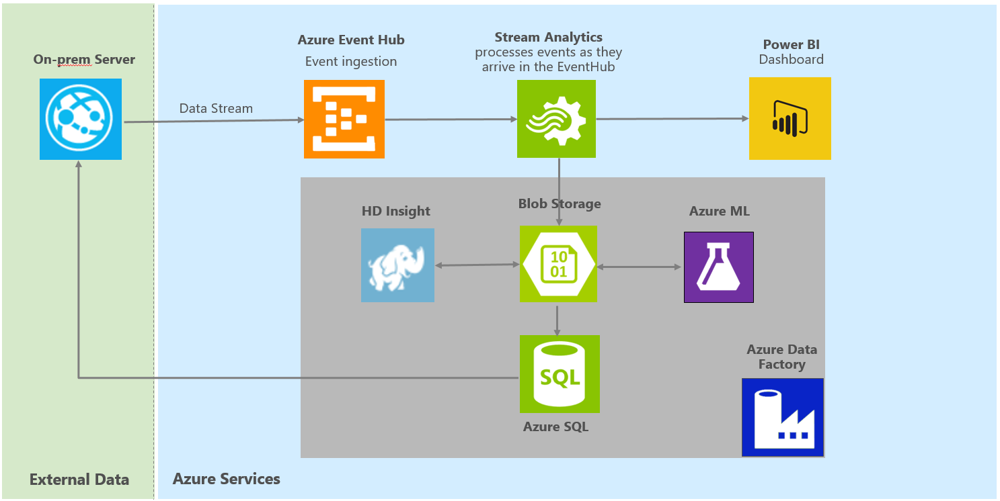
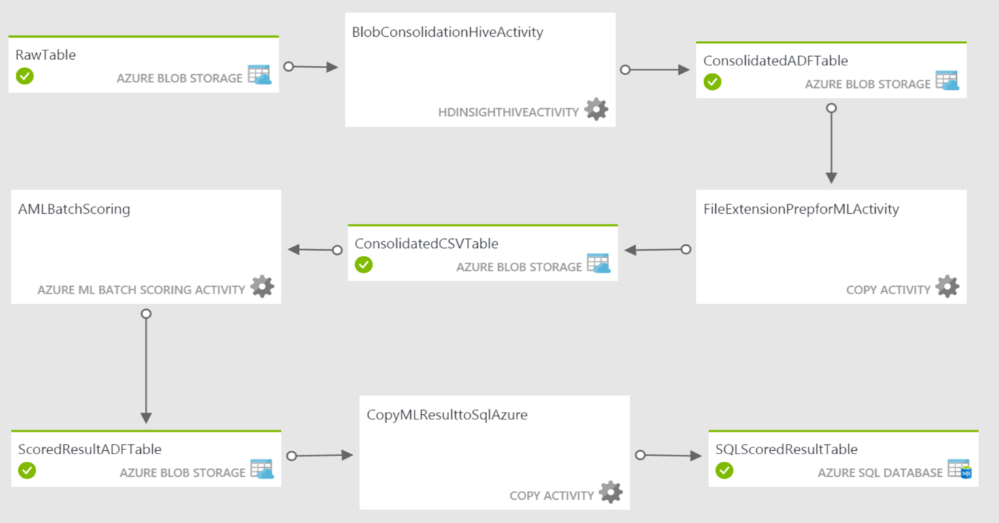

# Create an End-to-End (E2E) Deployment-ready Data Pipeline for Consuming Azure Services: A Step-by-Step Guide #

## Scope ##
This tutorial aims to help users to create an end-to-end (E2E) deployment ready data pipeline for consuming various Azure services in a step-by-step approach. It demonstrates how different components within the Cortana Intelligence Suite, such as Azure Stream Analytics (ASA), Azure Event Hub, Azure Data Factory (ADF), Azure HD Insights (HDI), Azure Machine Learning (AML), Azure SQL Database, and Power BI (PBI), can be assembled to build an E2E solution for data ETL, data analytics, data visualization etc. This guide aims to provide users an E2E pipeline with a basic and general architecture, which can be utilized for various application scenarios, e.g. website traffic monitoring, sensor log data analysis, etc. Please note, it will take about 2-3 hours to finish the entire deployment of the sample pipeline.

## Architecture Overview ##
Figure 1 below shows the overall architecture of the end-to-end (E2E) deployment that this document describes. There are two main paths in this architecture: the hot path is to process and visualize real-time streaming data and the cold path is to build and store more complicated analytics machine learning solutions.

Figure 1: Architecture Overview

The streaming data flows into Event Hub first and then into Azure Stream Analytics where data flow splits into hot path and the cold path. The hot path data flows into Power BI, and can be visualized to monitor the live data stream. The cold path data flows into Blob Storage first, and HD Insight is used for feature engineering. After that, Azure Machine Learning uses a pre-trained scoring model to make predictions based on the new features and the prediction results are written into Azure SQL Database, and finally into the on-prem server. Azure Data Factory is used to orchestrate the data flow for the cold path.

In particular, the data used in the pipeline is simulated via a data generator. The generator generates random data with three fields. Table 1 below shows some sample data. *id* is the unique identifier, and *var1* and *var2* are random integer numbers. Please note, the data generated is for demonstration purpose; users can ingest their own data into Cortana Intelligence Suites and build solutions following the instructions in this tutorial.

ID | var1 | var2
--- | --- | ---
1 | 10 | 25
2 | 17 | 44
3 | 41 | 51
4 | 13 | 2
5 | 44 | 53
6 | 11 | 49
Table 1: Sample data

HD Insight is an Apache Hadoop distribution powered by the cloud. In this tutorial, HD Insight is used to do feature engineering on the original streaming data by providing two additional simple features *var3 = var1 + var2* and *var4 = var1 – var2*. Users can develop complicated feature engineering work based on their own needs.

Azure Machine Learning is a web based analytics tool that users can easily build a predictive model and deploy a web service. In this tutorial, a two class classification model is built and deployed. The predictions are made based on the four features (*var1, var2, var3, var4*) from both the original dataset and feature engineering work on HD Insight. The prediction results written into SQL Database are all the <*id, prediction*> pairs.

## Prerequisites ##
This section contains the required accounts and software to replicate this sample.
1.	The full contents of the files included in GitHub.
2.	A Microsoft Azure subscription.
3.	A [ML Studio account](http://studio.azureml.net)
4.	A Microsoft Office 365 subscription for Power BI access.
5.	A network connection
6.	[SQL Server Management Studio](https://msdn.microsoft.com/en-us/library/mt238290.aspx) or another similar tool to access a SQL server database.
7.	[Microsoft Azure Storage Explorer](http://storageexplorer.com/)

## Setup Steps ##
The remainder of this guide provides step by step instructions on how to create a sample E2E pipeline in user’s own subscription. Each of the steps in this document builds on top of the previous steps and should be followed in the order laid out in this document to minimize confusion and set up errors. Tables are provided for recording important information about each service which will be referenced further down the guide.

In addition, users are suggested to use the following naming format for different services:

&nbsp;&nbsp;&nbsp;&nbsp;&nbsp;&nbsp; sample[SN][UI]

where [SN] is the service name and **[UI] is the user initials**. Characters must be entered in lowercase. Several services, such as Azure Storage, require a unique name for the storage account across a region and hence this format should provide the user with a unique identifier.

### 1. Create Azure Resource Group ###
Azure Resource Group is used to group all relevant services under a single group. For more information about Azure Resource Groups: https://azure.microsoft.com/en-us/documentation/articles/resource-group-overview/
-	Navigate to ***portal.azure.com*** and log into your account
-	Click ***Resource groups*** at the upper left corner of the page
-	In the resource groups page that appears, click ***Add***
-	In Resource group name, type name ***sampleRG[UI]*** where [UI] is the user initials
-	Choose your Azure subscription
-	Set the location to ***East US***
-	Check ***Pin to dashboard***
-	Click ***Create***

### 2. Create Azure Storage Account ###
We will need an Azure storage account for many of the tasks and components used in this pipeline. This section will walk you through creating your own storage account.
-	Navigate to ***portal.azure.com***
-	Click ***+New*** at the upper left corner of the page
-	Select ***Data + Storage*** then ***Storage account***
-	In Name, type ***samplestorage[UI]*** where [UI] is the user initials. Storage accounts need to be uniquely named across Azure
-	Select ***Resource manager*** as deployment model
-	For performance choose ***Standard***
-	For replication choose ***LRS***
-	Choose your Azure subscription
-	Set the resource group to the resource group we created (***sampleRG[UI]***)
-	For Location choose ***East US***
-	Check ***Pin to dashboard***
-	Click ***Create***
-	Wait for the account to be created. When the creation is completed, the pane for the storage account will be automatically loaded. If not, click it from the dashboard
-	In the ***Settings*** pane, click ***Access Keys***
-	Copy ***Storage account name*** and ***Primary access key*** (***key1***) from the displayed dialog to Table 2 below. You will need this information later

Item | Value
---- | -----
Storage Account Name |
Primary Access Key |
Table 2: Storage account information

Once you have created your storage account, you will need to create two containers to store the data and script.
-	Open the ***Microsoft Azure Storage Explorer***
-	Log into your Microsoft account associated with your Azure Subscription
-	Locate the storage account created above, and expand it to see ***Blob Containers*** etc.
-	Create two containers with name ***data*** and ***script***
  - Right click on ***Blob Containers*** and choose ***Create Blob Container***
  - Enter ***data*** as container name, then hit ***enter*** key on the keyboard
  - Right click on ***Blob Containers*** and choose ***Create Blob Container***
  - Enter ***script*** as container name, then hit ***enter*** key on the keyboard
-	Right click ***script*** container and choose ***Open Blob Container Editor***
-	In the right pane, click the arrow on the ***Upload*** button and choose ***Upload Files***
-	Browse to the ***./script/Hive*** folder. Upload the HIVE query file (.hql) that will be used in data processing

### 3. Create Azure Event Hub ###
An Azure Event Hub is a highly scalable service that can ingest millions of records per second. The records can then be pulled from the Event Hub by an Azure Stream Analytics job. At the time of writing, you will need to **navigate to the classic portal** to create a service bus and event hub.
-	Navigate to ***manage.windowsazure.com*** and login into your account
-	In the left pane, click ***Service Bus***
-	Click ***+Create*** in the lower center part of the page. **Do NOT** click ***+New*** in the lower left part of the page.
  -	For Namespace, enter ***sampleEH[UI]-ns***, where [UI] is the user initials. Copy the info into Table 3 below
  -	Leave TYPE as ***Messaging*** and MESSAGING TIER as ***Standard***
  -	Set region as ***East US***
  -	Click the ***check button*** to complete the creation

Wait for the service bus to be created. Then follow the next steps to create event hub that get the incoming stream data.
-	Click the service bus just created in the ***service bus*** list (***sampleEH[UI]-ns***)
-	Click ***Connection information*** at the bottom center of the page
-	Copy the ***Connection String*** into Table 3 below, you will need this information for other steps
-	Click the ***check button*** to exit the pop-up window
-	Click the ***event hubs*** tab at the top pane
-	Click ***create a new event hub***
-	On the pop-up page, choose ***Service Bus/Event Hub/Custom Create***
  -	Enter ***sampleEH[UI]*** as Event hub name, where [UI] is the user initials
  -	Set region to ***East US***
  -	Choose your Azure subscription
  -	In the NAMESPACE drop-down menu choose ***sampleEH[UI]-ns***
  -	Click the next arrow, and enter ***Partition Count*** as 4 and ***Message Retention*** as 7
  -	Click the ***check button*** to complete the creation
  -	Copy the ***Event Hub*** name into Table 3 below
-	Make sure you are currently under the ***sampleEH[UI]-ns*** pane
-	Click the ***Configure*** tab at the top pane (right next to ***scale*** tab)
-	Copy the ***Policy name*** and ***Primary key*** into Table 3 below. Please use the default policy name ***RootManageSharedAccessKey*** and do NOT create new policies

Item | Value
---- | -----
Namespace |
Event Hub Name |
Policy Name |
Primary Key |
Connection String |
Table 3: Event hub information

### 4. Create Azure Stream Analytics Job ###
Azure Stream Analytics (ASA) allows user to create near real-time insights from devices, sensors, infrastructure and applications. In this sample, we create two Azure Stream Analytics jobs that read data from Azure Event Hub. The first job pipes all data from Event Hub into Storage account for later processing. The second job pipes all data from Event Hub into a Power BI data source.
-	Navigate to ***portal.azure.com***, and login into your account
-	Click ***+New*** at the upper left corner of the page
-	Click ***Data + Analytics*** then ***Stream Analytics Job***
-	Enter the job name ***sampleASA[UI]*** where [UI] is the user initials
-	Choose your Azure Subscription
-	Set the resource group to the resource group we created (***sampleRG[UI]***)
-	Choose LOCATION as ***East US***
-	Check ***Pin to dashboard***
-	Click ***Create*** button at the bottom of the page
-	Wait for the service to be created. When the creation is completed, the pane for the stream analytics job will be automatically loaded. If not, click it from the dashboard

Now we create the input that can be used for both jobs.
-	In the section of ***Job Topology***, click ***Inputs***
-	Click ***+Add*** to add an input
-	Change the input alias to ***InputHub***
-	Choose source type as ***data stream***
-	Choose source as ***event hub***
-	Copy the ***service bus namespace*** from Table 3
-	Copy the ***event hub name*** from Table 3
-	Copy the ***event hub policy name*** from Table 3
-	Copy the ***event hub policy key*** from Table 3
-	Leave it ***blank*** for Event hub consumer group
-	Choose ***JSON*** as Event serialization format
-	Click ***create***
-	It may take several minutes for the event hub to be verified

Next, we create the output for the storage account.
-	Go back to the page of stream analytics job. In the section of ***Job Topology***, click ***Outputs***
-	Click ***+Add*** to add an output
-	Change the output alias to ***OutputBlob***
-	Choose ***Blob Storage*** as Sink
-	Copy the ***storage account name*** from Table 2
-	Copy the ***Primary Access Key*** (***key1***) from Table 2
-	Set container name to be ***data***
-	For path pattern, enter ***rawdata/{date}/{time}***
-	For date format, choose ***YYYY-MM-DD***
-	For time format, choose ***HH***
-	For event serialization format, choose ***CSV***
-	For delimiter, choose ***comma***
-	For encoding, choose ***UTF-8***
-	Click ***Create***
-	It may take several minutes for the storage account to be verified

Next, we create the output for the Power BI.
-	Navigate to ***manage.windowsazure.com*** and login into your account
-	Click ***Stream Analytics*** from the left pane and select the stream analytics job we have created (***sampleASA[UI]***)
-	Click the ***Outputs*** tab at the top pane
-	Click ***Add output*** button at the bottom of the page
-	Choose ***Power BI***, then click the arrow next button
-	Click ***Authorize Now*** link under Existing Microsoft Power BI user
-	Login into your Microsoft Power BI account
-	Change the output alias to ***OutputPBI***
-	Enter in ***samplePBI*** as Dataset Name
-	Enter in ***samplePBI*** as Table Name
-	Choose ***My Workspace*** as workspace
-	Click the ***check box*** button to finish the setup

Finally, we create the queries for the ASA jobs.
-	Navigate to ***portal.azure.com***, and login into your account
-	Click the stream analytics job we created (***sampleASA[UI]***) in the dashboard
-	In the section of ***Job Topology***, click ***Query***
-	Copy the following script into the query. It will write all the data within the Event Hub into Blob and Power BI  
  &nbsp;&nbsp;&nbsp;&nbsp;&nbsp;&nbsp; _Select \* into OutputBlob from InputHub; Select \* into OutputPBI from InputHub;_
-	Click ***Save***
-	Go back to the page of stream analytics job. Click the ***Start*** button in the top pane
-	Set job output start time as ***Now*** and click ***Start***
-	It may take several minutes for ASA to get running

### 5. Configure Desktop Application Settings and test Event Hub / Stream Analytics ###
Now that we have the event hub and stream analytics configured, we can configure the data generator and test that the flow to this point is working. In this sample, we use a desktop application that feeds synthetic data to the Event Hub to have the data flow through the services. When you have your Azure Stream Analytics job running, launch the application under ***./Data Generator*** folder.
-	Click ***VisGenerator.exe*** (type: Application)
-	Fill in the ***EventHubName*** and ***Connection String*** info from Table 3
-	Click ***Start*** button to start pushing data into event hub

Now that we have data streaming into the event hub, we can inspect the storage account to see if the flow is working.
-	Open ***Microsoft Azure Storage Explorer***
-	Navigate to the storage account set up previously (***samplestorage[UI]***)
-	Open the blob container ***data***
-	Note that a sub folder ***rawdata*** has been created by the stream analytics job
-	It will take a couple of minutes for the data to seed the blob storage

### 6. Create Azure SQL Server and Database ###
Now that we have completed the ingestion path, we can start building the data processing paths. We will use Azure Data Factory to process the data. To do so we need to set up a couple more services. First is an Azure SQL Database to hold results from Azure Machine Learning Experiment.
-	Navigate to ***portal.azure.com***
-	Click ***+New*** at the upper left corner of the page
-	Select ***Data + Storage*** then ***SQL Database***
-	Enter ***sampleDB[UI]*** as Database Name where [UI] is the user initials. Copy the info into Table 4 below
-	Choose your Azure subscription
-	Set the resource group to the resource group we created (***sampleRG[UI]***)
-	For select source choose ***Blank database***
-	For server, click ***Configure required settings***
-	In Server choose ***Create a new server***
  -	Put the ***server name*** as ***sampleserver[UI]***. Copy the info into Table 4 below
  -	Create a ***login name*** and ***password*** that you will remember. Copy the info into Table 4 below as you will need them later
  -	For Location choose ***East US***
  -	For Create V12 server (Latest update) choose ***Yes***
  -	Check the box for ***Allow Azure services to access server***
  -	Click ***Select***
-	Select ***S0 Standard*** for Pricing tier
-	Use the default value for Collation
-	Check ***Pin to dashboard***
-	Click ***Create***
-	Wait for the database and server to be created. It may take a few minutes
-	Click ***All resources*** at the upper left corner of the page
-	In the search box, enter ***sampleserver[UI]***
-	Click ***sampleserver[UI]***
-	Click ***Show firewall settings*** under the ***Essentials*** section of the SQL server page
  -	Enter ***all-IP*** as rule name
  -	Enter ***0.0.0.0*** for Start IP
  -	Enter ***255.255.255.255*** for End IP
  -	Click ***Save*** at the top ribbon
  -	It will allow user to access the database from the desktop
-	Launch SQL Server Management Studio, or a similar tool, and connect to the database with the information you recorded in Table 4 below. The following instructions are for **SQL Server Management Studio** only.
  -	Choose Authentication as ***SQL Server Authentication***
  -	The full server name is: ***sampleserver[UI].database.windows.net***
-	In the left pane, double click ***database*** then double click ***sampleDB[UI]*** that created earlier
-	Click ***New Query*** located at the tool bar
-	Browse to the ***./script/SQL*** folder. Copy the SQL script located under the folder into the query window, to create the necessary table for the machine learning experiment results and a stored procedure that will be used by Azure Data Factory
-	Click ***Execute*** located at the tool bar

Item | Value
---- | -----
Server Name |
Database Name |
User Name |
Password |
Table 4: SQL database information

### 7. Create Azure Studio ML Workspace and Experiment ###
This section assumes that you have not set up any workspaces for Studio ML but that you do have an account at ***studio.azureml.net***.

The first thing to do is to create a workspace. A workspace is where experiments are running. It is also tied to a storage account for intermediate results during experiment processing.
-	Navigate to ***manage.windowsazure.com*** and login in to your account
-	On the left tab click ***MACHINE LEARNING***
-	In the bottom left corner click ***NEW***
-	Choose ***DATA SERVICES/MACHINE LEARNING/QUICK CREATE***
-	For workspace name, enter ***sampleWS[UI]*** where [UI] is the user initials
-	Set location as ***South Central US***
-	Choose your Azure Subscription
-	Choose ***Create a new storage account***
-	Enter ***sampleamlstorage[UI]*** as storage account name
-	Click ***Create an ML workspace***
-	It may take several minutes to create the ML workspace

Now that we have a workspace to work within, we can copy over the sample experiment from the Gallery. Please note, this sample experiment is for demonstration purposes only. Users can build their own machine learning model following the instructions in this tutorial.
-	Navigate to https://gallery.cortanaintelligence.com/Experiment/0efb6f7689974366a3bde5ddba1e5c2f
-	On the experiment page, click the ***Open in Studio*** button
-	In the dialog box, choose region ***South Central US*** and the workspace just created (***sampleWS[UI]***)
-	Click the ***check button*** to complete the creation
-	It may take several minutes to copy the experiment
-	Click ***Run*** at the bottom of the page. This step may take several minutes to finish
-	Click ***Deploy Web Service*** at the bottom of the page to create the Azure Web Service associated with the experiment. When completed, the browser will redirect to the newly created web service page
  -	The web service home page can also be navigated by clicking the ***Web Services*** button on the left menu of the *studio.azureml.net* page once logged in
-	Copy the ***API key*** into Table 5 below, you will need this information for other steps
-	Click the link for ***Batch Execution*** under the ***API Help Page*** section
-	On the BATCH EXECUTION help page, copy the ***Request URI*** under the ***Request*** section into Table 5 below. Please note, copy only the URI part ***https:…/jobs***, and ignore the URI parameters starting with ***?api***

Item | Value
---- | -----
API Key |
Request URI | Copy only the URI part ***https:…/jobs***, ignore the URI parameters starting with ***?api***
Table 5: Azure ML batch information

### 8. Create Azure Data Factory ###
The Azure Data Factory (ADF) is a key component that connects different Azure components and schedules automatic jobs. It first copies the raw streaming data from blob into HD Insight, and then writes the pre-processed data from HD Insight into blob; It then pipes the pre-processed data into Azure Machine Learning for prediction; Finally, it writes the Azure ML output (the prediction results) into blob and then copies into Azure SQL Database for further inquiries. In addition, Data Factory can also help to write the data in SQL database back to the on-prem server if needed, but we will not cover this part within this tutorial.

The first step is to create the Azure Data Factory:
-	Navigate to ***portal.azure.com***
-	Click ***+New*** at the upper left corner of the page
-	Select ***Data + Analytics*** then ***Data Factory***
-	In Name, type ***sampleADF[UI]*** where [UI] is the user initials
-	Choose your Azure subscription
-	Set the resource group to the resource group we created (***sampleRG[UI]***)
-	Set location to ***West US***
-	Check ***Pin to dashboard***
-	Click ***Create***
-	Wait for the data factory to be created. When the creation is completed, the pane for the data factory will be automatically loaded. If not, click it from the dashboard

Once the ADF is created, there are three main steps needed to finish the setup, which will be explained in the next paragraphs. The first step is to add linked services, which collect different Azure services used in the sample; the second step is to add datasets; the third step is to build a pipeline to connect the services and datasets.

#### Linked Services ####
For this sample we are going to need 4 linked services. To create these linked services, you will need to navigate to ***./script/Hive/LinkedService*** folder to access the scripts.

First, we create the linked service for storage.
-	Click ***Author and Deploy*** button under ***Actions*** section
-	Open script ***StorageLinkedService.txt***, replace the ***Storage Account Name*** and ***Account Key*** in the file with the corresponding info from Table 2. Copy all the content from the modified file
-	Paste the content into the ***empty editor window*** at the right end
-	Click ***Deploy***

Next, we create the linked service for SQL.
-	Open script ***AzureSqlLinkedService.txt***, replace the ***Server Name***, ***Database Name***, ***User Name*** and ***Password*** in the file with the corresponding info from Table 4. Copy all the content from the modified file
-	Paste the content into the ***empty editor window*** at the right end
-	Click ***Deploy***

Next, we create the linked service for Azure ML experiment.
-	Open script ***AzureMLLinkedService.txt***, replace the ***ML endpoint (URI)*** and ***API key*** in the file with the corresponding info from Table 5. Copy all the content from the modified file
-	Paste the content into the ***empty editor window*** at the right end
-	Click ***Deploy***

Finally, we create the linked service for HD Insight.
-	Open script ***HDInsightLinkedService.txt***. Copy all the content from the file
-	Paste the content into the ***empty editor window*** at the right end
-	Click ***Deploy***

#### Datasets ####
For this sample we are going to need 5 datasets. Details of the datasets will be explained in the next subsection. To create these datasets, you will need to navigate to ***./script/Hive/Dataset*** folder to access the scripts. These scripts do NOT need to be modified in any way. For each file:
-	Open the script and copy all the content from the file
-	Paste the content into the ***empty editor window*** at the right end
-	Click ***Deploy***

#### Pipeline ####
For this sample we are going to create 1 pipeline, which connects the 5 datasets created previously and schedules automatic activities. Figure 2 shows the overall architecture of the pipeline. It first copies the raw data from blob (*RawTable* dataset) into HD Insight, and then writes the pre-processed data from HD Insight into blob (*ConsolidatedADFTable* dataset); It then changes the file type to *csv* file (*ConsolidatedCSVTable* dataset) and pipes the pre-processed data into Azure Machine Learning for prediction; Finally, it writes the Azure ML output (the prediction results) into blob (*ScoredResultADFTable* dataset) and then copies into Azure SQL Database (*SQLScoredResultTable* dataset) for further inquiries.

Figure 2: Azure Data Factory Overview

To create the pipeline, you will need to navigate to ***./script/Hive/Pipeline*** folder to access the script. One of the modifications needed on the script is to set the activity period. For a detailed discussion on activity periods, see https://azure.microsoft.com/en-us/documentation/articles/data-factory-create-pipelines/.

At the bottom of each script there is a section that contains the following settings:

&nbsp;&nbsp;&nbsp;&nbsp;&nbsp;&nbsp; "start": "[Start Activity Period UTC]", 
&nbsp;&nbsp;&nbsp;&nbsp;&nbsp;&nbsp; "end": "[End Activity Period UTC]",

These fields identify when the pipeline should be active and are in UTC time. So, if you are in EST and you want to set this active on March 11th from 12:00 PM EST to 5:00 PM EST you would modify these as follows:

&nbsp;&nbsp;&nbsp;&nbsp;&nbsp;&nbsp; "start": "2016-03-15T12:00:00Z", 
&nbsp;&nbsp;&nbsp;&nbsp;&nbsp;&nbsp; "end": "2016-03-16T17:00:00Z",

When the pipelines are active you will incur some expense.
-	Open script ***MLScoringPipeline.txt***, replace the ***Storage Account Name*** in the file (***line 12 & 13***) with the corresponding info from Table 2
-	Change the ***start time*** (***line 141***) to your ***current time*** in ***UTC*** format (see the UTC formatting above)
-	Customize the ***end time*** for your needs (***line 142***)
-	Copy all the content from the modified file
-	Paste the content into the ***empty editor window*** at the right end
-	Click ***Deploy***

Now the data factory is in place. You can see the layout of the factory and the data flow through the pipeline, by navigating to your data factory and clicking ***Diagram***. At this point the data factory is complete. However, since the data factory is scheduled to execute every hour, depending on when you start your generator, it may take up to ***an hour*** to see the prediction results appear in the ***MLResult*** table of SQL Database ***sampleDB[UI]***.

### 9. Setting Up Power BI ###
Power BI can be used to create visualizations for monitoring the live data stream (hot path) as well as to show the prediction results from SQL (cold path). In this sample, we provide some general instructions on how to set up a Power BI dashboard for the hot path. The instructions for setting up the cold path will not be included in the document. For more details of how to use Power BI, please check the tutorial at https://powerbi.microsoft.com/en-us/documentation/powerbi-service-basic-concepts/
-	Navigate to ***www.powerbi.com***, and login into your account
-	On the top left corner, click the ***small icon of three lines*** to ***show the navigation pane***
-	In the navigation pane, find the ***Datasets*** section under ***My Workspace***
-	Click the dataset with name ***samplePBI*** defined in the previous ASA job. Power BI output settings will show up
-	In the ***Fields*** pane at the right end, check ***id***, ***var1***, and ***var2***. The default type of visualization will show up (probably a table)
-	To change the visualization type, click the icons in the ***Visualizations*** pane
-	Click the ***Save*** button at the right top corner
-	Enter the name for the report as ***sampleReport[UI]*** where [UI] is the user initials
-	Click ***Save***
-	Click ***Pin Live Page*** icon on top right corner of the chart, a ***Pin to Dashboard*** window will show up
-	Enter ***sampleDashboard[UI]*** as New dashboard name, then click ***Pin Live***
-	You should find your new dashboard listed under ***Dashboards*** section in the left navigation pane, showing live results from ASA

### 10. Summary ###
Congratulations! If you made it to this point, you have finished the deployment for the entire E2E solution, and data should flow from Event Hub into SQL and Power BI. As another reminder, the data factory will only execute every hour, so results may not appear immediately.
